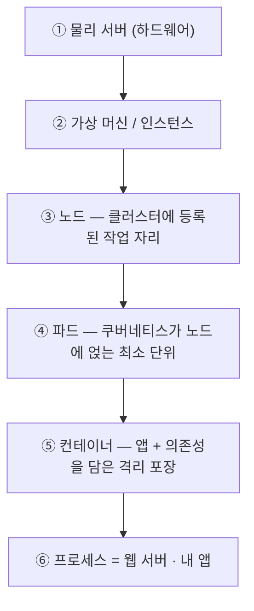
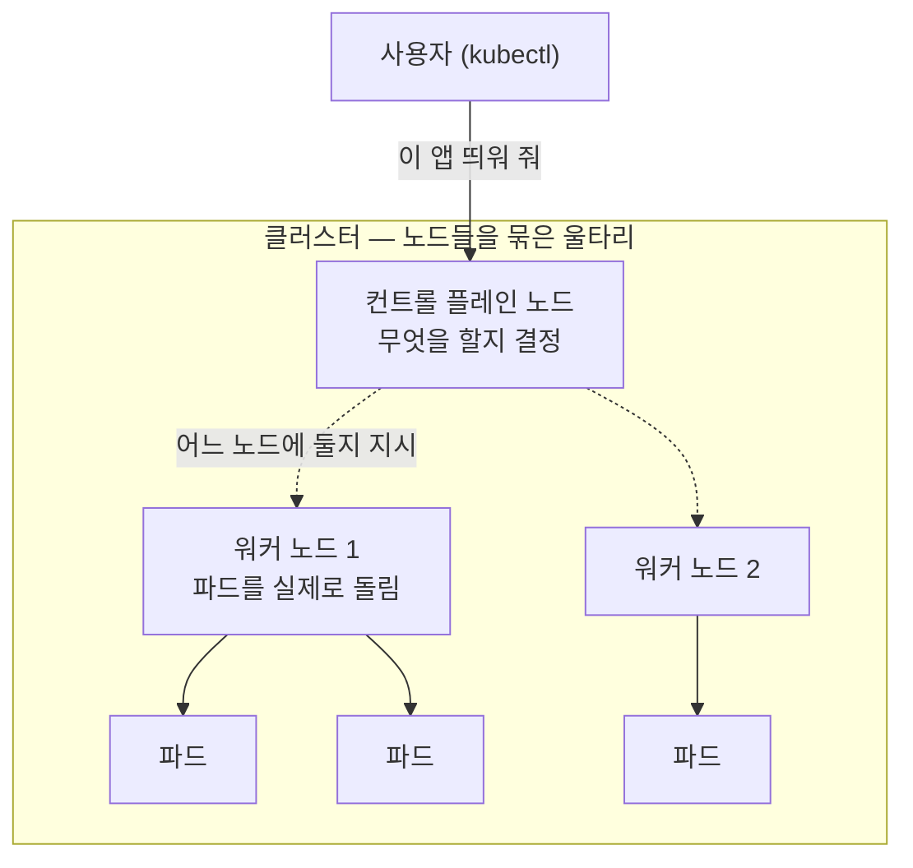
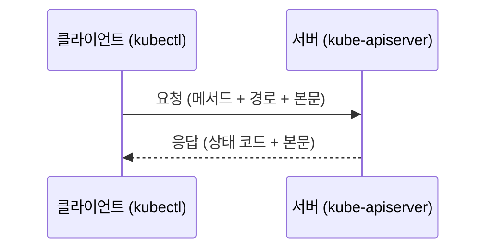

# 1.0 쿠버네티스를 배우기 전에

> **이 절은 원서에 없습니다.** 쿠버네티스 아래에 깔린 기초 용어만 모은 **개념 정리 페이지**입니다. 막히는 항목만 골라 읽으세요.

## 자가 진단

| # | 질문 | 다루는 곳 |
| :---: | :--- | :--- |
| 1 | "서버"라는 말의 두 가지 뜻은? | [§1](#1-서버--노드--웹-서버--용어-지도) |
| 2 | 물리 서버 · 노드 · 파드 · 웹 서버를 아래에서 위로 놓을 수 있나? | [§1](#1-서버--노드--웹-서버--용어-지도) |
| 3 | 클러스터는 노드 위인가, 아래인가? | [§1](#1-서버--노드--웹-서버--용어-지도) |
| 4 | 내가 만든 스프링 부트 앱은 웹 서버인가? | [§1](#1-서버--노드--웹-서버--용어-지도) |
| 5 | 이미지와 컨테이너, 컨테이너와 파드의 차이는? | [§1](#1-서버--노드--웹-서버--용어-지도) |
| 6 | "앱이 떠 있다"는 정확히 무엇이 있다는 뜻인가? | [§2](#2-프로세스) |
| 7 | 한 머신에서 두 앱이 8080 포트를 같이 쓸 수 있나? | [§3](#3-네트워크--ip포트dns) |
| 8 | HTTP 상태 코드 404와 500의 차이는? | [§4](#4-클라이언트-서버와-http-api) |
| 9 | 리눅스 `/etc`에는 뭐가 있나? | [§5](#5-리눅스-최소-지식) |
| 10 | YAML 들여쓰기에 탭을 쓰면? | [§6](#6-yaml-읽는-법) |
| 11 | 무상태와 상태 유지 앱의 차이는? | [§7](#7-무상태-vs-상태-유지) |

---

## 1. 서버 · 노드 · 웹 서버 — 용어 지도

용어가 엉키는 이유는 두 가지뿐입니다.

1. **"서버"에 뜻이 두 개**입니다 — 장비를 가리키기도, 프로그램을 가리키기도 합니다.
2. **물리 서버 · 노드 · 파드 · 컨테이너 · 웹 서버는 경쟁하는 말이 아니라 층이 다른 말**입니다. "이건 노드예요, 서버예요?"라는 질문은 성립하지 않습니다.

### "서버"의 두 가지 뜻

| 뜻 | 무엇을 가리키나 | 예 |
| :--- | :--- | :--- |
| ① **머신** | 전원이 들어가는 컴퓨터 한 대(물리든 가상이든) | "3번 서버가 죽었어" |
| ② **프로그램** | 요청을 받아 응답하는 **프로세스** | 웹 서버(nginx), DB 서버, `kube-apiserver` |

**"서버 개발자"** 의 서버는 ②, **"서버 재부팅했어"** 의 서버는 ①입니다. 지금까지는 머신 하나에 앱 하나라 구분할 일이 없었을 뿐이고, 쿠버네티스에서는 그 1:1이 깨집니다.

> **스터디 용어 규칙:** 머신은 **노드**, 프로그램만 **서버**로 부릅니다.

### 층층이 쌓기 — 물리 서버부터 웹 서버까지



| 층 | 무엇인가 | 우리 실습 환경의 실체 |
| :---: | :--- | :--- |
| ① 물리 서버 | 진짜 장비 | 노트북 1대 (Windows 11) |
| ② 가상 머신 | 장비를 쪼갠 가짜 컴퓨터 | WSL2 VM `podman-machine-default` |
| ③ **노드** | 파드를 얹는 자리 (OS 한 벌 + kubelet) | 컨테이너 `kia-control-plane` |
| ④ **파드** | 배치 단위 (자기 IP를 가짐) | `web` (`10.244.0.5`) |
| ⑤ 컨테이너 | 격리된 실행 포장 | `nginx:alpine` |
| ⑥ 프로세스 | 실제로 일하는 웹 서버 · 앱 | `nginx` |

* **"서버"라는 한 단어가 ②층과 ⑥층에 동시에 쓰입니다.** 그 사이에 노드·파드·컨테이너가 끼어 있습니다.
* 가로가 아니라 **세로**입니다. 하나가 다른 하나를 **품고 있습니다.**
* **장비는 1대인데 층은 6개**입니다. "서버 1대"도 "노드 1개"도 둘 다 맞는 말입니다.

> **노드 1개의 실체는 환경마다 다릅니다.** 베어메탈이면 물리 서버 1대, 클라우드면 VM 1대, kind면 **컨테이너 1개**입니다. `kind-config.yaml`에 `- role: worker` 한 줄을 넣으면 **노트북은 그대로인데 노드가 2개**가 됩니다.

### 클러스터 — 층이 아니라 옆으로 묶은 것

**클러스터(Cluster)는 위 표의 어느 층도 아닙니다.** ③층 노드를 **여러 개 옆으로 묶어 하나처럼 다루는 단위**입니다. 그래서 "클러스터는 노드 위인가요 아래인가요?"라는 질문이 안 풀립니다 — 위아래가 아니라 **울타리**입니다.



| 말 | 뜻 |
| :--- | :--- |
| **클러스터** | 컨트롤 플레인 + 노드들을 묶어 **하나처럼 다루는 전체** |
| **컨트롤 플레인** | **결정하는 쪽**. 어느 노드에 배치할지 정하고 상태를 감시 |
| **워커 노드** | **실제로 파드를 돌리는 쪽** |

* 사용자는 **클러스터에 요청**할 뿐 어느 노드에 둘지 지정하지 않습니다. 파드는 그 결과로 **노드에 배치**됩니다 — 이것이 **인프라 추상화**입니다.
* 노드가 3대든 30대든 사용자에게는 **CPU·메모리가 한 덩어리인 큰 컴퓨터 하나**로 보입니다.
* **우리 kind 클러스터는 노드가 1개**라 그 하나가 컨트롤 플레인과 워커를 겸합니다.

> 컨트롤 플레인 안의 부품(API 서버 · etcd · 스케줄러)과 노드의 부품(kubelet · 컨테이너 런타임)은 [1.2절](<1.2 쿠버네티스 이해하기.md>)에서 다룹니다. 여기서는 **"클러스터 = 노드들의 울타리, 컨트롤 플레인 = 결정, 워커 = 실행"** 세 줄이면 충분합니다.

### 웹 서버 · WAS · 백엔드 앱 · API 서버

넷 다 ⑥층이라 **층이 아니라 하는 일로** 갈립니다.

| 말 | 하는 일 | 예 |
| :--- | :--- | :--- |
| **웹 서버** | HTTP 요청을 받아 정적 파일을 주거나 뒤로 넘김 | nginx, Apache |
| **WAS · 애플리케이션 서버** | 코드를 실행해 동적 응답을 만듦 | 톰캣, 스프링 부트 내장 톰캣 |
| **백엔드 앱** | 내가 짠 코드 | 우리 팀 API |
| **API 서버(`kube-apiserver`)** | **쿠버네티스 자신의** 접수 창구 | — |

> **스프링 부트 앱을 컨테이너로 만들면 "웹 서버를 따로 띄운다"가 아니라 "내 앱이 곧 웹 서버 프로세스"** 입니다. 내장 톰캣이 둘을 겸하므로 컨테이너 안 프로세스는 하나뿐입니다. 앞단에 nginx를 두면 그때 컨테이너가 2개가 됩니다(5장).
>
> **API 서버만 성격이 다릅니다.** 앞의 셋은 내 애플리케이션이고, API 서버는 쿠버네티스 시스템의 구성 요소입니다. **평범한 백엔드 앱은 API 서버와 무관하게 돕니다.**

### 헷갈리는 짝

| 짝 | 가르는 한 줄 |
| :--- | :--- |
| 이미지 vs 컨테이너 | **붕어빵 틀**(디스크의 파일) vs **찍어 낸 붕어빵**(실행 중) |
| 컨테이너 vs 파드 | 파드는 컨테이너를 담는 **봉투**. 컨테이너가 1개여도 파드로 감쌉니다 |
| 파드 vs 노드 | **얹히는 것** vs **얹는 자리** |
| 서비스(Service) vs 서버 | 서비스는 프로세스가 아니라 **고정된 이름·IP를 주는 오브젝트**(11장) |
| 배포 vs 디플로이먼트 | **행위** vs **오브젝트 종류 이름**(14장) |
| 컨트롤 플레인 vs 워커 노드 | **결정하는 쪽** vs **파드를 돌리는 쪽**. kind 단일 노드는 한 노드가 둘 다 |
| kubectl vs 쿠버네티스 | kubectl은 **내 PC의 클라이언트 프로그램**일 뿐 클러스터의 일부가 아닙니다 |
| 리눅스 네임스페이스 vs 쿠버네티스 네임스페이스 | 이름만 같고 무관. **커널 격리**(2.3절) vs **오브젝트 이름 구역**(7장) |

### 서버에 직접 배포하던 방식과 짝짓기

| 지금까지 | 쿠버네티스 | 다루는 곳 |
| :--- | :--- | :--- |
| SSH로 서버 접속 | **접속하지 않습니다.** kubectl이 API 서버에 요청 | 3.1절 |
| `scp`로 jar 올림 | 이미지를 만들어 레지스트리에 push | 2.2절 |
| `java -jar` / systemd 등록 | 매니페스트를 `apply`, kubelet이 실행 | 4.2절 |
| 죽으면 systemd가 재시작 | kubelet의 재시작 정책 | 6장 |
| 서버 2대에 각각 배포 | `replicas: 2` | 14장 |
| nginx로 트래픽 분배 | 서비스 · 인그레스 | 11~12장 |
| `/etc/app.conf` 고치고 재시작 | ConfigMap · Secret | 8~9장 |
| `tail -f /var/log/app.log` | stdout에 찍고 `kubectl logs` | 4.3절 |
| 서버 IP는 고정 | **파드 IP는 재시작마다 바뀜** → 이름(DNS)으로 | 11장 |
| 디스크에 쓴 파일은 남음 | **컨테이너가 죽으면 사라짐** → 볼륨 필요 | 9~10장 |

### 층이 눈에 보이는 실습

같은 nginx 프로세스를 **컨테이너 안**과 **노드**에서 각각 봅니다.

```powershell
kubectl run web --image=docker.io/library/nginx:alpine
kubectl exec web -- ps -o pid,comm                          # PID 1 nginx
podman exec kia-control-plane sh -c "ps -eo pid,comm | grep nginx"   # PID 1773 nginx
kubectl delete pod web --now
```

> **프로세스는 하나뿐입니다.** 컨테이너 안에서는 PID 1, 노드에서는 PID 1773 — 어딘가로 옮겨 담은 게 아니라 **보이는 방식만 바꾼 것**입니다. 이 장치가 **리눅스 네임스페이스**이고 [2.3절](<../02장. 컨테이너 소개/2.3 컨테이너를 가능하게 하는 기술.md>)에서 다룹니다.
>
> `podman ps`로 보면 노드 `kia-control-plane`이 **컨테이너**로 나옵니다. 같은 대상이 podman에게는 컨테이너, 쿠버네티스에게는 노드입니다.

---

## 2. 프로세스

컨테이너는 결국 **격리된 프로세스 하나**입니다.

* **프로그램**: 디스크에 있는 **파일**. 아직 아무 일도 하지 않습니다
* **프로세스**: 그 파일을 메모리에 올려 **실행 중인 상태**. 고유 번호 **PID**를 받습니다
* 같은 프로그램을 3번 실행하면 프로세스 3개 → 나중의 "레플리카 3개"가 이 얘기입니다

| 용어 | 뜻 | 쿠버네티스와의 연결 |
| :--- | :--- | :--- |
| **포그라운드** | 터미널을 붙잡고 도는 실행 | 컨테이너의 메인 프로세스는 포그라운드여야 합니다. 백그라운드로 보내면 컨테이너가 즉시 종료됩니다 |
| **데몬** | 백그라운드에 늘 켜져 있는 프로세스 | 각 노드의 `kubelet` |
| **표준 출력(stdout)** | 화면에 뿜는 글자 | 파일이 아니라 **stdout에 찍은 것**이 로그입니다 (`kubectl logs`) |
| **종료 코드** | 끝날 때 남기는 숫자. `0`이면 정상 | 파드가 `Error`인지 `Completed`인지를 가릅니다 (6장) |
| **SIGTERM** | "정리하고 끝내라"는 정중한 요청 | 파드 삭제 시 **먼저** 보냄 |
| **SIGKILL** | "즉시 죽어라". 거부 불가 | 유예 시간(기본 30초) 초과 시 |

---

## 3. 네트워크 — IP·포트·DNS

11~13장(서비스·인그레스)이 어려운 진짜 이유는 쿠버네티스가 아니라 네트워크 기초입니다.

* **IP**: 컴퓨터(또는 파드) 하나를 가리키는 번호 — `10.244.0.7`
* **포트**: 그 안의 어느 프로그램인지 고르는 번호 — `8080`
* 합쳐서 `10.244.0.7:8080`이 하나의 목적지

| IP 종류 | 예 | 의미 |
| :--- | :--- | :--- |
| **루프백** | `127.0.0.1` | 자기 자신. 밖에서는 닿지 않음 |
| **사설 IP** | `10.x`, `172.16~31.x`, `192.168.x` | 내부망 전용 |
| **공인 IP** | 그 외 | 인터넷에서 접근 가능 |

* **한 머신에서 두 프로그램이 같은 포트로 들을 수 없습니다** — 컨테이너가 각자 IP를 가지면서 사라지는 문제입니다
* **한 파드 안의 컨테이너들은 `localhost`로 통신**합니다 — IP를 공유하기 때문 (5장)
* **파드 IP는 사설 IP**라 클러스터 밖에서 못 붙습니다 → 서비스·인그레스 (11~12장)
* **파드는 재시작마다 IP가 바뀝니다** → 이름으로 부릅니다. 클러스터 안 전화번호부가 **CoreDNS** (11장)

```bash
kubectl port-forward pod/kiada 8080:8080   # 내 PC 8080 → 파드 8080
```

---

## 4. 클라이언트-서버와 HTTP API

쿠버네티스를 다루는 건 결국 **API 서버에 HTTP 요청을 보내는 일**입니다. kubectl도 그냥 HTTP 클라이언트입니다.



| 메서드 | 뜻 | kubectl |
| :--- | :--- | :--- |
| **GET** | 조회 | `get`, `describe` |
| **POST** | 생성 | `create` |
| **PATCH / PUT** | 수정 | `apply`, `edit` |
| **DELETE** | 삭제 | `delete` |

| 상태 코드 | 뜻 | 흔한 상황 |
| :---: | :--- | :--- |
| **200 / 201** | 성공 / 생성됨 | 정상 |
| **401 / 403** | 인증 실패 / 권한 없음 | kubeconfig, RBAC |
| **404** | 없음 | 이름·네임스페이스 오타 |
| **409** | 충돌 | 같은 이름이 이미 있음 |
| **500** | 서버 오류 | 내 요청 잘못이 아님 |

> **401·403·404는 내 요청 문제, 500은 서버 문제**입니다.

---

## 5. 리눅스 최소 지식

컨테이너 안은 그냥 작은 리눅스입니다. 드라이브 문자 없이 **모든 것이 `/` 하나에서** 뻗습니다.

| 경로 | 들어 있는 것 |
| :--- | :--- |
| `/etc` | 설정 파일 (ConfigMap을 파일로 마운트할 때 — 8~9장) |
| `/var/log` | 로그 파일 |
| `/usr/bin`, `/bin` | 실행 파일 |
| `/tmp` | 임시 파일 |

| 개념 | 왜 필요한가 |
| :--- | :--- |
| **의존성·라이브러리** | 앱은 혼자 못 돕니다 → **이 묶음을 통째로 담은 것이 이미지** |
| **환경 변수** | `KEY=value`로 넘기는 설정값. 컨테이너 설정의 기본 수단 (8장) |
| **root와 uid** | `root`(uid 0)로 컨테이너를 돌리면 위험해 나중에 일반 사용자로 낮춥니다 |

```bash
ls -al /etc      cat /etc/hosts      ps aux      env      grep ERROR app.log
```

`kubectl exec`로 들어가면 쓰게 될 명령입니다(4.3절). 다만 **가벼운 이미지에는 셸이 없는 경우가 많아** `kubectl debug`가 따로 있습니다.

> **가상화 한 줄**: VM은 **자기 OS를 통째로** 갖고, 컨테이너는 **호스트 커널을 빌려 씁니다.** 비교표는 [2.1절](<../02장. 컨테이너 소개/2.1 컨테이너 소개.md>)에 있습니다.

---

## 6. YAML 읽는 법

4장부터는 거의 모든 작업이 YAML입니다. 구성 요소는 셋뿐입니다.

```yaml
name: kiada          # 맵 — 키: 값
ports:               # 리스트 — 하이픈
  - 8080
metadata:            # 중첩 — 들여쓰기로 계층
  labels:
    app: kiada
```

리스트 안에 맵이 들어가는 형태가 가장 흔합니다.

```yaml
containers:
  - name: kiada           # ← 하이픈이 항목 시작
    image: kiada:0.1
    ports:
      - containerPort: 8080
  - name: sidecar         # ← 두 번째 항목
    image: envoy:latest
```

| 규칙 | 어기면 |
| :--- | :--- |
| **들여쓰기는 스페이스만.** 탭 금지 | 파싱 에러 |
| 같은 계층은 칸 수 일치 | 엉뚱한 계층으로 들어감 |
| `키: 값` — **콜론 뒤 공백 필수** | 값으로 인식 안 됨 |
| `version: "3.11"`, `enabled: "no"` | 따옴표가 없으면 숫자·불리언이 됨 |
| `---` | 한 파일에 여러 객체를 담는 구분선 |

> **YAML은 JSON의 사람용 표기법**입니다. API 서버는 결국 JSON으로 받습니다.
> `apiVersion` · `kind` · `metadata` · `spec` 네 칸짜리 틀은 [3장](<../03장. 쿠버네티스 API와 오브젝트 모델 살펴보기>)에서 다룹니다.

---

## 7. 무상태 vs 상태 유지

| | **무상태(Stateless)** | **상태 유지(Stateful)** |
| :--- | :--- | :--- |
| 데이터 | 자기 안에 저장하지 않음 | 자기 디스크에 저장 |
| 예 | 웹 서버, API 서버 | 데이터베이스, 메시지 큐 |
| 복제 | 아무나 붙어도 됨 — 쉬움 | 각자 다른 데이터 — 어려움 |
| 죽으면 | 새로 띄우면 끝 | **데이터를 잃음** |

> **컨테이너 안에 쓴 파일은 컨테이너가 죽으면 사라집니다.** 이 한 문장이 볼륨(9장) · PersistentVolume(10장) · 스테이트풀셋(16장)의 출발점입니다.

---

## 8. PowerShell과 bash 차이

| 하려는 일 | bash | PowerShell |
| :--- | :--- | :--- |
| 환경 변수 설정 | `export KEY=value` | `$env:KEY = "value"` |
| 환경 변수 읽기 | `$KEY` | `$env:KEY` |
| 줄바꿈 | `\` | `` ` `` |
| 앞부분만 보기 | `\| head -5` | `\| Select-Object -First 5` |
| 결과 숨기기 | `> /dev/null` | `> $null` |

kubectl 명령 자체는 양쪽에서 똑같습니다.

---

## 요약 및 비유

| 개념 | 첫 출근 비유 | 기술적 의미 |
| :--- | :--- | :--- |
| 클러스터 | 회사 전체 | 하나로 취급되는 자원 묶음 |
| ① 물리 서버 | 회사 건물 | 실제 하드웨어 |
| ② 가상 머신 | 건물을 쪼갠 임대 사무실 | 하드웨어를 나눈 가상 컴퓨터 |
| ③ 노드 | 책상 한 자리 | 파드를 얹는 자원 단위 |
| ④ 파드 | 그 자리에 배정된 한 팀 | 배치 단위 |
| ⑤ 컨테이너 | 직원 한 명의 칸막이와 도구 | 격리 포장 |
| ⑥ 웹 서버 · 내 앱 | 실제로 일하는 직원 | 요청을 처리하는 프로세스 |
| 이미지 | 표준 장비 세트 | 컨테이너를 찍어 내는 템플릿 |
| IP : 포트 | 사무실 호수 : 내선번호 | 네트워크 목적지 |
| DNS | 사내 전화번호부 | 이름 → IP |
| YAML | 결재 양식 작성 규칙 | 설정 표기법 |
| 무상태 / 상태 유지 | 아무나 대신할 수 있는 일 / 그 사람만 아는 일 | 데이터를 자기 안에 갖는지 |

## 결론

* **"서버"는 머신과 프로그램 두 뜻으로 쓰입니다.** 머신은 **노드**로 부르면 혼선이 사라집니다.
* **물리 서버 → 가상 머신 → 노드 → 파드 → 컨테이너 → 프로세스(웹 서버)** 순서 하나면 용어 질문 대부분이 풀립니다.
* **클러스터만 층이 아니라 울타리**입니다. 노드를 옆으로 묶은 것이고, 그 안에서 **컨트롤 플레인은 결정 · 워커 노드는 실행**을 맡습니다.
* **노드는 하드웨어가 아니라 클러스터에 등록된 자리**입니다. kind에서는 컨테이너 하나가 노드 하나입니다.
* **컨테이너는 격리된 프로세스**입니다. 프로세스·stdout·종료 신호를 알면 4~6장이 쉬워집니다.
* **IP·포트·DNS와 YAML 문법**은 미리 다져 두면 11~13장 난이도가 크게 내려갑니다.
