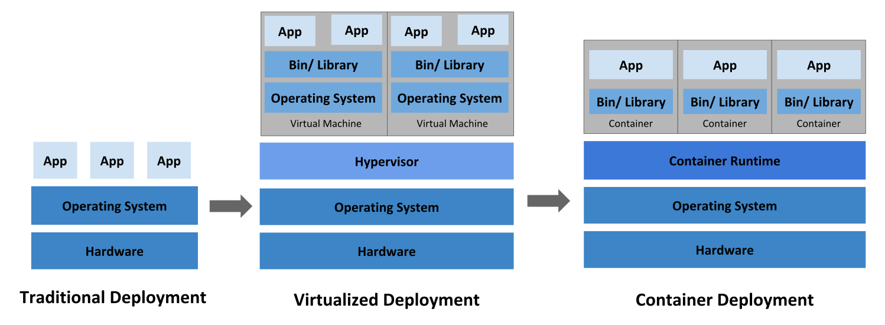
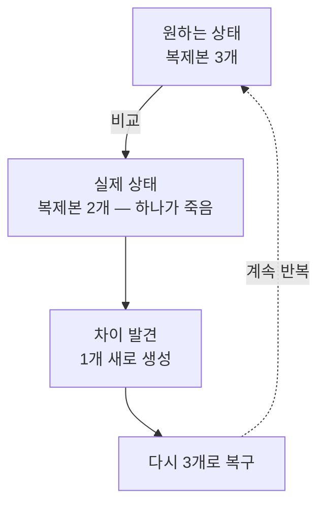

# 1.1 쿠버네티스 소개

쿠버네티스(Kubernetes)는 **여러 대의 컴퓨터를 한 대처럼 묶어서, 그 위에 프로그램을 자동으로 배치하고 관리해 주는 시스템**입니다. 이름은 '키잡이'를 뜻하는 그리스어 κυβερνήτης에서 왔습니다. 배를 모는 사람처럼, 수많은 컨테이너를 목적지까지 안전하게 몰아 준다는 뜻입니다.

> **K8s는 뭔가요?**
> `Kubernetes`에서 첫 글자 `K`와 마지막 글자 `s` 사이에 글자가 8개(`ubernete`) 있어서 **K8s**라고 줄여 씁니다. 읽을 때는 그냥 "쿠버네티스" 또는 "케이8에스"라고 합니다.

## 왜 쿠버네티스가 필요했을까요?

### 옛날 방식: 서버 한 대에 프로그램 하나

예전에는 프로그램 하나를 서버 한 대에 직접 설치했습니다. 문제가 세 가지 있었습니다.

* **자원 낭비**: 서버 성능의 10%만 쓰는데도 서버 한 대를 통째로 차지합니다.
* **장애에 취약**: 그 서버가 꺼지면 서비스도 같이 멈춥니다. 사람이 새벽에 일어나 고쳐야 합니다.
* **확장이 느림**: 사용자가 갑자기 몰리면 서버를 주문하고 설치하는 데 며칠이 걸립니다.

### 그럼 한 서버에 여러 개를 올리면 되지 않나요?

 **서비스들이 OS 하나를 통째로 공유**하기 때문에 새로운 문제가 생겼습니다.

| 문제 | 무슨 일이 벌어지나 |
| :--- | :--- |
| **의존성 충돌** | A는 Python 3.8, B는 3.11이 필요한데 서버 한 대에는 하나만 깔 수 있습니다 |
| **환경 변수 충돌** | 환경 변수는 서버 전체가 공유합니다. 둘 다 `DB_HOST`를 원하면 한쪽이 엉뚱한 DB를 바라봅니다 |
| **포트 충돌** | 둘 다 8080에서 듣고 싶어도 한 대에서는 하나만 가능합니다 |
| **설정·로그 뒤섞임** | `/etc/` 설정이 겹치고, 로그가 한곳에 쌓여 누구 것인지 구분이 안 됩니다 |
| **장애 파급** | A가 메모리를 다 쓰면 OOM Killer가 **엉뚱한 B를 죽입니다** |
| **성능 간섭** | A가 CPU를 독점하면 같은 서버의 모든 서비스가 느려집니다 (Noisy Neighbor) |
| **재부팅 파급** | A 하나 때문에 서버를 재부팅하면 B와 C도 같이 내려갑니다 |
| **보안 격리 없음** | A가 뚫리면 같은 서버의 다른 서비스 파일까지 들여다볼 수 있습니다 |

핵심은 **한 서비스의 문제가 옆으로 번진다**는 것입니다. 죄 없는 서비스가 같이 죽는데 원인 찾기도 어렵습니다.

### 그래서 필요했던 것

| 방식 | 자원 효율 | 격리 |
| :--- | :--- | :--- |
| 서버 1대에 서비스 1개 | X 나쁨 | O 완벽 |
| 서버 1대에 서비스 여러 개 | O 좋음 | X 없음 |

**"자원은 나눠 쓰되, 서로 완전히 격리되게 하자."** 이 두 마리 토끼를 잡으려는 시도가 **가상화**였고, 더 가볍게 해낸 것이 **컨테이너**였습니다. 쿠버네티스는 이 흐름의 끝에서 등장합니다.

> 출처: [Kubernetes Documentation — Overview](https://kubernetes.io/docs/concepts/overview/) © The Kubernetes Authors, [CC BY 4.0](https://creativecommons.org/licenses/by/4.0/)

### 서비스가 잘게 쪼개지면서 생긴 새로운 문제

요즘 서비스는 하나의 거대한 프로그램(모놀리스)이 아니라, 기능별로 잘게 나눈 **마이크로서비스** 수십~수백 개로 이루어집니다.

| | 모놀리스(Monolith) | 마이크로서비스(Microservices) |
| :--- | :--- | :--- |
| 구조 | 모든 기능이 한 덩어리 | 기능별로 독립된 작은 프로그램 |
| 배포 | 한 줄 고쳐도 전체를 다시 배포 | 고친 부분만 따로 배포 |
| 확장 | 전체를 통째로 복제 | 바쁜 부분만 골라서 복제 |
| 단점 | 덩치가 커서 느리고 위험함 | **관리할 조각이 너무 많아짐** |

마이크로서비스는 개발은 편해졌지만, **"이 수백 개 조각(컨테이너)을 누가 어느 서버에 배치하고, 죽으면 누가 살리지?"** 라는 새로운 문제를 만들었습니다. 이 문제를 사람 대신 풀어 주는 것이 쿠버네티스입니다.

## 쿠버네티스가 하는 일

쿠버네티스는 **컨테이너 오케스트레이션(Container Orchestration)** 도구입니다. 오케스트라 지휘자가 수십 명의 연주자에게 "언제, 무엇을" 연주할지 지시하듯, 수많은 컨테이너를 조율합니다.

핵심은 **선언적 모델(Declarative Model)** 입니다.

* **명령형(Imperative)**: "3번 서버에 접속해서, 프로그램을 실행하고, 로그를 확인해라" — **과정**을 일일이 지시
* **선언형(Declarative)**: "이 앱이 항상 3개 떠 있어야 해" — **결과**만 선언

선언형으로 목표만 알려 주면, 쿠버네티스가 알아서 현재 상태를 목표 상태에 맞춥니다. 이때 두 가지 개념이 중요합니다.

* **원하는 상태(Desired State)**: 사용자가 "이렇게 되어야 한다"고 선언한 목표
* **실제 상태(Actual State)**: 지금 클러스터에서 실제로 벌어지고 있는 상황

쿠버네티스는 이 둘을 끊임없이 비교하면서 차이를 메웁니다. 이 반복 과정을 **조정 루프(Reconciliation Loop)** 라고 합니다.

## 쿠버네티스의 대표 기능

1. **자동 배치(Scheduling)**: 어느 서버에 여유가 있는지 계산해서 알맞은 곳에 프로그램을 배치합니다.
2. **자동 복구(Self-healing)**: 프로그램이 죽으면 감지해서 즉시 새로 띄웁니다. 서버가 통째로 꺼지면 다른 서버로 옮겨 줍니다.
3. **수평 확장(Horizontal Scaling)**: 트래픽이 몰리면 복제본 개수를 늘리고, 한가해지면 줄입니다.
4. **무중단 배포(Rolling Update)**: 새 버전을 조금씩 교체해서 서비스를 멈추지 않고 업데이트합니다.
5. **서비스 디스커버리 & 로드밸런싱**: 프로그램들이 서로를 이름으로 찾고, 요청을 골고루 나눠 받게 합니다.

## 쿠버네티스의 기원

구글은 오래전부터 **보그(Borg)** 와 **오메가(Omega)** 라는 내부 시스템으로 수십억 개의 컨테이너를 운영해 왔습니다. 2014년, 구글은 이 노하우를 바탕으로 쿠버네티스를 만들어 **오픈소스로 공개**했습니다.

2015년부터는 구글이 아닌 **CNCF(Cloud Native Computing Foundation)** 라는 중립 재단이 관리합니다. 특정 회사 소유가 아니기 때문에 어떤 클라우드에서도 똑같이 쓸 수 있고, 이것이 쿠버네티스가 업계 표준이 된 큰 이유입니다.

---

## 요약 및 비유

| 개념 | 급식실 비유 | 기술적 의미 |
| :--- | :--- | :--- |
| **쿠버네티스** | 급식실 전체를 총괄하는 영양사 선생님 | 컨테이너 오케스트레이션 플랫폼 |
| **컨테이너** | 배식대에 올라간 반찬통 하나 | 격리되어 실행되는 애플리케이션 |
| **선언적 모델** | "김치는 항상 3통 채워 두세요" | 원하는 상태(Desired State)만 기술 |
| **조정 루프** | 통이 비면 바로 새로 채우는 순찰 | 실제 상태를 원하는 상태로 수렴 |
| **자동 복구** | 반찬통이 엎어지면 즉시 새 통 투입 | Self-healing |
| **수평 확장** | 점심시간에 배식대를 2줄 더 여는 것 | Horizontal Scaling |

---

## 결론

* 쿠버네티스는 **여러 서버를 하나의 거대한 컴퓨터처럼 다루게 해 주는 추상화 계층**입니다.
* 개발자는 "어느 서버에 넣을지" 고민하지 않고 **"무엇이 몇 개 필요한지"만 선언**하면 됩니다.
* 마이크로서비스 시대에 폭증한 관리 부담을 자동화로 해결하며, 구글의 검증된 기술이 오픈소스로 공개된 결과물입니다.

---

## 📌 공식 문서 업데이트 (2026년 8월 기준)

책이 쓰인 시점과 지금의 차이입니다. 공식 문서: <https://kubernetes.io/docs/>

* **현재 최신 안정 버전은 1.36** 입니다(2026-06-09 릴리스). 책의 예제는 대략 1.24~1.27 시절 기준이라, 실습하다 보면 명령 결과가 조금씩 다를 수 있습니다.
* 쿠버네티스는 **최신 3개 마이너 버전만 패치를 지원**합니다. 지금 지원되는 버전은 1.34 / 1.35 / 1.36 뿐입니다. 학습용으로 클러스터를 만들 때는 최신 버전을 쓰는 것이 좋습니다.
* 이 절의 개념(선언형 모델, 자동 복구, 오케스트레이션)은 쿠버네티스의 **근본 설계 철학이라 바뀌지 않았습니다.** 안심하고 그대로 이해하면 됩니다.
