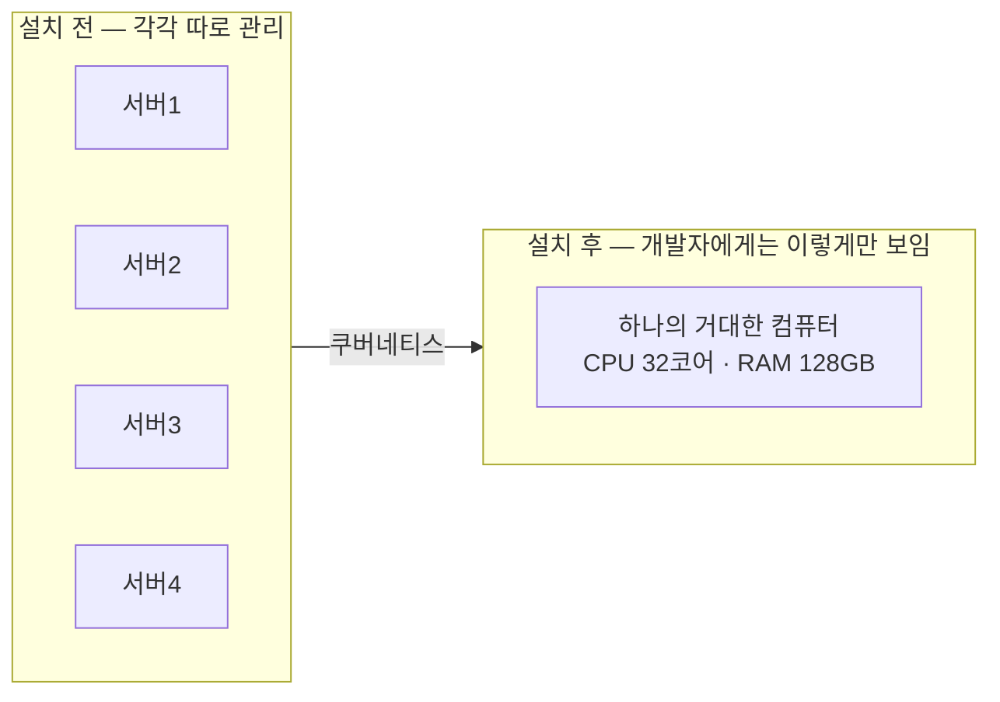
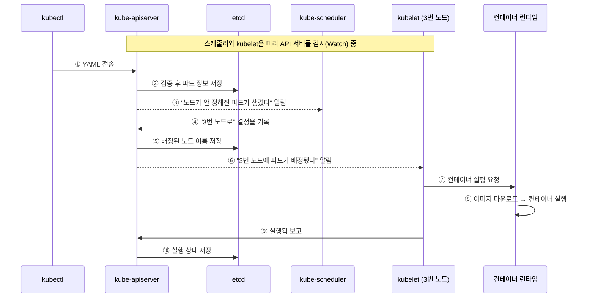

# 1.2 쿠버네티스 이해하기

이 절에서는 쿠버네티스가 **어떻게** 여러 대의 컴퓨터를 한 대처럼 보이게 만드는지, 그리고 그 내부에 어떤 부품이 들어 있는지 살펴봅니다.

## 클러스터: 여러 대를 한 대처럼

**클러스터(Cluster)** 는 쿠버네티스가 관리하는 컴퓨터들의 묶음입니다. 클러스터에 들어가는 컴퓨터 한 대를 **노드(Node)** 라고 부릅니다.

쿠버네티스를 설치하기 전과 후는 이렇게 달라집니다.

이것을 **인프라 추상화(Infrastructure Abstraction)** 라고 합니다. 개발자는 "3번 서버의 IP가 뭐지?"를 알 필요가 없습니다. 그냥 "이 앱 띄워 줘"라고 하면 쿠버네티스가 알아서 여유 있는 노드를 골라 배치합니다.

## 노드의 두 가지 종류

| 종류 | 역할 | 비유 |
| :--- | :--- | :--- |
| **컨트롤 플레인 노드** | 클러스터 전체를 지휘하고 결정 | 학교 교무실 |
| **워커 노드(Worker)** | 실제 프로그램(컨테이너)이 돌아감 | 각 교실 |

보통 컨트롤 플레인은 안정성을 위해 **3대 이상 홀수 개**로 구성합니다. 

### 왜 하필 3대이고, 왜 홀수일까요?

etcd는 **과반수(Quorum)가 살아 있어야만** 동작합니다.

| 전체 대수 | 과반수 | 버틸 수 있는 고장 |
| :---: | :---: | :--- |
| 1 | 1 | 0대 |
| 3 | 2 | **1대** |
| 4 | 3 | 1대 — 3대와 같은데 비용만 더 듦 |
| 5 | 3 | 2대 |

* **3대인 이유**: 한 대가 죽어도 버티는 **최소 구성**입니다.
* **홀수인 이유**: 4대는 3대와 버티는 고장 수가 같아서 **짝수는 손해**입니다.
* **과반수를 쓰는 이유**: 네트워크가 반으로 갈라져도(**스플릿 브레인**) 과반수는 한쪽에만 존재하므로, 결정권을 가진 쪽이 항상 하나뿐입니다.

정식 명칭은 **쿼럼(Quorum) 기반 합의**이고, etcd가 쓰는 알고리즘은 **Raft**입니다. 공식으로 쓰면 **고장 1대를 버티려면 3대, 2대를 버티려면 5대**가 필요합니다.

> **3대는 컨트롤 플레인만의 개수입니다.** 워커 노드는 이 규칙과 무관하니 필요한 만큼 두면 되고 짝수여도 됩니다. 관리형 서비스(EKS·GKE 등)는 컨트롤 플레인을 클라우드가 이중화해 주므로 신경 쓸 필요가 없습니다.

## 클러스터 전체 구조

지금까지 본 노드 구분과 앞으로 설명할 부품들이 어디에 배치되는지, 공식 문서 그림으로 한눈에 확인합니다.

> 출처: [Kubernetes Documentation — Cluster Architecture](https://kubernetes.io/docs/concepts/architecture/) © The Kubernetes Authors, [CC BY 4.0](https://creativecommons.org/licenses/by/4.0/)

## 컨트롤 플레인(Control Plane) 구성 요소

컨트롤 플레인은 "무엇을 할지 결정하는 두뇌"입니다. 네 가지 부품이 핵심이고, 클라우드에서는 하나가 더 붙습니다.

### 1) kube-apiserver — 클러스터의 정문

* 모든 요청이 **반드시** 거쳐 가는 유일한 출입구입니다.
* 사용자의 `kubectl` 명령도, 내부 부품끼리의 대화도 전부 여기를 통합니다.
* 요청이 올바른지 확인한 뒤 **etcd에 저장합니다.**

> 서로 직접 통신하지 않고 **무조건 API 서버를 통해서만** 대화합니다. 덕분에 보안 검사를 한 곳에서만 하면 되고, 부품 하나를 갈아 끼워도 나머지가 영향을 받지 않습니다.

### 2) etcd — 클러스터의 유일한 기억장치

* 클러스터의 **모든 상태 정보를 저장하는 데이터베이스**입니다. 키-값 저장소 형태입니다.
* "파드가 몇 개인지, 어느 노드에 있는지, 설정값이 무엇인지"가 전부 여기 들어 있습니다.
* **etcd가 날아가면 클러스터 전체를 잃습니다.** 서버는 멀쩡해도 "무엇을 띄워야 하는지"에 대한 기록이 전부 사라집니다.

### 3) kube-scheduler — 자리 배치 담당

* 아직 노드가 정해지지 않은 새 파드를 발견하면, **어느 노드에 놓을지 결정**합니다.
* 판단 기준: 남은 CPU·메모리, 하드웨어 조건 등
* 스케줄러는 **결정만 하고 직접 실행하지는 않습니다.** "3번 노드로 가"라는 결정을 API 서버를 통해 etcd에 기록만 해 둡니다.

### 4) kube-controller-manager — 감시자들의 집합

* 여러 개의 **컨트롤러**를 한데 모아 실행하는 프로세스입니다.
* 각 컨트롤러는 자기가 맡은 대상을 계속 지켜보며 원하는 상태와 실제 상태를 맞춥니다.
  * **노드 컨트롤러**: 노드가 죽었는지 감시
  * **잡 컨트롤러**: 일회성 작업 관리
  * **엔드포인트슬라이스 컨트롤러**: 서비스와 파드를 연결
  * **서비스어카운트 컨트롤러**: 기본 계정 생성

### 5) cloud-controller-manager — 클라우드 전용 부품

* AWS·GCP 같은 **클라우드에서만 추가로 실행됩니다.** 로드밸런서 생성 같은 클라우드 전용 작업을 맡으며, 직접 만든 온프레미스 클러스터에는 없습니다.

## 워커 노드(Worker) 구성 요소

워커 노드는 "실제로 일하는 손발"입니다.

### 1) kubelet — 각 노드의 반장

* 모든 노드에 하나씩 설치되어 **늘 켜져 있는 관리 프로그램**입니다.
* API 서버로부터 지시를 받아 **container-runtime에게 실행을 시킵니다.**
* 컨테이너가 살아 있는지 계속 확인하고, 상태를 API 서버에 보고합니다.

### 2) container-runtime — 실제로 컨테이너를 돌리는 엔진

* 컨테이너 이미지를 내려받고, 실행하고, 종료시키는 실무자입니다.
* **CRI(Container Runtime Interface)** 라는 표준 규격만 지키면 어떤 런타임이든 쓸 수 있습니다.
* 현재 표준으로 쓰이는 것: **containerd**(대부분의 클러스터 기본값), **CRI-O**(주로 OpenShift)

### 3) kube-proxy — 네트워크 교통정리

* 서비스로 들어온 요청을 실제 파드로 전달하는 **네트워크 규칙**을 관리합니다.
* 여러 복제본이 있으면 요청을 골고루 나눠 줍니다(로드밸런싱).

## 앱을 배포하면 실제로 벌어지는 일

* `kubectl apply -f app.yaml` 한 줄을 실행했을 때의 흐름입니다.

점선 화살표(`-->`)가 **감시에 의한 알림**입니다. 여기에 이 절의 핵심이 다 담겨 있습니다.

* **모든 화살표가 API 서버를 거칩니다.** 스케줄러와 kubelet은 서로 직접 대화하지 않고, etcd에 직접 접근하지도 않습니다.
* **아무도 명령을 받으러 다니지 않습니다.** 각 부품은 API 서버에 감시를 걸어 두고 기다리다가, 자기 일이 생기면 알림을 받고 스스로 움직입니다.
* 이 방식을 **감시(Watch) 기반 아키텍처**, 넓게는 **이벤트 기반(Event-driven)** 방식이라고 합니다. 유튜브 알림 설정처럼, 계속 새로고침하는 대신 **변화가 생길 때 알려 주는** 구조입니다.
* 알림은 **"뭔가 바뀌었으니 확인해 봐"** 라는 신호일 뿐입니다. 부품은 알림 내용을 그대로 처리하는 게 아니라, **전체 상태를 다시 보고 목표에 맞춥니다.** 1.1절의 조정 루프가 바로 이것입니다.
* 그래서 **알림을 몇 번 놓쳐도 결과가 같습니다.** 3개여야 하는데 2개면, 알림을 한 번 받든 열 번 받든 결국 1개를 만들면 끝입니다. 부품 하나가 잠깐 죽어도 나머지가 계속 돌아가는 이유입니다.

---

## 요약 및 비유

| 구성 요소 | 학교 비유 | 기술적 역할 |
| :--- | :--- | :--- |
| **kube-apiserver** | 교무실 민원 창구 | 모든 요청의 단일 출입구, 인증·검증 |
| **etcd** | 학교 생활기록부 저장고 | 클러스터 모든 상태를 저장하는 DB |
| **kube-scheduler** | 반 배정 담당 선생님 | 파드를 어느 노드에 놓을지 결정 |
| **controller-manager** | 각 담당 부장 선생님들 | 원하는 상태와 실제 상태를 계속 맞춤 |
| **kubelet** | 각 반의 반장 | 노드에서 컨테이너 실행·감시·보고 |
| **container-runtime** | 실제로 일하는 학생 | 이미지를 받아 컨테이너를 실행 |
| **kube-proxy** | 복도 안내 도우미 | 요청을 알맞은 파드로 전달 |

---

## 결론

* 클러스터는 **컨트롤 플레인(두뇌) + 워커 노드(손발)** 로 나뉩니다.
* 모든 통신은 **kube-apiserver를 통해서만** 이루어지고, 모든 상태는 **etcd**에 저장됩니다.
* 각 부품은 명령을 받는 것이 아니라 **API 서버를 감시하다가 스스로 움직입니다.** 이 느슨한 구조가 쿠버네티스의 안정성과 확장성의 비결입니다.

---

## 공식 문서 업데이트 (2026년 8월 기준)

공식 문서 <https://kubernetes.io/docs/concepts/architecture/> 와 비교했을 때 달라진 점입니다.

### 1) "마스터 노드"라는 말은 이제 쓰지 않습니다

책이나 오래된 자료에는 **master node**라고 나오지만, 공식 문서는 **control plane node**로 용어를 바꿨습니다. 노드에 붙는 레이블도 예전 `node-role.kubernetes.io/master`에서 **`node-role.kubernetes.io/control-plane`** 으로 변경되었고, 옛 레이블은 제거되었습니다. 자격증 시험(CKA 등)에서도 새 용어를 씁니다.

### 2) Docker는 더 이상 컨테이너 런타임이 아닙니다 (매우 중요)

책에서는 컨테이너 런타임으로 Docker를 자연스럽게 이야기하지만, **쿠버네티스 1.24에서 dockershim이 완전히 제거**되었습니다.

* 지금 쿠버네티스가 지원하는 런타임은 **containerd**, **CRI-O** 같은 **CRI 규격 구현체**뿐입니다.
* 다만 **Docker로 이미지를 만드는 것은 여전히 문제없습니다.** 이미지 형식이 OCI 표준으로 통일되어 있어서, `docker build`로 만든 이미지를 containerd가 그대로 실행합니다.
* 즉 **"이미지 빌드 도구로서의 Docker"는 그대로, "런타임으로서의 Docker"는 퇴출**되었다고 정리하면 됩니다.
* 관련 문서: <https://kubernetes.io/docs/tasks/administer-cluster/migrating-from-dockershim/>

### 3) kube-proxy는 이제 "선택 사항"입니다

공식 문서는 kube-proxy를 **optional** 로 표기합니다. Cilium 같은 최신 네트워크 플러그인이 eBPF 기술로 같은 기능을 더 빠르게 대신할 수 있어서, kube-proxy 없이 도는 클러스터도 흔해졌습니다.

### 4) Endpoints 대신 EndpointSlice

컨트롤러 목록에 예전에는 **Endpoints 컨트롤러**가 있었지만, 지금 공식 문서는 **EndpointSlice 컨트롤러**를 소개합니다. 파드가 수천 개로 늘어날 때 기존 Endpoints 객체 하나가 너무 커지는 문제를 여러 조각으로 쪼개서 해결한 것입니다. 자세한 내용은 11장에서 다시 나옵니다.
