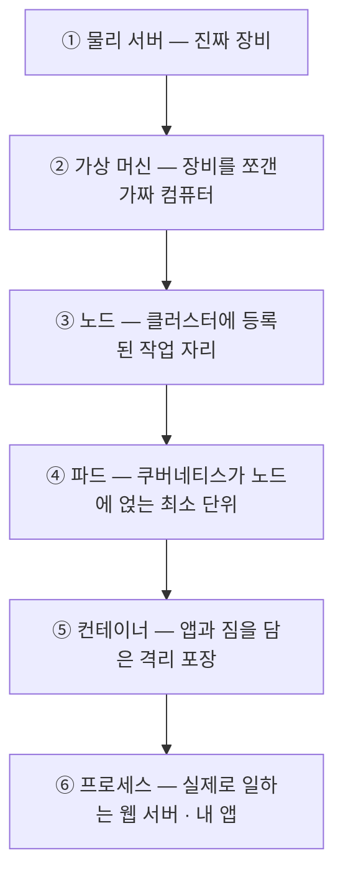
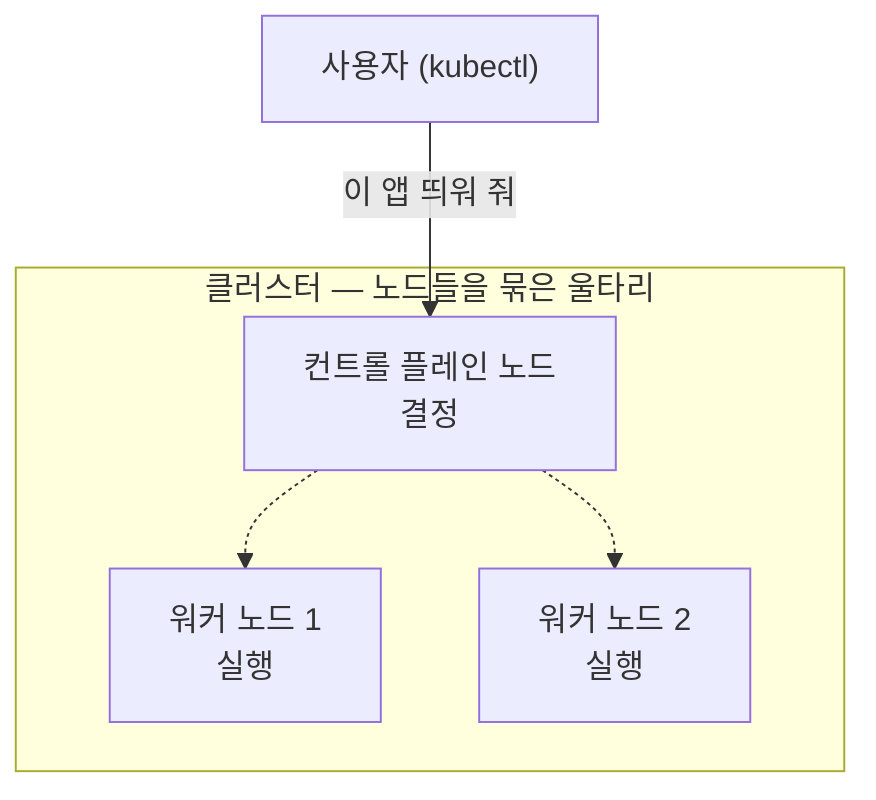
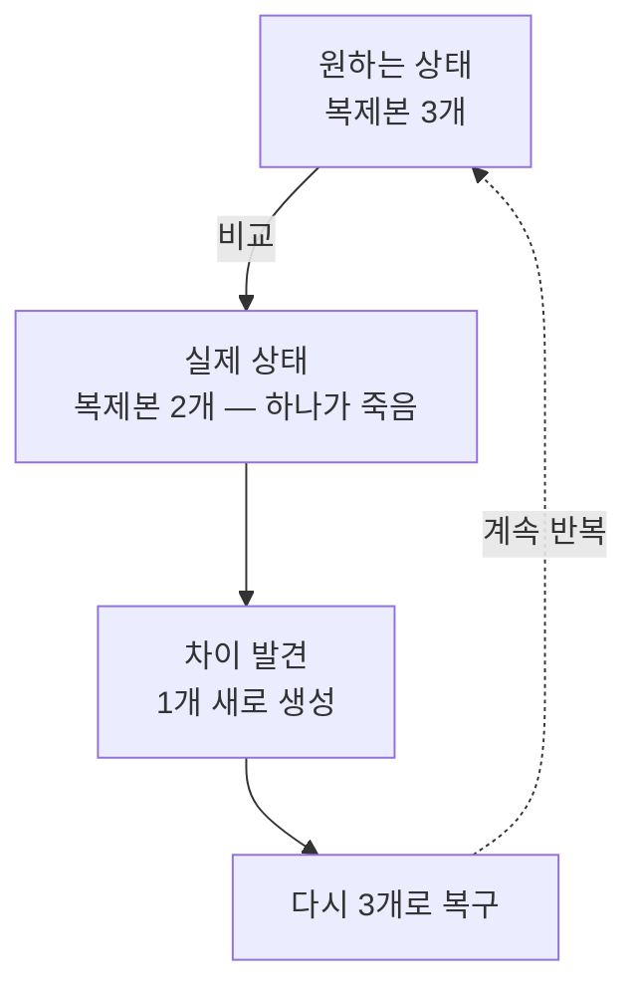
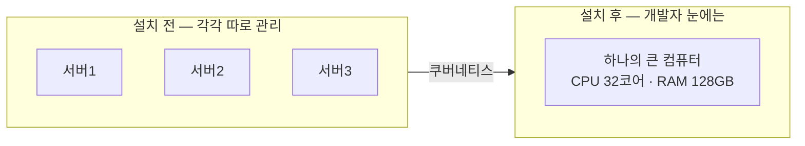
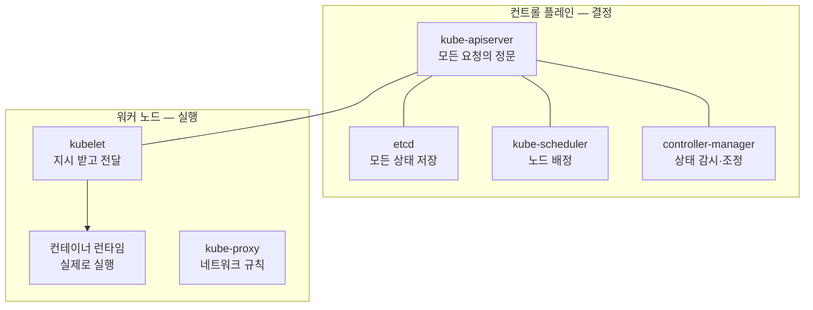
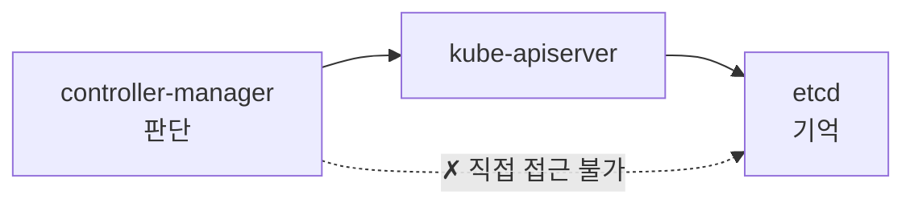
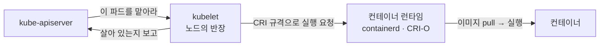
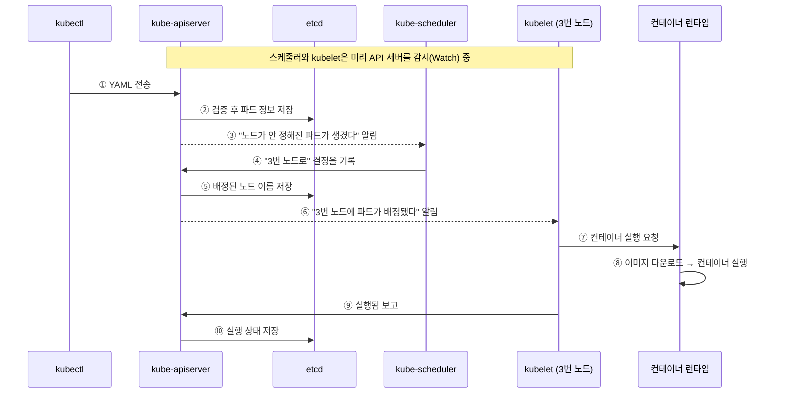
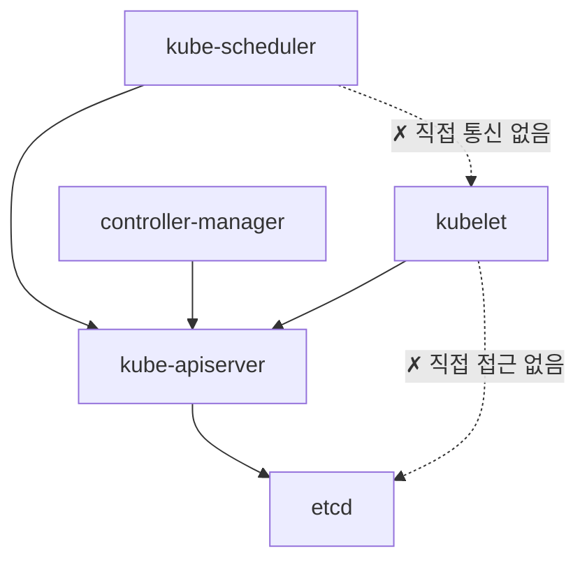

# 01장 핵심 질문 답변 — 쿠버네티스 소개

[01장 핵심 질문](<01장 핵심 질문.md>)의 답변입니다. 먼저 스스로 답해 보고 펼치세요.

---

## 1.0 쿠버네티스를 배우기 전에

### 1. "서버"의 두 가지 뜻 ★★★☆☆

**한 줄 답 — 전원이 들어가는 기계 한 대(머신), 그리고 요청을 받아 응답하는 프로그램(프로세스)입니다.**

같은 단어인데 가리키는 게 완전히 다릅니다.

| 뜻 | 무엇을 가리키나 | 이럴 때 쓰는 말 |
| :--- | :--- | :--- |
| ① **머신** | 컴퓨터 한 대 (물리든 가상이든) | "3번 서버가 죽었어", "서버 재부팅했어" |
| ② **프로그램** | 요청을 받아 응답하는 프로세스 | "서버 개발자", nginx, `kube-apiserver` |

지금까지 안 헷갈렸던 건 **머신 하나에 앱 하나**였기 때문입니다. 둘이 사실상 같은 것을 가리켰죠. 쿠버네티스에서는 머신 하나에 앱이 수십 개 뜨면서 그 1:1이 깨집니다.

> 이 스터디에서는 **머신은 "노드", 프로그램만 "서버"** 로 부릅니다.

### 2. 물리 서버 → 프로세스까지의 계층 ★★★★☆

**한 줄 답 — 여섯 층이 세로로 쌓여 있고, 위층은 아래층 "안에" 들어 있습니다.**

| 층 | 우리 실습 환경의 실체 |
| :---: | :--- |
| ① 물리 서버 | 노트북 1대 (Windows 11) |
| ② 가상 머신 | WSL2 VM `podman-machine-default` |
| ③ 노드 | 컨테이너 `kia-control-plane` |
| ④ 파드 | `web` (`10.244.0.5`) |
| ⑤ 컨테이너 | `nginx:alpine` |
| ⑥ 프로세스 | `nginx` |

**핵심은 이게 경쟁 관계가 아니라는 것입니다.** "이건 노드예요, 서버예요?"는 "이건 건물이에요, 방이에요?"와 같은 질문입니다. 장비는 1대인데 층은 6개니까, "서버 1대"도 "노드 1개"도 둘 다 맞는 말입니다.

### 3. 클러스터의 위치 ★★★☆☆

**한 줄 답 — 클러스터는 층이 아니라 울타리입니다. 노드를 옆으로 묶은 것이라 위아래를 물을 수 없습니다.**

앞 문제의 6층 표는 **세로**로 쌓은 것이고, 클러스터는 ③층 노드들을 **가로**로 묶은 것입니다. 방향이 아예 다릅니다.

사용자는 "3번 노드에 넣어 줘"가 아니라 **클러스터에 "이 앱 띄워 줘"** 라고만 합니다. 어느 노드에 놓을지는 컨트롤 플레인이 정합니다.

### 4. 이미지 vs 컨테이너, 컨테이너 vs 파드 ★★★★★

**한 줄 답 — 이미지는 붕어빵 틀, 컨테이너는 찍어 낸 붕어빵. 파드는 그 붕어빵을 담는 봉투입니다.**

| 짝 | 가르는 한 줄 |
| :--- | :--- |
| **이미지 vs 컨테이너** | 디스크에 가만히 있는 **파일** vs 메모리에 올라가 **실행 중인 것** |
| **컨테이너 vs 파드** | 실행 단위 vs 그것을 **감싸는 배포 단위** |

두 가지를 덧붙이면 답이 완성됩니다.

* 이미지 **하나로 컨테이너를 100개** 찍어 낼 수 있습니다. 틀은 하나, 붕어빵은 여럿입니다.
* **컨테이너가 1개뿐이어도 반드시 파드로 감쌉니다.** 쿠버네티스는 컨테이너를 직접 다루지 않기 때문입니다. 봉투에 붕어빵 하나만 들어 있어도 봉투는 씁니다.

### 5. 포트 충돌이 사라지는 이유 ★★★★☆

**한 줄 답 — 파드마다 자기 IP를 갖기 때문에, 포트를 나눠 쓸 필요 자체가 없어집니다.**

한 머신에서 포트가 겹치면 안 되는 이유는 **주소가 하나뿐**이기 때문입니다. 아파트가 한 채인데 호수가 겹치면 우편물을 못 나눕니다.

그런데 쿠버네티스에서는 이렇게 됩니다.

* 파드 A → `10.244.0.5:8080`
* 파드 B → `10.244.0.6:8080`

**포트는 똑같이 8080인데 IP가 다르니 목적지가 다릅니다.** 아파트를 여러 채 지어 놓고 각 동의 101호를 쓰는 것과 같습니다.

> 단, **한 파드 안에서는 여전히 겹치면 안 됩니다.** 같은 파드의 컨테이너들은 IP를 공유하기 때문에 주소가 하나입니다. (4.1절)

### 6. 무상태 vs 상태 유지 ★★★★☆

**한 줄 답 — 데이터를 자기 안에 갖고 있느냐가 갈림길이고, 이것이 "복제해도 되는지"를 결정합니다.**

| | **무상태(Stateless)** | **상태 유지(Stateful)** |
| :--- | :--- | :--- |
| 데이터 | 자기 안에 저장 안 함 | 자기 디스크에 저장 |
| 예 | 웹 서버, API 서버 | 데이터베이스, 메시지 큐 |
| 복제 | 아무나 붙어도 됨 — **쉬움** | 각자 데이터가 다름 — **어려움** |
| 죽으면 | 새로 띄우면 끝 | **데이터를 잃음** |

**쿠버네티스에서 왜 중요하냐면, 쿠버네티스의 특기가 "죽으면 버리고 새로 만들기"이기 때문입니다.** 무상태 앱에는 완벽한 방식이지만, 상태 유지 앱에 그대로 적용하면 데이터가 날아갑니다.

그래서 상태 유지 앱을 위한 장치가 따로 필요해졌습니다 — 볼륨(9장), PersistentVolume(10장), 스테이트풀셋(16장)이 전부 여기서 출발합니다.

---

## 1.1 쿠버네티스 소개

### 7. 서버 한 대에 앱 하나의 문제 ★★★☆☆

**한 줄 답 — 자원 낭비, 장애에 취약, 확장이 느림입니다.**

* **자원 낭비** — 서버 성능의 10%만 쓰는데 한 대를 통째로 차지합니다. 김치 한 통 놓겠다고 급식실 하나를 비워 두는 셈입니다.
* **장애에 취약** — 그 서버가 꺼지면 서비스도 멈춥니다. 사람이 새벽에 일어나 고쳐야 합니다.
* **확장이 느림** — 사용자가 몰리면 서버를 주문하고 설치하는 데 며칠이 걸립니다.

### 8. 한 서버에 여러 앱을 올렸을 때 ★★★★☆

**한 줄 답 — OS 하나를 통째로 공유하기 때문에, 한 앱의 문제가 옆 앱으로 번집니다.**

문제 목록은 길지만 **하고 싶은 말은 하나**입니다. "잘못한 게 없는 서비스가 같이 죽는다."

| 문제 | 옆으로 번지는 방식 |
| :--- | :--- |
| **장애 파급** | A가 메모리를 다 쓰면 OOM Killer가 **엉뚱한 B를 죽입니다** |
| **성능 간섭** | A가 CPU를 독점하면 같은 서버의 모든 앱이 느려집니다 (Noisy Neighbor) |
| **재부팅 파급** | A 하나 때문에 재부팅하면 B와 C도 같이 내려갑니다 |
| **보안 격리 없음** | A가 뚫리면 B의 파일까지 들여다볼 수 있습니다 |
| **의존성 충돌** | A는 Python 3.8, B는 3.11이 필요한데 한 대에는 하나만 깔립니다 |
| **포트·환경변수 충돌** | 둘 다 8080을 원하거나 둘 다 `DB_HOST`를 원하면 한쪽이 깨집니다 |

**면접에서는 하나만 골라 끝까지 설명하는 게 낫습니다.** OOM Killer 예시가 가장 강렬합니다 — "메모리를 다 쓴 건 A인데, 커널이 죽이는 건 B일 수 있습니다. 원인 찾기가 아주 어렵습니다."

### 9. 자원 효율과 격리의 상충 ★★★★☆

**한 줄 답 — 나눠 쓰면 서로 간섭하고, 완전히 떼어 놓으면 자원이 남습니다. 이 둘을 동시에 잡으려는 시도가 가상화 → 컨테이너입니다.**

| 방식 | 자원 효율 | 격리 |
| :--- | :--- | :--- |
| 서버 1대에 앱 1개 | ✗ 나쁨 | ○ 완벽 |
| 서버 1대에 앱 여러 개 | ○ 좋음 | ✗ 없음 |

한쪽을 얻으면 한쪽을 잃습니다. 그래서 사람들이 원한 건 **"자원은 나눠 쓰되, 서로 완전히 격리되게 하자"** 였습니다.

* **가상화** — 서버 한 대를 여러 대처럼 쪼갰습니다. 두 마리 토끼를 잡긴 했는데, **VM마다 게스트 OS를 통째로** 얹어야 해서 무거웠습니다.
* **컨테이너** — 게스트 OS 없이 **호스트 커널을 빌려 씁니다.** 같은 격리를 훨씬 가볍게 해냅니다.
* **쿠버네티스** — 그렇게 가벼워져서 수백 개가 된 컨테이너를 **사람 대신 관리**합니다.

### 10. 모놀리스 vs 마이크로서비스 ★★★★☆

**한 줄 답 — 한 덩어리냐 잘게 나눴느냐의 차이이고, 나눈 대가로 "관리할 조각이 폭증하는" 새 문제가 생겼습니다.**

| | 모놀리스 | 마이크로서비스 |
| :--- | :--- | :--- |
| 구조 | 모든 기능이 한 덩어리 | 기능별 독립된 작은 프로그램 |
| 배포 | 한 줄 고쳐도 **전체 재배포** | 고친 부분만 배포 |
| 확장 | 전체를 통째로 복제 | **바쁜 부분만** 복제 |
| 단점 | 덩치가 커서 느리고 위험 | **관리할 조각이 너무 많아짐** |

**질문의 핵심은 뒷부분입니다.** 개발과 배포는 편해졌지만, 이런 숙제가 새로 생겼습니다.

> "이 수백 개 조각을 **누가 어느 서버에 배치하고, 죽으면 누가 살리지?**"

사람이 하기엔 너무 많습니다. **이 숙제를 대신 풀어 주는 것이 쿠버네티스입니다.** 즉 쿠버네티스는 마이크로서비스가 만든 문제에 대한 답으로 등장했습니다.

### 11. 명령형 vs 선언형 ★★★★★

**한 줄 답 — 과정을 지시하느냐(명령형), 결과만 선언하느냐(선언형)의 차이입니다.**

| | 명령형(Imperative) | 선언형(Declarative) |
| :--- | :--- | :--- |
| 말하는 방식 | "3번 서버에 접속해서, 실행하고, 확인해라" | "이 앱이 항상 3개 떠 있어야 해" |
| 지시하는 것 | **과정** | **결과** |
| 예시 | `kubectl create deployment ...` | `kubectl apply -f app.yaml` |

급식실로 비유하면 이렇습니다.

* **명령형** — "김치통을 지금 가져와서 3번 자리에 놓고, 30분 뒤에 다시 확인해"
* **선언형** — "김치는 항상 3통 채워 두세요"

**쿠버네티스가 선언형을 택한 이유**는 세 가지입니다.

1. **과정을 몰라도 됩니다.** 어느 노드에 여유가 있는지 사용자가 계산할 필요가 없습니다.
2. **중간에 어긋나도 알아서 복구합니다.** 명령형은 "3개 만들어"를 실행한 뒤 하나가 죽으면 그걸로 끝이지만, 선언형은 목표가 남아 있으니 계속 채웁니다.
3. **목표를 파일로 남길 수 있습니다.** YAML을 Git에 넣어 두면 클러스터가 통째로 날아가도 복구됩니다.

### 12. 원하는 상태 · 실제 상태 · 조정 루프 ★★★★★

**한 줄 답 — 사용자가 선언한 목표와 지금 벌어지는 현실이고, 조정 루프는 이 둘을 끊임없이 비교해 차이를 메웁니다.**

* **원하는 상태(Desired State)** — 사용자가 YAML에 적은 목표. "3개 있어야 해"
* **실제 상태(Actual State)** — 지금 클러스터의 현실. "2개뿐이네"
* **조정 루프(Reconciliation Loop)** — 둘을 비교 → 차이만큼 채움 → **다시 비교** → …

**중요한 건 이게 한 번 하고 끝나는 작업이 아니라는 점입니다.** 순찰 도는 사람처럼 계속 돕니다. 그래서 아무리 뭐가 죽어도 결국 목표로 돌아옵니다.

### 13. 대표 기능들과 조정 루프의 관계 ★★★★☆

**한 줄 답 — 별개의 기능이 아닙니다. 조정 루프 하나가 상황에 따라 다르게 보이는 것뿐입니다.**

| 기능 | 조정 루프로 바꿔 읽으면 |
| :--- | :--- |
| **자동 배치** | "3개 있어야 하는데 0개다" → 어디에 놓을지 정해서 만듦 |
| **자동 복구** | "3개여야 하는데 2개다" → 1개 만듦 |
| **수평 확장** | 목표를 3 → 10으로 바꿨다 → 7개 더 만듦 |
| **무중단 배포** | 목표 이미지가 v2로 바뀌었다 → v1을 하나씩 v2로 교체 |

**전부 "목표와 현실의 차이를 메운다"는 같은 동작입니다.** 다른 건 목표가 무엇이었느냐뿐입니다.

이걸 알면 면접에서 답이 훨씬 단단해집니다. 기능 다섯 개를 외워서 나열하는 것과, "사실 하나의 메커니즘입니다"라고 말하는 것은 인상이 다릅니다.

---

## 1.2 쿠버네티스 이해하기

### 14. 인프라 추상화 ★★★☆☆

**한 줄 답 — 여러 대의 컴퓨터를 한 대의 큰 컴퓨터처럼 보이게 만드는 것입니다.**

**장비가 줄어든 게 아닙니다.** 서버는 그대로 3대인데, 쓰는 사람 눈에만 한 덩어리로 보이는 것입니다.

**개발자 입장에서 달라지는 것**은 딱 하나입니다. `"3번 서버 IP가 뭐지?"`를 몰라도 됩니다. 그냥 "이 앱 띄워 줘"라고 하면 여유 있는 노드를 쿠버네티스가 알아서 고릅니다. 전학생을 몇 반에 넣을지 교무실이 정하는 것과 같습니다.

### 15. 컨트롤 플레인 vs 워커 노드 ★★★★★

**한 줄 답 — 컨트롤 플레인은 결정하는 쪽(교무실), 워커 노드는 실행하는 쪽(교실)입니다.**

| 종류 | 역할 | 들어 있는 부품 |
| :--- | :--- | :--- |
| **컨트롤 플레인 노드** | 무엇을 할지 **결정**하고 감시 | apiserver · etcd · scheduler · controller-manager |
| **워커 노드** | 컨테이너를 **실제로 실행** | kubelet · 컨테이너 런타임 · kube-proxy |

> **kind 단일 노드 클러스터에서는 한 노드가 둘을 겸합니다.** 컨트롤 플레인 테인트가 없어서 일반 파드도 그대로 배치됩니다.

### 16. 왜 3대이고 왜 홀수인가 ★★★★☆

**한 줄 답 — etcd가 과반수(Quorum)로 결정하기 때문입니다. 3대는 1대 고장을 버티는 최소 구성이고, 짝수는 돈만 더 들고 얻는 게 없습니다.**

| 전체 대수 | 과반수 | 버틸 수 있는 고장 |
| :---: | :---: | :--- |
| 1 | 1 | 0대 |
| 3 | 2 | **1대** |
| 4 | 3 | 1대 — 3대와 같은데 비용만 더 듦 |
| 5 | 3 | 2대 |

* **왜 3대?** — 1대는 죽으면 끝입니다. **한 대가 죽어도 버티는 최소 구성**이 3대입니다.
* **왜 홀수?** — 표에서 4대와 3대를 비교해 보세요. **버티는 고장 수가 똑같습니다.** 한 대 값을 더 내고 얻는 게 없으니 짝수는 손해입니다.
* **왜 과반수?** — 네트워크가 반으로 갈라져도(**스플릿 브레인**) 과반수는 **한쪽에만 존재합니다.** 그래서 결정권을 가진 쪽이 항상 하나뿐이고, 양쪽이 서로 다른 결정을 내리는 사고가 없습니다.

정식 명칭은 **쿼럼 기반 합의**, etcd가 쓰는 알고리즘은 **Raft**입니다. 공식으로는 **고장 N대를 버티려면 2N+1대**가 필요합니다.

### 17. 워커 노드에도 적용되나 ★★★☆☆

**한 줄 답 — 아닙니다. 워커 노드는 필요한 만큼 두면 되고 짝수여도 됩니다.**

"3대 홀수"는 **etcd의 합의 때문에 생긴 규칙**이고, etcd는 컨트롤 플레인에만 있습니다. 워커 노드는 합의에 참여하지 않고 그냥 파드를 돌리기만 하므로 개수 제약이 없습니다.

두 가지를 덧붙이면 좋습니다.

* **관리형 서비스(EKS·GKE 등)** 에서는 컨트롤 플레인을 클라우드가 알아서 이중화해 줍니다. 사용자는 워커만 신경 쓰면 됩니다.
* **학습 환경은 노드 1개로 충분합니다.** 3대 권장은 **운영 환경 기준**입니다.

### 18. kube-apiserver ★★★★★

**한 줄 답 — 클러스터의 유일한 정문입니다. 모든 요청이 반드시 여기를 거칩니다.**

* 사용자의 `kubectl` 명령도, **내부 부품끼리의 대화도** 전부 여기를 통합니다.
* 요청이 올바른지 검증한 뒤 **etcd에 저장**합니다.
* 부품들은 서로 직접 통화하지 않습니다. 무조건 API 서버를 거칩니다.

**설계의 이점 두 가지**가 이 질문의 핵심입니다.

1. **보안 검사를 한 곳에서만 하면 됩니다.** 인증·인가·검증이 모두 이 문 하나에 모입니다. 출입구가 여러 개면 전부 지켜야 하지만, 하나면 거기만 지키면 됩니다.
2. **부품을 갈아 끼워도 나머지가 영향을 안 받습니다.** 서로를 직접 모르고 API 서버만 알기 때문입니다. 스케줄러를 다른 구현으로 바꿔도 kubelet은 아무것도 달라지지 않습니다.

### 19. etcd ★★★★★

**한 줄 답 — 클러스터의 모든 상태를 저장하는 유일한 데이터베이스입니다. 여기가 날아가면 클러스터를 잃습니다.**

* 키-값 저장소 형태입니다.
* **"파드가 몇 개인지, 어느 노드에 있는지, 설정값이 무엇인지"** 가 전부 여기 들어 있습니다.

**왜 잃는 것과 같은가** — 서버(노드)는 멀쩡히 살아 있어도, **"무엇을 띄워야 하는지"에 대한 기록이 전부 사라지기** 때문입니다. 건물은 그대로인데 명부만 불탄 상황입니다.

앞에서 배운 조정 루프로 설명하면 더 정확합니다. 컨트롤러가 하는 일은 "**원하는 상태**와 실제 상태를 맞추는 것"인데, **원하는 상태가 저장된 곳이 etcd**입니다. 목표가 사라지면 무엇에 맞춰야 할지 알 수 없습니다.

> 그래서 실무에서 **etcd 백업은 필수**입니다.

### 20. kube-scheduler ★★★★★

**한 줄 답 — 실행하지 않습니다. "어느 노드에 놓을지"만 정해서 기록합니다.**

이 질문은 **오해를 짚는 문제**입니다. 이름이 스케줄러라 직접 배치까지 할 것 같지만 아닙니다.

스케줄러가 하는 일을 정확히 쓰면 이렇습니다.

1. **아직 노드가 정해지지 않은 파드**를 발견합니다.
2. 남은 CPU·메모리, 하드웨어 조건 등을 따져 **어느 노드가 좋을지 결정**합니다.
3. **"3번 노드로"라는 결정을 API 서버를 통해 etcd에 적어 둡니다. 여기서 끝입니다.**

실제로 컨테이너를 띄우는 것은 그 노드의 **kubelet**입니다. 스케줄러는 학생을 직접 데려다 앉히지 않고, 반 배정표에 이름만 적어 두는 선생님입니다.

### 21. kube-controller-manager ★★★★☆

**한 줄 답 — 여러 컨트롤러를 모아 실행하는 프로세스이고, 각 컨트롤러가 바로 조정 루프를 돌리는 주체입니다.**

컨트롤러는 저마다 맡은 대상을 계속 지켜봅니다.

| 컨트롤러 | 맡은 일 |
| :--- | :--- |
| **노드 컨트롤러** | 노드가 죽었는지 감시 |
| **잡 컨트롤러** | 일회성 작업 관리 |
| **엔드포인트슬라이스 컨트롤러** | 서비스와 파드를 연결 |
| **서비스어카운트 컨트롤러** | 기본 계정 생성 |

**조정 루프와의 연결이 이 질문의 핵심입니다.** 1.1절에서 "쿠버네티스가 원하는 상태와 실제 상태를 맞춘다"고 했는데, **그 "쿠버네티스"의 실체가 바로 이 컨트롤러들**입니다. 추상적인 개념이 아니라 실제로 돌고 있는 프로그램들입니다.

### 22. 컨트롤러 사슬 — 디플로이먼트에서 파드까지 ★★★★☆

**한 줄 답 — 디플로이먼트 컨트롤러는 레플리카셋까지만 만듭니다. 파드는 레플리카셋 컨트롤러가 만듭니다.**

| 누가 | 무엇을 보고 | 무엇을 만드나 |
| :--- | :--- | :--- |
| **디플로이먼트 컨트롤러** | 디플로이먼트 | **레플리카셋** |
| **레플리카셋 컨트롤러** | 레플리카셋 | **파드** |
| **kube-scheduler** | 노드가 안 정해진 파드 | 노드 **배정 결정** |
| **kubelet** | 자기 노드에 배정된 파드 | 실제 **컨테이너** |

**각자 자기 바로 아래 단계만 만듭니다.** 디플로이먼트 컨트롤러에게 파드는 관심 밖입니다. 레플리카셋을 만들어 두면 그 뒤는 레플리카셋 컨트롤러가 알아서 합니다.

**서로 호출하지도 않습니다.** 각자 API 서버만 지켜보다가 자기가 맡은 오브젝트가 생기면 움직입니다. 그래서 중간 단계 하나가 잠깐 멈춰도 나머지가 깨지지 않고, 그 부품이 살아나면 밀린 것부터 이어서 처리합니다.

> 이 사슬은 **14~15장**에서 자세히 다룹니다. 여기서는 **"컨트롤러가 여러 개 이어져 있고 각자 한 단계씩만 담당한다"** 만 잡으면 됩니다.

### 23. 컨트롤러와 etcd의 관계 ★★★★☆

**한 줄 답 — 직접 접근하지 않습니다. 둘 사이에는 항상 API 서버가 있습니다.**

etcd에 붙을 수 있는 것은 **kube-apiserver 하나뿐**입니다. 컨트롤러는 etcd의 주소도, 그런 게 있다는 사실조차 몰라도 됩니다.

**이렇게 만든 이유 두 가지**

1. **검증을 우회할 수 없습니다.** 컨트롤러가 etcd에 직접 쓸 수 있다면 인증·인가·유효성 검사를 건너뛰고 이상한 값을 넣을 수 있습니다.
2. **etcd를 갈아 끼울 수 있습니다.** 저장소가 바뀌어도 API 서버만 대응하면 되고, 컨트롤러 수십 개는 한 줄도 안 고쳐도 됩니다.

**질문 뒷부분 — 컨트롤러가 상태를 안 갖는 이유**

컨트롤러가 비교하는 **원하는 상태(`spec`)와 실제 상태(`status`)가 둘 다 etcd에 들어 있기 때문**입니다(3장). 컨트롤러는 계산만 하고 **기억은 전부 etcd가 맡습니다.**

그래서 컨트롤러는 죽었다 살아나도 **etcd를 다시 읽으면 그대로 이어서** 일합니다. 자기가 뭘 하던 중이었는지 기억할 필요가 없습니다. 1.1절에서 "알림을 놓쳐도 결과가 같다"고 한 것도 같은 이유입니다.

> **한 줄로 — etcd는 기억을 맡고, 컨트롤러는 판단을 맡습니다. 둘은 API 서버를 통해서만 만납니다.**

### 24. 3대일 때 부품별 동작 — 리더 선출 ★★★★☆

**한 줄 답 — 아니오. controller-manager는 셋 중 리더 하나만 일하고 나머지는 대기합니다.**

| 부품 | 3대일 때 | 이유 |
| :--- | :--- | :--- |
| **kube-apiserver** | **셋 다 동시에** 요청을 처리 | 자기 상태를 갖지 않아 겹쳐도 문제없음 |
| **controller-manager · scheduler** | **리더 1개만** 일하고 나머지는 대기 | 같은 판단을 중복 실행하면 결과가 어긋남 |
| **etcd** | 셋이 **합의(과반수)로 함께** 동작 | 데이터를 잃지 않으려면 합의가 필요 |

**왜 리더 하나만 일해야 하냐면**, 같은 조정 루프를 셋이 동시에 돌리면 안 되기 때문입니다. **"3개가 있어야 하는데 0개다"를 셋이 각각 보고 각각 3개씩 만들면 파드가 9개**가 됩니다.

**"누가 리더인가"조차 etcd에 저장된 객체 하나**입니다 — **리스(Lease)** 입니다. 후보들이 이 객체를 주기적으로 갱신하려 다투고, 갱신에 성공한 쪽이 리더가 됩니다. 이것도 API 서버를 거치므로 **컨트롤러끼리 서로 "네가 리더냐"고 물어보는 일은 없습니다.**

> **앞의 "왜 3대이고 왜 홀수인가"는 etcd 이야기였습니다.** controller-manager와 scheduler는 과반수가 아니라 **리더 하나**로 움직인다는 점에서 성격이 다릅니다. 이 둘을 섞어 답하면 감점 포인트입니다.

> **etcd가 멈추면 리더 자격도 잃습니다.** 리스를 갱신하지 못해 만료되면 리더는 스스로 물러납니다. 다만 **이미 떠 있는 파드는 계속 돕니다** — kubelet은 컨테이너를 살려 두는 데 API 서버가 필요 없기 때문입니다. 멈추는 것은 **새로운 변화**뿐입니다.

### 25. kubelet과 컨테이너 런타임 ★★★★★

**한 줄 답 — kubelet은 지시를 받아 전달하는 반장이고, 실제로 컨테이너를 돌리는 건 런타임입니다.**

**kubelet이 하는 일**

* 모든 노드에 하나씩 있고 **늘 켜져 있습니다**(데몬).
* API 서버에서 "이 파드를 맡아라"를 받아 **런타임에게 실행을 시킵니다.**
* 컨테이너가 살아 있는지 확인하고 **상태를 API 서버에 보고**합니다.

**kubelet은 직접 실행하지 않습니다.** 손을 실제로 움직이는 건 런타임 하나뿐입니다. 이 분리 덕분에 런타임을 갈아 끼울 수 있습니다(다음 문제).

### 26. CRI ★★★★☆

**한 줄 답 — kubelet과 컨테이너 런타임 사이의 표준 규격입니다. 이 규격만 지키면 어떤 런타임이든 쓸 수 있습니다.**

콘센트 규격에 비유하면 쉽습니다. 규격만 맞으면 어느 회사 제품이든 꽂힙니다. 쿠버네티스는 "CRI라는 모양의 콘센트"를 제공하고, 런타임은 그 모양의 플러그를 달면 됩니다.

**이 표준이 있어서 가능해진 것**

* **런타임을 갈아 끼울 수 있습니다.** 지금 표준은 **containerd**(대부분의 기본값)와 **CRI-O**(주로 OpenShift)입니다.
* **쿠버네티스가 특정 런타임에 묶이지 않습니다.** 새 런타임이 나와도 CRI만 구현하면 바로 쓸 수 있습니다.
* 거꾸로 **CRI를 못 알아듣는 Docker Engine은 퇴출**되었습니다. 쿠버네티스가 특별 통역기(dockershim)를 유지하다 1.24에서 걷어냈습니다.

### 27. kube-proxy ★★★★☆

**한 줄 답 — 서비스로 들어온 요청을 실제 파드로 전달하는 네트워크 규칙을 관리합니다.**

* 복도에서 "그 반은 저쪽입니다"라고 안내하는 역할입니다.
* 복제본이 여러 개면 요청을 **골고루 나눠 줍니다**(로드밸런싱).

**주의할 점 하나** — kube-proxy는 요청을 직접 받아서 넘기는 프록시 프로그램이 아니라, **커널에 전달 규칙(iptables/IPVS)을 심어 두는 역할**에 가깝습니다.

> 참고로 지금은 공식 문서에서 **선택 사항(optional)** 으로 표기합니다. Cilium 같은 eBPF 기반 네트워크 플러그인이 같은 일을 더 빠르게 대신할 수 있어서, kube-proxy 없이 도는 클러스터도 흔합니다.

### 28. `kubectl apply` 이후의 전체 흐름 ★★★★★

**한 줄 답 — kubectl → API 서버 → etcd 저장 → 스케줄러가 노드 결정 → kubelet이 런타임에 실행 요청 → 상태 보고. 모든 화살표가 API 서버를 거칩니다.**

**말로 답할 때 놓치면 안 되는 두 가지**

* **② 시점에 파드는 이미 "존재"합니다.** 다만 노드가 안 정해진 상태(`Pending`)일 뿐입니다.
* **③⑥의 점선은 명령이 아니라 알림**입니다. 아무도 명령을 받으러 다니지 않고, 미리 감시를 걸어 두고 기다리다 스스로 움직입니다.

### 29. 스케줄러와 kubelet은 직접 통신하나 ★★★★☆

**한 줄 답 — 둘 다 아니오입니다. 서로 직접 통신하지 않고, etcd에도 직접 접근하지 않습니다.**

**etcd에 접근할 수 있는 것은 오직 API 서버뿐입니다.** 이게 왜 중요하냐면,

* **검증을 우회할 방법이 없습니다.** 누가 etcd에 이상한 값을 직접 써 넣는 일이 구조적으로 불가능합니다.
* **부품끼리 서로를 몰라도 됩니다.** 스케줄러는 kubelet이 몇 개 있는지도 모릅니다. 그냥 API 서버에 결정을 적어 둘 뿐입니다.

### 30. 감시(Watch) 기반 아키텍처 ★★★★☆

**한 줄 답 — 각 부품이 API 서버에 "변화가 생기면 알려 줘"를 걸어 두고 기다리는 방식입니다. 주기적으로 물어보는 폴링과 반대입니다.**

| | **폴링(Polling)** | **감시(Watch)** |
| :--- | :--- | :--- |
| 방식 | "새 일 있어요?"를 계속 물어봄 | 미리 등록해 두고 **기다림** |
| 비유 | 웹페이지를 계속 새로고침 | **유튜브 알림 설정** |
| 부하 | 매번 요청 — 낭비 | 변화가 있을 때만 |
| 반응 속도 | 다음 조회 때까지 지연 | **즉시** |

폴링은 아무 일이 없어도 계속 물어봐야 해서, 클러스터가 커질수록 API 서버가 질문 폭탄을 맞습니다. 감시 방식은 **변화가 생겼을 때만** 오가므로 조용합니다.

**여기에 한 가지를 덧붙이면 답이 완성됩니다.** 알림은 `"파드를 만들어라"`라는 **명령이 아니라** `"뭔가 바뀌었으니 확인해 봐"`라는 **신호**입니다. 알림을 받은 부품은 내용을 그대로 처리하지 않고 **전체 상태를 다시 읽어서 목표에 맞춥니다.**

그래서 **알림을 몇 번 놓쳐도 결과가 같습니다.** 3개여야 하는데 2개라면, 알림을 한 번 받든 열 번 받든 결국 1개를 만들면 끝입니다. 잠깐 죽었다 살아난 부품이 그동안의 알림을 못 봤어도, 살아나서 현재 상태만 다시 보면 되기 때문에 클러스터가 멀쩡합니다.
