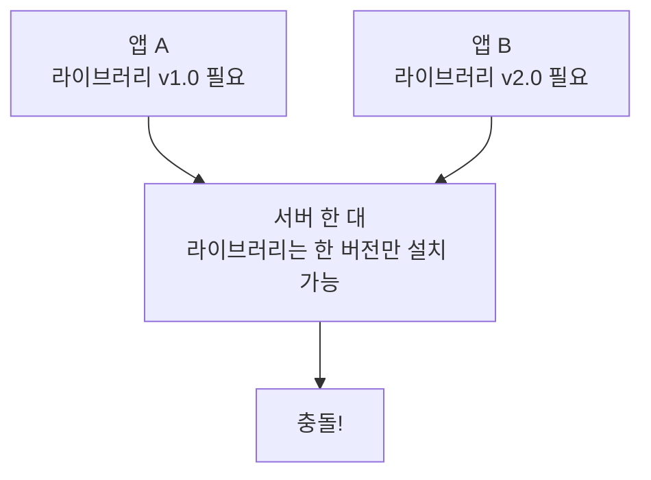
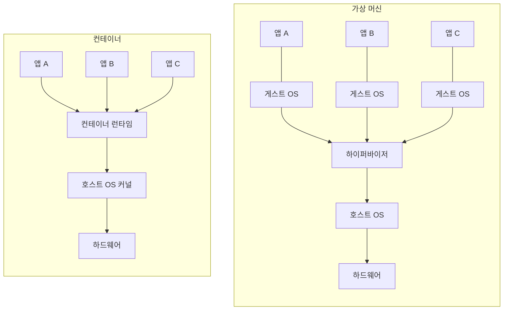
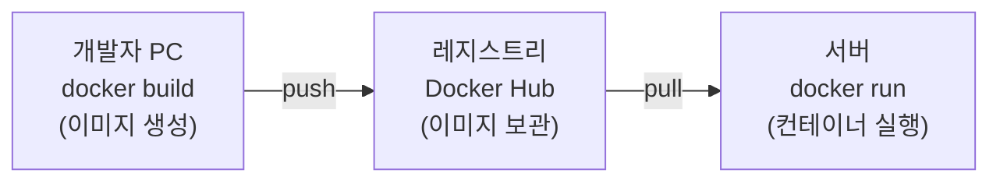
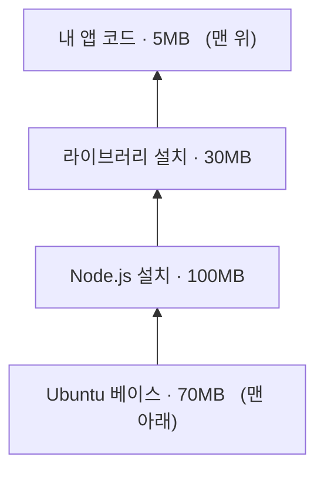

# 2.1 컨테이너 소개

쿠버네티스는 컨테이너를 관리하는 도구입니다. 그러니 컨테이너가 무엇인지 모르면 쿠버네티스도 이해할 수 없습니다. 이 절에서는 컨테이너가 왜 필요한지, 가상 머신과 무엇이 다른지 살펴봅니다.

## 왜 컨테이너가 필요할까요?

### "제 컴퓨터에서는 잘 되는데요?"

개발자들 사이에서 가장 유명한 변명입니다. 이유는 보통 이렇습니다.

* 내 노트북은 Python 3.12, 서버는 Python 3.9
* 내 노트북에는 설치된 라이브러리가 서버에는 없음 
* 운영체제가 다름 (Windows vs Linux) 

### 한 서버에 여러 앱을 올릴 때의 충돌

서버 한 대에 앱 A와 앱 B를 같이 올린다고 해 봅시다.



이 문제를 **의존성 지옥(Dependency Hell)** 이라고 합니다.

컨테이너는 **프로그램과 그 프로그램이 필요로 하는 모든 것을 하나로 포장**해서 이 문제를 해결합니다. 어디에 가져다 놓아도 똑같이 동작합니다.

## 컨테이너 vs 가상 머신(VM)

둘 다 "격리"를 제공하지만 방식이 완전히 다릅니다. 공식 문서는 이 차이를 **배포 방식의 시대 변화**로 설명합니다.


> 출처: [Kubernetes Documentation — Overview](https://kubernetes.io/docs/concepts/overview/) © The Kubernetes Authors, [CC BY 4.0](https://creativecommons.org/licenses/by/4.0/)

- **물리 서버 시대**: 서버 한 대에 앱 하나. 자원이 남아돌아도 나눠 쓸 방법이 없었습니다.
- **가상화 시대**: 하이퍼바이저 위에 VM을 여러 개. 나눠 쓸 수는 있지만 **VM마다 게스트 OS를 통째로** 얹어야 합니다.
- **컨테이너 시대**: 게스트 OS 없이 **호스트 OS를 공유**합니다. 그만큼 가볍습니다.

층으로 그려 보면 차이가 분명해집니다.



가장 큰 차이는 **게스트 OS가 있느냐 없느냐**입니다. 컨테이너는 호스트의 커널을 그대로 빌려 쓰기 때문에 OS를 따로 켤 필요가 없습니다.

| 항목 | 가상 머신(VM) | 컨테이너 |
| :--- | :--- | :--- |
| 격리 수준 | 강함 (커널까지 분리) | 보통 (커널 공유) |
| 부팅 시간 | 수십 초 ~ 수 분 | **1초 미만** |
| 용량 | 수 GB | 수 MB ~ 수백 MB |
| 성능 손실 | 있음 (가상화 계층) | **거의 없음** |
| 한 서버당 개수 | 수십 개 | **수백~수천 개** |
| 다른 OS 실행 | 가능 (리눅스 위에 윈도우) | 불가능 (커널 공유) |

> **중요한 한계**
> 컨테이너는 호스트 커널을 공유하므로 **리눅스 컨테이너는 리눅스 커널 위에서만** 돌아갑니다. 윈도우나 macOS에서 Docker를 쓰면 사실 뒤에서 **작은 리눅스 가상 머신이 몰래 돌고 있습니다.**

## Docker의 등장

컨테이너 기술 자체는 리눅스에 오래전부터 있었지만, 너무 어려워서 아무도 쓰지 않았습니다. **2013년 Docker**가 이것을 누구나 쓸 수 있게 만들면서 폭발적으로 퍼졌습니다.

Docker가 만든 세 가지 핵심 개념입니다.

### 1) 이미지(Image)

프로그램과 실행에 필요한 모든 것을 담은 **읽기 전용 템플릿**입니다. 붕어빵 틀이라고 생각하면 됩니다.

### 2) 컨테이너(Container)

이미지를 **실제로 실행한 상태**입니다. 틀에서 찍어낸 붕어빵입니다. 하나의 이미지로 붕어빵(컨테이너)을 100개 찍어낼 수 있습니다.

### 3) 레지스트리(Registry)

이미지를 올리고 내려받는 **저장소**입니다. 대표적으로 **Docker Hub**가 있습니다. GitHub이 코드 저장소라면, [Docker Hub](https://hub.docker.com/)은 이미지 저장소입니다.



## 레이어(Layer): 도커의 숨은 비밀

이미지는 통짜 파일이 아니라 **여러 겹의 층(레이어)** 이 쌓인 구조입니다.



이 구조 덕분에 두 가지 이점이 생깁니다.

* **저장 공간 절약**: 여러 이미지가 같은 Ubuntu 레이어를 쓴다면 디스크에는 **딱 한 번만** 저장됩니다.
* **전송 속도 향상**: 앱 코드만 바꿔서 다시 빌드하면, 바뀐 맨 위 레이어(5MB)만 전송하면 됩니다.

또한 실행 중인 컨테이너는 맨 위에 **쓰기 가능한 얇은 레이어**를 하나 더 얹습니다. 그래서 컨테이너 안에서 파일을 고쳐도 **원본 이미지는 절대 변하지 않습니다.** 컨테이너를 지우면 그 변경 사항도 함께 사라집니다.

## Docker의 대안과 OCI 표준

Docker가 워낙 유명해지자 "특정 회사 기술에 묶이면 안 된다"는 목소리가 나왔습니다. 그래서 **OCI(Open Container Initiative)** 라는 표준 규격이 만들어졌습니다.

* **OCI 이미지 스펙**: 이미지를 어떤 형식으로 만들 것인가
* **OCI 런타임 스펙**: 컨테이너를 어떻게 실행할 것인가

이 표준 덕분에 **어떤 도구로 만든 이미지든 어떤 런타임에서든 돌아갑니다.** 대표적인 도구들입니다.

| 도구 | 역할 |
| :--- | :--- |
| **Docker** | 이미지 빌드 + 실행 (가장 대중적) |
| **containerd** | 런타임. 쿠버네티스의 사실상 표준 |
| **CRI-O** | 쿠버네티스 전용으로 만든 가벼운 런타임 |
| **Podman** | Docker와 명령어가 거의 같은 대안. 데몬이 없어 더 안전하고, **상업적 사용까지 무료** |
| **Buildah** | 이미지 빌드 전용 도구 |
| **runc** | 가장 밑바닥에서 실제로 컨테이너를 만드는 프로그램 |

> **"Docker가 유료"라는 말은 절반만 맞습니다.** 엔진인 **Docker Engine은 무료**입니다. 유료 구독 대상은 GUI 제품인 **Docker Desktop**이고, 그것도 **직원 250명 이상 또는 연매출 1천만 달러 이상** 기업에만 해당합니다. **Podman은 이런 조건 자체가 없어서** 회사에서 쓸 때 라이선스를 따질 일이 없습니다. 이 저장소가 실습에 Podman을 쓰는 이유이기도 합니다. → [SETUP.md](../SETUP.md)

---

## 요약 및 비유

| 개념 | 택배 비유 | 기술적 의미 |
| :--- | :--- | :--- |
| **컨테이너** | 내용물이 완충재까지 포장된 택배 상자 | 앱과 의존성을 함께 격리 실행 |
| **가상 머신** | 상자마다 트럭을 한 대씩 붙임 | 게스트 OS까지 통째로 가상화 |
| **이미지** | 붕어빵 틀 | 실행에 필요한 읽기 전용 템플릿 |
| **레지스트리** | 택배 물류창고 | Docker Hub 등 이미지 보관소 |
| **레이어** | 상자를 겹겹이 포장한 층 | 재사용 가능한 이미지 계층 |
| **OCI** | 택배 상자 표준 규격 | 컨테이너 이미지·런타임 표준 |

---

## 결론

* 컨테이너는 **"내 컴퓨터에서는 되는데" 문제와 의존성 충돌을 해결**하기 위해 등장했습니다.
* 가상 머신과 달리 **호스트 커널을 공유**하므로 훨씬 가볍고 빠릅니다. 대신 격리 수준은 VM보다 약합니다.
* **이미지 → 레지스트리 → 컨테이너** 흐름이 컨테이너 사용의 기본 골격입니다.
* **OCI 표준** 덕분에 Docker에 종속되지 않고 다양한 도구를 섞어 쓸 수 있습니다.

---

## 공식 문서 업데이트 (2026년 8월 기준)

### 1) 쿠버네티스에서 Docker는 "런타임"이 아닙니다

책은 Docker를 중심으로 설명하지만, **쿠버네티스 1.24부터 dockershim이 제거**되어 Docker Engine을 런타임으로 쓸 수 없습니다. 공식 문서가 안내하는 런타임은 **containerd**와 **CRI-O**뿐입니다.

**그렇다고 이 장의 내용이 쓸모없어지는 것은 아닙니다.** 정리하면 이렇습니다.

| 용도 | Docker를 써도 되나요? |
| :--- | :--- |
| 이미지 빌드 (`docker build`) | 됩니다. OCI 표준 이미지라 문제없습니다 |
| 로컬에서 컨테이너 테스트 (`docker run`) | 됩니다 |
| 쿠버네티스 노드의 런타임 | **안 됩니다.** containerd/CRI-O를 씁니다 |

참고: <https://kubernetes.io/docs/setup/production-environment/container-runtimes/>

### 2) 노드에서 컨테이너를 볼 때는 `crictl`

책에서는 노드에 들어가 `docker ps`로 컨테이너를 확인하는 장면이 나오는데, 지금은 그 명령이 동작하지 않습니다. 대신 CRI 표준 도구인 **`crictl`** 을 씁니다.

```bash
crictl ps          # docker ps 에 해당
crictl images      # docker images 에 해당
crictl logs <ID>   # docker logs 에 해당
```

### 3) cgroup v2가 기본입니다

책이 설명하는 cgroup은 대부분 **v1** 기준입니다. 현재 주요 리눅스 배포판(Ubuntu 22.04 이상, Fedora 등)은 **cgroup v2**를 기본으로 쓰고, 쿠버네티스도 v2를 정식 지원합니다. 개념(자원 제한)은 같지만 파일 경로와 구조가 달라졌습니다.

### 4) 이미지 레지스트리 주소 변경

예전 공식 이미지 저장소였던 `k8s.gcr.io`는 **완전히 동결(freeze)** 되었습니다. 지금은 **`registry.k8s.io`** 를 씁니다. 오래된 YAML 파일에서 `k8s.gcr.io`를 보면 바꿔 주어야 합니다.
