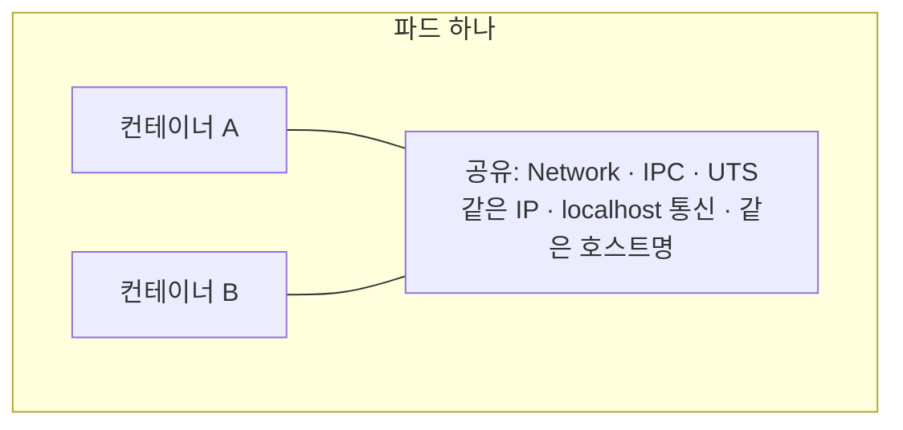

# 2.3 컨테이너를 가능하게 하는 기술

컨테이너는 마법이 아닙니다. **리눅스 커널에 원래 있던 두 가지 기능**을 조합한 것뿐입니다.

| 기술 | 담당하는 일 | 한 줄 요약 |
| :--- | :--- | :--- |
| **네임스페이스(Namespace)** | 격리 | "**뭘 볼 수 있는지**"를 제한 |
| **cgroups** | 자원 제한 | "**얼마나 쓸 수 있는지**"를 제한 |

쿠버네티스의 파드·자원 설정 같은 것들이 전부 이 둘 위에 얹혀 있습니다. 

## 네임스페이스: 보이는 세계를 나누기

리눅스 네임스페이스는 프로세스에게 **독립된 세계**를 만들어 줍니다. 같은 컴퓨터에서 돌고 있지만 서로의 존재를 모릅니다.

| 종류 | 격리하는 대상 |
| :--- | :--- |
| **PID** | 프로세스 목록. 컨테이너 안에서는 자기 프로세스만 보임 |
| **Network** | 네트워크 인터페이스, IP 주소, 포트 |
| **Mount (mnt)** | 파일 시스템. 컨테이너마다 다른 루트 디렉터리 |
| **UTS** | 호스트명 |
| **IPC** | 프로세스 간 통신 자원 |
| **User** | 사용자 ID, 그룹 ID |

> **쿠버네티스의 "네임스페이스"와는 다른 것입니다.** 이름만 같고 관계가 없습니다.
>
> | | 리눅스 네임스페이스 | 쿠버네티스 네임스페이스 |
> | :--- | :--- | :--- |
> | 정체 | **커널 기능** | **오브젝트를 묶는 이름 구역** (폴더에 가까움) |
> | 목적 | 프로세스가 뭘 볼 수 있는지 격리 | 이름 충돌 방지, 권한·할당량 경계 |
> | 다루는 곳 | 컨테이너 런타임이 자동으로 | 사용자가 `kubectl` 로 (7장) |
>
> 같은 쿠버네티스 네임스페이스에 있다고 해서 파드들이 리눅스 네임스페이스를 공유하지 않고, 다른 네임스페이스에 있다고 해서 격리가 더 강해지지도 않습니다.


### 쿠버네티스에서는

**파드는 "네임스페이스를 일부러 공유하는 컨테이너 묶음"입니다.** 격리가 기본이지만, 리눅스는 네임스페이스를 **공유**하도록 만들 수도 있습니다. 쿠버네티스는 이 성질을 그대로 활용합니다.



여기서 세 가지가 따라 나옵니다.

* **같은 파드의 컨테이너끼리는 `localhost` 로 통신합니다.** 네트워크 네임스페이스가 하나라서 IP도 같습니다. (5장 사이드카)
* **파드마다 IP가 하나씩 붙습니다.** 컨테이너 단위가 아닙니다. (11장 서비스)
* **파드 안 컨테이너의 호스트명은 파드 이름입니다.** UTS 네임스페이스를 공유하기 때문입니다.

반면 **파일 시스템(Mount)은 기본적으로 공유하지 않습니다.** 컨테이너끼리 파일을 주고받으려면 볼륨을 따로 붙여야 합니다. (9장)


## cgroups: 쓸 수 있는 양을 제한하기

네임스페이스가 "보이는 것"을 나눴다면, **cgroups(control groups)** 는 "쓸 수 있는 양"을 제한합니다.

네임스페이스만 있으면 이런 사고가 납니다.

```
컨테이너 A가 무한 반복문을 돌림
   -> CPU 100% 점유
   -> 같은 서버의 컨테이너 B, C, D가 전부 느려짐
```

이것이 **시끄러운 이웃(Noisy Neighbor) 문제**이고, cgroups가 이를 막습니다. CPU·메모리·디스크 I/O·프로세스 개수 등에 상한을 걸 수 있습니다.

### 쿠버네티스에서는

파드 YAML의 **`resources`** 가 곧 cgroups 설정입니다. 이 값을 kubelet이 컨테이너 런타임에 전달하고, 런타임이 cgroups로 옮겨 적습니다.

```yaml
resources:
  requests:            # 최소 이만큼은 보장받아야 한다
    cpu: "100m"
    memory: "128Mi"
  limits:              # 이 이상은 못 쓴다  <- cgroups 상한
    cpu: "500m"
    memory: "256Mi"
```

* **`requests`** 는 **스케줄러가 노드를 고르는 기준**입니다. 여유가 이만큼 있는 노드에만 파드를 배치합니다.
* **`limits`** 가 실제 cgroups 상한입니다.
* **CPU 초과는 느려질 뿐, 메모리 초과는 즉시 죽습니다(`OOMKilled`).**

---

## 요약 및 비유

| 개념 | 아파트 비유 | 기술적 의미 |
| :--- | :--- | :--- |
| **네임스페이스** | 집집마다 현관문이 따로 있음 | 프로세스·네트워크·파일시스템 격리 |
| **네임스페이스 공유** | 옆집과 현관을 트면 한 세대가 됨 | **파드** — 컨테이너들이 IP·호스트명을 공유 |
| **cgroups** | 세대별 전기·수도 사용량 상한 | `resources.limits` 의 실체 |

---

## 결론

* 컨테이너 = **네임스페이스(격리) + cgroups(자원 제한)** 입니다. 새로운 기술이 아니라 리눅스 커널 기능의 조합입니다.
* 네임스페이스는 **"무엇을 볼 수 있는가"**, cgroups는 **"얼마나 쓸 수 있는가"** 를 정합니다.
* **파드는 네임스페이스를 일부러 공유한 결과물**입니다. 같은 파드 컨테이너가 `localhost`로 통신하고 호스트명을 공유하는 이유가 여기 있습니다.
* 파드 YAML의 **`resources.limits`가 곧 cgroups 상한**이고, `requests`는 스케줄러가 노드를 고르는 기준입니다.

---

## 공식 문서 업데이트 (2026년 8월 기준)

### 1) cgroup v2가 표준입니다

책의 설명은 대부분 **cgroup v1** 기준입니다. 현재는 **cgroup v2**가 표준이고 쿠버네티스도 v2를 정식 지원합니다. 개념(자원을 그룹 단위로 제한한다)은 같고 구조와 경로만 달라졌습니다.

| | cgroup v1 | cgroup v2 |
| :--- | :--- | :--- |
| 구조 | 자원 종류마다 별도 계층 | **하나의 통합 계층** |
| 경로 | `/sys/fs/cgroup/memory/...` | `/sys/fs/cgroup/...` |

### 2) 사용자 네임스페이스(User Namespace) 지원

컨테이너 안의 root를 호스트의 일반 사용자로 매핑해, 컨테이너 탈출 위험을 크게 줄여 주는 기능입니다. 파드에 한 줄이면 켜집니다.

```yaml
spec:
  hostUsers: false   # 사용자 네임스페이스 활성화
```

참고: <https://kubernetes.io/docs/concepts/workloads/pods/user-namespaces/>
