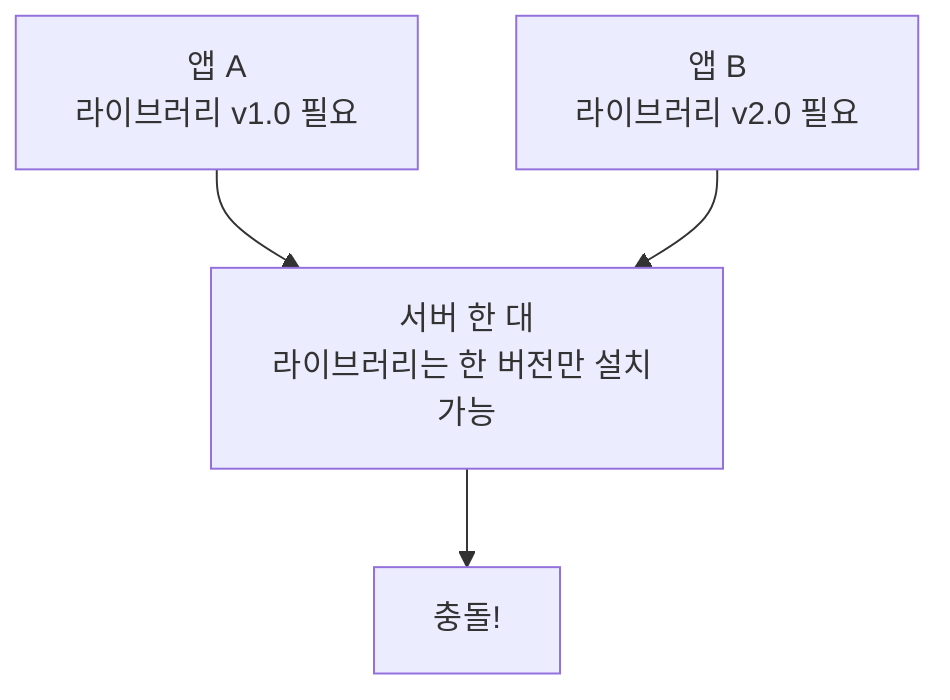
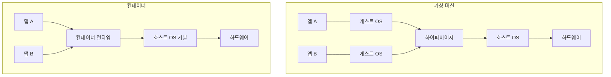
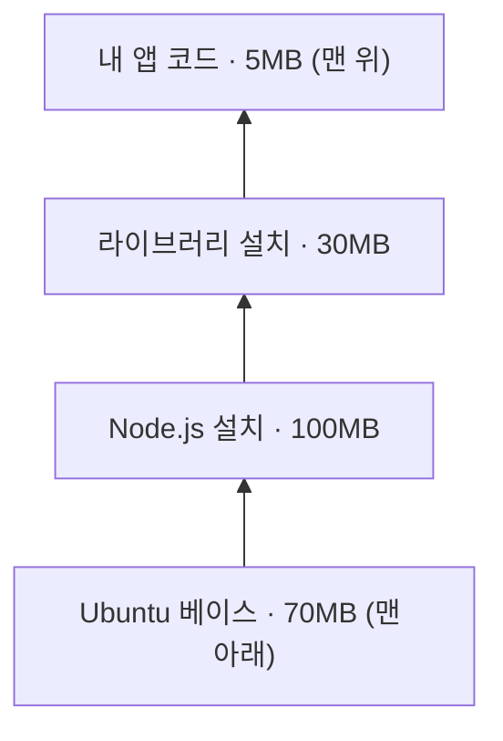
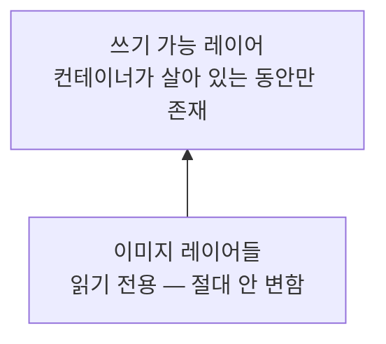
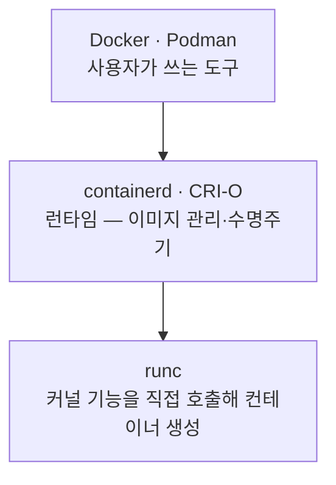
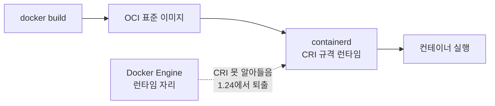
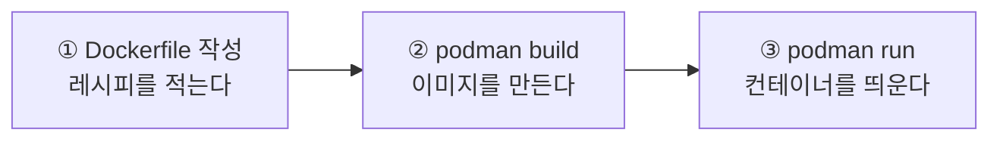
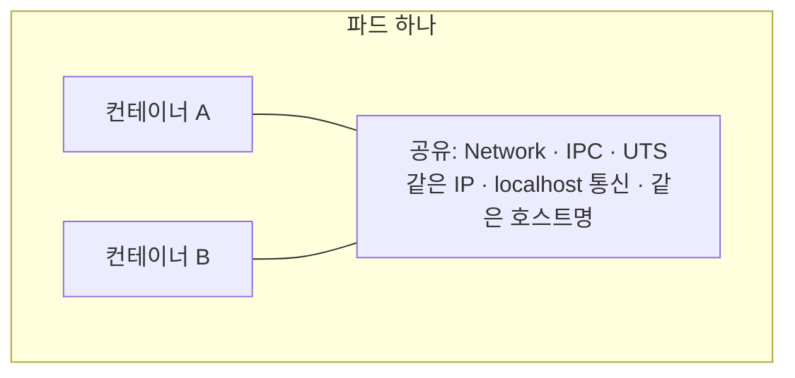

# 02장 핵심 질문 답변 — 컨테이너 소개

[02장 핵심 질문](<02장 핵심 질문.md>)의 답변입니다. 먼저 스스로 답해 보고 펼치세요.

---

## 2.1 컨테이너 소개

### 1. "제 컴퓨터에서는 잘 되는데요" ★★★☆☆

**한 줄 답 — 내 컴퓨터와 서버의 환경이 다르기 때문이고, 컨테이너는 환경까지 통째로 포장해 이 문제를 없앱니다.**

원인은 늘 비슷합니다.

* 내 노트북은 Python 3.12, 서버는 3.9
* 내 노트북에만 깔린 라이브러리가 서버에는 없음
* 운영체제가 다름 (Windows vs Linux)

**즉 옮긴 것은 코드뿐인데, 코드는 혼자 돌지 못합니다.** 이사할 때 가구만 옮기고 콘센트와 수도는 안 옮긴 셈입니다.

컨테이너는 **프로그램과 그 프로그램이 필요로 하는 모든 것을 하나로 포장**합니다. 집을 통째로 옮기니 어디에 놓아도 똑같이 동작합니다.

### 2. 의존성 지옥 ★★★☆☆

**한 줄 답 — 한 서버에 올린 앱들이 서로 다른 버전의 같은 라이브러리를 요구해 어느 쪽도 만족시킬 수 없는 상황입니다.**



서버 한 대에는 라이브러리를 **한 버전만** 깔 수 있습니다. v1.0을 깔면 B가 안 돌고, v2.0을 깔면 A가 안 돕니다. 어느 쪽을 고르든 한쪽이 죽습니다.

컨테이너는 앱마다 **자기 라이브러리를 자기 포장 안에** 넣으므로 애초에 충돌할 일이 없습니다.

### 3. 배포 방식의 세 시대 ★★★★☆

**한 줄 답 — 물리 서버는 격리만, 가상화는 둘 다 잡았지만 무거웠고, 컨테이너는 커널을 공유해 가볍게 해냈습니다.**


| 시대 | 해결한 문제 | 남긴 한계 |
| :--- | :--- | :--- |
| **물리 서버** | 격리는 완벽 | 자원이 남아돌아도 **나눠 쓸 방법이 없음** |
| **가상화** | 한 대를 여러 대처럼 나눠 씀 | **VM마다 게스트 OS를 통째로** 얹어야 해 무거움 |
| **컨테이너** | 게스트 OS 없이 호스트 OS를 공유 → 가볍고 빠름 | 커널을 공유하므로 **격리가 VM보다 약함** |

각 단계가 앞 단계의 한계를 풀었지만, 새 한계를 남겼습니다. 이 흐름을 통째로 말할 수 있으면 좋습니다.

### 4. VM과 컨테이너의 근본 차이 ★★★★★

**한 줄 답 — 게스트 OS가 있느냐 없느냐입니다.**



**VM은 앱마다 OS를 한 벌씩 갖고, 컨테이너는 호스트 커널을 빌려 씁니다.** 나머지 차이(속도·용량·개수)는 전부 여기서 파생됩니다.

| 항목 | VM | 컨테이너 |
| :--- | :--- | :--- |
| 격리 수준 | 강함 (커널까지 분리) | 보통 (커널 공유) |
| 부팅 시간 | 수십 초 ~ 수 분 | **1초 미만** |
| 용량 | 수 GB | 수 MB ~ 수백 MB |
| 한 서버당 개수 | 수십 개 | **수백~수천 개** |
| 다른 OS 실행 | 가능 | **불가능** |

### 5. 왜 가볍고 빠른가, 무엇을 포기하나 ★★★★★

**한 줄 답 — OS를 새로 켤 필요가 없어서 빠르고, 대신 격리 수준을 포기합니다.**

**빠른 이유** — VM을 켜면 게스트 OS가 **부팅**됩니다. 커널을 올리고, 드라이버를 잡고, 서비스를 띄웁니다. 수십 초가 걸리는 게 당연합니다.

컨테이너는 이 과정이 **통째로 없습니다.** 호스트 커널이 이미 떠 있으니 그 위에서 **프로세스 하나를 실행하는 것**과 다를 게 없습니다. 그래서 1초도 안 걸리고, 용량도 OS 한 벌을 안 담으니 수백 MB로 끝납니다.

**포기하는 것 — 격리 수준입니다.**

* VM은 커널까지 분리되어 있어 게스트 하나가 뚫려도 다른 게스트로 넘어가기 어렵습니다.
* 컨테이너는 **커널이 하나뿐**입니다. 커널에 취약점이 있으면 **컨테이너 경계를 넘어설 여지**가 생깁니다.

> 그래서 신뢰할 수 없는 코드를 돌릴 때는 여전히 VM을 쓰거나, gVisor·Kata 같은 중간 형태를 씁니다.

### 6. 리눅스 컨테이너와 OS 제약 ★★★★☆

**한 줄 답 — 호스트 커널을 빌려 쓰므로 리눅스 커널 위에서만 돕니다. 윈도우·macOS의 Docker는 뒤에서 작은 리눅스 VM을 돌리고 있습니다.**

컨테이너는 자기 커널이 없습니다. **빌려 쓰는 것**이므로, 리눅스용으로 만들어진 프로그램은 **리눅스 커널이 있어야만** 돕니다. 윈도우 커널은 리눅스 시스템 콜을 알아듣지 못합니다.

그럼 내 윈도우 노트북에서 Docker가 왜 되느냐 — **몰래 리눅스 VM을 하나 띄워 두고 그 안에서 돌리기 때문**입니다.

> 우리 실습 환경이 정확히 이 구조입니다. `podman-machine-default`라는 **WSL2 리눅스 VM**이 돌고 있고, 컨테이너는 Windows가 아니라 그 안에서 실행됩니다. `-p`로 연 포트는 Podman이 Windows까지 이어 줍니다. **그래서 `podman machine`이 꺼져 있으면 접속이 안 됩니다.**

### 7. 이미지 · 컨테이너 · 레지스트리 ★★★★★

**한 줄 답 — 이미지는 붕어빵 틀, 컨테이너는 찍어 낸 붕어빵, 레지스트리는 틀을 보관하는 창고입니다.**


| 개념 | 정체 | 한 줄 |
| :--- | :--- | :--- |
| **이미지** | 디스크의 **읽기 전용 템플릿** | 실행에 필요한 모든 것을 담은 붕어빵 틀 |
| **컨테이너** | 이미지를 **실행한 상태** | 틀에서 찍어 낸 붕어빵 |
| **레지스트리** | 이미지 **저장소** | GitHub이 코드 창고라면 Docker Hub은 이미지 창고 |

**관계에서 강조할 점** — 이미지 **하나로 컨테이너를 100개** 만들 수 있습니다. 그리고 이미지는 **절대 변하지 않습니다**(다음 문제).

### 8. 레이어 구조의 이점 ★★★★☆

**한 줄 답 — 저장 공간 절약과 전송 속도 향상입니다.**



이미지는 통짜 파일이 아니라 **여러 겹의 층**입니다.

* **저장 공간 절약** — 이미지 10개가 같은 Ubuntu 레이어를 쓴다면, 디스크에는 **딱 한 번만** 저장됩니다. 10번 중복 저장하지 않습니다.
* **전송 속도 향상** — 앱 코드만 고쳐서 다시 빌드하면 **바뀐 맨 위 5MB만** 전송하면 됩니다. 아래 200MB는 이미 상대방에게 있습니다.

**앱 코드를 맨 위에 두는 이유**도 여기서 나옵니다. 자주 바뀌는 것을 위에 둬야 아래 레이어를 재사용할 수 있습니다.

### 9. 컨테이너에서 파일을 고치면 ★★★★☆

**한 줄 답 — 원본 이미지는 절대 변하지 않고, 그 변경은 컨테이너를 지우면 함께 사라집니다.**

실행 중인 컨테이너는 이미지 레이어 맨 위에 **쓰기 가능한 얇은 레이어**를 하나 더 얹습니다. 모든 수정은 이 레이어에만 기록됩니다.



* **원본 이미지는 그대로** — 그래서 같은 이미지로 컨테이너를 100개 찍어도 서로 간섭하지 않습니다.
* **컨테이너를 지우면 변경도 사라짐** — 쓰기 레이어가 컨테이너와 함께 없어집니다.

**이 한 문장이 뒤 장의 출발점입니다.** 컨테이너 안에 쓴 파일이 사라진다는 사실 때문에 볼륨(9장)과 PersistentVolume(10장)이 필요해집니다.

### 10. OCI 표준 ★★★★☆

**한 줄 답 — 이미지 형식과 실행 방식을 규정한 표준이고, 덕분에 도구와 런타임을 자유롭게 섞어 쓸 수 있습니다.**

Docker가 워낙 커지자 "특정 회사 기술에 묶이면 안 된다"는 목소리가 나왔고, 그래서 만들어진 중립 규격입니다.

| 스펙 | 규정하는 것 |
| :--- | :--- |
| **OCI 이미지 스펙** | 이미지를 **어떤 형식으로** 만들 것인가 |
| **OCI 런타임 스펙** | 컨테이너를 **어떻게 실행**할 것인가 |

**가능해진 것** — **어떤 도구로 만든 이미지든 어떤 런타임에서든 돕니다.** Docker로 빌드해서 containerd로 실행해도 되고, Buildah로 빌드해서 CRI-O로 실행해도 됩니다. 택배 상자 규격이 표준이라 어느 택배사든 실을 수 있는 것과 같습니다.

> 이 표준이 있어서, 쿠버네티스가 Docker를 런타임에서 걷어냈어도 `docker build`로 만든 이미지는 그대로 쓸 수 있습니다(13번 문제).

### 11. 도구별 역할 구분 ★★★★☆

**한 줄 답 — 빌드하는 것, 관리하는 것, 실제로 만드는 것으로 층이 나뉩니다.**

| 도구 | 역할 |
| :--- | :--- |
| **Docker** | 이미지 **빌드 + 실행**. 가장 대중적인 올인원 도구 |
| **containerd** | **런타임**. 쿠버네티스의 사실상 표준 기본값 |
| **CRI-O** | 쿠버네티스 전용으로 만든 **가벼운 런타임** |
| **Podman** | Docker와 명령어가 거의 같은 대안. **데몬이 없어** 더 안전 |
| **runc** | 가장 밑바닥에서 **실제로 컨테이너를 만드는** 프로그램 |

층으로 보면 이렇습니다.



**runc가 맨 아래에 있다는 점**을 알면 좋습니다. containerd도 CRI-O도 결국 runc를 부릅니다. 실제로 네임스페이스와 cgroups를 만드는 건 runc입니다.

### 12. 노드에서 `docker ps`가 안 되는 이유 ★★★☆☆

**한 줄 답 — 노드에 Docker가 설치되어 있지 않기 때문입니다. 대신 CRI 표준 도구인 `crictl`을 씁니다.**

노드에는 CRI 규격 런타임(containerd 등)만 있습니다. `docker`도 `podman`도 깔려 있지 않습니다. 책에는 노드에서 `docker ps`를 치는 장면이 나오지만 지금은 동작하지 않습니다.

```bash
crictl ps          # docker ps 에 해당
crictl images      # docker images 에 해당
crictl logs <ID>   # docker logs 에 해당
```

우리 환경에서 실제로 쓰면 이렇습니다.

```powershell
podman exec kia-control-plane crictl images | Select-String kiada
```

> **바깥의 `podman`과 안쪽의 `crictl`을 헷갈리지 마세요.** `podman exec`로 **노드 컨테이너 안에 들어간 뒤**, 그 안에서 `crictl`을 쓰는 것입니다.

### 13. 빌드 도구 Docker vs 런타임 Docker ★★★★★

**한 줄 답 — 런타임 자리에서만 퇴출됐고, 이미지 빌드 도구로는 아무 문제가 없습니다. 두 자리가 서로 다른 규격을 쓰기 때문입니다.**



**런타임 자리에서 빠진 이유** — kubelet은 런타임과 **CRI**라는 규격으로 대화합니다. Docker Engine은 CRI가 생기기 전부터 있던 물건이라 CRI를 못 알아듣습니다. 그래서 쿠버네티스가 중간에 **dockershim**이라는 통역기를 끼워 두고 직접 관리했는데, 유지 부담이 커서 **1.24에서 제거**했습니다.

**이미지는 문제없는 이유** — 이미지 형식은 **OCI 이미지 스펙**이라는 완전히 별개의 규격입니다. `docker build`의 결과물은 "Docker 전용"이 아니라 **표준 OCI 이미지**이고, containerd는 이걸 읽을 줄 압니다.

| 자리 | 규격 | Docker는? |
| :--- | :--- | :--- |
| 노드에서 컨테이너를 **돌리는** 인터페이스 | CRI | 못 알아들음 → **퇴출** |
| 이미지 **형식** | OCI 이미지 스펙 | 표준 준수 → **계속 사용 가능** |

**"빵 굽는 오븐이 바뀌었을 뿐, 반죽 틀은 그대로"** 라고 정리하면 됩니다.

---

## 2.2 컨테이너 직접 다뤄 보기

### 14. 컨테이너 작업의 기본 3단계 ★★★☆☆

**한 줄 답 — Dockerfile 작성 → 빌드 → 실행입니다.**



```bash
podman build -t kiada:0.1 .                              # ②
podman run --name kiada-container -p 8080:8080 -d kiada:0.1   # ③
```

요리로 치면 **레시피를 적고 → 밀키트를 만들고 → 조리해서 먹는** 흐름입니다.

> `podman`을 `docker`로 바꿔도 그대로 동작합니다. 명령어 체계가 같습니다.

### 15. `latest`를 쓰면 안 되는 이유 ★★★★★

**한 줄 답 — `latest`는 "최신"이라는 뜻이 아니라 그냥 기본 태그 이름일 뿐이라, 같은 이름이 언제든 다른 이미지를 가리킬 수 있습니다.**

이름 때문에 "항상 최신 버전을 받아 준다"고 오해하기 쉽지만 아닙니다. 태그를 안 적었을 때 붙는 **기본값 문자열**에 불과합니다.

무엇이 문제가 되냐면,

* **오늘의 `latest`와 내일의 `latest`가 다른 이미지일 수 있습니다.** 누가 push하면 같은 이름이 다른 것을 가리킵니다.
* **어제는 되던 게 오늘 안 되는 사고**가 납니다. 내 YAML은 한 글자도 안 바뀌었는데 결과가 달라지니 원인 찾기가 매우 어렵습니다.
* **재현이 안 됩니다.** "그때 뭐가 떠 있었지?"에 답할 수 없습니다.

그래서 실무에서는 항상 `1.36`처럼 **명확한 버전**을 씁니다.

> 여기에 **덫이 하나 더** 있습니다. `latest`는 `imagePullPolicy` 기본값까지 바꿉니다(4장 19번 참고).

### 16. `FROM` · `COPY` · `ENTRYPOINT` ★★★★☆

**한 줄 답 — 어디서 출발할지, 무엇을 넣을지, 시작할 때 무엇을 실행할지입니다.**

```dockerfile
FROM docker.io/library/node:20-alpine   # 베이스 이미지
COPY app.js /app.js                     # 파일을 이미지 안으로 복사
ENTRYPOINT ["node", "/app.js"]          # 시작 시 실행할 명령
```

| 명령어 | 의미 | 비유 |
| :--- | :--- | :--- |
| `FROM` | 어떤 **베이스 이미지**에서 출발할지 | 반쯤 만들어진 밀키트를 사 옴 |
| `COPY` | 내 컴퓨터 파일을 **이미지 안으로** 복사 | 내 재료를 추가 |
| `ENTRYPOINT` | 컨테이너가 시작될 때 **실행할 명령** | 조리법의 마지막 줄 |

`FROM`부터 아무것도 없이 시작하는 게 아니라, **이미 리눅스와 Node.js가 깔린 이미지 위에 내 코드만 얹는다**는 감각이 중요합니다. 이게 레이어 구조가 주는 이득이기도 합니다.

### 17. `ENTRYPOINT` vs `CMD` ★★★★★

**한 줄 답 — `ENTRYPOINT`는 고정, `CMD`는 덮어쓸 수 있는 기본값입니다. 파드 YAML의 `command`와 `args`가 각각 이 둘을 덮어씁니다.**

| Dockerfile | 성격 | 파드 YAML에서 덮어쓰는 필드 |
| :--- | :--- | :--- |
| `ENTRYPOINT` | **고정** 실행 명령 | `command` |
| `CMD` | 덮어쓸 수 있는 **기본 인자** | `args` |

```yaml
# 디버깅용으로 앱 대신 셸을 띄우고 싶을 때
command: ["sh"]
args: ["-c", "sleep 3600"]
```

**이 대응 관계를 외워 두면 쓸모가 많습니다.** 계속 죽는 컨테이너를 조사할 때, 이미지를 다시 빌드하지 않고 **YAML 두 줄만 바꿔서** 앱 대신 셸을 띄울 수 있습니다.

### 18. `-p 8080:8080` ★★★★☆

**한 줄 답 — 호스트의 8080 포트를 컨테이너의 8080 포트에 연결합니다. 컨테이너는 격리되어 있어서 이 통로가 없으면 밖에서 닿지 않습니다.**


`-p 호스트포트:컨테이너포트` 순서입니다. **왼쪽이 밖, 오른쪽이 안**입니다.

**왜 필요하냐면**, 컨테이너는 자기만의 네트워크 네임스페이스를 갖기 때문입니다(2.3절). 자기 IP와 자기 포트 공간이 따로 있어서, 호스트 입장에서는 **문이 잠긴 방** 같습니다. `-p`가 그 방에 통로를 뚫는 일입니다.

> 쿠버네티스에서 이에 대응하는 명령이 `kubectl port-forward`입니다. 다만 이건 **확인용**이고, 제대로 노출하는 방법은 서비스(11장)입니다.

### 19. `os.hostname()` 값이 달라지는 이유 ★★★☆☆

**한 줄 답 — 쿠버네티스가 컨테이너의 호스트명을 파드 이름으로 맞춰 주기 때문입니다.**

| 실행 방식 | `os.hostname()` 결과 |
| :--- | :--- |
| `podman run` | `5c74097f9454` — **컨테이너 ID** |
| 파드로 실행 | `kiada` — **파드 이름** |

컨테이너는 **UTS 네임스페이스**를 통해 자기만의 호스트명을 갖습니다(2.3절). Podman은 그냥 컨테이너 ID를 넣지만, **쿠버네티스는 파드 이름을 넣어 줍니다.**

**이게 왜 유용하냐면**, 나중에 같은 앱을 여러 개 띄웠을 때 **어느 파드가 응답했는지 눈으로 구분**할 수 있기 때문입니다. 로드밸런싱이 실제로 도는지 확인할 때 이 값을 봅니다.

> 같은 파드 안의 컨테이너들은 UTS 네임스페이스를 **공유**하므로 호스트명이 전부 같습니다.

---

## 2.3 컨테이너를 가능하게 하는 기술

### 20. 컨테이너를 이루는 두 커널 기능 ★★★★★

**한 줄 답 — 네임스페이스는 "무엇을 볼 수 있는지", cgroups는 "얼마나 쓸 수 있는지"를 제한합니다.**

| 기술 | 담당 | 한 줄 |
| :--- | :--- | :--- |
| **네임스페이스(Namespace)** | 격리 | **뭘 볼 수 있는지**를 제한 |
| **cgroups** | 자원 제한 | **얼마나 쓸 수 있는지**를 제한 |

**컨테이너는 새로 발명된 기술이 아닙니다.** 리눅스 커널에 원래 있던 이 두 기능을 조합한 것뿐입니다. Docker가 한 일은 이 조합을 **누구나 쉽게 쓸 수 있게 포장한 것**입니다.

둘 다 있어야 합니다. 네임스페이스만 있으면 옆 컨테이너가 CPU를 다 먹어도 막을 수 없고, cgroups만 있으면 서로의 프로세스와 파일이 다 보입니다.

### 21. 네임스페이스의 종류 ★★★★☆

**한 줄 답 — 프로세스 목록, 네트워크, 파일 시스템, 호스트명, IPC, 사용자 ID를 각각 격리합니다.**

| 종류 | 격리하는 대상 | 컨테이너에서 체감되는 것 |
| :--- | :--- | :--- |
| **PID** | 프로세스 목록 | 안에서는 내 프로세스만 보이고 PID가 1번부터 |
| **Network** | 인터페이스 · IP · 포트 | 컨테이너마다 자기 IP |
| **Mount (mnt)** | 파일 시스템 | 컨테이너마다 다른 루트 디렉터리 |
| **UTS** | 호스트명 | `hostname`이 컨테이너 것 |
| **IPC** | 프로세스 간 통신 자원 | 공유 메모리 등이 분리됨 |
| **User** | 사용자 ID · 그룹 ID | 안의 root를 밖의 일반 사용자로 매핑 가능 |

**PID 네임스페이스를 예로 감을 잡으면 좋습니다.** 같은 nginx 프로세스가 컨테이너 안에서는 PID 1, 노드에서는 PID 1773으로 보입니다. **프로세스가 두 개인 게 아니라, 보는 위치에 따라 번호만 다른 것**입니다.

### 22. 리눅스 네임스페이스 vs 쿠버네티스 네임스페이스 ★★★★★

**한 줄 답 — 이름만 같고 무관합니다. 커널 격리 기능과 오브젝트를 묶는 이름 구역입니다. 쿠버네티스 네임스페이스를 나눠도 커널 격리는 전혀 강해지지 않습니다.**

| | 리눅스 네임스페이스 | 쿠버네티스 네임스페이스 |
| :--- | :--- | :--- |
| 정체 | **커널 기능** | **오브젝트를 묶는 이름 구역** (폴더에 가까움) |
| 목적 | 프로세스가 뭘 볼 수 있는지 격리 | 이름 충돌 방지, 권한·할당량 경계 |
| 다루는 주체 | 컨테이너 런타임이 자동으로 | 사용자가 `kubectl`로 (7장) |

**질문 뒷부분이 핵심입니다. 아니오입니다.**

* `dev`와 `prod`로 나눠도 **커널 수준 격리 강도는 똑같습니다.**
* 기본 설정에서는 **네임스페이스가 달라도 네트워크로 서로 접근됩니다.** 막으려면 **NetworkPolicy**가 따로 필요합니다.
* 반대로, 같은 쿠버네티스 네임스페이스에 있다고 해서 파드들이 리눅스 네임스페이스를 공유하지도 않습니다.

**리눅스 네임스페이스를 공유하는 단위는 오직 "한 파드 안의 컨테이너들"뿐입니다.**

### 23. 파드 = 네임스페이스를 일부러 공유한 것 ★★★★★

**한 줄 답 — 리눅스는 네임스페이스를 공유하게 만들 수도 있는데, 쿠버네티스가 그 성질을 이용해 만든 묶음이 파드이기 때문입니다.**



기본은 **격리**입니다. 컨테이너마다 자기 네임스페이스를 갖습니다. 그런데 리눅스는 **"이 컨테이너는 저 컨테이너의 네트워크 네임스페이스를 같이 써라"** 라고 지정할 수 있습니다.

쿠버네티스는 이 성질을 그대로 활용해서, **Network · IPC · UTS를 공유하는 컨테이너 묶음**을 만들고 그것을 파드라고 부릅니다. 아파트로 치면 **옆집과 현관을 터서 한 세대로 만든 것**입니다.

여기서 파드의 특징이 전부 따라 나옵니다 — 같은 IP, `localhost` 통신, 같은 호스트명.

### 24. `localhost` 통신과 IP 단위 ★★★★★

**한 줄 답 — 네트워크 네임스페이스를 공유해 IP가 하나이기 때문입니다. IP는 컨테이너가 아니라 파드마다 붙습니다.**

같은 파드의 컨테이너들에게는 **네트워크 카드가 하나뿐**입니다. 서로가 같은 기계 안에 있는 것처럼 보이므로 `localhost:8080`으로 부를 수 있습니다.

**"IP는 파드마다 하나"** 라는 점이 특히 중요합니다. 여기서 두 가지가 따라 나옵니다.

* **한 파드 안에서 포트가 겹치면 안 됩니다.** 주소가 하나뿐이라 8080을 둘이 쓸 수 없습니다.
* **서비스(11장)가 파드 단위로 트래픽을 보냅니다.** 컨테이너를 지정하는 게 아닙니다.

### 25. 파일 시스템은 왜 공유가 안 되나 ★★★★☆

**한 줄 답 — Mount 네임스페이스는 공유하지 않기 때문이고, 파일을 주고받으려면 볼륨(Volume)을 붙여야 합니다.**

파드가 공유하는 건 **Network · IPC · UTS**까지입니다. **파일 시스템(Mount)은 각자 따로**입니다. 각 컨테이너는 자기 이미지의 파일을 씁니다.

**이게 오히려 자연스럽습니다.** 웹 서버 컨테이너와 로그 수집기 컨테이너는 서로 다른 이미지에서 왔고, 각자 필요한 파일이 다릅니다. 통째로 합쳐 버리면 이미지가 뒤섞입니다.

그래서 **필요한 디렉터리만 골라서 공유**하는 방식을 씁니다.

```yaml
containers:
  - name: app
    volumeMounts:
      - name: shared
        mountPath: /var/log      # 앱은 여기에 로그를 씀
  - name: log-shipper
    volumeMounts:
      - name: shared
        mountPath: /logs         # 수집기는 여기서 읽음
volumes:
  - name: shared
    emptyDir: {}
```

같은 볼륨을 양쪽에 붙이면 **경로 이름은 달라도 같은 디렉터리**입니다. 자세한 건 9장에서 다룹니다.

### 26. cgroups가 없으면 ★★★☆☆

**한 줄 답 — 한 컨테이너가 자원을 독점해서 같은 서버의 다른 컨테이너들이 전부 느려집니다. 시끄러운 이웃(Noisy Neighbor) 문제입니다.**

```
컨테이너 A가 무한 반복문을 돌림
   → CPU 100% 점유
   → 같은 노드의 컨테이너 B, C, D가 전부 느려짐
```

네임스페이스는 **보이는 것**만 나눕니다. A는 B를 볼 수 없지만, **CPU와 메모리는 여전히 같은 물리 자원을 나눠 쓰고 있습니다.** 벽은 세웠는데 전기는 한 계량기에서 끌어 쓰는 셈입니다.

cgroups가 CPU·메모리·디스크 I/O·프로세스 개수 등에 **상한**을 걸어 이를 막습니다. 아파트 세대별 전기·수도 사용량 상한과 같습니다.

### 27. `requests` vs `limits` ★★★★★

**한 줄 답 — `requests`는 스케줄러가 노드를 고를 때, `limits`는 kubelet·cgroups가 실제로 제한할 때 씁니다.**

```yaml
resources:
  requests:            # 최소 이만큼은 보장받아야 한다
    cpu: "100m"
    memory: "128Mi"
  limits:              # 이 이상은 못 쓴다  ← cgroups 상한
    cpu: "500m"
    memory: "256Mi"
```

| | `requests` | `limits` |
| :--- | :--- | :--- |
| 의미 | **최소한 이만큼은 보장해 줘** | **이 이상은 못 써** |
| 쓰는 주체 | **스케줄러** | **kubelet → cgroups** |
| 쓰는 시점 | 파드를 **어느 노드에 놓을지 고를 때** | 컨테이너가 **돌고 있는 내내** |

**시점이 다르다는 게 핵심입니다.**

* `requests`는 **배치가 끝나면 역할이 끝납니다.** "여유가 100m 이상인 노드"를 찾는 데만 쓰입니다.
* `limits`는 **컨테이너가 사는 동안 계속** 감시합니다. 이 값이 실제 cgroups 상한으로 내려갑니다.

> 파드 YAML의 `resources`가 곧 cgroups 설정입니다. kubelet이 이 값을 런타임에 넘기고, 런타임이 cgroups로 옮겨 적습니다. **YAML 한 줄이 커널 기능으로 이어지는 지점**입니다.

### 28. CPU 초과 vs 메모리 초과 ★★★★★

**한 줄 답 — CPU는 느려지기만 하고, 메모리는 즉시 강제 종료됩니다.**

| | CPU 한도 초과 | 메모리 한도 초과 |
| :--- | :--- | :--- |
| 동작 | **스로틀링** — 속도를 늦춤 | **즉시 강제 종료** (`OOMKilled`) |
| 앱 상태 | 살아 있음, 느릴 뿐 | **죽음** |
| 복구 | 부하가 줄면 저절로 회복 | 재시작 필요 |

**왜 다르냐면 자원의 성격이 다르기 때문입니다.**

* **CPU는 "빌려 쓰는 시간"** 입니다. 덜 주면 그만큼 천천히 돌 뿐, 되돌려 받을 필요가 없습니다.
* **메모리는 "차지한 공간"** 입니다. 이미 쓴 것을 뺏을 방법이 없습니다. 한도를 넘겼는데 그냥 두면 노드 전체가 위험해지므로 **죽이는 것 외에 방법이 없습니다.**

> `kubectl describe pod`에서 `OOMKilled`를 보면 **메모리 `limits`가 부족했다**는 뜻입니다. 앱의 버그일 수도 있고 한도를 너무 짜게 잡은 것일 수도 있습니다.
