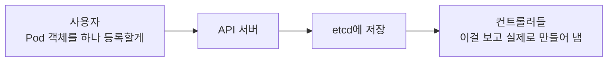
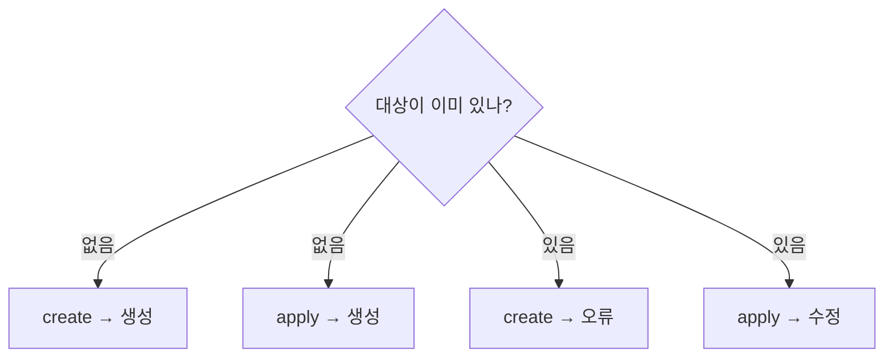
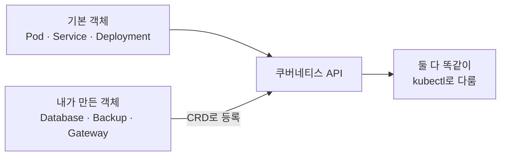
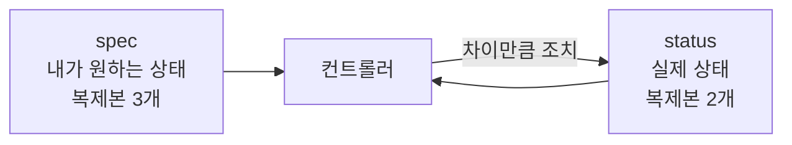
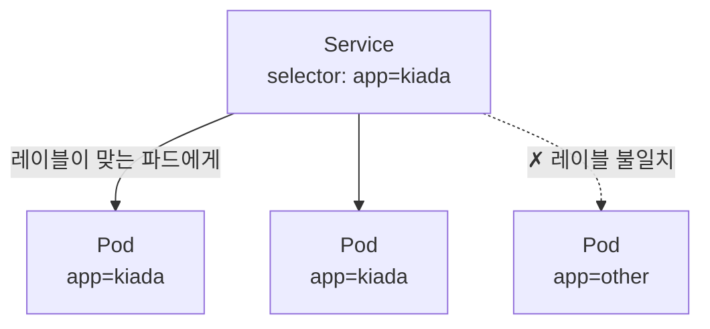
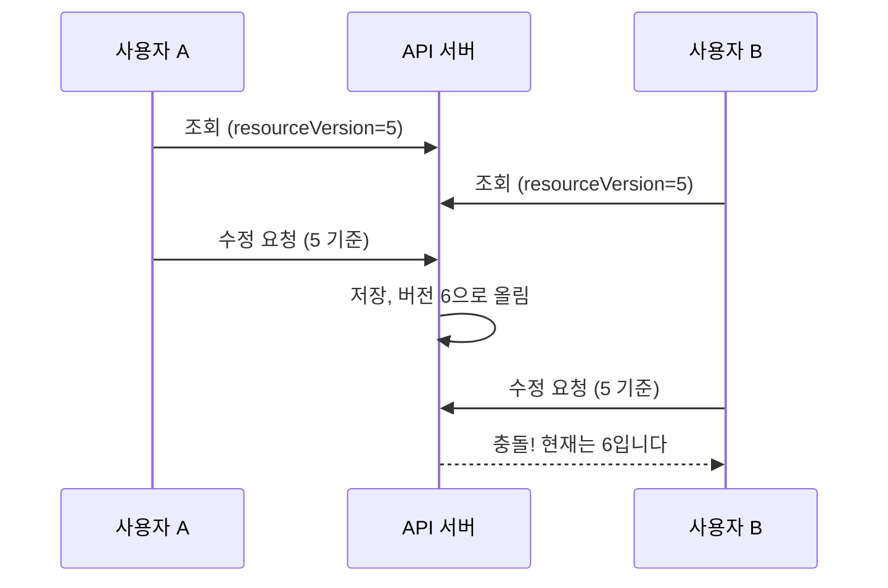
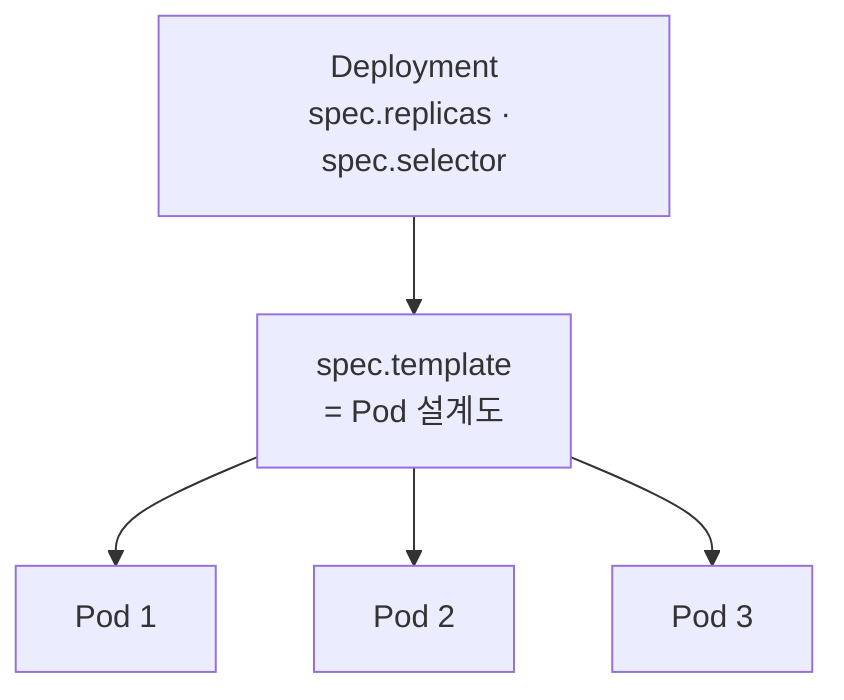
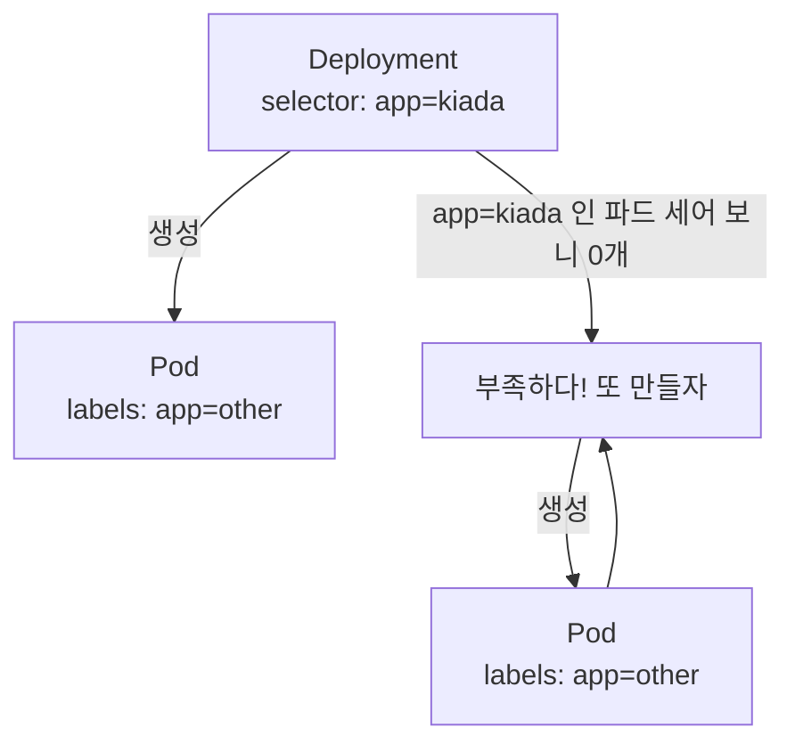

# 03장 핵심 질문 답변 — 쿠버네티스 API와 오브젝트 모델

[03장 핵심 질문](<03장 핵심 질문.md>)의 답변입니다. 먼저 스스로 답해 보고 펼치세요.

---

## 3.1 쿠버네티스 API 이해하기

### 1. "데이터베이스 + 컨트롤러들" ★★★★☆

**한 줄 답 — 사용자는 "이런 게 있어야 해"라고 객체를 등록만 하고, 그것을 현실로 만드는 일은 컨트롤러들이 합니다.**



조금 과감하게 말하면 이렇습니다.

> **쿠버네티스 = "객체를 저장하는 데이터베이스" + "그 객체를 실현하려고 애쓰는 컨트롤러들"**

**사용자가 실제로 하는 일은 "등록"뿐입니다.** 컨테이너를 실행하는 것도, 노드를 고르는 것도 사용자가 하지 않습니다. 식당에서 주문서를 쓰는 것과 같습니다. 주방에 들어가 요리하지 않습니다.

이 관점이 유용한 이유는, **쿠버네티스의 모든 작업이 결국 "객체 CRUD"라는 하나의 패턴으로 정리되기 때문**입니다. 파드를 만들든 서비스를 만들든 인그레스를 만들든, 하는 일은 똑같습니다.

### 2. HTTP 메서드와 kubectl 대응 ★★★☆☆

**한 줄 답 — 쿠버네티스 API는 REST 규칙을 그대로 따르고, kubectl 명령이 그 위에 1:1로 얹혀 있습니다.**

| HTTP 메서드 | 하는 일 | kubectl |
| :--- | :--- | :--- |
| `GET` | 조회 | `kubectl get`, `describe` |
| `POST` | 생성 | `kubectl create` |
| `PUT` / `PATCH` | 수정 | `kubectl apply`, `edit` |
| `DELETE` | 삭제 | `kubectl delete` |

URL도 규칙적입니다.

```
/api/v1/namespaces/{네임스페이스}/pods/{이름}
/apis/apps/v1/namespaces/{네임스페이스}/deployments/{이름}
```

**`/api`와 `/apis`가 다른 점**을 알아 두면 좋습니다. 핵심 그룹(Pod 등)은 `/api/v1`, 이름 있는 그룹(Deployment 등)은 `/apis/{그룹}/{버전}`입니다. `apiVersion` 표기법과 그대로 대응합니다.

### 3. kubectl 없이도 쓸 수 있다 ★★★☆☆

**한 줄 답 — kubectl은 HTTP 요청을 대신 만들어 주는 껍데기일 뿐이라, HTTP를 보낼 수 있으면 무엇으로든 쿠버네티스를 쓸 수 있습니다.**

**확인 방법 ① — `kubectl proxy` + `curl`**

인증을 대신 처리해 주는 통로를 열고 직접 호출합니다.

```bash
kubectl proxy
# Starting to serve on 127.0.0.1:8001
```

```bash
curl http://localhost:8001/api/v1/namespaces/default/pods
curl http://localhost:8001/api/v1/nodes
```

**확인 방법 ② — `-v=8`로 kubectl이 보내는 요청 엿보기**

```bash
kubectl get pods -v=8
# GET https://127.0.0.1:6443/api/v1/namespaces/default/pods?limit=500
```

방금 `curl`로 친 것과 **같은 주소**가 나옵니다. 이것이 "모든 kubectl 명령은 결국 API 요청 하나"라는 사실의 증거입니다.

### 4. 명령형 vs 선언형, 왜 선언형이 표준인가 ★★★★★

**한 줄 답 — 명령형은 과정을 지시하고 선언형은 결과를 선언합니다. 선언형은 YAML 파일이 남아 Git에 기록되고 복구가 가능하기 때문에 실무 표준입니다.**

| | 명령형(Imperative) | 선언형(Declarative) |
| :--- | :--- | :--- |
| 예 | `kubectl create deployment ...` | `kubectl apply -f app.yaml` |
| 장점 | 빠르고 간단 | **YAML을 Git에 남길 수 있음**, 복구 가능 |
| 단점 | **기록이 남지 않음** | 파일을 만들어야 함 |

**선언형이 표준인 이유를 세 가지로 정리하면 좋습니다.**

1. **기록이 남습니다.** 명령형은 터미널 히스토리가 지워지면 "지금 뭐가 떠 있는지"를 아무도 재현할 수 없습니다.
2. **클러스터가 통째로 날아가도 복구됩니다.** YAML만 있으면 `apply` 한 번으로 되돌아옵니다.
3. **리뷰와 협업이 가능합니다.** 변경을 PR로 검토할 수 있습니다.

이것이 1.1절의 **선언적 모델이 명령 수준에서 드러나는 지점**입니다. 쿠버네티스 전체가 "결과만 선언한다"는 철학 위에 있고, `apply`가 그 입구입니다.

### 5. `create`와 `apply`의 차이 ★★★★☆

**한 줄 답 — 이미 있을 때 `create`는 오류를 내고, `apply`는 알아서 수정합니다.**

| 상황 | `kubectl create` | `kubectl apply` |
| :--- | :--- | :--- |
| 대상이 **없을 때** | 생성 | 생성 |
| 대상이 **이미 있을 때** | **오류** (`AlreadyExists`) | **수정** (변경분만 반영) |



**실무에서 이 차이가 중요한 이유** — 배포는 한 번만 하는 일이 아닙니다. 같은 YAML을 열 번 적용해도 문제가 없어야 CI/CD가 돌아갑니다. `apply`는 **몇 번을 실행해도 같은 결과**가 되므로(멱등) 자동화에 적합하고, `create`는 두 번째 실행에서 파이프라인이 깨집니다.

### 6. API 그룹은 왜 나뉘어 있나 ★★★★☆

**한 줄 답 — 그룹마다 독립적으로 버전을 올릴 수 있게 하기 위해서입니다. 핵심 그룹은 그룹 이름 없이 버전만 적습니다.**

```yaml
apiVersion: v1        # 핵심 그룹 — 그룹 없이 버전만
kind: Pod

apiVersion: apps/v1   # 이름 있는 그룹 — 그룹/버전
kind: Deployment
```

| 구분 | 표기 | 속하는 객체 |
| :--- | :--- | :--- |
| **핵심 그룹(Core/Legacy)** | `v1` | Pod, Service, Node, Namespace, ConfigMap, Secret |
| **이름 있는 그룹** | `그룹/버전` | Deployment, Job, Ingress 등 |

**나눈 이유** — `apps` 그룹이 v2로 올라가도 `batch` 그룹은 v1 그대로 둘 수 있습니다. 객체 종류가 수십 가지인데 전부 한 덩어리로 묶여 있으면, 하나를 고치기 위해 전부를 함께 올려야 합니다.

> **핵심 그룹에 이름이 없는 것은 설계가 아니라 역사입니다.** 가장 먼저 만들어진 객체들이라 그룹 개념이 생기기 전부터 있었습니다. 그래서 `Legacy 그룹`이라고도 부릅니다.

### 7. 그룹별 주요 객체 ★★★★☆

**한 줄 답 — 하는 일이 비슷한 객체끼리 묶여 있습니다.**

| 그룹 | 주요 객체 | 성격 |
| :--- | :--- | :--- |
| `apps` | Deployment, ReplicaSet, StatefulSet, DaemonSet | **워크로드 관리** |
| `batch` | Job, CronJob | **일회성·주기 작업** |
| `networking.k8s.io` | Ingress, NetworkPolicy | **네트워크** |
| `storage.k8s.io` | StorageClass, CSIDriver | **스토리지** |
| `rbac.authorization.k8s.io` | Role, RoleBinding | **권한** |
| `autoscaling` | HorizontalPodAutoscaler | **자동 확장** |
| `gateway.networking.k8s.io` | Gateway, HTTPRoute | **차세대 트래픽 라우팅** |

**외우기보다 규칙을 잡는 게 낫습니다.** 파드를 여러 개 관리하는 것은 `apps`, 네트워크는 `networking.k8s.io`, 권한은 `rbac...` 하는 식입니다. 정확한 값이 필요하면 확인하면 됩니다.

```bash
kubectl api-resources     # 객체 종류 전체와 소속 그룹
kubectl api-versions      # 사용 가능한 그룹/버전
```

### 8. alpha · beta · v1 ★★★★☆

**한 줄 답 — 안정성 단계 표시이고, 운영 환경에서는 정식 버전(`v1`)만 씁니다.**

| 버전 | 안정성 | 의미 |
| :--- | :--- | :--- |
| `v1alpha1` | 낮음 | 실험 단계. **예고 없이 사라질 수 있음.** 기본적으로 꺼져 있음 |
| `v1beta1` | 보통 | 꽤 쓸 만함. 하지만 **필드 이름이 바뀔 수 있음** |
| `v1` | 높음 | 정식(GA). **하위 호환이 보장됨** |

**beta를 운영에 쓰면 나는 사고** — 쿠버네티스를 업그레이드하는 순간 해당 API가 제거되어 **기존 YAML이 전부 거부됩니다.** 실제로 자주 일어난 일이라 공식 문서에 제거 목록이 따로 있습니다.

| 객체 | 제거된 버전 | 지금 써야 할 버전 |
| :--- | :--- | :--- |
| CronJob | `batch/v1beta1` | `batch/v1` |
| Ingress | `extensions/v1beta1` | `networking.k8s.io/v1` |
| HorizontalPodAutoscaler | `autoscaling/v2beta2` | `autoscaling/v2` |

> 인터넷의 오래된 YAML을 복사해 쓸 때 특히 조심해야 합니다. `kubent` 같은 도구로 클러스터에서 문제 되는 것을 미리 찾을 수 있습니다.

### 9. `NAMESPACED` 열 ★★★★☆

**한 줄 답 — 그 객체가 네임스페이스에 속하는지(`true`), 클러스터 전체에 하나뿐인지(`false`)를 나타냅니다.**

```bash
kubectl api-resources | head
# NAME          SHORTNAMES   APIVERSION   NAMESPACED   KIND
# pods          po           v1           true         Pod
# services      svc          v1           true         Service
# nodes         no           v1           false        Node
# deployments   deploy       apps/v1      true         Deployment
```

| 값 | 의미 | 예 |
| :--- | :--- | :--- |
| `true` | **네임스페이스 소속** | Pod, Service, Deployment, ConfigMap, Secret |
| `false` | **클러스터 전역** | Node, Namespace, PersistentVolume, StorageClass |

**감을 잡는 요령** — "이게 `dev`에도 있고 `prod`에도 따로 있을 수 있나?"를 물어보면 됩니다.

* 파드는 `dev`에도 `prod`에도 각각 있을 수 있습니다 → `true`
* **노드는 클러스터에 물리적으로 하나뿐**입니다. `dev`용 노드와 `prod`용 노드로 쪼개질 수 없습니다 → `false`

`false`인 객체는 `-n` 옵션이 의미가 없습니다. 자세한 건 7장에서 다룹니다.

### 10. 도구가 아니라 플랫폼 ★★★★☆

**한 줄 답 — CRD로 사용자가 API 자체를 늘릴 수 있기 때문입니다.**

보통 도구는 **정해진 기능만** 씁니다. 쿠버네티스는 다릅니다. **CRD(CustomResourceDefinition)** 를 등록하면 쿠버네티스에 원래 없던 **새로운 객체 종류**를 만들 수 있습니다.



**CRD로 등록한 객체는 기본 객체와 완전히 동등하게 취급됩니다.** `kubectl get`으로 조회되고, YAML로 `apply`하고, 컨트롤러를 붙여 조정 루프를 돌릴 수 있습니다.

**가장 대표적인 실제 사례가 Gateway API**(13장)입니다. 쿠버네티스에 기본 내장되어 있지 않고 CRD를 따로 설치해야 합니다.

```bash
kubectl apply -f https://github.com/kubernetes-sigs/gateway-api/releases/download/v1.2.0/standard-install.yaml
kubectl get crds | grep gateway
```

**이게 왜 "플랫폼"이냐면**, 사용자가 자기 도메인의 개념(예: `Database`)을 쿠버네티스 언어로 표현하고, 그것을 실현하는 컨트롤러를 직접 붙일 수 있기 때문입니다. 이 조합을 **오퍼레이터**라고 부르고 16장에서 다룹니다.

---

## 3.2 오브젝트 매니페스트 구조

### 11. 모든 객체의 공통 5구조 ★★★★★

**한 줄 답 — `apiVersion` · `kind` · `metadata` · `spec` · `status`입니다.**

```yaml
apiVersion: v1        # 1. 어떤 API 버전을 쓸 것인가
kind: Pod             # 2. 어떤 종류의 객체인가
metadata:             # 3. 이름표와 꼬리표
  name: kiada
spec:                 # 4. 원하는 상태 (내가 작성)
  containers:
    - name: kiada
      image: luksa/kiada:0.1
status:               # 5. 실제 상태 (쿠버네티스가 채움)
  phase: Running
```

**객체 종류가 달라도 이 뼈대는 항상 같습니다.** Deployment든 Service든 Ingress든 마찬가지입니다. 달라지는 것은 `spec` 안쪽 내용뿐입니다.

이 구조 하나만 잡아 두면 **처음 보는 객체의 YAML도 읽을 수 있습니다.** "아, `spec` 안만 새로 배우면 되는구나"가 되기 때문입니다.

### 12. `spec` vs `status` ★★★★★

**한 줄 답 — `spec`은 사람이 쓰고 `status`는 쿠버네티스가 씁니다. 컨트롤러가 하는 일은 `status`를 `spec`에 맞추는 것입니다.**



| | `spec` | `status` |
| :--- | :--- | :--- |
| 누가 쓰나 | **사람** (YAML에 작성) | **쿠버네티스** (자동으로 채움) |
| 뜻 | **원하는** 상태 | **실제** 상태 |
| YAML에 적나 | 적습니다 | **적지 않습니다** |

**1.1절의 조정 루프가 여기서 구체화됩니다.** 추상적으로 "원하는 상태와 실제 상태"라고 했던 것이, 매니페스트에서는 정확히 `spec`과 `status`라는 두 필드입니다.

그래서 컨트롤러의 일을 한 문장으로 쓰면 이렇게 됩니다.

> **`status`를 계속 읽어서 `spec`과 다르면 같아지도록 조치한다.**

### 13. `apiVersion`을 틀리면 ★★★☆☆

**한 줄 답 — `no matches for kind` 오류가 나고, `kubectl explain`으로 올바른 버전을 확인합니다.**

```
error: unable to recognize "app.yaml": no matches for kind "Deployment" in version "v1"
```

Deployment는 `apps/v1`인데 `v1`이라고 적어서 난 오류입니다. 쿠버네티스는 **"`v1` 그룹에는 Deployment라는 종류가 없다"** 고 정확히 말해 주고 있습니다.

확인 방법입니다.

```bash
kubectl explain deployment      # 올바른 apiVersion과 필드 설명
kubectl api-resources | grep deployment
```

**`kubectl explain`은 내장 매뉴얼입니다.** 필드마다 설명과 타입이 나오고, `-required-` 표시로 필수 항목도 알려 줍니다. 인터넷을 뒤지기 전에 여기부터 보는 습관이 좋습니다.

### 14. 레이블 vs 어노테이션 ★★★★★

**한 줄 답 — 레이블은 고르고 묶는 용도, 어노테이션은 기록해 두는 용도입니다.**

| | 레이블(labels) | 어노테이션(annotations) |
| :--- | :--- | :--- |
| 목적 | **선택하고 그룹 짓기** | **정보를 기록해 두기** |
| 검색 | `kubectl get -l app=kiada` **가능** | **불가능** |
| 길이 제한 | 63자 | **사실상 무제한** |
| 쓰는 곳 | 서비스의 파드 선택, 셀렉터 | 도구가 남기는 메타정보, 설명 |

```yaml
metadata:
  labels:                        # 고르는 데 쓰임
    app: kiada
    tier: frontend
  annotations:                   # 읽는 데만 쓰임
    description: "첫 번째 실습 앱"
    kubernetes.io/change-cause: "v0.1 최초 배포"
```

**가르는 기준은 "이걸로 검색할 일이 있나?"** 입니다.

* `app: kiada` — 서비스가 이걸로 파드를 고릅니다 → **레이블**
* `description: 첫 번째 실습 앱` — 사람이 읽을 뿐입니다 → **어노테이션**

길이 제한이 다른 것도 여기서 나옵니다. 검색 대상은 짧고 단순해야 빠르지만, 기록은 길어도 상관없습니다.

### 15. 서비스가 파드를 고르는 기준 ★★★★★

**한 줄 답 — 레이블입니다. 파드 이름이나 IP가 아닙니다.**



**왜 이름이 아니라 레이블이냐**가 이 질문의 핵심입니다.

파드는 **일회용**입니다(4.1절). 죽고 새로 생길 때마다 **이름도 IP도 전부 바뀝니다.** 서비스가 이름이나 IP로 대상을 지정하면, 파드가 한 번 죽는 순간 연결이 끊깁니다.

레이블로 고르면 이야기가 달라집니다. **"`app=kiada`인 파드 전부"** 라는 조건은 파드가 몇 번을 죽고 살아나도 그대로 유효합니다. 새로 생긴 파드도 같은 레이블을 달고 나오니 자동으로 대상에 포함됩니다.

**"이름표가 아니라 조건으로 고른다"** — 이것이 쿠버네티스가 파드의 일회용 성질과 안정적인 서비스를 동시에 만족시키는 방법입니다. 자세한 건 11장에서 다룹니다.

### 16. `uid`와 `resourceVersion` ★★★☆☆

**한 줄 답 — `uid`는 객체의 진짜 정체성, `resourceVersion`은 수정 횟수입니다. 쿠버네티스는 이름이 아니라 uid로 객체를 구분합니다.**

```yaml
metadata:
  uid: 7d4c8f9b-6d3e-4a1b-9c2d-8e7f6a5b4c3d   # 전 우주에서 유일한 ID
  resourceVersion: "12345"                     # 수정될 때마다 증가
```

* **`uid`** — 같은 이름으로 지웠다 다시 만들어도 **uid는 달라집니다.** 이름 `kiada`는 재사용할 수 있지만, uid는 절대 재사용되지 않습니다. **사람으로 치면 이름이 아니라 주민번호**입니다.
* **`resourceVersion`** — 객체가 수정될 때마다 올라갑니다. 낙관적 잠금(다음 문제)에 쓰입니다.

**"이름이 아니라 uid로 구분한다"가 왜 중요하냐면**, 지웠다가 같은 이름으로 다시 만든 객체를 쿠버네티스가 **완전히 다른 객체로 취급**하기 때문입니다. 옛 객체를 참조하던 것들이 새 객체에 잘못 붙는 사고가 없습니다.

### 17. 동시 수정 (낙관적 잠금) ★★★☆☆

**한 줄 답 — 나중에 저장하려는 쪽이 충돌 오류를 받습니다. 먼저 저장한 사람의 변경을 덮어쓰지 않습니다.**



**동작 방식** — 객체를 수정할 때 "내가 본 버전은 5였다"를 함께 보냅니다. 서버의 현재 버전이 이미 6이면, **그 사이 누가 고쳤다는 뜻**이므로 거부합니다.

**"낙관적"이라 부르는 이유** — 미리 잠그지 않기 때문입니다. "충돌은 드물 것"이라고 낙관하고 일단 진행한 뒤, 저장할 때만 확인합니다. 미리 잠그는 비관적 잠금보다 훨씬 빠릅니다.

거부당한 쪽은 **최신 상태를 다시 읽어서 재시도**하면 됩니다. `kubectl edit`은 충돌이 나면 오류를 내고 **편집한 내용을 임시 파일로 남겨** 주므로, 그 파일을 가지고 다시 적용하면 됩니다.

### 18. Deployment의 `template` ★★★★★

**한 줄 답 — 사실상 Pod 매니페스트 그 자체입니다. `apiVersion`과 `kind`만 빠져 있습니다.**

```yaml
spec:
  replicas: 3
  selector:
    matchLabels:
      app: kiada
  template:              # ← 여기부터가 파드의 설계도
    metadata:
      labels:
        app: kiada
    spec:
      containers:
        - name: kiada
          image: luksa/kiada:0.1
```

`template` 안쪽만 떼어 놓고 보면 `metadata` + `spec` 구조가 **Pod와 똑같습니다.** `apiVersion: v1`과 `kind: Pod`가 없는 이유는, Deployment가 만드는 것이 파드라는 게 이미 정해져 있어서 다시 적을 필요가 없기 때문입니다.

**이 중첩 구조를 이해하면 Deployment YAML이 갑자기 쉬워집니다.** 새로 배울 게 `replicas`와 `selector` 두 개뿐이고, 나머지는 이미 아는 Pod입니다.



### 19. `selector`와 레이블이 안 맞으면 ★★★★★

**한 줄 답 — 디플로이먼트가 자기가 만든 파드를 못 알아봐서, 파드를 무한정 만들어 냅니다.**



무슨 일이 벌어지는지 순서대로 보면 이렇습니다.

1. 디플로이먼트가 `template`대로 파드를 만듭니다. 이 파드에는 `app=other` 레이블이 붙습니다.
2. 디플로이먼트가 "`app=kiada`인 파드가 몇 개지?" 하고 셉니다. **0개입니다.**
3. "3개여야 하는데 0개네" → 또 만듭니다.
4. **2번으로 돌아갑니다. 영원히.**

조정 루프가 정상적으로 도는데도 목표에 영원히 도달하지 못하는 상황입니다. **초보자가 가장 많이 겪는 오류**이고, 겉보기에는 "파드가 계속 늘어난다"로만 보여서 원인을 찾기 어렵습니다.

> **규칙은 간단합니다. `selector.matchLabels`와 `template.metadata.labels`는 반드시 일치해야 합니다.**

### 20. `status`에 담기는 정보 ★★★☆☆

**한 줄 답 — 파드의 현재 단계, IP, 시작 시각, 조건, 컨테이너별 상태 등 "지금 실제로 어떤지"가 들어갑니다.**

```yaml
status:
  phase: Running
  podIP: 10.244.1.5
  hostIP: 172.18.0.3
  startTime: "2026-08-19T10:30:05Z"
  conditions:
    - type: Ready
      status: "True"
  containerStatuses:
    - name: kiada
      ready: true
      restartCount: 0
```

조회 명령입니다.

```bash
kubectl get pod kiada -o yaml                          # spec + status 전부
kubectl get pod kiada -o jsonpath='{.status.podIP}'    # 특정 값만 뽑기
kubectl describe pod kiada                             # 사람이 읽기 좋게
```

**`-o jsonpath`가 실무에서 유용합니다.** 스크립트에서 파드 IP나 QoS 등급 같은 값 하나만 뽑아 쓸 때 씁니다.

> `-o yaml`로 보면 책에 없던 `metadata.managedFields`라는 긴 블록이 붙어 있습니다. Server-Side Apply가 "이 필드는 누가 관리하는가"를 기록한 것입니다. 지저분하면 `--show-managed-fields=false`로 숨기면 됩니다.
