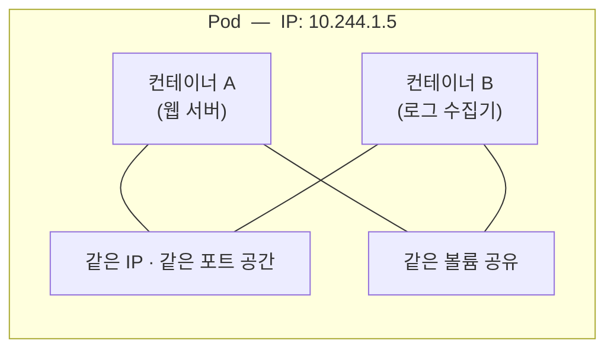
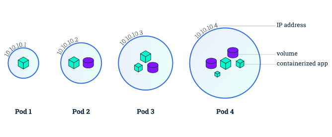

# 4.1 파드 이해하기

**파드(Pod)** 는 쿠버네티스에서 **배포할 수 있는 가장 작은 단위**입니다. 여기서 많은 사람이 처음에 혼란을 겪습니다.

> **"컨테이너를 배포하는 거 아니었나요?"**
> 아닙니다. 쿠버네티스는 **컨테이너를 직접 다루지 않습니다.** 항상 파드로 감싸서 다룹니다.

## 왜 컨테이너를 그냥 쓰지 않을까요?

컨테이너에는 한 가지 원칙이 있습니다. **"하나의 컨테이너에는 하나의 프로세스만"**

이 원칙에는 이유가 있습니다.

* 컨테이너는 PID 1번 프로세스가 죽으면 통째로 종료됩니다 (2.3절 참고)
* 프로세스가 여러 개면 어느 것이 죽었는지 관리하기 어렵습니다
* 로그가 뒤섞입니다

그런데 현실에서는 **아주 밀접하게 붙어 있어야 하는 프로세스들**이 있습니다.

* 웹 서버 + 로그 수집기
* 앱 + 설정 파일 동기화 도구
* 앱 + 네트워크 프록시

이들을 한 컨테이너에 넣자니 원칙에 어긋나고, 완전히 따로 떼자니 서로 통신하고 파일을 공유하기 번거롭습니다.

**파드는 이 중간 지점입니다.**



공식 문서도 파드를 **"컨테이너 + 공유 스토리지 + 공유 네트워크를 묶은 하나의 단위"** 로 그립니다.



> 출처: [Kubernetes Documentation — Viewing Pods and Nodes](https://kubernetes.io/docs/tutorials/kubernetes-basics/explore/explore-intro/) © The Kubernetes Authors, [CC BY 4.0](https://creativecommons.org/licenses/by/4.0/)

## 파드 안의 컨테이너들이 공유하는 것

| 공유하는 것 | 의미 |
| :--- | :--- |
| **네트워크 네임스페이스** | 같은 IP, 같은 포트 공간. `localhost`로 서로 통신 가능 |
| **IPC 네임스페이스** | 프로세스 간 통신 자원 공유 |
| **UTS 네임스페이스** | 같은 호스트명 |
| **볼륨(Volume)** | 지정한 디렉터리를 함께 사용 |

**공유하지 않는 것**도 중요합니다.

| 공유 안 함 | 의미 |
| :--- | :--- |
| **파일 시스템** | 각자 자기 이미지의 파일을 씀. 볼륨으로 마운트한 곳만 공유 |
| **PID 네임스페이스** | 기본적으로 서로의 프로세스가 안 보임 (설정으로 켤 수 있음) |

> **핵심**
> 같은 파드의 컨테이너들은 **`localhost:포트`로 서로를 부를 수 있습니다.** 이것이 파드의 가장 큰 특징입니다.
>
> 단, **포트 번호가 겹치면 안 됩니다.** 포트 공간을 공유하기 때문에, 두 컨테이너가 모두 8080을 쓰려고 하면 하나가 실패합니다.

## 파드는 스케줄링의 단위입니다

**한 파드 안의 모든 컨테이너는 반드시 같은 노드에 배치됩니다.** 절대로 나뉘지 않습니다.

이것이 중요한 이유입니다. "이 두 프로세스는 무조건 같은 기계에 있어야 해"라고 보장하고 싶을 때 파드로 묶으면 됩니다.

## 언제 한 파드에 넣고, 언제 나눌까요?

가장 많이 하는 실수가 **모든 것을 한 파드에 몰아넣는 것**입니다.

### 나눠야 하는 경우 (대부분 여기 해당)

```
X 나쁜 예: 한 파드에 프론트엔드 + 백엔드 + DB
```

* 각각 **따로 확장**해야 하기 때문입니다. 프론트엔드만 10개로 늘리고 싶은데, 한 파드에 있으면 DB까지 10개가 됩니다
* 각각 **다른 주기로 배포**되기 때문입니다
* 하나가 죽으면 전부 재시작될 수 있습니다

```
O 좋은 예: 프론트엔드 파드 / 백엔드 파드 / DB 파드로 분리
```

### 한 파드에 넣어야 하는 경우

**"이 둘이 다른 기계에 있으면 동작이 아예 불가능한가?"** 라고 물어보세요. 답이 "그렇다"면 한 파드입니다.

* 앱 + **로그 수집기** (같은 로그 파일을 읽어야 함)
* 앱 + **네트워크 프록시** (localhost로 트래픽을 가로채야 함)
* 앱 + **설정 동기화 도구** (같은 설정 디렉터리를 써야 함)

이런 보조 컨테이너를 **사이드카(Sidecar)** 라고 부릅니다. 오토바이 옆에 붙은 보조석에서 나온 말입니다.

### 판단 기준 요약

| 질문 | 예 → 한 파드 | 아니오 → 별도 파드 |
| :--- | :--- | :--- |
| 반드시 같은 노드여야 하나? | O | X |
| 같은 파일 시스템을 공유해야 하나? | O | X |
| localhost로 통신해야 하나? | O | X |
| 항상 같은 개수로 확장되나? | O | X |
| 항상 함께 배포되나? | O | X |

## 파드는 일회용입니다

파드에 대해 반드시 기억해야 할 성질입니다.

* **파드는 절대 치유되지 않습니다.** 파드 안의 컨테이너는 재시작될 수 있지만, 파드 자체가 죽으면 그걸로 끝입니다
* 노드가 죽으면 그 위의 파드는 **다른 노드로 옮겨 가지 않고 그냥 사라집니다**
* 새 파드가 만들어지면 **이름도 IP도 전부 새것**입니다

> **파드는 가축이지 애완동물이 아닙니다.**
> 실무에서 자주 쓰는 비유입니다. 애완동물은 아프면 치료하지만, 가축은 아프면 교체합니다. 파드도 마찬가지입니다. **고치는 게 아니라 버리고 새로 만듭니다.**

그래서 실무에서는 **파드를 직접 만들지 않습니다.** 항상 디플로이먼트 같은 컨트롤러가 대신 만들게 합니다. 그래야 사라졌을 때 누군가 다시 만들어 주기 때문입니다.

```
X  파드를 직접 생성 -> 죽으면 아무도 안 살려 줌
O  Deployment 생성 -> ReplicaSet이 항상 개수를 맞춰 줌
```

**그럼 왜 4장에서 파드를 직접 만드나요?** 원리를 배우기 위해서입니다. 파드를 모르면 디플로이먼트도 이해할 수 없습니다.

---

## 요약 및 비유

| 개념 | 아파트 비유 | 기술적 의미 |
| :--- | :--- | :--- |
| **파드** | 한 세대(집) | 배포 가능한 최소 단위 |
| **파드 안 컨테이너** | 같은 집에 사는 가족 | 네트워크·볼륨을 공유하는 프로세스들 |
| **네트워크 공유** | 같은 집 주소, 같은 전화선 | 동일 IP, localhost 통신 |
| **사이드카** | 집안일을 돕는 도우미 | 주 컨테이너를 보조하는 컨테이너 |
| **파드는 일회용** | 이사 가면 주소가 완전히 바뀜 | 재생성 시 이름·IP 전부 변경 |

---

## 결론

* 쿠버네티스는 컨테이너가 아니라 **파드를 배포합니다.**
* 파드는 **네트워크와 볼륨을 공유하는 컨테이너 묶음**이며, 반드시 **같은 노드**에 배치됩니다.
* **"따로 확장해야 하면 따로 파드"** 가 가장 실용적인 판단 기준입니다.
* 파드는 **일회용**입니다. 고치지 않고 버리고 새로 만듭니다.
* 실무에서는 파드를 직접 만들지 않고 **컨트롤러(Deployment 등)를 통해** 만듭니다.

---

## 공식 문서 업데이트 (2026년 8월 기준)

### 1) 사이드카가 정식 기능이 되었습니다 (가장 큰 변화)

책에서 사이드카는 **"그냥 컨테이너를 여러 개 넣는 패턴"** 일 뿐이었습니다. 쿠버네티스가 특별히 지원해 주는 게 없어서 다음 문제들이 있었습니다.

* 사이드카가 먼저 준비되기 전에 주 컨테이너가 시작될 수 있음
* Job에서 주 작업이 끝나도 사이드카가 안 죽어서 **Job이 영원히 완료되지 않음**
* 종료 순서를 제어할 수 없음

**쿠버네티스 1.33에서 네이티브 사이드카가 정식(GA)** 이 되었습니다. `initContainers`에 `restartPolicy: Always`를 붙이는 방식입니다.

```yaml
spec:
  initContainers:
    - name: log-shipper
      image: fluent-bit
      restartPolicy: Always      # <-- 이 한 줄이 사이드카로 만듭니다
  containers:
    - name: kiada
      image: luksa/kiada:0.1
```

`initContainers`에 넣는데도 파드가 사는 동안 계속 실행됩니다. 이렇게 하면 얻는 것들입니다.

| | 기존 방식 (일반 컨테이너) | 네이티브 사이드카 |
| :--- | :--- | :--- |
| 시작 순서 | 보장 안 됨 | **주 컨테이너보다 먼저 시작** |
| 종료 순서 | 보장 안 됨 | **주 컨테이너가 끝난 뒤 역순 종료** |
| Job 완료 | **막힘** | 주 컨테이너가 끝나면 정상 완료 |
| 프로브 | 사용 가능 | 사용 가능 |

참고: <https://kubernetes.io/docs/concepts/workloads/pods/sidecar-containers/>

### 2) 사용자 네임스페이스 지원

파드 안의 root를 호스트의 일반 사용자로 매핑해서 보안을 높이는 기능입니다.

```yaml
spec:
  hostUsers: false
```

### 3) 파드 수준 자원 설정

예전에는 자원 요청·제한을 컨테이너마다 따로 적어야 했습니다. 최근에는 **파드 전체에 한 번에** 지정하는 방식도 추가되어, 사이드카가 많은 파드의 설정이 훨씬 간단해졌습니다.

```yaml
spec:
  resources:                  # 파드 전체 단위
    limits:
      cpu: "1"
      memory: 512Mi
```

### 4) 파드 이름 접미사 규칙 변경

책에는 파드 이름이 `kiada-7d4c8f9b6d-x7k2m` 처럼 나오는데, 지금도 형태는 같습니다. 다만 레플리카셋 해시 계산 방식이 바뀌어서 **같은 YAML이라도 책과 다른 해시**가 나옵니다. 정상이니 놀라지 마세요.
