# 04장 핵심 질문 답변 — 파드로 애플리케이션 실행하기

[04장 핵심 질문](<04장 핵심 질문.md>)의 답변입니다. 먼저 스스로 답해 보고 펼치세요.

---

## 4.1 파드 이해하기

### 1. 가장 작은 배포 단위 ★★★★★

**한 줄 답 — 파드입니다. 쿠버네티스는 컨테이너를 직접 다루지 않고 항상 파드로 감싸서 다룹니다.**

"컨테이너를 배포하는 거 아니었나?"가 자연스러운 오해입니다. 아닙니다.

**컨테이너를 직접 쓰지 않는 이유**는, 현실에 **아주 밀접하게 붙어 있어야 하는 프로세스들**이 있기 때문입니다. 웹 서버와 로그 수집기 같은 짝이 그렇습니다. 이들을 한 컨테이너에 넣자니 "한 컨테이너에 한 프로세스" 원칙이 깨지고, 완전히 떼자니 통신과 파일 공유가 번거롭습니다.

**파드는 그 중간 지점입니다.** 컨테이너는 각자 격리를 유지하면서도, 네트워크와 볼륨은 공유하는 묶음입니다.

> 컨테이너가 **1개뿐이어도 파드로 감쌉니다.** 봉투에 붕어빵 하나만 들어 있어도 봉투는 씁니다.

### 2. "한 컨테이너에 한 프로세스" 원칙의 근거 ★★★★☆

**한 줄 답 — PID 1이 죽으면 컨테이너가 통째로 끝나고, 관리가 어려워지고, 로그가 뒤섞이기 때문입니다.**

* **PID 1번 프로세스가 죽으면 컨테이너가 종료됩니다.** 여러 개를 넣으면 대표 프로세스 하나가 나머지의 생사를 좌우합니다.
* **어느 것이 죽었는지 관리하기 어렵습니다.** 컨테이너는 살아 있는데 안의 프로세스 하나만 죽어 있으면, 쿠버네티스는 정상으로 봅니다.
* **로그가 뒤섞입니다.** 여러 프로세스가 같은 stdout에 쏟아내면 `kubectl logs`로 구분할 수 없습니다.

**정리하면 "컨테이너 = 격리된 프로세스 하나"라는 모델이 깨지면, 쿠버네티스가 제공하는 감시·재시작·로그 수집이 전부 부정확해집니다.**

### 3. 딜레마를 파드가 해결하는 방식 ★★★★☆

**한 줄 답 — 컨테이너는 그대로 분리해 두고, 네트워크와 볼륨만 공유시킵니다.**

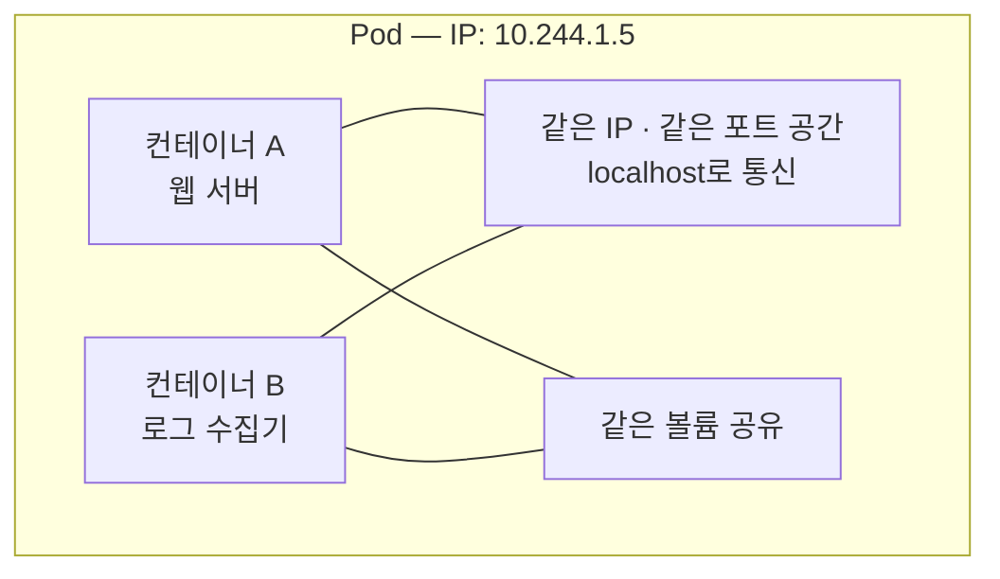

**두 극단의 좋은 점만 가져온 구조입니다.**

| | 한 컨테이너에 몰아넣기 | 완전히 분리 | **파드** |
| :--- | :--- | :--- | :--- |
| 프로세스별 격리 | ✗ 없음 | ○ 있음 | **○ 있음** |
| localhost 통신 | ○ 됨 | ✗ 안 됨 | **○ 됨** |
| 파일 공유 | ○ 쉬움 | ✗ 어려움 | **○ 볼륨으로** |
| 같은 노드 보장 | ○ 당연 | ✗ 보장 안 됨 | **○ 보장됨** |

기술적으로는 2.3절의 **네임스페이스 공유**를 이용한 것입니다. 새 기술이 아니라 리눅스가 원래 할 수 있던 일을 쿠버네티스가 개념으로 정리한 것입니다.

### 4. 파드 안에서 공유하는 것과 안 하는 것 ★★★★★

**한 줄 답 — 네트워크·IPC·UTS·볼륨은 공유하고, 파일 시스템과 PID는 공유하지 않습니다.**

| **공유하는 것** | 의미 |
| :--- | :--- |
| **네트워크 네임스페이스** | 같은 IP, 같은 포트 공간. `localhost` 통신 가능 |
| **IPC 네임스페이스** | 프로세스 간 통신 자원 공유 |
| **UTS 네임스페이스** | 같은 호스트명 (= 파드 이름) |
| **볼륨(Volume)** | 지정한 디렉터리를 함께 사용 |

| **공유하지 않는 것** | 의미 |
| :--- | :--- |
| **파일 시스템** | 각자 자기 이미지의 파일. 볼륨으로 마운트한 곳만 공유 |
| **PID 네임스페이스** | 기본적으로 서로의 프로세스가 안 보임 (설정으로 켤 수 있음) |

**안 하는 쪽이 더 중요한 질문입니다.** "파드 안이면 다 공유하겠지"라고 뭉뚱그리는 답과, "파일 시스템은 따로입니다"까지 말하는 답은 차이가 큽니다. 파일을 주고받으려면 **볼륨을 명시적으로 붙여야** 합니다.

### 5. 두 컨테이너가 같은 포트를 쓰면 ★★★★☆

**한 줄 답 — 하나가 실패합니다. 포트 공간을 공유하기 때문입니다.**

같은 파드의 컨테이너들은 **네트워크 네임스페이스가 하나**입니다. 즉 **IP도 하나, 포트 공간도 하나**입니다. 한 대의 기계 안에서 두 프로그램이 8080을 쓰려는 것과 완전히 같은 상황입니다.

먼저 바인딩한 쪽이 이기고, 나중 것은 `address already in use`로 죽습니다.

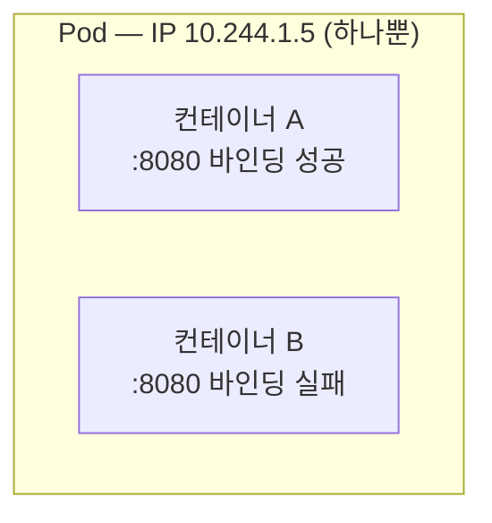

**1.0절에서 배운 것과 이어서 이해하면 좋습니다.** "쿠버네티스에서는 포트 충돌이 사라진다"고 했는데, 그건 **파드마다 IP가 다르기 때문**입니다. 파드가 다르면 8080을 몇 개든 쓸 수 있지만, **한 파드 안에서는 여전히 충돌합니다.**

### 6. 파드 안 컨테이너가 다른 노드에 갈 수 있나 ★★★★★

**한 줄 답 — 절대 불가능합니다. 한 파드의 모든 컨테이너는 반드시 같은 노드에 배치됩니다.**

당연한 이야기입니다. 컨테이너들이 **같은 IP를 쓰고 `localhost`로 통신하고 같은 볼륨을 본다**면, 물리적으로 같은 기계에 있어야만 가능합니다.

**그래서 파드는 "스케줄링의 단위"입니다.** 스케줄러는 컨테이너 하나하나를 배치하지 않고, **파드 전체를 한 노드에 통째로** 놓습니다.

이 성질이 곧 다음 문제의 답이 됩니다.

### 7. 같은 기계에 있음을 보장하려면 ★★★★☆

**한 줄 답 — 한 파드로 묶으면 됩니다.**

"이 두 프로세스는 무조건 같은 기계에 있어야 해"를 표현하는 방법이 바로 파드입니다. 노드를 직접 지정하거나 어피니티 규칙을 쓸 필요가 없습니다. **파드로 묶는 것만으로 100% 보장됩니다.**

**언제 이게 필요하냐면**,

* 로그 수집기가 앱이 쓰는 **같은 로그 파일**을 읽어야 할 때
* 프록시가 앱의 트래픽을 **localhost로 가로채야** 할 때
* 설정 동기화 도구가 앱과 **같은 설정 디렉터리**를 써야 할 때

전부 "다른 기계에 있으면 아예 불가능한" 경우입니다. 이것이 다음 문제의 판단 기준이기도 합니다.

### 8. 프론트엔드·백엔드·DB를 한 파드에 넣으면 안 되는 이유 ★★★★★

**한 줄 답 — 따로 확장할 수 없고, 따로 배포할 수 없기 때문입니다.**

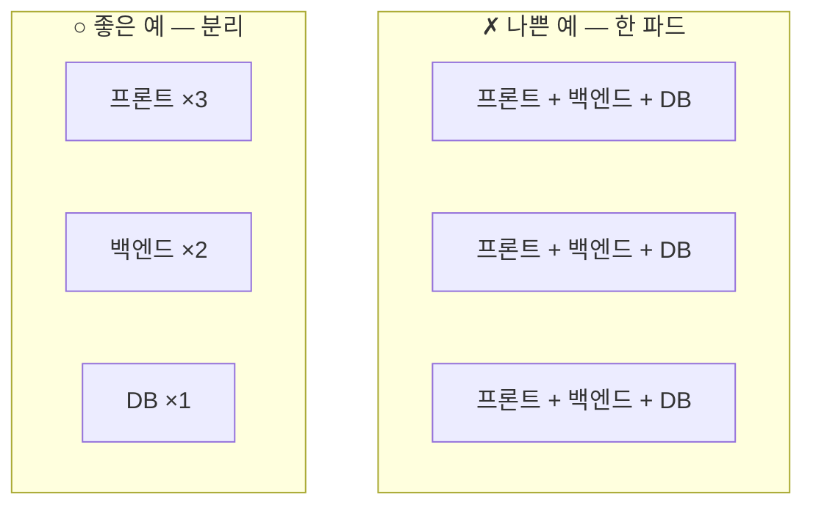

* **확장 관점** — 프론트엔드만 10개로 늘리고 싶은데, 한 파드에 있으면 **DB까지 10개**가 됩니다. DB를 10개 복제하는 건 재앙입니다. 필요 없는 자원을 쓰는 정도가 아니라 데이터 정합성이 깨집니다.
* **배포 주기 관점** — 프론트는 하루에 몇 번씩 고치고 DB는 몇 달에 한 번 건드립니다. 한 파드면 **프론트 한 줄 고칠 때마다 DB도 재시작**됩니다.
* **장애 관점** — 하나가 죽으면 전부 재시작될 수 있습니다.

**가장 실용적인 한 줄 기준: "따로 확장해야 하면 따로 파드."**

### 9. 한 파드에 넣어야 하는 경우 ★★★★★

**한 줄 답 — "이 둘이 다른 기계에 있으면 동작이 아예 불가능한가?"에 "그렇다"면 한 파드입니다.**

| 질문 | 예 → 한 파드 | 아니오 → 별도 파드 |
| :--- | :---: | :---: |
| 반드시 같은 노드여야 하나? | ○ | ✗ |
| 같은 파일 시스템을 공유해야 하나? | ○ | ✗ |
| localhost로 통신해야 하나? | ○ | ✗ |
| 항상 같은 개수로 확장되나? | ○ | ✗ |
| 항상 함께 배포되나? | ○ | ✗ |

**대표 사례 세 가지**

* 앱 + **로그 수집기** — 같은 로그 파일을 읽어야 함
* 앱 + **네트워크 프록시** — localhost로 트래픽을 가로채야 함
* 앱 + **설정 동기화 도구** — 같은 설정 디렉터리를 써야 함

셋 다 공통점이 있습니다. **보조 역할이고, 주 컨테이너와 물리적으로 붙어 있지 않으면 일을 할 수 없습니다.**

> 헷갈릴 때는 반대로 물어보세요. "이 둘을 다른 노드에 두면 여전히 동작하나?" 동작한다면 **나누는 게 맞습니다.**

### 10. 사이드카 ★★★★★

**한 줄 답 — 주 컨테이너를 보조하는 컨테이너입니다. 오토바이 옆에 붙은 보조석에서 나온 말입니다.**

오토바이(주 컨테이너)가 주인공이고, 사이드카는 **옆에 붙어서 함께 다니는 보조석**입니다. 혼자서는 의미가 없고, 항상 본체와 붙어 다닙니다.

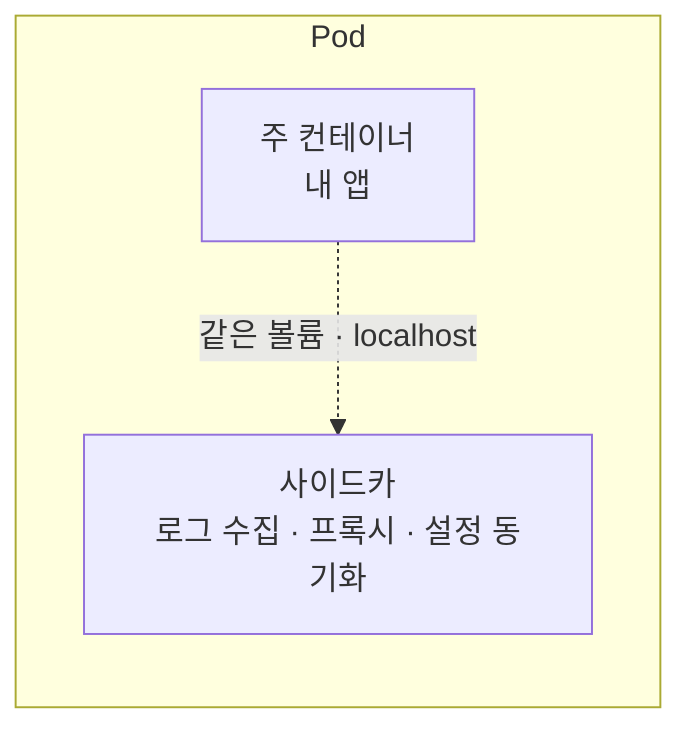

**사이드카가 좋은 이유** — 앱 코드를 고치지 않고 기능을 덧붙일 수 있습니다. 로그를 어디로 보낼지, 트래픽을 어떻게 암호화할지 같은 관심사를 **앱 밖으로 빼낼 수 있습니다.**

> **지금은 정식 기능입니다.** 예전에는 "그냥 컨테이너를 여러 개 넣는 패턴"일 뿐이라 시작·종료 순서가 보장되지 않았고, Job에서 사이드카가 안 죽어 **Job이 영원히 안 끝나는** 문제가 있었습니다. 쿠버네티스 1.33에서 네이티브 사이드카가 GA가 되면서 해결되었습니다(15번 문제).

### 11. "파드는 절대 치유되지 않는다" ★★★★★

**한 줄 답 — 파드 안의 컨테이너는 재시작되지만, 파드 자체가 죽으면 그걸로 끝입니다. 노드가 죽으면 그 위의 파드는 옮겨 가지 않고 그냥 사라집니다.**

이 두 층을 구분하는 게 핵심입니다.

| 무엇이 죽었나 | 어떻게 되나 |
| :--- | :--- |
| 파드 안의 **컨테이너** | `restartPolicy`에 따라 **재시작됨.** 파드는 그대로 살아 있음 |
| **파드 자체** | **끝.** 아무도 되살리지 않음 |
| **노드** | 그 위의 파드들은 **다른 노드로 옮겨 가지 않고 사라짐** |

"노드가 죽으면 파드가 다른 노드로 이사 간다"고 오해하기 쉬운데 **아닙니다.** 파드는 이동하지 않습니다. 사라지고, **컨트롤러가 다른 곳에 새 파드를 만듭니다.** 결과만 보면 비슷하지만 **완전히 다른 파드**입니다(다음 문제).

### 12. 재생성되면 이름과 IP는 ★★★★★

**한 줄 답 — 둘 다 완전히 새것이 됩니다.**

* **이름** — `kiada-7d4c8f9b6d-x7k2m` 같은 이름의 뒷부분 해시가 바뀝니다.
* **IP** — 완전히 다른 IP가 할당됩니다.
* **uid**도 새로 발급됩니다. 쿠버네티스 입장에서 **전혀 다른 객체**입니다.

**이 사실이 두 가지 큰 결과를 낳습니다.**

1. **파드 IP를 어디에 적어 두면 안 됩니다.** 재시작 한 번에 무효가 됩니다 → 그래서 **서비스**(11장)가 고정된 이름과 IP를 제공합니다.
2. **서비스가 대상을 고를 때 이름이나 IP를 쓸 수 없습니다** → 그래서 **레이블**로 고릅니다(3.2절).

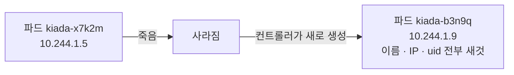

### 13. 가축 vs 애완동물 ★★★☆☆

**한 줄 답 — 애완동물은 아프면 치료하지만, 가축은 아프면 교체합니다. 파드는 가축입니다.**

| | 애완동물(Pet) | 가축(Cattle) |
| :--- | :--- | :--- |
| 이름 | 하나하나 붙여 줌 | 번호로 관리 |
| 아플 때 | **치료**함 | **교체**함 |
| 대체 가능성 | 유일무이 | 얼마든지 대체 가능 |
| 예 | 옛날 방식의 서버 (`web-01`) | **파드** |

옛날에는 서버 한 대 한 대에 이름을 붙이고, 문제가 생기면 접속해서 고쳤습니다. **파드는 그렇게 다루지 않습니다.** 이상하면 들어가서 고치는 게 아니라 **지우고 새로 만듭니다.**

**이게 가능한 이유**는 파드가 이미지에서 언제든 똑같이 다시 만들어지기 때문입니다. 그리고 이 성질이 있어야 자동 복구·수평 확장·무중단 배포가 전부 성립합니다.

### 14. 실무에서 파드를 직접 안 만드는 이유 ★★★★★

**한 줄 답 — 죽으면 아무도 되살려 주지 않기 때문입니다. 항상 컨트롤러를 통해 만듭니다.**

```
✗  파드를 직접 생성  → 죽으면 끝. 아무도 안 살려 줌
○  Deployment 생성   → ReplicaSet이 항상 개수를 맞춰 줌
```

11번에서 본 대로 파드는 치유되지 않습니다. 직접 만든 파드는 **"원하는 상태"를 기억하는 주체가 없습니다.** 아무도 "이게 3개 있어야 한다"고 생각하지 않으니, 사라져도 그냥 사라진 채로 끝입니다.

디플로이먼트를 만들면 **`replicas: 3`이라는 목표가 클러스터에 저장**되고, 컨트롤러가 조정 루프를 돌리며 계속 채워 줍니다.

**그럼 왜 4장에서는 직접 만드나** — **원리를 배우기 위해서입니다.** 디플로이먼트의 `spec.template` 안쪽이 결국 파드 매니페스트이므로(3.2절), 파드를 모르면 디플로이먼트도 이해할 수 없습니다. 학습 순서상 필요한 것이지 실무 방식이 아닙니다.

### 15. `initContainers` + `restartPolicy: Always` ★★★☆☆

**한 줄 답 — 네이티브 사이드카가 됩니다. `initContainers`에 넣었는데도 파드가 사는 내내 계속 실행됩니다.**

```yaml
spec:
  initContainers:
    - name: log-shipper
      image: fluent-bit
      restartPolicy: Always      # ← 이 한 줄이 사이드카로 만듭니다
  containers:
    - name: kiada
      image: luksa/kiada:0.1
```

보통 `initContainers`는 **주 컨테이너보다 먼저 실행되고 끝나면 종료**됩니다. 그런데 `restartPolicy: Always`를 붙이면 끝나지 않고 계속 삽니다.

| | 기존 방식 (일반 컨테이너) | 네이티브 사이드카 |
| :--- | :--- | :--- |
| 시작 순서 | 보장 안 됨 | **주 컨테이너보다 먼저 시작** |
| 종료 순서 | 보장 안 됨 | **주 컨테이너가 끝난 뒤 역순 종료** |
| Job 완료 | **막힘** | 주 컨테이너가 끝나면 정상 완료 |

**`initContainers` 자리를 쓴 이유가 바로 순서 때문입니다.** 이 자리는 원래 "주 컨테이너보다 먼저"가 보장되는 곳이라, 로그 수집기나 프록시가 **앱보다 먼저 준비되어야 하는** 요구를 자연스럽게 만족시킵니다.

---

## 4.2 YAML로 파드 만들기

### 16. 가장 단순한 파드 매니페스트 ★★★★★

**한 줄 답 — `apiVersion` / `kind` / `metadata.name` / `spec.containers` 네 가지면 됩니다.**

```yaml
apiVersion: v1
kind: Pod
metadata:
  name: kiada
spec:
  containers:
    - name: kiada
      image: luksa/kiada:0.1
      ports:
        - name: http
          containerPort: 8080
```

**꼭 필요한 것만 남기면 이렇게까지 줄어듭니다.**

```yaml
apiVersion: v1
kind: Pod
metadata:
  name: kiada
spec:
  containers:
    - name: kiada
      image: luksa/kiada:0.1
```

`containers`가 **리스트**라는 점(하이픈), 그리고 컨테이너에는 **`name`과 `image`가 필수**라는 점을 기억하면 됩니다.

> 손으로 다 쓸 필요는 없습니다. 초안은 자동으로 만들 수 있습니다.
> ```bash
> kubectl run kiada --image=luksa/kiada:0.1 --port=8080 --dry-run=client -o yaml > kiada.yaml
> ```

### 17. `ports`는 필수인가 ★★★☆☆

**한 줄 답 — 필수가 아닙니다. 그래도 문서화와 이름 참조를 위해 적는 게 좋습니다.**

`ports`를 빼도 앱은 정상 동작합니다. 컨테이너가 8080에서 듣고 있으면 그냥 접근됩니다. **쿠버네티스가 이 값을 보고 포트를 여는 게 아니기 때문**입니다.

**그래도 적는 이유 두 가지**

1. **문서화** — 이 파드가 어떤 포트를 쓰는지 다른 사람에게 알려 줍니다. YAML만 봐도 파악됩니다.
2. **이름 부여** — `name: http`로 이름을 붙이면 서비스에서 숫자 대신 이름으로 참조할 수 있습니다.

```yaml
# 서비스에서
ports:
  - port: 80
    targetPort: http      # 8080 대신 이름으로
```

**포트 번호를 바꿔도 서비스 YAML은 안 고쳐도 됩니다.** 파드 쪽 `containerPort`만 바꾸면 됩니다.

### 18. `imagePullPolicy`의 세 값 ★★★★☆

**한 줄 답 — 매번 받을지(`Always`), 없을 때만 받을지(`IfNotPresent`), 절대 안 받을지(`Never`)입니다.**

| 값 | 동작 | 쓰는 상황 |
| :--- | :--- | :--- |
| `Always` | **매번** 레지스트리에서 확인 | 태그를 재사용하는 개발 환경 |
| `IfNotPresent` | 로컬에 **없을 때만** 받음 | 일반적인 운영 |
| `Never` | **절대 안 받음.** 로컬에만 의존 | kind에 직접 넣은 이미지 |

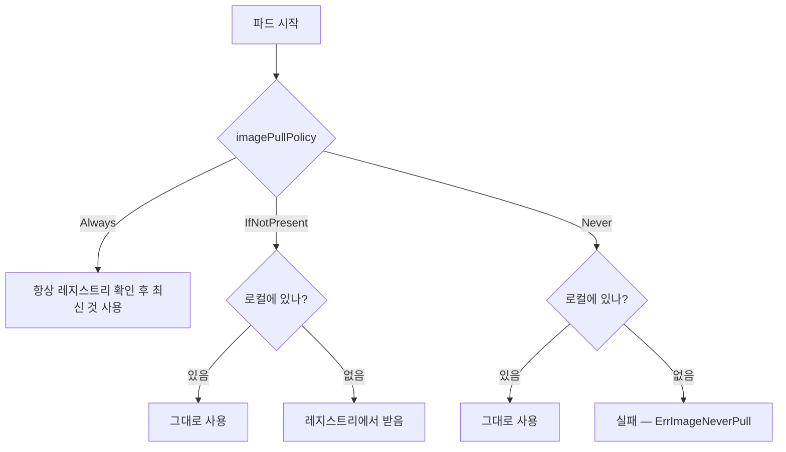

> 우리 실습에서 `kind load`로 넣은 이미지에 `Never`를 쓰는 이유가 여기 있습니다. `localhost/kiada:0.1`은 인터넷에 없으므로, 받으러 가면 무조건 실패합니다.

### 19. 기본값이 태그에 따라 달라진다 ★★★★★

**한 줄 답 — 태그가 `latest`이거나 없으면 `Always`, 명시적 태그면 `IfNotPresent`입니다.**

| 이미지 표기 | 기본 `imagePullPolicy` |
| :--- | :--- |
| `myapp` (태그 없음) | `Always` |
| `myapp:latest` | `Always` |
| `myapp:1.0` | **`IfNotPresent`** |

**이게 함정인 이유는 "명시적 태그를 쓰는 게 좋은 습관"과 정반대로 작동하기 때문입니다.** 좋은 습관대로 `1.0`을 적었는데, 그 순간 쿠버네티스는 "버전이 명시됐으니 내용이 안 바뀌겠지"라고 판단해 **다시 받지 않습니다.**

논리 자체는 타당합니다. 버전 태그는 원래 불변이어야 하니까요. 문제는 **개발 중에 같은 태그로 계속 다시 push하는 습관**과 충돌한다는 점입니다. 이게 다음 문제입니다.

### 20. 이미지를 고쳐 push했는데 반영이 안 될 때 ★★★★★

**한 줄 답 — `imagePullPolicy` 기본값이 `IfNotPresent`라 노드에 있는 옛 이미지를 계속 쓰기 때문입니다. 해결책은 태그를 매번 바꾸는 것입니다.**

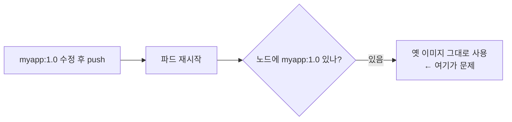

**"왜 코드 수정이 반영이 안 되지?"의 원인 1위**입니다. 태그가 같으니 노드는 "이미 있네" 하고 넘어갑니다. 내용이 바뀐 걸 알 방법이 없습니다.

| 해결책 | 평가 |
| :--- | :--- |
| **태그를 매번 바꾼다** (`1.0` → `1.1`) | **정답.** 재현 가능하고 롤백도 됩니다 |
| `imagePullPolicy: Always`로 바꾼다 | 되긴 하지만 **미봉책.** 어제와 오늘의 `1.0`이 다른 문제는 그대로 |
| 파드를 지웠다 다시 만든다 | **소용없습니다.** 노드에 이미지가 남아 있으면 똑같습니다 |

**근본 원인은 "같은 태그에 다른 내용을 넣은 것"입니다.** 태그는 내용을 가리키는 이름표인데, 같은 이름표를 다른 물건에 붙였으니 혼란이 생기는 게 당연합니다.

### 21. `command`와 `args` ★★★★☆

**한 줄 답 — `command`가 `ENTRYPOINT`를, `args`가 `CMD`를 덮어씁니다.**

| Dockerfile | 파드 YAML |
| :--- | :--- |
| `ENTRYPOINT` | `command` |
| `CMD` | `args` |

```yaml
command: ["node"]         # ENTRYPOINT 덮어쓰기
args: ["/app.js"]         # CMD 덮어쓰기
```

**이 대응이 왜 유용하냐면**, 이미지를 다시 빌드하지 않고 **실행 명령만 바꿔서** 컨테이너를 띄울 수 있기 때문입니다. 이미지는 그대로 두고 YAML만 고치면 됩니다.

### 22. `command`를 바꿔 조사하는 기법 ★★★☆☆

**한 줄 답 — 계속 죽는 앱 대신 셸이나 `sleep`을 띄워, 컨테이너를 살려 놓고 안에 들어가 조사하는 방법입니다.**

```yaml
command: ["sh"]
args: ["-c", "sleep 3600"]
```

**왜 필요하냐면**, `CrashLoopBackOff` 상태의 컨테이너는 **`kubectl exec`로 들어갈 틈이 없기 때문**입니다. 몇 초 만에 죽으니 접속할 시간이 없습니다.

앱 대신 `sleep 3600`을 실행시키면 컨테이너가 **한 시간 동안 아무것도 안 하고 살아 있습니다.** 그동안 느긋하게 들어가서 조사할 수 있습니다.

```bash
kubectl exec -it kiada -- sh
/ # env                      # 환경 변수가 제대로 들어왔나
/ # ls -al /app              # 파일이 제대로 복사됐나
/ # node /app.js             # 직접 실행해서 에러 메시지 확인
```

**마지막 줄이 핵심입니다.** 앱을 직접 실행해 보면 왜 죽는지 에러가 그대로 보입니다.

> 더 편한 방법으로 `kubectl debug --copy-to`가 있습니다(39번 문제). 원본 파드를 건드리지 않고 복사본만 이렇게 띄웁니다.

### 23. `requests`와 `limits`를 쓰는 주체 ★★★★★

**한 줄 답 — `requests`는 스케줄러가 노드를 고를 때, `limits`는 kubelet과 cgroups가 실제로 제한할 때 씁니다.**

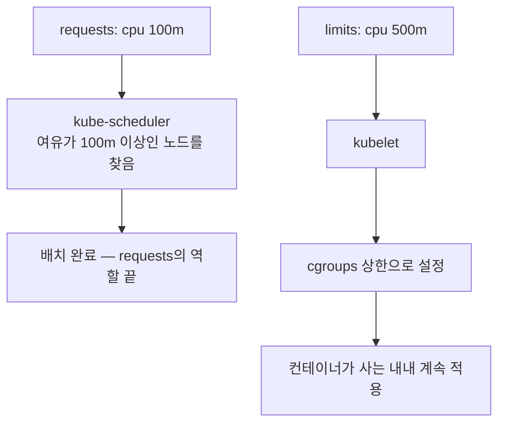

| | `requests` | `limits` |
| :--- | :--- | :--- |
| 의미 | **최소한 이만큼은 보장해 줘** | **이 이상은 못 써** |
| 쓰는 주체 | **스케줄러** | **kubelet → cgroups** |
| 쓰는 시점 | 노드를 **고를 때 한 번** | 컨테이너가 **사는 내내** |

**시점이 다르다는 게 핵심입니다.** `requests`는 배치가 끝나면 역할이 끝나고, `limits`는 계속 감시합니다.

> 여기서 재미있는 함정이 하나 있습니다. `requests`는 **"예약"일 뿐 실제로 잡아 두지 않습니다.** `requests: 100m`이라고 적고 실제로 400m을 써도, `limits` 안이면 아무 제재가 없습니다.

### 24. `500m`, `Mi`와 `M` ★★★★☆

**한 줄 답 — `500m`은 0.5코어이고, `Mi`는 1024 기반, `M`은 1000 기반입니다.**

**CPU** — `m`은 밀리(1/1000)입니다.

| 표기 | 의미 |
| :--- | :--- |
| `1` | 1코어 |
| `500m` | 0.5코어 |
| `100m` | 0.1코어 |

**메모리** — 두 체계가 있습니다.

| 표기 | 기준 | 실제 크기 |
| :--- | :--- | :--- |
| `Mi` (메비바이트) | **1024** | 1Mi = 1,048,576 바이트 |
| `M` (메가바이트) | 1000 | 1M = 1,000,000 바이트 |

**보통 `Mi`를 씁니다.** 컴퓨터가 실제로 메모리를 다루는 단위가 1024 기반이라 딱 떨어지기 때문입니다. `128M`보다 `128Mi`가 자연스럽습니다.

> 헷갈려서 `128m`이라고 소문자로 쓰면 **0.128바이트**가 됩니다. 대소문자를 조심해야 합니다.

### 25. CPU 초과 vs 메모리 초과 ★★★★★

**한 줄 답 — CPU는 느려지기만 하고, 메모리는 즉시 강제 종료됩니다.**

| | CPU 한도 초과 | 메모리 한도 초과 |
| :--- | :--- | :--- |
| 동작 | **스로틀링** — 속도를 늦춤 | **강제 종료** (`OOMKilled`) |
| 앱 상태 | 살아 있음, 느릴 뿐 | **죽음** |

**자원의 성격이 달라서 그렇습니다.**

* **CPU는 "빌려 쓰는 시간"** 입니다. 덜 주면 그만큼 천천히 돌 뿐입니다. 되돌려 받을 것이 없습니다.
* **메모리는 "차지한 공간"** 입니다. 이미 쓴 것을 도로 뺏을 방법이 없습니다. 넘겼는데 그냥 두면 노드 전체가 위험해지므로 **죽이는 것 말고는 방법이 없습니다.**

**실무에서 이 차이가 중요한 이유** — 파드가 자꾸 재시작된다면 `kubectl describe pod`에서 `OOMKilled`를 먼저 확인해야 합니다. 이게 보이면 **앱 버그이거나 메모리 `limits`가 너무 짠 것**이고, CPU 문제라면 앱은 죽지 않고 느리기만 합니다.

### 26. `requests`를 안 적으면 ★★★★☆

**한 줄 답 — 스케줄러가 이 파드의 크기를 몰라서 이미 꽉 찬 노드에 밀어 넣고, 그러면 노드 전체가 불안정해집니다.**

스케줄러는 `requests`를 더해서 **"이 노드에 얼마나 남았나"** 를 계산합니다. `requests`가 없으면 그 파드는 **0으로 계산됩니다.**

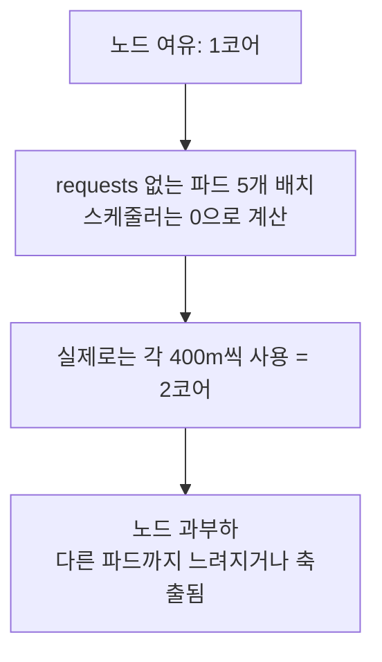

**결과가 두 가지입니다.**

1. **노드 과부하** — 실제 사용량이 용량을 넘겨 모든 파드가 영향을 받습니다.
2. **BestEffort 등급** — 자원이 부족해지면 **가장 먼저 쫓겨납니다**(다음 문제).

> **실무에서 `requests`는 사실상 필수입니다.** 안 적으면 스케줄러가 제 일을 할 수 없습니다.

### 27. QoS 등급 ★★★★★

**한 줄 답 — requests와 limits를 어떻게 적었느냐로 등급이 정해지고, 노드에 자원이 부족하면 낮은 등급부터 쫓겨납니다.**

| 등급 | 조건 | 축출 순서 |
| :--- | :--- | :--- |
| **Guaranteed** | requests = limits (모든 컨테이너) | **가장 나중** |
| **Burstable** | requests < limits | 중간 |
| **BestEffort** | 아무것도 안 적음 | **가장 먼저 쫓겨남** |

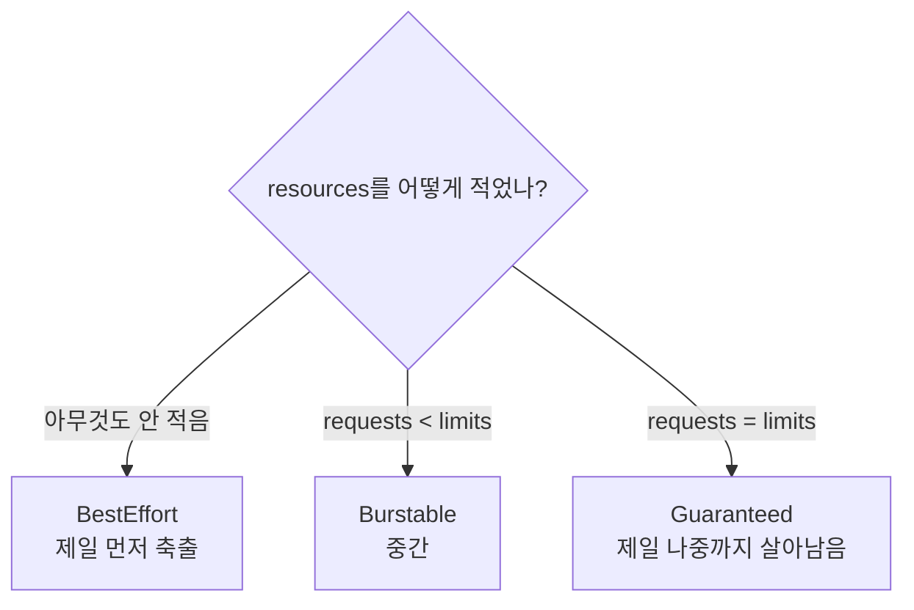

```bash
kubectl get pod kiada -o jsonpath='{.status.qosClass}'
```

**중요한 앱은 `requests = limits`로 맞춰 Guaranteed를 받게 하세요.**

**왜 이 규칙이 합리적이냐면**, `requests = limits`는 **"내가 쓸 만큼 정확히 예약했다"** 는 선언이기 때문입니다. 예약한 만큼만 쓰겠다고 약속했으니 노드가 그 약속을 지켜 줍니다. 반대로 아무것도 안 적은 파드는 **얼마를 쓸지 모르는 파드**라 제일 먼저 정리 대상이 됩니다.

### 28. `restartPolicy` ★★★★☆

**한 줄 답 — `Always`(기본값) · `OnFailure` · `Never` 세 가지이고, 재시작 대상은 파드가 아니라 파드 안의 컨테이너입니다.**

| 값 | 동작 |
| :--- | :--- |
| `Always` | 종료 코드와 무관하게 항상 재시작 (**기본값**) |
| `OnFailure` | 비정상 종료(종료 코드 ≠ 0)일 때만 재시작 |
| `Never` | 재시작 안 함 |

**뒷부분이 이 질문의 핵심입니다.** 이름 때문에 "파드가 죽으면 되살려 주는 설정"으로 오해하기 쉽지만 아닙니다.

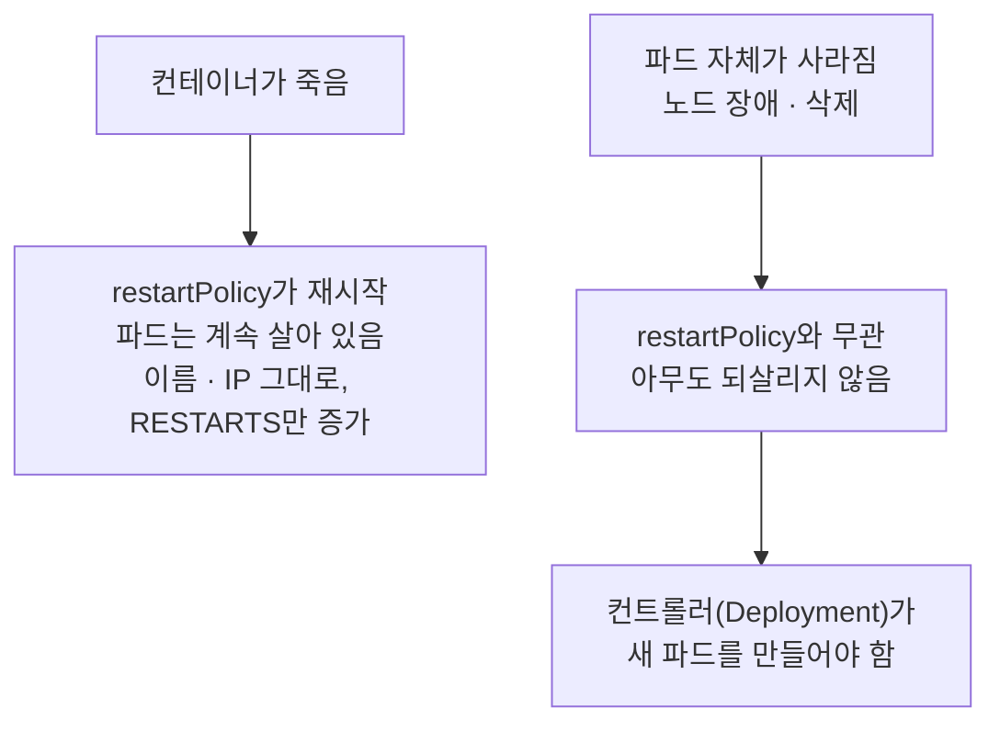

**파드를 되살리는 건 `restartPolicy`가 아니라 컨트롤러의 일입니다.** 4.1절의 "파드는 절대 치유되지 않는다"와 같은 이야기입니다.

### 29. `CrashLoopBackOff` ★★★★★

**한 줄 답 — 컨테이너가 반복해서 죽어 재시작 대기 시간이 점점 늘어난 상태입니다. 10초 → 20초 → 40초 …로 두 배씩 늘어 최대 5분이 됩니다.**


**"BackOff"가 대기 시간을 늘린다는 뜻입니다.** 계속 실패하는데 1초마다 재시도하면 노드 자원만 낭비되므로, 점점 간격을 벌립니다.

**중요한 것은 이게 원인이 아니라 증상이라는 점입니다.** `CrashLoopBackOff` 자체는 "계속 죽고 있다"는 사실만 알려 줍니다. 왜 죽는지는 로그를 봐야 합니다.

```bash
kubectl logs kiada --previous     # ← 죽기 직전 로그. 여기에 원인이 있습니다
kubectl describe pod kiada        # 이벤트와 종료 코드 확인
```

**`--previous`가 필수입니다.** 그냥 `kubectl logs`를 치면 방금 새로 뜬 컨테이너를 보게 되는데, 아직 아무 로그도 없습니다(32번 문제).

---

## 4.3 파드와 상호작용하기

### 30. 파드 IP로 밖에서 못 붙는 이유 ★★★★☆

**한 줄 답 — 파드 IP는 클러스터 내부 전용 사설 IP라, 클러스터 밖에서는 그 주소로 가는 경로가 없습니다.**

방화벽에 막히는 게 아니라 **길이 아예 없는 것**입니다. `10.244.x.x`는 클러스터 안에서만 의미가 있는 주소입니다.

**확인용 접근 방법 두 가지**

**① 클러스터 안에서 요청하기** — 임시 파드를 띄워 그 안에서 부릅니다.

```bash
kubectl run -it --rm test --image=busybox --restart=Never -- wget -qO- 10.244.1.5:8080
```

| 옵션 | 의미 |
| :--- | :--- |
| `-it` | 터미널 연결 |
| `--rm` | 끝나면 자동 삭제 |
| `--restart=Never` | Job이 아니라 파드로 생성 |
| `--` | 뒤는 컨테이너에서 실행할 명령 |

**실제 파드끼리의 통신을 그대로 재현**하는 방식이라 더 현실적입니다.

**② API 서버를 통한 프록시**

```bash
kubectl proxy
curl localhost:8001/api/v1/namespaces/default/pods/kiada/proxy/
```

> 둘 다 **확인용**입니다. 외부에 제대로 노출하는 방법은 **서비스(11장)** 입니다.

### 31. `kubectl logs` 주요 옵션 ★★★☆☆

**한 줄 답 — 실시간 추적, 줄 수 제한, 기간 지정, 컨테이너 지정, 레이블로 여러 파드입니다.**

| 옵션 | 하는 일 |
| :--- | :--- |
| `-f` | **실시간 추적** (follow). `tail -f`와 같음 |
| `--tail=20` | **마지막 20줄**만 |
| `--since=1h` | **최근 1시간**만 |
| `-c <이름>` | **컨테이너 지정** (다중 컨테이너 파드에서 필수) |
| `-l app=kiada` | **레이블로 여러 파드** 로그를 한꺼번에 |

```bash
kubectl logs kiada -f --tail=50        # 마지막 50줄부터 실시간으로
kubectl logs -l app=kiada              # 레이블이 맞는 파드 전부
kubectl logs kiada --timestamps        # 시간 표시
```

**`-c`를 언제 쓰는지**가 실전 포인트입니다. 컨테이너가 여러 개인 파드에서 `-c` 없이 치면 어느 것을 볼지 몰라 오류가 납니다.

### 32. `--previous`가 필요한 상황 ★★★★★

**한 줄 답 — 컨테이너가 죽고 재시작된 뒤입니다. 그냥 `logs`를 치면 새로 뜬 컨테이너만 보이고, 원인이 담긴 로그는 죽은 컨테이너 쪽에 있습니다.**


```bash
kubectl logs kiada              # 지금 도는 컨테이너 — 아직 아무것도 없음
kubectl logs kiada --previous   # 죽기 직전 로그 ← 여기에 원인이!
```

**왜 그것 없이는 원인을 못 찾냐면**, 로그가 컨테이너 단위로 관리되기 때문입니다. 컨테이너가 죽고 새로 뜨면 **완전히 새 컨테이너**이고, 이전 컨테이너의 출력은 별도로 보관됩니다.

`CrashLoopBackOff`를 만나면 **반사적으로 `--previous`를 치는 습관**을 들이세요. 이것 하나로 디버깅 시간이 크게 줄어듭니다.

### 33. 로그는 어디에 저장되나 ★★★☆☆

**한 줄 답 — 노드의 파일로 저장되고, 파드가 삭제되면 함께 사라집니다.**

컨테이너가 **표준 출력(stdout)과 표준 에러(stderr)** 로 뱉은 내용을 노드가 파일로 모읍니다.

```
/var/log/pods/<네임스페이스>_<파드이름>_<UID>/<컨테이너>/0.log
```

**핵심은 이 로그가 영구 저장이 아니라는 점입니다.**

* **파드가 삭제되면 로그도 사라집니다.** 경로에 파드 UID가 들어 있으니 파드와 운명을 같이합니다.
* 로그 파일이 커지면 **로테이션되어 오래된 것부터 지워집니다.**

> 그래서 실무에서는 **Loki, Elasticsearch** 같은 곳으로 로그를 따로 수집합니다. 파드가 사라진 뒤에도 조사할 수 있어야 하기 때문입니다.

### 34. 왜 stdout으로 로그를 남겨야 하나 ★★★★★

**한 줄 답 — 컨테이너 안의 파일에 쓰면 컨테이너가 죽는 순간 사라지고, `kubectl logs`로도 보이지 않기 때문입니다.**

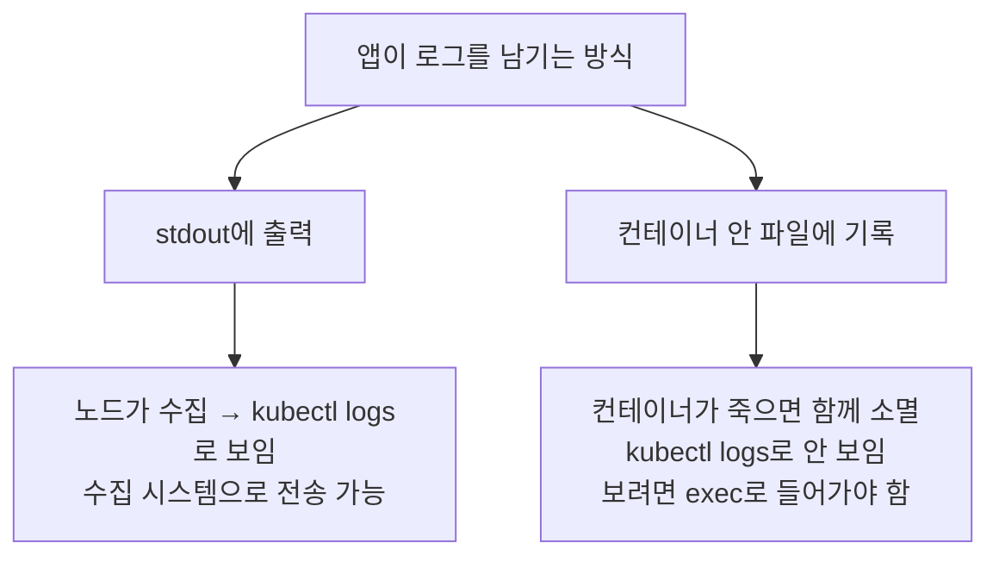

**컨테이너 앱의 기본 원칙**입니다. 이유를 정리하면,

* **`kubectl logs`가 보는 건 stdout뿐입니다.** 파일에 쓰면 아무리 로그를 잘 남겨도 표준 도구로 볼 수 없습니다.
* **컨테이너의 쓰기 레이어는 휘발성입니다**(2.1절). 죽는 순간 파일도 사라집니다.
* **로그 수집 시스템이 stdout을 전제로 동작합니다.** 사이드카든 데몬셋이든 노드의 로그 파일을 읽어 갑니다.

기존 앱을 컨테이너로 옮길 때 **가장 먼저 고쳐야 할 부분** 중 하나입니다.

### 35. `--` 구분자를 빼먹으면 ★★★☆☆

**한 줄 답 — 뒤에 오는 옵션을 kubectl이 자기 것으로 가져가 버립니다.**

```bash
kubectl exec kiada ls -l        # ✗ -l 을 kubectl이 자기 옵션으로 해석
kubectl exec -it kiada -- ls -l # ○
```

`--`는 **"여기까지가 kubectl 옵션이고, 뒤는 컨테이너에서 실행할 명령"** 이라는 경계 표시입니다. 이게 없으면 `-l`이 kubectl의 레이블 셀렉터 옵션으로 오해받습니다.

> 지금은 `--` 없는 옛 문법이 경고를 내거나 아예 동작하지 않습니다. 항상 붙이는 습관이 안전합니다.
> ```bash
> kubectl exec -it kiada -- sh
> ```

### 36. 컨테이너 안에서 확인할 것들 ★★★☆☆

**한 줄 답 — 환경 변수, DNS, 앱의 실제 응답, 프로세스, 디스크 상태입니다.**

```bash
/ # env                       # 환경 변수가 제대로 주입됐나
/ # cat /etc/hosts            # 호스트 파일
/ # nslookup kubernetes       # DNS가 동작하나
/ # wget -qO- localhost:8080  # 앱이 실제로 응답하나
/ # ps aux                    # 프로세스가 살아 있나
/ # df -h                     # 디스크가 꽉 찼나
/ # cat /etc/resolv.conf      # DNS 설정
```

**우선순위를 잡는 요령**이 있습니다.

1. **`wget localhost:8080`** — 앱 자체가 응답하는지부터 확인합니다. 여기서 실패하면 네트워크가 아니라 앱 문제입니다.
2. **`env`** — ConfigMap이나 Secret이 제대로 주입됐는지. 설정 문제가 의외로 많습니다.
3. **`nslookup`** — 다른 서비스를 못 찾는다면 DNS부터 봅니다.

**앱이 이상할 때 밖에서 추측하지 말고 안에 들어가서 직접 확인하는 것이 가장 빠릅니다.**

### 37. 셸이 없는 이미지 ★★★★☆

**한 줄 답 — `distroless`나 `scratch` 기반 이미지에는 `sh`조차 없어서 `exec`가 실패합니다. `kubectl debug`로 임시 컨테이너를 붙여 조사합니다.**

```
OCI runtime exec failed: exec: "sh": executable file not found in $PATH
```

**왜 셸이 없냐면 일부러 뺐기 때문입니다.** 이미지에 든 것이 적을수록 취약점도 적고 용량도 작습니다. 보안이 중요한 곳에서는 셸을 넣지 않는 것이 정석입니다. 조사가 불편해지는 건 그 대가입니다.

**대안 — `kubectl debug`**

```bash
kubectl debug -it kiada --image=busybox --target=kiada
```

파드에 **임시 컨테이너**를 하나 붙입니다. 이 임시 컨테이너에는 셸이 있으니, 여기서 원래 컨테이너를 들여다보면 됩니다. 원본 이미지는 그대로 둔 채 조사 도구만 옆에 파견하는 셈입니다.

### 38. `--target` 옵션 ★★★☆☆

**한 줄 답 — 지정한 컨테이너의 프로세스 네임스페이스를 공유해, 임시 컨테이너에서 그 컨테이너의 프로세스와 파일 시스템을 볼 수 있게 합니다.**

```bash
kubectl debug -it kiada --image=busybox --target=kiada
```

**`--target` 없이 붙이면** 임시 컨테이너는 그냥 같은 파드에 있는 남남입니다. 네트워크는 공유하지만 **프로세스와 파일 시스템은 못 봅니다.**

**`--target=kiada`를 주면** PID 네임스페이스를 공유하므로,

* `ps aux`로 **kiada의 프로세스가 보입니다**
* `/proc/<PID>/root/`를 통해 **kiada의 파일 시스템에 접근**할 수 있습니다


4.1절에서 "PID 네임스페이스는 기본적으로 공유하지 않는다(설정으로 켤 수 있다)"고 했는데, **`--target`이 바로 그 설정을 켜는 것**입니다.

### 39. `--copy-to`가 `CrashLoopBackOff`에 유용한 이유 ★★★☆☆

**한 줄 답 — 파드를 복사해서 명령만 바꿔 띄울 수 있어, 계속 죽는 파드를 살려 놓고 조사할 수 있기 때문입니다.**

```bash
kubectl debug kiada -it --copy-to=kiada-debug --container=kiada -- sh
```

**`CrashLoopBackOff`의 근본 문제는 접속할 틈이 없다는 것입니다.** 몇 초 만에 죽으니 `exec`를 칠 시간이 없고, 대기 시간이 5분까지 늘어나면 그 사이에는 컨테이너가 아예 없습니다.

`--copy-to`는 **원본은 그대로 두고 복사본을 하나 만들면서 실행 명령을 바꿉니다.** 앱 대신 `sh`를 띄우니 복사본은 죽지 않고 살아 있습니다. 느긋하게 들어가 조사하면 됩니다.

```bash
# 이미지만 바꿔서 복사본 띄우기
kubectl debug kiada --copy-to=kiada-debug --set-image=kiada=busybox
```

**원본 파드를 건드리지 않는다는 점이 중요합니다.** 운영 중인 파드의 설정을 바꾸지 않고도 조사할 수 있습니다.

### 40. `kubectl cp`를 디버깅용으로만 써야 하는 이유 ★★★☆☆

**한 줄 답 — 파드가 재시작되면 복사한 파일이 사라지기 때문입니다. 설정은 ConfigMap, 데이터는 볼륨으로 관리해야 합니다.**

```bash
kubectl cp kiada:/app.js ./app.js            # 파드 → 로컬
kubectl cp ./config.json kiada:/config.json  # 로컬 → 파드
```

복사한 파일은 컨테이너의 **쓰기 가능 레이어**에 들어갑니다. 2.1절에서 본 대로 이 레이어는 **컨테이너가 죽으면 함께 사라집니다.**

| 넣으려는 것 | 올바른 방법 |
| :--- | :--- |
| 설정 파일 | **ConfigMap** (8장) |
| 비밀 값 | **Secret** (8장) |
| 데이터 | **볼륨** (9~10장) |
| 잠깐 확인할 파일 | `kubectl cp` (임시) |

**"이 파드가 재시작돼도 남아 있어야 하나?"** 를 물어보면 답이 나옵니다. 남아야 한다면 `cp`는 잘못된 도구입니다.

> 파드 안에 `tar` 명령이 있어야 동작합니다. 없으면 실패합니다.

### 41. `exec` vs `attach` ★★★★☆

**한 줄 답 — `exec`는 새 프로세스를 띄우고, `attach`는 이미 도는 1번 프로세스에 연결합니다. `attach`는 Ctrl+C로 앱을 죽일 수 있어 위험합니다.**

| | `exec` | `attach` |
| :--- | :--- | :--- |
| 동작 | **새 프로세스**를 실행 | **기존 1번 프로세스**에 연결 |
| 용도 | 셸을 띄워 조사 | 앱의 표준 입출력에 직접 연결 |
| 위험도 | 안전 | **Ctrl+C를 누르면 앱이 죽을 수 있음** |

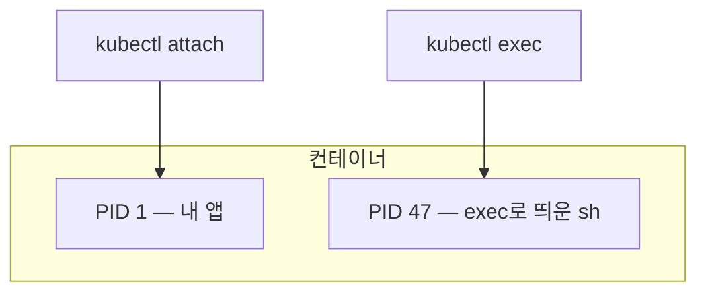

**`attach`가 위험한 이유**는 **앱의 터미널에 직접 끼어들기 때문**입니다. 진행 중인 통화에 끼어드는 것과 같습니다. Ctrl+C를 누르면 그 신호가 **앱에 그대로 전달**되어 앱이 종료됩니다.

`exec`는 별도 프로세스라 Ctrl+C를 눌러도 그 셸만 끝나고 앱은 멀쩡합니다.

> **특별한 이유가 없으면 항상 `exec`를 쓰세요.**

### 42. `-w`로 보이는 상태 변화 ★★★★☆

**한 줄 답 — Pending → ContainerCreating → Running 순서로 바뀝니다.**

```bash
kubectl get pods -w
```

```
kiada   0/1   Pending             0s
kiada   0/1   ContainerCreating   1s
kiada   1/1   Running             5s
```

각 단계에서 무슨 일이 벌어지는지 알면 문제 진단에 바로 쓸 수 있습니다.


| 상태 | 무슨 일이 | 여기서 멈추면 |
| :--- | :--- | :--- |
| `Pending` | 스케줄러가 노드를 고르는 중 | **배치할 노드가 없음** — 자원 부족, 테인트 |
| `ContainerCreating` | 이미지 pull, 볼륨 마운트 | **이미지를 못 받음** — 태그 오타, 레지스트리 인증 |
| `Running` | 컨테이너 실행 중 | 정상 |

**어느 단계에서 멈췄는지가 곧 원인의 힌트입니다.** `Pending`이 길면 스케줄링 문제, `ContainerCreating`이 길면 이미지 문제입니다. `kubectl describe pod`의 이벤트를 보면 정확한 이유가 나옵니다.
