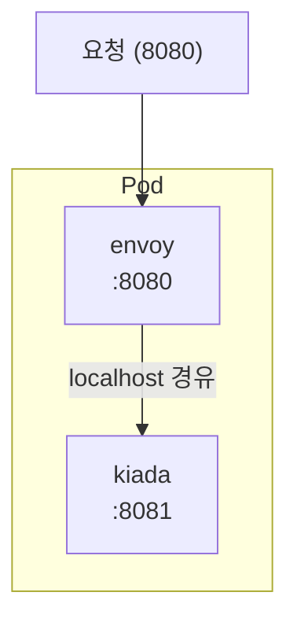

# 5.1 다중 컨테이너 파드 실행하기

이제 파드에 컨테이너를 두 개 넣어 봅니다. 4.1절에서 배운 "네트워크와 볼륨 공유"를 눈으로 확인할 차례입니다.

## 예제: 앱 + 프록시

`kiada` 앱 앞에 **Envoy 프록시**를 붙여서, 외부 요청은 프록시가 받고 내부적으로 앱에 전달하는 구조를 만듭니다.



**kiada-ssl.yaml**

```yaml
apiVersion: v1
kind: Pod
metadata:
  name: kiada-ssl
spec:
  containers:
    - name: kiada
      image: luksa/kiada:0.1
      ports:
        - name: http
          containerPort: 8081

    - name: envoy
      image: luksa/kiada-ssl-proxy:0.1
      ports:
        - name: https
          containerPort: 8080
        - name: admin
          containerPort: 9901
```

```bash
kubectl apply -f kiada-ssl.yaml
kubectl get pods
# NAME        READY   STATUS    RESTARTS   AGE
# kiada-ssl   2/2     Running   0          15s
```

**`READY` 열이 `2/2`** 입니다. "컨테이너 2개 중 2개가 준비됨"이라는 뜻입니다.

## 로컬호스트 통신 확인하기

```bash
kubectl exec -it kiada-ssl -c envoy -- sh
```

envoy 컨테이너 안에서:

```bash
/ # wget -qO- localhost:8081
Kiada 인사드립니다! 호스트명: kiada-ssl
```

**envoy 컨테이너에서 `localhost:8081`로 kiada 앱에 접근됩니다.** 서로 다른 컨테이너인데도 말이죠. 네트워크 네임스페이스를 공유하기 때문입니다.

호스트명도 확인해 봅시다.

```bash
/ # hostname
kiada-ssl        # 두 컨테이너가 같은 호스트명
/ # ip addr
eth0: 10.244.1.5 # 두 컨테이너가 같은 IP
```

> **포트 충돌 주의**
> 같은 포트 공간을 공유하므로, **두 컨테이너가 같은 포트를 쓸 수 없습니다.** 그래서 위 예제에서 kiada를 8081로 옮긴 것입니다. 겹치면 나중에 뜨는 컨테이너가 `address already in use` 오류로 죽습니다.

## 컨테이너 지정하기

컨테이너가 여러 개면 어느 것을 대상으로 할지 `-c`로 지정해야 합니다.

```bash
kubectl logs kiada-ssl                    # 오류: 컨테이너를 지정하세요
kubectl logs kiada-ssl -c kiada           # O
kubectl logs kiada-ssl -c envoy           # O
kubectl logs kiada-ssl --all-containers   # 전부 한꺼번에

kubectl exec -it kiada-ssl -c envoy -- sh
```

`-c`를 안 주면 kubectl이 어느 컨테이너인지 몰라서 오류를 냅니다. (컨테이너가 하나면 자동 선택됩니다.)

## 볼륨으로 파일 공유하기

네트워크뿐 아니라 **파일도 공유**할 수 있습니다. 로그 수집 패턴을 만들어 봅시다.

```yaml
apiVersion: v1
kind: Pod
metadata:
  name: log-demo
spec:
  containers:
    # 로그를 만드는 컨테이너
    - name: writer
      image: busybox
      command: ["sh", "-c"]
      args:
        - while true; do
            echo "$(date) 로그 한 줄" >> /var/log/app.log;
            sleep 2;
          done
      volumeMounts:
        - name: logs
          mountPath: /var/log

    # 로그를 읽는 컨테이너
    - name: reader
      image: busybox
      command: ["sh", "-c", "tail -f /var/log/app.log"]
      volumeMounts:
        - name: logs
          mountPath: /var/log

  volumes:
    - name: logs
      emptyDir: {}
```

```bash
kubectl apply -f log-demo.yaml
kubectl logs log-demo -c reader -f
# Tue Aug 19 10:30:00 UTC 2026 로그 한 줄
# Tue Aug 19 10:30:02 UTC 2026 로그 한 줄
```

**writer가 쓴 파일을 reader가 읽고 있습니다.** `emptyDir` 볼륨을 두 컨테이너가 같은 경로에 마운트했기 때문입니다.

> **`emptyDir`이란?**
> 파드가 만들어질 때 생기는 **빈 디렉터리**입니다. 파드가 삭제되면 함께 사라집니다. 컨테이너끼리 파일을 주고받는 용도로 딱 맞습니다. 9장에서 자세히 다룹니다.

## 대표적인 다중 컨테이너 패턴

### 1) 사이드카(Sidecar)

주 컨테이너를 **보조**하는 컨테이너입니다. 가장 흔합니다.

* 로그 수집기 (Fluent Bit)
* 메트릭 수집기 (Prometheus Exporter)
* 설정 동기화 도구
* 서비스 메시 프록시 (Istio의 Envoy)

### 2) 앰배서더(Ambassador)

주 컨테이너 대신 **외부와 통신**해 주는 컨테이너입니다.

```
앱 -> localhost:6379 -> [앰배서더] -> 실제 Redis 클러스터
```

앱은 그냥 `localhost`에 연결하면 되고, 복잡한 연결·인증·샤딩은 앰배서더가 처리합니다. 앱 코드가 단순해집니다.

### 3) 어댑터(Adapter)

주 컨테이너의 출력을 **다른 형식으로 변환**해 주는 컨테이너입니다.

```
앱의 이상한 형식 로그 -> [어댑터] -> Prometheus가 이해하는 형식
```

앱을 고치지 않고도 표준 모니터링에 연결할 수 있습니다.

## 다시 강조: 남용하지 마세요

컨테이너를 한 파드에 넣는 것은 **긴밀하게 결합된 경우에만** 해야 합니다.

```
X 나쁜 예
spec:
  containers:
    - name: frontend
    - name: backend
    - name: database
```

이러면 생기는 문제들입니다.

* 프론트엔드만 5개로 늘리고 싶어도 **DB까지 5개**가 됩니다
* 백엔드만 업데이트해도 **파드 전체가 재생성**됩니다
* DB 컨테이너가 죽으면 **전체가 영향**을 받습니다
* 자원 계산이 뒤엉킵니다

**"따로 확장해야 하면 따로 파드"** 를 기억하세요.

---

## 요약 및 비유

| 개념 | 자동차 비유 | 기술적 의미 |
| :--- | :--- | :--- |
| **다중 컨테이너 파드** | 운전석 + 사이드카가 달린 오토바이 | 긴밀히 결합된 컨테이너 묶음 |
| **localhost 통신** | 같은 차 안에서 대화 | 네트워크 네임스페이스 공유 |
| **포트 충돌** | 두 사람이 같은 좌석에 앉으려 함 | 포트 공간 공유로 인한 충돌 |
| **emptyDir 공유** | 같은 트렁크를 함께 씀 | 볼륨을 통한 파일 공유 |
| **사이드카** | 옆에서 지도를 봐 주는 사람 | 주 컨테이너를 보조 |
| **앰배서더** | 통역사 | 외부 통신을 대신 처리 |
| **어댑터** | 변환 플러그 | 출력 형식을 변환 |

---

## 결론

* 한 파드의 컨테이너들은 **같은 IP와 포트 공간**을 쓰므로 `localhost`로 통신합니다. 대신 **포트가 겹치면 안 됩니다.**
* **볼륨**을 같은 경로에 마운트하면 파일도 공유할 수 있습니다.
* 대표 패턴은 **사이드카 / 앰배서더 / 어댑터** 세 가지입니다.
* 컨테이너가 여러 개면 `kubectl logs`와 `exec`에 **`-c` 옵션**이 필요합니다.
* **긴밀히 결합된 것만** 한 파드에 넣으세요. 프론트+백+DB를 한 파드에 넣는 것은 대표적인 안티패턴입니다.

---

## 공식 문서 업데이트 (2026년 8월 기준)

### 1) 사이드카는 이제 `initContainers`에 씁니다 (핵심 변화)

이 절에서 배운 방식(모든 컨테이너를 `containers`에 나열)은 **여전히 동작합니다.** 하지만 사이드카 용도라면 **더 좋은 방법이 생겼습니다.**

기존 방식의 문제점이었습니다.

* 프록시(envoy)가 준비되기 전에 앱이 먼저 시작해서 초기 요청이 실패
* 종료할 때 프록시가 먼저 죽어서 앱의 마지막 요청이 유실
* Job에서 주 작업이 끝나도 사이드카가 안 죽어 **Job이 영원히 완료되지 않음**

**1.33에서 네이티브 사이드카가 정식(GA)** 이 되어 이 문제들이 해결되었습니다.

```yaml
apiVersion: v1
kind: Pod
metadata:
  name: kiada-ssl
spec:
  initContainers:
    - name: envoy                  # 사이드카를 여기로!
      image: luksa/kiada-ssl-proxy:0.1
      restartPolicy: Always        # <-- 이 한 줄이 핵심
      ports:
        - containerPort: 8080
  containers:
    - name: kiada                  # 주 컨테이너
      image: luksa/kiada:0.1
      ports:
        - containerPort: 8081
```

`initContainers`에 넣지만 파드가 사는 동안 계속 실행됩니다. 얻는 이점입니다.

| | 기존 방식 | 네이티브 사이드카 |
| :--- | :--- | :--- |
| 시작 순서 | 무작위 | **사이드카가 먼저 준비된 뒤 주 컨테이너 시작** |
| 종료 순서 | 무작위 | **주 컨테이너 종료 후 역순으로 종료** |
| Job에서 | 완료를 막음 | **정상 완료됨** |
| 프로브 | 지원 | 지원 (readiness가 파드 Ready에 반영) |

**언제 무엇을 쓸까요?**

* 주 컨테이너를 **보조**하는 역할(로그, 프록시, 메트릭) → **네이티브 사이드카**
* 대등한 관계로 협력 → 기존 `containers` 방식

참고: <https://kubernetes.io/docs/concepts/workloads/pods/sidecar-containers/>

### 2) 서비스 메시가 사이드카를 벗어나고 있습니다

책에서 다중 컨테이너의 대표 사례로 드는 것이 **Istio 사이드카 프록시**입니다. 최근에는 파드마다 프록시를 붙이는 대신 **노드 단위 에이전트**를 쓰는 방식(Istio Ambient Mode, Cilium Service Mesh)이 늘고 있습니다. 자원 소모가 훨씬 적기 때문입니다.

개념 학습에는 사이드카 방식이 여전히 좋으니, 실무 트렌드만 알아 두면 됩니다.

### 3) `--all-containers` 옵션

다중 컨테이너 파드의 로그를 한꺼번에 보는 옵션이 추가되었습니다.

```bash
kubectl logs kiada-ssl --all-containers=true --prefix=true
```

`--prefix`를 주면 각 줄 앞에 어느 컨테이너의 로그인지 표시됩니다.
