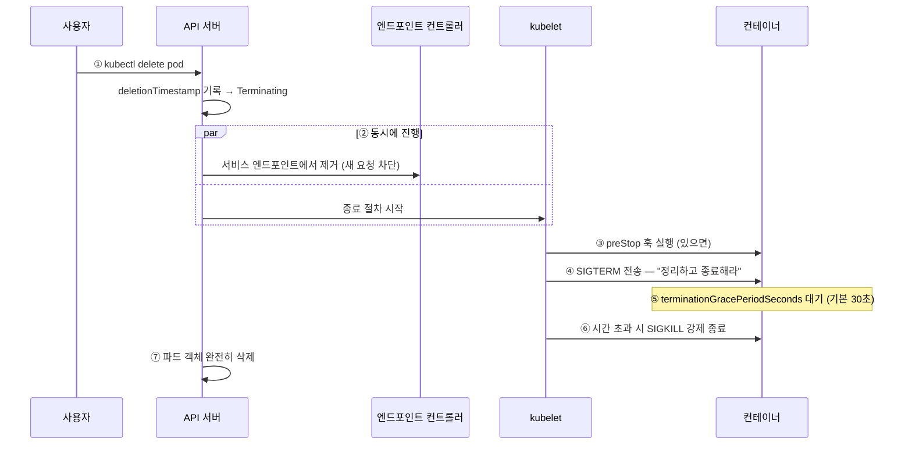

# 5.2 초기화 컨테이너와 파드 삭제

파드가 **시작될 때**와 **삭제될 때** 무슨 일이 벌어지는지 알아봅니다.

## 초기화 컨테이너(Init Container)

**앱 컨테이너보다 먼저 실행되어, 끝까지 완료되어야만 앱이 시작되는 컨테이너**입니다.


특징입니다.

* **순서대로** 하나씩 실행됩니다 (동시 실행 안 됨)
* **반드시 완료(종료 코드 0)** 되어야 다음으로 넘어갑니다
* 실패하면 `restartPolicy`에 따라 재시도합니다
* 모든 init이 끝나야 `containers`가 시작됩니다

### 사용 예 1: 의존 서비스 대기

DB가 준비되기 전에 앱이 뜨면 연결 오류로 죽습니다. init 컨테이너로 기다립니다.

```yaml
apiVersion: v1
kind: Pod
metadata:
  name: kiada-init
spec:
  initContainers:
    - name: wait-for-db
      image: busybox
      command: ["sh", "-c"]
      args:
        - until nslookup mysql-service; do
            echo "DB를 기다리는 중...";
            sleep 2;
          done;
          echo "DB 준비 완료!"

  containers:
    - name: kiada
      image: luksa/kiada:0.1
```

```bash
kubectl get pods -w
# NAME         READY   STATUS     RESTARTS   AGE
# kiada-init   0/1     Init:0/1   0          5s      <- init 실행 중
# kiada-init   0/1     PodInitializing   0   30s
# kiada-init   1/1     Running    0          32s
```

`Init:0/1` 은 "init 컨테이너 1개 중 0개 완료"라는 뜻입니다.

```bash
kubectl logs kiada-init -c wait-for-db     # init 컨테이너 로그도 볼 수 있습니다
```

### 사용 예 2: 설정 파일 내려받기

```yaml
initContainers:
  - name: fetch-config
    image: busybox
    command: ["wget", "-O", "/config/app.conf", "http://config-server/app.conf"]
    volumeMounts:
      - name: config
        mountPath: /config

containers:
  - name: kiada
    image: luksa/kiada:0.1
    volumeMounts:
      - name: config
        mountPath: /etc/app        # init이 받아 둔 파일을 사용

volumes:
  - name: config
    emptyDir: {}
```

### 사용 예 3: 권한이 필요한 준비 작업

init 컨테이너에만 강한 권한을 주고, 앱 컨테이너는 최소 권한으로 돌립니다. **보안상 좋은 패턴**입니다.

```yaml
initContainers:
  - name: setup-permissions
    image: busybox
    command: ["sh", "-c", "chown -R 1000:1000 /data"]
    securityContext:
      runAsUser: 0               # init만 root
    volumeMounts:
      - name: data
        mountPath: /data

containers:
  - name: kiada
    image: luksa/kiada:0.1
    securityContext:
      runAsUser: 1000            # 앱은 일반 사용자
```

### init 컨테이너 vs 사이드카

| | init 컨테이너 | 사이드카 |
| :--- | :--- | :--- |
| 실행 시점 | 앱 시작 **전** | 앱과 **함께** |
| 종료 | **완료되고 끝남** | 파드가 살아 있는 동안 계속 |
| 정의 위치 | `initContainers` | `containers` (또는 `initContainers` + `restartPolicy: Always`) |
| 용도 | 준비 작업 | 지속적인 보조 |

## 파드 삭제하기

```bash
kubectl delete pod kiada
kubectl delete pod kiada kiada-ssl        # 여러 개
kubectl delete pod -l app=kiada           # 레이블로
kubectl delete pod --all                  # 네임스페이스의 전부
kubectl delete -f kiada.yaml              # YAML에 정의된 것
```

## 삭제될 때 실제로 벌어지는 일

`kubectl delete`를 누른 뒤의 과정입니다. **면접에서도 자주 나오는 내용**입니다.



### 우아한 종료(Graceful Shutdown)

```yaml
spec:
  terminationGracePeriodSeconds: 60      # 기본 30초를 60초로
  containers:
    - name: kiada
      image: luksa/kiada:0.1
      lifecycle:
        preStop:
          exec:
            command: ["sh", "-c", "sleep 5"]
```

**`preStop`에 `sleep`을 넣는 이유**가 처음엔 이상해 보입니다. 이유가 있습니다.

> **경쟁 상태(Race Condition) 문제**
>
> 위 2번 단계에서 "엔드포인트 제거"와 "SIGTERM 전송"이 **동시에** 일어납니다. 그런데 엔드포인트 제거가 모든 노드의 kube-proxy에 퍼지는 데 시간이 걸립니다.
>
> 그 사이에 앱이 먼저 죽어 버리면, 아직 옛 정보를 가진 노드가 이 파드로 요청을 보내고 → **502 오류**가 납니다.
>
> `preStop`에 몇 초 `sleep`을 넣으면, 그동안 엔드포인트 제거가 전파될 시간을 벌 수 있습니다. **무중단 배포에서 매우 중요한 기법**입니다.

### 앱이 SIGTERM을 처리해야 합니다

2.3절에서 배운 **PID 1 문제**가 여기서 다시 나옵니다. 컨테이너의 1번 프로세스는 신호를 자동으로 처리해 주지 않습니다.

```javascript
// Node.js 예시
process.on('SIGTERM', () => {
  console.log('SIGTERM 수신. 정리 중...');
  server.close(() => {
    console.log('정상 종료');
    process.exit(0);
  });
});
```

이 코드가 없으면 앱은 SIGTERM을 무시하고, 30초 뒤 SIGKILL로 강제 종료됩니다. 처리 중이던 요청은 전부 유실됩니다.

### 강제 삭제

```bash
kubectl delete pod kiada --grace-period=0 --force
```

**최후의 수단입니다.** 데이터가 손상될 수 있습니다. 특히 데이터베이스 파드에는 절대 쓰면 안 됩니다.

파드가 `Terminating`에서 안 넘어갈 때는 보통 **파이널라이저(finalizer)** 가 걸려 있는 경우입니다.

```bash
kubectl get pod kiada -o jsonpath='{.metadata.finalizers}'
```

파이널라이저는 "이 정리 작업이 끝나기 전에는 지우지 마"라는 표시입니다. 예를 들어 볼륨 분리가 안 끝났을 때 걸립니다.

## 네임스페이스 통째로 삭제

```bash
kubectl delete namespace 이름
```

**그 안의 모든 객체가 함께 사라집니다.** 실습 후 정리할 때 편하지만, 운영 환경에서는 극도로 조심해야 합니다.

---

## 요약 및 비유

| 개념 | 등교 준비 비유 | 기술적 의미 |
| :--- | :--- | :--- |
| **init 컨테이너** | 세수하고 옷 입기 (등교 전 필수) | 앱 시작 전 완료되어야 하는 준비 |
| **Init:0/1** | 준비 1단계 진행 중 | init 컨테이너 진행 상황 |
| **preStop 훅** | 나가기 전 정리정돈 | 종료 직전 실행되는 명령 |
| **SIGTERM** | "이제 마무리하세요" 안내방송 | 정상 종료 요청 신호 |
| **grace period** | 정리할 시간 30초 | 강제 종료까지의 유예 시간 |
| **SIGKILL** | 강제 퇴장 | 즉시 강제 종료 |
| **finalizer** | 대출 도서 반납 확인 | 삭제 전 완료해야 할 정리 작업 |

---

## 결론

* **init 컨테이너**는 순서대로 실행되고 **완료되어야만** 앱이 시작됩니다. 의존 대기, 설정 준비, 권한 작업에 씁니다.
* 파드 삭제는 **엔드포인트 제거 → preStop → SIGTERM → 유예 대기 → SIGKILL** 순서로 진행됩니다.
* **앱이 SIGTERM을 직접 처리해야** 우아한 종료가 됩니다. 안 하면 30초 뒤 강제 종료입니다.
* **`preStop`에 짧은 `sleep`** 을 넣는 것은 502 오류를 막는 실전 기법입니다.
* `--force --grace-period=0`은 최후의 수단이며, 데이터 손상 위험이 있습니다.

---

## 공식 문서 업데이트 (2026년 8월 기준)

### 1) init 컨테이너에 `restartPolicy: Always`를 주면 사이드카가 됩니다

이 절에서 배운 init 컨테이너의 문법이 **사이드카에도 그대로 쓰이게 되었습니다.** 5.1절에서 본 내용과 이어집니다.

```yaml
initContainers:
  - name: wait-for-db
    image: busybox
    command: ["sh", "-c", "until nslookup mysql; do sleep 2; done"]
    # restartPolicy 없음 -> 일반 init 컨테이너 (완료 후 종료)

  - name: log-shipper
    image: fluent-bit
    restartPolicy: Always
    # restartPolicy: Always -> 사이드카 (계속 실행)
```

**같은 `initContainers` 블록에 둘을 섞어 쓸 수 있습니다.** 위에서부터 순서대로 처리되며, 사이드카는 "시작되면 다음으로 넘어가고" 계속 살아 있습니다. 1.33에서 정식(GA) 기능이 되었습니다.

### 2) 파드 종료 관련 개선

* **`terminationGracePeriodSeconds`가 프로브에도 적용**됩니다. 리브니스 프로브 실패로 컨테이너를 죽일 때 별도의 유예 시간을 줄 수 있습니다.

```yaml
livenessProbe:
  httpGet:
    path: /healthz
    port: 8080
  terminationGracePeriodSeconds: 10    # 프로브 실패 시 유예 시간
```

* **노드 정상 종료(Graceful Node Shutdown)**: 노드가 꺼질 때 kubelet이 파드를 순서대로 정리해 줍니다. 시스템 파드를 나중에 끄도록 우선순위도 정할 수 있습니다.

### 3) `DisruptionTarget` 컨디션

파드가 축출(eviction)될 때 **왜 쫓겨나는지** 파드 컨디션에 기록됩니다. 예전에는 파드가 조용히 사라져서 원인 파악이 어려웠습니다.

```bash
kubectl get pod kiada -o jsonpath='{.status.conditions}' | jq
```

`reason` 값의 예: `PreemptionByScheduler`(더 중요한 파드에 밀림), `EvictionByEvictionAPI`, `TerminationByKubelet`(노드 자원 부족)

### 4) 사이드카 종료 순서가 보장됩니다

기존 방식에서는 사이드카와 주 컨테이너의 종료 순서가 무작위여서, 프록시가 먼저 죽으면 앱의 마지막 요청이 유실되곤 했습니다.

네이티브 사이드카를 쓰면 **주 컨테이너가 완전히 끝난 뒤 사이드카가 역순으로 종료**됩니다. 이 절에서 배운 `preStop sleep` 기법이 필요한 경우가 그만큼 줄어듭니다.

참고: <https://kubernetes.io/docs/concepts/workloads/pods/sidecar-containers/#sidecar-containers-and-pod-lifecycle>
