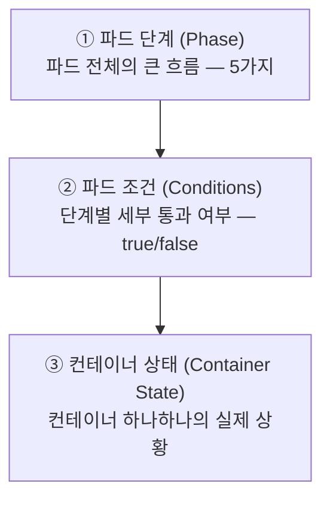
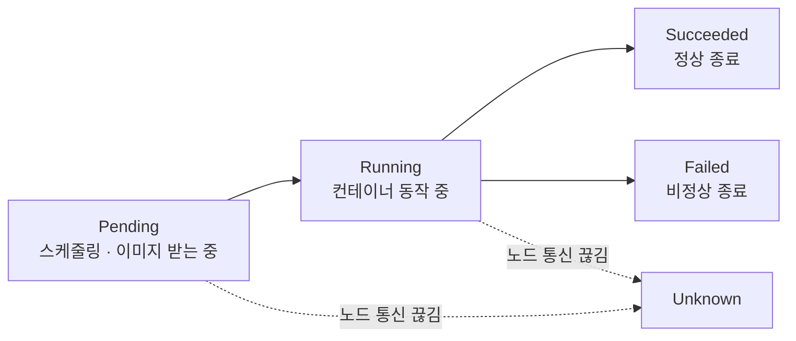
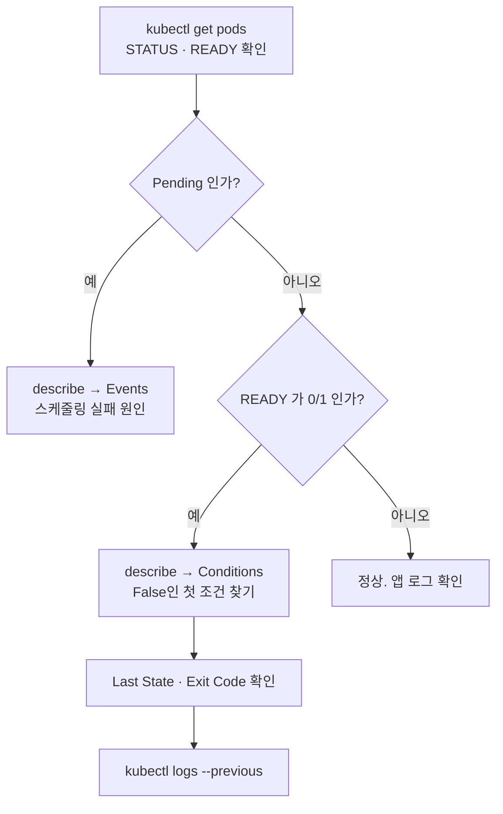

# 6.1 파드 상태 이해하기

4~5장에서 파드를 만들고 지워 봤습니다. 이제 파드가 **지금 어떤 상태인지 정확히 읽는 법**을 배웁니다. 장애가 났을 때 가장 먼저 하는 일이 바로 이것입니다.

## 상태는 세 겹으로 되어 있습니다

`kubectl get pods`가 보여 주는 `STATUS` 한 칸만 보고 판단하면 자주 틀립니다. 쿠버네티스는 파드 상태를 **세 개의 층**으로 나눠 기록합니다.



| 층 | 필드 | 답하는 질문 |
| :--- | :--- | :--- |
| **파드 단계** | `status.phase` | 이 파드는 큰 틀에서 어디쯤 와 있나? |
| **파드 조건** | `status.conditions` | 어느 관문에서 막혀 있나? |
| **컨테이너 상태** | `status.containerStatuses[].state` | 어느 컨테이너가 왜 문제인가? |

문제를 찾을 때는 **위에서 아래로** 좁혀 내려갑니다.

## 1) 파드 단계(Pod Phase)

파드의 일생을 다섯 단어로 요약한 것입니다. **딱 5개뿐**입니다.

| 단계 | 의미 |
| :--- | :--- |
| **Pending** | 클러스터가 파드를 받아들였지만 아직 컨테이너가 안 뜸. 스케줄링 대기 + 이미지 내려받는 시간 포함 |
| **Running** | 노드에 배치되어 컨테이너가 모두 만들어졌고, 최소 하나가 실행 중이거나 시작/재시작 중 |
| **Succeeded** | 모든 컨테이너가 **성공적으로** 끝남. 다시 시작되지 않음 |
| **Failed** | 모든 컨테이너가 끝났는데 **하나 이상이 실패**(0이 아닌 종료 코드)로 끝남 |
| **Unknown** | 노드와 통신이 안 되어 상태를 알 수 없음 |



`Succeeded`와 `Failed`는 **잡(Job)이나 일회성 작업**에서 주로 봅니다. 웹 서버처럼 계속 도는 앱은 `Running`에 머물러 있어야 정상입니다.

```bash
kubectl get pod kiada -o jsonpath='{.status.phase}'
# Running
```

### 중요: `kubectl get pods`의 STATUS는 단계가 아닙니다

가장 많이 오해하는 부분입니다. `STATUS` 열에는 `CrashLoopBackOff`, `ImagePullBackOff`, `Init:0/2` 같은 값이 나오는데, **이것들은 파드 단계가 아닙니다.**

kubectl이 사용자가 보기 편하도록 **단계 + 조건 + 컨테이너 상태를 종합해서 만들어 낸 요약 문자열**입니다.

```bash
kubectl get pod kiada
# NAME    READY   STATUS             RESTARTS   AGE
# kiada   0/1     CrashLoopBackOff   5          3m     <- 이건 phase가 아님

kubectl get pod kiada -o jsonpath='{.status.phase}'
# Running                                              <- 실제 phase는 Running
```

> 컨테이너가 계속 죽고 있는데도 파드 단계는 `Running`입니다. **단계만 믿으면 장애를 놓칩니다.**

## 2) 파드 조건(Pod Conditions)

파드가 준비되기까지 통과해야 하는 **관문 체크리스트**입니다. 각각 `True` / `False` / `Unknown` 값을 가집니다.

| 조건 | 의미 |
| :--- | :--- |
| **PodScheduled** | 노드에 배치되었는가 |
| **Initialized** | 초기화 컨테이너가 모두 완료되었는가 |
| **ContainersReady** | 모든 컨테이너가 준비되었는가 |
| **Ready** | 파드가 요청을 받을 수 있는가 (**서비스 엔드포인트에 등록되는 기준**) |

```bash
kubectl get pod kiada -o jsonpath='{range .status.conditions[*]}{.type}{"\t"}{.status}{"\t"}{.reason}{"\n"}{end}'
# PodScheduled     True
# Initialized      True
# ContainersReady  False   ContainersNotReady
# Ready            False   ContainersNotReady
```

**`False`인 첫 번째 조건이 병목 지점**입니다. 위 예시는 스케줄링과 초기화는 통과했고 컨테이너에서 막혀 있다는 뜻이므로, 다음 층(컨테이너 상태)을 봐야 합니다.

> **`Ready`가 중요한 이유**
> 11장에서 배울 **서비스**는 `Ready`가 `True`인 파드에만 요청을 보냅니다. 파드가 `Running`이어도 `Ready`가 아니면 트래픽을 못 받습니다. `kubectl get pods`의 `READY` 열이 `0/1`인 상태가 그것입니다.

## 3) 컨테이너 상태(Container State)

가장 안쪽 층입니다. 컨테이너 하나하나가 갖는 상태로, **셋 중 하나**입니다.

| 상태 | 의미 | 대표적인 `reason` |
| :--- | :--- | :--- |
| **Waiting** | 아직 실행 못 함. 준비 작업 중이거나 문제 발생 | `ContainerCreating`, `ImagePullBackOff`, `CrashLoopBackOff` |
| **Running** | 정상 실행 중 | — |
| **Terminated** | 실행이 끝남 | `Completed`, `Error`, `OOMKilled` |

```bash
kubectl get pod kiada -o jsonpath='{.status.containerStatuses[0].state}'
```

`kubectl describe`가 가장 읽기 편합니다.

```bash
kubectl describe pod kiada
```

```
Containers:
  kiada:
    State:          Waiting
      Reason:       CrashLoopBackOff
    Last State:     Terminated
      Reason:       Error
      Exit Code:    1
      Started:      Wed, 20 Aug 2026 14:03:11 +0900
      Finished:     Wed, 20 Aug 2026 14:03:12 +0900
    Ready:          False
    Restart Count:  5
```

### `Last State`가 진짜 단서입니다

현재 상태(`CrashLoopBackOff`)는 **결과**일 뿐이고, **왜 죽었는지는 `Last State`에 있습니다.**

* **`Exit Code: 1`** — 앱이 스스로 오류로 종료. 로그를 봐야 합니다.
* **`Exit Code: 137`** — `SIGKILL`(128 + 9). 대개 **`OOMKilled`**, 즉 메모리 초과입니다.
* **`Exit Code: 143`** — `SIGTERM`(128 + 15). 정상 종료 요청을 받고 끝난 경우입니다.

### 죽은 컨테이너의 로그 보기

이미 재시작되었다면 현재 로그에는 원인이 없습니다. **이전 컨테이너의 로그**를 봐야 합니다.

```bash
kubectl logs kiada --previous          # 또는 -p
kubectl logs kiada -c 컨테이너이름 -p    # 다중 컨테이너 파드
```

> `--previous`를 모르면 장애 원인을 영영 못 찾습니다. **가장 중요한 디버깅 옵션**입니다.

## 자주 보는 STATUS와 원인

| STATUS | 어디서 막힌 것인가 | 확인할 것 |
| :--- | :--- | :--- |
| `Pending` | 스케줄링 실패 (자원 부족, 테인트, 노드 셀렉터) | `kubectl describe pod` 의 Events |
| `ContainerCreating` | 이미지 받는 중, 볼륨 마운트 중 | 오래 걸리면 Events 확인 |
| `ImagePullBackOff` / `ErrImagePull` | 이미지 이름 오타, 태그 없음, 비공개 레지스트리 인증 실패 | 이미지 이름, `imagePullSecrets` |
| `CrashLoopBackOff` | 컨테이너가 뜨자마자 계속 죽음 | `kubectl logs --previous` |
| `CreateContainerConfigError` | ConfigMap/Secret이 없음 | 참조하는 이름 존재 여부 |
| `OOMKilled` | 메모리 제한 초과 | `resources.limits.memory` |
| `Init:0/2` | 초기화 컨테이너 진행 중 | `kubectl logs 파드 -c init컨테이너` |
| `Terminating` | 삭제 진행 중 | 오래 걸리면 finalizer, preStop 확인 |

### CrashLoopBackOff의 "BackOff"

컨테이너가 죽으면 kubelet이 다시 살립니다. 그런데 **즉시 무한 반복하면 노드가 망가지므로**, 재시작 간격을 점점 늘립니다.

```
10초 → 20초 → 40초 → 80초 → 160초 → 300초(최대)
```

이것을 **지수 백오프(Exponential Backoff)** 라고 합니다. 컨테이너가 10분간 정상 동작하면 간격이 초기화됩니다.

> `CrashLoopBackOff`는 **오류 이름이 아니라 "재시작을 기다리는 중"이라는 상태 이름**입니다. 진짜 원인은 항상 로그와 `Last State`에 있습니다.

## 이벤트로 맥락 읽기

파드 자체 상태로 부족하면 **이벤트(Event)** 를 봅니다. 5.3절에서 다룬 내용입니다.

```bash
kubectl describe pod kiada                       # 맨 아래 Events 섹션
kubectl get events --field-selector involvedObject.name=kiada
kubectl get events --sort-by=.lastTimestamp      # 시간순 전체
```

스케줄링 실패(`FailedScheduling`), 이미지 오류(`Failed`), 프로브 실패(`Unhealthy`)는 **파드 상태가 아니라 이벤트에만** 자세히 남습니다.

## 디버깅 순서 정리



---

## 요약 및 비유

| 개념 | 병원 진료 비유 | 기술적 의미 |
| :--- | :--- | :--- |
| **파드 단계(Phase)** | 접수 / 진료 중 / 퇴원 | 파드 전체의 큰 흐름 5가지 |
| **파드 조건(Conditions)** | 접수·수납·검사 체크리스트 | 단계별 관문 통과 여부 |
| **컨테이너 상태(State)** | 각 장기의 실제 소견 | 컨테이너별 Waiting/Running/Terminated |
| **Ready 조건** | "진료 가능" 팻말 | 서비스가 트래픽을 보내는 기준 |
| **Last State** | 지난 진료 기록 | 재시작 직전 컨테이너의 종료 원인 |
| **CrashLoopBackOff** | 재입원 대기 중 | 반복 실패로 재시작 간격이 늘어난 상태 |
| **지수 백오프** | 재방문 간격을 점점 늘림 | 10초 → 최대 300초 |

---

## 결론

* 파드 상태는 **단계 → 조건 → 컨테이너 상태** 세 겹입니다. 위에서 아래로 좁혀 가며 원인을 찾습니다.
* `kubectl get pods`의 `STATUS`는 **파드 단계가 아니라 kubectl이 만든 요약**입니다. `CrashLoopBackOff`인데 단계는 `Running`일 수 있습니다.
* 원인은 현재 상태가 아니라 **`Last State`의 종료 코드**와 **`kubectl logs --previous`** 에 있습니다.
* `Running`과 `Ready`는 다릅니다. **`Ready`가 아니면 서비스 트래픽을 못 받습니다.**

다음 절에서는 "컨테이너가 살아는 있는데 응답을 안 하는" 상황을 쿠버네티스가 감지하게 만드는 **라이브니스 프로브**를 다룹니다.

---

## 공식 문서 업데이트 (2026년 8월 기준)

* **`PodReadyToStartContainers` 조건**이 추가되었습니다. 파드 샌드박스(네트워크 네임스페이스)가 준비된 시점을 알려 주는 조건으로, 책에는 없습니다. 이미지 받기 전 단계의 지연을 구분할 때 유용합니다.
* **파드 삭제 시 종료 단계 보장**: 1.27부터 kubelet이 삭제된 파드를 API 서버에서 지우기 전에 반드시 `Succeeded` 또는 `Failed`로 전이시킵니다. 예전에는 `Running`인 채로 사라지는 경우가 있었습니다.
* **컨테이너 재시작 지연 조정**: `CrashLoopBackOff`의 최대 300초 백오프를 클러스터 차원에서 줄이거나 조정하는 기능이 추가되고 있습니다. 기본 동작은 책과 동일합니다.
* 참고: <https://kubernetes.io/docs/concepts/workloads/pods/pod-lifecycle/>
