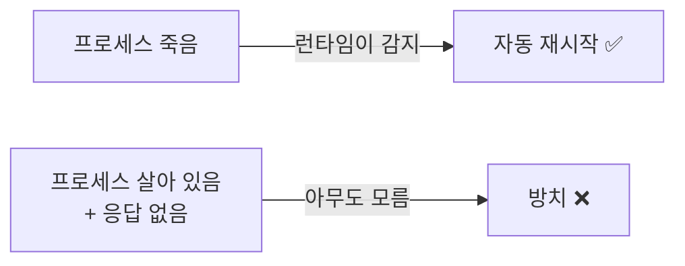
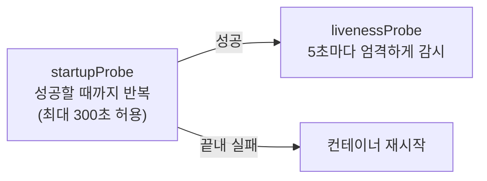

# 6.2 라이브니스 프로브로 컨테이너 살려 두기

앞 절에서 컨테이너가 **죽으면** 쿠버네티스가 다시 살린다는 것을 봤습니다. 그런데 더 고약한 상황이 있습니다. **죽지도 않고 일도 안 하는** 경우입니다.

## 프로세스는 살아 있는데 앱은 먹통

* 자바 앱이 **데드락(Deadlock)** 에 빠져 모든 요청이 멈춤
* 메모리 누수로 GC만 계속 돌면서 응답을 못 함
* 무한 루프에 빠짐
* DB 커넥션 풀이 고갈되어 요청을 못 받음

이때 **프로세스는 멀쩡히 살아 있습니다.** 컨테이너 런타임이 보기에 아무 문제가 없으니 재시작도 안 됩니다. 사용자만 타임아웃을 겪습니다.



**라이브니스 프로브(Liveness Probe)** 는 이 빈틈을 메웁니다. kubelet이 주기적으로 컨테이너에 "살아 있냐"고 물어보고, **대답이 없으면 죽여서 다시 띄웁니다.**

## 검사 방식 네 가지

프로브 하나에는 아래 중 **정확히 하나만** 정의합니다.

### 1) `httpGet` — 가장 많이 씁니다

컨테이너의 HTTP 엔드포인트에 GET 요청을 보냅니다.

```yaml
livenessProbe:
  httpGet:
    path: /healthz
    port: 8080
```

* 응답 코드가 **200 이상 400 미만이면 성공**, 그 밖은 실패
* 연결 자체가 안 되면 실패

### 2) `exec` — 명령 실행

컨테이너 안에서 명령을 실행하고 **종료 코드 0이면 성공**입니다.

```yaml
livenessProbe:
  exec:
    command: ["cat", "/tmp/healthy"]
```

HTTP 엔드포인트가 없는 앱(배치 작업, 데이터베이스 등)에 씁니다.

### 3) `tcpSocket` — 포트만 확인

지정한 포트로 TCP 연결이 **맺어지면 성공**입니다.

```yaml
livenessProbe:
  tcpSocket:
    port: 5432
```

가장 가볍지만 **가장 약한 검사**입니다. 포트만 열려 있고 앱은 먹통일 수 있습니다.

### 4) `grpc` — gRPC 서비스용

gRPC 표준 헬스 체크 프로토콜을 사용합니다. HTTP 엔드포인트를 따로 만들 필요가 없습니다.

```yaml
livenessProbe:
  grpc:
    port: 50051
    service: ""       # 비우면 기본 서비스
```

> 책이 쓰인 시점에는 베타였지만 **지금은 정식 기능**입니다. gRPC 앱이라면 이것을 쓰세요.

## 직접 만들어 보기

일부러 죽는 앱을 띄워서 프로브가 동작하는 것을 확인합니다.

**kiada-liveness.yaml**

```yaml
apiVersion: v1
kind: Pod
metadata:
  name: kiada-liveness
spec:
  containers:
    - name: kiada
      image: luksa/kiada-ssl:0.1
      ports:
        - containerPort: 8080
      livenessProbe:
        httpGet:
          path: /healthz
          port: 8080
        initialDelaySeconds: 10
        periodSeconds: 5
        timeoutSeconds: 2
        failureThreshold: 3
```

```bash
kubectl apply -f kiada-liveness.yaml
kubectl get pods -w
```

프로브가 실패하기 시작하면 이렇게 변합니다.

```
NAME             READY   STATUS    RESTARTS   AGE
kiada-liveness   1/1     Running   0          30s
kiada-liveness   1/1     Running   1          52s     <- 재시작됨
kiada-liveness   1/1     Running   2          1m48s
```

`RESTARTS` 숫자가 올라가면 **라이브니스 프로브가 컨테이너를 죽였다는 뜻**입니다.

### 왜 죽였는지 확인하기

```bash
kubectl describe pod kiada-liveness
```

```
Containers:
  kiada:
    Last State:  Terminated
      Reason:    Error
      Exit Code: 137          <- SIGKILL. 강제 종료됨

Events:
  Type     Reason     Message
  ----     ------     -------
  Warning  Unhealthy  Liveness probe failed: HTTP probe failed with statuscode: 500
  Normal   Killing    Container kiada failed liveness probe, will be restarted
```

**`Unhealthy` 이벤트와 `Killing` 이벤트**가 결정적인 증거입니다. 이것이 없으면 라이브니스 때문이 아닙니다.

```bash
kubectl logs kiada-liveness --previous     # 죽기 직전 로그
```

## 설정 항목과 기본값

| 필드 | 기본값 | 의미 |
| :--- | :---: | :--- |
| `initialDelaySeconds` | `0` | 컨테이너 시작 후 첫 검사까지 기다릴 시간 |
| `periodSeconds` | `10` | 검사 주기 |
| `timeoutSeconds` | `1` | 응답을 기다릴 시간 |
| `successThreshold` | `1` | 성공 판정에 필요한 연속 성공 횟수 (라이브니스는 **1 고정**) |
| `failureThreshold` | `3` | 실패 판정에 필요한 연속 실패 횟수 |

> **`initialDelaySeconds`를 빠뜨리면 큰일 납니다.**
> 기본값이 `0`이라 컨테이너가 뜨자마자 검사를 시작합니다. 앱이 아직 준비 중인데 실패로 판정되고 → 재시작 → 또 실패 → **영원히 뜨지 못하는 무한 재시작**에 빠집니다.

**최악의 감지 시간** = `initialDelaySeconds` + (`periodSeconds` × `failureThreshold`)

위 예제라면 10 + (5 × 3) = **최대 25초** 만에 감지됩니다.

## 시작이 느린 앱: 스타트업 프로브

`initialDelaySeconds`로 버티는 데는 한계가 있습니다. 부팅에 2분 걸리는 레거시 앱이라면 `initialDelaySeconds: 120`을 줘야 하는데, 그러면 **정상 운영 중에 장애가 나도 최소 2분간 감지를 못 합니다.**

**스타트업 프로브(Startup Probe)** 가 이 문제를 깔끔하게 해결합니다.

```yaml
startupProbe:
  httpGet:
    path: /healthz
    port: 8080
  failureThreshold: 30       # 30회까지 봐 줌
  periodSeconds: 10          # 10초 간격 → 최대 300초 허용

livenessProbe:
  httpGet:
    path: /healthz
    port: 8080
  periodSeconds: 5           # 시작만 끝나면 5초마다 촘촘히 감시
  failureThreshold: 3
```



**스타트업 프로브가 성공할 때까지 라이브니스와 레디니스는 아예 동작하지 않습니다.** 시작할 때는 느슨하게, 시작한 뒤에는 엄격하게 — 두 마리 토끼를 잡습니다.

## 프로브 세 종류 비교

| | 라이브니스 | 레디니스 | 스타트업 |
| :--- | :--- | :--- | :--- |
| 질문 | "살아 있나?" | "일 받을 수 있나?" | "다 떴나?" |
| 실패하면 | **컨테이너 재시작** | 서비스에서 **제외**(재시작 안 함) | 컨테이너 재시작 |
| 동작 시점 | 시작 이후 계속 | 시작 이후 계속 | **시작할 때만** |
| 다루는 곳 | 이 절 | **11장(서비스)** | 이 절 |

> **레디니스 프로브**는 트래픽 라우팅과 직결되므로 서비스를 배운 뒤 11장에서 자세히 다룹니다. 지금은 **"라이브니스는 죽이고, 레디니스는 뺀다"** 는 차이만 기억하면 됩니다.

## 좋은 프로브를 만드는 원칙

### 1) 가볍고 빨라야 합니다

프로브는 **모든 파드에서 주기적으로** 실행됩니다. 무거운 검사는 그 자체가 부하입니다. `timeoutSeconds` 기본값이 **1초**라는 점을 기억하세요.

### 2) 의존 서비스를 검사하면 안 됩니다

가장 흔하고 가장 위험한 실수입니다.

```yaml
# 나쁜 예: /healthz 가 DB 연결까지 확인
```

DB가 잠깐 느려지면 → **모든 앱 파드의 라이브니스가 동시에 실패** → 전부 재시작 → DB에 재연결 폭주 → 상황 악화. 이것을 **연쇄 장애(Cascading Failure)** 라고 합니다.

> **라이브니스는 "이 컨테이너 자신"만 검사해야 합니다.** 외부 의존성은 레디니스에서 다루는 것이 맞습니다.

### 3) 인증을 걸지 마세요

프로브 요청에는 인증 헤더를 붙일 수 없습니다(커스텀 헤더는 가능). 헬스 체크 경로는 인증 없이 열어 둡니다.

### 4) JVM 앱은 메모리에 주의

컨테이너 메모리 제한보다 JVM 힙을 크게 잡으면, 프로브 실패가 아니라 **`OOMKilled`(Exit Code 137)** 로 죽습니다. 원인이 다르니 `describe`로 구분하세요.

### 5) 라이브니스를 아예 안 다는 것도 선택지입니다

**의심스러우면 달지 마세요.** 잘못 만든 라이브니스 프로브는 없느니만 못합니다. 정상 앱을 계속 죽여서 장애를 만들어 냅니다. 공식 문서도 **"진짜 복구 불가능한 상태를 감지할 때만"** 쓰라고 권합니다.

---

## 요약 및 비유

| 개념 | 야간 당직 비유 | 기술적 의미 |
| :--- | :--- | :--- |
| **라이브니스 프로브** | "괜찮아요?" 하고 주기적으로 확인 | 응답 없으면 컨테이너 재시작 |
| **`httpGet`** | 인터폰으로 부르기 | HTTP 200~399면 성공 |
| **`exec`** | 직접 문 열고 확인 | 종료 코드 0이면 성공 |
| **`tcpSocket`** | 불 켜져 있는지만 봄 | 포트 연결만 확인 (약한 검사) |
| **`initialDelaySeconds`** | 출근 직후엔 안 부름 | 첫 검사까지의 유예 시간 |
| **`failureThreshold`** | 세 번 불러도 무응답이면 조치 | 실패 판정까지의 연속 실패 횟수 |
| **스타트업 프로브** | 신입은 적응 기간을 넉넉히 | 시작 동안만 느슨하게, 이후 엄격하게 |
| **연쇄 장애** | 정전됐다고 전원 퇴근 | 공용 의존성 검사 → 전 파드 동시 재시작 |

---

## 결론

* 라이브니스 프로브는 **"죽지는 않았는데 일을 못 하는" 컨테이너**를 감지해 재시작합니다.
* 검사 방식은 `httpGet`, `exec`, `tcpSocket`, `grpc` 네 가지이며 **하나만** 정의합니다.
* `initialDelaySeconds` 기본값이 `0`이라 **빠뜨리면 무한 재시작**에 빠집니다. 시작이 느린 앱은 **스타트업 프로브**로 해결하는 것이 정석입니다.
* 프로브는 **가볍게, 자기 자신만** 검사합니다. 의존 서비스를 검사하면 연쇄 장애를 만듭니다.
* 재시작 원인은 `describe`의 **`Unhealthy` / `Killing` 이벤트**와 **Exit Code 137**로 확인합니다.

다음 절에서는 컨테이너가 시작하고 끝나는 순간에 원하는 작업을 끼워 넣는 **생명주기 훅**을 다룹니다.

---

## 공식 문서 업데이트 (2026년 8월 기준)

* **gRPC 프로브가 정식(GA) 기능**입니다. 쿠버네티스 1.24에서 베타, **1.27에서 GA**가 되어 별도 설정 없이 바로 쓸 수 있습니다. 책은 베타 시점 기준이라 조심스럽게 서술되어 있습니다.
* **스타트업 프로브**는 책에서도 다루지만, 지금은 시작이 느린 앱의 **표준 해법**으로 자리 잡았습니다. `initialDelaySeconds`를 크게 잡는 방식은 권장하지 않습니다.
* 프로브별 **`terminationGracePeriodSeconds` 개별 지정**이 가능합니다. 라이브니스 실패로 죽일 때만 종료 유예를 짧게 주는 식으로 쓸 수 있습니다.
* 참고: <https://kubernetes.io/docs/concepts/workloads/pods/probes/>
