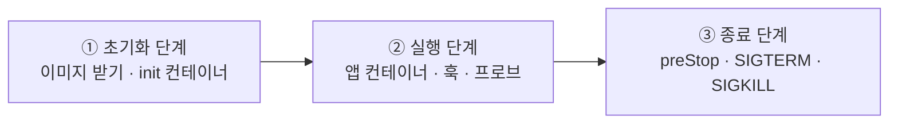
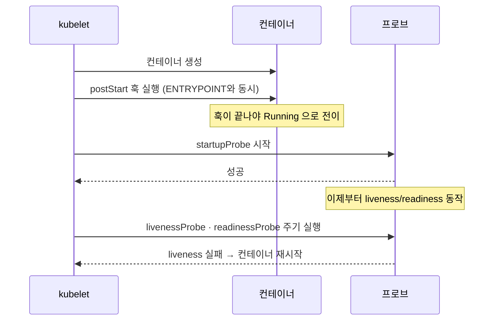
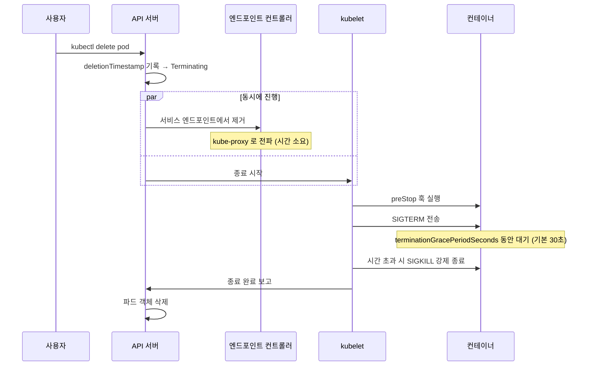
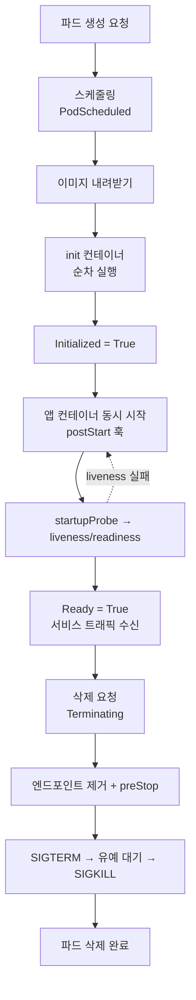

# 6.4 파드 생명주기 이해하기

지금까지 배운 조각들(초기화 컨테이너, 프로브, 훅, 재시작 정책)을 **하나의 흐름**으로 이어 붙일 차례입니다. 파드의 일생은 크게 **세 단계**로 나뉩니다.



## ① 초기화 단계

### 이미지 내려받기

컨테이너를 만들려면 먼저 이미지가 있어야 합니다. 언제 새로 받을지는 **`imagePullPolicy`** 가 결정합니다.

| 값 | 동작 | 기본값이 되는 경우 |
| :--- | :--- | :--- |
| `IfNotPresent` | 노드에 없을 때만 받음 | 태그가 **명시된** 경우 |
| `Always` | 매번 레지스트리에 확인 | 태그가 **`latest`이거나 생략**된 경우 |
| `Never` | 절대 안 받음. 노드에 있어야만 동작 | — |

```yaml
containers:
  - name: kiada
    image: luksa/kiada:0.1
    imagePullPolicy: IfNotPresent
```

> **`latest` 태그를 쓰면 안 되는 이유**가 여기 있습니다. `imagePullPolicy`가 자동으로 `Always`가 되어 매번 레지스트리를 확인하고, **어떤 버전이 뜰지 예측할 수 없어집니다.** 항상 구체적인 태그를 쓰세요.

이 단계에서 실패하면 `ErrImagePull` → `ImagePullBackOff` 상태가 됩니다.

### 초기화 컨테이너 실행

`initContainers`에 정의된 컨테이너가 **정의된 순서대로 하나씩** 실행됩니다.

* 하나가 **완료(종료 코드 0)** 되어야 다음이 시작됩니다.
* 실패하면 **파드의 `restartPolicy`** 에 따라 재시도합니다.
* 전부 끝나야 `Initialized` 조건이 `True`가 되고, 앱 컨테이너가 시작됩니다.

이 동안 파드 단계는 `Pending`, STATUS는 `Init:0/2` 같은 형태입니다.

## ② 실행 단계

앱 컨테이너들이 시작됩니다. **초기화 컨테이너와 달리 순서가 없고 전부 동시에** 뜹니다.

컨테이너 하나가 시작될 때 벌어지는 일을 시간순으로 보면 이렇습니다.



핵심은 **`postStart` 훅이 끝나야 `Running`이 되고, 스타트업 프로브가 성공해야 라이브니스·레디니스가 시작된다**는 순서입니다.

### 재시작 정책

컨테이너가 죽었을 때 다시 살릴지 결정합니다. **파드 전체에 적용**되며 나중에 바꿀 수 없습니다.

| 값 | 동작 | 쓰는 곳 |
| :--- | :--- | :--- |
| **`Always`** | 종료 코드와 무관하게 항상 재시작 (**기본값**) | 웹 서버 등 계속 도는 앱 |
| **`OnFailure`** | 실패(0이 아닌 종료)일 때만 재시작 | 배치 작업 |
| **`Never`** | 절대 재시작 안 함 | 일회성 작업 |

> **`restartPolicy`는 "재시작"이지 "재생성"이 아닙니다.** 같은 노드에서 같은 파드의 컨테이너만 다시 띄웁니다. **노드가 통째로 죽으면 파드는 되살아나지 않습니다.** 그것은 14장의 레플리카셋이 할 일입니다.

재시작이 반복되면 6.1절에서 본 **지수 백오프**(10초 → 20초 → … → 최대 300초)가 적용되고, STATUS가 `CrashLoopBackOff`가 됩니다.

### 사이드카 컨테이너의 순서

`initContainers`에 `restartPolicy: Always`를 주면 **사이드카**가 됩니다. 일반 컨테이너와 순서가 다릅니다.

```yaml
spec:
  initContainers:
    - name: log-shipper
      image: fluent-bit
      restartPolicy: Always     # 이 한 줄이 사이드카로 만듭니다
  containers:
    - name: kiada
      image: luksa/kiada:0.1
```

* **시작**: 초기화 컨테이너 순서에 끼어 먼저 뜨고, 계속 살아 있습니다. → **앱보다 항상 먼저 준비됨**
* **종료**: 앱 컨테이너가 **완전히 멈춘 뒤에야** 종료됩니다. 여러 개면 **정의된 순서의 역순**으로 내려갑니다.

> 로그 수집기나 프록시가 **앱보다 먼저 뜨고 나중에 죽어야** 로그와 요청을 놓치지 않습니다. 이것을 언어 차원에서 보장해 주는 기능입니다.

## ③ 종료 단계

`kubectl delete pod`를 누른 뒤의 전체 흐름입니다. **면접 단골 질문**이기도 합니다.



| 단계 | 벌어지는 일 |
| :--- | :--- |
| 1 | API 서버가 `deletionTimestamp`를 기록 → 파드가 `Terminating`으로 표시 |
| 2 | **동시에** ① 서비스 엔드포인트에서 제거 ② kubelet이 종료 절차 시작 |
| 3 | `preStop` 훅 실행 (있는 경우) |
| 4 | 컨테이너에 **`SIGTERM`** 전송 |
| 5 | `terminationGracePeriodSeconds` 동안 대기 (기본 **30초**) |
| 6 | 시간이 지나도 안 죽으면 **`SIGKILL`** 로 강제 종료 |
| 7 | 파드 객체가 완전히 삭제됨 |

### 2번의 "동시에"가 문제의 근원입니다

엔드포인트 제거가 모든 노드에 전파되는 데 시간이 걸리는데, 앱은 그것을 기다려 주지 않습니다. 그래서 **6.3절의 `preStop` + `sleep`** 패턴이 필요합니다.

### 앱이 `SIGTERM`을 처리해야 합니다

2.3절의 **PID 1 문제**가 여기서 다시 나옵니다. 컨테이너의 1번 프로세스는 신호를 자동 처리하지 않습니다.

```javascript
process.on('SIGTERM', () => {
  server.close(() => process.exit(0));   // 처리 중인 요청을 마치고 종료
});
```

이 코드가 없으면 30초 뒤 `SIGKILL`로 강제 종료되고, **처리 중이던 요청은 전부 유실됩니다.**

## 전체 그림



## 파드는 되살아나지 않습니다

마지막으로 가장 중요한 원칙입니다.

* 파드는 **한 번 죽으면 끝**입니다. 다른 노드로 옮겨 가지 않습니다.
* 노드가 죽으면 그 위의 파드도 **그대로 사라집니다.**
* 컨테이너 재시작은 **같은 파드 안에서만** 일어납니다.

> **그래서 실무에서는 파드를 직접 만들지 않습니다.** 파드가 사라졌을 때 새로 만들어 주는 **레플리카셋(14장)** 과 **디플로이먼트(15장)** 를 통해 관리합니다. 4~6장에서 파드를 직접 다룬 것은 **원리를 이해하기 위한 학습 과정**입니다.

---

## 요약 및 비유

| 개념 | 공연 진행 비유 | 기술적 의미 |
| :--- | :--- | :--- |
| **초기화 단계** | 무대 설치와 리허설 | 이미지 받기 + init 컨테이너 순차 실행 |
| **실행 단계** | 본 공연 | 앱 컨테이너 동시 실행 + 훅 + 프로브 |
| **종료 단계** | 정리하고 철수 | preStop → SIGTERM → 유예 → SIGKILL |
| **`imagePullPolicy`** | 대본을 매번 새로 받을지 | 이미지 재다운로드 시점 결정 |
| **`restartPolicy`** | 배우가 쓰러지면 다시 세울지 | Always / OnFailure / Never |
| **사이드카** | 조명·음향 스태프 | 앱보다 먼저 켜지고 나중에 꺼짐 |
| **유예 시간** | "10분 안에 철수하세요" | terminationGracePeriodSeconds, 기본 30초 |
| **파드는 안 되살아남** | 그날 공연은 그날로 끝 | 재생성은 레플리카셋의 역할 |

---

## 결론

* 파드의 일생은 **초기화 → 실행 → 종료** 세 단계입니다.
* **초기화**에서는 이미지를 받고 init 컨테이너가 **순차 실행**됩니다. **실행**에서는 앱 컨테이너가 **동시 시작**되고 훅과 프로브가 붙습니다.
* **`restartPolicy`는 컨테이너를 되살릴 뿐, 파드를 되살리지 않습니다.** 노드가 죽으면 파드도 사라집니다.
* **종료**는 `Terminating` → 엔드포인트 제거 + `preStop` → `SIGTERM` → 유예 → `SIGKILL` 순서로 진행됩니다.
* 무중단 운영의 완성은 **`preStop`으로 시간을 벌고, 앱이 `SIGTERM`을 제대로 처리하는 것**입니다.
* 실무에서 파드는 직접 만들지 않습니다. 다음 장부터 배울 상위 객체가 파드를 대신 관리합니다.

---

## 공식 문서 업데이트 (2026년 8월 기준)

* **사이드카 컨테이너가 정식(GA) 기능**입니다. `initContainers`에 `restartPolicy: Always`를 주는 방식으로, 1.29부터 사용 가능했고 **1.33에서 GA**가 되었습니다. 책에는 "일반 컨테이너로 사이드카를 흉내 낸다"고 나오지만, **지금은 시작·종료 순서가 보장되는 정식 방법을 쓰는 것이 맞습니다.**
* **종료 단계 전이 보장**: 1.27부터 kubelet이 삭제된 파드를 API 서버에서 지우기 전에 `Succeeded` 또는 `Failed`로 전이시킵니다.
* **컨테이너 재시작 지연 조정**: `CrashLoopBackOff`의 백오프 상한을 조정하는 기능이 추가되고 있습니다. 기본 동작(최대 300초)은 책과 같습니다.
* 참고: <https://kubernetes.io/docs/concepts/workloads/pods/pod-lifecycle/>, <https://kubernetes.io/docs/concepts/workloads/pods/sidecar-containers/>
