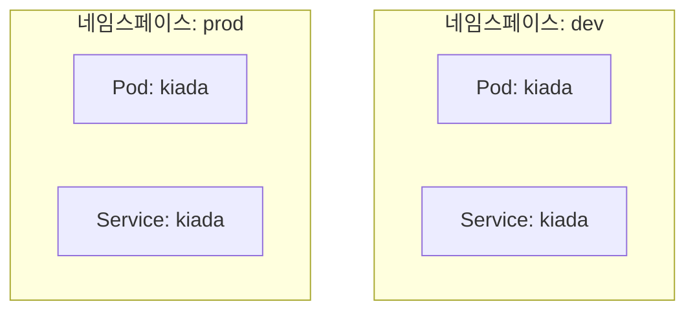
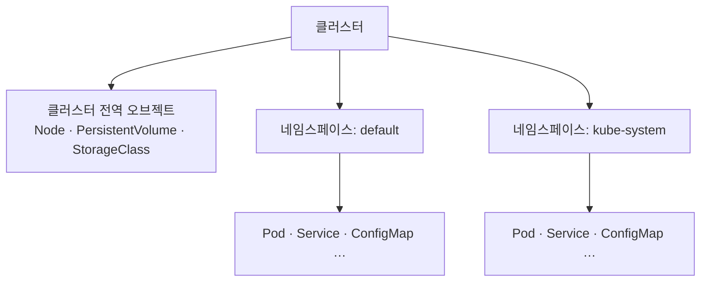
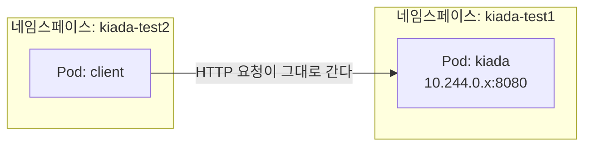
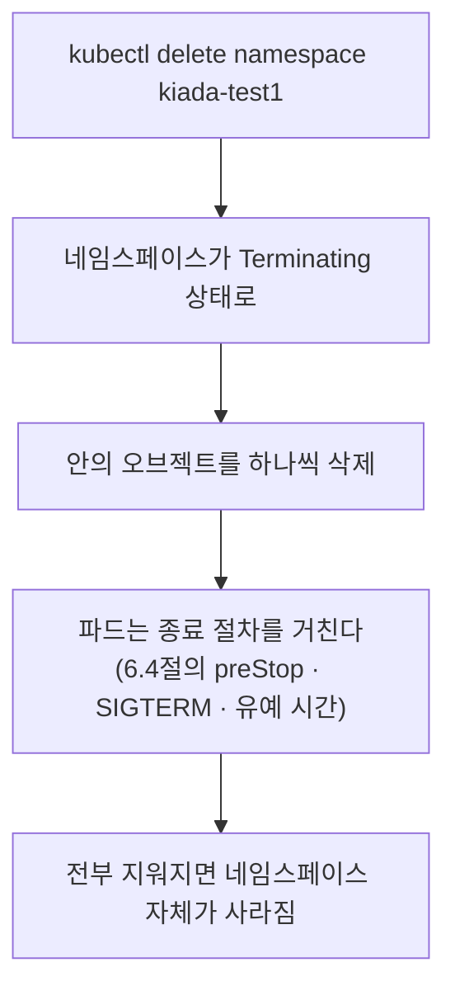

# 7.1 네임스페이스로 오브젝트 나누기

4~6장에서는 파드를 한두 개만 놓고 다뤘습니다. 실제 클러스터에는 파드·서비스·설정이 수백 개씩 들어가고, 팀도 여럿입니다. 그러면 이름이 겹치고, 남의 것을 내 것으로 착각해서 지우는 일이 생깁니다.

이걸 정리하는 첫 번째 도구가 **네임스페이스(Namespace)** 입니다.

## 먼저 — 리눅스 네임스페이스와는 이름만 같습니다

[2.3절](<../02장. 컨테이너 소개/2.3 컨테이너를 가능하게 하는 기술.md>)에서 컨테이너를 격리하는 **리눅스 네임스페이스**를 배웠습니다. 이번 장의 **쿠버네티스 네임스페이스**는 **이름만 같고 완전히 다른 것**입니다. 여기서 헷갈리면 7장 전체가 어긋나므로 먼저 못을 박고 갑니다.

| | 리눅스 네임스페이스 | 쿠버네티스 네임스페이스 |
| :--- | :--- | :--- |
| **누가 만드나** | 리눅스 커널 | 쿠버네티스 API 서버 |
| **무엇을 나누나** | 프로세스가 보는 자원 (PID, 네트워크, 마운트…) | API 오브젝트의 **이름 구역** |
| **격리 강도** | 커널 수준 — 다른 네임스페이스의 프로세스가 **아예 안 보임** | 격리 아님 — 이름만 나뉨 |
| **비유하면** | 방음이 되는 독방 | 서류철에 붙인 **분류 이름표** |
| **공유하는 단위** | **한 파드 안의 컨테이너들** | 해당 없음 |

핵심만 세 줄로 정리하면 이렇습니다.

* 쿠버네티스 네임스페이스는 **커널 격리가 아니라 오브젝트를 묶는 이름 구역**입니다. 폴더에 가깝습니다.
* `dev`와 `prod`로 나눠도 **커널 수준 격리 강도는 똑같습니다.**
* 리눅스 네임스페이스를 공유하는 단위는 오직 **한 파드 안의 컨테이너들**입니다([4.1절](<../04장. 파드로 애플리케이션 실행하기/4.1 파드 이해하기.md>)).

> **가장 흔한 오해.** "네임스페이스를 나눴으니 서로 못 건드리겠지"는 틀렸습니다. 기본 설정에서는 네임스페이스가 달라도 **네트워크로 서로 접근됩니다.** 이 절 뒤쪽에서 직접 확인합니다.

## 네임스페이스가 해 주는 일

### 1) 이름이 겹쳐도 됩니다

[3.2절](<../03장. 쿠버네티스 API와 오브젝트 모델 살펴보기/3.2 오브젝트 매니페스트 구조.md>)에서 "같은 네임스페이스 안에서 같은 종류끼리는 이름이 중복될 수 없다"고 했습니다. 뒤집으면 **네임스페이스가 다르면 같은 이름을 써도 됩니다.**



`dev`의 `kiada` 파드와 `prod`의 `kiada` 파드는 **서로 다른 오브젝트**입니다. 이름이 같아도 충돌하지 않습니다.

### 2) 권한을 나눌 수 있습니다

"A팀은 `team-a` 네임스페이스만 건드릴 수 있다"처럼 권한을 묶어 줄 수 있습니다. 권한 체계(RBAC) 자체는 이 책의 범위 밖이지만, **권한을 거는 단위가 네임스페이스**라는 점은 기억해 두세요.

### 3) 자원 사용량을 제한할 수 있습니다

"이 네임스페이스는 CPU를 몇 개까지만 쓴다" 같은 상한을 걸 수 있습니다(`ResourceQuota`).

### 4) 한 번에 지울 수 있습니다

네임스페이스를 지우면 그 안의 오브젝트가 **전부 함께** 사라집니다. 실습 뒷정리에 아주 편합니다.

## 클러스터에 처음부터 있는 네임스페이스

```bash
kubectl get namespaces
# 짧게 쓰려면: kubectl get ns
```

```
NAME                 STATUS   AGE
default              Active   2m34s
kube-node-lease      Active   2m34s
kube-public          Active   2m34s
kube-system          Active   2m34s
local-path-storage   Active   2m25s
```

| 네임스페이스 | 무엇이 들어 있나 |
| :--- | :--- |
| `default` | 네임스페이스를 지정하지 않았을 때 오브젝트가 들어가는 곳. 지금까지 만든 파드가 전부 여기 있습니다 |
| `kube-system` | 컨트롤 플레인 부품과 시스템 파드. **직접 만들거나 지우지 마세요** |
| `kube-public` | 인증 없이도 읽을 수 있어야 하는 정보를 두는 곳. 실무에서 거의 안 씁니다 |
| `kube-node-lease` | 노드가 "나 살아 있다"를 주기적으로 기록하는 곳. 노드 상태 감지에 쓰입니다 |

> **`local-path-storage`는 표준이 아닙니다.** 쿠버네티스가 기본으로 만드는 것은 위 네 개뿐이고, 이건 **kind가 추가로 만든 것**입니다. 파드에 저장 공간을 붙여 주는 기능을 담당합니다(9~10장에서 다룹니다). 클라우드나 다른 배포판에서는 이 자리에 다른 이름이 보입니다.

[SETUP.md](../SETUP.md)에서 봤던 컨트롤 플레인 부품들이 실제로 어디 있는지 확인해 봅시다.

```bash
kubectl get pods -n kube-system
```

```
NAME                                        READY   STATUS    RESTARTS   AGE
coredns-589f44dc88-jz2nl                    1/1     Running   0          2m24s
coredns-589f44dc88-m5kbn                    1/1     Running   0          2m24s
etcd-kia-control-plane                      1/1     Running   0          2m31s
kindnet-tcmxp                               1/1     Running   0          2m24s
kube-apiserver-kia-control-plane            1/1     Running   0          2m32s
kube-controller-manager-kia-control-plane   1/1     Running   0          2m31s
kube-proxy-d5mmz                            1/1     Running   0          2m24s
kube-scheduler-kia-control-plane            1/1     Running   0          2m31s
```

[1.2절](<../01장. 쿠버네티스 소개/1.2 쿠버네티스 이해하기.md>)에서 그림으로 봤던 부품들이 **전부 파드로** 돌고 있습니다. `etcd`, `kube-apiserver`, `kube-controller-manager`, `kube-scheduler`가 컨트롤 플레인이고, `kube-proxy`와 `kindnet`(네트워크 플러그인)은 노드마다 하나씩 뜹니다. 이름 끝에 노드 이름(`kia-control-plane`)이 붙은 것이 그 노드에 고정된 파드입니다.

## 모든 오브젝트가 네임스페이스에 속하지는 않습니다

[3.1절](<../03장. 쿠버네티스 API와 오브젝트 모델 살펴보기/3.1 쿠버네티스 API 이해하기.md>)에서 `NAMESPACED` 열만 보고 넘어갔던 부분입니다. 이제 제대로 봅니다.

```bash
# 네임스페이스에 속하는 것 (-o name 을 붙이면 이름만 나옵니다)
kubectl api-resources --namespaced=true -o name
```

```
bindings
configmaps
endpoints
events
limitranges
persistentvolumeclaims
pods
podtemplates
replicationcontrollers
resourcequotas
secrets
serviceaccounts
services
controllerrevisions.apps
daemonsets.apps
deployments.apps
replicasets.apps
statefulsets.apps
...                      <- 이 클러스터에서는 모두 33개
```

```bash
# 클러스터 전체에 하나뿐인 것
kubectl api-resources --namespaced=false -o name
```

```
componentstatuses
namespaces
nodes
persistentvolumes
customresourcedefinitions.apiextensions.k8s.io
clusterrolebindings.rbac.authorization.k8s.io
clusterroles.rbac.authorization.k8s.io
ingressclasses.networking.k8s.io
priorityclasses.scheduling.k8s.io
storageclasses.storage.k8s.io
...                      <- 이 클러스터에서는 모두 34개
```

> **개수는 클러스터마다 다릅니다.** CRD로 API를 늘리면(16장) 그만큼 늘어납니다. 위 숫자는 [SETUP.md](../SETUP.md)의 `kia` 클러스터(쿠버네티스 v1.36.1) 기준입니다.

| 구분 | 예 | 왜 그런가 |
| :--- | :--- | :--- |
| **네임스페이스 소속** | Pod, Service, ConfigMap, Secret, Deployment, Job | 팀·환경별로 여러 벌 있어야 하는 것 |
| **클러스터 전역** | Node, Namespace, PersistentVolume, StorageClass, ClusterRole | 클러스터 전체에 하나로 존재해야 하는 것 |



판단 기준은 간단합니다. **"팀마다 따로 있어야 하나?"** 면 네임스페이스 소속, **"클러스터에 하나뿐인 물리적 존재인가?"** 면 전역입니다. 노드는 물리 서버(혹은 컨테이너)라서 `dev`용 노드, `prod`용 노드로 나눠 가질 수 없습니다.

> 네임스페이스 자체도 **클러스터 전역** 오브젝트입니다. 네임스페이스 안에 네임스페이스를 만들 수 없습니다.

## 네임스페이스 만들기

### 명령형

```bash
kubectl create namespace kiada-test1
```

```
namespace/kiada-test1 created
```

### 선언형

```yaml
apiVersion: v1
kind: Namespace
metadata:
  name: kiada-test2
```

```bash
kubectl apply -f namespace.yaml
```

```
namespace/kiada-test2 created
```

[3.1절](<../03장. 쿠버네티스 API와 오브젝트 모델 살펴보기/3.1 쿠버네티스 API 이해하기.md>)에서 다룬 명령형 vs 선언형이 그대로 적용됩니다. 실습 중 잠깐 쓸 것은 명령형, 저장소에 남길 것은 선언형입니다.

### 이름 규칙

네임스페이스 이름은 **DNS 레이블** 규칙을 따릅니다. 이 이름이 나중에 DNS 주소의 일부가 되기 때문입니다(11장에서 다룹니다).

* 소문자 영문, 숫자, 하이픈(`-`)만
* 반드시 영문자나 숫자로 시작하고 끝남
* 최대 63자

```bash
kubectl create namespace kiada_test   # 밑줄 - 실패
kubectl create namespace KiadaTest    # 대문자 - 실패
```

```
The Namespace "kiada_test" is invalid: metadata.name: Invalid value: "kiada_test":
a lowercase RFC 1123 label must consist of lower case alphanumeric characters or '-',
and must start and end with an alphanumeric character
(e.g. 'my-name', or '123-abc',
 regex used for validation is '[a-z0-9]([-a-z0-9]*[a-z0-9])?')
```

에러 메시지가 **규칙 전체를 정규식까지 붙여서** 알려 줍니다. 쿠버네티스 이름 규칙에서 막혔을 때는 이 메시지를 그대로 읽는 것이 가장 빠릅니다.

> **밑줄과 대문자에서 가장 많이 걸립니다.** 프로그래밍 습관대로 `my_namespace`나 `MyNamespace`를 쓰면 거부됩니다. `my-namespace`로 쓰세요.

## 다른 네임스페이스의 오브젝트 다루기

### `-n` 으로 지정하기

```bash
kubectl get pods                    # default 만 본다
```

```
No resources found in default namespace.
```

파드를 분명히 만들었는데 안 보입니다. `kiada-test1`에 만들었기 때문입니다.

```bash
kubectl get pods -n kiada-test1     # 지정한 네임스페이스
```

```
NAME    READY   STATUS    RESTARTS   AGE
kiada   1/1     Running   0          2m53s
```

```bash
kubectl get pods -A -o wide         # 전부 (--all-namespaces 와 같음)
```

```
NAMESPACE            NAME                               READY   STATUS    IP           NODE
kiada-test1          kiada                              1/1     Running   10.244.0.5   kia-control-plane
kiada-test2          client                             1/1     Running   10.244.0.6   kia-control-plane
kube-system          coredns-589f44dc88-jz2nl           1/1     Running   10.244.0.3   kia-control-plane
kube-system          etcd-kia-control-plane             1/1     Running   10.89.0.3    kia-control-plane
kube-system          kube-apiserver-kia-control-plane   1/1     Running   10.89.0.3    kia-control-plane
local-path-storage   local-path-provisioner-...         1/1     Running   10.244.0.4   kia-control-plane
...                                                                       (일부만 추림)
```

> **"파드가 사라졌다"의 대부분은 네임스페이스 문제입니다.** 실습 중 파드가 안 보이면 지웠는지 의심하기 전에 `kubectl get pods -A`부터 쳐 보세요.

매니페스트 안에 직접 적을 수도 있습니다.

```yaml
apiVersion: v1
kind: Pod
metadata:
  name: kiada
  namespace: kiada-test1     # 여기
spec:
  containers:
    - name: kiada
      image: luksa/kiada:0.1
```

> **매니페스트의 `namespace`가 `-n` 옵션보다 우선합니다.** 둘이 다르면 kubectl이 에러를 냅니다. 매니페스트에 네임스페이스를 박아 두면 다른 환경에 그대로 쓰기 어려워지므로, **팀에 따라서는 일부러 비워 두고 `-n`으로만 지정**하기도 합니다.

### 기본 네임스페이스 바꾸기

매번 `-n`을 붙이기 번거로우면 컨텍스트의 기본값을 바꿉니다.

```bash
kubectl config set-context --current --namespace=kiada-test1
```

```
Context "kind-kia" modified.
```

```bash
kubectl get pods       # 이제 -n 없이도 kiada-test1 을 본다
```

```
NAME    READY   STATUS    RESTARTS   AGE
kiada   1/1     Running   0          2m54s
```

```bash
kubectl config set-context --current --namespace=default   # 되돌리기
```

```
Context "kind-kia" modified.
```

> **이 설정을 해 놓고 잊어버리는 사고가 잦습니다.** 한참 뒤에 `kubectl delete pod --all`을 쳤는데 엉뚱한 네임스페이스가 지워지는 식입니다. 현재 기본값은 `kubectl config view --minify | Select-String namespace`로 확인할 수 있습니다.

## 네임스페이스는 격리(isolation)가 아닙니다

이 절에서 가장 중요한 부분입니다.

### 나뉘는 것과 나뉘지 않는 것

| | 네임스페이스로 나뉘나 |
| :--- | :--- |
| 오브젝트 이름 | ✅ 나뉨 |
| `kubectl get` 의 기본 조회 범위 | ✅ 나뉨 |
| 권한(RBAC), 자원 할당량 | ✅ 나뉨 |
| **파드 사이의 네트워크** | ❌ **안 나뉨** — 기본적으로 서로 통신됨 |
| **파드가 배치되는 노드** | ❌ 안 나뉨 — 같은 노드에 섞여 뜸 |
| **커널 수준 격리** | ❌ 안 나뉨 — 컨테이너 격리와 무관 |

### 직접 확인하기

`kiada-test1`의 파드 IP를 알아낸 뒤, **다른 네임스페이스**인 `kiada-test2`의 파드에서 접속해 봅니다.

```bash
kubectl get pod kiada -n kiada-test1 -o jsonpath='{.status.podIP}'
```

```
10.244.0.5
```

```bash
kubectl exec client -n kiada-test2 -- wget -qO- http://10.244.0.5:8080
```

```
Kiada version 0.1. Request processed by "kiada". Client IP: ::ffff:10.244.0.6
```



응답이 돌아옵니다. **네임스페이스가 달라도 파드 IP만 알면 그냥 접속됩니다.** 방화벽도, 인증도, 경고도 없습니다.

응답 끝의 `Client IP: ::ffff:10.244.0.6`을 보세요. `kiada-test2`에 있는 `client` 파드의 IP입니다. 요청이 **다른 네임스페이스에서 왔다는 사실조차 서버 쪽에서는 구별되지 않습니다.** 그냥 같은 네트워크 안의 이웃일 뿐입니다.

파드들이 실제로 같은 노드에 섞여 있다는 것도 확인할 수 있습니다.

```bash
kubectl get pods -A -o custom-columns=NS:.metadata.namespace,NAME:.metadata.name,NODE:.spec.nodeName
```

```
NS                   NAME                               NODE
kiada-test1          kiada                              kia-control-plane
kiada-test2          client                             kia-control-plane
kube-system          coredns-589f44dc88-jz2nl           kia-control-plane
kube-system          kube-apiserver-kia-control-plane   kia-control-plane
local-path-storage   local-path-provisioner-...         kia-control-plane
...                                                     (일부만 추림)
```

`NODE` 열이 전부 같습니다. 네임스페이스가 셋으로 나뉘어 있어도 **파드들은 같은 노드, 같은 리눅스 커널 위에서 나란히** 돌고 있습니다. (이 클러스터는 노드가 하나라 당연한 결과이기도 하지만, 노드가 여럿이어도 네임스페이스는 배치에 영향을 주지 않습니다.)

### 막으려면 NetworkPolicy가 필요합니다

네트워크를 실제로 막으려면 **NetworkPolicy**라는 별도 오브젝트를 만들어야 합니다. 그리고 NetworkPolicy는 **네트워크 플러그인(CNI)이 지원해야** 동작합니다. 지원하지 않는 플러그인에서는 오브젝트를 만들어도 아무 일도 일어나지 않습니다.

> **조용히 실패하는 종류의 함정입니다.** NetworkPolicy를 만들었는데 여전히 통신이 된다면, 문법이 틀린 게 아니라 **플러그인이 지원하지 않는 것**일 수 있습니다. kind 기본 CNI(kindnet)는 NetworkPolicy를 지원하지 않습니다.

## 네임스페이스 삭제하기

```bash
kubectl delete namespace kiada-test1
```

```
namespace "kiada-test1" deleted
```

```bash
kubectl get pods -n kiada-test1     # 안에 있던 파드도 함께 사라졌다
```

```
No resources found in kiada-test1 namespace.
```

안에 있던 파드·서비스·설정이 **전부 함께** 사라집니다.



파드가 사라지는 과정은 [6.4절](<../06장. 파드 생명주기와 컨테이너 상태 관리/6.4 파드 생명주기 이해하기.md>)에서 배운 그대로입니다. 그래서 파드가 많으면 삭제에 시간이 걸립니다.

> **되돌릴 수 없습니다.** `kubectl delete namespace prod`를 잘못 치면 그 안의 모든 것이 사라집니다. 실무에서 가장 무서운 명령 중 하나입니다.

> **`Terminating`에서 멈춰 있는 경우.** 네임스페이스에 **파이널라이저(finalizer)** 가 걸려 있으면, 정리 작업이 끝날 때까지 `Terminating` 상태로 남습니다. 대개는 기다리면 풀립니다. 억지로 파이널라이저를 지우면 뒷정리가 안 된 찌꺼기가 남을 수 있으므로, 원인을 먼저 확인하세요.

## 요약 및 비유

| 개념 | 학교 교실 비유 | 기술적 의미 |
| :--- | :--- | :--- |
| **네임스페이스** | 1반, 2반 | 오브젝트를 묶는 이름 구역 |
| **이름 중복 허용** | 1반 김민준과 2반 김민준 | 네임스페이스가 다르면 같은 이름 가능 |
| **`-n` 옵션** | "2반 김민준이요" | 어느 구역을 볼지 지정 |
| **기본 네임스페이스** | 우리 반이 기본 | 컨텍스트에 저장된 기본 조회 대상 |
| **격리가 아님** | 반이 달라도 쉬는 시간에 만난다 | 네트워크는 기본적으로 서로 통함 |
| **NetworkPolicy** | 반끼리 못 오가게 막는 규칙 | 통신을 실제로 차단하는 별도 오브젝트 |
| **클러스터 전역 오브젝트** | 운동장, 급식실 | 학교에 하나뿐이라 반별로 못 나눔 |
| **네임스페이스 삭제** | 반 자체를 없앰 | 안의 오브젝트가 전부 함께 삭제 |

## 결론

* 네임스페이스는 **오브젝트를 묶는 이름 구역**입니다. 리눅스 네임스페이스와 이름만 같고, **커널 격리와는 무관**합니다.
* 네임스페이스가 다르면 **같은 이름을 써도 됩니다.** 대신 조회할 때 `-n`으로 어디를 볼지 알려 줘야 합니다.
* **모든 오브젝트가 네임스페이스에 속하지는 않습니다.** 노드·PersistentVolume처럼 클러스터에 하나뿐인 것은 전역입니다. `kubectl api-resources --namespaced=false`로 확인합니다.
* **네임스페이스는 방화벽이 아닙니다.** 기본 설정에서 다른 네임스페이스의 파드에 IP로 그냥 접속됩니다. 막으려면 NetworkPolicy와 이를 지원하는 CNI가 필요합니다.
* 네임스페이스를 지우면 **안의 모든 것이 함께** 사라집니다. 실습 뒷정리에는 편하지만 실무에서는 위험한 명령입니다.

## 공식 문서 업데이트 (2026년 8월 기준)

* **네임스페이스에는 이름과 같은 레이블이 자동으로 붙습니다.** 요즘 쿠버네티스는 네임스페이스를 만들 때 `kubernetes.io/metadata.name: <이름>` 레이블을 자동으로 추가합니다. 덕분에 NetworkPolicy 등에서 네임스페이스를 **레이블로 고를 수 있습니다**(레이블 셀렉터는 [7.3절](<7.3 레이블 셀렉터로 오브젝트 걸러 내기.md>)에서 다룹니다). 책이 쓰이던 시절에는 직접 레이블을 붙여야 했습니다.
  ```bash
  kubectl get namespace default --show-labels
  ```
* **네임스페이스 레이블로 파드 보안 수준을 정합니다.** 예전의 PodSecurityPolicy는 제거되었고, 지금은 **Pod Security Admission**이 그 자리를 대신합니다. 설정 방법이 특이한데, 네임스페이스에 레이블을 붙이는 것입니다.
  ```yaml
  apiVersion: v1
  kind: Namespace
  metadata:
    name: secure-ns
    labels:
      pod-security.kubernetes.io/enforce: restricted   # privileged | baseline | restricted
  ```
  네임스페이스가 단순한 이름표를 넘어 **정책의 단위**로도 쓰인다는 뜻입니다.
* 참고: <https://kubernetes.io/docs/concepts/overview/working-with-objects/namespaces/>
* 참고: <https://kubernetes.io/docs/concepts/security/pod-security-admission/>
