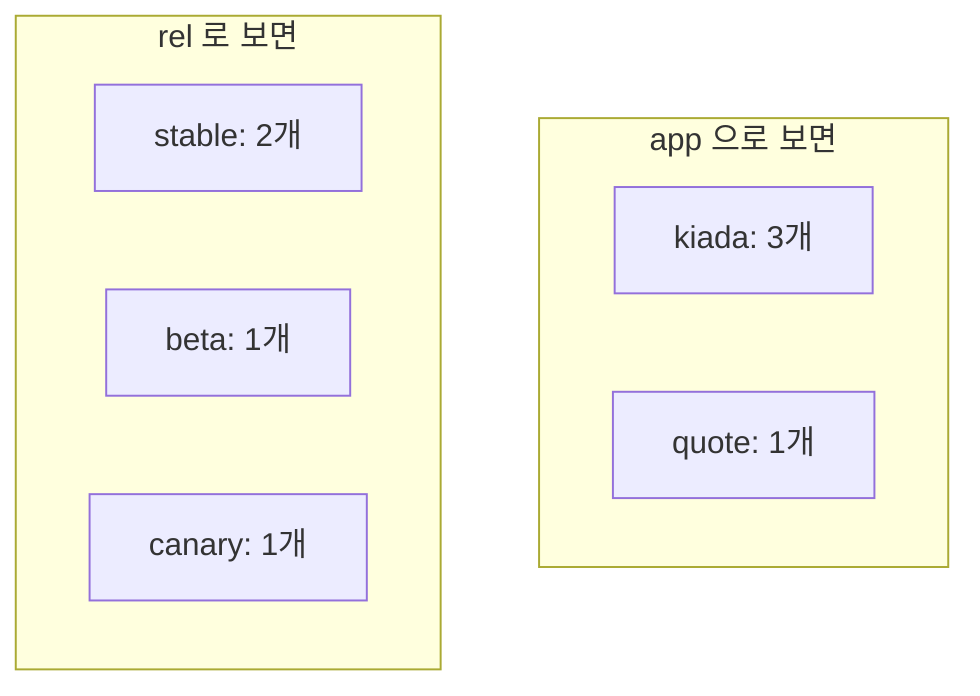
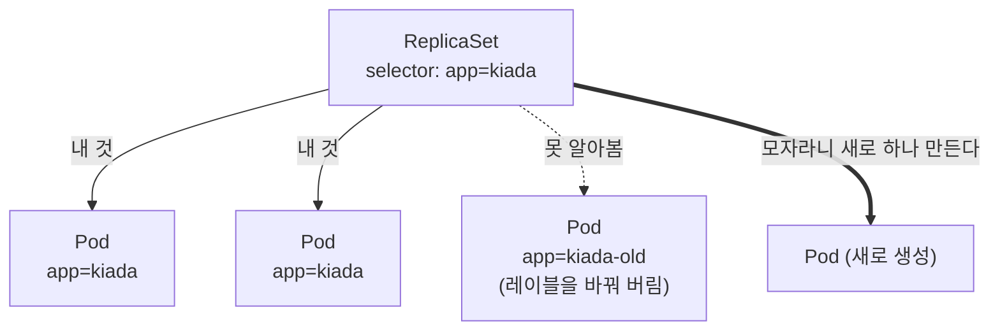

# 7.2 레이블로 파드 정리하기

네임스페이스는 **큰 칸막이**입니다. 그런데 칸막이 하나 안에 파드가 50개 있으면 어떻게 할까요? `kiada` 앱이 안정 버전·베타·카나리로 나뉘어 돌고 있고, 옆에는 `quote` 앱도 있습니다.

여기서 필요한 것이 **레이블(Label)** 입니다.

## 이름만으로는 부족합니다

이름에 규칙을 넣어 보는 방법을 먼저 생각해 봅시다.

```
kiada-stable-1
kiada-stable-2
kiada-beta-1
quote-stable-1
```

처음에는 괜찮아 보이지만 금방 무너집니다.

* "안정 버전 파드만 골라 줘" → 이름 문자열을 잘라서 판단해야 합니다
* "버전 0.1인 것만" → 이름에 버전도 넣어야 하고, 그러면 이름이 끝없이 길어집니다
* 분류 기준이 하나 늘 때마다 **이름 규칙 전체를 다시 만들어야** 합니다

이름은 **하나의 축**밖에 표현하지 못합니다. 실제로는 여러 축이 동시에 필요합니다.

## 레이블은 키/값 쌍입니다

레이블은 오브젝트에 붙이는 **키/값 쌍(key/value pair)** 이고, **한 오브젝트에 여러 개** 붙일 수 있습니다.

| 파드 이름 | `app` | `rel` | `ver` |
| :--- | :--- | :--- | :--- |
| `kiada-stable` | `kiada` | `stable` | `0.1` |
| `kiada-beta` | `kiada` | `beta` | `0.2` |
| `kiada-canary` | `kiada` | `canary` | — |
| `quote` | `quote` | `stable` | — |

이제 "안정 버전만", "kiada 앱만", "kiada 앱의 베타만" 을 **각각 다른 축으로** 고를 수 있습니다. 이름은 하나뿐이지만 레이블은 여러 개니까요.



**같은 파드 4개를 두 가지 방식으로 나눠 본 것**입니다. 레이블을 하나 더 붙이면 나누는 방식이 하나 더 생깁니다.

> 레이블은 **오브젝트 종류를 가리지 않습니다.** 파드뿐 아니라 서비스·노드·네임스페이스에도 똑같이 붙습니다.

## 매니페스트에 레이블 붙이기

`metadata.labels` 아래에 적습니다. [3.2절](<../03장. 쿠버네티스 API와 오브젝트 모델 살펴보기/3.2 오브젝트 매니페스트 구조.md>)에서 자리만 보고 넘어갔던 그 필드입니다.

```yaml
apiVersion: v1
kind: Pod
metadata:
  name: kiada-stable
  labels:
    app: kiada
    rel: stable
    ver: "0.1"
spec:
  containers:
    - name: kiada
      image: luksa/kiada:0.1
```

> **`ver: "0.1"` 의 따옴표에 주의하세요.** 레이블 값은 **반드시 문자열**이어야 합니다. 따옴표를 빼면 YAML이 `0.1`을 숫자로 읽어서 거부당합니다. `ver: 1` 처럼 정수도 마찬가지입니다. [1.0절](<../01장. 쿠버네티스 소개/1.0 쿠버네티스를 배우기 전에.md>)의 YAML 문법에서 다룬 함정이 여기서 실제로 걸립니다.

## 이미 만들어진 오브젝트에 붙이기

```bash
kubectl label pod quote env=test          # 추가
```

```
pod/quote labeled
```

```bash
kubectl label pod quote env=prod          # 이미 있는 키를 바꾸려 하면
```

```
error: 'env' already has a value (test), and --overwrite is false
```

```bash
kubectl label pod quote env=prod --overwrite
```

```
pod/quote labeled
```

```bash
kubectl label pod quote env-              # 제거 - 키 뒤에 빼기 기호
```

```
pod/quote unlabeled
```

성공했을 때 `labeled`, 지웠을 때 `unlabeled`로 메시지가 달라집니다.

> **`--overwrite`를 요구하는 것은 안전장치입니다.** 레이블을 잘못 덮어쓰면 컨트롤러가 파드를 놓치는 사고로 이어지기 때문입니다(아래 "레이블을 함부로 바꾸면" 참고).

여러 오브젝트에 한 번에 붙일 수도 있습니다.

```bash
kubectl label pods --all env=test        # 네임스페이스의 모든 파드에
kubectl label pod kiada-beta kiada-canary track=next   # 여러 개 지정
```

## 레이블 보기

```bash
kubectl get pods --show-labels            # 레이블을 전부 한 열에
```

```
NAME           READY   STATUS    RESTARTS   AGE   LABELS
kiada-beta     1/1     Running   0          15s   app=kiada,rel=beta,ver=0.2
kiada-canary   1/1     Running   0          15s   app=kiada,rel=canary
kiada-stable   1/1     Running   0          15s   app=kiada,rel=stable,ver=0.1
quote          1/1     Running   0          15s   app=quote,rel=stable
```

```bash
kubectl get pods -L app,rel,ver           # 특정 레이블만 따로 열로 (-L, 대문자)
```

```
NAME           READY   STATUS    RESTARTS   AGE   APP     REL      VER
kiada-beta     1/1     Running   0          15s   kiada   beta     0.2
kiada-canary   1/1     Running   0          15s   kiada   canary
kiada-stable   1/1     Running   0          15s   kiada   stable   0.1
quote          1/1     Running   0          15s   quote   stable
```

`kiada-canary`와 `quote`의 `VER` 칸이 비어 있습니다. **레이블이 없으면 빈칸**으로 나옵니다.

| 옵션 | 언제 쓰나 |
| :--- | :--- |
| `--show-labels` | 어떤 레이블이 붙어 있는지 **탐색**할 때 |
| `-L <키>` | 관심 있는 축만 **표로 정리해서 볼 때** |

`-L`은 레이블이 많을 때 특히 유용합니다. `--show-labels`는 시스템 파드처럼 레이블이 열 개씩 붙은 경우 화면이 무너집니다.

## 레이블 문법 규칙

레이블은 아무 문자열이나 되는 게 아닙니다. 규칙이 꽤 깐깐합니다.

### 키의 구조

키는 **선택적인 접두사 + 이름** 으로 되어 있고, 둘은 슬래시(`/`)로 나눕니다.

```
app.kubernetes.io/name
+----------------+ +--+
      접두사       이름
```

| 부분 | 규칙 |
| :--- | :--- |
| **접두사(prefix)** | 생략 가능. DNS 서브도메인 형식(`example.com` 같은 점 찍힌 이름), 최대 253자 |
| **이름(name)** | 필수. 최대 63자. 영문자·숫자로 시작하고 끝나야 하며, 중간에 `-`, `_`, `.` 사용 가능 |
| **값(value)** | 최대 63자. 규칙은 이름과 같음. **비어 있어도 됩니다** |

```bash
# 63자를 넘으면 거부된다 (a 를 70개)
kubectl label pod quote toolong=aaaaaaaaaaaaaaaaaaaa...
```

```
error: invalid label value: "toolong=aaaaaa...": must be no more than 63 bytes
```

> **"63자"가 아니라 "63바이트"입니다.** 영문·숫자는 한 글자가 1바이트라 63자와 같지만, **한글은 한 글자가 3바이트**입니다. 즉 한글로는 **21자**밖에 못 넣습니다. 레이블 값에 한글을 쓰는 일은 드물지만, 넣었는데 갑자기 거부당한다면 이 때문입니다.

> **접두사는 "누가 만든 레이블인가"를 나타냅니다.** 접두사가 없는 레이블(`app`, `rel`)은 **사용자가 자유롭게 쓰는 것**이고, 접두사가 있는 레이블은 대개 **도구나 쿠버네티스 자신이 붙인 것**입니다.

> **`kubernetes.io/`와 `k8s.io/` 접두사는 쿠버네티스가 예약해 두었습니다.** 직접 만들어 붙이지 마세요. 자기 조직 이름(`mycompany.com/team`)을 쓰는 편이 안전합니다.

### 값이 비어 있어도 되는 이유

```yaml
labels:
  gpu: ""
```

"이 오브젝트에는 `gpu`라는 표시가 있다"는 사실 자체만 필요할 때가 있습니다. 값 없이 **존재 여부만** 가지고 고르는 방법은 [7.3절](<7.3 레이블 셀렉터로 오브젝트 걸러 내기.md>)에서 다룹니다.

## 표준 레이블 — `app.kubernetes.io/`

레이블 이름을 각자 마음대로 지으면, 팀마다 `app` / `application` / `service` / `svc`로 제각각이 됩니다. 그래서 쿠버네티스는 **권장 레이블(recommended labels)** 을 정해 두었습니다.

| 키 | 뜻 | 예 |
| :--- | :--- | :--- |
| `app.kubernetes.io/name` | 애플리케이션 이름 | `kiada` |
| `app.kubernetes.io/instance` | 같은 앱을 여러 벌 띄웠을 때 그 중 하나 | `kiada-prod` |
| `app.kubernetes.io/version` | 버전 | `0.1` |
| `app.kubernetes.io/component` | 전체에서 맡은 역할 | `frontend`, `database` |
| `app.kubernetes.io/part-of` | 어떤 큰 시스템의 일부인가 | `kiada-suite` |
| `app.kubernetes.io/managed-by` | 무엇이 이 오브젝트를 관리하나 | `helm`, `kubectl` |

```yaml
metadata:
  name: kiada-stable
  labels:
    app.kubernetes.io/name: kiada
    app.kubernetes.io/version: "0.1"
    app.kubernetes.io/component: frontend
    app.kubernetes.io/part-of: kiada-suite
```

**꼭 써야 하는 것은 아닙니다.** 다만 모니터링 도구나 대시보드가 이 키들을 보고 화면을 구성하는 경우가 많아서, 맞춰 두면 공짜로 얻는 것이 생깁니다.

> **학습용 예제에서는 짧은 이름(`app`, `rel`)을 씁니다.** 이 책과 이 노트도 그렇습니다. 실무 프로젝트를 시작할 때는 표준 키를 쓰는 편이 낫습니다.

## 노드에도 레이블이 있습니다

레이블은 파드만의 것이 아닙니다.

```bash
kubectl get nodes --show-labels
```

```
NAME                STATUS   ROLES           AGE     VERSION   LABELS
kia-control-plane   Ready    control-plane   5m47s   v1.36.1   beta.kubernetes.io/arch=amd64,
                                                              beta.kubernetes.io/os=linux,
                                                              ingress-ready=true,
                                                              kubernetes.io/arch=amd64,
                                                              kubernetes.io/hostname=kia-control-plane,
                                                              kubernetes.io/os=linux,
                                                              node-role.kubernetes.io/control-plane=
```
(실제로는 한 줄로 나오지만 읽기 쉽게 줄을 나눴습니다.)

여기서 두 가지를 짚고 갑니다.

* **`node-role.kubernetes.io/control-plane=`** — 등호 뒤가 비어 있습니다. 앞에서 말한 **값이 빈 레이블**의 실제 사례입니다. "이 노드는 컨트롤 플레인이다"라는 사실 자체만 표시하면 되니까요.
* **`ingress-ready=true`** — 쿠버네티스가 붙인 게 아니라 [SETUP.md](../SETUP.md)의 `kind-config.yaml`에서 **우리가 붙여 둔 것**입니다. 12~13장 인그레스 실습에서 쓰입니다.

노드에는 운영체제·아키텍처·호스트 이름 등이 처음부터 레이블로 붙어 있습니다. 여기에 직접 레이블을 더할 수도 있습니다.

```bash
kubectl label node kia-control-plane disk=ssd
```

```
node/kia-control-plane labeled
```

이렇게 붙인 노드 레이블은 **"이 파드는 SSD가 달린 노드에서만 실행해"** 같은 지시에 쓰입니다. 그 방법은 [7.3절](<7.3 레이블 셀렉터로 오브젝트 걸러 내기.md>)에서 다룹니다.

## 레이블을 함부로 바꾸면

지금은 파드를 직접 만들고 있어서 레이블을 바꿔도 별일이 없습니다. 하지만 앞으로 배울 **컨트롤러**들은 레이블로 자기가 관리할 파드를 찾습니다.



파드의 레이블을 바꾸면 컨트롤러가 **그 파드를 잃어버립니다.** 개수가 모자란다고 판단해서 새 파드를 하나 더 만들고, 레이블을 바꾼 파드는 아무도 관리하지 않는 상태로 남습니다.

이 성질은 사고이기도 하고 **디버깅 기법**이기도 합니다. 문제가 생긴 파드의 레이블을 일부러 바꿔서 컨트롤러의 관리 밖으로 빼내면, 서비스에서는 제외되면서 파드는 살아 있어서 안을 들여다볼 수 있습니다. 자세한 내용은 14장(레플리카셋)에서 다룹니다.

## 요약 및 비유

| 개념 | 옷장 정리 비유 | 기술적 의미 |
| :--- | :--- | :--- |
| **이름** | 옷에 적은 고유 번호 | 오브젝트를 하나로 지목하는 식별자 |
| **레이블** | 옷에 붙인 여러 태그 (계절 / 색 / 용도) | 오브젝트에 붙이는 키/값 쌍, 여러 개 가능 |
| **키/값** | "계절: 여름" | `rel: stable` |
| **여러 축 분류** | 같은 옷을 계절로도, 색으로도 찾기 | 레이블마다 다른 분류 기준이 생김 |
| **`--overwrite`** | 태그를 바꿔 붙이려면 한 번 더 확인 | 실수로 덮어쓰는 것을 막는 안전장치 |
| **빈 값 레이블** | "세탁 주의" 라고만 붙인 태그 | 존재 자체가 의미인 레이블 |
| **표준 레이블** | 가게에서 통일해 쓰는 태그 양식 | `app.kubernetes.io/*` 권장 키 |
| **레이블을 바꾸면** | 태그를 떼면 그 서랍에서 사라짐 | 컨트롤러가 파드를 놓친다 |

## 결론

* 이름은 축이 하나뿐이지만 **레이블은 축을 여러 개** 만들 수 있습니다. 같은 파드 묶음을 앱별·버전별·환경별로 동시에 나눠 볼 수 있습니다.
* 레이블은 `metadata.labels`에 적거나 `kubectl label`로 나중에 붙입니다. **덮어쓸 때는 `--overwrite`**, 지울 때는 **`키-`** 입니다.
* 키는 `접두사/이름` 구조이고 **이름과 값은 각각 63자**까지입니다. `kubernetes.io/` 접두사는 예약되어 있으니 직접 쓰지 마세요.
* YAML에서 **값은 반드시 문자열**입니다. `ver: "0.1"`처럼 따옴표를 씌우세요.
* 레이블은 파드뿐 아니라 **노드에도** 붙습니다. 이것이 파드를 특정 노드로 보내는 열쇠가 됩니다.
* 레이블을 바꾸면 **컨트롤러가 파드를 잃어버립니다.** 사고의 원인이자 유용한 디버깅 기법입니다(14장).
