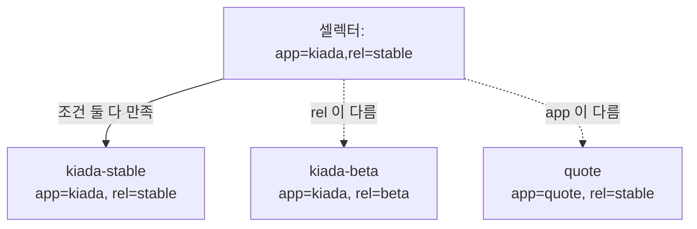
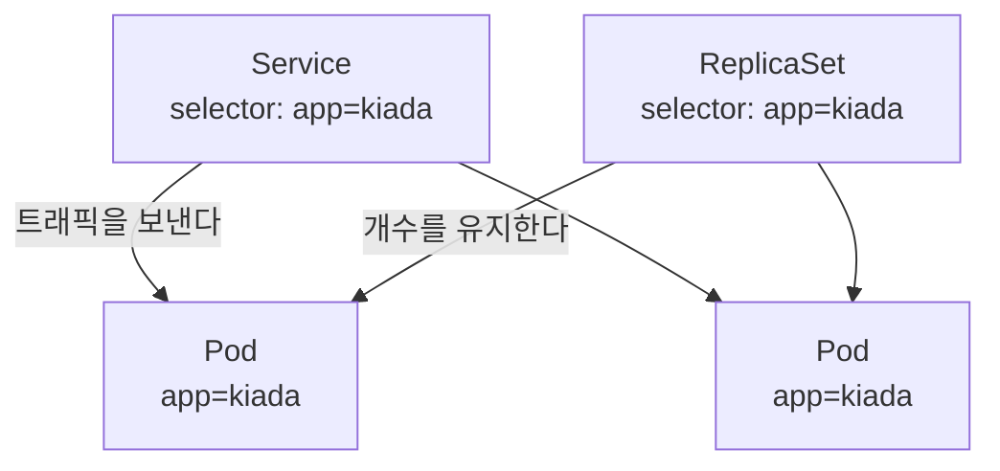

# 7.3 레이블 셀렉터로 오브젝트 걸러 내기

[7.2절](<7.2 레이블로 파드 정리하기.md>)에서 파드에 레이블을 붙였습니다. 붙이기만 해서는 아무 쓸모가 없습니다. **붙인 레이블로 골라내는 것**이 진짜 목적입니다.

그 조건식을 **레이블 셀렉터(Label Selector)** 라고 합니다.

## 셀렉터는 두 갈래입니다

| 갈래 | 연산자 | 묻는 것 |
| :--- | :--- | :--- |
| **등식 기반(equality-based)** | `=`, `==`, `!=` | 값이 무엇인가 |
| **집합 기반(set-based)** | `in`, `notin`, `키`, `!키` | 값이 어느 무리에 속하나 / 키가 있나 |

`=`와 `==`는 **완전히 같습니다.** 취향 차이일 뿐입니다.

## 등식 기반 셀렉터

실습에 쓰는 파드 4개는 이렇게 생겼습니다.

```
NAME           LABELS
kiada-beta     app=kiada,rel=beta,ver=0.2
kiada-canary   app=kiada,rel=canary
kiada-stable   app=kiada,rel=stable,ver=0.1
quote          app=quote,rel=stable
```

```bash
kubectl get pods -l app=kiada             # app 이 kiada 인 것
```

```
NAME           READY   STATUS    RESTARTS   AGE
kiada-beta     1/1     Running   0          16s
kiada-canary   1/1     Running   0          16s
kiada-stable   1/1     Running   0          16s
```

```bash
kubectl get pods -l app!=kiada            # app 이 kiada 가 아닌 것
```

```
NAME    READY   STATUS    RESTARTS   AGE
quote   1/1     Running   0          16s
```

> **`!=`에는 "레이블이 아예 없는 오브젝트"도 포함됩니다.** `app!=kiada`는 "app이 다른 값인 것"뿐 아니라 **"app 레이블 자체가 없는 것"** 도 함께 골라냅니다. 시스템 파드가 잔뜩 딸려 나와서 당황하는 지점입니다.

## 집합 기반 셀렉터

```bash
kubectl get pods -l 'rel in (beta,canary)'    # beta 이거나 canary
```

```
NAME           READY   STATUS    RESTARTS   AGE
kiada-beta     1/1     Running   0          17s
kiada-canary   1/1     Running   0          17s
```

```bash
kubectl get pods -l 'rel notin (stable)'      # stable 이 아닌 것
```

```
NAME           READY   STATUS    RESTARTS   AGE
kiada-beta     1/1     Running   0          17s
kiada-canary   1/1     Running   0          17s
```

```bash
kubectl get pods -l ver                       # ver 레이블이 있는 것
```

```
NAME           READY   STATUS    RESTARTS   AGE
kiada-beta     1/1     Running   0          17s
kiada-stable   1/1     Running   0          17s
```

```bash
kubectl get pods -l '!ver'                    # ver 레이블이 없는 것
```

```
NAME           READY   STATUS    RESTARTS   AGE
kiada-canary   1/1     Running   0          17s
quote          1/1     Running   0          17s
```

> **`in`과 `notin`이 서로 정확한 반대는 아닙니다.** 위에서 `rel notin (stable)`의 결과가 `rel in (beta,canary)`와 같아 보이지만, 그건 이 클러스터에 `rel` 값이 세 종류뿐이라 그런 것입니다. **`rel` 레이블이 아예 없는 파드가 있었다면 `notin` 쪽에 함께 나옵니다.** `!=`와 같은 함정입니다.

> **따옴표를 꼭 씌우세요.** 괄호 `()`, 느낌표 `!`, 공백은 셸이 먼저 가로챕니다. 특히 bash에서 따옴표 없는 `!ver`는 명령 기록 치환으로 해석되어 엉뚱한 에러가 납니다. PowerShell에서도 작은따옴표로 감싸는 습관을 들이세요.

## 여러 조건 묶기 — AND만 있습니다

쉼표로 이으면 **모두 만족**하는 것을 고릅니다.

```bash
# app 이 kiada 이면서 동시에 rel 이 stable 인 것
kubectl get pods -l app=kiada,rel=stable
```

```
NAME           READY   STATUS    RESTARTS   AGE
kiada-stable   1/1     Running   0          17s
```



> **OR 연산자는 없습니다.** "app이 kiada **이거나** quote인 것"을 쉼표로는 표현할 수 없습니다. 이럴 때 쓰는 것이 집합 기반 셀렉터입니다.
> ```bash
> kubectl get pods -l 'app in (kiada,quote)'
> ```
> `in`은 사실상 **한 키 안에서의 OR**입니다. 서로 다른 키를 OR로 묶는 방법은 없으니, 두 번 조회해서 합치거나 레이블 설계를 바꿔야 합니다.

## 셀렉터를 kubectl에서 쓰는 요령

### 고른 결과를 표로 정리해서 보기

`-l`(고르기)과 `-L`(열로 보여 주기)을 같이 쓰면 읽기 좋습니다.

```bash
kubectl get pods -l app=kiada -L rel,ver
```

```
NAME           READY   STATUS    RESTARTS   AGE   REL      VER
kiada-beta     1/1     Running   0          17s   beta     0.2
kiada-canary   1/1     Running   0          17s   canary
kiada-stable   1/1     Running   0          17s   stable   0.1
```

### 한 번에 여러 종류의 오브젝트

```bash
kubectl get all -l app=kiada
```

앱 하나에 딸린 파드·서비스·컨트롤러를 한눈에 볼 때 씁니다. 다만 `all`은 정말 모든 종류가 아니라 **자주 쓰는 몇 종류**만 가리킵니다. ConfigMap이나 Secret은 빠집니다.

### 골라서 지우기

```bash
kubectl delete pods -l rel=canary
```

> **셀렉터로 지우는 것은 편한 만큼 위험합니다.** 셀렉터를 넓게 잡으면 의도보다 훨씬 많이 지워집니다. 지우기 전에 **같은 셀렉터로 `get`을 먼저 돌려서** 무엇이 걸리는지 눈으로 확인하는 습관을 들이세요.
> ```bash
> kubectl get pods -l rel=canary      # 먼저 확인
> kubectl delete pods -l rel=canary   # 그다음 삭제
> ```

### `=` 와 `==` 는 정말 같습니다

공백을 넣어도 됩니다.

```bash
kubectl get pods -l 'rel == stable'
```

```
NAME           READY   STATUS    RESTARTS   AGE
kiada-stable   1/1     Running   0          17s
quote          1/1     Running   0          17s
```

`rel=stable`과 결과가 같습니다. 셀렉터 문자열은 등호 앞뒤 공백을 알아서 무시합니다. 다만 **공백이 들어가면 셸이 인자를 쪼개므로 따옴표는 반드시 필요합니다.**

## 매니페스트 안에서 쓰는 셀렉터

지금까지는 사람이 kubectl에 셀렉터를 넣었습니다. 더 중요한 쓰임은 **오브젝트가 다른 오브젝트를 고를 때**입니다. 이것이 쿠버네티스가 부품을 엮는 기본 방식입니다.



* **서비스(Service)** 는 셀렉터로 "어느 파드에게 트래픽을 보낼지" 정합니다 → 11장
* **레플리카셋(ReplicaSet)** 은 셀렉터로 "어느 파드의 개수를 유지할지" 정합니다 → 14장
* **디플로이먼트(Deployment)** 도 마찬가지입니다 → 15장

파드는 자기가 어느 서비스에 속하는지 모릅니다. **서비스 쪽이 레이블을 보고 파드를 데려가는** 구조입니다. 방향을 거꾸로 이해하면 계속 헷갈립니다.

### `matchLabels` 와 `matchExpressions`

매니페스트에서는 두 가지 형식을 씁니다.

```yaml
selector:
  matchLabels:            # 등식 기반 - 간단할 때
    app: kiada
    rel: stable
```

```yaml
selector:
  matchExpressions:       # 집합 기반 - 복잡할 때
    - key: app
      operator: In
      values: [kiada, quote]
    - key: rel
      operator: NotIn
      values: [canary]
```

| `operator` | 뜻 | `values` |
| :--- | :--- | :--- |
| `In` | 값이 목록 안에 있음 | 필요 |
| `NotIn` | 값이 목록 안에 없음 | 필요 |
| `Exists` | 키가 존재함 | **쓰지 않음** |
| `DoesNotExist` | 키가 없음 | **쓰지 않음** |

둘을 함께 적으면 **모두 만족**해야 합니다(AND).

> **컨트롤러의 셀렉터는 대부분 나중에 바꿀 수 없습니다.** 만든 뒤에 고치려 하면 거부됩니다. 이미 관리 중이던 파드를 통째로 놓쳐 버리는 사고를 막기 위해서입니다. 바꿔야 한다면 오브젝트를 새로 만드는 수밖에 없습니다(15장에서 다시 다룹니다).

## 파드를 특정 노드로 보내기 — `nodeSelector`

[7.2절](<7.2 레이블로 파드 정리하기.md>)에서 노드에도 레이블이 붙는다고 했습니다. 파드의 `spec.nodeSelector`에 조건을 적으면, **그 레이블을 가진 노드에만** 파드가 배치됩니다.

```bash
kubectl label node kia-control-plane disk=ssd
```

```
node/kia-control-plane labeled
```

```yaml
apiVersion: v1
kind: Pod
metadata:
  name: kiada-ssd
spec:
  nodeSelector:
    disk: ssd          # disk=ssd 레이블이 있는 노드에만
  containers:
    - name: kiada
      image: luksa/kiada:0.1
```

```bash
kubectl get pod kiada-ssd -o wide
```

```
NAME        READY   STATUS    RESTARTS   AGE   IP            NODE
kiada-ssd   1/1     Running   0          15s   10.244.0.11   kia-control-plane
```

### 조건에 맞는 노드가 없으면 어떻게 되나

없는 레이블을 요구해 봅시다.

```yaml
spec:
  nodeSelector:
    gpu: "true"        # 이런 레이블이 붙은 노드가 없다
```

```bash
kubectl get pod kiada-gpu
```

```
NAME        READY   STATUS    RESTARTS   AGE
kiada-gpu   0/1     Pending   0          15s
```

```bash
kubectl describe pod kiada-gpu
```

```
Events:
  Type     Reason            Age   From               Message
  ----     ------            ----  ----               -------
  Warning  FailedScheduling  15s   default-scheduler  0/1 nodes are available:
           1 node(s) didn't match Pod's node affinity/selector.
           preemption: 0/1 nodes are available: 1 Preemption is not helpful for scheduling.
```

`didn't match Pod's node affinity/selector` — **셀렉터에 맞는 노드가 없다**고 정확히 말해 줍니다. `0/1 nodes are available`의 `0/1`은 "노드 1개 중 0개가 쓸 수 있다"는 뜻입니다.

파드는 **에러가 아니라 `Pending`** 에 머뭅니다. [6.1절](<../06장. 파드 생명주기와 컨테이너 상태 관리/6.1 파드 상태 이해하기.md>)에서 본 그 `Pending`입니다.

> **`Pending`의 원인을 셀렉터에서 찾는 습관.** 파드가 `Pending`에서 안 넘어갈 때 흔한 원인이 세 가지입니다 — ① 자원(CPU/메모리)이 모자람, ② `nodeSelector` 조건에 맞는 노드가 없음, ③ 테인트(taint)에 막힘. `kubectl describe pod`의 **Events** 부분이 셋 중 무엇인지 알려 줍니다.

> **단일 노드 클러스터에서는 효과를 보기 어렵습니다.** [SETUP.md](../SETUP.md)의 `kia` 클러스터는 노드가 하나라, 파드가 어디로 가든 같은 노드입니다. 여러 노드에 흩어지는 모습은 `kind-config.yaml`에 워커를 추가하고 14장·17장에서 확인합니다.

> `nodeSelector`는 **"반드시 이 조건"** 만 표현할 수 있습니다. "가급적 이쪽, 안 되면 저쪽"처럼 우선순위를 주려면 **노드 어피니티(node affinity)** 라는 더 표현력 있는 기능을 씁니다. 이 책의 범위 밖이지만, `nodeSelector`로 안 되는 상황을 만나면 이 이름을 떠올리세요.

## 요약 및 비유

| 개념 | 쇼핑몰 필터 비유 | 기술적 의미 |
| :--- | :--- | :--- |
| **레이블** | 상품에 등록된 속성 (브랜드 / 색 / 사이즈) | 오브젝트에 붙은 키/값 |
| **셀렉터** | 왼쪽의 필터 체크박스 | 레이블로 오브젝트를 고르는 조건식 |
| **`app=kiada`** | "브랜드: 나이키" 체크 | 등식 기반 |
| **`rel in (beta,canary)`** | "색: 빨강, 파랑" 동시 체크 | 집합 기반 — 한 키 안의 OR |
| **쉼표(AND)** | 브랜드도 걸고 색도 걸기 | 조건을 모두 만족 |
| **OR가 없음** | 서로 다른 항목을 "또는"으로 못 묶음 | 다른 키끼리 OR 불가 |
| **`!ver`** | "옵션 미등록 상품만 보기" | 키가 없는 것 |
| **서비스의 셀렉터** | 기획전에 자동으로 담기는 조건 | 조건에 맞는 파드가 알아서 편입됨 |
| **`nodeSelector`** | "이 창고에 있는 것만 배송" | 조건에 맞는 노드에만 파드 배치 |

## 결론

* 셀렉터에는 **등식 기반**(`=`, `!=`)과 **집합 기반**(`in`, `notin`, `키`, `!키`)이 있습니다. 목적에 따라 골라 쓰면 됩니다.
* 쉼표는 **AND**입니다. **OR 연산자는 없고**, 한 키 안에서의 OR만 `in`으로 표현할 수 있습니다.
* `app!=kiada`는 **레이블이 아예 없는 오브젝트까지** 골라냅니다. `!=`와 `!키`는 다릅니다.
* 셀렉터의 진짜 쓰임은 kubectl이 아니라 **매니페스트 안**입니다. 서비스·레플리카셋·디플로이먼트가 셀렉터로 파드를 데려갑니다. **고르는 쪽이 컨트롤러, 골라지는 쪽이 파드**입니다.
* `nodeSelector`로 파드를 특정 노드에 보낼 수 있고, 맞는 노드가 없으면 파드는 에러가 아니라 **`Pending`** 에 머뭅니다.
