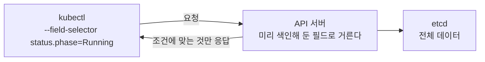
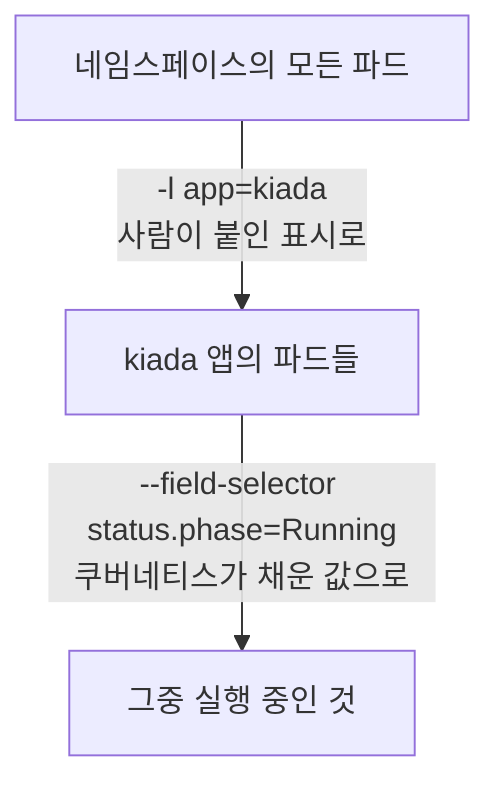

# 7.4 필드 셀렉터로 오브젝트 걸러 내기

[7.3절](<7.3 레이블 셀렉터로 오브젝트 걸러 내기.md>)의 레이블 셀렉터에는 전제가 하나 있습니다. **누군가 미리 레이블을 붙여 놨어야** 한다는 것입니다.

그런데 이런 질문에는 레이블이 소용없습니다.

* "지금 `Running`이 아닌 파드만 보여 줘"
* "`kia-control-plane` 노드에 떠 있는 파드만"

상태나 배치 노드는 **레이블이 아니라 오브젝트가 원래 가지고 있는 값**입니다. 이럴 때 쓰는 것이 **필드 셀렉터(Field Selector)** 입니다.

## 레이블 셀렉터와 무엇이 다른가

| | 레이블 셀렉터 | 필드 셀렉터 |
| :--- | :--- | :--- |
| **무엇을 보나** | `metadata.labels` 에 붙인 값 | 오브젝트의 **실제 필드** |
| **누가 넣나** | 사람이나 도구가 붙임 | 쿠버네티스가 채움(일부는 사용자가 지정) |
| **옵션** | `-l` / `--selector` | `--field-selector` |
| **연산자** | `=`, `!=`, `in`, `notin`, 존재/부재 | **`=`, `==`, `!=` 뿐** |
| **쓸 수 있는 대상** | 어떤 레이블이든 | **미리 정해진 필드만** |

가장 큰 차이는 마지막 줄입니다. 필드 셀렉터는 **아무 필드나 쓸 수 없습니다.**

## 기본 사용법

```bash
kubectl get pods --field-selector metadata.name=kiada-stable   # 이름으로
```

```
NAME           READY   STATUS    RESTARTS   AGE
kiada-stable   1/1     Running   0          34s
```

```bash
kubectl get pods --field-selector status.phase=Running
```

```
NAME           READY   STATUS    RESTARTS   AGE
kiada-beta     1/1     Running   0          34s
kiada-canary   1/1     Running   0          34s
kiada-ssd      1/1     Running   0          16s
kiada-stable   1/1     Running   0          34s
quote          1/1     Running   0          34s
```

```bash
kubectl get pods --field-selector status.phase!=Running   # 장애 조사의 첫 명령
```

```
NAME        READY   STATUS    RESTARTS   AGE
kiada-gpu   0/1     Pending   0          16s
```

파드가 6개인데 **문제 있는 하나만** 남았습니다. 파드가 수백 개인 클러스터에서 이 한 줄의 값어치는 아주 큽니다.

```bash
kubectl get pods -A --field-selector spec.nodeName=kia-control-plane
```

```
NAMESPACE            NAME                               READY   STATUS    RESTARTS   AGE
default              kiada-beta                         1/1     Running   0          34s
default              kiada-ssd                          1/1     Running   0          16s
kiada-test1          kiada                              1/1     Running   0          3m29s
kube-system          kube-apiserver-kia-control-plane   1/1     Running   0          6m3s
local-path-storage   local-path-provisioner-...         1/1     Running   0          5m55s
...                                                                       (일부만 추림)
```

> 노드 하나가 이상할 때 **그 노드 위의 파드만** 추려 보는 데 씁니다. 노드를 점검하러 들어가기 전에 무엇이 영향을 받는지 확인하는 용도입니다.

레이블 셀렉터처럼 쉼표로 이으면 **AND**입니다. 여기에도 **OR는 없습니다.**

```bash
kubectl get pods -A --field-selector status.phase=Running,spec.nodeName=kia-control-plane
```

## 쓸 수 있는 필드는 정해져 있습니다

모든 리소스가 공통으로 지원하는 것은 두 개뿐입니다.

| 필드 | 뜻 |
| :--- | :--- |
| `metadata.name` | 오브젝트 이름 |
| `metadata.namespace` | 소속 네임스페이스 |

나머지는 **리소스 종류마다 다릅니다.** 파드에서 자주 쓰는 것은 이 정도입니다.

| 필드 | 뜻 |
| :--- | :--- |
| `status.phase` | 파드 단계 — `Pending`, `Running`, `Succeeded`, `Failed` ([6.1절](<../06장. 파드 생명주기와 컨테이너 상태 관리/6.1 파드 상태 이해하기.md>)) |
| `spec.nodeName` | 배치된 노드 이름 |
| `spec.restartPolicy` | 재시작 정책 |
| `spec.serviceAccountName` | 파드가 쓰는 서비스 계정 |

> **지원 목록을 외울 필요는 없습니다.** 버전에 따라 달라지기도 하고, 되는지 확인하는 가장 빠른 방법은 **그냥 써 보는 것**입니다. 안 되면 아래처럼 에러로 알려 줍니다.

지원하지 않는 필드를 쓰면 **조용히 무시되는 게 아니라 에러**가 납니다. 이건 다행입니다. 잘못 걸러진 결과를 사실로 믿는 것보다 낫습니다.

```bash
kubectl get pods --field-selector spec.containers[0].image=luksa/kiada:0.1
```

```
Error from server (BadRequest): Unable to find "/v1, Resource=pods" that match
label selector "", field selector "spec.containers[0].image=luksa/kiada:0.1":
field label not supported: spec.containers[0].image
```

`field label not supported` — 이 문구가 나오면 **그 필드는 서버가 색인해 두지 않았다**는 뜻입니다.

### 왜 아무 필드나 안 되나

필드 셀렉터는 **API 서버가 걸러서** 결과를 보내 줍니다. 클러스터에 파드가 1만 개여도 조건에 맞는 것만 네트워크로 넘어옵니다.



빠른 대신, **API 서버가 미리 색인(index)해 둔 필드만** 쓸 수 있습니다. 모든 필드를 색인해 두면 클러스터가 느려지고 메모리를 많이 쓰기 때문에 꼭 필요한 것만 열어 둔 것입니다.

> **지원하지 않는 필드로 거르고 싶다면** 서버에 맡기지 말고 받아 온 뒤 직접 거릅니다. `-o jsonpath`나 `kubectl get -o json | ConvertFrom-Json` 같은 방법이 있습니다. 데이터를 전부 받아 오므로 클러스터가 크면 느립니다.

## 이벤트를 볼 때 특히 유용합니다

[5.3절](<../05장. 다중 컨테이너 파드와 객체 상태/5.3 객체 상태와 이벤트 살펴보기.md>)에서 이벤트를 봤습니다. 이벤트는 금방 수백 개로 불어나서 그냥 보면 읽을 수가 없습니다. 필드 셀렉터가 여기서 진가를 발휘합니다.

```bash
kubectl get events --field-selector type=Warning          # 경고만
```

```
LAST SEEN   TYPE      REASON             OBJECT          MESSAGE
16s         Warning   FailedScheduling   pod/kiada-gpu   0/1 nodes are available:
                                                         1 node(s) didn't match Pod's
                                                         node affinity/selector. ...
```

```bash
kubectl get events --field-selector involvedObject.name=kiada-gpu   # 특정 파드만
```

[7.3절](<7.3 레이블 셀렉터로 오브젝트 걸러 내기.md>)에서 `Pending`에 걸려 있던 그 파드입니다. **`describe`로 파드를 하나씩 뒤지지 않고도** 클러스터 전체에서 문제가 있는 곳만 한 번에 추려집니다.

| 이벤트 필드 | 뜻 |
| :--- | :--- |
| `type` | `Normal` 또는 `Warning` |
| `reason` | `Failed`, `Killing`, `Scheduled` 같은 짧은 사유 |
| `involvedObject.kind` | 어떤 종류의 오브젝트에 대한 이벤트인가 |
| `involvedObject.name` | 그 오브젝트의 이름 |

## 두 셀렉터는 함께 쓸 수 있습니다

```bash
kubectl get pods -l app=kiada --field-selector status.phase=Running
```

```
NAME           READY   STATUS    RESTARTS   AGE
kiada-beta     1/1     Running   0          34s
kiada-canary   1/1     Running   0          34s
kiada-ssd      1/1     Running   0          16s
kiada-stable   1/1     Running   0          34s
```

`kiada-gpu`는 `app=kiada` 레이블이 없어서, `quote`는 `Running`이지만 앱이 달라서 빠졌습니다.

"kiada 앱이면서(레이블) 지금 실행 중인(필드)" 파드를 고릅니다. 실무에서 가장 자주 쓰는 조합입니다.



## 요약 및 비유

| 개념 | 학생부 조회 비유 | 기술적 의미 |
| :--- | :--- | :--- |
| **레이블 셀렉터** | 동아리·특기 같은 **내가 적어 넣은 항목**으로 찾기 | `metadata.labels` 기준 |
| **필드 셀렉터** | 학년·반 같은 **학교가 관리하는 항목**으로 찾기 | 오브젝트의 실제 필드 기준 |
| **지원 필드 제한** | 검색창에 있는 항목만 검색 가능 | 미리 색인해 둔 필드만 |
| **에러로 알려 줌** | 없는 항목을 넣으면 "검색 불가" | 미지원 필드는 에러 반환 |
| **서버가 거름** | 학교 서버가 걸러서 명단만 줌 | API 서버 쪽 필터링 |
| **둘을 함께** | "3학년이면서 축구부" | 레이블 + 필드 동시 조건 |

## 결론

* 필드 셀렉터는 **레이블이 아니라 오브젝트가 원래 가진 값**으로 고릅니다. 상태(`status.phase`)나 배치 노드(`spec.nodeName`)처럼 사람이 붙이지 않은 정보가 대상입니다.
* 연산자는 **`=`, `==`, `!=` 세 개뿐**입니다. `in`이나 존재 여부 검사는 없고, 쉼표는 AND입니다.
* **아무 필드나 되지 않습니다.** 공통으로 되는 것은 `metadata.name`과 `metadata.namespace`뿐이고, 나머지는 리소스마다 다릅니다. 안 되는 필드는 **에러**로 알려 줍니다.
* API 서버가 걸러서 보내 주므로 **클러스터가 커도 빠릅니다.** 지원하지 않는 필드로 거르려면 전부 받아 와서 직접 걸러야 합니다.
* **이벤트 조회**에서 가장 요긴합니다. `--field-selector type=Warning` 하나로 장애 조사 속도가 크게 달라집니다.
* 레이블 셀렉터와 **함께 쓸 수 있습니다.**
