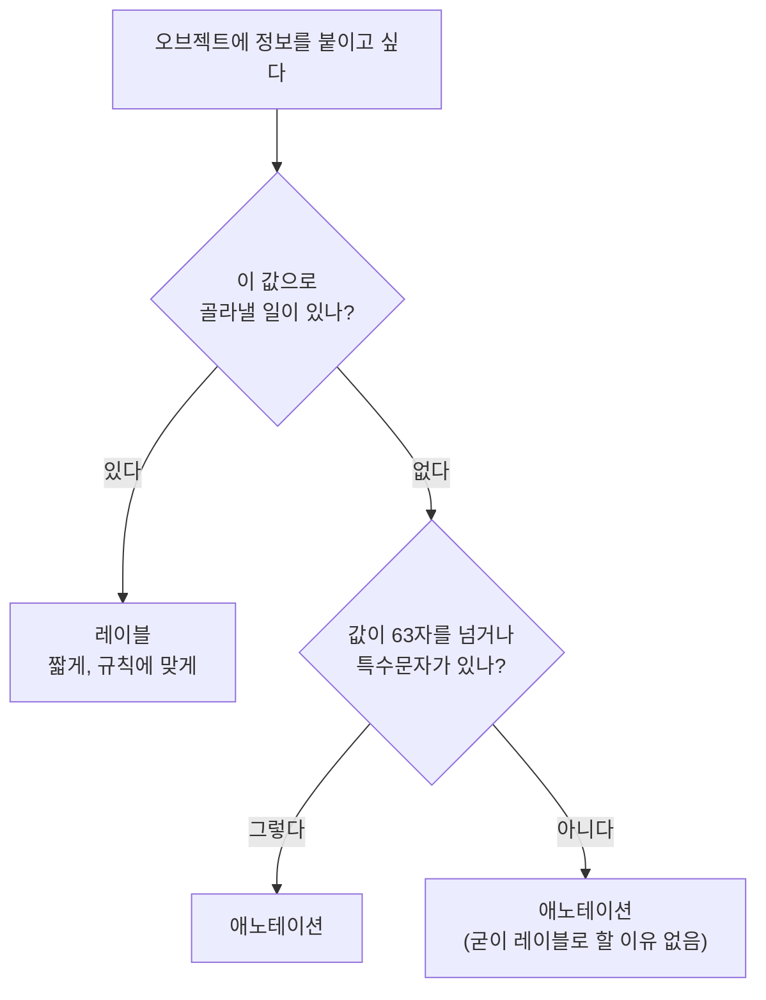
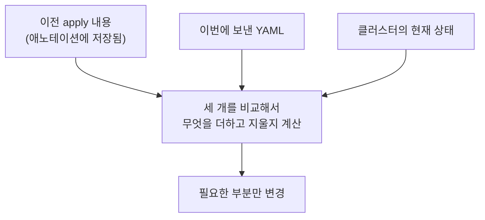

# 7.5 애노테이션으로 정보 덧붙이기

레이블은 **고르기 위한** 것이라 규칙이 깐깐합니다. 값이 63자를 넘으면 안 되고, 특수문자도 제한됩니다.

그런데 오브젝트에 남기고 싶은 정보가 항상 짧지는 않습니다.

* "이 파드는 왜 이렇게 설정했는지" 설명 세 문장
* 빌드한 사람, 커밋 해시, 배포 시각
* 도구가 읽어 가는 긴 설정값

이런 것을 담는 자리가 **애노테이션(Annotation)** 입니다.

## 레이블과 무엇이 다른가

둘 다 `metadata` 아래의 키/값 쌍입니다. 생김새는 거의 같습니다. **결정적인 차이는 하나**입니다.

| | 레이블(Label) | 애노테이션(Annotation) |
| :--- | :--- | :--- |
| **자리** | `metadata.labels` | `metadata.annotations` |
| **셀렉터로 고를 수 있나** | ✅ **된다** | ❌ **안 된다** |
| **값 길이** | 63자 | 사실상 제한 없음 (메타데이터 전체 256KB 이내) |
| **값에 쓸 수 있는 문자** | 영숫자와 `-`, `_`, `.` | 자유 — 줄바꿈, JSON 문자열도 가능 |
| **주 용도** | 분류하고 **골라내기** | 설명하고 **기록해 두기** |
| **누가 읽나** | 사람, 그리고 컨트롤러 | 사람, 그리고 도구 |

> **"이 정보로 오브젝트를 골라낼 일이 있는가?"** 이 질문 하나로 갈립니다. 있으면 레이블, 없으면 애노테이션입니다.



> **레이블을 남발하면 느려집니다.** 레이블은 API 서버가 색인해서 관리하는 대상입니다. 고를 일이 없는 정보까지 레이블로 넣으면 클러스터에 부담이 됩니다. 이것이 "고를 게 아니면 애노테이션"인 실질적인 이유입니다.

## 붙이고 지우기

키 규칙은 **레이블과 같습니다** — `접두사/이름` 구조에 이름은 63자까지입니다. **값만** 자유롭습니다.

```yaml
apiVersion: v1
kind: Pod
metadata:
  name: kiada-stable
  annotations:
    kia/owner: "moon"
    kia/note: "베타 트래픽 실험용. 2026-09-05 이후 삭제 예정."
  labels:
    app: kiada
spec:
  containers:
    - name: kiada
      image: luksa/kiada:0.1
```

명령으로도 붙일 수 있습니다. 문법이 `kubectl label`과 똑같습니다.

```bash
kubectl annotate pod kiada-stable kia/owner=moon          # 추가
```

```
pod/kiada-stable annotated
```

```bash
# 긴 값도 들어간다 - 레이블이었다면 63바이트에서 잘렸을 것
kubectl annotate pod kiada-stable kia/note="설명이 아주 길어도 됩니다. (같은 문장 8번 반복)"
```

```
pod/kiada-stable annotated
```

한글 200자가 넘는 값인데 그대로 들어갔습니다. [7.2절](<7.2 레이블로 파드 정리하기.md>)에서 레이블 값이 63바이트(한글 21자)를 넘겨 거부당했던 것과 대비됩니다.

```bash
kubectl annotate pod kiada-stable kia/owner=dorim --overwrite   # 덮어쓰기
kubectl annotate pod kiada-stable kia/owner-                    # 제거
```

```
pod/kiada-stable annotated
```

> **제거해도 `annotated`입니다.** 레이블은 지울 때 `unlabeled`로 바뀌는데, 애노테이션은 붙이든 지우든 똑같이 `annotated`가 나옵니다. 메시지만 보고 지워졌는지 판단하지 말고 실제로 조회해서 확인하세요.

## 확인하기

```bash
kubectl get pod kiada-stable -o jsonpath='{.metadata.annotations}'
```

```
{"kia/note":"설명이 아주 길어도 됩니다. 설명이 아주 길어도 됩니다. ...",
 "kia/owner":"moon",
 "kubectl.kubernetes.io/last-applied-configuration":"{\"apiVersion\":\"v1\",\"kind\":\"Pod\", ...}"}
```

우리가 붙인 두 개 말고 **`last-applied-configuration`이 하나 더** 들어 있습니다. 이건 잠시 뒤에 다룹니다.

```bash
kubectl describe pod kiada-stable
```

```
Annotations:      kia/note:
                    설명이 아주 길어도 됩니다. 설명이 아주 길어도 됩니다. 설명이 ...
                  kia/owner: moon
Status:           Running
```

> **`describe`는 긴 값을 잘라서 보여 줍니다.** 값을 끝까지 봐야 한다면 `-o jsonpath`나 `-o yaml`을 쓰세요.

> **`kubectl get --show-labels`에 해당하는 옵션은 없습니다.** 애노테이션은 값이 길어서 표로 만들 수 없기 때문입니다. `describe`나 `-o jsonpath`로 봐야 합니다.

셀렉터가 안 된다는 것도 직접 확인해 봅시다.

```bash
kubectl get pods -l kia/owner=moon
```

```
No resources found in default namespace.
```

애노테이션에 `kia/owner=moon`이 분명히 있는데도 아무것도 안 나옵니다. `-l`은 **레이블만** 봅니다.

## 쿠버네티스가 스스로 쓰는 애노테이션

애노테이션은 우리가 메모를 남기는 용도만이 아닙니다. **쿠버네티스와 도구들이 서로 정보를 주고받는 통로**로 훨씬 많이 쓰입니다.

### `kubectl.kubernetes.io/last-applied-configuration`

[3.1절](<../03장. 쿠버네티스 API와 오브젝트 모델 살펴보기/3.1 쿠버네티스 API 이해하기.md>)의 선언형 모델이 실제로 어떻게 동작하는지 보여 주는 자리입니다.

```bash
kubectl get pod kiada-stable -o jsonpath='{.metadata.annotations.kubectl\.kubernetes\.io/last-applied-configuration}'
```

```json
{"apiVersion":"v1","kind":"Pod",
 "metadata":{"annotations":{},
             "labels":{"app":"kiada","rel":"stable","ver":"0.1"},
             "name":"kiada-stable","namespace":"default"},
 "spec":{"containers":[{"image":"luksa/kiada:0.1","name":"kiada"}]}}
```

우리가 `apply`로 보낸 YAML이 **JSON으로 바뀌어 통째로** 들어 있습니다. `status`처럼 쿠버네티스가 채운 부분은 없고, **우리가 적은 것만** 있다는 점이 핵심입니다. 그래야 "내가 지운 필드"를 구별할 수 있으니까요.

> 키 이름에 점(`.`)이 들어 있어서 jsonpath에서 `\.`로 escape해야 합니다. 안 그러면 `kubectl`이 `kubectl` → `kubernetes` → `io`로 파고드는 경로로 착각합니다.

`kubectl apply`는 우리가 보낸 YAML 전체를 이 애노테이션에 **JSON으로 통째로 넣어 둡니다.** 다음에 `apply`할 때 "직전에 내가 보낸 것"과 "지금 보내는 것"을 비교해서, **내가 지운 필드가 무엇인지** 알아냅니다.



> **`kubectl create`로 만든 오브젝트에는 이 애노테이션이 없습니다.** 그래서 `create`로 만들고 나중에 `apply`하면 예상과 다르게 동작할 수 있습니다. 처음부터 `apply`로 관리하는 편이 안전합니다.

### 그 밖에 자주 보는 것

| 애노테이션 | 무엇을 하나 |
| :--- | :--- |
| `kubernetes.io/change-cause` | 배포 이력에 "왜 바꿨는지"를 남김 (15장) |
| 인그레스 컨트롤러 설정 | 리다이렉트·타임아웃 등 컨트롤러별 세부 설정 (12장) |
| `kubectl.kubernetes.io/restartedAt` | `kubectl rollout restart`가 남기는 시각 (15장) |

시스템 파드에 어떤 애노테이션이 붙어 있는지 구경해 봅시다.

```bash
kubectl get pod -n kube-system -l component=kube-apiserver -o jsonpath='{.items[0].metadata.annotations}'
```

```
{"kubeadm.kubernetes.io/kube-apiserver.advertise-address.endpoint":"10.89.0.3:6443",
 "kubernetes.io/config.hash":"465cfb992c765bfa9651706ce78eeeab",
 "kubernetes.io/config.mirror":"465cfb992c765bfa9651706ce78eeeab",
 "kubernetes.io/config.seen":"2026-08-31T06:47:47.024620882Z",
 "kubernetes.io/config.source":"file"}
```

`kubernetes.io/config.source: file`이 눈에 띕니다. **이 파드는 API 서버를 통해 만들어진 게 아니라 노드의 파일에서 직접 뜬 파드**라는 표시입니다(스태틱 파드). 컨트롤 플레인 자신을 어떻게 띄우는지에 대한 힌트가 애노테이션에 남아 있는 것입니다.

> **인그레스에서 애노테이션이 왜 그렇게 많이 쓰였나.** 표준 스펙에 없는 기능을 컨트롤러마다 애노테이션으로 욱여넣다 보니, 같은 기능도 컨트롤러가 다르면 키가 달라졌습니다. 이 문제를 정면으로 고치려고 나온 것이 **Gateway API**입니다(12~13장에서 다룹니다).

## 주의할 점

> **비밀을 애노테이션에 넣지 마세요.** 애노테이션은 `kubectl get -o yaml`로 누구나 읽을 수 있고, 암호화되지도 않습니다. 비밀번호나 토큰은 Secret에 넣습니다(8장).

> **256KB는 오브젝트 전체 메타데이터 기준입니다.** 애노테이션 하나가 아니라 레이블과 애노테이션을 합친 값입니다. 큰 설정 파일을 통째로 넣으면 한계에 부딪히고, 그런 용도로는 ConfigMap을 씁니다(8장).

## 요약 및 비유

| 개념 | 교과서 여백 메모 비유 | 기술적 의미 |
| :--- | :--- | :--- |
| **레이블** | 페이지 옆에 붙인 **인덱스 탭** | 골라내기 위한 짧은 표시 |
| **애노테이션** | 여백에 적어 둔 **설명 메모** | 기록해 두기 위한 자유로운 값 |
| **셀렉터로 못 고름** | 메모 내용으로는 페이지를 못 찾음 | `-l`은 레이블만 본다 |
| **값 길이 자유** | 메모는 길게 써도 됨 | 63자 제한 없음 |
| **도구가 읽는 애노테이션** | 선생님이 정한 기호로 남긴 표시 | 컨트롤러·도구가 약속한 키 |
| **`last-applied-configuration`** | 지난번에 낸 과제 사본 | 직전 apply 내용을 비교용으로 보관 |
| **비밀은 넣지 않기** | 남이 볼 교과서에 비밀번호를 안 적음 | 누구나 읽을 수 있음 |

## 결론

* 애노테이션은 레이블과 생김새가 같지만 **셀렉터로 고를 수 없습니다.** 이 한 가지가 둘을 가르는 기준입니다.
* **"이 값으로 골라낼 일이 있나?"** → 있으면 레이블, 없으면 애노테이션입니다.
* 값 길이와 문자에 제한이 거의 없어서 **설명·JSON·긴 설정**을 담을 수 있습니다. 다만 메타데이터 전체가 256KB를 넘을 수는 없습니다.
* `kubectl annotate`의 문법은 `kubectl label`과 같습니다 — 덮어쓸 때 `--overwrite`, 지울 때 `키-`.
* 실무에서는 **도구들이 정보를 주고받는 통로**로 더 많이 쓰입니다. `apply`의 동작 원리도 애노테이션에 기대고 있습니다.
* **비밀 정보는 넣지 마세요.** 누구나 읽을 수 있습니다.

## 공식 문서 업데이트 (2026년 8월 기준)

* **`last-applied-configuration`에만 기대지 않습니다.** 책이 설명하는 방식은 kubectl이 클라이언트에서 비교하는 것(client-side apply)입니다. 지금은 **서버 사이드 어플라이(Server-Side Apply)** 가 더해져서, 어느 필드를 누가 관리하는지를 오브젝트의 `metadata.managedFields`에 서버가 직접 기록합니다.
  ```bash
  kubectl get pod kiada-stable -o jsonpath='{.metadata.managedFields}'
  ```
  `kubectl apply --server-side`로 쓰면 이 방식이 적용되고, 여러 도구가 같은 오브젝트를 나눠 관리할 때 충돌을 제대로 잡아 줍니다. `kubectl get -o yaml`을 찍었을 때 못 보던 `managedFields` 덩어리가 나오는 이유이기도 합니다.
* 참고: <https://kubernetes.io/docs/concepts/overview/working-with-objects/annotations/>
* 참고: <https://kubernetes.io/docs/reference/using-api/server-side-apply/>
