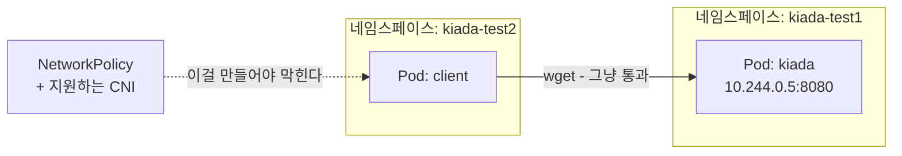
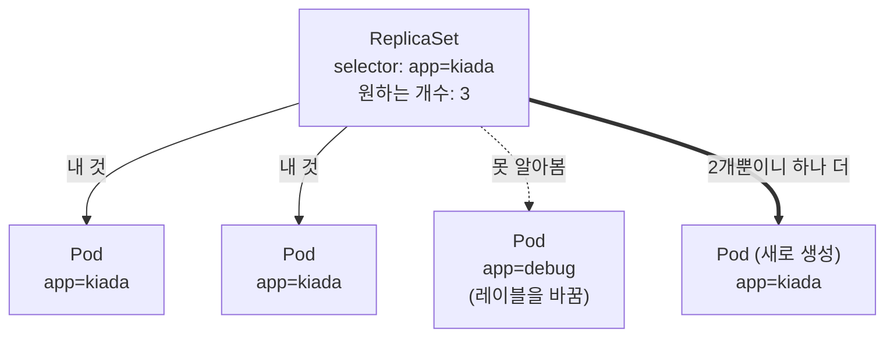
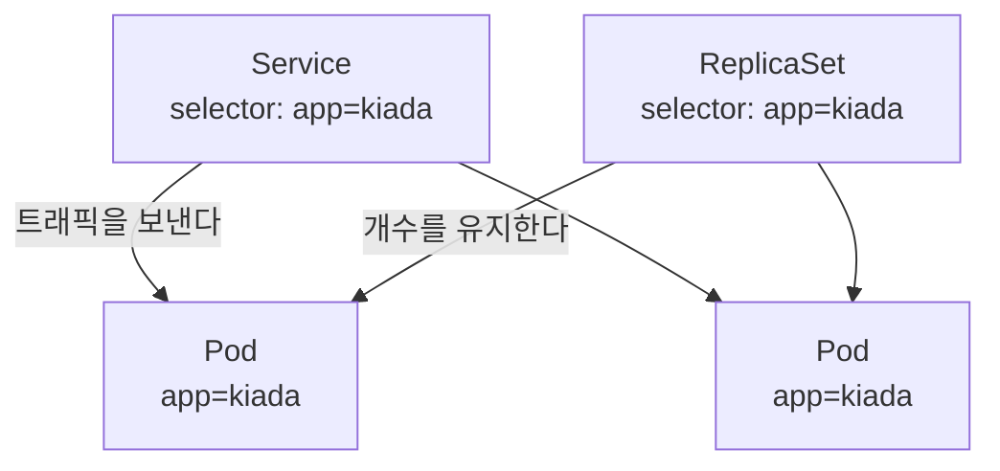
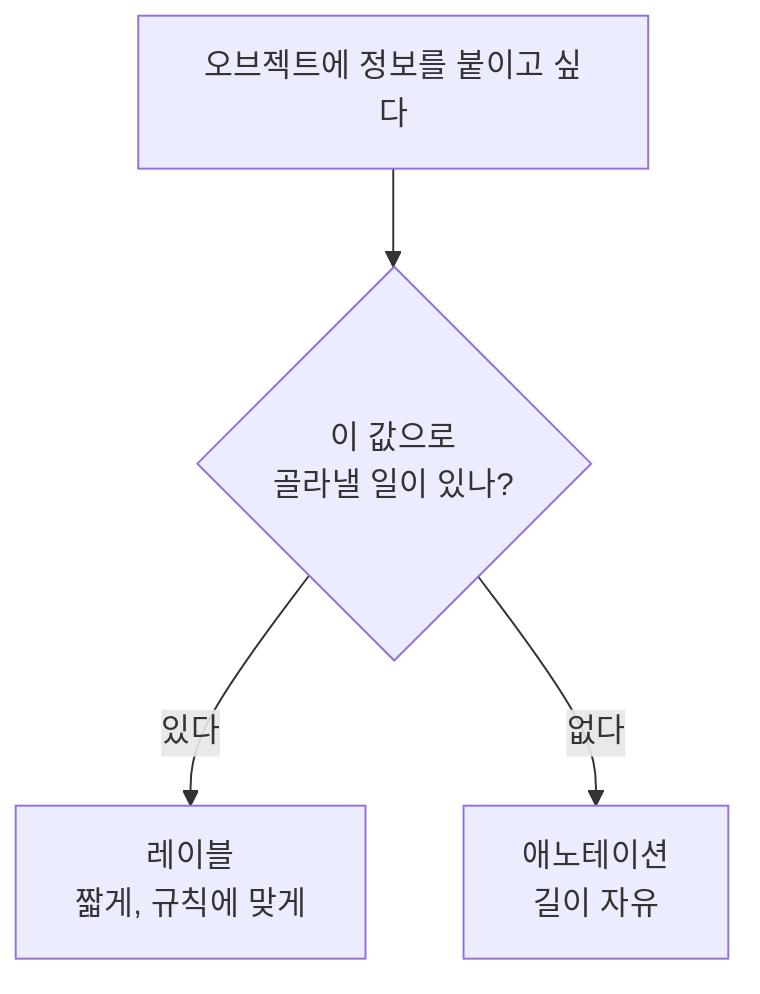
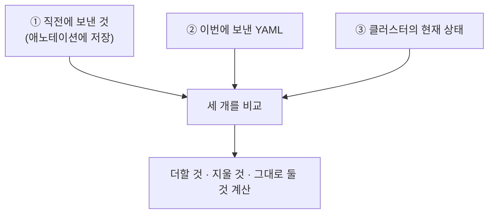

# 07장 핵심 질문 답변 — 네임스페이스와 레이블로 리소스 구성하기

[07장 핵심 질문](<07장 핵심 질문.md>)의 답변입니다. 먼저 스스로 답해 보고 펼치세요.

---

## 7.1 네임스페이스로 오브젝트 나누기

### 1. 두 네임스페이스의 차이 ★★★★★

**한 줄 답 — 리눅스 네임스페이스는 커널이 프로세스가 보는 자원을 격리하는 것이고, 쿠버네티스 네임스페이스는 API 오브젝트의 이름을 나누는 구역입니다. 이름만 같고 무관합니다.**

같은 단어를 쓰는 바람에 가장 많이 헷갈리는 지점입니다. **"방음이 되는 독방"과 "서류철에 붙인 분류 이름표"** 정도로 다릅니다. 독방은 안이 안 보이고 소리도 안 새지만, 이름표는 서류를 정리해 줄 뿐 누가 꺼내 보는 것을 막지 않습니다.

| | 리눅스 네임스페이스 | 쿠버네티스 네임스페이스 |
| :--- | :--- | :--- |
| 만드는 주체 | 리눅스 커널 | 쿠버네티스 API 서버 |
| 나누는 대상 | 프로세스가 보는 자원(PID·네트워크·마운트…) | API 오브젝트의 이름 |
| 격리 강도 | 커널 수준 — 서로 **아예 안 보임** | 격리 아님 — 이름만 나뉨 |
| 어디서 배웠나 | [2.3절](<../../02장. 컨테이너 소개/2.3 컨테이너를 가능하게 하는 기술.md>) | 7.1절 |

> 면접에서 "네임스페이스로 격리했습니다"라고 답하면 **어느 쪽 네임스페이스인지** 되묻는 경우가 많습니다. 쿠버네티스 쪽이라면 격리라는 단어를 쓰지 않는 편이 안전합니다.

### 2. 네임스페이스를 나누면 격리가 강해지나 ★★★★★

**한 줄 답 — 아니요. 커널 수준 격리 강도는 완전히 동일합니다.**

`dev`와 `prod`로 나눈 것은 **서류를 다른 서류철에 꽂은 것**뿐입니다. 서류철을 바꿨다고 종이가 더 튼튼해지지 않듯이, 파드를 다른 네임스페이스에 넣었다고 컨테이너 격리가 강해지지 않습니다.

컨테이너의 격리 강도를 결정하는 것은 **리눅스 네임스페이스와 cgroups**이고, 그건 파드가 어느 쿠버네티스 네임스페이스에 있든 똑같이 적용됩니다.

| 무엇이 | 나뉘나 |
| :--- | :--- |
| 오브젝트 이름, 조회 범위, 권한, 자원 할당량 | ✅ |
| 커널 격리, 네트워크, 배치되는 노드 | ❌ |

> **그럼 왜 나누나?** 격리가 아니라 **정리와 권한과 할당량** 때문입니다. 목적을 정확히 알고 쓰는 것과, 격리인 줄 알고 쓰는 것은 사고로 이어지느냐 마느냐의 차이입니다.

### 3. 리눅스 네임스페이스를 공유하는 단위 ★★★★☆

**한 줄 답 — 오직 한 파드 안의 컨테이너들입니다.**

[4.1절](<../../04장. 파드로 애플리케이션 실행하기/4.1 파드 이해하기.md>)에서 배운 그대로입니다. 한 파드 안의 컨테이너들은 **네트워크·IPC·UTS 네임스페이스를 공유**해서 `localhost`로 서로 통신합니다. 파일 시스템과 PID는 따로입니다.

파드가 다르면, 같은 쿠버네티스 네임스페이스에 있든 없든 **리눅스 네임스페이스는 공유하지 않습니다.**

> 이 문장을 거꾸로 외워 두면 헷갈릴 일이 없습니다 — **"리눅스 네임스페이스 공유 = 파드 안. 쿠버네티스 네임스페이스 = 파드 밖."**

### 4. 네임스페이스가 해 주는 일 ★★★★☆

**한 줄 답 — 이름 충돌 방지, 권한 분리, 자원 할당량, 일괄 삭제입니다.**

| 하는 일 | 설명 |
| :--- | :--- |
| **이름 충돌 방지** | 네임스페이스가 다르면 같은 종류·같은 이름의 오브젝트를 만들 수 있습니다 |
| **권한 분리** | "A팀은 `team-a`만" 처럼 권한을 거는 **단위**가 됩니다 |
| **자원 할당량** | `ResourceQuota`로 네임스페이스별 CPU·메모리 상한을 겁니다 |
| **일괄 삭제** | 네임스페이스를 지우면 안의 오브젝트가 전부 함께 사라집니다 |

> 네 가지 모두 **관리 편의**에 관한 것이지 **보안 격리**가 아닙니다. 2번 답과 이어집니다.

### 5. 기본 네임스페이스 네 개 ★★★★☆

**한 줄 답 — `default`, `kube-system`, `kube-public`, `kube-node-lease` 입니다.**

| 이름 | 역할 |
| :--- | :--- |
| `default` | 지정하지 않으면 여기로 갑니다 |
| `kube-system` | 컨트롤 플레인 부품과 시스템 파드. 건드리지 않습니다 |
| `kube-public` | 인증 없이 읽을 수 있어야 하는 정보. 실무에서 거의 안 씁니다 |
| `kube-node-lease` | 노드가 "살아 있다"를 주기적으로 기록. 노드 상태 감지용 |

> **실습 클러스터에는 `local-path-storage`도 보입니다.** 이건 표준이 아니라 **kind가 추가한 것**입니다. 배포판마다 이런 추가 네임스페이스가 다릅니다. "기본 네 개 + 배포판이 더한 것"으로 구분해서 기억하세요.

### 6. 소속과 전역을 가르는 기준 ★★★★★

**한 줄 답 — "팀마다 따로 있어야 하나?"면 네임스페이스 소속, "클러스터에 하나뿐인 물리적 존재인가?"면 전역입니다.**

노드를 생각하면 쉽습니다. 노드는 실제 서버(또는 컨테이너)입니다. `dev`용 노드와 `prod`용 노드로 **쪼개 가질 수가 없습니다.** 하나의 물리적 존재를 여러 네임스페이스가 나눠 가질 수 없으니 전역입니다.

| 구분 | 예 |
| :--- | :--- |
| **네임스페이스 소속** | Pod, Service, ConfigMap, Secret, Deployment, Job |
| **클러스터 전역** | Node, Namespace, PersistentVolume, StorageClass, ClusterRole |

> **네임스페이스 자체도 전역입니다.** 네임스페이스 안에 네임스페이스를 만들 수 없습니다. 폴더처럼 생겼지만 **한 층뿐**이라는 점이 실제 폴더와의 차이입니다.

### 7. 소속 여부 확인 명령 ★★★☆☆

**한 줄 답 — `kubectl api-resources --namespaced=true` 와 `--namespaced=false` 입니다.**

```bash
kubectl api-resources --namespaced=false -o name
```

[3.1절](<../../03장. 쿠버네티스 API와 오브젝트 모델 살펴보기/3.1 쿠버네티스 API 이해하기.md>)에서 `NAMESPACED` 열만 보고 넘어갔던 것을 조건으로 걸러 보는 것입니다.

> 개수는 클러스터마다 다릅니다. CRD로 API를 늘리면(16장) 늘어납니다. **숫자를 외우는 게 아니라 "확인하는 방법"을 기억하세요.**

### 8. 네임스페이스 이름 규칙 ★★★★☆

**한 줄 답 — DNS 레이블 규칙입니다. 소문자 영숫자와 하이픈만, 영숫자로 시작·끝, 63자 이내라 밑줄과 대문자가 거부됩니다.**

이름 규칙이 까다로운 이유가 있습니다. **이 이름이 나중에 DNS 주소의 일부가 되기 때문**입니다(11장 서비스). DNS에는 대문자와 밑줄을 쓸 수 없으니, 애초에 못 만들게 막는 것입니다.

```
The Namespace "kiada_test" is invalid: metadata.name: Invalid value: "kiada_test":
a lowercase RFC 1123 label must consist of lower case alphanumeric characters or '-'
```

> **프로그래밍 습관이 그대로 나오는 자리입니다.** `my_namespace`, `MyNamespace` 둘 다 안 됩니다. `my-namespace`로 씁니다. 에러 메시지가 정규식까지 알려 주니 막히면 그대로 읽으세요.

### 9. 네임스페이스 간 통신 ★★★★★

**한 줄 답 — 기본적으로 그냥 됩니다. 막으려면 NetworkPolicy와 그것을 지원하는 CNI가 필요합니다.**

이 장에서 가장 중요한 질문입니다. 다른 네임스페이스의 파드 IP만 알면 **아무 제약 없이 접속됩니다.**



실습에서 `kiada-test2`의 파드가 `kiada-test1`의 파드에 요청을 보내면 응답이 돌아옵니다. 응답에 찍힌 `Client IP`를 보면 **다른 네임스페이스에서 왔다는 사실조차 서버 쪽에서는 구별되지 않습니다.**

> **NetworkPolicy는 조용히 실패합니다.** 만들어도 **CNI가 지원하지 않으면 아무 일도 일어나지 않습니다.** 에러도 경고도 없습니다. kind의 기본 CNI(kindnet)가 그렇습니다. "정책을 만들었는데 여전히 통신된다"면 문법이 아니라 플러그인을 의심하세요.

### 10. 네임스페이스 삭제 ★★★★☆

**한 줄 답 — 안의 오브젝트가 전부 함께 삭제되며, 되돌릴 수 없습니다. 파이널라이저가 남아 있으면 `Terminating`에서 대기합니다.**

네임스페이스 삭제는 **파일 하나 지우기가 아니라 폴더째 지우기**입니다. 안에 있던 파드는 [6.4절](<../../06장. 파드 생명주기와 컨테이너 상태 관리/6.4 파드 생명주기 이해하기.md>)에서 배운 종료 절차(preStop → SIGTERM → 유예 시간 → SIGKILL)를 그대로 거칩니다. 그래서 파드가 많으면 시간이 걸립니다.

`Terminating`에서 멈춰 보이는 것은 대개 **파이널라이저(finalizer)** 때문입니다. "이 오브젝트를 지우기 전에 정리할 게 남았다"는 표시라, 그 정리가 끝나야 실제로 사라집니다.

> **억지로 파이널라이저를 지우지 마세요.** 뒷정리가 안 된 찌꺼기(클라우드의 로드밸런서, 디스크 등)가 남아 돈이 계속 나갈 수 있습니다. 원인을 먼저 확인하는 것이 순서입니다.

---

## 7.2 레이블로 파드 정리하기

### 11. 이름의 한계와 레이블 ★★★★★

**한 줄 답 — 이름은 축이 하나뿐입니다. 레이블은 축을 여러 개 만들 수 있습니다.**

`kiada-stable-1` 같은 이름 규칙은 처음엔 괜찮아 보이지만, 분류 기준이 하나 늘 때마다 **이름 규칙 전체를 다시 만들어야** 합니다. 게다가 고르려면 문자열을 잘라서 판단해야 합니다.

옷에 비유하면, 이름은 **고유 번호** 하나이고 레이블은 **계절·색·용도 태그를 여러 개** 붙이는 것입니다. 태그가 여러 개면 "여름 옷", "파란 옷", "여름이면서 파란 옷"을 각각 찾을 수 있습니다.

| | 이름 | 레이블 |
| :--- | :--- | :--- |
| 개수 | 오브젝트당 1개 | 여러 개 |
| 중복 | 같은 네임스페이스에서 불가 | 얼마든지 가능 |
| 고르기 | 정확히 하나 | 조건에 맞는 여럿 |

> 레이블은 파드만의 것이 아닙니다. **서비스·노드·네임스페이스**에도 똑같이 붙습니다.

### 12. 레이블 키의 구조와 길이 ★★★★☆

**한 줄 답 — `접두사/이름` 구조이고, 접두사는 253자, 이름과 값은 각각 63바이트입니다.**

```
app.kubernetes.io/name
+----------------+ +--+
   접두사(선택)     이름(필수)
```

| 부분 | 규칙 |
| :--- | :--- |
| 접두사 | 생략 가능. DNS 서브도메인 형식, 최대 253자 |
| 이름 | 필수. 최대 63바이트. 영숫자로 시작·끝, 중간에 `-` `_` `.` 가능 |
| 값 | 최대 63바이트. **비어 있어도 됨** |

접두사는 **"누가 만든 레이블인가"** 를 나타냅니다. 접두사가 없으면 사용자가 자유롭게 쓰는 것, 있으면 대개 도구나 쿠버네티스가 붙인 것입니다.

> **`kubernetes.io/`와 `k8s.io/`는 예약되어 있습니다.** 직접 만들어 붙이지 말고 조직 이름(`mycompany.com/team`)을 쓰세요. 노드의 `node-role.kubernetes.io/control-plane=` 처럼 **값이 빈 레이블**은 "존재 자체가 의미"인 경우입니다.

### 13. 63자가 아니라 63바이트 ★★★☆☆

**한 줄 답 — 한글은 한 글자가 3바이트라, 한글로는 21자밖에 못 넣습니다.**

에러 메시지가 정확히 `must be no more than 63 bytes` 라고 말합니다. 영문·숫자만 쓰면 1자 = 1바이트라 63자와 같지만, 한글은 UTF-8에서 **한 글자에 3바이트**를 씁니다.

| 문자 | 1글자당 바이트 | 63바이트에 들어가는 글자 수 |
| :--- | :--- | :--- |
| 영문·숫자 | 1 | 63자 |
| 한글 | 3 | 21자 |

> 레이블 값에 한글을 쓰는 일 자체가 드물지만, **설명을 레이블에 넣으려다** 걸리는 경우가 있습니다. 그건 애초에 레이블이 아니라 **애노테이션**에 넣을 정보입니다([7.5절](<../7.5 애노테이션으로 정보 덧붙이기.md>)).

### 14. `--overwrite` 가 필요한 이유 ★★★★☆

**한 줄 답 — 실수로 레이블을 덮어써서 컨트롤러가 파드를 놓치는 사고를 막기 위한 안전장치입니다.**

```
error: 'env' already has a value (test), and --overwrite is false
```

새 레이블을 붙이는 것은 그냥 되는데, **이미 값이 있는 키를 바꿀 때만** 막습니다. 레이블 변경은 단순한 메모 수정이 아니라 **"이 파드가 누구 소속인가"를 바꾸는 일**이기 때문입니다(16번 참고).

| 작업 | 명령 | 결과 메시지 |
| :--- | :--- | :--- |
| 추가 | `kubectl label pod X k=v` | `pod/X labeled` |
| 변경 | `kubectl label pod X k=v --overwrite` | `pod/X labeled` |
| 제거 | `kubectl label pod X k-` | `pod/X unlabeled` |

> 제거할 때 메시지가 `unlabeled`로 바뀝니다. **애노테이션은 붙이든 지우든 `annotated`로 같습니다**([7.5절](<../7.5 애노테이션으로 정보 덧붙이기.md>)). 이 차이를 알아 두면 명령이 먹혔는지 판단할 때 도움이 됩니다.

### 15. 표준 레이블을 쓰는 이유 ★★★☆☆

**한 줄 답 — 모니터링 도구와 대시보드가 이 키들을 보고 화면을 구성하기 때문에, 맞춰 두면 공짜로 얻는 것이 생깁니다.**

팀마다 `app` / `application` / `service` / `svc`로 제각각 지으면 도구가 알아볼 수 없습니다. 그래서 쿠버네티스가 **권장 레이블**을 정해 두었습니다.

| 키 | 뜻 |
| :--- | :--- |
| `app.kubernetes.io/name` | 애플리케이션 이름 |
| `app.kubernetes.io/instance` | 같은 앱을 여러 벌 띄웠을 때 그중 하나 |
| `app.kubernetes.io/version` | 버전 |
| `app.kubernetes.io/component` | 전체에서 맡은 역할 |
| `app.kubernetes.io/part-of` | 어떤 큰 시스템의 일부인가 |
| `app.kubernetes.io/managed-by` | 무엇이 이 오브젝트를 관리하나 |

> **강제가 아닙니다.** 학습용 예제에서는 짧은 이름(`app`, `rel`)을 쓰는 게 읽기 편합니다. 실무 프로젝트를 새로 시작할 때 표준 키를 쓰면 나중에 도구를 붙이기 쉬워집니다.

### 16. 레이블을 바꾸면 벌어지는 일 ★★★★★

**한 줄 답 — 컨트롤러가 그 파드를 잃어버리고, 개수가 모자란다고 판단해 새 파드를 만듭니다.**

컨트롤러는 레이블 셀렉터로 자기가 관리할 파드를 찾습니다. 레이블이 바뀌면 **그 파드는 조건에서 빠지므로 남남이 됩니다.**



**이건 사고이자 기법입니다.** 문제가 생긴 파드의 레이블을 일부러 바꾸면, 서비스와 컨트롤러의 관리 밖으로 빠지면서 **파드는 살아 있어서** 안을 들여다볼 수 있습니다. 사용자 트래픽은 새로 만들어진 정상 파드가 받습니다.

> 실무에서 자주 쓰는 디버깅 방법입니다. 자세한 내용은 **14장(레플리카셋)** 에서 다룹니다. `--overwrite`가 필요한 이유(14번)가 바로 이것 때문입니다.

---

## 7.3 레이블 셀렉터로 오브젝트 걸러 내기

### 17. 두 갈래 셀렉터의 연산자 ★★★★★

**한 줄 답 — 등식 기반은 `=`, `==`, `!=` 이고, 집합 기반은 `in`, `notin`, 키 존재, `!키` 입니다.**

| 갈래 | 연산자 | 예 |
| :--- | :--- | :--- |
| 등식 기반 | `=` `==` `!=` | `app=kiada`, `app!=kiada` |
| 집합 기반 | `in` `notin` | `'rel in (beta,canary)'` |
| 집합 기반 | 키만 / `!키` | `ver` (있는 것) / `'!ver'` (없는 것) |

`=`와 `==`는 **완전히 같습니다.** 등호 앞뒤 공백도 무시되므로 `'rel == stable'`도 정상 동작합니다.

> **따옴표는 필수입니다.** 괄호 `()`, 느낌표 `!`, 공백을 셸이 먼저 가로챕니다. bash에서 따옴표 없는 `!ver`는 명령 기록 치환으로 해석되어 엉뚱한 에러가 납니다.

### 18. `app!=kiada` 와 `!app` 의 차이 ★★★★★

**한 줄 답 — `!=`는 레이블이 아예 없는 것까지 포함하고, `!키`는 없는 것만 고릅니다.**

가장 잘 걸리는 함정입니다. `app!=kiada`를 "app이 다른 값인 것"으로만 생각하면 결과가 예상보다 훨씬 많이 나옵니다. **app 레이블 자체가 없는 오브젝트도 조건을 만족**하기 때문입니다.

| 셀렉터 | `app=kiada` | `app=quote` | app 레이블 없음 |
| :--- | :---: | :---: | :---: |
| `app=kiada` | ✅ | ❌ | ❌ |
| `app!=kiada` | ❌ | ✅ | ✅ **주의** |
| `app` (존재) | ✅ | ✅ | ❌ |
| `!app` (부재) | ❌ | ❌ | ✅ |

같은 함정이 `notin`에도 있습니다. `rel notin (stable)`은 **`rel` 레이블이 없는 오브젝트까지** 골라냅니다.

> **`kubectl delete`와 조합할 때 특히 위험합니다.** `!=`로 지우면 시스템 파드까지 걸릴 수 있습니다. 지우기 전에 **같은 셀렉터로 `get`을 먼저** 돌려 보세요.

### 19. OR를 표현하는 방법 ★★★★☆

**한 줄 답 — `in` 연산자로 한 키 안에서만 가능합니다. 서로 다른 키를 OR로 묶는 방법은 없습니다.**

쉼표는 **AND**입니다. `app=kiada,rel=stable`은 둘 다 만족해야 합니다.

```bash
kubectl get pods -l 'app in (kiada,quote)'    # 한 키 안의 OR - 가능
```

하지만 "app이 kiada **이거나** rel이 stable" 같은 조건은 **표현할 수 없습니다.**

| 조건 | 가능? | 방법 |
| :--- | :---: | :--- |
| `app=kiada` AND `rel=stable` | ✅ | 쉼표 |
| `app`이 kiada 또는 quote | ✅ | `in` |
| `app=kiada` **또는** `rel=stable` | ❌ | 두 번 조회하거나 레이블 설계를 바꿈 |

> 이 제약은 **레이블 설계를 어떻게 할지**에 영향을 줍니다. OR가 자주 필요하다면, 그 조건을 아예 **하나의 레이블로 만들어 붙이는 것**이 정답인 경우가 많습니다.

### 20. 셀렉터의 진짜 쓰임과 방향 ★★★★★

**한 줄 답 — 매니페스트 안입니다. 그리고 고르는 쪽은 서비스·컨트롤러이고, 파드는 골라지는 쪽입니다.**

kubectl에서 `-l`을 쓰는 건 조회 편의일 뿐입니다. **쿠버네티스가 부품을 엮는 방식 자체가 셀렉터**입니다.



**방향이 핵심입니다.** 파드는 자기가 어느 서비스에 속하는지 **모릅니다.** 파드에는 "나는 이 서비스 소속"이라고 적는 칸이 아예 없습니다. 서비스 쪽이 레이블을 보고 데려가는 것입니다.

> 이 방향을 거꾸로 이해하면 11장(서비스)과 14장(레플리카셋)이 계속 헷갈립니다. **"파드는 가만히 있고, 컨트롤러가 찾아온다."**

### 21. `matchLabels` 와 `matchExpressions` ★★★★☆

**한 줄 답 — 간단한 등식 조건은 `matchLabels`, `in`/`notin`/존재 여부가 필요하면 `matchExpressions`입니다. `Exists`와 `DoesNotExist`에는 `values`를 쓰지 않습니다.**

```yaml
selector:
  matchLabels:            # 등식 기반
    app: kiada
  matchExpressions:       # 집합 기반
    - key: rel
      operator: NotIn
      values: [canary]
```

| `operator` | 뜻 | `values` |
| :--- | :--- | :--- |
| `In` | 목록 안에 있음 | 필요 |
| `NotIn` | 목록 안에 없음 | 필요 |
| `Exists` | 키가 존재함 | **쓰지 않음** |
| `DoesNotExist` | 키가 없음 | **쓰지 않음** |

둘을 함께 적으면 **모두 만족**해야 합니다(AND).

> `Exists`에 `values`를 적으면 거부됩니다. 반대로 `In`에 `values`를 빼먹어도 거부됩니다. **연산자와 `values`의 짝이 맞는지**가 이 문법에서 가장 흔한 실수입니다.

### 22. 셀렉터를 못 바꾸게 막은 이유 ★★★★☆

**한 줄 답 — 관리 중이던 파드를 통째로 놓쳐 버리는 사고를 막기 위해서입니다.**

16번에서 본 상황을 떠올려 보세요. 파드 하나의 레이블만 바꿔도 컨트롤러가 그 파드를 잃어버립니다. **컨트롤러의 셀렉터를 바꾸면 관리하던 파드 전부를 한꺼번에 놓칩니다.**

```
디플로이먼트 selector: app=kiada  →  app=kiada-v2 로 변경
결과: 기존 파드 3개가 전부 고아가 되고, 새 파드 3개가 생성됨
```

그래서 아예 변경을 막아 두었습니다. 바꿔야 한다면 **오브젝트를 새로 만드는 것**이 유일한 방법입니다.

> 15장(디플로이먼트)에서 다시 만납니다. **처음 셀렉터를 정할 때 신중해야 하는 이유**이기도 합니다. 나중에 못 고칩니다.

### 23. 조건에 맞는 노드가 없을 때 ★★★★★

**한 줄 답 — 에러가 아니라 `Pending` 상태로 남습니다. 파드는 만들어졌지만 배치되지 않은 것입니다.**

`kubectl apply`는 성공합니다. **오브젝트를 만드는 것**과 **파드를 노드에 배치하는 것**은 별개의 단계이기 때문입니다.

```
NAME        READY   STATUS    RESTARTS   AGE
kiada-gpu   0/1     Pending   0          15s
```

`kubectl describe`의 Events를 보면 이유가 나옵니다.

```
Warning  FailedScheduling  0/1 nodes are available:
         1 node(s) didn't match Pod's node affinity/selector.
```

`0/1 nodes are available`은 "노드 1개 중 0개가 쓸 수 있다"는 뜻입니다.

> **`Pending`의 흔한 원인 세 가지** — ① 자원(CPU·메모리) 부족, ② `nodeSelector` 조건에 맞는 노드 없음, ③ 테인트에 막힘. `describe`의 **Events**가 셋 중 무엇인지 정확히 알려 줍니다. [6.1절](<../../06장. 파드 생명주기와 컨테이너 상태 관리/6.1 파드 상태 이해하기.md>)의 `Pending`과 같은 상태입니다.

---

## 7.4 필드 셀렉터로 오브젝트 걸러 내기

### 24. 레이블 셀렉터와 필드 셀렉터의 차이 ★★★★★

**한 줄 답 — 레이블은 사람이 붙인 값을, 필드는 오브젝트가 원래 가진 값을 봅니다. 연산자와 쓸 수 있는 대상도 다릅니다.**

학생부로 비유하면, 레이블은 **동아리·특기처럼 내가 적어 넣은 항목**이고 필드는 **학년·반처럼 학교가 관리하는 항목**입니다. 동아리로 찾으려면 누군가 적어 놨어야 하지만, 학년은 처음부터 있습니다.

| | 레이블 셀렉터 | 필드 셀렉터 |
| :--- | :--- | :--- |
| 보는 곳 | `metadata.labels` | 오브젝트의 실제 필드 |
| 값을 넣는 주체 | 사람·도구 | 쿠버네티스(일부는 사용자) |
| 옵션 | `-l` / `--selector` | `--field-selector` |
| 연산자 | `=` `!=` `in` `notin` 존재/부재 | **`=` `==` `!=` 뿐** |
| 대상 | 어떤 레이블이든 | **미리 정해진 필드만** |

"지금 Running이 아닌 파드"처럼 **아무도 레이블로 적어 두지 않는 정보**를 고를 때 필드 셀렉터가 필요합니다.

> 둘은 **함께 쓸 수 있습니다.** `kubectl get pods -l app=kiada --field-selector status.phase=Running` 이 실무에서 가장 자주 쓰는 조합입니다.

### 25. 필드가 제한적인 이유 ★★★★☆

**한 줄 답 — API 서버가 미리 색인해 둔 필드만 쓸 수 있기 때문입니다. 지원하지 않으면 에러로 알려 줍니다.**

필드 셀렉터는 **API 서버 쪽에서 걸러서** 결과를 보내 줍니다. 파드가 1만 개여도 조건에 맞는 것만 네트워크로 넘어오니 빠릅니다. 대신 모든 필드를 색인해 두면 클러스터가 느려지고 메모리를 많이 써서, 꼭 필요한 것만 열어 둔 것입니다.

| 대상 | 지원 필드 |
| :--- | :--- |
| **모든 리소스 공통** | `metadata.name`, `metadata.namespace` |
| 파드 | `status.phase`, `spec.nodeName`, `spec.restartPolicy`, `spec.serviceAccountName` … |
| 이벤트 | `type`, `reason`, `involvedObject.kind`, `involvedObject.name` … |

지원하지 않는 필드를 쓰면 이렇게 나옵니다.

```
Error from server (BadRequest): ... field label not supported: spec.containers[0].image
```

> **조용히 무시되지 않고 에러가 나는 게 다행입니다.** 잘못 걸러진 결과를 사실로 믿는 것보다 훨씬 낫습니다. 지원 목록을 외울 필요 없이 **그냥 써 보면** 됩니다.

### 26. 장애 조사의 첫 명령 ★★★★☆

**한 줄 답 — `kubectl get pods -A --field-selector status.phase!=Running` 입니다. 정상인 것을 전부 걷어내고 문제만 남깁니다.**

파드가 수백 개인 클러스터에서 `kubectl get pods`를 치면 화면이 넘쳐서 무엇이 문제인지 보이지 않습니다. 이 한 줄이면 **`Pending`이나 `Failed`에 걸린 것만** 남습니다.

```bash
kubectl get pods -A --field-selector status.phase!=Running
```

```
NAME        READY   STATUS    RESTARTS   AGE
kiada-gpu   0/1     Pending   0          16s
```

> **완벽하지는 않습니다.** `CrashLoopBackOff`로 재시작을 반복하는 파드는 단계상 `Running`이라 이 명령에 안 잡힙니다([6.1절](<../../06장. 파드 생명주기와 컨테이너 상태 관리/6.1 파드 상태 이해하기.md>)에서 배운 "STATUS는 단계가 아니다"). `RESTARTS` 숫자를 함께 보는 습관이 필요합니다.

### 27. 이벤트와 필드 셀렉터 ★★★☆☆

**한 줄 답 — 이벤트는 금방 수백 개로 불어나서, 걸러내지 않으면 읽을 수가 없기 때문입니다.**

```bash
kubectl get events --field-selector type=Warning
```

```
LAST SEEN   TYPE      REASON             OBJECT          MESSAGE
16s         Warning   FailedScheduling   pod/kiada-gpu   0/1 nodes are available: ...
```

파드를 하나씩 `describe`로 뒤지지 않고도 **클러스터 전체에서 문제가 난 곳만** 한 번에 추려집니다. 특정 파드만 보려면 `involvedObject.name`을 씁니다.

> [5.3절](<../../05장. 다중 컨테이너 파드와 객체 상태/5.3 객체 상태와 이벤트 살펴보기.md>)에서 이벤트를 배웠습니다. 그때는 파드가 몇 개뿐이라 그냥 볼 수 있었지만, **실제 클러스터에서는 필터가 없으면 이벤트를 못 씁니다.**

---

## 7.5 애노테이션으로 정보 덧붙이기

### 28. 레이블과 애노테이션의 결정적 차이 ★★★★★

**한 줄 답 — 셀렉터로 고를 수 있느냐입니다. 레이블은 되고 애노테이션은 안 됩니다.**

둘 다 `metadata` 아래의 키/값 쌍이라 생김새가 거의 같습니다. 갈림길은 **"이 값으로 오브젝트를 골라낼 일이 있는가?"** 하나입니다.

교과서로 비유하면 레이블은 페이지 옆에 붙인 **인덱스 탭**이고, 애노테이션은 여백에 적은 **설명 메모**입니다. 탭으로는 페이지를 찾을 수 있지만, 메모 내용으로는 못 찾습니다.

| | 레이블 | 애노테이션 |
| :--- | :--- | :--- |
| **셀렉터로 고르기** | ✅ | ❌ |
| 값 길이 | 63바이트 | 사실상 자유(메타데이터 전체 256KB) |
| 값의 문자 | 영숫자와 `-` `_` `.` | 자유 — 줄바꿈·JSON도 가능 |
| 주 용도 | 분류하고 **골라내기** | 설명하고 **기록해 두기** |

애노테이션에 `kia/owner=moon`이 분명히 있어도 `kubectl get pods -l kia/owner=moon`은 아무것도 못 찾습니다. `-l`은 레이블만 봅니다.

> **키 규칙은 레이블과 같습니다.** `접두사/이름` 구조에 이름은 63바이트. **값만** 자유롭습니다.

### 29. 레이블을 남발하면 안 되는 이유 ★★★★☆

**한 줄 답 — 레이블은 API 서버가 색인해서 관리하는 대상이라, 고를 일 없는 정보까지 넣으면 클러스터에 부담이 됩니다.**

레이블이 셀렉터로 빠르게 검색되는 이유는 **공짜가 아닙니다.** 색인을 유지하는 비용이 듭니다. 도서관이 모든 책의 모든 단어를 색인하지 않고 제목·저자·분류만 색인하는 것과 같습니다.



> 이 판단은 **성능만의 문제가 아닙니다.** 63바이트 제한, 문자 제한도 전부 "빠르게 고르기 위한 대가"입니다. 설명을 레이블에 넣으려다 제한에 걸린다면, 애초에 자리를 잘못 고른 것입니다.

### 30. `last-applied-configuration` ★★★★★

**한 줄 답 — `kubectl apply`가 직전에 보낸 매니페스트를 통째로 저장해 두는 애노테이션입니다. "내가 지운 필드"를 알아내는 데 씁니다.**

선언형 모델이 실제로 어떻게 동작하는지 보여 주는 자리입니다. `apply`는 비교할 것이 **세 개** 필요합니다.



**왜 세 개가 필요한가?** 이번 YAML에 없는 필드가 있을 때, 그것이 **"내가 지운 것"** 인지 **"쿠버네티스가 채운 것"** 인지 구별해야 하기 때문입니다. ①이 있으면 "전에는 내가 적었는데 지금은 없다 → 지운 것"이라고 판단할 수 있습니다.

저장된 내용을 보면 `status`처럼 쿠버네티스가 채운 부분은 없고 **우리가 적은 것만** 들어 있습니다.

> 최신 쿠버네티스에는 **서버 사이드 어플라이(Server-Side Apply)** 가 더해져서, 어느 필드를 누가 관리하는지를 서버가 `metadata.managedFields`에 직접 기록합니다. `kubectl get -o yaml`에서 보이는 그 긴 `managedFields` 덩어리가 그것입니다.

### 31. `create` 로 만들고 `apply` 하면 ★★★★☆

**한 줄 답 — `create`는 `last-applied-configuration`을 남기지 않아서, `apply`가 "직전에 무엇을 보냈는지" 모른 채 동작하기 때문입니다.**

30번의 세 가지 중 **①이 없는 상태**로 `apply`가 실행됩니다. 그러면 "내가 지운 필드"를 판단할 근거가 없어서, 지웠다고 생각한 설정이 그대로 남아 있는 일이 생깁니다.

| 만든 방법 | `last-applied-configuration` | 이후 `apply` |
| :--- | :---: | :--- |
| `kubectl create` | ❌ 없음 | 비교 기준이 없어 예상과 다를 수 있음 |
| `kubectl apply` | ✅ 있음 | 정상 동작 |

> **처음부터 `apply`로 관리하는 것이 안전합니다.** [3.1절](<../../03장. 쿠버네티스 API와 오브젝트 모델 살펴보기/3.1 쿠버네티스 API 이해하기.md>)의 "명령형 vs 선언형"이 취향 문제가 아니라 **실제 동작 차이**로 이어지는 지점입니다.

### 32. 애노테이션에 비밀을 넣으면 안 되는 이유 ★★★★☆

**한 줄 답 — `kubectl get -o yaml`로 누구나 읽을 수 있고 암호화도 되지 않기 때문입니다. 비밀은 Secret에 넣습니다.**

애노테이션은 **오브젝트 정의의 일부**입니다. 그 오브젝트를 조회할 권한이 있는 사람이면 애노테이션도 전부 보입니다. 숨김 처리도, 접근 제어도 따로 없습니다.

| 넣을 것 | 자리 |
| :--- | :--- |
| 설명, 담당자, 빌드 정보 | 애노테이션 |
| 비밀번호, 토큰, 인증서 | **Secret** (8장) |
| 큰 설정 파일 | **ConfigMap** (8장) |

> **256KB는 오브젝트 전체 메타데이터 기준입니다.** 애노테이션 하나가 아니라 레이블과 애노테이션을 합친 값입니다. 설정 파일을 통째로 넣으면 한계에 부딪히고, 그건 원래 ConfigMap이 할 일입니다.
