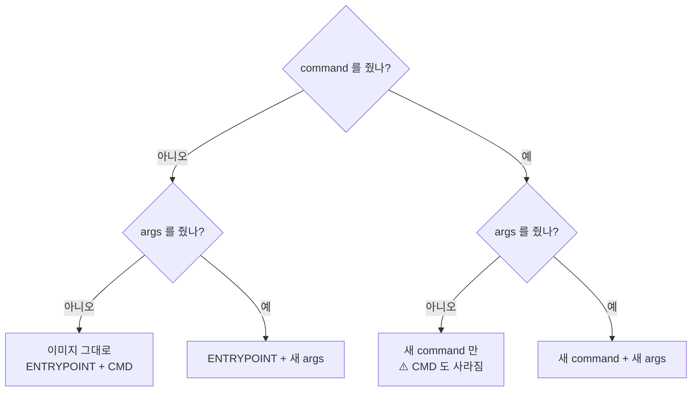
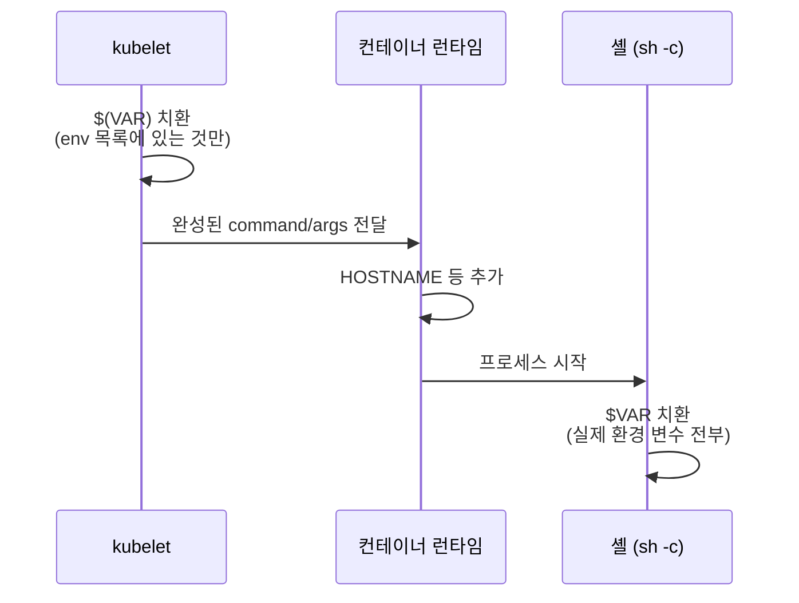

# 8.1 명령과 인자, 환경 변수 지정하기

7장까지는 이미지를 **만든 그대로** 실행했습니다. 그런데 같은 이미지를 개발 환경에서는 디버그 모드로, 운영 환경에서는 다른 포트로 띄우고 싶을 때가 많습니다. 그때마다 이미지를 다시 빌드할 수는 없습니다.

쿠버네티스는 이미지를 건드리지 않고 **파드 매니페스트에서 명령, 인자, 환경 변수를 바꾸는** 길을 열어 둡니다. 이 장 전체가 "설정을 어디에 두고 어떻게 넘길까"의 이야기이고, 이 절은 그 가장 단순한 형태입니다.

> **"command와 args는 4.2절에서 봤는데요?"** 맞습니다. [4.2절](<../04장. 파드로 애플리케이션 실행하기/4.2 YAML로 파드 만들기.md>)에서는 필드 이름만 짚었습니다. 여기서는 **둘 중 하나만 줄 때 무슨 일이 생기는지**, 그리고 환경 변수와 어떻게 엮이는지를 실측으로 확인합니다.

## 8.1.1 명령과 인자 지정하기

### 이미지에는 이미 기본 명령이 들어 있습니다

[2.2절](<../02장. 컨테이너 소개/2.2 컨테이너 직접 다뤄 보기.md>)에서 Dockerfile의 `ENTRYPOINT`와 `CMD`를 봤습니다. 이 장에서 쓰는 `docker.io/luksa/kiada:0.4` 이미지에는 무엇이 들어 있는지 노드에서 직접 꺼내 봅니다.

```bash
podman exec kia-control-plane crictl inspecti docker.io/luksa/kiada:0.4 | grep -A12 '"config"'
```

```
      "config": {
        "Cmd": [
          "--listen-port",
          "8080"
        ],
        "Entrypoint": [
          "node",
          "app.js"
        ],
        "Env": [
          "PATH=/usr/local/sbin:/usr/local/bin:/usr/sbin:/usr/bin:/sbin:/bin",
          "NODE_VERSION=16.11.1",
          "YARN_VERSION=1.22.15",
```

컨테이너가 시작될 때 실제로 실행되는 것은 **`Entrypoint` 뒤에 `Cmd`를 이어 붙인 것**, 즉 `node app.js --listen-port 8080`입니다. 그리고 이미지에는 환경 변수(`Env`)도 미리 들어 있습니다. 이것도 뒤에서 덮어쓰게 됩니다.

| Dockerfile | 이미지 설정 | 파드 YAML | 역할 |
| :--- | :--- | :--- | :--- |
| **`ENTRYPOINT`** | `Entrypoint` | **`command`** | 실행할 프로그램 |
| **`CMD`** | `Cmd` | **`args`** | 그 프로그램에 줄 인자 |

### command를 바꾸면 이미지의 CMD는 사라집니다

kiada는 Node.js 앱입니다. CPU·힙 프로파일링을 켜려면 `node` 뒤에 옵션을 붙여야 하므로 `command`를 바꿉니다.

**kiada-command.yaml**

```yaml
apiVersion: v1
kind: Pod
metadata:
  name: kiada
spec:
  containers:
  - name: kiada
    image: docker.io/luksa/kiada:0.4
    command: ["node", "--cpu-prof", "--heap-prof", "app.js"]   # ENTRYPOINT 대체
    ports:
    - name: http
      containerPort: 8080
```

```bash
kubectl apply -f kiada-command.yaml
kubectl exec kiada -- ps -o pid,args              # 컨테이너 안의 1번 프로세스 확인
```

```
    PID COMMAND
      1 node --cpu-prof --heap-prof app.js
     23 ps -o pid,args
```

눈여겨볼 점은 **`--listen-port 8080`이 붙지 않았다**는 것입니다. 공식 문서의 규칙 그대로입니다. `command`를 주면 이미지의 `ENTRYPOINT`와 `CMD`가 **둘 다** 무시됩니다. kiada는 인자가 없으면 기본값 8080을 쓰기 때문에 이번에는 티가 나지 않았을 뿐입니다.

```bash
kubectl logs kiada | tail -2
```

```
Status message is This is the default status message
Listening on port 8080
```

### args만 바꾸면 이미지의 ENTRYPOINT는 그대로 씁니다

포트만 바꾸고 싶다면 `command`는 건드리지 않고 `args`만 줍니다.

**kiada-args.yaml**

```yaml
spec:
  containers:
  - name: kiada
    image: docker.io/luksa/kiada:0.4
    args: ["--listen-port", "9090"]   # CMD 대체. 숫자도 문자열로
    ports:
    - name: http
      containerPort: 9090
```

```bash
kubectl exec kiada -- ps -o pid,args
```

```
    PID COMMAND
      1 node app.js --listen-port 9090
     21 ps -o pid,args
```

이미지의 `node app.js` 뒤에 **새 인자 `--listen-port 9090`** 이 붙었습니다. 포트 포워딩으로 접속해 보면 9090에서 응답합니다.

```bash
kubectl port-forward kiada 9090 &
curl -s localhost:9090
```

```
Request processed by Kiada 0.4 running in pod "unknown-pod" on node "unknown-node".
Pod hostname: kiada; Pod IP: 0.0.0.0; Node IP: 0.0.0.0. Client IP: ::ffff:127.0.0.1
This is the default status message
```

`unknown-pod`, `unknown-node`, `0.0.0.0`이 보입니다. kiada는 이 값들을 **환경 변수에서 읽는데, 아직 아무도 넣어 주지 않았기 때문**입니다. 8.1.2와 8.4절에서 채웁니다.

### 네 가지 조합 정리



### 일부러 틀려 보기

**1) 숫자를 따옴표 없이 쓰기.** YAML에서 `9090`은 숫자인데 `args`는 문자열 배열입니다.

```yaml
    args: ["--listen-port", 9090]     # 따옴표 없음
```

```
Error from server (BadRequest): error when creating "kiada-args-bad.yaml": Pod in version "v1" cannot be handled as a Pod: json: cannot unmarshal number into Go struct field Container.spec.containers.args of type string
```

API 서버가 **아예 받아 주지 않습니다.** `"true"`, `"1"`처럼 YAML이 숫자·불리언으로 읽을 만한 값은 모두 따옴표를 씌우세요.

**2) 명령 이름 오타.** `node`를 `nod`로 잘못 적으면 파드는 만들어지지만 컨테이너가 시작되지 못합니다.

```yaml
    command: ["nod", "app.js"]
```

```bash
kubectl get pod kiada-typo
kubectl describe pod kiada-typo
```

```
NAME         READY   STATUS              RESTARTS     AGE
kiada-typo   0/1     RunContainerError   1 (7s ago)   8s
```

```
    Last State:     Terminated
      Reason:       StartError
      Message:      failed to create containerd task: failed to create shim task: OCI runtime create failed: runc create failed: unable to start container process: error during container init: exec: "nod": executable file not found in $PATH
      Exit Code:    128
```

`executable file not found in $PATH`가 결정적인 단서입니다. 에러는 쿠버네티스가 아니라 **컨테이너 런타임(runc)** 이 냅니다. 매니페스트 문법은 멀쩡했기 때문입니다.

**3) command만 주고 args를 빼먹기.** 의도는 "`node` 대신 다른 옵션으로 실행"이었는데 `command: ["node"]`만 남기면 어떻게 될까요?

```yaml
    command: ["node"]                 # app.js 도 --listen-port 도 없음
```

```
NAME         READY   STATUS      RESTARTS      AGE
kiada-node   0/1     Completed   2 (23s ago)   25s
```

```
    State:          Terminated
      Reason:       Completed
      Exit Code:    0
```

`node`가 인자 없이 뜨면 대화형 셸(REPL)이 됩니다. 표준 입력이 없으니 **곧바로 정상 종료(Exit Code 0)** 하고, kubelet은 다시 띄우고, 또 종료합니다. 에러 메시지가 하나도 없어서 오히려 찾기 어렵습니다.

> **`command`를 바꿀 때는 원래 `CMD`까지 직접 다시 적어야 합니다.** 이미지의 `CMD`는 "`ENTRYPOINT`의 기본 인자"라서, `ENTRYPOINT`를 갈아 끼우는 순간 함께 버려집니다. 원래 무엇이었는지는 `crictl inspecti`나 `podman image inspect`로 먼저 확인하세요.

> **`command`와 `args`는 파드를 만든 뒤에 바꿀 수 없습니다.** 바꾸려면 파드를 지우고 다시 만들어야 합니다. 나중에 디플로이먼트를 쓰면 이 과정을 대신 해 줍니다(15장에서 다룹니다).

## 8.1.2 컨테이너에 환경 변수 지정하기

명령줄 인자보다 더 흔한 설정 수단이 **환경 변수(Environment Variable)** 입니다. 컨테이너 세계에서는 특히 그렇습니다. kiada도 상태 메시지를 `INITIAL_STATUS_MESSAGE` 환경 변수에서 읽습니다.

### `env`에 이름과 값을 적습니다

**kiada-env.yaml**

```yaml
spec:
  containers:
  - name: kiada
    image: docker.io/luksa/kiada:0.4
    env:                                                  # 환경 변수 목록
    - name: POD_NAME
      value: kiada
    - name: INITIAL_STATUS_MESSAGE
      value: This status message is set in the pod spec.  # 이미지의 기본값을 덮어씀
    ports:
    - name: http
      containerPort: 8080
```

```bash
kubectl exec kiada -- env
```

```
PATH=/usr/local/sbin:/usr/local/bin:/usr/sbin:/usr/bin:/sbin:/bin
HOSTNAME=kiada
NODE_VERSION=16.11.1
YARN_VERSION=1.22.15
POD_NAME=kiada
INITIAL_STATUS_MESSAGE=This status message is set in the pod spec.
KUBERNETES_PORT_443_TCP_PROTO=tcp
KUBERNETES_PORT_443_TCP_PORT=443
KUBERNETES_PORT_443_TCP_ADDR=10.96.0.1
KUBERNETES_SERVICE_HOST=10.96.0.1
KUBERNETES_SERVICE_PORT=443
KUBERNETES_SERVICE_PORT_HTTPS=443
KUBERNETES_PORT=tcp://10.96.0.1:443
KUBERNETES_PORT_443_TCP=tcp://10.96.0.1:443
HOME=/root
```

세 출처의 변수가 섞여 있습니다.

| 출처 | 예 | 누가 넣나 |
| :--- | :--- | :--- |
| **이미지** | `PATH`, `NODE_VERSION`, `YARN_VERSION` | Dockerfile의 `ENV` |
| **파드 매니페스트** | `POD_NAME`, `INITIAL_STATUS_MESSAGE` | 우리가 쓴 `env` |
| **쿠버네티스** | `KUBERNETES_SERVICE_HOST` 등 | kubelet이 서비스 정보를 자동으로 ([11.1절](<../11장. 서비스로 파드 노출하기/11.1 서비스로 파드 노출하기.md>)에서 다룹니다) |
| **런타임** | `HOSTNAME`, `HOME` | 컨테이너 런타임 |

이미지에도 `INITIAL_STATUS_MESSAGE` 기본값이 있었지만 **파드의 `env`가 이겼습니다.** 앱에 물어봐도 그렇습니다.

```bash
kubectl exec kiada -- curl -s localhost:8080
```

```
Request processed by Kiada 0.4 running in pod "kiada" on node "unknown-node".
Pod hostname: kiada; Pod IP: 0.0.0.0; Node IP: 0.0.0.0. Client IP: ::1
This status message is set in the pod spec.
```

`unknown-pod`였던 자리가 `kiada`로 바뀌었습니다. 다만 파드 이름을 매니페스트에 **손으로 한 번 더 적은 것**이라 파드 이름을 바꾸면 어긋납니다. 이 문제는 [8.4절](<8.4 다운워드 API로 메타데이터 노출하기.md>)의 다운워드 API로 풉니다.

### `$(VAR)`로 다른 변수를 참조합니다

환경 변수 값이나 `command`·`args` 안에서 **`$(변수이름)`** 을 쓰면 쿠버네티스가 값을 끼워 넣어 줍니다. 실험을 위해 일부러 함정을 몇 개 섞었습니다.

**kiada-env-ref.yaml**

```yaml
spec:
  containers:
  - name: kiada
    image: docker.io/luksa/kiada:0.4
    args:
    - --listen-port
    - $(LISTEN_PORT)                  # args 에서도 참조 가능
    env:
    - name: LISTEN_PORT
      value: "8080"
    - name: POD_NAME
      value: kiada
    - name: INITIAL_STATUS_MESSAGE
      value: My name is $(POD_NAME). I run NodeJS version $(NODE_VERSION). Escaped $$(POD_NAME). Later $(LATER).
    - name: LATER                     # 참조보다 뒤에 정의
      value: defined-after
```

```bash
kubectl exec kiada -- ps -o pid,args
kubectl exec kiada -- printenv INITIAL_STATUS_MESSAGE
```

```
    PID COMMAND
      1 node app.js --listen-port 8080
     21 ps -o pid,args
```

```
My name is kiada. I run NodeJS version $(NODE_VERSION). Escaped $(POD_NAME). Later $(LATER).
```

네 개의 참조가 네 가지로 다르게 처리됐습니다.

| 참조 | 결과 | 이유 |
| :--- | :--- | :--- |
| **`$(LISTEN_PORT)`** (args) | `8080` ✅ | `env`에 정의된 변수 |
| **`$(POD_NAME)`** | `kiada` ✅ | **앞에서** 정의된 변수 |
| **`$(NODE_VERSION)`** | 그대로 ❌ | **이미지의 `ENV`는 참조 대상이 아님** |
| **`$(LATER)`** | 그대로 ❌ | **뒤에서** 정의된 변수 |
| **`$$(POD_NAME)`** | `$(POD_NAME)` 글자 그대로 | `$$`는 이스케이프 |

공식 API 문서의 표현으로는 "앞에서 정의된 컨테이너의 환경 변수와 서비스 환경 변수"만 펼쳐집니다. **풀리지 않은 참조는 에러 없이 글자 그대로 남습니다.** 오타가 나도 아무도 알려 주지 않는다는 뜻입니다.

> **`env` 목록의 순서가 의미를 가집니다.** 다른 변수를 참조하는 변수는 반드시 **참조되는 변수보다 아래**에 두세요. 공식 문서도 "목록에서 더 아래에 있는 변수는 아직 정의되지 않은 것으로 본다"고 적고 있습니다.

### `$(VAR)`와 셸의 `$VAR`는 다른 것입니다

`$(VAR)`는 **쿠버네티스가** 컨테이너를 띄우기 전에 바꿔 치기합니다. 반면 `$VAR`는 **셸이** 실행 중에 펼칩니다. 셸이 없으면 아무도 펼치지 않습니다.

**shell-env.yaml** (두 파드)

```yaml
# 1) 셸을 거쳐 실행
    command:
    - sh
    - -c
    - 'echo "Hostname is $HOSTNAME."'
---
# 2) 셸 없이 바로 실행
    command: ["echo", "Hostname is $HOSTNAME. Kube says $(HOSTNAME)."]
```

```bash
kubectl logs env-var-references-in-shell
kubectl logs env-var-no-shell
```

```
Hostname is env-var-references-in-shell.
```

```
Hostname is $HOSTNAME. Kube says $(HOSTNAME).
```

두 번째 파드는 두 가지 모두 실패했습니다.

* `$HOSTNAME` — `echo`를 셸 없이 바로 실행했으므로 펼칠 주체가 없습니다
* `$(HOSTNAME)` — `HOSTNAME`은 **컨테이너 런타임이 넣는 값**이라 파드의 `env` 목록에 없습니다. 쿠버네티스 입장에서는 모르는 변수입니다



### 환경 변수 이름 규칙이 느슨해졌습니다

이름에 `=`만 들어가지 않으면 됩니다.

```yaml
    env:
    - name: status-message            # 대시 포함 — 지금은 허용
      value: dash is ok now
    - name: A=B                       # '=' 포함 — 거부
      value: x
```

```
The Pod "env-name" is invalid: spec.containers[0].env[1].name: Invalid value: "A=B": a valid environment variable name must consist only of printable ASCII characters other than '='
```

`A=B`를 지우고 다시 만들면 `status-message`는 통과합니다. 숫자로 시작하는 이름도 됩니다.

```yaml
    env:
    - name: 1badkey                   # 숫자로 시작 — 지금은 허용
      value: starts with a digit
    - name: status-message
      value: dash is ok
```

```
HOSTNAME=env-name2
1badkey=starts with a digit
status-message=dash is ok
HOME=/root
```

`1badkey`는 공식 문서의 ConfigMap 예제에서 "잘못된 이름"의 대표로 쓰이던 이름입니다. 지금 클러스터에서는 그대로 들어갑니다.

> **허용된다고 써도 된다는 뜻은 아닙니다.** `status-message`나 `1badkey` 같은 이름은 bash에서 `$status-message`로 읽을 수 없습니다. 셸 스크립트로 감싼 앱이라면 지금도 `대문자_밑줄` 관례를 지키는 편이 안전합니다.

## 요약 및 비유

| 개념 | 식당 주문서 비유 | 기술적 의미 |
| :--- | :--- | :--- |
| **이미지의 ENTRYPOINT** | 메뉴판의 기본 요리 "김치찌개" | 실행할 프로그램 (`node app.js`) |
| **이미지의 CMD** | 기본 옵션 "보통 맵기" | 기본 인자 (`--listen-port 8080`) |
| **`args`** | "맵기만 아주 맵게로 바꿔 주세요" | 프로그램은 두고 인자만 교체 |
| **`command`** | "된장찌개로 바꿔 주세요" — 옵션도 다시 말해야 함 | ENTRYPOINT 교체, **CMD도 함께 사라짐** |
| **`env`** | 주문서 하단의 요청 사항 칸 | 컨테이너 환경 변수, 이미지 ENV를 덮어씀 |
| **`$(VAR)`** | "위에 적은 테이블 번호로 갖다 주세요" | 앞에서 정의한 env를 쿠버네티스가 치환 |
| **뒤에 적은 변수** | 아래 줄에 적은 내용은 주방이 아직 못 읽음 | 순서가 뒤면 치환 안 됨 |
| **셸의 `$VAR`** | 주방장이 조리 중에 직접 확인 | 실행 중에 셸이 치환 |

## 결론

* 파드의 **`command`는 `ENTRYPOINT`를, `args`는 `CMD`를** 대체합니다. **`command`만 주면 이미지의 `CMD`도 버려집니다.**
* `args`의 숫자는 **따옴표로 감싼 문자열**이어야 합니다. 아니면 API 서버가 거부합니다.
* `env`로 준 값은 **이미지의 `ENV`를 덮어씁니다.** `KUBERNETES_*` 같은 변수는 쿠버네티스가 따로 넣습니다.
* `$(VAR)`는 **앞에서 정의된 `env`만** 치환합니다. 이미지 `ENV`, 런타임 변수, 뒤쪽 변수는 **에러 없이 글자 그대로** 남습니다.
* `$(VAR)`는 쿠버네티스가, `$VAR`는 셸이 펼칩니다. 셸 문법을 쓰려면 **`sh -c`로 감싸야** 합니다.

## 공식 문서 업데이트 (2026년 10월 기준)

### 1) 환경 변수 이름에 거의 모든 출력 가능한 ASCII 문자를 쓸 수 있습니다

책 시절에는 환경 변수 이름이 더 엄격한 규칙을 따라야 해서, 예컨대 숫자로 시작하는 `1badkey`는 거부됐습니다. 지금은 **`=`를 뺀 출력 가능한 ASCII 문자**면 됩니다. `RelaxedEnvironmentVariableValidation` 기능이 **1.34에서 정식(Stable)** 이 되었습니다. 위의 `status-message` 실측이 그 결과입니다.

참고: <https://kubernetes.io/docs/tasks/inject-data-application/define-environment-variable-container/>

### 2) 파일에서 환경 변수를 읽는 `fileKeyRef`가 생겼습니다 (beta)

`env[].valueFrom.fileKeyRef`로 **볼륨 안의 env 파일에서 특정 키를 골라** 환경 변수로 넣을 수 있습니다. 초기화 컨테이너가 만든 값을 본 컨테이너에 넘길 때 쓰입니다. `EnvFiles` 기능으로 **1.34 alpha, 1.35부터 beta(기본 켜짐)** 입니다. 볼륨이 필요한 기능이라 이 절에서는 실측하지 않았습니다(볼륨은 9장에서 다룹니다).

참고: <https://kubernetes.io/docs/reference/command-line-tools-reference/feature-gates/>

## 출처

> 2026-10-05 공식 문서로 검증

* 원서: *Kubernetes in Action, Second Edition* 8장 — <https://livebook.manning.com/book/kubernetes-in-action-second-edition/>
* [Define a Command and Arguments for a Container](https://kubernetes.io/docs/tasks/inject-data-application/define-command-argument-container/) — Kubernetes 공식 문서
* [Define Environment Variables for a Container](https://kubernetes.io/docs/tasks/inject-data-application/define-environment-variable-container/) — Kubernetes 공식 문서
* [Define Dependent Environment Variables](https://kubernetes.io/docs/tasks/inject-data-application/define-interdependent-environment-variables/) — Kubernetes 공식 문서
* [Container Environment](https://kubernetes.io/docs/concepts/containers/container-environment/) — Kubernetes 공식 문서
* [Pod](https://kubernetes.io/docs/reference/kubernetes-api/workload-resources/pod-v1/) — Kubernetes 공식 문서 (API 레퍼런스)
* [Feature Gates](https://kubernetes.io/docs/reference/command-line-tools-reference/feature-gates/) — Kubernetes 공식 문서
