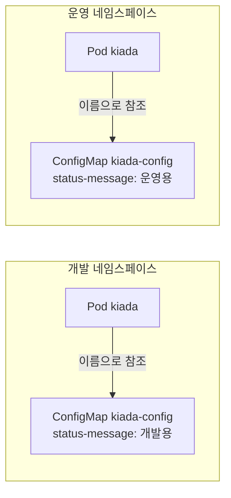

# 8.2 ConfigMap으로 설정을 파드 매니페스트에서 떼어 내기

[8.1절](<8.1 명령과 인자, 환경 변수 지정하기.md>)에서는 설정값을 파드 매니페스트의 `env`에 직접 적었습니다. 이러면 개발·스테이징·운영마다 **파드 매니페스트를 따로 둬야** 합니다. 앱 정의와 환경별 설정이 한 파일에 엉켜 있기 때문입니다.

설정만 따로 떼어 별도 오브젝트에 담고, 파드는 그것을 **이름으로 참조만** 하게 만들면 됩니다. 그 오브젝트가 **컨피그맵(ConfigMap)** 입니다.

## 8.2.1 ConfigMap 소개

### 7.5절에서 미뤄 둔 이야기 — 애노테이션은 "설명", ConfigMap은 "주입"

[7.5절](<../07장. 네임스페이스와 레이블로 리소스 구성하기/7.5 애노테이션으로 정보 덧붙이기.md>)에서 "큰 설정은 ConfigMap으로"라고 넘겼습니다. 둘 다 키/값을 담는데 무엇이 다를까요?

| | 레이블·애노테이션 | ConfigMap |
| :--- | :--- | :--- |
| **무엇에 대한 정보인가** | 그 오브젝트 **자신에 대한** 설명 | 앱이 **읽어 갈** 설정 |
| **누가 읽나** | 사람, 도구, 컨트롤러 | **컨테이너 안의 앱** |
| **앱에 어떻게 닿나** | 직접 닿지 않음 (8.4절의 다운워드 API로 일부만) | **환경 변수나 파일로 주입** |
| **크기 한도** | 메타데이터 전체 256KB | **1MiB** |
| **독립 오브젝트인가** | 아니오 — 다른 오브젝트에 붙음 | **예** — 여러 파드가 함께 참조 |

**애노테이션은 오브젝트를 설명하고, ConfigMap은 앱에 설정을 주입합니다.** 이 차이 하나만 기억하면 어디에 무엇을 둘지 헷갈리지 않습니다.

### 파드와 설정의 수명을 나눕니다



파드 매니페스트는 **두 환경에서 완전히 같습니다.** 이름만 같은 ConfigMap이 네임스페이스마다 다른 값을 들고 있을 뿐입니다. [7.1절](<../07장. 네임스페이스와 레이블로 리소스 구성하기/7.1 네임스페이스로 오브젝트 나누기.md>)에서 본 네임스페이스가 여기서 쓸모를 보입니다.

> **파드는 같은 네임스페이스의 ConfigMap만 참조할 수 있습니다.** 참조 필드에 `namespace`를 적는 칸 자체가 없습니다. 그리고 스태틱 파드는 ConfigMap을 아예 참조할 수 없습니다.

ConfigMap을 앱에 넘기는 길은 두 가지입니다.

* **환경 변수로** — 이 절에서 다룹니다
* **파일로(볼륨 마운트)** — 9장에서 다룹니다

## 8.2.2 ConfigMap 만들기

### `--from-literal` — 명령 한 줄로

```bash
kubectl create configmap kiada-config \
  --from-literal status-message="This status message is set in the kiada-config config map"
```

```
configmap/kiada-config created
```

```bash
kubectl get cm                         # cm 은 configmap 의 약칭
```

```
NAME               DATA   AGE
kiada-config       1      0s
kube-root-ca.crt   1      3m43s
```

만든 적 없는 `kube-root-ca.crt`가 있습니다. **네임스페이스마다 자동으로 생기는** ConfigMap으로, 파드가 API 서버의 인증서를 검증할 때 씁니다. 지워 봐도 몇 초 만에 다시 생깁니다(`kubectl delete cm kube-root-ca.crt` 3초 뒤 `AGE 3s`로 다시 조회됨, 2026-10-05 실측). 그대로 두면 됩니다.

```bash
kubectl get cm kiada-config -o yaml
```

```
apiVersion: v1
data:
  status-message: This status message is set in the kiada-config config map
kind: ConfigMap
metadata:
  creationTimestamp: "2026-10-05T08:49:27Z"
  name: kiada-config
  namespace: ch08
  resourceVersion: "4676"
  uid: 4c08f0ec-be1a-45c9-8630-78528bc76931
```

**`spec`이 없습니다.** 대부분의 오브젝트와 달리 ConfigMap은 `data`(그리고 `binaryData`)에 바로 키/값을 담습니다. "원하는 상태"를 기술하는 오브젝트가 아니라 그냥 **데이터 그릇**이기 때문입니다.

### YAML 매니페스트로

**cm.kiada-config.yaml**

```yaml
apiVersion: v1
kind: ConfigMap
metadata:
  name: kiada-config
data:                                   # spec 대신 data
  status-message: "This status message is set in the kiada-config config map"
```

키에는 영문자·숫자와 `-`, `_`, `.`만 쓸 수 있습니다. 파일 이름(`app.conf`)을 키로 쓰는 경우가 많아서 `.`이 허용됩니다.

### `--from-file` — 파일을 통째로

설정 파일을 그대로 넣을 수도 있습니다. 키는 기본적으로 **파일 이름**이 됩니다.

```bash
kubectl create configmap dummy-config \
  --from-file=dummy.txt \
  --from-file=dummy.yaml \
  --from-file=dummy-bad.yaml \
  --from-literal=sample=x               # 섞어 써도 됨
kubectl get cm dummy-config -o yaml
```

```
apiVersion: v1
data:
  dummy-bad.yaml: "dummy: \n  name: dummy-bad.yaml\n    note: This file has a space
    at the end of the first line.\n"
  dummy.txt: |-
    This is a text file with multiple lines
    that you can use to test the creation of
    a ConfigMap in Kubernetes.
  dummy.yaml: |
    dummy:
      name: dummy.yaml
      note: This file is correctly formatted with no trailing spaces.
  sample: x
kind: ConfigMap
...
```

`dummy.yaml`은 읽기 좋은 `|` 블록으로 나오는데 `dummy-bad.yaml`은 `\n`이 박힌 **따옴표 한 줄 문자열**로 나옵니다. 첫 줄 끝의 공백 하나 때문입니다.

> **`-o yaml`이 여러 줄 값을 한 줄 문자열로 보여 주면 줄 끝 공백을 의심하세요.** 데이터가 깨진 것은 아닙니다. YAML의 `|` 블록은 줄 끝 공백을 보존할 수 없어서 출력기가 따옴표 형식으로 바꾼 것입니다. 하지만 사람이 읽기 어렵고, 이 출력을 복사해 고치다 보면 실수가 납니다. 편집기에서 줄 끝 공백을 지우는 설정을 켜 두면 좋습니다.

### 키 이름 바꾸기, 바이너리 파일

`키=파일` 형식으로 키 이름을 직접 정할 수 있고, UTF-8이 아닌 파일은 자동으로 `binaryData`에 base64로 들어갑니다.

```bash
kubectl create configmap bin-config \
  --from-file=dummy.bin \
  --from-file=greeting=dummy.txt \
  --dry-run=client -o yaml
```

```
apiVersion: v1
binaryData:
  dummy.bin: n2VW39IEkyQ6Jxo+rdo5J06Vi7cz5XxZ...(이하 생략)
data:
  greeting: |-
    This is a text file with multiple lines
    that you can use to test the creation of
    a ConfigMap in Kubernetes.
kind: ConfigMap
metadata:
  name: bin-config
  namespace: ch08
```

`dummy.txt`가 `greeting`이라는 키로 들어갔습니다. `data`와 `binaryData`에 **같은 키를 둘 수는 없습니다.**

### `--from-env-file` — `.env` 파일을 키별로 나눠서

**kiada.env**

```
INITIAL_STATUS_MESSAGE=Set from an env file
# comment line
LOG_LEVEL=debug
```

```bash
kubectl create configmap env-config --from-env-file=kiada.env --dry-run=client -o yaml
```

```
apiVersion: v1
data:
  INITIAL_STATUS_MESSAGE: Set from an env file
  LOG_LEVEL: debug
kind: ConfigMap
metadata:
  name: env-config
  namespace: ch08
```

`--from-file`이었다면 파일 전체가 키 하나(`kiada.env`)에 들어갔을 겁니다. `--from-env-file`은 **줄마다 키를 하나씩** 만들고 `#` 주석은 건너뜁니다.

| 옵션 | 키 | 값 |
| :--- | :--- | :--- |
| **`--from-literal k=v`** | `k` | `v` |
| **`--from-file f`** | 파일 이름 `f` | 파일 내용 전체 |
| **`--from-file k=f`** | `k` | 파일 내용 전체 |
| **`--from-env-file f`** | 파일 안의 각 줄의 왼쪽 | 각 줄의 오른쪽 |

### 1MiB를 넘으면 거부됩니다

```bash
kubectl create configmap big-config --from-file=big.txt     # 약 1.1MB 파일
```

```
error: failed to create configmap: ConfigMap "big-config" is invalid: []: Too long: may not be more than 1048576 bytes
```

공식 문서도 "ConfigMap은 큰 데이터를 담도록 설계되지 않았다"고 못 박습니다. 그보다 큰 것은 볼륨이나 별도 저장소를 쓰라고 권합니다.

## 8.2.3 ConfigMap 값을 환경 변수로 넣기

### `configMapKeyRef` — 키 하나를 골라서

8.1절의 `value:` 자리를 `valueFrom:`으로 바꿉니다.

**kiada-cm-ref.yaml**

```yaml
spec:
  containers:
  - name: kiada
    image: docker.io/luksa/kiada:0.4
    env:
    - name: POD_NAME
      value: kiada
    - name: INITIAL_STATUS_MESSAGE      # 컨테이너 안의 변수 이름
      valueFrom:
        configMapKeyRef:
          name: kiada-config            # ConfigMap 이름
          key: status-message           # 그 안의 키
          optional: true                # 없어도 파드는 뜬다
```

```bash
kubectl exec kiada -- curl -s localhost:8080
```

```
Request processed by Kiada 0.4 running in pod "kiada" on node "unknown-node".
Pod hostname: kiada; Pod IP: 0.0.0.0; Node IP: 0.0.0.0. Client IP: ::1
This status message is set in the kiada-config config map
```

ConfigMap의 키 이름(`status-message`)과 환경 변수 이름(`INITIAL_STATUS_MESSAGE`)이 **달라도 됩니다.** 앱이 기대하는 이름으로 바꿔 넣어 주는 셈입니다.

### 없는 ConfigMap을 참조하면 — `optional`이 갈림길입니다

같은 매니페스트에서 이름만 `no-such-config`로 바꾼 파드 둘을 띄웁니다. 하나는 `optional`이 없고(`kiada-strict`), 하나는 `optional: true`입니다(`kiada-optional`).

```bash
kubectl get pods
```

```
NAME             READY   STATUS                       RESTARTS   AGE
kiada            1/1     Running                      0          12s
kiada-optional   1/1     Running                      0          10s
kiada-strict     0/1     CreateContainerConfigError   0          10s
```

```bash
kubectl describe pod kiada-strict
```

```
Events:
  Type     Reason     Age               From               Message
  ----     ------     ----              ----               -------
  Normal   Scheduled  10s               default-scheduler  Successfully assigned ch08/kiada-strict to kia-control-plane
  Normal   Pulled     9s (x2 over 10s)  kubelet            spec.containers{kiada-strict}: Container image "docker.io/luksa/kiada:0.4" already present on machine and can be accessed by the pod
  Warning  Failed     9s (x2 over 10s)  kubelet            spec.containers{kiada-strict}: Error: configmap "no-such-config" not found
```

`CreateContainerConfigError` — **이미지는 받았는데 컨테이너 설정을 만들지 못했다**는 뜻입니다. `optional: true`인 쪽은 변수 없이 그냥 떴고, 앱은 이미지의 기본 메시지를 씁니다.

```bash
kubectl exec kiada-optional -- curl -s localhost:8080
```

```
Request processed by Kiada 0.4 running in pod "kiada" on node "unknown-node".
Pod hostname: kiada-optional; Pod IP: 0.0.0.0; Node IP: 0.0.0.0. Client IP: ::1
This is the default status message
```

`kiada-strict`는 영원히 실패하는 게 아니라 **기다리는 중**입니다. 뒤늦게 ConfigMap을 만들면 알아서 시작합니다.

```bash
kubectl create configmap no-such-config --from-literal=status-message="Created after the pod"
```

```
configmap/no-such-config created
```

```bash
kubectl get pod kiada-strict                          # 20초쯤 뒤
kubectl exec kiada-strict -- printenv INITIAL_STATUS_MESSAGE
```

```
NAME           READY   STATUS    RESTARTS   AGE
kiada-strict   1/1     Running   0          44s
```

```
Created after the pod
```

ConfigMap은 있는데 **키가 없을 때**도 똑같이 막힙니다.

```yaml
          name: kiada-config
          key: no-such-key              # optional 없음
```

```
NAME          READY   STATUS                       RESTARTS   AGE
kiada-nokey   0/1     CreateContainerConfigError   0          6s
```

```
Error: couldn't find key no-such-key in ConfigMap ch08/kiada-config
```

> **`optional: true`는 "없어도 괜찮다"는 약속입니다.** 기본값이 있는 설정에만 쓰세요. 데이터베이스 주소처럼 없으면 앱이 의미 없는 값이라면, 차라리 `CreateContainerConfigError`로 멈춰서 **눈에 띄게 실패하는 편이** 낫습니다.

### `envFrom` — ConfigMap 전체를 한꺼번에

키가 많으면 하나씩 적기 번거롭습니다. `envFrom`은 **모든 키를 환경 변수로** 넣습니다.

**cm-envfrom.yaml**

```yaml
apiVersion: v1
kind: ConfigMap
metadata:
  name: kiada-config
data:
  INITIAL_STATUS_MESSAGE: This status message is set in the kiada-config ConfigMap.
  ANOTHER_CONFIG_MAP_ENTRY: This is another entry in the kiada-config ConfigMap.
  YET_ANOTHER_ENTRY: This is yet another entry in the kiada-config ConfigMap.
  status-message: Keys with dashes are allowed too.
```

**kiada-envfrom.yaml**

```yaml
spec:
  containers:
  - name: kiada
    image: docker.io/luksa/kiada:0.4
    env:
    - name: POD_NAME
      value: kiada
    envFrom:
    - configMapRef:                     # 모든 키를 그대로
        name: kiada-config
        optional: true
    - prefix: CFG_                      # 모든 키 앞에 CFG_ 를 붙여서
      configMapRef:
        name: env-config
        optional: true
```

```bash
kubectl exec kiada -- env | grep -v KUBERNETES
```

```
PATH=/usr/local/sbin:/usr/local/bin:/usr/sbin:/usr/bin:/sbin:/bin
HOSTNAME=kiada
NODE_VERSION=16.11.1
YARN_VERSION=1.22.15
INITIAL_STATUS_MESSAGE=This status message is set in the kiada-config ConfigMap.
YET_ANOTHER_ENTRY=This is yet another entry in the kiada-config ConfigMap.
status-message=Keys with dashes are allowed too.
CFG_LOG_LEVEL=debug
CFG_INITIAL_STATUS_MESSAGE=Set from an env file
POD_NAME=kiada
ANOTHER_CONFIG_MAP_ENTRY=This is another entry in the kiada-config ConfigMap.
HOME=/root
```

* `kiada-config`의 네 키가 **이름 그대로** 들어왔습니다. 대시가 든 `status-message`도 들어왔습니다(셸에서 읽기 어려운 이름이라는 점은 [8.1절](<8.1 명령과 인자, 환경 변수 지정하기.md>)과 같습니다)
* `env-config`의 키에는 **`CFG_` 접두사**가 붙었습니다. 두 ConfigMap에 같은 `INITIAL_STATUS_MESSAGE`가 있었지만 접두사 덕에 부딪히지 않았습니다

> **`kubectl create`로 만든 오브젝트에 `kubectl apply`를 하면 경고가 납니다.** 위 `cm-envfrom.yaml`을 앞서 만든 `kiada-config`에 적용했을 때 실제로 이렇게 나왔습니다.
> ```
> Warning: resource configmaps/kiada-config is missing the kubectl.kubernetes.io/last-applied-configuration annotation which is required by kubectl apply. kubectl apply should only be used on resources created declaratively by either kubectl create --save-config or kubectl apply. The missing annotation will be patched automatically.
> configmap/kiada-config configured
> ```
> 동작은 하지만, 명령형(`create`)과 선언형(`apply`)을 한 오브젝트에 섞지 않는 습관을 들이세요.

### 같은 이름이 겹치면 `env`가 이깁니다

`envFrom`으로 `INITIAL_STATUS_MESSAGE`를 넣으면서 `env`에도 같은 이름을 적어 봅니다.

**kiada-precedence.yaml**

```yaml
    envFrom:
    - configMapRef:
        name: kiada-config              # INITIAL_STATUS_MESSAGE 가 들어 있음
    env:
    - name: INITIAL_STATUS_MESSAGE
      value: Set directly in env.
```

```bash
kubectl exec kiada-precedence -- printenv INITIAL_STATUS_MESSAGE
```

```
Set directly in env.
```

API 레퍼런스의 규칙과 같습니다.

* `envFrom` 안에서 여러 소스가 같은 키를 가지면 **뒤에 적은 소스**가 이깁니다
* `env`와 `envFrom`이 겹치면 **`env`** 가 이깁니다


`envFrom`으로 기본값을 깔고, 몇 개만 `env`로 덮어쓰는 패턴이 여기서 나옵니다.

## 8.2.4 ConfigMap 수정하고 삭제하기

### 수정해도 실행 중인 컨테이너의 환경 변수는 그대로입니다

`envFrom`으로 `kiada-config`를 쓰는 파드가 떠 있는 상태에서 값을 바꿉니다. 책은 `kubectl edit`을 쓰지만 같은 결과를 `kubectl patch` 한 줄로 냅니다.

```bash
kubectl patch configmap kiada-config --type merge \
  -p '{"data":{"INITIAL_STATUS_MESSAGE":"This message was updated."}}'
kubectl get cm kiada-config -o jsonpath='{.data.INITIAL_STATUS_MESSAGE}'
```

```
configmap/kiada-config patched
```

```
This message was updated.
```

ConfigMap은 바뀌었습니다. 1분을 기다린 뒤 컨테이너에 물어봅니다.

```bash
kubectl exec kiada -- printenv INITIAL_STATUS_MESSAGE
kubectl exec kiada -- curl -s localhost:8080 | tail -1
```

```
This status message is set in the kiada-config ConfigMap.
```

```
This status message is set in the kiada-config ConfigMap.
```

**그대로입니다.** 환경 변수는 프로세스가 시작될 때 한 번 정해지고, 실행 중인 프로세스의 환경을 바깥에서 바꿀 방법은 없습니다. 공식 문서도 "환경 변수로 쓰인 ConfigMap은 자동으로 갱신되지 않는다"고 적습니다.

그럼 언제 반영될까요? 컨테이너를 재시작시켜 봅니다.

```bash
kubectl exec kiada -- kill 1            # 1번 프로세스(앱)를 종료 → kubelet 이 재시작
kubectl get pod kiada
kubectl exec kiada -- printenv INITIAL_STATUS_MESSAGE
```

```
NAME    READY   STATUS    RESTARTS     AGE
kiada   1/1     Running   1 (8s ago)   105s
```

```
This message was updated.
```

**파드를 다시 만들지 않아도, 컨테이너가 재시작되는 순간 새 값을 읽습니다.** kubelet이 새 컨테이너를 만들 때마다 ConfigMap을 다시 조회하기 때문입니다.

> **이것이 오히려 함정이 됩니다.** 같은 ConfigMap을 쓰는 파드가 여럿이면, 우연히 재시작된 파드만 새 값을 갖고 나머지는 옛 값을 들고 있습니다. 라이브니스 프로브 실패 하나로 **설정이 파드마다 달라지는** 상황입니다. 설정을 바꿨으면 모든 파드를 의도적으로 다시 띄우세요(15장의 디플로이먼트 롤아웃이 그 도구입니다). 혹은 아래의 불변 ConfigMap을 쓰고 이름을 바꿔 가며 새로 만드는 방법도 있습니다.

### 삭제해도 실행 중인 컨테이너는 멀쩡합니다 — 재시작 전까지는

`configMapKeyRef`(optional 없음)로 `kiada-config`를 쓰는 파드를 띄운 뒤 ConfigMap을 지웁니다.

```bash
kubectl delete cm kiada-config
kubectl exec kiada -- printenv INITIAL_STATUS_MESSAGE
```

```
configmap "kiada-config" deleted from ch08 namespace
```

```
This message was updated.
```

이미 시작된 프로세스의 환경은 그대로입니다. 이제 컨테이너를 재시작시키고 10초 간격으로 지켜봅니다.

```bash
kubectl exec kiada -- kill 1
kubectl get pod kiada                   # 10초마다
```

```
NAME    READY   STATUS      RESTARTS   AGE
kiada   0/1     Completed   0          12s
kiada   0/1     CreateContainerConfigError   0          22s
kiada   0/1     CreateContainerConfigError   0          32s
kiada   0/1     CrashLoopBackOff   0          43s
kiada   0/1     CreateContainerConfigError   0          53s
```

```bash
kubectl describe pod kiada
```

```
    State:          Waiting
      Reason:       CreateContainerConfigError
    Last State:     Terminated
      Reason:       Completed
      Exit Code:    0
    Ready:          False
    Restart Count:  0
...
  Warning  Failed     22s (x4 over 62s)  kubelet            spec.containers{kiada}: Error: configmap "kiada-config" not found
  Warning  BackOff    11s (x2 over 29s)  kubelet            spec.containers{kiada}: Back-off restarting failed container kiada in pod kiada_ch08(11c3d925-6e1b-474b-a796-f11f6794a014)
```

* 처음 잠깐은 방금 끝난 컨테이너의 상태 `Completed`가 보입니다
* 새 컨테이너를 만들려는 순간 ConfigMap이 없어서 `CreateContainerConfigError`
* 재시도 사이의 대기 동안은 `CrashLoopBackOff`로 바뀌어 보이기도 합니다
* `Restart Count`가 **0**입니다. 새 컨테이너가 **만들어지지조차 못했기** 때문입니다

> **ConfigMap 삭제는 시한폭탄입니다.** 지우는 순간에는 아무 일도 없어 보입니다. 문제는 며칠 뒤 노드 재부팅이나 프로브 실패로 컨테이너가 재시작될 때 터집니다. 지우기 전에 누가 참조하는지 먼저 확인하세요.

### 불변 ConfigMap — 아예 못 바꾸게 막기

`immutable: true`를 주면 내용을 바꿀 수 없습니다. 1.21부터 정식 기능입니다.

**cm-immutable.yaml**

```yaml
apiVersion: v1
kind: ConfigMap
metadata:
  name: kiada-config-immutable
data:
  status-message: This ConfigMap can't be changed.
immutable: true                         # data 와 같은 높이
```

```bash
kubectl apply -f cm-immutable.yaml
kubectl patch configmap kiada-config-immutable --type merge -p '{"data":{"status-message":"changed"}}'
```

```
configmap/kiada-config-immutable created
```

```
The ConfigMap "kiada-config-immutable" is invalid: data: Forbidden: field is immutable when `immutable` is set
```

`immutable`을 다시 `false`로 돌리는 것도 안 됩니다.

```bash
kubectl patch configmap kiada-config-immutable --type merge -p '{"immutable":false}'
```

```
The ConfigMap "kiada-config-immutable" is invalid: immutable: Forbidden: field is immutable when `immutable` is set
```

할 수 있는 것은 **삭제 후 재생성**뿐입니다.

```bash
kubectl delete cm kiada-config-immutable
```

```
configmap "kiada-config-immutable" deleted from ch08 namespace
```

**왜 굳이 못 바꾸게 할까요?**

* **사고 방지** — 실수로 운영 설정을 덮어써 장애가 나는 일을 막습니다
* **성능** — kubelet이 불변 ConfigMap은 변경 감시(watch)를 하지 않아 API 서버의 부담이 줄어듭니다. 공식 문서는 ConfigMap-파드 마운트가 수만 개 규모인 클러스터에서 효과가 크다고 설명합니다

실무에서는 `kiada-config-v2`처럼 **이름에 버전을 붙여 새로 만들고, 파드가 새 이름을 참조하게** 바꾸는 식으로 씁니다. 위에서 본 "파드마다 설정이 섞이는" 문제도 함께 사라집니다.

## 요약 및 비유

| 개념 | 학원 시간표 게시판 비유 | 기술적 의미 |
| :--- | :--- | :--- |
| **ConfigMap** | 반마다 붙어 있는 시간표 게시판 | 파드와 따로 사는 설정 오브젝트 |
| **애노테이션** | 교실 문에 붙은 "3층 끝 교실" 안내문 | 오브젝트 자신에 대한 설명 |
| **네임스페이스별 같은 이름** | 반마다 "시간표" 게시판은 있지만 내용은 다름 | 같은 매니페스트, 다른 설정 |
| **`configMapKeyRef`** | 게시판에서 "1교시"만 옮겨 적기 | 키 하나를 골라 환경 변수로 |
| **`envFrom` + `prefix`** | 게시판을 통째로 베끼되 "보충\_"을 붙여 구분 | 모든 키를 한꺼번에, 접두사로 충돌 방지 |
| **`optional`** | 게시판이 없으면 기본 시간표로 수업 | 없어도 컨테이너 시작 |
| **수정해도 env 그대로** | 이미 수첩에 베낀 학생은 새 시간표를 모름 | 컨테이너 재시작 때만 다시 읽음 |
| **삭제** | 게시판을 떼면 새로 온 학생만 곤란 | 재시작 시 `CreateContainerConfigError` |
| **`immutable`** | 코팅해서 못 고치는 시간표 — 바꾸려면 새로 인쇄 | 수정 불가, 삭제 후 재생성만 가능 |

## 결론

* ConfigMap은 **설정을 파드 매니페스트에서 떼어 내는** 오브젝트입니다. 애노테이션은 오브젝트를 **설명**하고, ConfigMap은 앱에 설정을 **주입**합니다.
* `--from-literal`, `--from-file`, `--from-env-file`로 만들고, 크기는 **1MiB**까지입니다.
* `configMapKeyRef`는 키 하나, `envFrom`은 전부를 넣습니다. **겹치면 `env`가 `envFrom`을 이깁니다.**
* 없는 ConfigMap이나 키를 참조하면 `optional`이 없을 때 **`CreateContainerConfigError`** 로 멈춥니다. 나중에 만들어 주면 저절로 시작합니다.
* ConfigMap을 고쳐도 **실행 중인 컨테이너의 환경 변수는 바뀌지 않습니다.** 컨테이너가 재시작될 때만 새 값을 읽으므로, 파드마다 설정이 섞일 수 있습니다.
* 지운 ConfigMap은 **다음 재시작 때** 문제를 일으킵니다. `immutable: true`로 사고를 막고, 바꿀 때는 새 이름으로 만드세요.

## 공식 문서 업데이트 (2026년 10월 기준)

### 1) `envFrom`이 숫자로 시작하는 키도 건너뛰지 않습니다

책 시절에는 `envFrom`으로 넣을 때 환경 변수 이름으로 쓸 수 없는 키(예: 숫자로 시작하는 키)는 **건너뛰고** `InvalidEnvironmentVariableNames` 경고 이벤트를 남겼습니다. 지금은 환경 변수 이름 규칙이 "`=`를 뺀 출력 가능한 ASCII 문자"로 넓어져(`RelaxedEnvironmentVariableValidation`, **1.34 Stable**) 그런 키도 그대로 들어옵니다. 공식 문서가 "잘못된 키"의 예로 드는 `1badkey`, `2alsobad`로 확인했습니다.

```bash
kubectl create configmap badkey-config --from-literal=1badkey=digit-first --from-literal=2alsobad=also
# envFrom 으로 badkey-config 를 넣고 env 를 출력하는 busybox 파드
kubectl logs envfrom-badkey | grep bad
kubectl get events --field-selector involvedObject.name=envfrom-badkey
```

```
HOSTNAME=envfrom-badkey
1badkey=digit-first
2alsobad=also
```

```
LAST SEEN   TYPE     REASON      OBJECT               MESSAGE
10s         Normal   Scheduled   pod/envfrom-badkey   Successfully assigned ch08/envfrom-badkey to kia-control-plane
9s          Normal   Pulling     pod/envfrom-badkey   Pulling image "docker.io/library/busybox"
8s          Normal   Pulled      pod/envfrom-badkey   Successfully pulled image "docker.io/library/busybox" in 1.346s (1.346s including waiting). Image size: 2236767 bytes.
8s          Normal   Created     pod/envfrom-badkey   Container created
8s          Normal   Started     pod/envfrom-badkey   Container started
```

두 키가 모두 들어왔고 **경고 이벤트가 없습니다.** API 레퍼런스의 `envFrom` 설명도 "소스 안의 키는 `=`를 뺀 출력 가능한 ASCII 문자로 이뤄질 수 있다"로 되어 있습니다.

> **"Configure a Pod to Use a ConfigMap" 문서의 Restrictions 절에는 아직 "잘못된 키는 건너뛴다"는 옛 설명과 예시가 남아 있습니다.** 2026-10-05 확인 기준입니다. 이 클러스터(v1.37.0)의 실제 동작은 위 실측과 같습니다.

참고: <https://kubernetes.io/docs/reference/kubernetes-api/workload-resources/pod-v1/>

## 출처

> 2026-10-05 공식 문서로 검증

* 원서: *Kubernetes in Action, Second Edition* 8장 — <https://livebook.manning.com/book/kubernetes-in-action-second-edition/>
* [ConfigMaps](https://kubernetes.io/docs/concepts/configuration/configmap/) — Kubernetes 공식 문서
* [Configure a Pod to Use a ConfigMap](https://kubernetes.io/docs/tasks/configure-pod-container/configure-pod-configmap/) — Kubernetes 공식 문서
* [Pod](https://kubernetes.io/docs/reference/kubernetes-api/workload-resources/pod-v1/) — Kubernetes 공식 문서 (API 레퍼런스)
* [Feature Gates](https://kubernetes.io/docs/reference/command-line-tools-reference/feature-gates/) — Kubernetes 공식 문서
