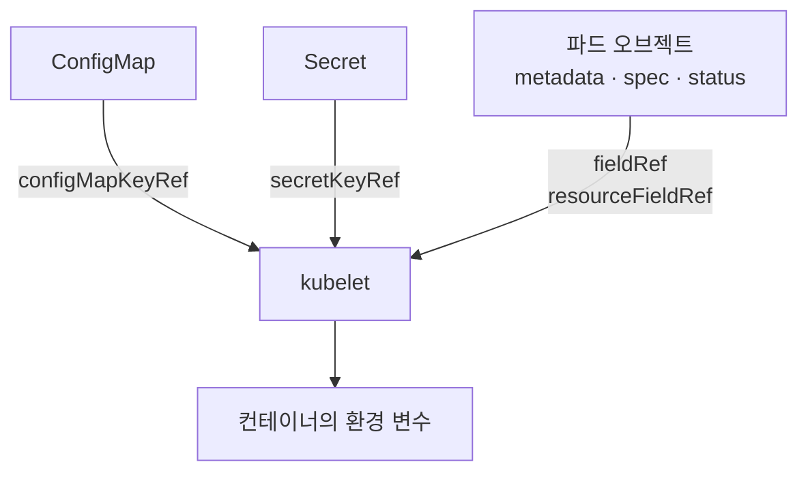

# 8.4 다운워드 API로 메타데이터 노출하기

지금까지 kiada의 응답에는 줄곧 `unknown-node`, `0.0.0.0`이 찍혔습니다. [8.1절](<8.1 명령과 인자, 환경 변수 지정하기.md>)에서 `POD_NAME`만은 매니페스트에 `kiada`라고 손으로 적어 넣었지만, 노드 이름이나 파드 IP는 그렇게 할 수 없습니다. **파드가 만들어지고 스케줄링된 뒤에야 정해지는 값**이기 때문입니다.

앱이 API 서버에 직접 물어볼 수도 있지만, 그러면 앱이 쿠버네티스에 묶이고 권한도 줘야 합니다. 대신 쿠버네티스가 **파드 자신의 정보를 환경 변수나 파일로 내려 주는** 장치가 있습니다. 그것이 **다운워드 API(Downward API)** 입니다.

> **"API라면서 호출하는 엔드포인트가 있나요?"** 없습니다. 이름과 달리 REST API가 아닙니다. 매니페스트에 "이 필드 값을 이 환경 변수에 넣어 달라"고 적어 두면 kubelet이 컨테이너를 만들 때 채워 줍니다. 정보가 위(API 서버의 파드 오브젝트)에서 아래(컨테이너)로 **내려온다(downward)** 는 뜻입니다.

## 8.4.1 다운워드 API 소개

### ConfigMap·Secret과 같은 자리에 꽂힙니다



[8.2절](<8.2 ConfigMap으로 설정을 파드 매니페스트에서 떼어 내기.md>)과 [8.3절](<8.3 Secret으로 민감한 데이터 넘기기.md>)에서 `valueFrom` 아래에 `configMapKeyRef`, `secretKeyRef`를 썼습니다. 다운워드 API도 **같은 `valueFrom`** 아래에 두 가지를 더할 뿐입니다.

| 필드 | 가져오는 것 | 예 |
| :--- | :--- | :--- |
| **`fieldRef`** | 파드 수준 필드 | 이름, 네임스페이스, IP, 노드 이름, 레이블 |
| **`resourceFieldRef`** | 컨테이너의 자원 요청·제한 | `requests.cpu`, `limits.memory` |

### `fieldRef` — 파드의 이름, IP, 노드를 넣습니다

저자 예제의 네 변수(`POD_NAME`, `POD_IP`, `NODE_NAME`, `NODE_IP`)에 몇 가지를 더 붙여 쓸 수 있는 필드를 한꺼번에 확인합니다.

**kiada-downward.yaml**

```yaml
apiVersion: v1
kind: Pod
metadata:
  name: kiada
  labels:
    app: kiada
  annotations:
    team: platform
spec:
  containers:
  - name: kiada
    image: docker.io/luksa/kiada:0.4
    env:
    - name: POD_NAME
      valueFrom:
        fieldRef:
          fieldPath: metadata.name                  # 파드 이름
    - name: POD_NAMESPACE
      valueFrom:
        fieldRef:
          fieldPath: metadata.namespace             # 네임스페이스
    - name: POD_UID
      valueFrom:
        fieldRef:
          fieldPath: metadata.uid                   # 파드 UID
    - name: APP_LABEL
      valueFrom:
        fieldRef:
          fieldPath: metadata.labels['app']         # 레이블 하나
    - name: TEAM
      valueFrom:
        fieldRef:
          fieldPath: metadata.annotations['team']   # 애노테이션 하나
    - name: POD_IP
      valueFrom:
        fieldRef:
          fieldPath: status.podIP                   # 파드 IP
    - name: POD_IPS
      valueFrom:
        fieldRef:
          fieldPath: status.podIPs                  # 듀얼 스택용 IP 목록
    - name: NODE_NAME
      valueFrom:
        fieldRef:
          fieldPath: spec.nodeName                  # 배치된 노드
    - name: NODE_IP
      valueFrom:
        fieldRef:
          fieldPath: status.hostIP                  # 노드 IP
    - name: SA_NAME
      valueFrom:
        fieldRef:
          fieldPath: spec.serviceAccountName        # 서비스어카운트
    # resourceFieldRef 세 개는 아래에서 따로 봅니다
    resources:
      requests:
        cpu: 100m
        memory: 64Mi
      limits:
        memory: 128Mi                               # CPU limit 은 일부러 안 줌
```

```bash
kubectl apply -f kiada-downward.yaml
kubectl exec kiada -- env                           # 다운워드 API 변수만 발췌
```

```
TEAM=platform
SA_NAME=default
MEMORY_LIMIT_MIB=128
CPU_LIMIT=18
POD_NAME=kiada
POD_UID=b3483387-eb2c-48d4-be32-7ea9fdb8c991
APP_LABEL=kiada
POD_IP=10.244.0.43
POD_IPS=10.244.0.43
NODE_NAME=kia-control-plane
NODE_IP=10.89.0.2
CPU_REQUEST_MILLICORES=100
POD_NAMESPACE=ch08
```

`kubectl get`으로 본 값과 같은지 맞춰 봅니다.

```bash
kubectl get pod kiada -o wide
```

```
NAME    READY   STATUS    RESTARTS   AGE   IP            NODE                NOMINATED NODE   READINESS GATES
kiada   1/1     Running   0          4s    10.244.0.43   kia-control-plane   <none>           <none>
```

IP `10.244.0.43`, 노드 `kia-control-plane`이 그대로 들어갔습니다. `POD_IPS`는 IPv4만 쓰는 이 클러스터에서는 `POD_IP`와 같습니다. 듀얼 스택 클러스터라면 IPv4와 IPv6 주소가 함께 담깁니다(첫 번째는 항상 `POD_IP`와 같습니다).

이제 kiada가 처음으로 자기 정보를 제대로 말합니다.

```bash
kubectl exec kiada -- curl -s localhost:8080
```

```
Request processed by Kiada 0.4 running in pod "kiada" on node "kia-control-plane".
Pod hostname: kiada; Pod IP: 10.244.0.43; Node IP: 10.89.0.2. Client IP: ::1
This is the default status message
```

```bash
kubectl logs kiada | head -9
```

```
Kiada - Kubernetes in Action Demo Application
---------------------------------------------
Kiada 0.4 starting...
Pod name is kiada
Local hostname is kiada
Local IP is 10.244.0.43
Running on node kia-control-plane
Node IP is 10.89.0.2
Status message is This is the default status message
```

8.1절의 `unknown-pod`, `unknown-node`, `0.0.0.0`이 모두 실제 값으로 바뀌었습니다. 매니페스트에 파드 이름을 두 번 적을 필요도 없어졌습니다.

### 환경 변수로 쓸 수 있는 필드

공식 문서의 목록입니다.

| `fieldPath` | 값 | 환경 변수 | 볼륨(9장) |
| :--- | :--- | :---: | :---: |
| **`metadata.name`** | 파드 이름 | ✅ | ✅ |
| **`metadata.namespace`** | 네임스페이스 | ✅ | ✅ |
| **`metadata.uid`** | 파드 UID | ✅ | ✅ |
| **`metadata.labels['<키>']`** | 레이블 **하나**의 값 | ✅ | ✅ |
| **`metadata.annotations['<키>']`** | 애노테이션 **하나**의 값 | ✅ | ✅ |
| **`spec.nodeName`** | 노드 이름 | ✅ | ❌ |
| **`spec.serviceAccountName`** | 서비스어카운트 이름 | ✅ | ❌ |
| **`status.podIP`** / **`status.podIPs`** | 파드 IP / IP 목록 | ✅ | ❌ |
| **`status.hostIP`** / **`status.hostIPs`** | 노드 IP / IP 목록 | ✅ | ❌ |
| `metadata.labels` | **모든** 레이블 | ❌ | ✅ |
| `metadata.annotations` | **모든** 애노테이션 | ❌ | ✅ |

이 목록에 없는 필드는 쓸 수 없습니다. 일부러 틀려 봅니다.

```yaml
    env:
    - name: ALL_LABELS
      valueFrom:
        fieldRef:
          fieldPath: metadata.labels              # 통째로 — 환경 변수로는 불가
    - name: IMAGE
      valueFrom:
        fieldRef:
          fieldPath: spec.containers[0].image     # 목록에 없는 필드
```

```
The Pod "downward-bad" is invalid: 
* spec.containers[0].env[0].valueFrom.fieldRef.fieldPath: Unsupported value: "metadata.labels": supported values: "metadata.name", "metadata.namespace", "metadata.uid", "spec.nodeName", "spec.serviceAccountName", "status.hostIP", "status.hostIPs", "status.podIP", "status.podIPs"
* spec.containers[0].env[1].valueFrom.fieldRef.fieldPath: Invalid value: "spec.containers[0].image": error converting fieldPath: field label not supported: spec.containers[0].image
```

에러 메시지가 쓸 수 있는 값을 친절하게 나열해 줍니다. 이 목록에 `metadata.labels['…']` 형식은 안 보이지만, 위 실측처럼 키 하나를 지정하는 형식은 공식 문서대로 잘 됩니다.

> **모든 레이블을 통째로 받으려면 볼륨을 써야 합니다.** 레이블·애노테이션 전체는 `downwardAPI` 볼륨의 파일로만 제공됩니다(한 줄에 `키="값"` 하나씩). 볼륨 방식은 9장에서 다룹니다.

### 없는 레이블을 가리키면 빈 문자열이 됩니다

```yaml
    env:
    - name: REL
      valueFrom:
        fieldRef:
          fieldPath: metadata.labels['rel']       # 이 파드에는 rel 레이블이 없음
    command: ["sh", "-c", "echo \"REL=[$REL]\""]
```

```bash
kubectl logs downward-nolabel
```

```
REL=[]
```

ConfigMap의 없는 키와 달리 **에러가 나지 않습니다.** 변수는 만들어지고 값만 비어 있습니다. 레이블 이름 오타를 아무도 알려 주지 않는다는 뜻이니, 앱 쪽에서 빈 값을 확인하세요.

### `resourceFieldRef` — 자원 요청과 제한

컨테이너가 자기에게 할당된 CPU·메모리를 알아야 할 때가 있습니다. 예를 들어 JVM이나 Node.js의 힙 크기, 워커 스레드 수를 메모리·CPU 한도에 맞춰 정하는 경우입니다.

```yaml
    - name: CPU_REQUEST_MILLICORES
      valueFrom:
        resourceFieldRef:
          resource: requests.cpu
          divisor: 1m                   # 밀리코어 단위로 → 100
    - name: MEMORY_LIMIT_MIB
      valueFrom:
        resourceFieldRef:
          resource: limits.memory
          divisor: 1Mi                  # MiB 단위로 → 128
    - name: CPU_LIMIT
      valueFrom:
        resourceFieldRef:
          resource: limits.cpu          # divisor 생략 = 1 (코어 단위)
```

```
CPU_REQUEST_MILLICORES=100
MEMORY_LIMIT_MIB=128
CPU_LIMIT=18
```

* **`divisor`** 는 "이 단위로 나눈 숫자를 달라"는 뜻입니다. `100m`을 `1m`으로 나누면 `100`, `128Mi`를 `1Mi`로 나누면 `128`이 됩니다
* 그런데 **`CPU_LIMIT=18`** 은 어디서 왔을까요? 이 컨테이너에는 CPU limit을 주지 않았습니다

```bash
kubectl get node kia-control-plane -o jsonpath='{.status.allocatable.cpu}'
```

```
18
```

**노드의 할당 가능(allocatable) CPU**입니다. 공식 문서의 규칙대로, limit이 없으면 kubelet은 **노드가 줄 수 있는 최댓값**을 대신 넣습니다.

> **limit 없는 컨테이너는 노드 전체를 자기 몫으로 착각합니다.** 이 값으로 워커 수를 정하는 앱이라면, 18코어 노드에서 18개의 워커를 띄울 것입니다. 실제로는 다른 파드와 나눠 써야 하는데도요. `resourceFieldRef`로 limit을 읽는 앱에는 **limit을 반드시 지정**하세요.

`resourceFieldRef`로 쓸 수 있는 값은 `requests`/`limits`의 `cpu`, `memory`, `ephemeral-storage`, `hugepages-*`입니다.

### 값은 컨테이너가 시작될 때 한 번만 정해집니다

실행 중에 레이블을 바꿔 봅니다.

```bash
kubectl label pod kiada app=kiada-v2 --overwrite
kubectl exec kiada -- printenv APP_LABEL
```

```
pod/kiada labeled
```

```
kiada
```

**바뀌지 않습니다.** 8.2절의 ConfigMap과 같은 이유입니다. 환경 변수는 프로세스가 시작될 때 정해지고 그 뒤로는 바깥에서 고칠 수 없습니다. 그래서 다운워드 API를 환경 변수로 쓸 때는 **파드가 살아 있는 동안 바뀌지 않는 값**(이름, 네임스페이스, UID, IP, 노드)에 잘 맞습니다. 바뀔 수 있는 레이블·애노테이션을 실시간으로 반영하려면 볼륨 방식이 필요합니다([9.5절](<../09장. 스토리지와 설정, 메타데이터를 위한 볼륨 추가하기/9.5 ConfigMap, Secret, Downward API를 파일로 넣기.md>)에서 다룹니다).

| | 환경 변수 방식 (이 절) | 볼륨 방식 (9장) |
| :--- | :--- | :--- |
| **레이블·애노테이션 전체** | ❌ | ✅ |
| **노드 이름, IP 등 `spec`·`status` 필드** | ✅ | ❌ |
| **실행 중 변경 반영** | ❌ 재시작해야 반영 | ✅ 파일이 갱신됨 |
| **앱이 읽는 법** | 환경 변수 | 파일 |

## 요약 및 비유

| 개념 | 명찰 비유 | 기술적 의미 |
| :--- | :--- | :--- |
| **다운워드 API** | 입사 첫날 인사팀이 달아 주는 명찰 | 파드 정보를 컨테이너에 내려 줌 |
| **`metadata.name`** | 명찰의 이름 | 파드 이름 |
| **`spec.nodeName`, `status.hostIP`** | "3층 기획팀" 근무지 표시 | 배치된 노드 이름과 IP |
| **`status.podIP`** | 내선 번호 | 파드 IP |
| **`metadata.labels['app']`** | 명찰의 소속 부서 한 줄 | 레이블 하나의 값 |
| **레이블 전체** | 인사 기록 카드 전체 — 명찰에는 다 못 적음 | 환경 변수 불가, 볼륨으로만 |
| **`resourceFieldRef`** | "지급 노트북 사양: 메모리 16GB" | 자원 요청·제한 값 |
| **limit 없으면 allocatable** | 사양 미기재 → "회사 서버실 전체" 라고 적힘 | 노드 최댓값이 대신 들어감 |
| **변경 미반영** | 부서를 옮겨도 이미 단 명찰은 그대로 | 환경 변수는 시작 시 한 번만 결정 |

## 결론

* **다운워드 API**는 파드 오브젝트의 일부 필드를 `valueFrom.fieldRef`/`resourceFieldRef`로 **환경 변수에 넣어 주는** 기능입니다. 앱이 API 서버에 물어볼 필요가 없습니다.
* 환경 변수로는 이름·네임스페이스·UID·**레이블/애노테이션 하나씩**·노드 이름·IP·서비스어카운트를 쓸 수 있습니다. **레이블 전체는 볼륨으로만**(9장) 받을 수 있습니다.
* 없는 레이블 키는 **에러 없이 빈 문자열**이 됩니다.
* `resourceFieldRef`는 `divisor`로 단위를 정합니다. **limit을 안 주면 노드의 allocatable 값**이 들어가므로, 이 값을 쓰는 앱에는 limit을 꼭 주세요.
* 환경 변수 값은 **컨테이너 시작 시 한 번** 정해집니다. 레이블을 바꿔도 반영되지 않습니다.

## 공식 문서 업데이트 (2026년 10월 기준)

### 1) 실행 중에 자원 값이 바뀔 수 있게 되었습니다 — 환경 변수는 따라가지 않습니다

책 시절에는 컨테이너의 `resources`를 바꾸려면 파드를 다시 만들어야 했으므로, `resourceFieldRef`로 읽은 값이 실행 중에 어긋날 일이 없었습니다. 지금은 **In-Place Pod Resize(`InPlacePodVerticalScaling`)가 1.35에서 정식**이 되어 재시작 없이 CPU·메모리를 바꿀 수 있습니다([4.2절](<../04장. 파드로 애플리케이션 실행하기/4.2 YAML로 파드 만들기.md>) 공식 문서 업데이트 1번).

공식 문서는 이때 **다운워드 API 볼륨은 갱신되지만, 환경 변수는 컨테이너가 재시작되기 전까지 갱신되지 않는다**고 명시합니다. 자원 크기를 실행 중에 조정할 계획이라면 `resourceFieldRef`를 환경 변수가 아니라 볼륨으로 읽는 편이 맞습니다.

참고: <https://kubernetes.io/docs/concepts/workloads/pods/downward-api/>

## 출처

> 2026-10-05 공식 문서로 검증

* 원서: *Kubernetes in Action, Second Edition* 8장 — <https://livebook.manning.com/book/kubernetes-in-action-second-edition/>
* [Downward API](https://kubernetes.io/docs/concepts/workloads/pods/downward-api/) — Kubernetes 공식 문서
* [Expose Pod Information to Containers Through Environment Variables](https://kubernetes.io/docs/tasks/inject-data-application/environment-variable-expose-pod-information/) — Kubernetes 공식 문서
* [Pod](https://kubernetes.io/docs/reference/kubernetes-api/workload-resources/pod-v1/) — Kubernetes 공식 문서 (API 레퍼런스)
