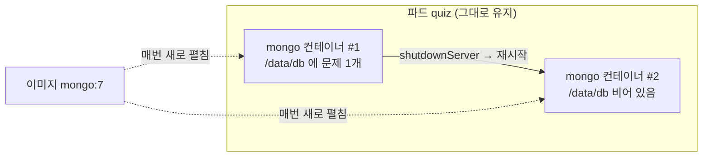
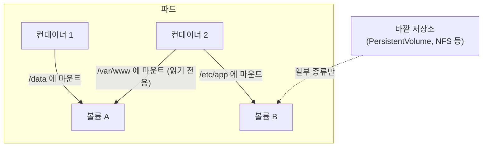

# 9.1 볼륨 이해하기

[5.1절](<../05장. 다중 컨테이너 파드와 객체 상태/5.1 다중 컨테이너 파드 실행하기.md>)에서 두 컨테이너가 `emptyDir`로 파일을 주고받는 모습을 잠깐 봤습니다. 그때는 "9장에서 자세히"라고 미뤄 두었습니다. 이 장에서 그 이야기를 회수합니다.

출발점은 단순한 사실 하나입니다. **컨테이너가 다시 시작되면, 그 안에 쓴 파일은 사라집니다.** 이 문제를 푸는 장치가 **볼륨(Volume)** 입니다.

> **"파드가 살아 있으면 파일도 살아 있는 것 아닌가요?"**
> 아닙니다. 파드는 그대로여도 **컨테이너는 새로 만들어집니다.** 컨테이너의 파일 시스템은 이미지에서 매번 새로 펼쳐지므로, 이전 컨테이너가 쓴 파일은 따라오지 않습니다.

## 볼륨은 언제 필요할까요?

### 컨테이너 재시작에 파일이 날아가는 것을 직접 봅니다

이 장의 예제는 **퀴즈(quiz)** 앱입니다. 파드 하나에 컨테이너가 둘 들어 있습니다.

* `quiz-api` — 퀴즈 문제를 HTTP로 내주는 API 서버
* `mongo` — 문제를 저장하는 MongoDB

먼저 볼륨 없이 띄웁니다.

**pod.quiz.novolume.yaml**

```yaml
apiVersion: v1
kind: Pod
metadata:
  name: quiz
spec:
  containers:
  - name: quiz-api
    image: docker.io/luksa/quiz-api:0.1
    imagePullPolicy: IfNotPresent
    ports:
    - name: http
      containerPort: 8080
  - name: mongo
    image: docker.io/library/mongo:7     # 데이터는 /data/db 에 씀
```

```bash
kubectl apply -f pod.quiz.novolume.yaml
kubectl get pod quiz
```

```
NAME   READY   STATUS    RESTARTS   AGE
quiz   2/2     Running   0          22s
```

MongoDB에 문제 하나를 넣고 개수를 셉니다.

```bash
kubectl exec -it quiz -c mongo -- mongosh kiada <<EOF
db.questions.insertOne({
  id: 1,
  text: "What does k8s mean?",
  answers: ["Kates", "Kubernetes", "Kooba Dooba Doo!"],
  correctAnswerIndex: 1
})
EOF
kubectl exec quiz -c mongo -- mongosh kiada --quiet --eval "db.questions.countDocuments()"
```

```
1
```

이제 MongoDB를 스스로 종료시켜 **컨테이너만** 재시작되게 합니다.

```bash
kubectl exec quiz -c mongo -- mongosh admin --quiet --eval "db.shutdownServer()"
```

```
command terminated with exit code 137
```

`137`은 셸이 끊겨서 찍힌 값입니다. 서버가 내려가면서 exec 세션도 같이 죽었다는 뜻입니다. 컨테이너 자체는 정상 종료했습니다(`lastState.terminated.reason`이 `Completed`, `exitCode`가 `0`).

```bash
kubectl get pod quiz
```

```
NAME   READY   STATUS    RESTARTS     AGE
quiz   2/2     Running   1 (7s ago)   42s
```

`RESTARTS`가 `1`이 되었습니다. **파드는 42초째 그대로**입니다. 그런데 문제 개수를 다시 세면 이렇습니다.

```bash
kubectl exec quiz -c mongo -- mongosh kiada --quiet --eval "db.questions.countDocuments()"
```

```
0
```

API로 물어봐도 마찬가지입니다.

```bash
kubectl port-forward quiz 8080 &
curl localhost:8080/questions/random
```

```
ERROR: Question random not found
```

**파드는 살아 있는데 데이터가 사라졌습니다.** 새 `mongo` 컨테이너는 이미지에서 깨끗한 `/data/db`를 받았기 때문입니다.



### 볼륨을 쓰는 세 가지 이유

| 이유 | 예 | 이 장의 절 |
| :--- | :--- | :--- |
| **컨테이너 재시작 너머로 파일 지키기** | DB 데이터, 캐시 | 9.2 (파드 수명까지), 10장 (파드 너머까지) |
| **컨테이너끼리 파일 나누기** | 사이드카가 만든 파일을 웹 서버가 서빙 | 9.2 |
| **바깥의 파일을 컨테이너에 넣기** | 설정 파일, 인증서, 노드의 디렉터리, 다른 이미지의 파일 | 9.3, 9.4, 9.5 |

[6.2절](<../06장. 파드 생명주기와 컨테이너 상태 관리/6.2 라이브니스 프로브로 컨테이너 살려 두기.md>)의 라이브니스 프로브를 떠올려 보세요. 쿠버네티스는 컨테이너를 **아무 때나 다시 시작할 수 있다**고 가정합니다. 그러니 **재시작에 잃으면 안 되는 파일은 반드시 볼륨에 둬야 합니다.**

## 볼륨은 파드에 속하고, 컨테이너가 골라서 마운트합니다

볼륨은 두 군데에 나눠 적습니다.

* **`spec.volumes`** — 파드 수준. 볼륨의 **이름과 종류**를 정의합니다
* **`spec.containers[].volumeMounts`** — 컨테이너 수준. 어느 볼륨을 **어느 경로에** 붙일지 정합니다

```yaml
spec:
  volumes:                      # 파드가 가진 볼륨 목록
  - name: quiz-data             # 이름으로 연결
    emptyDir: {}                # 종류 (여기서는 emptyDir)
  containers:
  - name: mongo
    image: docker.io/library/mongo:7
    volumeMounts:               # 이 컨테이너가 붙일 볼륨
    - name: quiz-data           # 위의 이름
      mountPath: /data/db       # 컨테이너 안의 경로
```



이 구조에서 나오는 성질이 몇 가지 있습니다.

* **한 볼륨을 여러 컨테이너가 붙일 수 있습니다.** 경로는 컨테이너마다 달라도 됩니다
* **볼륨을 정의만 하고 안 붙이는 컨테이너도 있습니다.** 마운트하지 않은 컨테이너는 그 볼륨을 볼 수 없습니다
* **볼륨의 수명은 파드에 묶입니다.** 컨테이너가 재시작되어도 볼륨은 남습니다. 다만 파드가 지워졌을 때 **데이터까지 사라지느냐는 종류마다 다릅니다**

### `volumeMounts`에서 자주 쓰는 필드

| 필드 | 뜻 |
| :--- | :--- |
| **`name`** | `spec.volumes`의 볼륨 이름 |
| **`mountPath`** | 컨테이너 안에서 붙일 경로. 그 경로에 이미지가 원래 갖고 있던 파일은 **가려집니다** |
| **`readOnly`** | `true`면 읽기 전용. 기본값 `false` |
| **`subPath`** | 볼륨 전체가 아니라 **그 안의 파일 하나나 하위 디렉터리 하나**만 붙임 |
| **`subPathExpr`** | `subPath`에 `$(POD_NAME)` 같은 환경 변수를 넣고 싶을 때 |
| **`mountPropagation`** | 호스트와 컨테이너 사이에 하위 마운트를 전파할지 (특수 용도) |

> **`mountPath`는 덮어쓰는 게 아니라 가립니다.** 이미지에 `/etc/envoy/envoy.yaml`이 있어도 `/etc/envoy`에 볼륨을 붙이면 그 파일은 안 보입니다. 디렉터리 전체를 가리고 싶지 않다면 `subPath`로 파일 하나만 붙입니다. 9.5절에서 이 차이가 갱신 동작까지 바꾸는 것을 봅니다.

### 볼륨 종류 한눈에 보기

| 분류 | 종류 | 데이터 수명 | 다루는 곳 |
| :--- | :--- | :--- | :--- |
| **임시 저장** | `emptyDir` | 파드와 함께 사라짐 | 9.2 |
| **이미지 내용** | `image` | 읽기 전용, 파드를 새로 만들 때 다시 받음 | 9.3 |
| **노드 파일** | `hostPath` | 노드에 남음 | 9.4 |
| **설정·메타데이터** | `configMap`, `secret`, `downwardAPI`, `projected` | API 오브젝트에서 만들어짐 | 9.5 |
| **영속 저장** | `persistentVolumeClaim` | 파드와 무관하게 남음 | 10장에서 다룹니다 |
| **외부 드라이버** | `csi`, `nfs`, `iscsi` 등 | 저장소에 따라 다름 | 10장에서 다룹니다 |

> **클라우드 디스크를 파드에 직접 적는 방식은 사라졌습니다.** 책 1판 시절의 `gcePersistentDisk`, `awsElasticBlockStore` 같은 in-tree 볼륨은 대부분 CSI 드라이버로 옮겨졌거나 제거되었습니다. 지금은 PersistentVolumeClaim을 거쳐 CSI 드라이버를 쓰는 것이 기본입니다([10.2절](<../10장. PersistentVolume으로 데이터 영속화하기/10.2 PersistentVolume 동적으로 만들기.md>)에서 다룹니다).

## 요약 및 비유

| 개념 | 호텔 투숙 비유 | 기술적 의미 |
| :--- | :--- | :--- |
| **컨테이너** | 객실 | 이미지에서 펼친 격리된 실행 환경 |
| **컨테이너 재시작** | 객실 청소 후 재입실 | 파일 시스템이 이미지 상태로 돌아감 |
| **컨테이너 안의 파일** | 객실 책상에 둔 짐 | 청소하면 치워짐 |
| **파드** | 한 번의 투숙 예약 | 컨테이너들과 볼륨을 묶는 단위 |
| **볼륨** | 프런트에 맡긴 보관함 | 컨테이너 재시작에도 남는 저장 공간 |
| **`spec.volumes`** | 예약에 딸린 보관함 목록 | 파드 수준 볼륨 정의 |
| **`volumeMounts`** | 어느 방에 어느 보관함 열쇠를 줄지 | 컨테이너별 마운트 경로 |
| **`readOnly`** | 열람만 허락한 열쇠 | 읽기 전용 마운트 |

## 결론

* 컨테이너가 재시작되면 **이미지에서 파일 시스템을 새로 펼치므로** 이전에 쓴 파일은 사라집니다. 파드가 그대로여도 마찬가지입니다.
* 볼륨은 **`spec.volumes`(파드)에서 정의하고 `volumeMounts`(컨테이너)에서 붙입니다.** 이름으로 둘을 연결합니다.
* 한 볼륨을 **여러 컨테이너가 서로 다른 경로로** 붙일 수 있습니다. 파일 공유의 기본 수단입니다.
* `mountPath`에 원래 있던 이미지 파일은 **덮이는 게 아니라 가려집니다.** 파일 하나만 넣으려면 `subPath`를 씁니다.
* 볼륨의 수명은 파드에 묶이지만, **파드 삭제 후 데이터가 남는지는 종류마다 다릅니다.** `emptyDir`은 사라지고 `hostPath`·PersistentVolume은 남습니다.

## 공식 문서 업데이트 (2026년 10월 기준)

### 1) `gitRepo` 볼륨을 이제 쓸 수 없습니다

책 시절에는 `gitRepo`가 deprecated 상태로 목록에 남아 있었습니다. 지금은 **쿠버네티스 1.37에 `gitRepo` 볼륨 드라이버가 들어 있지 않습니다.** 공식 문서는 이 드라이버를 쓸 수 있었던 마지막 버전을 v1.35로 적고 있습니다.

대신 **init 컨테이너가 `emptyDir`에 `git clone`** 하고, 앱 컨테이너가 그 `emptyDir`을 마운트하는 방식을 권합니다(9.2절의 init 컨테이너 패턴과 같습니다).

참고: <https://kubernetes.io/docs/concepts/storage/volumes/#gitrepo>

### 2) 읽기 전용 마운트를 하위 마운트까지 강제할 수 있습니다

`readOnly: true`만으로는 그 경로 **아래에 따로 마운트된 파일 시스템**까지 읽기 전용이 되지는 않습니다. `recursiveReadOnly` 필드로 하위 마운트까지 읽기 전용으로 만들 수 있고, 이 기능은 **v1.33부터 stable**입니다. containerd v2.0 이상, CRI-O v1.30 이상 같은 런타임 지원이 필요합니다.

```yaml
volumeMounts:
- name: host-root
  mountPath: /host
  readOnly: true
  recursiveReadOnly: IfPossible     # Disabled / IfPossible / Enabled
```

참고: <https://kubernetes.io/docs/concepts/storage/volumes/#recursive-read-only-mounts>

## 출처

> 2026-10-05 공식 문서로 검증

* 원서: *Kubernetes in Action, Second Edition* 9장 — <https://livebook.manning.com/book/kubernetes-in-action-second-edition/>
* [Volumes](https://kubernetes.io/docs/concepts/storage/volumes/) — Kubernetes 공식 문서
* [Ephemeral Volumes](https://kubernetes.io/docs/concepts/storage/ephemeral-volumes/) — Kubernetes 공식 문서
