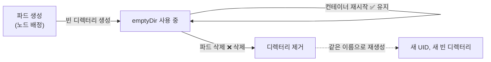
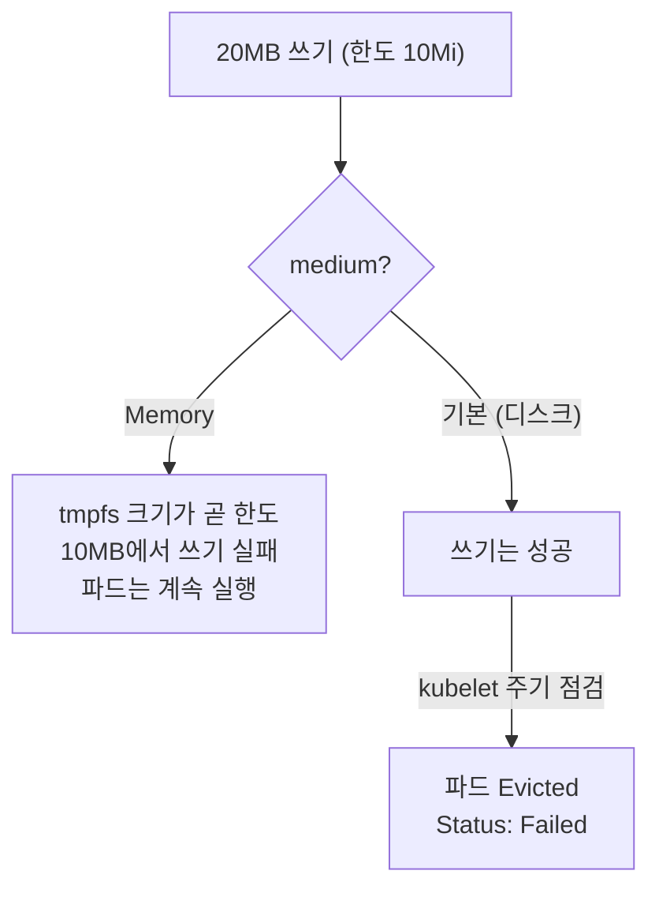
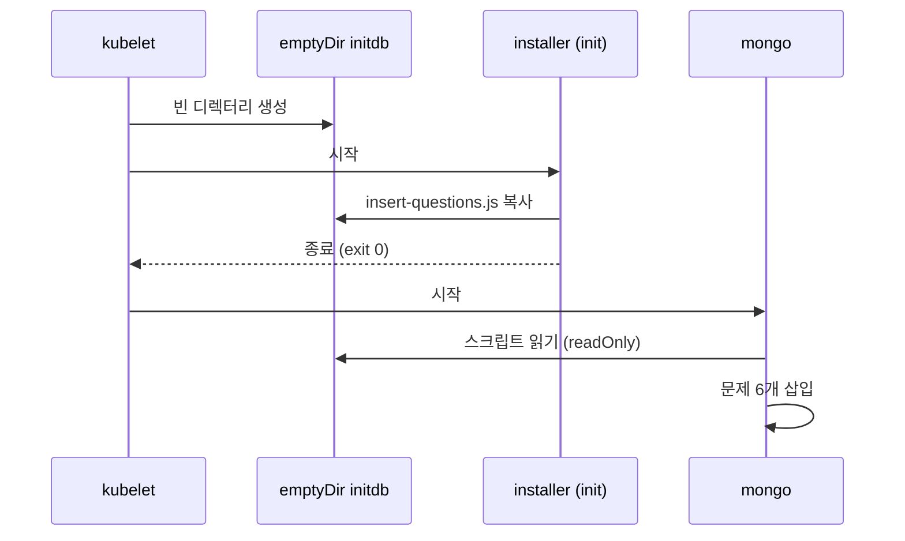

# 9.2 emptyDir 볼륨으로 파일 지키고 나누기

[9.1절](<9.1 볼륨 이해하기.md>)에서 MongoDB 컨테이너가 재시작되자 데이터가 사라졌습니다. 가장 간단한 처방은 **`emptyDir`** 입니다.

이름 그대로 **빈 디렉터리**로 시작하는 볼륨입니다. 파드가 노드에 배정될 때 만들어지고, **파드가 노드에서 사라질 때 함께 지워집니다.** 그 사이에는 컨테이너가 몇 번 재시작되든 남아 있습니다.

## 컨테이너가 재시작되어도 파일은 남습니다

### quiz 파드에 emptyDir 붙이기

**pod.quiz.emptydir.yaml**

```yaml
apiVersion: v1
kind: Pod
metadata:
  name: quiz
spec:
  volumes:
  - name: quiz-data
    emptyDir: {}                 # 옵션 없이 기본값
  containers:
  - name: quiz-api
    image: docker.io/luksa/quiz-api:0.1
    imagePullPolicy: IfNotPresent
    ports:
    - name: http
      containerPort: 8080
  - name: mongo
    image: docker.io/library/mongo:7
    volumeMounts:
    - name: quiz-data
      mountPath: /data/db        # MongoDB 데이터 디렉터리
```

9.1절과 똑같이 문제를 하나 넣고 MongoDB를 종료시킵니다.

```bash
kubectl apply -f pod.quiz.emptydir.yaml
kubectl exec -it quiz -c mongo -- mongosh kiada <<EOF
db.questions.insertOne({id: 1, text: "What does k8s mean?",
  answers: ["Kates", "Kubernetes", "Kooba Dooba Doo!"], correctAnswerIndex: 1})
EOF
kubectl exec quiz -c mongo -- mongosh admin --quiet --eval "db.shutdownServer()"
```

```
command terminated with exit code 137
```

```bash
kubectl get pod quiz
```

```
NAME   READY   STATUS    RESTARTS     AGE
quiz   2/2     Running   1 (9s ago)   19s
```

```bash
kubectl exec quiz -c mongo -- mongosh kiada --quiet --eval "db.questions.countDocuments()"
```

```
1
```

**이번에는 `1`이 남았습니다.** 새 `mongo` 컨테이너가 같은 `emptyDir`을 다시 붙였기 때문입니다. API도 문제를 돌려줍니다.

```bash
curl localhost:8080/questions/random                # port-forward 해 둔 상태
```

```
{"id":1,"text":"What does k8s mean?","correctAnswerIndex":1,"answers":["Kates","Kubernetes","Kooba Dooba Doo!"]}
```

### emptyDir은 노드의 디렉터리입니다

컨테이너 안에서 보면 그냥 디스크입니다.

```bash
kubectl exec quiz -c mongo -- df -h /data/db
```

```
Filesystem      Size  Used Avail Use% Mounted on
/dev/sdd       1007G  6.4G  950G   1% /data/db
```

실제 위치는 **노드의 kubelet 디렉터리 아래**입니다. 경로에 파드의 UID가 들어갑니다.

```bash
kubectl get pod quiz -o jsonpath='{.metadata.uid}'
podman exec kia-control-plane ls \
  /var/lib/kubelet/pods/8c1a2121-d170-4251-bdf9-6d5a74e55ae1/volumes/kubernetes.io~empty-dir/quiz-data
```

```
WiredTiger
WiredTiger.lock
WiredTiger.turtle
WiredTiger.wt
WiredTigerHS.wt
```

```
/var/lib/kubelet/pods/<파드 UID>/volumes/kubernetes.io~empty-dir/<볼륨 이름>
                      +-- 파드마다 다름     +-- 볼륨 종류           +-- spec.volumes[].name
```

### 파드를 지우면 함께 사라집니다

```bash
kubectl delete pod quiz
podman exec kia-control-plane ls /var/lib/kubelet/pods/8c1a2121-d170-4251-bdf9-6d5a74e55ae1
```

```
ls: cannot access '/var/lib/kubelet/pods/8c1a2121-d170-4251-bdf9-6d5a74e55ae1': No such file or directory
```

같은 매니페스트로 다시 만들면 문제 개수는 `0`입니다. **이름이 같아도 새 파드는 새 UID, 새 `emptyDir`을 받습니다.**



> **emptyDir은 "파드 수명만큼"의 저장소입니다.** 컨테이너 크래시에는 안전하지만, 파드가 지워지거나 노드가 고장 나면 데이터가 없어집니다. DB처럼 파드보다 오래 살아야 하는 데이터는 PersistentVolume으로 보내야 합니다([10.1절](<../10장. PersistentVolume으로 데이터 영속화하기/10.1 쿠버네티스의 영속 스토리지 이해하기.md>)에서 다룹니다).

## emptyDir의 두 가지 옵션 — `medium`과 `sizeLimit`

| 필드 | 값 | 효과 |
| :--- | :--- | :--- |
| **`medium`** | `""` (기본) | 노드의 디스크에 만듦 |
| | `Memory` | **tmpfs(RAM)** 에 만듦. 빠르지만 메모리를 씀 |
| **`sizeLimit`** | 예: `10Mi` | 볼륨이 쓸 수 있는 최대 크기 |

두 경우에 `sizeLimit`이 **완전히 다르게** 동작합니다. 둘 다 10Mi 한도에 20MB를 써 봅니다.

### `medium: Memory` — 쓰는 순간 막힙니다

**emptydir-memory.yaml**

```yaml
apiVersion: v1
kind: Pod
metadata:
  name: emptydir-memory
spec:
  volumes:
  - name: cache
    emptyDir:
      medium: Memory             # tmpfs
      sizeLimit: 10Mi
  containers:
  - name: main
    image: docker.io/library/busybox
    command: ["sleep", "infinity"]
    volumeMounts:
    - name: cache
      mountPath: /cache
```

```bash
kubectl exec emptydir-memory -- df -h /cache
kubectl exec emptydir-memory -- mount | grep /cache
```

```
Filesystem                Size      Used Available Use% Mounted on
tmpfs                    10.0M         0     10.0M   0% /cache
```

```
tmpfs on /cache type tmpfs (rw,relatime,size=10240k,noswap)
```

`sizeLimit`이 **tmpfs의 크기(`size=10240k`)** 로 그대로 들어갔습니다.

```bash
kubectl exec emptydir-memory -- dd if=/dev/zero of=/cache/big bs=1M count=20
```

```
dd: error writing '/cache/big': No space left on device
11+0 records in
10+0 records out
10485760 bytes (10.0MB) copied, 0.006079 seconds, 1.6GB/s
command terminated with exit code 1
```

정확히 10MB에서 **`No space left on device`** 로 멈춥니다. 파드는 멀쩡합니다.

> **메모리 emptyDir에 쓴 파일은 컨테이너의 메모리 사용량으로 잡힙니다.** 공식 문서의 설명입니다. 컨테이너에 메모리 limit이 있다면 볼륨에 많이 쓸수록 OOM에 가까워집니다. `sizeLimit`을 안 주면 노드의 할당 가능 메모리만큼 커질 수 있으니 **메모리 emptyDir에는 `sizeLimit`을 꼭 적으세요.**

### 디스크 emptyDir — 일단 써지고, 나중에 쫓겨납니다

**emptydir-sizelimit.yaml**

```yaml
apiVersion: v1
kind: Pod
metadata:
  name: emptydir-sizelimit
spec:
  volumes:
  - name: scratch
    emptyDir:
      sizeLimit: 10Mi            # medium 없음 → 디스크
  containers:
  - name: main
    image: docker.io/library/busybox
    command: ["sleep", "infinity"]
    volumeMounts:
    - name: scratch
      mountPath: /scratch
```

이번에는 `df`에 한도가 보이지 않습니다. 노드 디스크 전체(`1006.9G`)가 그대로 나옵니다. 20MB를 쓰는 `dd`도 **성공(exit 0)** 합니다. 그런데 1분쯤 지나면 이렇게 됩니다.

```bash
kubectl get pod emptydir-sizelimit
```

```
NAME                 READY   STATUS   RESTARTS   AGE
emptydir-sizelimit   0/1     Error    0          67s
```

```bash
kubectl describe pod emptydir-sizelimit
```

```
Status:           Failed
Reason:           Evicted
Message:          Usage of EmptyDir volume "scratch" exceeds the limit "10Mi".
...
  Warning  Evicted    6s    kubelet            Usage of EmptyDir volume "scratch" exceeds the limit "10Mi".
  Normal   Killing    6s    kubelet            spec.containers{main}: Stopping container main
```

**파드 전체가 `Evicted`로 쫓겨났습니다.** kubelet이 주기적으로 사용량을 재다가 한도를 넘은 것을 발견하고 파드를 내보낸 것입니다. 디스크 emptyDir은 **로컬 임시 저장소(local ephemeral storage)** 로 계산되기 때문입니다. 반대로 tmpfs emptyDir은 이 계산에서 빠지고 메모리로 잡힙니다.



> **디스크 emptyDir의 `sizeLimit`은 "넘으면 파드를 내보낸다"는 약속입니다.** 파일 시스템이 쓰기를 막아 주지 않습니다. 쫓겨난 파드는 다시 시작되지 않으므로(`Failed`), 단독 파드라면 그대로 끝입니다. 컨트롤러가 관리하는 파드라면 새 파드가 만들어지지만 **빈 emptyDir** 로 시작합니다.

## init 컨테이너로 emptyDir을 미리 채웁니다

emptyDir은 빈 채로 시작합니다. 앱이 뜨기 전에 파일이 있어야 한다면 **init 컨테이너가 채워 두면 됩니다.** [5.2절](<../05장. 다중 컨테이너 파드와 객체 상태/5.2 초기화 컨테이너와 파드 삭제.md>)의 init 컨테이너가 여기서 진짜 쓸모를 보입니다.

MongoDB 이미지는 시작할 때 `/docker-entrypoint-initdb.d/` 안의 스크립트를 실행합니다. 이 디렉터리를 emptyDir로 만들고, init 컨테이너가 문제 삽입 스크립트를 복사해 넣습니다.

**pod.quiz.emptydir.init.yaml**

```yaml
apiVersion: v1
kind: Pod
metadata:
  name: quiz
spec:
  volumes:
  - name: initdb                 # init 스크립트 전달용
    emptyDir: {}
  - name: quiz-data              # DB 데이터용
    emptyDir: {}
  initContainers:
  - name: installer
    image: docker.io/luksa/quiz-initdb-script-installer:0.1
    imagePullPolicy: IfNotPresent
    volumeMounts:
    - name: initdb
      mountPath: /initdb.d       # 여기에 스크립트를 복사
  containers:
  - name: quiz-api
    image: docker.io/luksa/quiz-api:0.1
    imagePullPolicy: IfNotPresent
    ports:
    - name: http
      containerPort: 8080
  - name: mongo
    image: docker.io/library/mongo:7
    volumeMounts:
    - name: quiz-data
      mountPath: /data/db
    - name: initdb
      mountPath: /docker-entrypoint-initdb.d/   # 같은 볼륨, 다른 경로
      readOnly: true
```

```bash
kubectl apply -f pod.quiz.emptydir.init.yaml
kubectl logs quiz -c installer
```

```
Successfully copied insert-questions.js to /initdb.d
```

```bash
kubectl exec quiz -c mongo -- ls -l /docker-entrypoint-initdb.d/
```

```
total 4
-rw-r--r-- 1 root root 2361 Oct  5 09:25 insert-questions.js
```

```bash
kubectl exec quiz -c mongo -- mongosh kiada --quiet --eval "db.questions.countDocuments()"
```

```
6
```

**손으로 넣지 않았는데 문제가 6개 있습니다.** init 컨테이너는 `/initdb.d`에, `mongo`는 `/docker-entrypoint-initdb.d/`에 붙였지만 **같은 볼륨**이라 같은 파일이 보입니다. `describe`로 보면 installer는 `Completed`(`Exit Code: 0`)로 끝나 있습니다.



### 스크립트 이미지를 따로 만들기 싫다면

파일 내용이 짧으면 init 컨테이너의 명령에 바로 적어도 됩니다.

**pod.demo-emptydir-inline.yaml**

```yaml
apiVersion: v1
kind: Pod
metadata:
  name: demo-emptydir-inline
spec:
  volumes:
  - name: my-volume
    emptyDir: {}
  initContainers:
  - name: my-volume-initializer
    image: docker.io/library/busybox
    command:
    - sh
    - -c
    - |
      cat <<EOF > /mnt/my-volume/my-file.txt
      line 1: This is a multi-line file
      line 2: Written from an init container
      line 3: Defined inline in the Pod manifest
      EOF
    volumeMounts:
    - name: my-volume
      mountPath: /mnt/my-volume
  containers:
  - name: main
    image: docker.io/library/busybox
    command: ["sh", "-c", "cat /app/my-file.txt && sleep infinity"]
    volumeMounts:
    - name: my-volume
      mountPath: /app
```

```bash
kubectl logs demo-emptydir-inline
```

```
Defaulted container "main" out of: main, my-volume-initializer (init)
line 1: This is a multi-line file
line 2: Written from an init container
line 3: Defined inline in the Pod manifest
```

> **설정 파일을 이렇게 매니페스트에 박아 넣는 것은 임시방편입니다.** 내용을 바꾸려면 파드를 다시 만들어야 합니다. 설정 파일은 ConfigMap 볼륨으로 넣는 것이 정석입니다(9.5절). 이미지에 든 파일을 꺼내는 일이라면 이미지 볼륨이 더 간단합니다(9.3절).

## 컨테이너끼리 파일을 나눕니다

emptyDir의 두 번째 쓰임은 공유입니다. **quote** 파드는 컨테이너 둘이 일을 나눕니다.

* `quote-writer` — 60초마다 인용문 하나를 골라 파일로 씀
* `nginx` — 그 파일을 HTTP로 내줌

**pod.quote.yaml**

```yaml
apiVersion: v1
kind: Pod
metadata:
  name: quote
spec:
  volumes:
  - name: shared
    emptyDir: {}
  containers:
  - name: quote-writer
    image: docker.io/luksa/quote-writer:0.1
    imagePullPolicy: IfNotPresent
    volumeMounts:
    - name: shared
      mountPath: /var/local/output        # 쓰는 쪽
  - name: nginx
    image: docker.io/library/nginx:alpine
    volumeMounts:
    - name: shared
      mountPath: /usr/share/nginx/html    # 읽는 쪽 (nginx 문서 루트)
      readOnly: true
    ports:
    - name: http
      containerPort: 80
```

```bash
kubectl logs quote -c quote-writer
```

```
Quote Writer 0.1
Configured to write quote from /book-quotes.txt to /var/local/output/quote every 60 seconds
Mon Oct  5 09:25:17 UTC 2026 Writing fortune...
Mon Oct  5 09:26:17 UTC 2026 Writing fortune...
```

```bash
kubectl exec quote -c nginx -- ls -l /usr/share/nginx/html
```

```
total 4
-rw-r--r--    1 root     root           268 Oct  5 09:26 quote
```

writer가 `/var/local/output/quote`에 쓴 파일이 nginx 쪽에서는 `/usr/share/nginx/html/quote`로 보입니다.

```bash
kubectl port-forward quote 8080:80 &
curl -i localhost:8080/quote
```

```
HTTP/1.1 200 OK
Server: nginx/1.31.6
Date: Mon, 05 Oct 2026 09:27:28 GMT
Content-Type: application/octet-stream
```

본문에는 책의 한 문장이 들어 있고, 1분마다 바뀝니다.

`nginx`는 `readOnly: true`로 붙였으므로 쓸 수 없습니다.

```bash
kubectl exec quote -c nginx -- touch /usr/share/nginx/html/x
```

```
touch: /usr/share/nginx/html/x: Read-only file system
command terminated with exit code 1
```

> **읽기만 하는 쪽은 `readOnly: true`로 붙이는 습관을 들이세요.** 같은 볼륨이라도 마운트마다 읽기/쓰기를 따로 정할 수 있습니다. 웹 서버가 뚫려도 콘텐츠를 바꾸지 못하게 막는 작은 방어선입니다.

## 요약 및 비유

| 개념 | 회의실 화이트보드 비유 | 기술적 의미 |
| :--- | :--- | :--- |
| **emptyDir** | 회의실에 놓인 빈 화이트보드 | 파드 배정 시 생기는 빈 디렉터리 |
| **컨테이너 재시작** | 참석자가 잠깐 나갔다 들어옴 | 볼륨은 그대로, 내용 유지 |
| **파드 삭제** | 회의 종료 후 보드 지움 | 노드에서 디렉터리 삭제 |
| **`medium: Memory`** | 포스트잇 보드 (빠르지만 칸이 정해짐) | tmpfs, 한도에서 쓰기 실패 |
| **디스크 `sizeLimit`** | "보드 절반만 쓰세요" 안내문 | 넘으면 나중에 파드 축출 |
| **init 컨테이너로 채우기** | 회의 전에 안건을 미리 적어 둠 | 앱 시작 전 파일 준비 |
| **두 컨테이너 공유** | 한 사람은 쓰고 한 사람은 읽음 | 같은 볼륨을 다른 경로로 마운트 |
| **`readOnly: true`** | 읽는 사람에게는 마커를 안 줌 | 마운트별 읽기 전용 |

## 결론

* **emptyDir은 컨테이너 재시작에는 살아남고, 파드 삭제와 함께 사라집니다.** 같은 이름으로 다시 만들어도 새 UID, 새 빈 디렉터리입니다.
* 실체는 노드의 **`/var/lib/kubelet/pods/<UID>/volumes/kubernetes.io~empty-dir/<이름>`** 입니다.
* `medium: Memory`면 **tmpfs의 크기가 곧 `sizeLimit`** 이라 한도에서 쓰기가 실패합니다. 쓴 만큼 컨테이너 메모리로 잡힙니다.
* 디스크 emptyDir의 `sizeLimit`은 **쓰기를 막지 않습니다.** 넘으면 kubelet이 나중에 **파드를 `Evicted`로 내보냅니다.**
* 빈 볼륨을 미리 채울 때는 **init 컨테이너**, 컨테이너끼리 파일을 나눌 때는 **같은 볼륨을 각자 경로로** 붙이고, 읽는 쪽은 `readOnly: true`로 둡니다.

## 공식 문서 업데이트 (2026년 10월 기준)

### 1) emptyDir 디렉터리의 권한을 정할 수 있습니다 (1.37 알파)

책 시절의 emptyDir은 항상 `0777` 권한으로 만들어졌습니다. 1.37에서 **`emptyDir.mode`** 필드가 **알파**로 들어왔습니다. `EmptyDirVolumeMode` 기능 게이트를 켜야 쓸 수 있습니다.

```yaml
volumes:
- name: shared
  emptyDir:
    mode: 0750          # 0000 ~ 01777, 지정 안 하면 0777
```

`fsGroup`을 함께 쓰면 그룹 권한은 `fsGroup` 쪽이 우선합니다. 윈도우에서는 효과가 없습니다.

참고: <https://kubernetes.io/docs/concepts/storage/volumes/#emptydir>

### 2) 메모리 emptyDir의 크기를 재시작 없이 바꾸는 기능이 실험 중입니다 (1.37 알파)

`InPlacePodVerticalScalingMemoryBackedVolumes` 기능 게이트를 켜면, In-Place Pod Resize로 메모리를 조정할 때 `medium: Memory` emptyDir의 `sizeLimit`도 **파드나 컨테이너를 재시작하지 않고** 바꿀 수 있습니다. 기본값은 꺼져 있습니다.

참고: <https://kubernetes.io/docs/concepts/configuration/manage-resources-containers/>

## 출처

> 2026-10-05 공식 문서로 검증

* 원서: *Kubernetes in Action, Second Edition* 9장 — <https://livebook.manning.com/book/kubernetes-in-action-second-edition/>
* [Volumes](https://kubernetes.io/docs/concepts/storage/volumes/) — Kubernetes 공식 문서
* [Ephemeral Volumes](https://kubernetes.io/docs/concepts/storage/ephemeral-volumes/) — Kubernetes 공식 문서
* [Resource Management for Pods and Containers](https://kubernetes.io/docs/concepts/configuration/manage-resources-containers/) — Kubernetes 공식 문서
* [Local ephemeral storage](https://kubernetes.io/docs/concepts/storage/ephemeral-storage/) — Kubernetes 공식 문서
