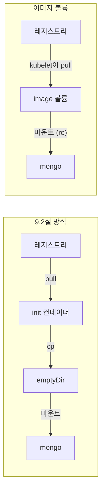

# 9.3 컨테이너 이미지를 볼륨으로 마운트하기

[9.2절](<9.2 emptyDir 볼륨으로 파일 지키고 나누기.md>)에서는 init 컨테이너가 이미지 안의 스크립트를 emptyDir로 **복사**했습니다. 파일 하나 옮기자고 컨테이너를 하나 더 띄운 셈입니다.

**이미지에 든 파일을 그대로 마운트할 수는 없을까요?** 그것이 **이미지 볼륨(image volume)** 입니다. [4.2절](<../04장. 파드로 애플리케이션 실행하기/4.2 YAML로 파드 만들기.md>)에서 1.36에 정식(GA)이 되었다고 짧게 소개한 그 기능입니다.

## 이미지 볼륨은 이미지의 파일 시스템을 읽기 전용으로 붙입니다

### 실행할 수 없는 "데이터 전용" 이미지

이번에 쓸 `docker.io/luksa/quiz-questions` 이미지는 실행용이 아닙니다. 레이어가 하나뿐이고, 명령도 없습니다.

```bash
podman history docker.io/luksa/quiz-questions:latest
```

```
ID            CREATED        CREATED BY                             SIZE        COMMENT
906a8a15598f  15 months ago  COPY insert-questions.js / # buildkit  4.1kB       buildkit.dockerfile.v0
```

```bash
podman image inspect docker.io/luksa/quiz-questions:latest \
  --format '{{.Config.Cmd}} {{.Config.Entrypoint}}'
```

```
[] []
```

`COPY insert-questions.js /` 한 줄로 만든, **파일 하나를 담은 상자**입니다. 이렇게 만든 이미지는 다른 이미지와 똑같이 레지스트리에 올리고, 태그로 버전을 매기고, 서명할 수 있습니다. 그래서 **AI 모델 가중치, 데이터셋, 정적 콘텐츠**를 배포하는 수단으로 쓰입니다.

### init 컨테이너 대신 이미지 볼륨으로

**pod.quiz.imagevolume.yaml**

```yaml
apiVersion: v1
kind: Pod
metadata:
  name: quiz
spec:
  volumes:
  - name: initdb
    image:                                         # 이미지 볼륨
      reference: luksa/quiz-questions:latest       # = docker.io/luksa/quiz-questions:latest
      pullPolicy: Always                           # Always / IfNotPresent / Never
  - name: quiz-data
    emptyDir: {}
  containers:
  - name: quiz-api
    image: luksa/quiz-api:0.1                      # 원서 예제 그대로 짧은 이름 (아래 이벤트와 맞춤)
    imagePullPolicy: IfNotPresent
    ports:
    - name: http
      containerPort: 8080
  - name: mongo
    image: mongo:7                                 # = docker.io/library/mongo:7
    volumeMounts:
    - name: quiz-data
      mountPath: /data/db
    - name: initdb
      mountPath: /docker-entrypoint-initdb.d/
      readOnly: true
```

9.2절의 `pod.quiz.emptydir.init.yaml`과 비교하면 **`initContainers`가 통째로 사라졌습니다.**

```bash
kubectl apply -f pod.quiz.imagevolume.yaml
kubectl get pod quiz
```

```
NAME   READY   STATUS    RESTARTS   AGE
quiz   2/2     Running   0          5s
```

```bash
kubectl describe pod quiz
```

```
Volumes:
  initdb:
    Type:        Image (a container image or OCI artifact)
    Reference:   luksa/quiz-questions:latest
    PullPolicy:  Always
...
Events:
  Normal  Pulling    4s    kubelet            Pulling image "luksa/quiz-questions:latest"
  Normal  Pulled     1s    kubelet            Successfully pulled image "luksa/quiz-questions:latest" in 3.331s (3.331s including waiting). Image size: 1816 bytes.
  Normal  Pulled     1s    kubelet            spec.containers{quiz-api}: Container image "luksa/quiz-api:0.1" already present on machine and can be accessed by the pod
```

`Type: Image (a container image or OCI artifact)`로 보입니다. 이미지 볼륨을 받는 이벤트에는 `spec.containers{...}` 표시가 **없습니다.** 컨테이너가 아니라 볼륨이 받는 이미지라서 그렇습니다. 받은 이미지는 노드의 이미지 목록에도 일반 이미지처럼 올라옵니다.

```bash
podman exec kia-control-plane crictl images | grep quiz-questions
```

```
docker.io/luksa/quiz-questions                       latest               906a8a15598fc       1.82kB
```

컨테이너 안에서 확인합니다.

```bash
kubectl exec quiz -c mongo -- ls -l /docker-entrypoint-initdb.d/
kubectl exec quiz -c mongo -- mongosh kiada --quiet --eval "db.questions.countDocuments()"
```

```
total 4
-rw-rw-r-- 1 root root 2361 Mar 14  2022 insert-questions.js
```

```
6
```

파일 날짜가 `Mar 14  2022`입니다. 9.2절에서 init 컨테이너가 복사한 파일은 복사한 시각(`Oct  5 09:25`)이었습니다. **복사본이 아니라 이미지 안의 원본**이 보이는 것입니다.



### 항상 읽기 전용입니다

마운트 정보를 보면 컨테이너 런타임이 이미지 스냅샷을 **`ro` overlay**로 붙였습니다.

```bash
kubectl exec quiz -c mongo -- sh -c 'mount | grep initdb'
```

```
overlay on /docker-entrypoint-initdb.d type overlay (ro,relatime,lowerdir=/var/lib/containerd/io.containerd.snapshotter.v1.overlayfs/snapshots/274/fs,upperdir=...)
```

```bash
kubectl exec quiz -c mongo -- touch /docker-entrypoint-initdb.d/x
```

```
touch: cannot touch '/docker-entrypoint-initdb.d/x': Read-only file system
command terminated with exit code 1
```

**`readOnly: false`로 적으면 어떻게 될까요?** 거부되지 않습니다. 그냥 무시됩니다.

**imagevol-rw.yaml** (발췌)

```yaml
    volumeMounts:
    - name: data
      mountPath: /data
      readOnly: false            # 쓰기를 요청해 봄
```

```
imagevol-rw            1/1     Running            0          26s
```

```
overlay on /data type overlay (ro,relatime,...)
touch: /data/x: Read-only file system
```

> **이미지 볼륨에 쓰고 싶다면 방법을 바꿔야 합니다.** 어떤 값을 줘도 읽기 전용입니다. 파일을 고쳐 써야 한다면 9.2절처럼 init 컨테이너가 emptyDir로 **복사한 뒤** 그 복사본을 쓰세요.

## 받지 못하면 컨테이너가 시작되지 않습니다

없는 태그를 가리키게 해 봅니다.

**imagevol-bad.yaml**

```yaml
apiVersion: v1
kind: Pod
metadata:
  name: imagevol-bad
spec:
  volumes:
  - name: data
    image:
      reference: docker.io/luksa/quiz-questions:no-such-tag    # 없는 태그
  containers:
  - name: main
    image: docker.io/library/busybox
    command: ["sleep", "infinity"]
    volumeMounts:
    - name: data
      mountPath: /data
```

```bash
kubectl get pod imagevol-bad
```

```
NAME           READY   STATUS             RESTARTS   AGE
imagevol-bad   0/1     ImagePullBackOff   0          26s
```

```bash
kubectl describe pod imagevol-bad
```

```
  Normal   BackOff    24s                kubelet            Back-off pulling image "docker.io/luksa/quiz-questions:no-such-tag"
  Warning  Failed     24s                kubelet            spec.containers{main}: Error: ImagePullBackOff
  Normal   Pulling    12s (x2 over 26s)  kubelet            Pulling image "docker.io/luksa/quiz-questions:no-such-tag"
  Warning  Failed     11s (x2 over 24s)  kubelet            Failed to pull image "docker.io/luksa/quiz-questions:no-such-tag": rpc error: code = NotFound desc = failed to pull and unpack image "docker.io/luksa/quiz-questions:no-such-tag": failed to resolve reference "docker.io/luksa/quiz-questions:no-such-tag": docker.io/luksa/quiz-questions:no-such-tag: not found
  Warning  Failed     11s (x2 over 24s)  kubelet            spec.containers{main}: Error: ErrImagePull
```

> **상태는 `main` 컨테이너의 `ImagePullBackOff`로 보입니다.** `busybox` 이미지에는 아무 문제가 없는데도 그렇습니다. 메시지에 찍힌 **이미지 이름이 컨테이너 이미지인지, 볼륨 이미지인지** 확인해야 원인을 바로 찾습니다.

이 클러스터에서는 40초가 지나도 파드 `phase`가 `Pending`이었고, kubelet이 계속 다시 받으려고 했습니다. 공식 문서는 받기에 실패하면 파드가 `Failed`가 된다고 설명하면서도, 실패는 **볼륨 백오프 규칙에 따라 재시도된다**고 함께 적고 있습니다. 이 실험은 `pullPolicy`를 생략했고 태그가 `latest`가 아니므로 `IfNotPresent`로 동작했습니다.

### `pullPolicy` — 컨테이너 이미지와 같은 규칙입니다

| 값 | 동작 |
| :--- | :--- |
| `Always` | 항상 받음 |
| `IfNotPresent` | 노드에 없을 때만 받음 |
| `Never` | 받지 않음. 노드에 없으면 실패 |

생략하면 **`:latest` 태그일 때 `Always`, 그 밖에는 `IfNotPresent`** 입니다. 이미지는 **파드를 시작할 때 한 번** 받습니다. 레지스트리의 이미지가 바뀌어도 실행 중인 파드에는 반영되지 않고, **파드를 지우고 다시 만들어야** 새 내용을 받습니다.

## `subPath`는 디렉터리만 됩니다 (containerd)

파일 하나만 특정 경로에 꽂고 싶어서 `subPath`에 파일 이름을 줘 봤습니다.

**imagevol-subpath.yaml** (발췌)

```yaml
    volumeMounts:
    - name: data
      mountPath: /questions.js
      subPath: insert-questions.js     # 파일을 지정
```

```
NAME               READY   STATUS                 RESTARTS   AGE
imagevol-subpath   0/1     CreateContainerError   0          8s
```

```
Warning  Failed  9s (x2 over 11s)  kubelet  spec.containers{main}: Error: failed to mount image volume: ImageVolumeMountFailed: failed to ensure image subpath "insert-questions.js" in "/run/containerd/io.containerd.grpc.v1.cri/image-volumes/7332.../0d6c...": only directory subpath is supported, subpath: "insert-questions.js", mountpoint: "..."
```

**`only directory subpath is supported`** — 이 클러스터의 containerd 2.3.4는 이미지 볼륨에서 **디렉터리 `subPath`만** 받아 줍니다. 공식 문서의 `subPath` 예제도 디렉터리(`dir`)를 가리킵니다. 파일을 골라 붙이려면 이미지 안에서 디렉터리 단위로 나눠 두세요.

> **어떤 이미지·아티팩트를 받을 수 있는지는 런타임이 정합니다.** 공식 문서는 최소한 컨테이너 `image` 필드가 받는 형식은 모두 지원해야 한다고만 정합니다. 그 밖의 OCI 아티팩트 지원이나 `subPath` 제약은 containerd, CRI-O마다 다를 수 있습니다.

## 요약 및 비유

| 개념 | 시험지 배부 비유 | 기술적 의미 |
| :--- | :--- | :--- |
| **데이터 전용 이미지** | 인쇄소에서 봉인해 보낸 시험지 묶음 | 파일만 담은 OCI 이미지 |
| **레지스트리** | 인쇄소 | 이미지 저장소 |
| **image 볼륨** | 봉투째 책상에 올려 둔 시험지 | 이미지 파일 시스템을 볼륨으로 마운트 |
| **읽기 전용** | 시험지에 답을 쓰면 안 됨 | 항상 `ro`, `readOnly: false`도 무시 |
| **init 컨테이너 복사 방식** | 조교가 시험지를 베껴 나눠 줌 | 이미지 → emptyDir 복사 |
| **`pullPolicy`** | 매번 인쇄소에 새로 받을지 | 컨테이너 이미지와 같은 규칙 |
| **없는 태그** | 시험지가 안 와서 시험 시작 못 함 | 컨테이너가 `ImagePullBackOff` |
| **디렉터리 `subPath`** | 과목별 봉투만 골라 줄 수 있음 | containerd는 파일 `subPath` 거부 |

## 결론

* 이미지 볼륨은 **이미지의 파일 시스템을 그대로** 파드에 붙입니다. init 컨테이너로 복사할 필요가 없습니다.
* **항상 읽기 전용**입니다. `readOnly: false`를 적어도 에러 없이 `ro`로 붙습니다.
* 볼륨 이미지를 못 받으면 컨테이너가 시작되지 못하고, 상태는 **컨테이너의 `ErrImagePull`/`ImagePullBackOff`처럼** 보입니다. 메시지의 이미지 이름으로 구분하세요.
* 이미지는 **파드 시작 때 한 번** 받습니다. 새 내용을 쓰려면 파드를 다시 만들어야 합니다.
* containerd에서는 **디렉터리 `subPath`만** 됩니다. 파일을 지정하면 `CreateContainerError`가 납니다.

## 공식 문서 업데이트 (2026년 10월 기준)

### 1) 이미지 볼륨은 책 이후에 생겨 1.36에 정식이 된 기능입니다 (핵심 변화)

책이 기준으로 삼은 1.24~1.27에는 이 볼륨 종류가 없었습니다. **v1.31에 알파로 처음 들어왔고, v1.36에 stable(기본 켜짐)** 이 되었습니다. 그 사이 v1.33부터 `subPath`/`subPathExpr`을 쓸 수 있게 되었습니다. 이 클러스터(v1.37.0, containerd 2.3.4)에서는 기능 게이트 없이 바로 동작했습니다.

`spec.securityContext.fsGroupChangePolicy`는 이 볼륨에 효과가 없습니다. `AlwaysPullImages` 승인 컨트롤러는 컨테이너 이미지처럼 이 볼륨에도 적용됩니다.

참고: <https://kubernetes.io/docs/concepts/storage/volumes/#image>

### 2) 사용 중인 볼륨 이미지의 다이제스트를 상태에 기록하는 기능이 알파입니다

`ImageVolumeWithDigest` 기능 게이트(**v1.35 알파, 기본 꺼짐**)를 켜면, kubelet이 컨테이너 상태의 `volumeMounts`에 실제로 쓰인 이미지 다이제스트(`imageRef`)를 남깁니다. `latest` 같은 움직이는 태그를 쓸 때 "지금 어느 내용이 붙어 있나"를 확인하는 용도입니다.

참고: <https://kubernetes.io/docs/concepts/storage/volumes/#image>

## 출처

> 2026-10-05 공식 문서로 검증

* 원서: *Kubernetes in Action, Second Edition* 9장 — <https://livebook.manning.com/book/kubernetes-in-action-second-edition/>
* [Volumes](https://kubernetes.io/docs/concepts/storage/volumes/) — Kubernetes 공식 문서
* [Use an Image Volume With a Pod](https://kubernetes.io/docs/tasks/configure-pod-container/image-volumes/) — Kubernetes 공식 문서
