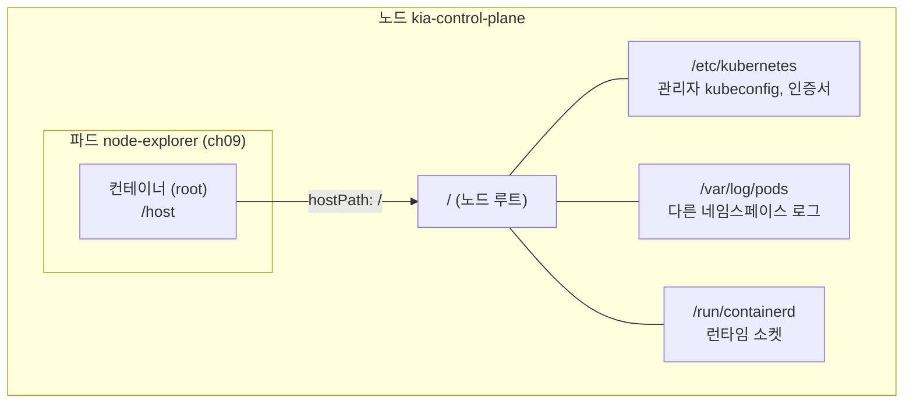
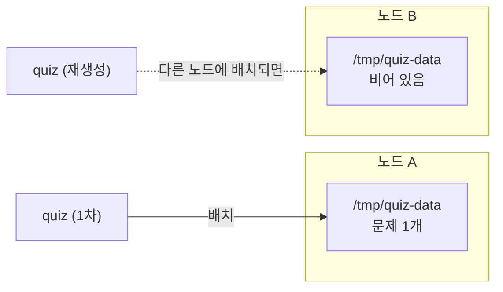

# 9.4 hostPath로 노드의 파일 시스템 사용하기

[9.2절](<9.2 emptyDir 볼륨으로 파일 지키고 나누기.md>)의 emptyDir도 실체는 노드의 디렉터리였습니다. 다만 경로를 kubelet이 정했고, 파드가 지워지면 kubelet이 치웠습니다.

**경로를 직접 정하고, 파드가 지워져도 남기려면** 어떻게 할까요? **hostPath** 볼륨은 노드의 특정 파일이나 디렉터리를 그대로 파드에 붙입니다. 강력한 만큼 **가장 위험한 볼륨**이기도 합니다.

## hostPath는 노드의 경로를 그대로 컨테이너에 엽니다

### 노드 전체를 들여다보는 파드

`/`를 통째로 붙여 봅니다.

**node-explorer.yaml**

```yaml
apiVersion: v1
kind: Pod
metadata:
  name: node-explorer
spec:
  volumes:
  - name: host-root
    hostPath:
      path: /                    # 노드의 루트 디렉터리
  containers:
  - name: node-explorer
    image: docker.io/library/alpine
    command: ["sleep", "infinity"]
    volumeMounts:
    - name: host-root
      mountPath: /host
```

```bash
kubectl apply -f node-explorer.yaml
kubectl exec node-explorer -- ls /host
```

```
LICENSES
bin
boot
dev
etc
home
kind
lib
lib64
media
mnt
opt
proc
root
run
sbin
srv
sys
tmp
usr
var
```

`kind` 디렉터리가 보입니다. kind 노드(`kia-control-plane`)의 루트입니다. 더 들어가 봅니다.

```bash
kubectl exec node-explorer -- ls /host/etc/kubernetes
```

```
admin.conf
controller-manager.conf
kubelet.conf
manifests
pki
scheduler.conf
super-admin.conf
```

**클러스터 관리자 kubeconfig(`admin.conf`, `super-admin.conf`)와 인증서 디렉터리(`pki`)가 그대로 보입니다.** 다른 네임스페이스 파드의 로그도 보입니다.

```bash
kubectl exec node-explorer -- ls /host/var/log/pods
```

```
ch08_downward-nolabel_eed79b55-8c4d-4f7c-8a01-3d7fbe308a75
ch08_kiada_b3483387-eb2c-48d4-be32-7ea9fdb8c991
ch09_node-explorer_a3964d57-71e1-4130-b5d7-d21636b9ae97
ch09_quote_ad5138f5-07c2-495e-82fe-bde171c10b1b
ch11_bb_6884e29b-f6c2-4104-9a44-90419a97702f
```

컨테이너는 root로 돌고 있고, 노드에 **쓰기도** 됩니다.

```bash
kubectl exec node-explorer -- id
kubectl exec node-explorer -- touch /host/tmp/written-from-pod
podman exec kia-control-plane ls -l /tmp            # 노드에서 확인
```

```
uid=0(root) gid=0(root) groups=0(root),1(bin),2(daemon),3(sys),4(adm),6(disk),10(wheel),11(floppy),20(dialout),26(tape),27(video)
```

```
total 0
-rw-r--r-- 1 root root 0 Oct  5 09:30 written-from-pod
```



> **hostPath 하나로 네임스페이스 격리가 무너집니다.** 7장에서 네임스페이스로 팀을 나눴어도, hostPath를 쓸 수 있는 파드는 노드를 거쳐 다른 팀의 로그와 클러스터 자격 증명에 닿습니다. 공식 문서도 hostPath가 **kubelet 자격 증명이나 컨테이너 런타임 소켓 같은 특권 API를 노출해 컨테이너 탈출에 쓰일 수 있다**고 경고합니다. `readOnly: true`로 붙여도 읽기만으로 충분히 위험합니다.

### 그래서 막아 둡니다 — 파드 보안 표준

**파드 보안 표준(Pod Security Standards)** 의 `baseline` 수준은 **hostPath 볼륨을 금지**합니다. 이 장의 네임스페이스에 잠깐 걸어 봅니다.

```bash
kubectl label ns ch09 pod-security.kubernetes.io/enforce=baseline
kubectl apply -f node-explorer.yaml
```

```
Error from server (Forbidden): error when creating "node-explorer.yaml": pods "node-explorer" is forbidden: violates PodSecurity "baseline:latest": hostPath volumes (volume "host-root")
```

```bash
kubectl label ns ch09 pod-security.kubernetes.io/enforce-          # 실습 후 원래대로
```

**만들기 자체가 거부됩니다.** 일반 앱이 도는 네임스페이스에는 최소 `baseline`을 걸어 두는 것이 안전합니다.

### hostPath가 정당한 경우

공식 문서가 드는 쓰임새는 좁습니다.

* **노드 수준 시스템 구성 요소에 접근하는 컨테이너** — 예: `/var/log`를 읽기 전용으로 붙여 로그를 중앙으로 보내는 수집기
* **정적 파드(static pod)에 노드의 설정 파일을 읽기 전용으로 넣기** — 정적 파드는 ConfigMap을 쓸 수 없기 때문

이런 파드는 보통 노드마다 하나씩 띄우는 **데몬셋(DaemonSet)** 으로 배포합니다(17장에서 다룹니다). **일반 애플리케이션의 데이터 저장소로는 쓰지 않는 것이 원칙입니다.**

## hostPath 데이터는 파드를 지워도 노드에 남습니다

원칙은 그렇지만, 동작을 이해하기 위해 quiz의 MongoDB 데이터를 hostPath에 둬 봅니다.

**pod.quiz.hostpath.yaml**

```yaml
apiVersion: v1
kind: Pod
metadata:
  name: quiz
spec:
  volumes:
  - name: quiz-data
    hostPath:
      path: /tmp/quiz-data       # 노드의 이 경로 (type 생략)
  containers:
  - name: quiz-api
    image: docker.io/luksa/quiz-api:0.1
    imagePullPolicy: IfNotPresent
    ports:
    - name: http
      containerPort: 8080
  - name: mongo
    image: docker.io/library/mongo:7
    volumeMounts:
    - name: quiz-data
      mountPath: /data/db
```

```bash
kubectl apply -f pod.quiz.hostpath.yaml
kubectl exec quiz -c mongo -- mongosh kiada --quiet --eval \
  'db.questions.insertOne({id: 1, text: "What does k8s mean?", answers: ["Kates", "Kubernetes", "Kooba Dooba Doo!"], correctAnswerIndex: 1})'
```

```
{
  acknowledged: true,
  insertedId: ObjectId('6ac36e4b6572acb8aad74acb')
}
```

노드에서 보면 `/tmp/quiz-data`가 생겼고, 소유자는 MongoDB 사용자(UID `999`)입니다.

```bash
podman exec kia-control-plane ls -ld /tmp/quiz-data
```

```
drwxr-xr-x 5 999 root 460 Oct  5 09:30 /tmp/quiz-data
```

이제 **파드를 지우고** 다시 만듭니다.

```bash
kubectl delete pod quiz
kubectl apply -f pod.quiz.hostpath.yaml
kubectl exec quiz -c mongo -- mongosh kiada --quiet --eval "db.questions.countDocuments()"
```

```
1
```

**emptyDir과 달리 데이터가 살아남았습니다.** kubelet은 hostPath의 내용을 지우지 않습니다.

```bash
kubectl describe pod quiz
```

```
Volumes:
  quiz-data:
    Type:          HostPath (bare host directory volume)
    Path:          /tmp/quiz-data
    HostPathType:  
```

`HostPathType`이 비어 있습니다. 아래에서 보듯 **아무 검사도 하지 않는** 기본값입니다.

### 그러나 "그 노드에서만" 남습니다



데이터는 노드에 있으므로, **파드가 다른 노드로 가면 다른 데이터를 봅니다.** 이 실습 클러스터는 노드가 하나라 매번 같은 노드로 가서 우연히 잘 동작한 것입니다. 원서는 여러 노드짜리 kind 클러스터에서 `spec.nodeName: kind-worker`로 파드를 특정 노드에 묶는 예제(`pod.quiz.hostpath.kind.yaml`)를 보여 줍니다. 그러나 노드를 고정하면 그 노드가 고장 났을 때 파드를 다른 곳에 띄울 수 없습니다.

> **kind 노드의 `/tmp`는 메모리(tmpfs)입니다.** `podman exec kia-control-plane df -h /tmp`로 보면 `tmpfs 7.7G 301M 7.4G 4% /tmp`입니다. 노드 컨테이너를 다시 시작하면 `/tmp/quiz-data`도 사라집니다. 실습용 경로일 뿐, "영구 저장"이 아닙니다.

> **hostPath 사용량은 임시 저장소로 계산되지 않습니다.** emptyDir처럼 `sizeLimit`으로 쫓아낼 수도 없습니다. 많이 쓰면 노드 디스크가 가득 차 **노드 전체가 디스크 압박(disk pressure)** 에 빠집니다.

진짜로 파드보다 오래 살아야 하는 데이터는 **PersistentVolume**으로 다룹니다. 공식 문서도 hostPath 대신 **로컬 PersistentVolume**을 쓰라고 권합니다([10.1절](<../10장. PersistentVolume으로 데이터 영속화하기/10.1 쿠버네티스의 영속 스토리지 이해하기.md>)에서 다룹니다).

## `type`으로 경로를 검사합니다

`hostPath.type`을 주면 kubelet이 마운트 전에 경로를 확인합니다.

| `type` | 동작 |
| :--- | :--- |
| **`""` (기본)** | 검사 안 함. 없으면 디렉터리를 만들어 붙임 |
| **`DirectoryOrCreate`** | 없으면 `0755` 디렉터리를 만듦 |
| **`Directory`** | 디렉터리가 **있어야** 함 |
| **`FileOrCreate`** | 없으면 `0644` 빈 파일을 만듦 (부모 디렉터리는 안 만듦) |
| **`File`** | 파일이 **있어야** 함 |
| **`Socket`** | 유닉스 소켓이 있어야 함 |
| **`CharDevice`** / **`BlockDevice`** | 문자/블록 장치가 있어야 함 (리눅스) |

없는 경로에 세 가지 `type`을 걸어 봅니다.

**hostpath-directory.yaml** (나머지 둘은 `path`와 `type`만 다름)

```yaml
apiVersion: v1
kind: Pod
metadata:
  name: hostpath-directory
spec:
  volumes:
  - name: host
    hostPath:
      path: /tmp/ch09-Directory
      type: Directory            # DirectoryOrCreate / File 로 바꿔 가며
  containers:
  - name: main
    image: docker.io/library/busybox
    command: ["sleep", "infinity"]
    volumeMounts:
    - name: host
      mountPath: /host
```

```bash
kubectl get pods
```

```
NAME                         READY   STATUS              RESTARTS   AGE
hostpath-directory           0/1     ContainerCreating   0          16s
hostpath-directoryorcreate   1/1     Running             0          16s
hostpath-file                0/1     ContainerCreating   0          16s
```

`DirectoryOrCreate`만 떴습니다. 노드에 디렉터리가 생겼습니다.

```
drwxr-xr-x 2 root root 40 Oct  5 09:31 /tmp/ch09-DirectoryOrCreate
```

나머지 둘은 `ContainerCreating`에 멈춰 있습니다. 이벤트를 봅니다.

```
Warning  FailedMount  0s (x6 over 16s)  kubelet  MountVolume.SetUp failed for volume "host" : hostPath type check failed, /tmp/ch09-Directory is not a directory, unable to determine its type: path "/tmp/ch09-Directory" does not exist
```

```
Warning  FailedMount  1s (x6 over 16s)  kubelet  MountVolume.SetUp failed for volume "host" : hostPath type check failed, /tmp/ch09-File is not a file, unable to determine its type: path "/tmp/ch09-File" does not exist
```

**`FailedMount`는 포기가 아니라 재시도입니다.** 노드에 두 경로를 **디렉터리로** 만들어 줍니다.

```bash
podman exec kia-control-plane mkdir /tmp/ch09-Directory /tmp/ch09-File
```

40초쯤 뒤입니다.

```
NAME                         READY   STATUS              RESTARTS   AGE
hostpath-directory           1/1     Running             0          71s
hostpath-directoryorcreate   1/1     Running             0          71s
hostpath-file                0/1     ContainerCreating   0          71s
```

`Directory`는 조건이 맞자 저절로 떴습니다. `File`은 이번엔 다른 이유로 실패합니다.

```
Warning  FailedMount  8s (x2 over 40s)   kubelet  MountVolume.SetUp failed for volume "host" : hostPath type check failed: /tmp/ch09-File is not a file, it's a Directory
```

> **`type`을 생략하면 오타도 그냥 통과합니다.** 경로를 잘못 적으면 kubelet이 빈 디렉터리를 새로 만들어 붙이고, 앱은 "설정 파일이 없다"며 엉뚱하게 실패합니다. 이미 있어야 하는 경로라면 **`Directory`나 `File`을 명시**해서 마운트 단계에서 바로 드러나게 하세요.

## 요약 및 비유

| 개념 | 건물 마스터키 비유 | 기술적 의미 |
| :--- | :--- | :--- |
| **hostPath** | 입주사에게 건물 마스터키를 줌 | 노드 경로를 파드에 그대로 마운트 |
| **`path: /`** | 관리실·전기실까지 열리는 키 | 노드 전체, 클러스터 자격 증명까지 노출 |
| **`baseline` 정책** | 마스터키 발급 금지 규정 | PSA가 hostPath 파드를 거부 |
| **로그 수집기** | 각 층 계량기를 읽는 검침원 | 노드 로그를 읽기 전용으로 읽는 데몬셋 |
| **파드 삭제 후 데이터 유지** | 입주사가 나가도 창고 짐은 남음 | kubelet이 hostPath 내용을 지우지 않음 |
| **다른 노드로 이동** | 다른 건물로 이사하면 짐이 없음 | 데이터는 그 노드에만 있음 |
| **`type: Directory`/`File`** | "이 방이 있어야 키를 준다" | 마운트 전 경로 검사 |
| **`type: ""`** | 없는 방이면 새로 만들어 줌 | 검사 없이 디렉터리 생성 |

## 결론

* hostPath는 노드의 경로를 그대로 붙입니다. **`/`를 붙이면 관리자 kubeconfig, 인증서, 다른 네임스페이스의 로그까지** 보입니다.
* 그래서 파드 보안 표준 **`baseline`이 hostPath를 금지**합니다. 일반 앱 네임스페이스에는 최소 `baseline`을 거세요.
* hostPath 데이터는 **파드를 지워도 남지만, 그 노드에만** 있습니다. 다른 노드로 옮겨 가면 데이터가 없습니다.
* `type`을 생략하면 **검사 없이 빈 디렉터리를 만들어** 붙입니다. 있어야 할 경로라면 `Directory`/`File`로 명시해 `FailedMount`로 바로 드러나게 하세요.
* 정당한 쓰임은 **노드 수준 에이전트(로그 수집 등)** 정도입니다. 앱 데이터는 PersistentVolume으로 보냅니다([10.1절](<../10장. PersistentVolume으로 데이터 영속화하기/10.1 쿠버네티스의 영속 스토리지 이해하기.md>)에서 다룹니다).

## 출처

> 2026-10-05 공식 문서로 검증

* 원서: *Kubernetes in Action, Second Edition* 9장 — <https://livebook.manning.com/book/kubernetes-in-action-second-edition/>
* [Volumes](https://kubernetes.io/docs/concepts/storage/volumes/) — Kubernetes 공식 문서
* [Pod Security Standards](https://kubernetes.io/docs/concepts/security/pod-security-standards/) — Kubernetes 공식 문서
