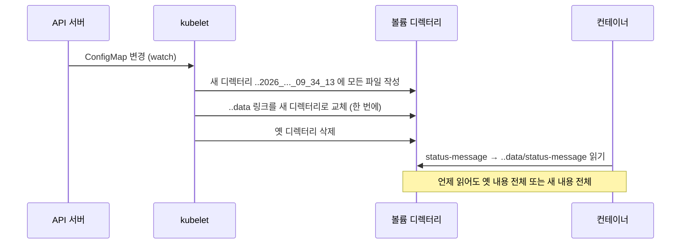
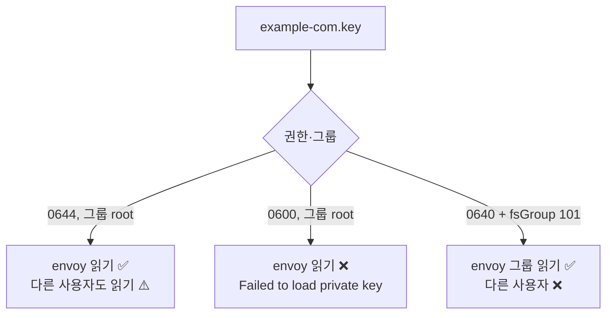
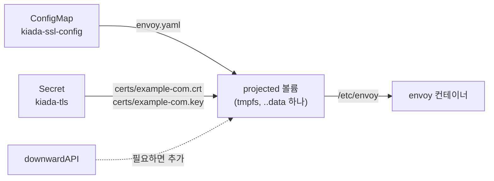

# 9.5 ConfigMap, Secret, Downward API를 파일로 넣기

ConfigMap과 Secret을 **환경 변수**로 넣는 방법은 8장에서 다룹니다. 그런데 환경 변수로는 부족할 때가 많습니다. Envoy나 Nginx처럼 **설정을 파일로만 읽는 프로그램**, TLS 인증서처럼 **파일이어야 하는 데이터**가 그렇습니다.

이때 쓰는 것이 **configMap**, **secret**, **downwardAPI** 볼륨과, 이들을 한 디렉터리로 합치는 **projected** 볼륨입니다. 공통점은 하나입니다. **API 오브젝트의 내용을 kubelet이 파일로 만들어 줍니다.**

## configMap 볼륨은 키 하나를 파일 하나로 만듭니다

### 예제 — kiada 앞에 TLS 프록시 붙이기

**kiada-ssl** 파드는 컨테이너 둘로 이루어집니다.

* `kiada` — 8080에서 HTTP로 응답하는 앱
* `envoy` — 8443에서 HTTPS를 받아 `127.0.0.1:8080`으로 넘기는 사이드카 프록시

Envoy의 설정 파일 `envoy.yaml`을 ConfigMap에 넣습니다. 상태 메시지 키도 하나 함께 둡니다.

```bash
kubectl create configmap kiada-ssl-config \
  --from-literal status-message="This status message is set in the kiada-ssl-config ConfigMap" \
  --from-file envoy.yaml=./envoy.yaml
```

```
configmap/kiada-ssl-config created
```

**pod.kiada-ssl.configmap-volume.yaml** (환경 변수 부분 생략)

```yaml
apiVersion: v1
kind: Pod
metadata:
  name: kiada-ssl
spec:
  volumes:
  - name: envoy-config
    configMap:
      name: kiada-ssl-config            # 이 ConfigMap의 키들이 파일이 됨
  containers:
  - name: kiada
    image: docker.io/luksa/kiada:0.4
    env:
    - name: INITIAL_STATUS_MESSAGE      # 같은 ConfigMap을 환경 변수로도 씀 (8장)
      valueFrom:
        configMapKeyRef:
          name: kiada-ssl-config
          key: status-message
          optional: true
    ports:
    - name: http
      containerPort: 8080
  - name: envoy
    image: docker.io/luksa/kiada-ssl-proxy:0.1   # 인증서가 이미지에 들어 있음
    volumeMounts:
    - name: envoy-config
      mountPath: /etc/envoy             # envoy.yaml 을 읽는 경로
      readOnly: true
    ports:
    - name: https
      containerPort: 8443
    - name: admin
      containerPort: 9901
```

```bash
kubectl apply -f pod.kiada-ssl.configmap-volume.yaml
kubectl exec kiada-ssl -c envoy -- ls -la /etc/envoy
```

```
total 12
drwxrwxrwx 3 root root 4096 Oct  5 09:32 .
drwxr-xr-x 1 root root 4096 Jul  1  2025 ..
drwxr-xr-x 2 root root 4096 Oct  5 09:32 ..2026_10_05_09_32_56.1641886522
lrwxrwxrwx 1 root root   32 Oct  5 09:32 ..data -> ..2026_10_05_09_32_56.1641886522
lrwxrwxrwx 1 root root   17 Oct  5 09:32 envoy.yaml -> ..data/envoy.yaml
lrwxrwxrwx 1 root root   21 Oct  5 09:32 status-message -> ..data/status-message
```

키 `envoy.yaml`과 `status-message`가 **파일 이름**이 되었습니다. 그런데 둘 다 **심볼릭 링크**이고, 이상한 `..data`와 날짜 이름 디렉터리가 있습니다. 이 구조의 이유는 아래 "갱신" 부분에서 봅니다.

```bash
kubectl exec kiada-ssl -c envoy -- cat /etc/envoy/status-message
```

```
This status message is set in the kiada-ssl-config ConfigMap
```

HTTPS로 접속해 봅니다.

```bash
kubectl port-forward kiada-ssl 8443 9901 &
curl -sk https://localhost:8443/
```

```
Request processed by Kiada 0.4 running in pod "kiada-ssl" on node "kia-control-plane".
Pod hostname: kiada-ssl; Pod IP: 10.244.0.60; Node IP: 10.89.0.2. Client IP: ::ffff:127.0.0.1
This status message is set in the kiada-ssl-config ConfigMap
```

Envoy가 ConfigMap에서 온 설정 파일로 떠서 TLS를 풀고 kiada로 넘겼습니다.

### `items`로 필요한 키만, 원하는 이름으로

위에서는 Envoy에게 필요 없는 `status-message` 파일까지 들어갔습니다. **`items`** 로 고를 수 있습니다.

```yaml
volumes:
- name: envoy-config
  configMap:
    name: kiada-ssl-config
    items:                      # 적은 키만 파일로 만듦
    - key: envoy.yaml           # ConfigMap의 키
      path: envoy.yaml          # 볼륨 안의 파일 경로 (이름을 바꿔도 됨)
```

`path`에 하위 디렉터리를 넣을 수도 있습니다. 실험용 파드에서 확인합니다.

**cm-subpath-test.yaml** (발췌)

```yaml
  - name: config-items
    configMap:
      name: kiada-ssl-config
      defaultMode: 0600                 # 볼륨 전체 기본 권한
      items:
      - key: status-message
        path: messages/status.txt       # 하위 디렉터리 + 새 이름
        mode: 0444                      # 이 파일만 다른 권한
      - key: envoy.yaml
        path: envoy.yaml
```

```bash
kubectl exec cm-subpath-test -- ls -lL /items/envoy.yaml /items/messages/status.txt
```

```
-rw-------    1 root     root          1925 Oct  5 09:34 /items/envoy.yaml
-r--r--r--    1 root     root            25 Oct  5 09:34 /items/messages/status.txt
```

`messages/` 디렉터리가 만들어졌고, 권한은 `defaultMode`(`0600`)와 항목별 `mode`(`0444`)를 따랐습니다. 권한 이야기는 아래에서 더 합니다.

### ConfigMap이 없으면 컨테이너가 뜨지 않습니다

없는 ConfigMap을 가리키면 이렇게 됩니다.

**cm-missing.yaml** (발췌)

```yaml
  volumes:
  - name: config
    configMap:
      name: no-such-config              # 없음
  - name: optional-config
    configMap:
      name: no-such-config-either       # 이것도 없음
      optional: true                    # 하지만 없어도 된다고 표시
```

```
NAME         READY   STATUS              RESTARTS   AGE
cm-missing   0/1     ContainerCreating   0          20s
```

```
Warning  FailedMount  6s (x6 over 21s)  kubelet  MountVolume.SetUp failed for volume "config" : configmap "no-such-config" not found
```

에러는 `config` 볼륨에 대해서만 납니다. `optional: true`인 쪽은 **빈 디렉터리**로 붙습니다. 빠진 ConfigMap을 만들어 주면 kubelet이 재시도하다가 30초쯤 뒤 파드를 띄웁니다.

```bash
kubectl create configmap no-such-config --from-literal=a=1
```

```
NAME         READY   STATUS    RESTARTS   AGE
cm-missing   1/1     Running   0          58s
```

## configMap 볼륨은 이렇게 갱신됩니다

### `..data`를 한 번에 바꿔 끼웁니다

ConfigMap을 고칩니다.

```bash
kubectl patch configmap kiada-ssl-config --type merge \
  -p '{"data":{"status-message":"Updated via kubectl patch"}}'
```

```
configmap/kiada-ssl-config patched
```

3초 간격으로 파일을 읽어 보니 **39초 뒤**에 바뀌었습니다. 디렉터리를 다시 봅니다.

```bash
kubectl exec kiada-ssl -c envoy -- ls -la /etc/envoy
```

```
total 12
drwxrwxrwx 3 root root 4096 Oct  5 09:34 .
drwxr-xr-x 1 root root 4096 Jul  1  2025 ..
drwxr-xr-x 2 root root 4096 Oct  5 09:34 ..2026_10_05_09_34_13.3748740177
lrwxrwxrwx 1 root root   32 Oct  5 09:34 ..data -> ..2026_10_05_09_34_13.3748740177
lrwxrwxrwx 1 root root   17 Oct  5 09:32 envoy.yaml -> ..data/envoy.yaml
lrwxrwxrwx 1 root root   21 Oct  5 09:32 status-message -> ..data/status-message
```

* 날짜 디렉터리가 `09_32_56` → **`09_34_13`** 으로 새로 생겼습니다
* `..data` 링크가 **새 디렉터리를 가리키도록** 바뀌었습니다
* `envoy.yaml`, `status-message` 링크는 **09:32 그대로**입니다. `..data`만 따라가면 되니까요



**왜 이렇게 번거롭게 할까요?** 파일을 하나씩 덮어쓰면, 앱이 그 사이에 읽을 때 **`envoy.yaml`은 새것, 인증서는 옛것** 같은 어중간한 상태를 볼 수 있습니다. 링크 하나를 바꾸는 것은 원자적(atomic)이므로 **모든 파일이 한꺼번에 바뀝니다.**

### 몇 초가 걸릴지는 정해져 있지 않습니다

공식 문서에 따르면 kubelet은 **주기적인 동기화(sync) 때마다** 마운트된 ConfigMap이 최신인지 확인하고, 값은 **자기 캐시**에서 가져옵니다. 그래서 반영까지 최대 **"kubelet 동기화 주기 + 캐시 전파 지연"** 이 걸릴 수 있습니다. 이 실습에서도 한 번은 39초, 다른 파드에서는 70초가 걸렸습니다.

> **파일이 바뀌어도 앱이 다시 읽지 않으면 소용없습니다.** Envoy는 시작할 때 한 번 읽은 설정으로 계속 돕니다. 파일 변경을 감지해 다시 읽는 기능이 앱에 있는지 확인하세요. 없으면 결국 파드를 다시 시작해야 합니다.

### 환경 변수는 그대로입니다

같은 ConfigMap에서 받은 환경 변수를 봅니다.

```bash
kubectl exec kiada-ssl -c kiada -- printenv INITIAL_STATUS_MESSAGE
```

```
This status message is set in the kiada-ssl-config ConfigMap
```

**옛 값 그대로입니다.** 환경 변수는 프로세스가 시작할 때 한 번 정해지므로 자동 갱신이 없습니다.

### `subPath`로 붙인 파일은 갱신되지 않습니다

[9.1절](<9.1 볼륨 이해하기.md>)에서 `mountPath`는 디렉터리 전체를 가린다고 했습니다. `/etc`처럼 이미 파일이 많은 곳에 **파일 하나만** 넣고 싶으면 `subPath`를 씁니다. 세 가지 방식을 한 파드에 같이 붙였습니다.

**cm-subpath-test.yaml**

```yaml
apiVersion: v1
kind: Pod
metadata:
  name: cm-subpath-test
spec:
  volumes:
  - name: config
    configMap:
      name: kiada-ssl-config
  - name: config-items
    configMap:
      name: kiada-ssl-config
      defaultMode: 0600
      items:
      - key: status-message
        path: messages/status.txt
        mode: 0444
      - key: envoy.yaml
        path: envoy.yaml
  containers:
  - name: main
    image: docker.io/library/busybox
    command: ["sleep", "infinity"]
    volumeMounts:
    - name: config
      mountPath: /full                  # 1) 볼륨 전체
    - name: config
      mountPath: /etc/status-message    # 2) subPath 로 파일 하나
      subPath: status-message
    - name: config-items
      mountPath: /items                 # 3) items 로 고른 볼륨
```

`subPath`로 붙인 파일은 **심볼릭 링크가 아니라 일반 파일**로 보입니다.

```bash
kubectl exec cm-subpath-test -- ls -l /etc/status-message
```

```
-rw-r--r--    1 root     root            25 Oct  5 09:34 /etc/status-message
```

ConfigMap을 한 번 더 고치고, 전체 볼륨이 바뀐 뒤 1분을 더 기다렸습니다.

```bash
kubectl patch configmap kiada-ssl-config --type merge -p '{"data":{"status-message":"Second update"}}'
```

```
/full: Second update
/items: Second update
subPath: Updated via kubectl patch
```

**`subPath` 쪽만 옛 값에 머물렀습니다.** `subPath`는 `..data` 링크를 거치지 않고 그 순간의 실제 파일을 직접 붙이기 때문에, 링크를 바꿔 끼워도 따라가지 못합니다. 컨테이너를 재시작하면 그때 새 파일을 붙입니다.

```bash
podman exec kia-control-plane crictl stop <컨테이너 ID>    # 컨테이너만 재시작
kubectl exec cm-subpath-test -- cat /etc/status-message
```

```
Second update
```

| 방식 | 파일 모양 | ConfigMap 변경 반영 |
| :--- | :--- | :--- |
| **볼륨 전체 마운트** | `..data`를 가리키는 심볼릭 링크 | ✅ 수십 초 안에 |
| **`items`** | 같음 | ✅ 수십 초 안에 |
| **`subPath`** | 일반 파일 | ❌ **컨테이너 재시작 전까지 안 바뀜** |
| **환경 변수** | — | ❌ 컨테이너 재시작 전까지 안 바뀜 |

> **"ConfigMap을 고쳤는데 반영이 안 돼요"의 단골 원인이 `subPath`입니다.** 공식 문서도 ConfigMap·Secret·Downward API를 `subPath`로 붙이면 갱신을 받지 못한다고 명시합니다. 자동 갱신이 필요하면 **전용 디렉터리에 볼륨 전체를 붙이고**, 앱 설정에서 그 경로를 가리키게 하세요.

## Secret 볼륨은 메모리(tmpfs)에 씁니다

이제 인증서를 이미지에서 빼서 **Secret**으로 넣습니다. 프록시 이미지도 공식 Envoy 이미지로 바꿉니다.

```bash
kubectl apply -f secret.kiada-tls.yaml             # kubernetes.io/tls 타입, tls.crt / tls.key
```

```
secret/kiada-tls created
```

**pod.kiada-ssl.secret-volume.yaml** (볼륨과 envoy 부분)

```yaml
spec:
  volumes:
  - name: cert-and-key
    secret:
      secretName: kiada-tls             # configMap 은 name, secret 은 secretName
      items:
      - key: tls.crt
        path: example-com.crt           # envoy.yaml 이 기대하는 이름으로
      - key: tls.key
        path: example-com.key
  - name: envoy-config
    configMap:
      name: kiada-ssl-config
      items:
      - key: envoy.yaml
        path: envoy.yaml
  containers:
  ...
  - name: envoy
    image: docker.io/envoyproxy/envoy:v1.31-latest
    volumeMounts:
    - name: cert-and-key
      mountPath: /etc/certs
      readOnly: true
    - name: envoy-config
      mountPath: /etc/envoy
      readOnly: true
```

> **`configMap`은 `name`, `secret`은 `secretName`입니다.** 두 볼륨의 필드 이름이 다릅니다. 복사해 고치다가 자주 틀리는 곳입니다(projected 볼륨 안에서는 둘 다 `name`입니다).

```bash
kubectl exec kiada-ssl -c envoy -- sh -c 'mount | grep -E "/etc/certs|/etc/envoy"'
```

```
tmpfs on /etc/certs type tmpfs (ro,relatime,size=16127132k,noswap)
/dev/sdd on /etc/envoy type ext4 (ro,relatime,discard,errors=remount-ro,data=ordered)
```

**같은 파드에서도 Secret은 `tmpfs`, ConfigMap은 디스크(`ext4`)** 입니다. 공식 문서는 Secret 볼륨이 tmpfs(RAM 기반 파일 시스템)에 저장되어 **비휘발성 저장소에 기록되지 않는다**고 설명합니다. 노드 디스크를 떼어 가도 비밀 키가 남지 않게 하려는 것입니다.

```bash
kubectl exec kiada-ssl -c envoy -- ls -lL /etc/certs
```

```
total 8
-rw-r--r-- 1 root root 1992 Oct  5 09:39 example-com.crt
-rw-r--r-- 1 root root 3268 Oct  5 09:39 example-com.key
```

동작은 합니다. 그런데 **개인 키가 `-rw-r--r--`, 아무나 읽을 수 있는 권한**입니다. 이것을 고쳐 봅니다.

## 파일 권한과 소유자 정하기

### 기본 권한은 0644입니다

볼륨의 파일 권한은 두 단계로 정합니다.

| 필드 | 위치 | 기본값 |
| :--- | :--- | :--- |
| **`defaultMode`** | `configMap`/`secret`/`downwardAPI`/`projected` 볼륨 수준 | `0644` |
| **`mode`** | `items[]` 항목 수준 | `defaultMode`를 따름 |

파드 스펙을 JSON으로 보면 `defaultMode`가 `420`으로 찍힙니다. **8진수 `0644`를 10진수로 적은 것**입니다. `items` 없이 Secret을 통째로 붙인 파드(`secret-default`)로 확인했습니다.

```bash
kubectl get pod secret-default -o jsonpath='{.spec.volumes[0].secret}'
kubectl exec secret-default -- ls -lL /etc/certs
```

```
{"defaultMode":420,"secretName":"kiada-tls"}
```

```
total 8
-rw-r--r--    1 root     root          1992 Oct  5 09:57 tls.crt
-rw-r--r--    1 root     root          3268 Oct  5 09:57 tls.key
```

`items`가 없으니 파일 이름은 Secret의 키(`tls.crt`, `tls.key`) 그대로입니다.

> **YAML에서는 `0` 으로 시작하는 8진수, JSON에서는 10진수.** YAML에 `mode: 0640`이라고 쓰면 8진수로 읽힙니다. `mode: 640`이라고 쓰면 10진수 640(= 8진수 1200)이 되어 엉뚱한 권한이 됩니다. JSON에는 8진수 표기가 없으므로 `0640`을 `416`으로 적어야 합니다.

### 키를 0600으로 막으면 Envoy가 못 읽습니다

Envoy 프로세스가 누구로 도는지 봅니다.

```bash
kubectl exec kiada-ssl -c envoy -- grep -E "^(Uid|Gid)" /proc/1/status
```

```
Uid:	101	101	101	101
Gid:	101	101	101	101
```

`kubectl exec` 셸은 root지만, **Envoy 본체(PID 1)는 UID 101(`envoy`)** 로 돕니다. 키를 소유자(root)만 읽게 `mode: 0600`으로 바꿔 봅니다.

```yaml
      - key: tls.key
        path: example-com.key
        mode: 0600                      # 소유자(root)만 읽기
```

```
NAME        READY   STATUS   RESTARTS      AGE
kiada-ssl   1/2     Error    2 (24s ago)   26s
```

```bash
kubectl logs kiada-ssl -c envoy
```

```
[2026-10-05 09:39:43.832][1][critical][main] [source/server/server.cc:412] error initializing config '  /etc/envoy/envoy.yaml': Failed to load incomplete private key from path: /etc/certs/example-com.key
[2026-10-05 09:39:43.832][1][info][main] [source/server/server.cc:1038] exiting
Failed to load incomplete private key from path: /etc/certs/example-com.key
```

**root 소유의 0600 파일을 UID 101이 읽지 못해** Envoy가 죽습니다.

### `fsGroup` + `0640` — 그룹에게만 읽기를 허락합니다

정답은 **파일 그룹을 envoy 그룹으로 바꾸고, 그룹에게만 읽기를 주는 것**입니다. 파드의 `securityContext.fsGroup`이 볼륨 파일의 그룹을 정합니다.

**pod.kiada-ssl.secret-volume-permissions.yaml** (발췌)

```yaml
spec:
  securityContext:
    fsGroup: 101                        # 볼륨 파일의 그룹 = envoy(101)
  volumes:
  - name: cert-and-key
    secret:
      secretName: kiada-tls
      items:
      - key: tls.crt
        path: example-com.crt
      - key: tls.key
        path: example-com.key
        mode: 0640                      # 소유자 rw, 그룹 r, 그 외 없음
```

```bash
kubectl exec kiada-ssl -c envoy -- ls -la /etc/certs
kubectl exec kiada-ssl -c envoy -- ls -lL /etc/certs
```

```
total 4
drwxrwsrwt 3 root envoy  120 Oct  5 09:40 .
drwxr-xr-x 1 root root  4096 Oct  5 09:40 ..
drwxr-sr-x 2 root envoy   80 Oct  5 09:40 ..2026_10_05_09_40_02.2310920990
lrwxrwxrwx 1 root envoy   32 Oct  5 09:40 ..data -> ..2026_10_05_09_40_02.2310920990
lrwxrwxrwx 1 root envoy   22 Oct  5 09:40 example-com.crt -> ..data/example-com.crt
lrwxrwxrwx 1 root envoy   22 Oct  5 09:40 example-com.key -> ..data/example-com.key
```

```
total 8
-rw-r--r-- 1 root envoy 1992 Oct  5 09:40 example-com.crt
-rw-r----- 1 root envoy 3268 Oct  5 09:40 example-com.key
```

* 그룹이 **`envoy`** 로 바뀌었습니다
* 키는 **`-rw-r-----`**: root는 읽고 쓰기, envoy 그룹은 읽기, 그 밖에는 아무것도 못 함
* 디렉터리에 **`s`(setgid)** 가 붙었습니다. 새로 생기는 파일도 그룹을 물려받게 하려는 것입니다

Envoy가 정상으로 떴고 HTTPS도 응답합니다.

```
kiada-ssl   2/2     Running   0          1s
```

```
Request processed by Kiada 0.4 running in pod "kiada-ssl" on node "kia-control-plane".
```



> **`fsGroup`은 파드의 모든 컨테이너, 모든 지원 볼륨에 함께 적용됩니다.** 위 출력에서 ConfigMap 볼륨(`/etc/envoy`)의 그룹도 `envoy`로 바뀌었습니다. 볼륨마다 다른 그룹을 줄 수는 없습니다.

## Downward API 볼륨은 파드 자신의 정보를 파일로 줍니다

**Downward API** 는 파드의 이름, 레이블 같은 **자기 자신에 대한 정보**를 앱에 알려 주는 장치입니다. 환경 변수로 넣는 방법은 8장에서 다룹니다(위 kiada의 `POD_NAME` 등이 그것입니다). 볼륨으로 넣으면 **환경 변수로는 안 되는 일**이 가능해집니다.

**pod.downward-vol.yaml**

```yaml
apiVersion: v1
kind: Pod
metadata:
  name: downward-vol
  labels:
    app: kiada
    rel: stable
  annotations:
    team: platform
spec:
  volumes:
  - name: pod-meta
    downwardAPI:
      items:
      - path: pod-name
        fieldRef:
          fieldPath: metadata.name
      - path: labels
        fieldRef:
          fieldPath: metadata.labels          # 레이블 전체 (볼륨에서만 가능)
      - path: annotations
        fieldRef:
          fieldPath: metadata.annotations     # 애노테이션 전체 (볼륨에서만 가능)
      - path: mem-limit
        resourceFieldRef:
          containerName: main                 # 볼륨에서는 컨테이너 이름 필수
          resource: limits.memory
          divisor: 1Mi                        # MiB 단위 숫자로
  containers:
  - name: main
    image: docker.io/library/busybox
    command: ["sleep", "infinity"]
    resources:
      limits:
        memory: 64Mi
    volumeMounts:
    - name: pod-meta
      mountPath: /etc/pod-meta
      readOnly: true
```

```bash
kubectl exec downward-vol -- sh -c \
  'for f in pod-name labels mem-limit; do cat /etc/pod-meta/$f; echo; done'
```

```
downward-vol
app="kiada"
rel="stable"
64
```

레이블이 **`키="값"` 한 줄씩** 들어갔습니다. 파일 끝에 줄바꿈이 없어서, `cat`으로 여러 파일을 한꺼번에 읽으면 `downward-volapp="kiada"`처럼 붙어 나옵니다. 그래서 파일마다 `echo`를 넣었습니다. 애노테이션도 같은 형식인데, `kubectl apply`가 남긴 `kubectl.kubernetes.io/last-applied-configuration`과 kubelet의 `kubernetes.io/config.seen`, `kubernetes.io/config.source`까지 함께 나옵니다. 우리가 붙인 줄은 마지막의 `team="platform"`입니다.

### 레이블을 바꾸면 파일도 바뀝니다

```bash
kubectl label pod downward-vol rel=canary --overwrite
kubectl exec downward-vol -- cat /etc/pod-meta/labels
```

```
pod/downward-vol labeled
```

```
app="kiada"
rel="canary"
```

이번에는 **1초 만에** 반영되었습니다. 파드 자신이 바뀐 것이라 kubelet이 곧바로 그 파드를 다시 동기화하기 때문으로 보입니다. 갱신 방식은 configMap 볼륨과 같은 `..data` 교체입니다. **환경 변수였다면 바뀌지 않았을 것입니다.**

### 볼륨에 넣을 수 없는 필드가 있습니다

`status.podIP`를 볼륨에 넣어 봅니다.

```bash
kubectl apply -f downward-vol-bad.yaml           # metadata.name 자리에 status.podIP
```

```
The Pod "downward-vol-bad" is invalid: 
* spec.volumes[0].downwardAPI.fieldRef.fieldPath: Unsupported value: "status.podIP": supported values: "metadata.annotations", "metadata.labels", "metadata.name", "metadata.namespace", "metadata.uid"
* spec.containers[0].volumeMounts[0].name: Not found: "pod-meta"
```

**API 서버가 바로 거부합니다.** 에러가 볼륨에 쓸 수 있는 `fieldRef` 값을 그대로 알려 줍니다(두 번째 줄은 볼륨이 무효가 되면서 딸려 나온 에러입니다).

| 정보 | 환경 변수 | downwardAPI 볼륨 |
| :--- | :---: | :---: |
| `metadata.name`, `namespace`, `uid` | ✅ | ✅ |
| `metadata.labels['키']`, `metadata.annotations['키']` | ✅ | ✅ |
| **`metadata.labels`, `metadata.annotations` (전체)** | ❌ | ✅ |
| **`spec.nodeName`, `spec.serviceAccountName`, `status.podIP`, `status.hostIP`** | ✅ | ❌ |
| `resourceFieldRef` (CPU·메모리 requests/limits) | ✅ | ✅ (`containerName` 필수) |
| **값이 바뀔 때 갱신** | ❌ | ✅ |

## projected 볼륨은 여러 출처를 한 디렉터리에 모읍니다

Envoy는 지금 `/etc/envoy`(ConfigMap)와 `/etc/certs`(Secret) 두 곳을 붙입니다. **projected 볼륨**을 쓰면 하나로 합칠 수 있습니다.

**pod.kiada-ssl.projected-volume.yaml** (발췌)

```yaml
spec:
  securityContext:
    fsGroup: 101
  volumes:
  - name: etc-envoy
    projected:
      sources:                          # 여러 출처를 나열
      - configMap:
          name: kiada-ssl-config
          items:
          - key: envoy.yaml
            path: envoy.yaml
      - secret:
          name: kiada-tls               # projected 안에서는 secret 도 name
          items:
          - key: tls.crt
            path: certs/example-com.crt
          - key: tls.key
            path: certs/example-com.key
            mode: 0640
  containers:
  ...
  - name: envoy
    image: docker.io/envoyproxy/envoy:v1.31-latest
    volumeMounts:
    - name: etc-envoy
      mountPath: /etc/envoy             # 하나만 붙임
      readOnly: true
```

처음 띄웠을 때는 이렇게 실패했습니다.

```
NAME        READY   STATUS   RESTARTS      AGE
kiada-ssl   1/2     Error    1 (12s ago)   13s
```

```
[2026-10-05 09:41:33.821][1][critical][main] [source/server/server.cc:412] error initializing config '  /etc/envoy/envoy.yaml': Failed to load incomplete private key from path: /etc/certs/example-com.key
```

인증서가 이제 `/etc/envoy/certs/` 아래에 있는데, ConfigMap의 `envoy.yaml`은 여전히 **`/etc/certs/`** 를 가리키기 때문입니다. **볼륨 구성을 바꾸면 설정 파일 안의 경로도 함께 바꿔야 합니다.** `envoy.yaml`의 `filename`을 `/etc/envoy/certs/...`로 고쳐 ConfigMap을 다시 만들고 파드를 새로 띄웠습니다.

```bash
kubectl exec kiada-ssl -c envoy -- ls -la /etc/envoy
kubectl exec kiada-ssl -c envoy -- ls -lLR /etc/envoy/..data/
```

```
total 4
drwxrwsrwt 3 root envoy  120 Oct  5 09:41 .
drwxr-xr-x 1 root root  4096 Jul 18  2025 ..
drwxr-sr-x 3 root envoy   80 Oct  5 09:41 ..2026_10_05_09_41_45.437320565
lrwxrwxrwx 1 root envoy   31 Oct  5 09:41 ..data -> ..2026_10_05_09_41_45.437320565
lrwxrwxrwx 1 root envoy   12 Oct  5 09:41 certs -> ..data/certs
lrwxrwxrwx 1 root envoy   17 Oct  5 09:41 envoy.yaml -> ..data/envoy.yaml
```

```
/etc/envoy/..data/:
total 4
drwxr-sr-x 2 root envoy   80 Oct  5 09:41 certs
-rw-r--r-- 1 root envoy 1937 Oct  5 09:41 envoy.yaml

/etc/envoy/..data/certs:
total 8
-rw-r--r-- 1 root envoy 1992 Oct  5 09:41 example-com.crt
-rw-r----- 1 root envoy 3268 Oct  5 09:41 example-com.key
```

```
tmpfs on /etc/envoy type tmpfs (ro,relatime,size=16127132k,noswap)
```

ConfigMap과 Secret이 **하나의 `..data` 아래에** 모였고, 마운트는 **tmpfs**가 되었습니다. Secret이 하나라도 섞이면 볼륨 전체를 메모리에 두는 것입니다.



### 사실 모든 파드가 이미 projected 볼륨을 쓰고 있습니다

```bash
kubectl get pod kiada-ssl -o jsonpath='{.spec.volumes[1]}'
```

```
{"name":"kube-api-access-tjmbx","projected":{"defaultMode":420,"sources":[{"serviceAccountToken":{"expirationSeconds":3607,"path":"token"}},{"configMap":{"items":[{"key":"ca.crt","path":"ca.crt"}],"name":"kube-root-ca.crt"}},{"downwardAPI":{"items":[{"fieldRef":{"apiVersion":"v1","fieldPath":"metadata.namespace"},"path":"namespace"}]}}]}}
```

우리가 적지 않은 `kube-api-access-…` 볼륨이 자동으로 붙어 있습니다. **서비스 어카운트 토큰 + 클러스터 CA 인증서(ConfigMap) + 네임스페이스 이름(Downward API)** 을 묶은 projected 볼륨입니다. 컨테이너의 `/var/run/secrets/kubernetes.io/serviceaccount`에 `token`, `ca.crt`, `namespace` 세 파일로 보입니다. 앱이 API 서버에 접속할 때 쓰는 자격 증명입니다.

| projected 출처 | 내용 |
| :--- | :--- |
| **`configMap`** | ConfigMap의 키 |
| **`secret`** | Secret의 키 |
| **`downwardAPI`** | 파드 정보 |
| **`serviceAccountToken`** | 만료 시간이 있는 서비스 어카운트 토큰 |
| **`clusterTrustBundle`** | 클러스터 신뢰 번들(CA 인증서 묶음) |
| **`podCertificate`** | 파드용 개인 키와 X.509 인증서 |

모든 출처는 **파드와 같은 네임스페이스**에 있어야 합니다.

## 요약 및 비유

| 개념 | 사내 게시판 비유 | 기술적 의미 |
| :--- | :--- | :--- |
| **configMap 볼륨** | 게시판에 붙인 공지문 | ConfigMap 키 → 파일 |
| **`..data` 교체** | 공지판을 통째로 새 판으로 바꿔 걸기 | 심볼릭 링크 하나를 원자적으로 교체 |
| **갱신 지연** | 총무팀이 순회할 때 바꿔 붙임 | kubelet 동기화 주기 + 캐시 지연 |
| **`subPath`** | 공지문을 복사해 자기 책상에 붙임 | 원본이 바뀌어도 사본은 그대로 |
| **환경 변수** | 입사 때 받은 안내서 | 시작 시점 값에 고정 |
| **Secret 볼륨** | 잠금장치 달린 게시판, 종이 대신 화면 | tmpfs, 디스크에 안 남음 |
| **`mode` + `fsGroup`** | "인사팀만 열람" 표시와 열쇠 배분 | 파일 권한과 그룹 소유 |
| **downwardAPI 볼륨** | 자기 사원증 정보를 적은 명패 | 파드 이름·레이블 → 파일, 자동 갱신 |
| **projected 볼륨** | 여러 부서 공지를 한 게시판에 모음 | 여러 출처를 한 디렉터리로 |

## 결론

* configMap·secret 볼륨은 **키 하나를 파일 하나로** 만듭니다. `items`로 골라 이름·경로·권한을 바꿀 수 있습니다.
* 파일은 **`..data` 심볼릭 링크를 한 번에 바꿔 끼우는 방식**으로 갱신됩니다. 반영까지 수십 초가 걸릴 수 있고(이 실습에서 39초, 70초), **앱이 다시 읽어야** 의미가 있습니다.
* **`subPath`로 붙인 파일과 환경 변수는 갱신되지 않습니다.** 컨테이너가 재시작되어야 새 값을 봅니다.
* Secret 볼륨은 **tmpfs**에 놓입니다. 기본 권한 `0644`는 키에 너무 넓으니 **`mode: 0640` + `fsGroup`** 으로 앱 그룹에만 읽기를 주세요. `0600`만 주면 비 root 앱이 못 읽습니다.
* downwardAPI 볼륨은 **레이블·애노테이션 전체**를 파일로 주고 변경도 반영합니다. 대신 `status.podIP`, `spec.nodeName` 같은 필드는 **환경 변수로만** 됩니다.
* projected 볼륨은 여러 출처를 **한 디렉터리**로 모읍니다. 모든 파드의 `kube-api-access` 볼륨이 바로 이것입니다.

## 공식 문서 업데이트 (2026년 10월 기준)

### 1) 볼륨 파일의 소유자(UID)를 정하는 필드가 알파로 들어왔습니다 (1.37)

책 시절에는 그룹은 `fsGroup`으로 바꿀 수 있어도 **소유자 UID는 항상 root**였습니다. 1.37에서 `AtomicWriteVolumeUserFields` 기능 게이트(**알파, 기본 꺼짐**)로 `configMap`, `secret`, `downwardAPI`, `projected` 볼륨에 `defaultUser`(볼륨 수준)와 `user`(항목 수준) 필드가 생겼습니다.

```yaml
volumes:
- name: cert-and-key
  secret:
    secretName: kiada-tls
    defaultUser: 101          # 파일 소유자를 envoy(101)로
```

기능 게이트가 꺼진 이 클러스터에 적용해 보면 **에러도 경고도 없이 필드만 사라집니다.**

```bash
kubectl apply -f secret-defaultuser.yaml
kubectl get pod secret-defaultuser -o jsonpath='{.spec.volumes[0].secret}'
```

```
pod/secret-defaultuser created
```

```
{"defaultMode":420,"secretName":"kiada-tls"}
```

알파 필드를 쓸 때는 **적용 후 스펙에 남아 있는지 꼭 확인하세요.**

참고: <https://kubernetes.io/docs/concepts/storage/volumes/#user-ownership-uid>

### 2) projected 볼륨에 인증서 출처 두 가지가 정식으로 추가되었습니다 (1.37)

책 시절 projected 출처는 `configMap`, `secret`, `downwardAPI`, `serviceAccountToken` 넷이었습니다. 지금은 둘이 더 있고, **둘 다 v1.37에서 stable(기본 켜짐)** 이 되었습니다.

* **`clusterTrustBundle`** — 클러스터 범위 `ClusterTrustBundle` 오브젝트의 CA 인증서 묶음을 파일로 넣습니다. v1.29에 처음 들어왔습니다
* **`podCertificate`** — 파드가 쓸 **개인 키와 X.509 인증서 체인**을 kubelet이 발급받아 넣습니다. v1.34에 처음 들어왔습니다

이 장의 kiada-ssl처럼 인증서를 Secret으로 미리 만들어 두는 대신, 파드마다 인증서를 자동으로 받는 길이 열린 것입니다.

참고: <https://kubernetes.io/docs/concepts/storage/projected-volumes/>

## 출처

> 2026-10-05 공식 문서로 검증

* 원서: *Kubernetes in Action, Second Edition* 9장 — <https://livebook.manning.com/book/kubernetes-in-action-second-edition/>
* [Volumes](https://kubernetes.io/docs/concepts/storage/volumes/) — Kubernetes 공식 문서
* [ConfigMaps](https://kubernetes.io/docs/concepts/configuration/configmap/) — Kubernetes 공식 문서
* [Configure a Pod to Use a ConfigMap](https://kubernetes.io/docs/tasks/configure-pod-container/configure-pod-configmap/) — Kubernetes 공식 문서
* [Secrets](https://kubernetes.io/docs/concepts/configuration/secret/) — Kubernetes 공식 문서
* [Configure a Security Context for a Pod or Container](https://kubernetes.io/docs/tasks/configure-pod-container/security-context/) — Kubernetes 공식 문서
* [Downward API](https://kubernetes.io/docs/concepts/workloads/pods/downward-api/) — Kubernetes 공식 문서
* [Expose Pod Information to Containers Through Files](https://kubernetes.io/docs/tasks/inject-data-application/downward-api-volume-expose-pod-information/) — Kubernetes 공식 문서
* [Projected Volumes](https://kubernetes.io/docs/concepts/storage/projected-volumes/) — Kubernetes 공식 문서
