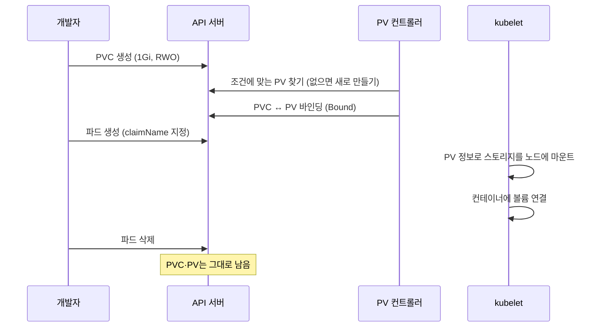
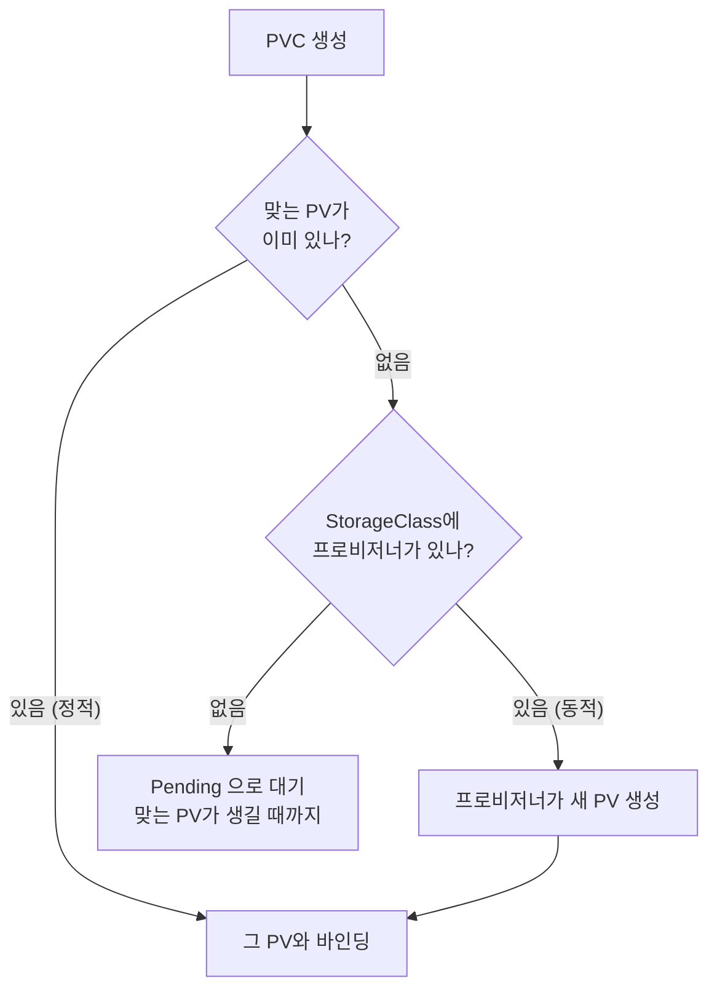

# 10.1 쿠버네티스의 영속 스토리지 이해하기

파드에 직접 붙이는 볼륨 중 `emptyDir`은 파드와 함께 사라지고, `hostPath`는 특정 노드에 묶입니다([9.4절](<../09장. 스토리지와 설정, 메타데이터를 위한 볼륨 추가하기/9.4 hostPath로 노드의 파일 시스템 사용하기.md>)에서 다룹니다). **데이터베이스처럼 파드가 몇 번을 다시 떠도 같은 데이터를 봐야 하는 앱**에는 둘 다 부족합니다.

이 장의 답은 **퍼시스턴트볼륨(PersistentVolume, PV)** 과 **퍼시스턴트볼륨클레임(PersistentVolumeClaim, PVC)** 입니다. 스토리지를 파드에서 떼어 내 **파드보다 오래 사는 별도의 오브젝트**로 다루는 방식입니다.

> **"파드 매니페스트에 NFS 서버 주소를 바로 적으면 안 되나요?"** 됩니다. 볼륨 종류 중에는 `nfs`처럼 파드 안에 스토리지 정보를 직접 적는 것도 있습니다. 문제는 **그 매니페스트가 그 클러스터에서만 돌아간다**는 점입니다. 서버 주소, 디스크 ID 같은 인프라 정보가 앱 정의에 섞이면, 다른 클러스터로 옮길 때마다 매니페스트를 고쳐야 합니다.

## 10.1.1 앱은 PVC로 요청하고, 인프라는 PV로 답합니다

쿠버네티스는 스토리지를 두 오브젝트로 나눕니다.

| 오브젝트 | 누가 만드나 | 담는 내용 | 범위 |
| :--- | :--- | :--- | :--- |
| **PersistentVolume (PV)** | 클러스터 관리자 또는 **프로비저너(provisioner)** | 실제 스토리지가 어디 있고 어떻게 붙이는지 (NFS 경로, 디스크 ID, 노드 경로 …) | **클러스터 전역** |
| **PersistentVolumeClaim (PVC)** | 앱 개발자 | "이만큼, 이런 방식으로 쓸 스토리지가 필요하다"는 **요청** | **네임스페이스** |

파드는 PV를 직접 가리키지 않습니다. **파드는 PVC를 가리키고, PVC가 PV에 묶입니다.** 이 묶임을 **바인딩(binding)** 이라고 합니다.


이렇게 나누면 역할이 깔끔해집니다.

* **개발자**는 PVC에 **크기와 접근 방식**만 적습니다. 그 뒤에 무엇이 있는지 몰라도 됩니다.
* **관리자(또는 프로비저너)** 는 PV에 **인프라의 세부 정보**를 적습니다.
* 같은 앱 매니페스트(파드 + PVC)를 **다른 클러스터에 그대로 가져가도** 그쪽의 PV에 묶여 동작합니다.

### PV는 네임스페이스에 속하지 않습니다

`kubectl api-resources`로 두 리소스의 `NAMESPACED` 열을 보면 차이가 바로 보입니다.

```bash
kubectl api-resources | grep -E 'persistentvolume|storageclasses'
```

```
persistentvolumeclaims              pvc          v1                                true         PersistentVolumeClaim
persistentvolumes                   pv           v1                                false        PersistentVolume
storageclasses                      sc           storage.k8s.io/v1                 false        StorageClass
```

PVC는 `true`(네임스페이스 소속), PV와 StorageClass는 `false`(클러스터 전역)입니다. **노드가 클러스터 자원이듯, PV도 클러스터 자원**입니다. 파드는 **같은 네임스페이스의 PVC만** 쓸 수 있습니다.

> **PV에는 `-n`이 의미가 없습니다.** `kubectl get pv -n foo`라고 해도 모든 PV가 나옵니다. 여러 팀이 한 클러스터를 쓰면 PV 목록에 남의 볼륨이 함께 보이는 것이 정상입니다. 이 실습 클러스터에서도 다른 장의 PV가 함께 보였습니다. 그래서 이 장의 노트에서는 PV를 이름으로 지정해 조회합니다.

### PVC는 "보관증"입니다

PVC는 요청서이자, 바인딩된 뒤에는 **그 PV를 독점한다는 증표**입니다. 공식 문서도 PVC가 자원에 대한 **claim check**(보관증) 역할을 한다고 설명합니다.

* 한 PV에는 **PVC 하나만** 묶입니다(1:1).
* PVC를 지우지 않는 한, 그 PV는 다른 PVC에 넘어가지 않습니다.
* **파드를 지워도 PVC와 PV는 그대로 남습니다.** 새 파드가 같은 PVC를 가리키면 같은 데이터를 다시 봅니다.



## 10.1.2 PV를 만드는 두 가지 방법 — 동적과 정적

PVC를 만들었을 때 짝이 될 PV는 어디서 올까요? 두 갈래입니다.

| 방식 | PV를 만드는 주체 | 언제 만들어지나 | 이 장의 절 |
| :--- | :--- | :--- | :--- |
| **동적 프로비저닝(dynamic provisioning)** | **프로비저너**가 자동으로 | PVC가 생기면(또는 그 PVC를 쓸 파드가 스케줄되면) | [10.2절](<10.2 PersistentVolume 동적으로 만들기.md>) |
| **정적 프로비저닝(static provisioning)** | **관리자**가 미리 손으로 | PVC보다 먼저 | [10.3절](<10.3 PersistentVolume 미리 만들어 두기.md>) |

동적 프로비저닝의 열쇠는 **스토리지클래스(StorageClass)** 입니다. "이 종류의 스토리지는 이 프로비저너가 이런 설정으로 만든다"를 적어 둔 오브젝트입니다. PVC가 클래스 이름을 대면, 그 클래스의 프로비저너가 PV를 만들어 바인딩해 줍니다.

```bash
kubectl get storageclass
```

```
NAME                 PROVISIONER             RECLAIMPOLICY   VOLUMEBINDINGMODE      ALLOWVOLUMEEXPANSION   AGE
standard (default)   rancher.io/local-path   Delete          WaitForFirstConsumer   false                  2m21s
```

kind 클러스터에는 `standard`라는 클래스가 기본으로 들어 있습니다. `(default)` 표시는 **PVC가 클래스를 지정하지 않으면 이 클래스를 쓴다**는 뜻입니다. 프로비저너 `rancher.io/local-path`는 **노드의 디렉터리를 하나 만들어 PV로 내주는** 간단한 프로비저너입니다.



> **요즘 클러스터는 거의 동적입니다.** 클라우드의 관리형 쿠버네티스는 대부분 기본 StorageClass를 갖추고 있어서, 개발자는 PVC만 만들면 됩니다. 정적 프로비저닝은 **노드에 직접 붙은 디스크(local volume)** 나 **이미 데이터가 들어 있는 기존 스토리지**를 클러스터에 들여올 때 주로 씁니다.

> **실습 환경의 한계.** kind의 `local-path`는 동적 프로비저닝을 흉내 내기에는 충분하지만, 실제 클라우드 디스크와 다른 점이 많습니다. 요청한 용량을 강제하지 않고, `ReadWriteOnce` 계열만 지원하고, 클론·스냅샷·확장을 하지 못합니다. 이 차이는 10.2~10.4절에서 실측으로 하나씩 확인합니다.

## 요약 및 비유

| 개념 | 주차장 비유 | 기술적 의미 |
| :--- | :--- | :--- |
| **PV** | 실제로 그려진 주차 칸 | 실제 스토리지를 가리키는 클러스터 전역 오브젝트 |
| **PVC** | 월 정기 주차권 ("소형차 1칸") | 크기·접근 방식을 적은 네임스페이스 오브젝트 |
| **바인딩** | 주차권에 칸 번호를 지정 | PVC와 PV를 1:1로 묶음 |
| **파드** | 주차하는 차 | PVC를 통해서만 스토리지를 씀 |
| **파드 삭제 후 재생성** | 차를 빼서 나갔다 와도 같은 지정석 | PVC가 남아 있으면 같은 PV를 다시 봄 |
| **StorageClass** | 구역 등급 (일반 구역, 전기차 충전 구역) | 어떤 프로비저너가 어떤 설정으로 만들지 |
| **동적 프로비저닝** | 주차권을 끊으면 그 자리에서 칸을 새로 그려 줌 | 프로비저너가 PVC에 맞춰 PV를 생성 |
| **정적 프로비저닝** | 미리 그려 둔 칸 중에서 배정 | 관리자가 만들어 둔 PV 중에서 골라 바인딩 |

## 결론

* 스토리지를 **PV(인프라 쪽)** 와 **PVC(앱 쪽 요청)** 로 나눠, 앱 매니페스트에서 인프라 정보를 빼냅니다.
* 파드는 **PVC만** 가리킵니다. PVC와 PV는 **1:1로 바인딩**되고, 파드를 지워도 남습니다.
* **PV와 StorageClass는 클러스터 전역**, PVC는 네임스페이스 소속입니다. 파드는 같은 네임스페이스의 PVC만 쓸 수 있습니다.
* PV를 마련하는 방법은 **동적(StorageClass + 프로비저너)** 과 **정적(관리자가 미리 생성)** 두 가지이고, 요즘은 동적이 기본입니다.
* kind의 `local-path`는 실습용입니다. **용량 제한, 접근 모드, 클론·확장** 면에서 실제 스토리지와 다릅니다.

## 출처

> 2026-10-05 공식 문서로 검증

* 원서: *Kubernetes in Action, Second Edition* 10장 — <https://livebook.manning.com/book/kubernetes-in-action-second-edition/>
* [Persistent Volumes](https://kubernetes.io/docs/concepts/storage/persistent-volumes/) — Kubernetes 공식 문서
* [Storage Classes](https://kubernetes.io/docs/concepts/storage/storage-classes/) — Kubernetes 공식 문서
* [Dynamic Volume Provisioning](https://kubernetes.io/docs/concepts/storage/dynamic-provisioning/) — Kubernetes 공식 문서
* [GitHub - rancher/local-path-provisioner: Dynamically provisioning persistent local storage with Kubernetes](https://github.com/rancher/local-path-provisioner) — local-path-provisioner 저장소
