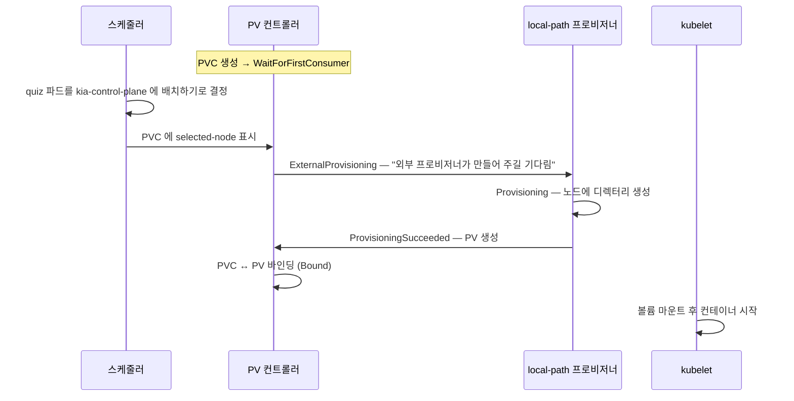
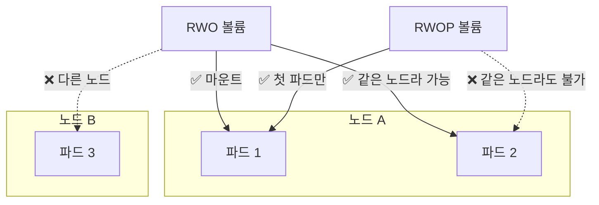
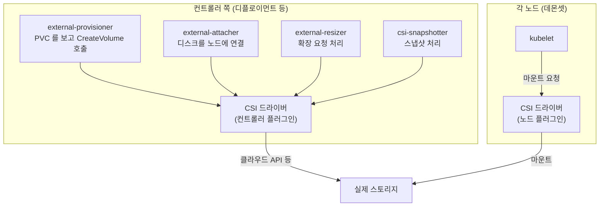

# 10.2 PersistentVolume 동적으로 만들기

[10.1절](<10.1 쿠버네티스의 영속 스토리지 이해하기.md>)에서 PV와 PVC의 역할을 나눠 봤습니다. 이번에는 직접 써 봅니다. **PVC 하나만 만들면 PV는 프로비저너가 알아서 만들어 줍니다.** 이것이 **동적 프로비저닝(dynamic provisioning)** 입니다.

실습은 퀴즈 앱의 MongoDB 데이터를 PVC에 담는 예제로 진행합니다. 파드를 지웠다 다시 만들어도 데이터가 남는지가 핵심입니다.

## 10.2.1 PVC를 만들면 일단 `Pending`입니다

**pvc.quiz-data.yaml**

```yaml
apiVersion: v1
kind: PersistentVolumeClaim
metadata:
  name: quiz-data
spec:
  resources:
    requests:
      storage: 1Gi              # 최소 이만큼은 필요하다
  accessModes:
  - ReadWriteOncePod            # 클러스터 전체에서 파드 하나만 읽고 쓴다
                                # storageClassName 은 일부러 비워 둠 → 기본 클래스
```

```bash
kubectl apply -f pvc.quiz-data.yaml
kubectl get pvc
```

```
NAME        STATUS    VOLUME   CAPACITY   ACCESS MODES   STORAGECLASS   VOLUMEATTRIBUTESCLASS   AGE
quiz-data   Pending                                      standard       <unset>                 0s
```

`STORAGECLASS` 열에 `standard`가 찍혔습니다. 매니페스트에는 적지 않았는데, API 서버가 **기본 StorageClass 이름을 채워 넣은 것**입니다. 그런데 `STATUS`는 `Pending`이고 `VOLUME`은 비어 있습니다. 이유는 `describe`가 알려 줍니다.

```bash
kubectl describe pvc quiz-data
```

```
Name:          quiz-data
Namespace:     ch10
StorageClass:  standard
Status:        Pending
Volume:        
Labels:        <none>
Annotations:   <none>
Finalizers:    [kubernetes.io/pvc-protection]
Capacity:      
Access Modes:  
VolumeMode:    Filesystem
Used By:       <none>
Events:
  Type    Reason                Age              From                         Message
  ----    ------                ----             ----                         -------
  Normal  WaitForFirstConsumer  3s (x2 over 6s)  persistentvolume-controller  waiting for first consumer to be created before binding
```

`waiting for first consumer to be created before binding` — **이 PVC를 쓸 파드가 생길 때까지 기다린다**는 뜻입니다. `standard` 클래스의 `volumeBindingMode`가 `WaitForFirstConsumer`이기 때문입니다(10.2.5에서 자세히 봅니다).

> **`Pending`이라고 다 문제는 아닙니다.** `WaitForFirstConsumer` 클래스에서는 파드 없이 PVC만 있으면 **`Pending`이 정상**입니다. 이벤트의 `Reason`이 `WaitForFirstConsumer`인지 먼저 보세요. `ProvisioningFailed`나 `FailedBinding`이면 그때가 진짜 문제입니다.

`Finalizers`에 `kubernetes.io/pvc-protection`이 벌써 붙어 있는 것도 기억해 두세요. 10.2.3에서 이 파이널라이저가 일을 합니다.

## 10.2.2 파드가 PVC를 쓰면 그때 PV가 생깁니다

**pod.quiz.yaml**

```yaml
apiVersion: v1
kind: Pod
metadata:
  name: quiz
spec:
  volumes:
  - name: quiz-data
    persistentVolumeClaim:      # 볼륨의 출처가 PVC
      claimName: quiz-data      # 같은 네임스페이스의 PVC 이름
  containers:
  - name: mongo
    image: docker.io/library/mongo:7
    volumeMounts:
    - name: quiz-data
      mountPath: /data/db       # MongoDB 데이터 디렉터리
```

```bash
kubectl apply -f pod.quiz.yaml
kubectl get pvc
```

```
NAME        STATUS   VOLUME                                     CAPACITY   ACCESS MODES   STORAGECLASS   VOLUMEATTRIBUTESCLASS   AGE
quiz-data   Bound    pvc-1b4f3860-db0d-40f5-91c3-329d76e6af9d   1Gi        RWOP           standard       <unset>                 112s
```

```bash
kubectl get pv
```

```
NAME                                       CAPACITY   ACCESS MODES   RECLAIM POLICY   STATUS   CLAIM            STORAGECLASS   VOLUMEATTRIBUTESCLASS   REASON   AGE
pvc-1b4f3860-db0d-40f5-91c3-329d76e6af9d   1Gi        RWOP           Delete           Bound    ch10/quiz-data   standard       <unset>                          96s
pvc-ab4d4264-a042-4546-9fa4-373df1a43d28   1Gi        RWO            Delete           Bound    ch12/quiz-data   standard       <unset>                          25s
pvc-eafec18a-ecd4-434e-bb7b-7e90fb257af7   1Gi        RWO            Delete           Bound    ch11/quiz-data   standard       <unset>                          31s
```

PVC가 `Bound`가 되었고, `pvc-1b4f…`라는 PV가 새로 생겼습니다. 첫 줄이 우리 것입니다(`CLAIM`이 `ch10/quiz-data`). 나머지 두 줄은 같은 클러스터를 쓰는 다른 실습의 PV입니다. **PV는 클러스터 전역이라 남의 것도 함께 보입니다.**

* 동적으로 만든 PV의 이름은 **`pvc-<PVC의 UID>`** 형식입니다.
* `RECLAIM POLICY`는 클래스에서 물려받은 **`Delete`** 입니다. 10.2.3에서 이 값의 무게를 실감합니다.

### 이벤트로 본 프로비저닝 과정

```bash
kubectl describe pvc quiz-data
```

```
Annotations:   pv.kubernetes.io/bind-completed: yes
               pv.kubernetes.io/bound-by-controller: yes
               volume.beta.kubernetes.io/storage-provisioner: rancher.io/local-path
               volume.kubernetes.io/selected-node: kia-control-plane
               volume.kubernetes.io/storage-provisioner: rancher.io/local-path
...
Used By:       quiz
...
Events:
  Type    Reason                 Age                  From                                                                                                Message
  ----    ------                 ----                 ----                                                                                                -------
  Normal  WaitForFirstConsumer   116s (x2 over 119s)  persistentvolume-controller                                                                         waiting for first consumer to be created before binding
  Normal  ExternalProvisioning   106s (x2 over 106s)  persistentvolume-controller                                                                         Waiting for a volume to be created either by the external provisioner 'rancher.io/local-path' or manually by the system administrator. If volume creation is delayed, please verify that the provisioner is running and correctly registered.
  Normal  Provisioning           106s                 rancher.io/local-path_local-path-provisioner-75f7fc7dc5-72n2w_053dec69-23ac-4ad6-b304-0d760dcee185  External provisioner is provisioning volume for claim "ch10/quiz-data"
  Normal  ProvisioningSucceeded  103s                 rancher.io/local-path_local-path-provisioner-75f7fc7dc5-72n2w_053dec69-23ac-4ad6-b304-0d760dcee185  Successfully provisioned volume pvc-1b4f3860-db0d-40f5-91c3-329d76e6af9d
```



`volume.kubernetes.io/selected-node: kia-control-plane` 주석이 순서를 보여 줍니다. **스케줄러가 노드를 먼저 고르고, 프로비저너는 그 노드에 맞춰 볼륨을 만듭니다.** `ExternalProvisioning` 이벤트의 "외부 프로비저너"는 쿠버네티스 바깥에서 따로 도는 프로그램이라는 뜻입니다. 이 클러스터에서는 `local-path-storage` 네임스페이스의 `local-path-provisioner` 파드입니다.

### PV 안을 들여다보기

```bash
kubectl get pv pvc-1b4f3860-db0d-40f5-91c3-329d76e6af9d -o yaml
```

```
apiVersion: v1
kind: PersistentVolume
metadata:
  annotations:
    local.path.provisioner/selected-node: kia-control-plane
    pv.kubernetes.io/provisioned-by: rancher.io/local-path
  creationTimestamp: "2026-10-05T09:25:23Z"
  finalizers:
  - kubernetes.io/pv-protection
  name: pvc-1b4f3860-db0d-40f5-91c3-329d76e6af9d
  resourceVersion: "917"
  uid: c7f1bfed-7310-4489-ab2f-f15dd66545d6
spec:
  accessModes:
  - ReadWriteOncePod
  capacity:
    storage: 1Gi
  claimRef:
    apiVersion: v1
    kind: PersistentVolumeClaim
    name: quiz-data
    namespace: ch10
    resourceVersion: "895"
    uid: 1b4f3860-db0d-40f5-91c3-329d76e6af9d
  hostPath:
    path: /var/local-path-provisioner/pvc-1b4f3860-db0d-40f5-91c3-329d76e6af9d_ch10_quiz-data
    type: DirectoryOrCreate
  nodeAffinity:
    required:
      nodeSelectorTerms:
      - matchExpressions:
        - key: kubernetes.io/hostname
          operator: In
          values:
          - kia-control-plane
  persistentVolumeReclaimPolicy: Delete
  storageClassName: standard
  volumeMode: Filesystem
status:
  lastPhaseTransitionTime: "2026-10-05T09:25:23Z"
  phase: Bound
```

| 필드 | 뜻 |
| :--- | :--- |
| **`claimRef`** | 이 PV를 차지한 PVC. **UID까지** 기록됩니다 |
| **`hostPath.path`** | 실제 데이터가 놓인 노드 디렉터리 |
| **`nodeAffinity`** | 이 PV는 `kia-control-plane` 노드에서만 쓸 수 있음 |
| **`persistentVolumeReclaimPolicy`** | PVC가 지워지면 PV를 어떻게 할지 |

노드 안에서 그 디렉터리를 직접 보면 MongoDB 파일이 들어 있습니다.

```bash
podman exec kia-control-plane ls /var/local-path-provisioner/pvc-1b4f3860-db0d-40f5-91c3-329d76e6af9d_ch10_quiz-data | head
```

```
WiredTiger
WiredTiger.lock
WiredTiger.turtle
WiredTiger.wt
WiredTigerHS.wt
_mdb_catalog.wt
collection-0-4144033058959297558.wt
collection-2-4144033058959297558.wt
collection-4-4144033058959297558.wt
collection-7-4144033058959297558.wt
```

> **`local-path`는 요청한 용량을 강제하지 않습니다.** PV에는 `1Gi`라고 적혀 있지만, 컨테이너 안에서 보면 노드 디스크 전체가 보입니다.
> ```bash
> kubectl exec quiz -- df -h /data/db
> ```
> ```
> Filesystem      Size  Used Avail Use% Mounted on
> /dev/sdd       1007G  6.0G  950G   1% /data/db
> ```
> local-path-provisioner README도 용량 제한을 지원하지 않는다고 밝힙니다. 클라우드 디스크는 정말 1Gi짜리 디스크가 만들어지므로, **용량이 꽉 차는 상황은 kind에서 재현되지 않습니다.**

### 파드를 지워도 데이터는 남습니다

데이터를 하나 넣고 파드를 지웠다가 다시 만들어 봅니다.

```bash
kubectl exec quiz -c mongo -- mongosh kiada --quiet \
  --eval 'db.questions.insertOne({id: 1, text: "What is kubectl?"})'
```

```
{
  acknowledged: true,
  insertedId: ObjectId('6ac36d72186a065e2b9f03fe')
}
```

```bash
kubectl delete pod quiz                   # 파드 삭제
kubectl get pvc quiz-data                 # PVC 는?
```

```
pod "quiz" deleted from ch10 namespace
NAME        STATUS   VOLUME                                     CAPACITY   ACCESS MODES   STORAGECLASS   VOLUMEATTRIBUTESCLASS   AGE
quiz-data   Bound    pvc-1b4f3860-db0d-40f5-91c3-329d76e6af9d   1Gi        RWOP           standard       <unset>                 2m39s
```

```bash
kubectl apply -f pod.quiz.yaml            # 같은 PVC 로 다시 생성
kubectl exec quiz -c mongo -- mongosh kiada --quiet --eval 'db.questions.find({}, {_id: 0})'
```

```
pod/quiz created
[ { id: 1, text: 'What is kubectl?' } ]
```

**새 파드가 같은 데이터를 봅니다.** PVC가 남아 있는 한, 파드는 몇 번이고 새로 떠도 됩니다. 이것이 `emptyDir`과의 결정적 차이입니다.

## 10.2.3 PVC를 지우면 PV도 지워집니다 — 회수 정책에 따라

### 사용 중인 PVC는 바로 지워지지 않습니다

파드가 아직 쓰고 있는 PVC를 지우면 어떻게 될까요?

```bash
kubectl delete pvc quiz-data --wait=false   # 끝날 때까지 기다리지 않음
kubectl get pvc quiz-data
```

```
persistentvolumeclaim "quiz-data" deleted from ch10 namespace
NAME        STATUS        VOLUME                                     CAPACITY   ACCESS MODES   STORAGECLASS   VOLUMEATTRIBUTESCLASS   AGE
quiz-data   Terminating   pvc-1b4f3860-db0d-40f5-91c3-329d76e6af9d   1Gi        RWOP           standard       <unset>                 2m52s
```

```bash
kubectl get pvc quiz-data -o jsonpath='{.metadata.deletionTimestamp}{"\n"}{.metadata.finalizers}{"\n"}'
```

```
2026-10-05T09:27:55Z
["kubernetes.io/pvc-protection"]
```

`deleted`라고 했지만 PVC는 **`Terminating`에 머뭅니다.** `deletionTimestamp`는 찍혔는데 파이널라이저 `kubernetes.io/pvc-protection`이 남아 있어서입니다. [5.2절](<../05장. 다중 컨테이너 파드와 객체 상태/5.2 초기화 컨테이너와 파드 삭제.md>)에서 "볼륨 보호 파이널라이저는 PVC·PV에 붙는다"고 예고했던 바로 그 장면입니다.

이 기능을 공식 문서는 **사용 중인 스토리지 오브젝트 보호(Storage Object in Use Protection)** 라고 부릅니다. 파드가 쓰는 동안 볼륨이 사라져 데이터를 잃는 사고를 막습니다. 실제로 파드는 아무 일 없이 계속 돕니다.

```bash
kubectl exec quiz -c mongo -- mongosh kiada --quiet --eval 'db.questions.countDocuments()'
```

```
1
```

> **`Terminating` PVC를 새 파드가 쓸 수는 없습니다.** 지우는 중인 PVC를 가리키는 파드(`quiz2`)를 새로 만들면 스케줄되지 않습니다.
> ```
> Warning  FailedScheduling  7s    default-scheduler  0/1 nodes are available: persistentvolumeclaim "quiz-data" is being deleted. not found
> ```
> "지우다 말았네" 하고 같은 PVC를 쓰는 파드를 다시 띄워도 소용없습니다. 지우기를 취소하는 방법은 없으니, **PVC를 지우기 전에 정말 지울 것인지** 확인하세요.

파드를 지우면 보호가 풀리고, 기다리던 삭제가 이어집니다.

```bash
kubectl delete pod quiz quiz2
kubectl get pvc
kubectl get pv pvc-1b4f3860-db0d-40f5-91c3-329d76e6af9d
```

```
pod "quiz" deleted from ch10 namespace
pod "quiz2" deleted from ch10 namespace
No resources found in ch10 namespace.
Error from server (NotFound): persistentvolumes "pvc-1b4f3860-db0d-40f5-91c3-329d76e6af9d" not found
```

PVC가 사라지자 **PV까지 함께 사라졌습니다.** 노드의 디렉터리도 지워졌습니다.

```bash
podman exec kia-control-plane ls /var/local-path-provisioner/
```

```
pvc-ab4d4264-a042-4546-9fa4-373df1a43d28_ch12_quiz-data
pvc-eafec18a-ecd4-434e-bb7b-7e90fb257af7_ch11_quiz-data
```

`ch10_quiz-data` 디렉터리가 없습니다. **MongoDB 데이터는 영영 사라졌습니다.** 이것이 회수 정책 `Delete`의 의미입니다.

### 회수 정책 — `Delete`와 `Retain`

**회수 정책(reclaim policy)** 은 PVC가 지워진 뒤 PV를 어떻게 할지 정합니다.

| 정책 | PVC 삭제 후 PV | 실제 스토리지 | 쓰는 곳 |
| :--- | :--- | :--- | :--- |
| **`Delete`** | 삭제 | **삭제** | 동적 프로비저닝의 기본값. 임시·재생성 가능한 데이터 |
| **`Retain`** | **`Released`로 남음** | 남음 | 지우면 안 되는 데이터. 정적 PV의 기본값 |
| `Recycle` | (폐기 예정) | `rm -rf`로 비우고 재사용 | 쓰지 않습니다 → [10.3절](<10.3 PersistentVolume 미리 만들어 두기.md>) |

동적으로 만든 PV는 **StorageClass의 `reclaimPolicy`를 물려받고, 클래스에 적지 않으면 `Delete`** 입니다. `Retain` 클래스를 하나 만들어 비교해 봅니다.

**sc.ch10-retain.yaml**

```yaml
apiVersion: storage.k8s.io/v1
kind: StorageClass
metadata:
  name: ch10-retain
provisioner: rancher.io/local-path
reclaimPolicy: Retain                     # PVC 를 지워도 PV 와 데이터를 남긴다
volumeBindingMode: WaitForFirstConsumer
allowVolumeExpansion: true                # 10.4절 확장 실험용
```

`quiz-data-retain` PVC(클래스 `ch10-retain`)와 파드를 만들어 파일 하나(`keep-me.txt`, 내용 `hello`)를 쓴 뒤, 파드와 PVC를 차례로 지웁니다.

```bash
kubectl delete pod quiz-retain
kubectl delete pvc quiz-data-retain
kubectl get pv pvc-0377c7bb-17f1-48e3-89a5-2d23152e28d0
```

```
NAME                                       CAPACITY   ACCESS MODES   RECLAIM POLICY   STATUS     CLAIM                   STORAGECLASS   VOLUMEATTRIBUTESCLASS   REASON   AGE
pvc-0377c7bb-17f1-48e3-89a5-2d23152e28d0   1Gi        RWO            Retain           Released   ch10/quiz-data-retain   ch10-retain    <unset>                          57s
```

PV가 남아 **`Released`** 상태가 되었습니다. `CLAIM` 열에는 이미 지워진 PVC 이름이 그대로 적혀 있습니다. 노드의 데이터도 멀쩡합니다.

```bash
podman exec kia-control-plane sh -c 'cat /var/local-path-provisioner/*ch10_quiz-data-retain/keep-me.txt'
```

```
hello
```

`Released` PV를 다시 쓰는 방법은 [10.3절](<10.3 PersistentVolume 미리 만들어 두기.md>)에서 다룹니다. 미리 말하면, **`Released`는 "다른 PVC가 바로 쓸 수 있다"는 뜻이 아닙니다.**

> **이미 만든 PV의 정책도 바꿀 수 있습니다.** 클래스가 `Delete`여서 걱정된다면, 중요한 PV만 골라 `Retain`으로 바꿔 두면 됩니다.
> ```bash
> kubectl patch pv pvc-f6b32c7e-0288-4e42-a2f8-4b096569a11e \
>   -p '{"spec":{"persistentVolumeReclaimPolicy":"Retain"}}'
> ```
> ```
> persistentvolume/pvc-f6b32c7e-0288-4e42-a2f8-4b096569a11e patched
> ```
> 운영 DB의 PVC를 지우기 전에 이렇게 바꿔 두는 것이 흔한 안전장치입니다.

> **`Retain` PV를 지워도 실제 데이터는 남습니다.** PV 오브젝트를 `kubectl delete pv`로 지워도, 노드의 `/var/local-path-provisioner/…_ch10_quiz-data-retain` 디렉터리는 그대로 남았습니다(실측). 클라우드라면 **디스크가 계속 남아 요금이 나갑니다.** `Retain`을 쓰면 뒷정리는 사람 몫입니다.

## 10.2.4 접근 모드 — "몇 개의 노드(파드)가 동시에 쓰나"

**접근 모드(access mode)** 는 볼륨을 동시에 몇 곳에서, 읽기·쓰기 중 무엇으로 마운트할 수 있는지를 뜻합니다.

| 모드 | 약어 | 의미 |
| :--- | :--- | :--- |
| **`ReadWriteOnce`** | RWO | **한 노드**가 읽기·쓰기로 마운트. 같은 노드의 파드 여럿은 함께 쓸 수 있음 |
| **`ReadOnlyMany`** | ROX | 여러 노드가 읽기 전용으로 마운트 |
| **`ReadWriteMany`** | RWX | 여러 노드가 읽기·쓰기로 마운트 |
| **`ReadWriteOncePod`** | RWOP | **클러스터 전체에서 파드 하나**만 읽기·쓰기로 마운트 |

**RWO의 "Once"는 파드가 아니라 노드 기준입니다.** 이 차이가 가장 많이 헷갈립니다.



### RWOP — 두 번째 파드는 스케줄되지 않습니다

`quiz-data`는 RWOP였습니다. `quiz`가 도는 중에 같은 PVC를 쓰는 `quiz2`를 만들어 봅니다.

```bash
kubectl apply -f pod.quiz2.yaml
kubectl get pods
```

```
NAME    READY   STATUS    RESTARTS   AGE
quiz    1/1     Running   0          2m18s
quiz2   0/1     Pending   0          8s
```

```bash
kubectl describe pod quiz2
```

```
Events:
  Type     Reason            Age   From               Message
  ----     ------            ----  ----               -------
  Warning  FailedScheduling  9s    default-scheduler  0/1 nodes are available: 1 node(s) unavailable due to PersistentVolumeClaim with ReadWriteOncePod access mode already in-use by another pod. preemption: 0/1 nodes are available: 1 No preemption victims found for incoming pod.
```

노드가 하나뿐인데도 거절당했습니다. **RWOP는 노드가 아니라 파드 단위로 막기** 때문입니다. MongoDB처럼 **두 프로세스가 같은 데이터 파일을 열면 망가지는 앱**에 딱 맞습니다.

### RWO — 같은 노드면 여러 파드가 함께 씁니다

RWO PVC 하나를 두 파드가 쓰게 해 봅니다. 파드 매니페스트는 `generateName`을 써서 같은 파일로 여러 번 만들 수 있게 했고, 각 파드는 자기 이름으로 파일을 하나씩 씁니다.

**pod.demo-rwo.yaml**

```yaml
apiVersion: v1
kind: Pod
metadata:
  generateName: demo-read-write-once-     # 뒤에 무작위 접미사가 붙음
  labels:
    app: demo-read-write-once
spec:
  volumes:
  - name: volume
    persistentVolumeClaim:
      claimName: demo-read-write-once     # RWO, 1Gi PVC
  containers:
  - name: main
    image: docker.io/library/busybox
    command:
    - sh
    - -c
    - |
      echo "Created by pod $HOSTNAME." > /mnt/volume/$HOSTNAME.txt ;
      sleep infinity
    volumeMounts:
    - name: volume
      mountPath: /mnt/volume
  terminationGracePeriodSeconds: 0
```

```bash
kubectl create -f pod.demo-rwo.yaml       # generateName 은 apply 가 아니라 create
kubectl create -f pod.demo-rwo.yaml
kubectl get pods -l app=demo-read-write-once -o wide
```

```
NAME                         READY   STATUS    RESTARTS   AGE   IP            NODE                NOMINATED NODE   READINESS GATES
demo-read-write-once-n9sdf   1/1     Running   0          17s   10.244.0.51   kia-control-plane   <none>           <none>
demo-read-write-once-qg48x   1/1     Running   0          16s   10.244.0.52   kia-control-plane   <none>           <none>
```

```bash
kubectl exec demo-read-write-once-n9sdf -- ls /mnt/volume
```

```
demo-read-write-once-n9sdf.txt
demo-read-write-once-qg48x.txt
```

**두 파드가 모두 `Running`이고, 서로의 파일이 한 볼륨에 보입니다.** 같은 노드에 있기 때문입니다. `kubectl describe pvc`의 `Used By`에도 두 파드가 함께 나옵니다.

```
Used By:       demo-read-write-once-n9sdf
               demo-read-write-once-qg48x
```

> **"RWO니까 파드 하나만 쓰겠지"는 착각입니다.** 디플로이먼트의 레플리카가 우연히 같은 노드에 몰리면 **RWO 볼륨을 동시에 엽니다.** 반대로 다른 노드로 간 레플리카는 그 볼륨을 마운트하지 못합니다(노드가 하나인 이 실습에서는 재현할 수 없습니다). 같은 매니페스트가 파드 배치에 따라 다르게 동작하는 셈입니다. 파드 하나만 써야 한다면 **RWOP**를 쓰세요.

### 스토리지가 지원하지 않는 모드는 프로비저닝이 실패합니다

PVC가 요청하는 모드는 **실제 스토리지가 지원해야** 합니다. `local-path`에 RWX를 요청해 봅니다.

```bash
kubectl apply -f pvc.demo-rwx.yaml -f pod.demo-rwx.yaml   # PVC 는 ReadWriteMany
kubectl get pvc,pod
```

```
NAME                                         STATUS    VOLUME   CAPACITY   ACCESS MODES   STORAGECLASS   VOLUMEATTRIBUTESCLASS   AGE
persistentvolumeclaim/demo-read-write-many   Pending                                      standard       <unset>                 11s

NAME                       READY   STATUS    RESTARTS   AGE
pod/demo-read-write-many   0/1     Pending   0          11s
```

```bash
kubectl describe pvc demo-read-write-many
```

```
Events:
  Type     Reason                Age               From                                                                                                Message
  ----     ------                ----              ----                                                                                                -------
  Normal   WaitForFirstConsumer  12s               persistentvolume-controller                                                                         waiting for first consumer to be created before binding
  Normal   Provisioning          12s               rancher.io/local-path_local-path-provisioner-75f7fc7dc5-72n2w_053dec69-23ac-4ad6-b304-0d760dcee185  External provisioner is provisioning volume for claim "ch10/demo-read-write-many"
  Warning  ProvisioningFailed    12s               rancher.io/local-path_local-path-provisioner-75f7fc7dc5-72n2w_053dec69-23ac-4ad6-b304-0d760dcee185  failed to provision volume with StorageClass "standard": NodePath only supports ReadWriteOnce and ReadWriteOncePod (1.22+) access modes
```

`NodePath only supports ReadWriteOnce and ReadWriteOncePod` — 노드 디렉터리 하나로는 여러 노드가 함께 쓸 수 없으니 당연합니다. RWX가 필요하면 NFS나 클라우드 파일 스토리지(EFS, Azure Files 등)처럼 **네트워크 파일시스템 계열 드라이버**를 써야 합니다.

> **파드 쪽 `describe`에는 단서가 없습니다.** 이 실험에서 `kubectl describe pod demo-read-write-many`의 `Events`는 `<none>`이었습니다. **파드가 볼륨 때문에 `Pending`이면 PVC의 이벤트를 보세요.** 원인은 대개 그쪽에 적혀 있습니다.

### 접근 모드는 만든 뒤에 바꿀 수 없습니다

```bash
kubectl patch pvc demo-read-write-once -p '{"spec":{"accessModes":["ReadWriteOncePod"]}}'
```

```
The PersistentVolumeClaim "demo-read-write-once" is invalid: spec: Forbidden: spec is immutable after creation except resources.requests and volumeAttributesClassName for bound claims
```

바인딩된 PVC에서 바꿀 수 있는 것은 **`resources.requests`(크기)와 `volumeAttributesClassName`** 뿐이라고 메시지가 정확히 알려 줍니다. 크기 변경은 [10.4절](<10.4 PersistentVolume 관리하기.md>)에서 다룹니다.

> **접근 모드가 쓰기를 막아 주지는 않습니다.** 공식 문서는 접근 모드가 **PVC와 PV를 짝짓는 기준**일 뿐, 마운트된 뒤의 쓰기 보호를 강제하지 않는다고 설명합니다(RWOP만 예외로 "파드 하나"를 실제로 제한). 읽기 전용으로 쓰려면 파드의 볼륨 정의에 `persistentVolumeClaim.readOnly: true`를 함께 적으세요.

## 10.2.5 StorageClass — 어떤 스토리지를 어떻게 만들지

```bash
kubectl get sc standard -o yaml
```

```
apiVersion: storage.k8s.io/v1
kind: StorageClass
metadata:
  annotations:
    kubectl.kubernetes.io/last-applied-configuration: |
      {"apiVersion":"storage.k8s.io/v1","kind":"StorageClass","metadata":{"annotations":{"storageclass.kubernetes.io/is-default-class":"true"},"name":"standard"},"provisioner":"rancher.io/local-path","reclaimPolicy":"Delete","volumeBindingMode":"WaitForFirstConsumer"}
    storageclass.kubernetes.io/is-default-class: "true"
  creationTimestamp: "2026-10-05T09:22:28Z"
  name: standard
  resourceVersion: "449"
  uid: ce217e41-2fce-4f84-8ebe-793b1e48736c
provisioner: rancher.io/local-path
reclaimPolicy: Delete
volumeBindingMode: WaitForFirstConsumer
```

| 필드 | 뜻 | 기본값 |
| :--- | :--- | :--- |
| **`provisioner`** | PV를 만들 프로비저너 이름 | 필수 |
| `parameters` | 프로비저너에게 넘길 설정 (디스크 종류, IOPS 등). 프로비저너마다 다름 | 없음 |
| **`reclaimPolicy`** | 이 클래스로 만든 PV의 회수 정책 | `Delete` |
| **`volumeBindingMode`** | 언제 바인딩·프로비저닝할지 | `Immediate` |
| `allowVolumeExpansion` | PVC 크기를 늘릴 수 있는지 | `false` |
| `mountOptions` | 마운트 옵션 | 없음 |
| 주석 `storageclass.kubernetes.io/is-default-class` | 기본 클래스 표시 | — |

> **StorageClass는 만든 뒤 대부분 고칠 수 없습니다.** 시험용 클래스로 확인해 보면 `allowVolumeExpansion`만 바뀌고 나머지는 거부됩니다.
> ```
> The StorageClass "ch10-tmp" is invalid: reclaimPolicy: Invalid value: null: field is immutable
> The StorageClass "ch10-tmp" is invalid: volumeBindingMode: Invalid value: null: field is immutable
> The StorageClass "ch10-tmp" is invalid: parameters: Invalid value: null: field is immutable
> ```
> 바꾸려면 지우고 다시 만들어야 합니다. 클래스를 지워도 **이미 만들어진 PV는 영향을 받지 않습니다.** 클래스는 PV를 만드는 순간에 쓰이는 틀이기 때문입니다.

### `Immediate`와 `WaitForFirstConsumer`

| 모드 | 바인딩 시점 | 장점 | 단점 |
| :--- | :--- | :--- | :--- |
| **`Immediate`** | PVC를 만들자마자 | 단순함 | 파드가 갈 수 없는 노드·존에 볼륨이 생길 수 있음 |
| **`WaitForFirstConsumer`** | 그 PVC를 쓰는 파드가 스케줄될 때 | 파드의 배치 조건을 보고 볼륨 위치를 정함 | 파드 없이는 `Pending` |

노드 로컬 스토리지나 존(zone)에 묶인 클라우드 디스크는 **`WaitForFirstConsumer`가 사실상 필수**입니다. 볼륨이 먼저 존 A에 생겼는데 파드는 존 B로만 갈 수 있다면 영영 못 붙기 때문입니다.

`local-path`로 `Immediate` 클래스를 만들면 무슨 일이 생기는지 확인해 봤습니다.

**sc.ch10-immediate.yaml**

```yaml
apiVersion: storage.k8s.io/v1
kind: StorageClass
metadata:
  name: ch10-immediate
provisioner: rancher.io/local-path
volumeBindingMode: Immediate            # 파드를 기다리지 않음
```

```bash
kubectl describe pvc pvc-immediate      # storageClassName: ch10-immediate
```

```
Events:
  Type     Reason                Age               From                                                                                                Message
  ----     ------                ----              ----                                                                                                -------
  Normal   ExternalProvisioning  7s (x2 over 17s)  persistentvolume-controller                                                                         Waiting for a volume to be created either by the external provisioner 'rancher.io/local-path' or manually by the system administrator. If volume creation is delayed, please verify that the provisioner is running and correctly registered.
  Normal   Provisioning          2s (x2 over 17s)  rancher.io/local-path_local-path-provisioner-75f7fc7dc5-72n2w_053dec69-23ac-4ad6-b304-0d760dcee185  External provisioner is provisioning volume for claim "ch10/pvc-immediate"
  Warning  ProvisioningFailed    2s (x2 over 17s)  rancher.io/local-path_local-path-provisioner-75f7fc7dc5-72n2w_053dec69-23ac-4ad6-b304-0d760dcee185  failed to provision volume with StorageClass "ch10-immediate": configuration error, no node was specified
```

`no node was specified` — **어느 노드에 디렉터리를 만들지 모르니 만들 수 없다**는 뜻입니다. 노드 로컬 스토리지가 `WaitForFirstConsumer`를 요구하는 이유가 그대로 드러납니다.

### `storageClassName`을 어떻게 적느냐에 따라 다릅니다

| 적은 값 | 동작 | 실측 이벤트 |
| :--- | :--- | :--- |
| **생략** | 기본 클래스(`standard`)가 채워짐 | `WaitForFirstConsumer` (정상) |
| **`""`** (빈 문자열) | **동적 프로비저닝 끔.** 클래스 없는 PV만 찾음 | `FailedBinding` |
| **없는 이름** | 그 이름의 클래스를 찾다 실패 | `ProvisioningFailed` |

```bash
kubectl describe pvc pvc-no-class       # storageClassName: ""
```

```
Events:
  Type    Reason         Age               From                         Message
  ----    ------         ----              ----                         -------
  Normal  FailedBinding  8s (x2 over 18s)  persistentvolume-controller  no persistent volumes available for this claim and no storage class is set
```

```bash
kubectl describe pvc pvc-typo-class     # storageClassName: fast-ssd
```

```
Events:
  Type     Reason              Age               From                         Message
  ----     ------              ----              ----                         -------
  Warning  ProvisioningFailed  9s (x2 over 19s)  persistentvolume-controller  storageclass.storage.k8s.io "fast-ssd" not found
```

> **생략과 `""`는 완전히 다릅니다.** 생략은 "알아서 기본값으로", `""`는 "동적 프로비저닝 하지 말고 **미리 만들어 둔 클래스 없는 PV**에 묶어 달라"입니다. 정적 PV에 묶으려는데 기본 클래스가 끼어들어 새 PV가 만들어져 버리는 실수가 흔합니다. [10.3절](<10.3 PersistentVolume 미리 만들어 두기.md>)에서 다시 나옵니다.

> **클래스 이름 오타는 조용히 `Pending`입니다.** PVC 생성 자체는 성공하므로 `kubectl apply`만 보고는 모릅니다. 다른 클러스터의 매니페스트를 가져왔을 때(예: GKE의 `premium-rwo`를 kind에) 자주 겪습니다. **PVC가 `Pending`이면 `kubectl get sc`로 클래스가 정말 있는지부터** 보세요.

## 10.2.6 CSI 드라이버 — 스토리지를 쿠버네티스 밖에서 꽂아 넣는 규격

예전에는 AWS EBS, GCE PD 같은 스토리지 연동 코드가 **쿠버네티스 본체 안(in-tree)** 에 들어 있었습니다. 새 스토리지를 지원하려면 쿠버네티스 자체를 고쳐야 했습니다.

**CSI(Container Storage Interface)** 는 이 연동을 표준 인터페이스로 떼어 낸 규격입니다. 스토리지 회사는 **CSI 드라이버**를 만들어 클러스터에 설치하기만 하면 됩니다. 지금 쓰는 클라우드 스토리지 대부분이 CSI 드라이버로 제공됩니다.



* **사이드카 컨테이너**(external-provisioner, external-attacher, external-resizer, csi-snapshotter)가 쿠버네티스 API를 지켜보다가 드라이버에게 일을 시킵니다.
* 드라이버를 설치하면 보통 `CSIDriver` 오브젝트가 함께 생기고, 노드 플러그인이 뜬 노드의 `CSINode`에 드라이버가 등록됩니다.

kind 클러스터에서 확인해 보면 CSI 드라이버가 하나도 없습니다.

```bash
kubectl get csidrivers
kubectl get csinodes
```

```
No resources found
NAME                DRIVERS   AGE
kia-control-plane   0         12m
```

`local-path`는 CSI 드라이버가 아니라, 노드 디렉터리를 `hostPath` PV로 만들어 주는 **CSI가 아닌 외부 프로비저너**입니다. 그래서 CSI 사이드카가 해 주는 일 — 확장, 스냅샷, 클론 — 을 하지 못합니다. [10.4절](<10.4 PersistentVolume 관리하기.md>)의 실험들이 kind에서 실패하는 근본 이유입니다.

> **어떤 기능을 쓸 수 있는지는 드라이버가 정합니다.** RWX, 확장, 스냅샷, 클론, 용량 추적은 쿠버네티스 API에 있어도 **드라이버가 구현해야** 동작합니다. 클러스터를 고를 때는 CSI 드라이버 문서의 지원 기능 표를 먼저 보세요. Kubernetes CSI 문서의 드라이버 목록이 출발점입니다.

## 요약 및 비유

| 개념 | 렌터카 대여 비유 | 기술적 의미 |
| :--- | :--- | :--- |
| **PVC 생성 후 `Pending`** | 예약은 받았지만 차는 출발 지점이 정해져야 배차 | `WaitForFirstConsumer`라 파드가 생길 때까지 대기 |
| **동적 프로비저닝** | 예약이 들어오면 그 지점에 차를 갖다 놓음 | 프로비저너가 파드가 갈 노드에 PV 생성 |
| **파드 재생성** | 차를 반납 안 하고 잠깐 내렸다 다시 탐 | PVC가 남아 있으면 같은 데이터 |
| **`pvc-protection`** | 운전 중인 차는 회수 불가 | 쓰는 파드가 있으면 PVC 삭제가 미뤄짐 |
| **`Delete`** | 반납하면 차량 폐차 | PVC 삭제 시 PV와 데이터 삭제 |
| **`Retain`** | 반납해도 차를 주차장에 그대로 둠 | PV가 `Released`로 남고 데이터 보존 |
| **RWO / RWOP** | 한 지점에서만 / 한 사람만 운전 | 노드 하나 / 파드 하나만 마운트 |
| **StorageClass** | 차종 등급 (경차, SUV) | 프로비저너와 설정의 묶음 |
| **CSI 드라이버** | 제조사별 정비 규격을 통일한 표준 단자 | 스토리지 연동을 쿠버네티스 밖으로 뺀 표준 |

## 결론

* PVC만 만들면 **StorageClass의 프로비저너가 PV를 만들어** 바인딩합니다. `WaitForFirstConsumer` 클래스에서는 **파드가 생길 때까지 `Pending`이 정상**입니다.
* 파드를 지워도 PVC가 남으면 데이터도 남습니다. 반대로 **회수 정책이 `Delete`면 PVC를 지우는 순간 데이터도 사라집니다.** 중요한 볼륨은 `Retain`으로 바꿔 두세요.
* 사용 중인 PVC를 지우면 **`kubernetes.io/pvc-protection` 파이널라이저** 때문에 `Terminating`에 머물고, 그 사이 새 파드는 그 PVC를 쓸 수 없습니다.
* **RWO는 "노드 하나"** 입니다. 같은 노드의 파드 여럿이 동시에 씁니다. 파드 하나로 제한하려면 **RWOP**를 쓰세요.
* `storageClassName`은 **생략(기본 클래스)과 `""`(동적 프로비저닝 끔)가 다릅니다.** 오타는 에러 없이 `Pending`으로만 드러납니다.
* 확장·스냅샷·클론·RWX는 **CSI 드라이버가 지원해야** 됩니다. kind의 `local-path`는 CSI가 아니어서 대부분 안 됩니다.

## 공식 문서 업데이트 (2026년 10월 기준)

### 1) `ReadWriteOncePod`가 정식(GA) 기능입니다

1.22에 도입되어 **1.29에서 GA**가 되었습니다. 책의 예제는 이 모드를 쓰지만 당시에는 정식 기능이 아니었습니다. 지금은 별도 설정 없이 씁니다. 공식 문서는 RWOP를 CSI 볼륨용으로 설명하는데, 이 실습에서는 CSI가 아닌 `local-path` PV에서도 스케줄러가 두 번째 파드를 막았습니다(위 실측).

참고: <https://kubernetes.io/docs/concepts/storage/persistent-volumes/#access-modes>

### 2) in-tree 볼륨 플러그인은 CSI로 넘어갔고, 상당수는 아예 제거되었습니다 (핵심 변화)

**CSI 마이그레이션(CSIMigration)은 1.25에서 GA**입니다. in-tree 볼륨 종류를 쓰는 기존 PV·StorageClass는 고치지 않아도 내부적으로 CSI 드라이버로 전달됩니다. 단, **해당 CSI 드라이버를 설치해 두어야** 합니다.

| in-tree 종류 | 현재 상태 (1.37 문서) |
| :--- | :--- |
| `awsElasticBlockStore`, `azureDisk` | **1.27에서 제거** |
| `gcePersistentDisk` | **1.28에서 제거** |
| `cephfs`, `rbd` | **1.31부터 없음** |
| `azureFile`, `vsphereVolume`, `portworxVolume`, `cinder` | 폐기 예정, CSI로 마이그레이션 |

새로 만드는 StorageClass의 `provisioner`에는 `kubernetes.io/gce-pd` 같은 in-tree 이름 대신 **`pd.csi.storage.gke.io`, `ebs.csi.aws.com` 같은 CSI 드라이버 이름**을 씁니다.

참고: <https://kubernetes.io/docs/concepts/storage/volumes/#migrating-to-csi-drivers-from-in-tree-plugins>

### 3) PVC에 `Unused` 컨디션이 붙습니다 (1.37 베타)

이 실습의 `describe pvc` 출력에 책에는 없던 `Conditions` 표가 나왔습니다.

```
Conditions:
  Type     Status  LastProbeTime                     LastTransitionTime                Reason           Message
  ----     ------  -----------------                 ------------------                ------           -------
  Unused   True    Mon, 01 Jan 0001 00:00:00 +0000   Mon, 05 Oct 2026 18:37:52 +0900   NoPodsUsingPVC   No pods are currently referencing this PVC
```

**1.37 베타(기본 활성화)** 인 "사용되지 않는 PVC 추적" 기능입니다. 종료되지 않은 파드가 참조하면 `Unused=False`(`PodUsingPVC`), 아무도 참조하지 않으면 `Unused=True`(`NoPodsUsingPVC`)이고, `lastTransitionTime`으로 **언제부터 놀고 있는지** 알 수 있습니다. 오래 방치된 PVC를 찾아 비용을 줄이는 데 씁니다. `Pending` 파드도 "사용 중"으로 칩니다.

참고: <https://kubernetes.io/docs/concepts/storage/persistent-volumes/#unused-pvc-tracking>

### 4) `kubectl get pvc`에 `VOLUMEATTRIBUTESCLASS` 열이 생겼습니다

볼륨의 IOPS·처리량 같은 속성을 나중에 바꾸게 해 주는 **VolumeAttributesClass**가 GA가 되면서 생긴 열입니다. 위 에러 메시지의 "`volumeAttributesClassName`은 바인딩 뒤에도 바꿀 수 있다"가 이 기능입니다. 자세한 내용은 [10.4절](<10.4 PersistentVolume 관리하기.md>)에서 다룹니다.

### 5) PV의 상태 전이 시각이 기록됩니다

PV `status.lastPhaseTransitionTime`은 **1.31에서 stable**이 되었습니다. 위 PV YAML에 찍힌 그 필드입니다. `Released`가 된 지 얼마나 되었는지 보고 정리 대상을 고를 때 씁니다.

참고: <https://kubernetes.io/docs/concepts/storage/persistent-volumes/#phase-transition-timestamp>

## 출처

> 2026-10-05 공식 문서로 검증

* 원서: *Kubernetes in Action, Second Edition* 10장 — <https://livebook.manning.com/book/kubernetes-in-action-second-edition/>
* [Persistent Volumes](https://kubernetes.io/docs/concepts/storage/persistent-volumes/) — Kubernetes 공식 문서
* [Storage Classes](https://kubernetes.io/docs/concepts/storage/storage-classes/) — Kubernetes 공식 문서
* [Dynamic Volume Provisioning](https://kubernetes.io/docs/concepts/storage/dynamic-provisioning/) — Kubernetes 공식 문서
* [Volumes](https://kubernetes.io/docs/concepts/storage/volumes/) — Kubernetes 공식 문서
* [Change the Reclaim Policy of a PersistentVolume](https://kubernetes.io/docs/tasks/administer-cluster/change-pv-reclaim-policy/) — Kubernetes 공식 문서
* [Finalizers](https://kubernetes.io/docs/concepts/overview/working-with-objects/finalizers/) — Kubernetes 공식 문서
* [Kubernetes 1.29: Single Pod Access Mode for PersistentVolumes Graduates to Stable](https://kubernetes.io/blog/2023/12/18/read-write-once-pod-access-mode-ga/) — Kubernetes 공식 블로그
* [Kubernetes v1.37: Tracking When a PersistentVolumeClaim Was Last Used (Beta)](https://kubernetes.io/blog/2026/09/21/kubernetes-v1-37-pvc-last-used-time/) — Kubernetes 공식 블로그
* [Introduction - Kubernetes CSI Developer Documentation](https://kubernetes-csi.github.io/docs/) — Kubernetes CSI 문서
* [Drivers - Kubernetes CSI Developer Documentation](https://kubernetes-csi.github.io/docs/drivers.html) — Kubernetes CSI 문서
* [GitHub - rancher/local-path-provisioner: Dynamically provisioning persistent local storage with Kubernetes](https://github.com/rancher/local-path-provisioner) — local-path-provisioner 저장소
