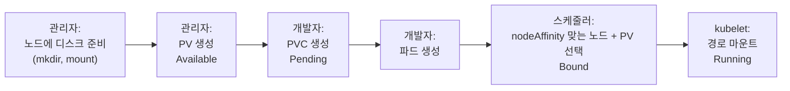
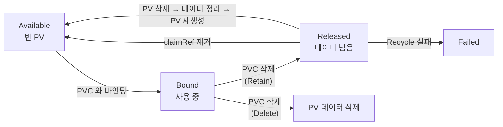

# 10.3 PersistentVolume 미리 만들어 두기

[10.2절](<10.2 PersistentVolume 동적으로 만들기.md>)에서는 프로비저너가 PV를 알아서 만들었습니다. 그런데 프로비저너가 만들 수 없는 스토리지도 있습니다. 대표적인 것이 **노드에 직접 꽂힌 디스크**입니다.

이럴 때는 관리자가 PV를 **손으로 먼저 만들어 두고**, PVC가 그중 하나를 차지하게 합니다. 이것이 **정적 프로비저닝(static provisioning)** 입니다.

## 10.3.1 노드 로컬 디스크를 PV로 만듭니다

노드의 SSD처럼 빠르지만 **그 노드에서만 접근할 수 있는** 디스크를 쓰려면 **로컬 퍼시스턴트볼륨(local PersistentVolume)** 을 씁니다. 9장의 `hostPath`와 비슷해 보이지만 결정적인 차이가 있습니다([9.4절](<../09장. 스토리지와 설정, 메타데이터를 위한 볼륨 추가하기/9.4 hostPath로 노드의 파일 시스템 사용하기.md>)에서 다룹니다).

| 비교 | `hostPath` 볼륨 (파드에 직접) | `local` PV |
| :--- | :--- | :--- |
| **어디에 적나** | 파드 매니페스트 | PV (관리자 몫) |
| **노드를 아는 주체** | 아무도 모름. 파드가 다른 노드로 가면 **빈 디렉터리** | **스케줄러**가 PV의 `nodeAffinity`를 보고 파드를 그 노드로 보냄 |
| **동적 프로비저닝** | 해당 없음 | **지원하지 않음** (정적만) |

### StorageClass — 만들지는 않고 "기다리기"만 맡깁니다

**sc.ch10-local.yaml**

```yaml
apiVersion: storage.k8s.io/v1
kind: StorageClass
metadata:
  name: ch10-local
provisioner: kubernetes.io/no-provisioner   # 동적 프로비저닝 안 함
volumeBindingMode: WaitForFirstConsumer     # 파드가 스케줄될 때 PV 를 고름
```

`kubernetes.io/no-provisioner`는 **"이 클래스로는 PV를 자동으로 만들지 않는다"** 는 표시입니다. 그런데도 클래스를 만드는 이유는 **`WaitForFirstConsumer`** 때문입니다. 공식 문서도 로컬 볼륨에는 이 바인딩 모드를 쓰는 클래스를 권합니다. 파드의 다른 배치 조건(CPU, nodeSelector 등)까지 보고 나서 PV를 고르게 하려는 것입니다.

### PV 매니페스트

**pv.ch10-local-disk.yaml**

```yaml
kind: PersistentVolume
apiVersion: v1
metadata:
  name: ch10-local-disk-on-my-node
spec:
  accessModes:
  - ReadWriteOnce
  storageClassName: ch10-local
  capacity:
    storage: 10Gi                   # 이 디스크가 내줄 수 있는 크기 (선언일 뿐)
  local:
    path: /mnt/ch10-disk            # 노드 안의 경로
  nodeAffinity:                     # local PV 는 반드시 필요
    required:
      nodeSelectorTerms:
      - matchExpressions:
        - key: kubernetes.io/hostname
          operator: In
          values:
          - kia-control-plane       # 이 디스크가 붙은 노드
```

```bash
kubectl apply -f sc.ch10-local.yaml
kubectl apply -f pv.ch10-local-disk.yaml
kubectl get pv ch10-local-disk-on-my-node
```

```
NAME                         CAPACITY   ACCESS MODES   RECLAIM POLICY   STATUS      CLAIM   STORAGECLASS   VOLUMEATTRIBUTESCLASS   REASON   AGE
ch10-local-disk-on-my-node   10Gi       RWO            Retain           Available           ch10-local     <unset>                          1s
```

* `STATUS`가 **`Available`** — 아직 아무 PVC에도 묶이지 않은 PV입니다.
* `RECLAIM POLICY`가 **`Retain`** 입니다. 매니페스트에 적지 않았는데 이렇게 되었습니다. **손으로 만든 PV의 기본 회수 정책은 `Retain`** 이고, 동적 PV(`Delete`)와 반대입니다.

> **`nodeAffinity`를 빼면 PV가 만들어지지 않습니다.** 로컬 디스크는 특정 노드에만 있으니, 어느 노드인지 모르면 쓸 수가 없습니다.
> ```bash
> kubectl apply -f pv.no-affinity.yaml    # 위 PV 에서 nodeAffinity 만 뺀 것
> ```
> ```
> The PersistentVolume "ch10-no-affinity" is invalid: spec.nodeAffinity: Required value: Local volume requires node affinity
> ```

## 10.3.2 미리 만든 PV를 PVC로 차지합니다

PVC 쪽은 동적일 때와 똑같습니다. 클래스 이름만 `ch10-local`로 바꿉니다.

**pvc.quiz-data-local.yaml**

```yaml
apiVersion: v1
kind: PersistentVolumeClaim
metadata:
  name: quiz-data-local
spec:
  storageClassName: ch10-local    # 미리 만든 PV 들의 클래스
  resources:
    requests:
      storage: 1Gi
  accessModes:
  - ReadWriteOnce
```

```bash
kubectl apply -f pvc.quiz-data-local.yaml
kubectl describe pvc quiz-data-local
```

```
Events:
  Type    Reason                Age   From                         Message
  ----    ------                ----  ----                         -------
  Normal  WaitForFirstConsumer  5s    persistentvolume-controller  waiting for first consumer to be created before binding
```

역시 파드를 기다립니다. 이제 이 PVC를 쓰는 MongoDB 파드 `quiz-local`을 만듭니다. 그런데 **노드에 `/mnt/ch10-disk` 디렉터리를 아직 만들지 않았습니다.** 일부러 빠뜨려 봤습니다.

```bash
podman exec kia-control-plane ls -d /mnt/ch10-disk     # 노드에 디렉터리가 있나?
```

```
ls: cannot access '/mnt/ch10-disk': No such file or directory
```

```bash
kubectl apply -f pod.quiz-local.yaml
kubectl get pod quiz-local
kubectl get pvc quiz-data-local
```

```
NAME         READY   STATUS              RESTARTS   AGE
quiz-local   0/1     ContainerCreating   0          15s
NAME              STATUS   VOLUME                       CAPACITY   ACCESS MODES   STORAGECLASS   VOLUMEATTRIBUTESCLASS   AGE
quiz-data-local   Bound    ch10-local-disk-on-my-node   10Gi       RWO            ch10-local     <unset>                 29s
```

PVC는 `Bound`가 되었는데 파드는 `ContainerCreating`에 멈췄습니다.

```bash
kubectl describe pod quiz-local
```

```
Events:
  Type     Reason       Age               From               Message
  ----     ------       ----              ----               -------
  Normal   Scheduled    16s               default-scheduler  Successfully assigned ch10/quiz-local to kia-control-plane
  Warning  FailedMount  8s (x5 over 16s)  kubelet            MountVolume.NewMounter initialization failed for volume "ch10-local-disk-on-my-node" : path "/mnt/ch10-disk" does not exist
```

`path "/mnt/ch10-disk" does not exist` — **쿠버네티스는 PV에 적힌 경로를 믿을 뿐, 만들어 주지 않습니다.** 동적 프로비저닝과 달리 실제 스토리지 준비는 관리자 몫입니다. 디렉터리를 만들면 kubelet이 다시 시도해 파드가 뜹니다.

```bash
podman exec kia-control-plane mkdir /mnt/ch10-disk
kubectl get pod quiz-local
```

```
NAME         READY   STATUS    RESTARTS   AGE
quiz-local   1/1     Running   0          34s
```



### 요청보다 큰 PV가 묶일 수 있습니다

위 출력에서 PVC의 `CAPACITY`가 **`10Gi`** 입니다. 요청은 `1Gi`였는데 말이죠. 정적 PV는 PVC에 맞춰 만들어진 것이 아니니, 컨트롤러는 **요청 이상인 PV 중 하나**를 고릅니다. 공식 문서 표현대로 "적어도 요청한 만큼은 받지만, 그보다 클 수 있습니다." 남는 9Gi는 다른 PVC가 나눠 쓸 수 없습니다. **PV와 PVC는 1:1**이기 때문입니다.

> **정적 PV는 크기를 잘게 여러 개 만들어 두는 편이 낫습니다.** 10Gi짜리 하나만 있으면 1Gi PVC가 그걸 통째로 차지합니다. 동적 프로비저닝이 선호되는 이유 중 하나입니다.

### 조건이 안 맞으면 파드가 스케줄되지 않습니다

PV가 `Available`인 상태에서, 접근 모드만 `ReadWriteMany`로 바꾼 PVC로 같은 파드를 만들어 봤습니다.

```bash
kubectl get pvc quiz-data-local         # accessModes: [ReadWriteMany]
kubectl describe pod quiz-local
```

```
NAME              STATUS    VOLUME   CAPACITY   ACCESS MODES   STORAGECLASS   VOLUMEATTRIBUTESCLASS   AGE
quiz-data-local   Pending                                      ch10-local     <unset>                 10s
Events:
  Type     Reason            Age   From               Message
  ----     ------            ----  ----               -------
  Warning  FailedScheduling  11s   default-scheduler  0/1 nodes are available: 1 node(s) didn't find available persistent volumes to bind. preemption: 0/1 nodes are available: 1 Preemption is not helpful for scheduling.
```

`didn't find available persistent volumes to bind` — PV는 있지만 **RWO만 지원하니 RWX 요청에 맞지 않는다**는 뜻입니다. 동적 프로비저닝이었다면 `ProvisioningFailed`가 PVC 이벤트에 나왔겠지만(10.2.4), `WaitForFirstConsumer` 정적 PV는 **스케줄러가 짝을 찾다가 실패**하므로 **파드 이벤트**에 나옵니다. 크기가 PV보다 큰 요청, 클래스가 다른 요청도 같은 식으로 막힙니다.

| 짝짓기 조건 | PV ↔ PVC가 맞아야 하는 것 |
| :--- | :--- |
| **클래스** | `storageClassName`이 같아야 함 (`""`끼리도 같은 것으로 봄) |
| **크기** | PV `capacity` ≥ PVC 요청 |
| **접근 모드** | PVC가 요청한 모드를 PV가 지원 |
| **노드** | 파드가 갈 노드가 PV `nodeAffinity`를 만족 |
| 레이블 (선택) | PVC `selector`가 있으면 PV 레이블이 맞아야 함 |

### 특정 PV를 이름으로 지목하기 — `volumeName`

PVC에 `volumeName`을 적으면 그 PV에 바로 묶어 달라고 요청할 수 있습니다. 이때 **`storageClassName: ""`을 함께 적어야** 기본 클래스가 끼어들지 않습니다.

존재하지 않는 노드(`kia-worker`)에 붙은 것처럼 적은 PV를 만들어, 이름으로 지목해 봤습니다.

**pvc.specific.yaml**

```yaml
apiVersion: v1
kind: PersistentVolumeClaim
metadata:
  name: quiz-data-specific-volume
spec:
  storageClassName: ""                    # 기본 클래스 쓰지 마
  volumeName: ch10-disk-on-other-node     # 이 PV 에 묶어 줘 (nodeAffinity: kia-worker)
  resources:
    requests:
      storage: 1Gi
  accessModes:
  - ReadWriteOnce
```

```bash
kubectl apply -f pv.wrong-node.yaml -f pvc.specific.yaml
kubectl get pvc quiz-data-specific-volume
```

```
NAME                        STATUS   VOLUME                    CAPACITY   ACCESS MODES   STORAGECLASS   VOLUMEATTRIBUTESCLASS   AGE
quiz-data-specific-volume   Bound    ch10-disk-on-other-node   1Gi        RWO                           <unset>                 6s
```

클래스가 없으니(`Immediate`와 같음) 파드 없이도 바로 **`Bound`** 가 되었습니다. 그런데 파드를 만들면 갈 곳이 없습니다.

```bash
kubectl apply -f pod.specific.yaml
kubectl describe pod quiz-specific-volume
```

```
Events:
  Type     Reason            Age              From               Message
  ----     ------            ----             ----               -------
  Warning  FailedScheduling  7s (x2 over 7s)  default-scheduler  0/1 nodes are available: 1 node(s) didn't match PersistentVolume's node affinity. preemption: 0/1 nodes are available: 1 Preemption is not helpful for scheduling.
```

> **`volumeName`으로 지목하면 노드 조건을 보지 않고 묶어 버립니다.** 공식 문서도 이 방식의 바인딩은 node affinity 같은 일부 조건을 무시한다고 밝힙니다(클래스·접근 모드·크기는 확인). 그래서 **PVC는 `Bound`인데 파드는 영영 `Pending`** 인 상태가 만들어집니다. 원인은 파드 이벤트의 `didn't match PersistentVolume's node affinity`에서만 보입니다.

> **`volumeName`은 PV를 "예약"해 주지는 않습니다.** 그 PV가 아직 `Available`이면 다른 PVC가 먼저 차지할 수도 있습니다. 확실히 잡아 두려면 **PV 쪽 `spec.claimRef`에 PVC의 네임스페이스와 이름을 미리 적어** 둡니다. 그러면 다른 PVC는 그 PV에 묶이지 못합니다.

## 10.3.3 PV를 반납하고 다시 쓰기

### PVC를 지우면 `Released` — 바로 재사용되지 않습니다

```bash
kubectl delete pod quiz-local
kubectl delete pvc quiz-data-local
kubectl get pv ch10-local-disk-on-my-node
```

```
NAME                         CAPACITY   ACCESS MODES   RECLAIM POLICY   STATUS     CLAIM                  STORAGECLASS   VOLUMEATTRIBUTESCLASS   REASON   AGE
ch10-local-disk-on-my-node   10Gi       RWO            Retain           Released   ch10/quiz-data-local   ch10-local     <unset>                          95s
```

```bash
podman exec kia-control-plane sh -c 'ls /mnt/ch10-disk | wc -l'
```

```
20
```

PV는 **`Released`**, 디스크에는 MongoDB 파일 20개가 그대로 있습니다. `Released`는 **"주인은 떠났지만 짐은 남아 있다"** 는 상태입니다. 앞 사람의 데이터가 남아 있으니 쿠버네티스는 이 PV를 다른 PVC에 넘기지 않습니다.

PV 상태를 정리하면 이렇습니다.



### 같은 PV를 새 PVC가 쓰게 하려면 — `claimRef`를 지웁니다

[10.2.3](<10.2 PersistentVolume 동적으로 만들기.md>)에서 `Retain` 클래스로 남겨 둔 `Released` PV `pvc-0377…`을 다시 써 봅니다. 데이터(`keep-me.txt`)를 살린 채 새 PVC에 넘기는 시나리오입니다. 새 PVC에 `volumeName`으로 그 PV를 지목합니다.

**pvc.reuse.yaml**

```yaml
apiVersion: v1
kind: PersistentVolumeClaim
metadata:
  name: quiz-data-retain                  # 지워진 PVC 와 같은 이름
spec:
  storageClassName: ch10-retain
  volumeName: pvc-0377c7bb-17f1-48e3-89a5-2d23152e28d0
  resources:
    requests:
      storage: 1Gi
  accessModes:
  - ReadWriteOnce
```

```bash
kubectl apply -f pvc.reuse.yaml
kubectl describe pvc quiz-data-retain
```

```
Events:
  Type     Reason         Age   From                         Message
  ----     ------         ----  ----                         -------
  Warning  FailedBinding  6s    persistentvolume-controller  volume "pvc-0377c7bb-17f1-48e3-89a5-2d23152e28d0" already bound to a different claim.
```

**이름이 같은 PVC인데도** "다른 클레임에 묶여 있다"며 거절합니다. PV의 `claimRef`에는 이름뿐 아니라 **옛 PVC의 UID**가 남아 있기 때문입니다. 새로 만든 PVC는 이름이 같아도 UID가 다르니 다른 PVC입니다.

```bash
kubectl get pv pvc-0377c7bb-17f1-48e3-89a5-2d23152e28d0 -o jsonpath='{.spec.claimRef}{"\n"}'
```

```
{"apiVersion":"v1","kind":"PersistentVolumeClaim","name":"quiz-data-retain","namespace":"ch10","resourceVersion":"1752","uid":"0377c7bb-17f1-48e3-89a5-2d23152e28d0"}
```

`claimRef`를 지우면 PV가 `Available`로 돌아갑니다.

```bash
kubectl patch pv pvc-0377c7bb-17f1-48e3-89a5-2d23152e28d0 --type json \
  -p '[{"op":"remove","path":"/spec/claimRef"}]'
kubectl get pv pvc-0377c7bb-17f1-48e3-89a5-2d23152e28d0
```

```
persistentvolume/pvc-0377c7bb-17f1-48e3-89a5-2d23152e28d0 patched
NAME                                       CAPACITY   ACCESS MODES   RECLAIM POLICY   STATUS      CLAIM   STORAGECLASS   VOLUMEATTRIBUTESCLASS   REASON   AGE
pvc-0377c7bb-17f1-48e3-89a5-2d23152e28d0   1Gi        RWO            Retain           Available           ch10-retain    <unset>                          79s
```

잠시 뒤 기다리던 PVC가 이 PV에 묶입니다. 바로 되지는 않았고, 이 실습에서는 `Bound`가 되기까지 수십 초가 걸렸습니다. PV 컨트롤러가 기다리는 PVC를 주기적으로 다시 확인하기 때문입니다.

```bash
kubectl get pvc quiz-data-retain
```

```
NAME               STATUS   VOLUME                                     CAPACITY   ACCESS MODES   STORAGECLASS   VOLUMEATTRIBUTESCLASS   AGE
quiz-data-retain   Bound    pvc-0377c7bb-17f1-48e3-89a5-2d23152e28d0   1Gi        RWO            ch10-retain    <unset>                 45s
```

새 파드로 파일을 읽어 보면 옛 데이터가 그대로입니다.

```bash
kubectl logs quiz-retain-read             # cat /mnt/volume/keep-me.txt 하는 파드
```

```
hello
```

> **`claimRef` 제거는 "앞 사람 데이터를 그대로 넘긴다"는 뜻입니다.** 같은 앱을 다시 띄우는 복구 시나리오라면 이게 정답입니다. 하지만 **다른 팀·다른 앱에 넘길 PV라면 데이터를 먼저 지워야** 합니다. 그대로 넘기면 남의 데이터가 새 앱에 노출됩니다.

### 깨끗하게 비워서 재사용 — PV를 지우고 다시 만듭니다

공식 문서가 안내하는 `Retain` PV의 수동 회수 절차는 이렇습니다.

1. PV 오브젝트를 지운다 (실제 스토리지는 남음)
2. 스토리지의 데이터를 정리한다
3. 같은 스토리지를 가리키는 PV를 새로 만든다

```bash
kubectl delete pv ch10-local-disk-on-my-node
podman exec kia-control-plane sh -c 'rm -rf /mnt/ch10-disk/* && ls -A /mnt/ch10-disk | wc -l'
```

```
persistentvolume "ch10-local-disk-on-my-node" deleted
1
```

다 지웠는데 **1개가 남았습니다.**

```bash
podman exec kia-control-plane ls -A /mnt/ch10-disk
```

```
.mongodb
```

> **`rm -rf 경로/*`는 숨김 파일을 지우지 않습니다.** 셸의 `*`는 점(`.`)으로 시작하는 이름과 맞지 않기 때문입니다. MongoDB가 만든 `.mongodb` 디렉터리가 그대로 남았습니다. 공식 문서의 recycler 파드 예시가 `rm -rf /scrub/..?* /scrub/.[!.]* /scrub/*`처럼 숨김 파일 패턴까지 적고 `ls -A`로 비었는지 확인하는 이유입니다. 손으로 비울 때도 **`ls -A`로 확인**하세요.

```bash
podman exec kia-control-plane sh -c 'rm -rf /mnt/ch10-disk/.mongodb && ls -A /mnt/ch10-disk | wc -l'
kubectl apply -f pv.ch10-local-disk.yaml
kubectl get pv ch10-local-disk-on-my-node
```

```
0
persistentvolume/ch10-local-disk-on-my-node created
NAME                         CAPACITY   ACCESS MODES   RECLAIM POLICY   STATUS      CLAIM   STORAGECLASS   VOLUMEATTRIBUTESCLASS   REASON   AGE
ch10-local-disk-on-my-node   10Gi       RWO            Retain           Available           ch10-local     <unset>                          1s
```

빈 디스크를 가리키는 새 PV가 **`Available`** 로 다시 준비되었습니다.

### `Recycle`은 쓰지 마세요 — 폐기 예정이고 대부분 안 됩니다

예전에는 회수 정책 **`Recycle`** 이 이 청소를 자동으로 해 줬습니다(`rm -rf /볼륨/*` 후 `Available`로). 지금은 폐기 예정입니다. `Released`였던 로컬 PV에 걸어 봤습니다.

```bash
kubectl patch pv ch10-local-disk-on-my-node -p '{"spec":{"persistentVolumeReclaimPolicy":"Recycle"}}'
kubectl get pv ch10-local-disk-on-my-node
```

```
Warning: spec.persistentVolumeReclaimPolicy: The Recycle reclaim policy is deprecated. Instead, the recommended approach is to use dynamic provisioning.
persistentvolume/ch10-local-disk-on-my-node patched
NAME                         CAPACITY   ACCESS MODES   RECLAIM POLICY   STATUS   CLAIM                  STORAGECLASS   VOLUMEATTRIBUTESCLASS   REASON   AGE
ch10-local-disk-on-my-node   10Gi       RWO            Recycle          Failed   ch10/quiz-data-local   ch10-local     <unset>                          102s
```

```bash
kubectl describe pv ch10-local-disk-on-my-node
```

```
Message:           No recycler plugin found for the volume!
Events:
  Type     Reason               Age   From                         Message
  ----     ------               ----  ----                         -------
  Warning  VolumeFailedRecycle  12s   persistentvolume-controller  No recycler plugin found for the volume!
```

API 서버가 **폐기 예정 경고**를 내고, PV는 **`Failed`** 가 되었습니다. `local` 볼륨에는 재활용 기능이 없기 때문입니다. 공식 문서 기준으로 **1.37에서 `Recycle`을 지원하는 종류는 `nfs`와 `hostPath`뿐**입니다. 권장 대안은 **동적 프로비저닝**(지우고 새로 만들기)입니다.

## 요약 및 비유

| 개념 | 창고 임대 비유 | 기술적 의미 |
| :--- | :--- | :--- |
| **정적 프로비저닝** | 관리인이 칸막이를 미리 쳐 둔 창고 | 관리자가 PV를 먼저 만들어 둠 |
| **`no-provisioner` 클래스** | "새 칸은 안 만듭니다" 안내문 | 자동 생성 없이 바인딩 시점만 늦춤 |
| **`nodeAffinity`** | 창고가 있는 지점 주소 | 그 노드로만 파드가 가도록 스케줄러에 알림 |
| **경로가 없을 때 `FailedMount`** | 계약서엔 있는데 칸막이를 안 쳐 둠 | 쿠버네티스는 경로를 만들어 주지 않음 |
| **요청보다 큰 PV** | 1평 원했는데 10평 칸을 통째로 배정 | 요청 이상인 PV 중 하나와 1:1 바인딩 |
| **`Released`** | 세입자는 나갔는데 짐이 남은 칸 | 데이터가 남아 다른 PVC에 안 넘어감 |
| **`claimRef` 제거** | 짐째로 다음 세입자에게 넘김 | 데이터를 유지한 채 `Available`로 |
| **PV 삭제 → 정리 → 재생성** | 짐을 치우고 새로 임대 공고 | 깨끗한 PV로 다시 준비 |
| **`Recycle`** | 폐지된 자동 청소 서비스 | 폐기 예정, `nfs`·`hostPath`만 지원 |

## 결론

* 프로비저너가 만들 수 없는 스토리지(특히 **노드 로컬 디스크**)는 관리자가 PV를 미리 만드는 **정적 프로비저닝**으로 씁니다.
* `local` PV에는 **`nodeAffinity`가 필수**이고, 클래스는 `no-provisioner` + **`WaitForFirstConsumer`** 로 둡니다. 쿠버네티스는 **경로를 만들어 주지 않습니다.**
* 정적 PV는 **요청보다 클 수 있고**, 1:1이라 남는 용량은 버려집니다. 손으로 만든 PV의 기본 회수 정책은 **`Retain`** 입니다.
* `volumeName` 지목은 **노드 조건을 보지 않고 묶어** `Bound`인데 파드가 `Pending`인 상태를 만들 수 있습니다. 확실한 예약은 PV의 `claimRef`로 합니다.
* `Released` PV는 **`claimRef`에 옛 PVC의 UID가 남아** 같은 이름의 새 PVC도 거절합니다. 데이터를 넘기려면 `claimRef`를 지우고, 비우려면 PV를 지우고 정리한 뒤 다시 만듭니다. `rm -rf 경로/*`는 **숨김 파일을 남깁니다.**
* **`Recycle`은 폐기 예정**이며 `local` 볼륨에서는 `Failed`가 됩니다.

## 공식 문서 업데이트 (2026년 10월 기준)

### 1) PV의 `nodeAffinity`를 바꿀 수 있는 기능이 알파로 들어왔습니다

원래 PV의 `spec.nodeAffinity`는 만든 뒤 바꿀 수 없습니다. **1.35 알파(기본 비활성화)** 인 `MutablePVNodeAffinity` 기능 게이트를 kube-apiserver와 kubelet에 켜면 바꿀 수 있습니다. 데이터를 다른 노드·존으로 옮긴 뒤 PV가 가리키는 위치를 고칠 때 쓰려는 기능입니다. 이 실습 클러스터에서는 켜지 않았습니다.

참고: <https://kubernetes.io/docs/concepts/storage/persistent-volumes/#updates-to-node-affinity>

## 출처

> 2026-10-05 공식 문서로 검증

* 원서: *Kubernetes in Action, Second Edition* 10장 — <https://livebook.manning.com/book/kubernetes-in-action-second-edition/>
* [Persistent Volumes](https://kubernetes.io/docs/concepts/storage/persistent-volumes/) — Kubernetes 공식 문서
* [Volumes](https://kubernetes.io/docs/concepts/storage/volumes/) — Kubernetes 공식 문서 (`local` 절)
* [Storage Classes](https://kubernetes.io/docs/concepts/storage/storage-classes/) — Kubernetes 공식 문서 (Local 절)
