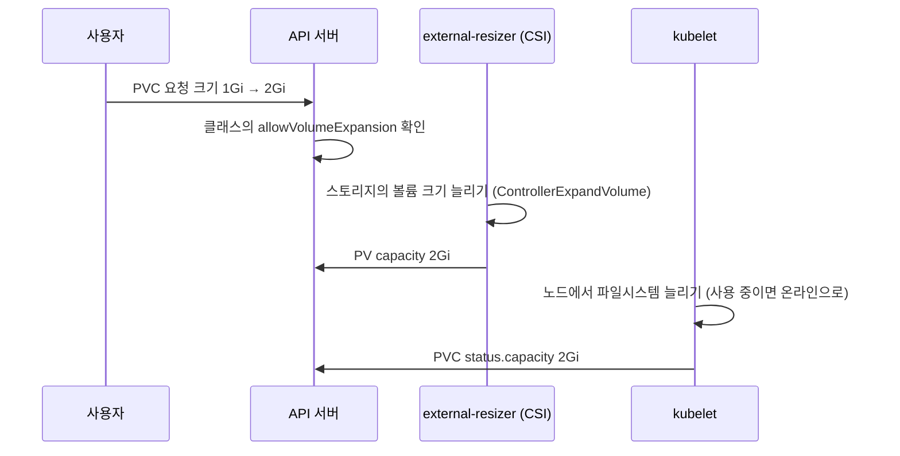
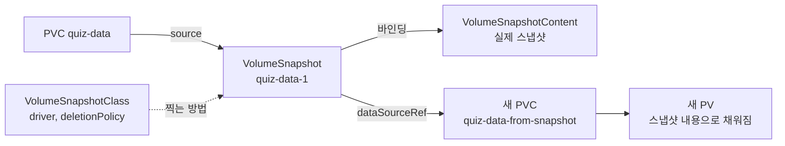
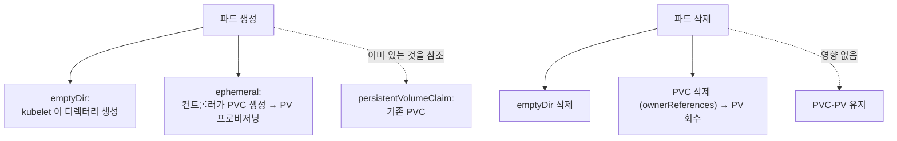

# 10.4 PersistentVolume 관리하기

[10.2절](<10.2 PersistentVolume 동적으로 만들기.md>)과 [10.3절](<10.3 PersistentVolume 미리 만들어 두기.md>)에서 볼륨을 만들고, 쓰고, 지웠습니다. 운영을 하다 보면 그다음 일이 생깁니다. **용량이 모자라고, 백업이 필요하고, 같은 데이터로 시험 환경을 하나 더 띄우고 싶어집니다.**

이 절에서는 볼륨 **확장, 스냅샷, 클론**과, 파드와 함께 생겼다 사라지는 **임시 PVC(generic ephemeral volume)** 를 다룹니다. 미리 말하면 **앞의 셋은 CSI 드라이버가 해 주는 일**이라, CSI 드라이버가 없는 kind에서는 대부분 실패합니다. 실패하는 모습도 실측으로 남겼습니다.

## 볼륨 크기는 PVC만 고쳐서 늘립니다

PV를 새로 만들지 않습니다. **PVC의 `spec.resources.requests.storage`를 더 큰 값으로 고치면**, 그 뒤의 볼륨이 커집니다.



### 클래스가 허락하지 않으면 거부됩니다

`standard` 클래스는 `ALLOWVOLUMEEXPANSION`이 `false`였습니다.

```bash
kubectl patch pvc demo-read-write-once -p '{"spec":{"resources":{"requests":{"storage":"2Gi"}}}}'
```

```
Error from server (Forbidden): persistentvolumeclaims "demo-read-write-once" is forbidden: only dynamically provisioned pvc can be resized and the storageclass that provisions the pvc must support resize
```

API 서버가 바로 막습니다. 메시지대로 **동적으로 만든 PVC이면서 클래스가 확장을 허락해야** 합니다.

### 클래스가 허락해도 드라이버가 못 하면 영원히 기다립니다

[10.2.3](<10.2 PersistentVolume 동적으로 만들기.md>)의 `ch10-retain` 클래스에는 `allowVolumeExpansion: true`를 넣어 두었습니다. 그 클래스의 PVC를 늘려 봅니다.

```bash
kubectl patch pvc quiz-data-retain -p '{"spec":{"resources":{"requests":{"storage":"2Gi"}}}}'
kubectl get pvc quiz-data-retain
```

```
persistentvolumeclaim/quiz-data-retain patched
NAME               STATUS   VOLUME                                     CAPACITY   ACCESS MODES   STORAGECLASS   VOLUMEATTRIBUTESCLASS   AGE
quiz-data-retain   Bound    pvc-0377c7bb-17f1-48e3-89a5-2d23152e28d0   1Gi        RWO            ch10-retain    <unset>                 29s
```

요청은 받아들여졌지만 15초가 지나도 `CAPACITY`는 `1Gi`입니다.

```bash
kubectl describe pvc quiz-data-retain
```

```
Events:
  Type    Reason                 Age                From                                                                                                Message
  ----    ------                 ----               ----                                                                                                -------
  ...
  Normal  ExternalExpanding      16s                volume_expand                                                                                       waiting for an external controller to expand this PVC
```

```bash
kubectl get pvc quiz-data-retain -o jsonpath='{.spec.resources}{"\n"}{.status}{"\n"}'
```

```
{"requests":{"storage":"2Gi"}}
{"accessModes":["ReadWriteOnce"],"capacity":{"storage":"1Gi"},"conditions":[{"lastProbeTime":null,"lastTransitionTime":"2026-10-05T09:28:41Z","message":"A pod is currently referencing this PVC","reason":"PodUsingPVC","status":"False","type":"Unused"}],"phase":"Bound"}
```

`waiting for an external controller to expand this PVC` — **확장을 해 줄 외부 컨트롤러(CSI의 external-resizer)를 기다린다**는 뜻입니다. `local-path`에는 그런 컨트롤러가 없으니 `spec`은 2Gi, `status`는 1Gi인 채로 **에러 없이 계속 기다립니다.**

> **`allowVolumeExpansion: true`는 "허락"일 뿐 "능력"이 아닙니다.** 클래스에 이 값을 넣는 것은 관리자 마음이지만, 실제로 늘리는 것은 드라이버입니다. 확장이 안 되면 `kubectl describe pvc`의 이벤트에서 **`ExternalExpanding`만 있고 `Resizing`/`FileSystemResizeSuccessful` 같은 후속 이벤트가 없는지** 보세요.

### 줄이기는 안 됩니다 — 실패한 확장만 되돌릴 수 있습니다

```bash
kubectl patch pvc quiz-data-retain -p '{"spec":{"resources":{"requests":{"storage":"500Mi"}}}}'
```

```
The PersistentVolumeClaim "quiz-data-retain" is invalid: spec.resources.requests.storage: Forbidden: field can not be less than status.capacity
```

**현재 크기(`status.capacity`)보다 작게는 못 합니다.** 볼륨 축소는 지원하지 않습니다.

그런데 위처럼 2Gi 확장이 끝나지 않고 걸려 있는 상태라면, **2Gi보다 작지만 현재 크기보다는 큰 값**으로 고쳐 다시 시도할 수 있습니다.

```bash
kubectl patch pvc quiz-data-retain -p '{"spec":{"resources":{"requests":{"storage":"1536Mi"}}}}'
kubectl patch pvc quiz-data-retain -p '{"spec":{"resources":{"requests":{"storage":"1Gi"}}}}'
```

```
persistentvolumeclaim/quiz-data-retain patched
The PersistentVolumeClaim "quiz-data-retain" is invalid: spec.resources.requests.storage: Forbidden: field can not be less than status.capacity
```

`1536Mi`는 받아들여졌고, 원래 크기인 `1Gi`로는 되돌리지 못했습니다. 공식 문서의 설명과 같습니다. **새 값은 이전 요청보다 작아도 되지만 `.status.capacity`보다는 커야** 합니다. 2TB를 늘리려다 20TiB로 오타를 낸 경우를 구해 주는 기능입니다.

> **PV의 `capacity`를 직접 고치지 마세요.** 공식 문서가 경고하는 함정입니다. PV 크기를 손으로 바꾼 뒤 PVC를 같은 값으로 맞추면, 쿠버네티스는 "이미 늘어나 있다"고 판단해 **실제 스토리지는 늘리지 않습니다.** 확장은 언제나 PVC 쪽에서 요청합니다.

## 볼륨 스냅샷 — 이 클러스터에는 API부터 없습니다

**볼륨 스냅샷(VolumeSnapshot)** 은 특정 시점의 볼륨을 통째로 복사해 두는 기능입니다. DB 마이그레이션 직전에 찍어 두고, 문제가 생기면 그 스냅샷으로 새 볼륨을 만드는 식으로 씁니다.

### 구조는 PV/PVC/StorageClass와 똑같습니다

| 스냅샷 쪽 | 볼륨 쪽 대응 | 범위 | 역할 |
| :--- | :--- | :--- | :--- |
| **VolumeSnapshot** | PVC | 네임스페이스 | "이 PVC의 스냅샷을 찍어 달라"는 요청 |
| **VolumeSnapshotContent** | PV | 클러스터 | 스토리지에 실제로 생긴 스냅샷 |
| **VolumeSnapshotClass** | StorageClass | 클러스터 | 어느 CSI 드라이버가 어떤 설정으로 찍을지, `deletionPolicy` |



책의 예제(GKE의 PD CSI 드라이버 기준)는 이렇게 생겼습니다. **아래 세 매니페스트는 이 클러스터에서 실행할 수 없어 개념 예시로만 둡니다.**

**vsclass.pd-csi.yaml**

```yaml
apiVersion: snapshot.storage.k8s.io/v1
kind: VolumeSnapshotClass
metadata:
  name: pd-csi
driver: pd.csi.storage.gke.io     # 스냅샷을 찍을 CSI 드라이버
deletionPolicy: Retain            # VolumeSnapshot 을 지워도 실제 스냅샷은 남김 (Delete 도 가능)
```

**vs.quiz-data-1.yaml**

```yaml
apiVersion: snapshot.storage.k8s.io/v1
kind: VolumeSnapshot
metadata:
  name: quiz-data-1
spec:
  volumeSnapshotClassName: pd-csi
  source:
    persistentVolumeClaimName: quiz-data   # 이 PVC 를 찍는다
```

**pvc.quiz-data-from-snapshot.yaml**

```yaml
apiVersion: v1
kind: PersistentVolumeClaim
metadata:
  name: quiz-data-from-snapshot
spec:
  resources:
    requests:
      storage: 10Gi
  accessModes:
  - ReadWriteOncePod
  dataSourceRef:                           # 빈 볼륨 대신 이 내용으로 채워 달라
    apiGroup: snapshot.storage.k8s.io
    kind: VolumeSnapshot
    name: quiz-data-1
```

### kind에서 실행하면

```bash
kubectl api-resources --api-group=snapshot.storage.k8s.io
```

```
NAME   SHORTNAMES   APIVERSION   NAMESPACED   KIND
```

```bash
kubectl apply -f vs.demo.yaml       # 위 VolumeSnapshot 을 이 클러스터의 PVC 로 바꾼 것
```

```
error: resource mapping not found for name: "quiz-data-1" namespace: "" from "vs.demo.yaml": no matches for kind "VolumeSnapshot" in version "snapshot.storage.k8s.io/v1"
ensure CRDs are installed first
```

**`VolumeSnapshot`이라는 종류 자체가 없습니다.** `kubectl get crd`에도 `snapshot.storage.k8s.io` 그룹의 CRD가 하나도 없었습니다. 이유는 공식 문서에 적혀 있습니다.

* VolumeSnapshot, VolumeSnapshotContent, VolumeSnapshotClass는 **코어 API가 아니라 CRD**입니다.
* CRD와 **스냅샷 컨트롤러(snapshot controller)** 를 설치하는 것은 **쿠버네티스 배포판의 책임**입니다. kind 기본 설치에는 들어 있지 않습니다.
* 실제로 스냅샷을 찍는 것은 **CSI 드라이버 + `csi-snapshotter` 사이드카**입니다. kind의 `local-path`는 CSI 드라이버가 아니므로(10.2.6), CRD를 깔아도 찍어 줄 주체가 없습니다.

> **실측하지 못한 이유.** 이 실습 클러스터는 여러 장이 함께 쓰는 공용 클러스터라 CRD·컨트롤러·CSI 드라이버를 새로 설치하지 않았습니다. 스냅샷을 직접 해 보려면 CSI hostpath 드라이버 같은 **스냅샷을 지원하는 CSI 드라이버와 snapshot controller가 갖춰진 클러스터**가 필요합니다. 관리형 쿠버네티스(GKE, EKS 등)는 대부분 이 구성을 제공합니다.

> **스냅샷 원본 PVC도 보호됩니다.** 스냅샷을 찍는 동안 원본 PVC를 지우면, 스냅샷이 `readyToUse`가 되거나 중단될 때까지 PVC 삭제가 미뤄집니다. 10.2.3의 `pvc-protection`과 같은 발상입니다.

## 볼륨 클론 — 조용히 빈 볼륨이 만들어졌습니다

**볼륨 클론(volume cloning)** 은 스냅샷 없이 **기존 PVC를 바로 복제한 새 PVC**를 만드는 기능입니다. PVC의 `dataSourceRef`(또는 `dataSource`)에 원본 PVC를 적습니다.

**pvc.clone.yaml**

```yaml
apiVersion: v1
kind: PersistentVolumeClaim
metadata:
  name: demo-clone
spec:
  resources:
    requests:
      storage: 1Gi                  # 원본 이상이어야 함
  accessModes:
  - ReadWriteOnce
  dataSourceRef:
    kind: PersistentVolumeClaim     # 원본 PVC (같은 네임스페이스)
    name: demo-read-write-once
```

원본 `demo-read-write-once`에는 10.2.4에서 두 파드가 쓴 파일 두 개가 들어 있습니다. 클론 PVC와, 그 내용을 `ls`로 보여 주는 파드를 만듭니다.

```bash
kubectl apply -f pvc.clone.yaml -f pod.clone.yaml   # 파드: ls /mnt/volume; sleep infinity
kubectl get pvc demo-clone
kubectl get pod demo-clone
```

```
NAME         STATUS   VOLUME                                     CAPACITY   ACCESS MODES   STORAGECLASS   VOLUMEATTRIBUTESCLASS   AGE
demo-clone   Bound    pvc-d532ddd3-42ef-4cfc-8656-594834162a36   1Gi        RWO            standard       <unset>                 16s
NAME         READY   STATUS    RESTARTS   AGE
demo-clone   1/1     Running   0          17s
```

`Bound`, `Running`. 성공처럼 보입니다. 그런데 파드 로그가 비어 있습니다.

```bash
kubectl logs demo-clone
```

출력이 한 줄도 없습니다. **`ls`가 아무것도 출력하지 않았습니다. 클론이 아니라 빈 볼륨입니다.** 이벤트도 평범한 `ProvisioningSucceeded`뿐이고 경고는 없었습니다. PVC에는 `dataSource`와 `dataSourceRef`가 분명히 기록되어 있습니다.

```bash
kubectl get pvc demo-clone -o jsonpath='{.spec.dataSource}{"\n"}{.spec.dataSourceRef}{"\n"}'
```

```
{"apiGroup":null,"kind":"PersistentVolumeClaim","name":"demo-read-write-once"}
{"apiGroup":null,"kind":"PersistentVolumeClaim","name":"demo-read-write-once"}
```

> **클론을 지원하지 않는 프로비저너는 `dataSource`를 무시할 수 있습니다.** 공식 문서는 볼륨 클론이 **CSI 드라이버에서만**, 그것도 드라이버가 구현한 경우에만 된다고 밝힙니다. `local-path`는 CSI가 아니어서 데이터 원본을 무시하고 빈 디렉터리를 만들었습니다. **에러가 없으니 데이터가 복사된 줄 알기 쉽습니다.** 클론이나 스냅샷 복원 뒤에는 **반드시 내용을 확인**하세요.

책은 클론을 `ReadOnlyMany`로 만들어 여러 파드가 읽기 전용으로 나눠 보는 예제를 씁니다. kind에서는 접근 모드에서 먼저 막힙니다.

```bash
kubectl apply -f pvc.demo-read-only-many.yaml       # accessModes: [ReadOnlyMany], dataSourceRef: demo-read-write-once
kubectl create -f pod.demo-read-only-many.yaml      # 이 PVC 를 readOnly 로 쓰는 파드 (WaitForFirstConsumer 라 필요)
kubectl describe pvc demo-read-only-many
```

```
  Warning  ProvisioningFailed    1s (x2 over 16s)  rancher.io/local-path_local-path-provisioner-75f7fc7dc5-72n2w_053dec69-23ac-4ad6-b304-0d760dcee185  failed to provision volume with StorageClass "standard": NodePath only supports ReadWriteOnce and ReadWriteOncePod (1.22+) access modes
```

클론 규칙을 공식 문서 기준으로 정리하면 이렇습니다.

| 규칙 | 내용 |
| :--- | :--- |
| **드라이버** | CSI 드라이버만, 그리고 동적 프로비저너만 |
| **네임스페이스** | 원본과 같은 네임스페이스 |
| **크기** | 원본 이상 |
| **클래스** | 원본과 달라도 됨 |
| **볼륨 모드** | 원본과 같아야 함 (`Filesystem`↔`Block` 불가) |
| **원본 상태** | `Bound`이고 사용 중이 아니어야 함 |
| **관계** | 클론은 독립된 PVC. 원본을 지워도 클론은 영향 없음 |

> **`dataSource`와 `dataSourceRef`.** 둘은 거의 같습니다. 차이는 `dataSource`가 **잘못된 값을 조용히 무시**하고, `dataSourceRef`는 **에러로 알린다**는 점, 그리고 `dataSourceRef`는 PVC·VolumeSnapshot 외의 임의의 커스텀 리소스도 가리킬 수 있다는 점입니다. 공식 문서는 `dataSourceRef`를 권합니다. 위 실측처럼 한쪽만 적어도 다른 쪽이 같은 값으로 채워집니다.

## 오래 사는 볼륨과 잠깐 쓰는 볼륨 — generic ephemeral volume

지금까지의 PVC는 **파드보다 오래 사는 것**이 핵심이었습니다. 그런데 반대가 필요할 때도 있습니다. 파드가 쓰는 동안만 큰 스크래치 공간이 필요하고, 파드가 끝나면 지워져도 되는 경우입니다.

`emptyDir`은 노드의 디스크(또는 메모리)만 쓸 수 있습니다. **제너릭 임시 볼륨(generic ephemeral volume)** 은 **파드 정의 안에 PVC 템플릿을 넣어**, 파드가 생길 때 PVC를 만들고 파드가 사라질 때 PVC를 지웁니다. StorageClass의 모든 기능(용량, 네트워크 스토리지, 스냅샷 등)을 그대로 쓰면서 수명만 파드에 맞춘 것입니다.

**pod.demo-ephemeral.yaml**

```yaml
apiVersion: v1
kind: Pod
metadata:
  name: demo-ephemeral
spec:
  volumes:
  - name: my-volume
    ephemeral:                          # PVC 를 파드와 함께 만들고 지움
      volumeClaimTemplate:
        spec:                           # PVC 의 spec 과 똑같이 적음
          accessModes:
          - ReadWriteOnce
          resources:
            requests:
              storage: 1Gi
  containers:
  - name: main
    image: docker.io/library/busybox
    command:
    - sh
    - -c
    - |
      echo "This is a demo of a Pod using an ephemeral volume." ;
      touch /mnt/ephemeral/file-created-by-$HOSTNAME.txt ;
      sleep infinity
    volumeMounts:
    - mountPath: /mnt/ephemeral
      name: my-volume
  terminationGracePeriodSeconds: 0
```

```bash
kubectl apply -f pod.demo-ephemeral.yaml
kubectl get pvc
```

```
NAME                       STATUS   VOLUME                                     CAPACITY   ACCESS MODES   STORAGECLASS   VOLUMEATTRIBUTESCLASS   AGE
demo-clone                 Bound    pvc-d532ddd3-42ef-4cfc-8656-594834162a36   1Gi        RWO            standard       <unset>                 46s
demo-ephemeral-my-volume   Bound    pvc-abcdb213-2ed6-4910-a37b-b5ad0ec7bae2   1Gi        RWO            standard       <unset>                 7s
demo-read-write-once       Bound    pvc-f6b32c7e-0288-4e42-a2f8-4b096569a11e   1Gi        RWO            standard       <unset>                 109s
```

만든 적 없는 **`demo-ephemeral-my-volume`** PVC가 생겼습니다. 이름은 **`<파드 이름>-<볼륨 이름>`** 으로 정해집니다. 주인은 파드입니다.

```bash
kubectl get pvc demo-ephemeral-my-volume -o jsonpath='{.metadata.ownerReferences}{"\n"}'
```

```
[{"apiVersion":"v1","blockOwnerDeletion":true,"controller":true,"kind":"Pod","name":"demo-ephemeral","uid":"06aba816-013f-4727-b13f-d3f1a615bee6"}]
```

`ownerReferences`가 파드를 가리키므로, 파드를 지우면 **가비지 컬렉터가 PVC를 지웁니다.**

```bash
kubectl delete pod demo-ephemeral
kubectl get pvc
```

```
pod "demo-ephemeral" deleted from ch10 namespace
NAME                   STATUS   VOLUME                                     CAPACITY   ACCESS MODES   STORAGECLASS   VOLUMEATTRIBUTESCLASS   AGE
demo-clone             Bound    pvc-d532ddd3-42ef-4cfc-8656-594834162a36   1Gi        RWO            standard       <unset>                 54s
demo-read-write-once   Bound    pvc-f6b32c7e-0288-4e42-a2f8-4b096569a11e   1Gi        RWO            standard       <unset>                 117s
```

PVC가 사라졌고, 클래스의 회수 정책이 `Delete`이니 PV와 데이터도 함께 정리됩니다. 클래스가 `Retain`이면 PV는 남으니 따로 치워야 합니다.

> **이름이 겹치면 파드가 뜨지 않습니다.** PVC 이름이 정해진 규칙으로 만들어지므로, 같은 이름의 PVC가 이미 있으면 충돌합니다. `demo-ephemeral-my-volume`이라는 PVC를 먼저 만들어 두고 파드를 만들어 봤습니다.
> ```
> Warning  FailedScheduling  10s                default-scheduler  0/1 nodes are available: PVC ch10/demo-ephemeral-my-volume was not created for pod ch10/demo-ephemeral (pod is not owner). not found
> Warning  FailedBinding     5s (x11 over 10s)  ephemeral_volume   ephemeral volume my-volume: PVC ch10/demo-ephemeral-my-volume was not created for pod ch10/demo-ephemeral (pod is not owner)
> ```
> 쿠버네티스는 **남의 PVC를 가로채 쓰지 않습니다.** `pod is not owner` — 그 PVC의 주인이 이 파드가 아니라서 거절한 것입니다. 실수로 남의 데이터를 쓰거나 지우는 일을 막는 장치입니다.

세 가지 볼륨의 수명을 비교하면 이렇습니다.

| 볼륨 | 스토리지 | 수명 | 쓰는 곳 |
| :--- | :--- | :--- | :--- |
| **`emptyDir`** | 노드 디스크(또는 메모리) | 파드와 같음 | 작은 임시 파일, 컨테이너 간 공유 |
| **generic ephemeral** | **StorageClass가 만드는 PV** | 파드와 같음 (PVC 자동 생성·삭제) | 큰 스크래치 공간, 노드 디스크가 부족할 때 |
| **PVC** | StorageClass 또는 정적 PV | **파드보다 김** | DB 등 영속 데이터 |



## 볼륨 속성 바꾸기 — VolumeAttributesClass

PVC의 크기 말고 **성능(IOPS, 처리량)** 을 바꾸고 싶을 때도 있습니다. StorageClass의 `parameters`는 만든 뒤 고칠 수 없으니(10.2.5), 예전에는 새 PVC를 만들어 옮기는 수밖에 없었습니다.

**VolumeAttributesClass(VAC)** 는 이런 **바꿀 수 있는 속성**을 따로 묶은 클래스입니다. PVC의 `volumeAttributesClassName`을 다른 클래스로 바꾸면 CSI 드라이버가 볼륨을 그 속성으로 수정합니다. 10.2.4의 에러 메시지에서 바인딩된 PVC가 바꿀 수 있는 필드로 `volumeAttributesClassName`이 나왔던 이유입니다.

```yaml
apiVersion: storage.k8s.io/v1
kind: VolumeAttributesClass
metadata:
  name: gold
driverName: csi.storage.example.com   # 공식 문서 예시의 가상 드라이버
parameters:                           # 클래스의 parameters 는 만든 뒤 못 바꿈
  iops: "4000"
  throughput: "60Mi"
```

```bash
kubectl get vac                           # volumeattributesclasses 의 약칭
```

```
No resources found
```

API(`storage.k8s.io/v1`)는 있지만 이 클러스터에는 VAC가 하나도 없습니다. 공식 문서는 VAC가 **CSI 드라이버이면서 `ModifyVolume`을 구현한 경우에만** 쓸 수 있다고 밝힙니다. `local-path`에서는 쓸 수 없어 실측하지 않았습니다. `kubectl get pvc`의 `VOLUMEATTRIBUTESCLASS` 열이 늘 `<unset>`이었던 것도 이 때문입니다.

## 요약 및 비유

| 개념 | 스마트폰 사진 보관 비유 | 기술적 의미 |
| :--- | :--- | :--- |
| **볼륨 확장** | 클라우드 요금제를 상위로 바꿈 | PVC 요청 크기를 늘리면 드라이버가 볼륨을 키움 |
| **`allowVolumeExpansion`** | 요금제 변경 허용 여부 | 클래스가 확장을 허락하는지 |
| **`ExternalExpanding`에 멈춤** | 신청은 받았는데 처리할 직원이 없음 | 허락은 됐지만 CSI resizer가 없음 |
| **축소 불가 / 실패 복구** | 내릴 수는 없지만 잘못 누른 신청은 고칠 수 있음 | `status.capacity`보다 크면 다시 요청 가능 |
| **VolumeSnapshot** | 특정 날짜의 전체 백업 | 시점 복사본. CRD + 컨트롤러 + CSI 필요 |
| **스냅샷 복원** | 백업으로 새 폰 세팅 | `dataSourceRef`로 스냅샷 내용을 채운 새 PVC |
| **클론** | 앨범을 통째로 복사해 새 앨범 | 원본 PVC를 복제한 새 PVC |
| **조용히 빈 클론** | 복사 버튼을 눌렀는데 빈 앨범만 생김 | 지원 안 하는 프로비저너가 원본을 무시 |
| **generic ephemeral** | 여행 동안만 쓰는 임시 공유 앨범 | 파드와 함께 생기고 지워지는 PVC |

## 결론

* 볼륨 확장은 **PVC 크기만 고치면** 됩니다. 단 **클래스의 `allowVolumeExpansion`** 과 **드라이버의 확장 기능**이 둘 다 있어야 합니다. 드라이버가 없으면 에러 없이 `ExternalExpanding`에 멈춥니다.
* **축소는 안 됩니다.** 다만 끝나지 않은 확장은 **현재 크기보다 큰 범위에서** 더 작은 값으로 다시 요청할 수 있습니다. PV 크기를 직접 고치면 실제 확장이 일어나지 않습니다.
* **스냅샷은 CRD·스냅샷 컨트롤러·CSI 드라이버**가 모두 있어야 합니다. kind 기본 설치에는 API부터 없습니다.
* **클론은 CSI 드라이버에서만** 됩니다. 지원하지 않는 프로비저너는 **원본을 무시하고 빈 볼륨을 만들 수 있으니** 복제 뒤에는 꼭 내용을 확인하세요.
* **generic ephemeral volume**은 파드가 주인인 PVC를 자동으로 만들고 지웁니다. 이름은 `<파드>-<볼륨>`이고, **같은 이름의 남의 PVC가 있으면 `pod is not owner`로 거절**됩니다.

## 공식 문서 업데이트 (2026년 10월 기준)

### 1) VolumeAttributesClass가 GA입니다 (핵심 변화)

책에는 없는 기능입니다. 1.29에 처음 들어왔고 **1.34에서 GA**가 되었습니다. 지금 문서는 **v1.36부터 stable이며 끌 수 없다(locked)** 고 표기합니다. `kubectl get pvc`/`get pv` 출력에 `VOLUMEATTRIBUTESCLASS` 열이 생긴 것도 이 때문입니다. CSI 드라이버가 `ModifyVolume`을 구현해야 씁니다.

참고: <https://kubernetes.io/docs/concepts/storage/volume-attributes-classes/>

### 2) 실패한 확장을 사용자가 직접 되돌릴 수 있습니다

예전에는 확장이 실패하면 관리자가 PV를 `Retain`으로 바꾸고, PVC를 지우고, `claimRef`를 지우는 복잡한 절차를 밟아야 했습니다. **1.34에서 GA**가 된 확장 실패 복구 기능으로, 이제는 **PVC 요청 크기를 더 작은 값(단, 현재 크기보다는 큰 값)으로 고치기만 하면** 됩니다. 위의 `2Gi → 1536Mi` 실측이 이 동작입니다. 진행 상황은 PVC의 `.status.allocatedResourceStatuses`와 이벤트로 봅니다.

참고: <https://kubernetes.io/docs/concepts/storage/persistent-volumes/#recovering-from-failure-when-expanding-volumes>

### 3) 볼륨 파퓰레이터(`dataSourceRef`)가 GA입니다

`dataSourceRef`로 PVC·VolumeSnapshot 말고도 **임의의 커스텀 리소스**를 데이터 원본으로 지정하는 볼륨 파퓰레이터가 **1.33에서 GA**가 되었습니다(`AnyVolumeDataSource` 기능 게이트가 항상 켜진 것으로 취급). 책 예제가 `dataSource` 대신 `dataSourceRef`를 쓰는 것과 같은 흐름입니다.

참고: <https://kubernetes.io/docs/concepts/storage/volume-populators-and-data-sources/>

### 4) 여러 볼륨을 한 시점에 찍는 그룹 스냅샷이 GA입니다

**볼륨 그룹 스냅샷(VolumeGroupSnapshot)** 은 레이블 셀렉터로 고른 여러 PVC를 **같은 시점에** 찍습니다. DB 데이터와 로그를 서로 다른 볼륨에 둔 앱을 일관되게 백업할 때 씁니다. 1.27 알파, 1.32 베타를 거쳐 **1.36에서 GA**가 되었습니다. VolumeSnapshot처럼 **CRD와 컨트롤러, 이를 지원하는 CSI 드라이버**가 필요합니다.

참고: <https://kubernetes.io/blog/2026/05/08/kubernetes-v1-36-volume-group-snapshot-ga/>

## 출처

> 2026-10-05 공식 문서로 검증

* 원서: *Kubernetes in Action, Second Edition* 10장 — <https://livebook.manning.com/book/kubernetes-in-action-second-edition/>
* [Persistent Volumes](https://kubernetes.io/docs/concepts/storage/persistent-volumes/) — Kubernetes 공식 문서
* [Volume Snapshots](https://kubernetes.io/docs/concepts/storage/volume-snapshots/) — Kubernetes 공식 문서
* [Volume Snapshot Classes](https://kubernetes.io/docs/concepts/storage/volume-snapshot-classes/) — Kubernetes 공식 문서
* [CSI Volume Cloning](https://kubernetes.io/docs/concepts/storage/volume-pvc-datasource/) — Kubernetes 공식 문서
* [Volume Populators and Data Sources](https://kubernetes.io/docs/concepts/storage/volume-populators-and-data-sources/) — Kubernetes 공식 문서
* [Ephemeral Volumes](https://kubernetes.io/docs/concepts/storage/ephemeral-volumes/) — Kubernetes 공식 문서
* [Volume Attributes Classes](https://kubernetes.io/docs/concepts/storage/volume-attributes-classes/) — Kubernetes 공식 문서
* [Kubernetes v1.34: VolumeAttributesClass for Volume Modification GA](https://kubernetes.io/blog/2025/09/08/kubernetes-v1-34-volume-attributes-class/) — Kubernetes 공식 블로그
* [Kubernetes v1.34: Recovery From Volume Expansion Failure (GA)](https://kubernetes.io/blog/2025/09/19/kubernetes-v1-34-recover-expansion-failure/) — Kubernetes 공식 블로그
* [Kubernetes 1.33: Volume Populators Graduate to GA](https://kubernetes.io/blog/2025/05/08/kubernetes-v1-33-volume-populators-ga/) — Kubernetes 공식 블로그
* [Kubernetes v1.36: Moving Volume Group Snapshots to GA](https://kubernetes.io/blog/2026/05/08/kubernetes-v1-36-volume-group-snapshot-ga/) — Kubernetes 공식 블로그
* [Snapshot Controller - Kubernetes CSI Developer Documentation](https://kubernetes-csi.github.io/docs/snapshot-controller.html) — Kubernetes CSI 문서
