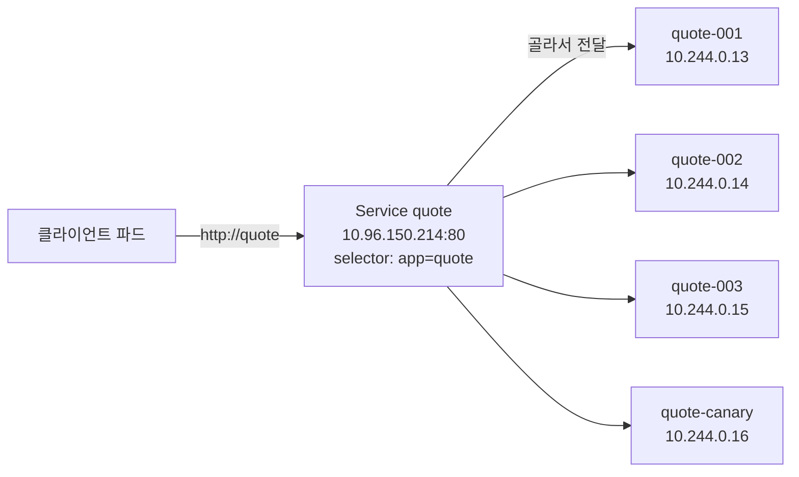
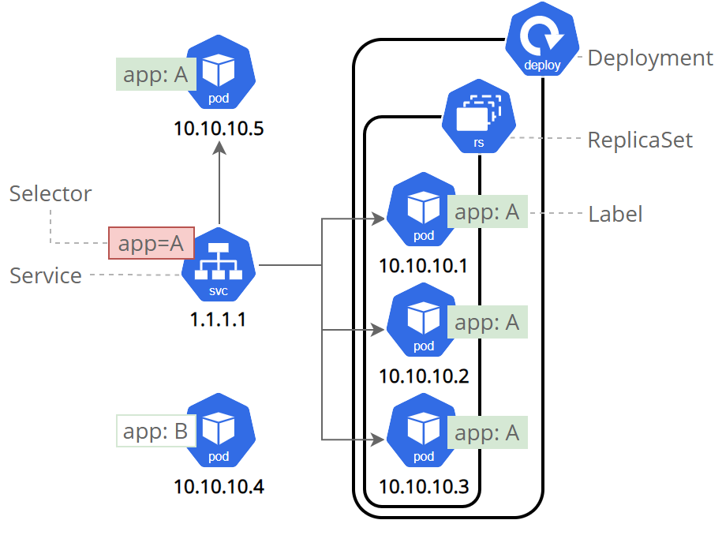
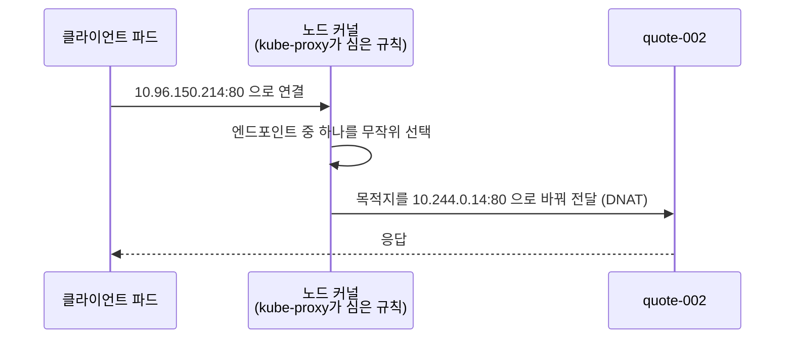

# 11.1 서비스로 파드 노출하기

지금까지는 파드에 접속할 때 `kubectl port-forward`를 쓰거나 파드 IP를 직접 적었습니다. 그런데 파드는 언제든 죽고 다시 만들어지며, 그때마다 **IP가 바뀝니다.** 같은 일을 하는 파드가 여러 개라면 누구에게 요청을 보낼지도 정해야 합니다.

이 두 문제를 한꺼번에 푸는 오브젝트가 **서비스(Service)** 입니다. 서비스는 **고정된 IP와 DNS 이름 하나**를 주고, 그 뒤에 있는 파드들에게 요청을 나눠 보냅니다.

> **"파드 IP를 그냥 쓰면 안 되나요?"** 파드 IP는 파드가 다시 만들어지면 바뀝니다. 게다가 클라이언트가 파드 목록을 직접 들고 있다가 하나씩 골라 보내야 합니다. 서비스는 이 일을 **클라이언트 대신** 해 줍니다.

## 11.1.1 서비스는 레이블로 파드를 묶는 고정 주소입니다

실습 애플리케이션은 세 부분으로 되어 있습니다. 사용자 요청을 받는 **kiada**, 명언을 돌려주는 **quote**, 퀴즈를 내는 **quiz**입니다. kiada는 quote와 quiz를 불러야 하는데, 이들의 파드 IP를 알 방법이 마땅치 않습니다.

서비스를 두면 구조가 이렇게 바뀝니다.



서비스가 어느 파드를 묶을지는 **레이블 셀렉터**로 정합니다. [7.3절](<../07장. 네임스페이스와 레이블로 리소스 구성하기/7.3 레이블 셀렉터로 오브젝트 걸러 내기.md>)에서 예고한 바로 그 쓰임입니다. **파드는 자기가 어느 서비스에 속하는지 모릅니다.** 서비스 쪽이 레이블을 보고 파드를 데려갑니다.



> 출처: [Using a Service to Expose Your App](https://kubernetes.io/docs/tutorials/kubernetes-basics/expose/expose-intro/) © The Kubernetes Authors, [CC BY 4.0](https://creativecommons.org/licenses/by/4.0/)

그림에서 셀렉터 `app=A`를 가진 서비스(1.1.1.1)는 `app: A` 레이블이 붙은 파드 네 개에 트래픽을 보냅니다. 그중 하나(10.10.10.5)는 디플로이먼트에 속하지도 않았는데 함께 묶였습니다. **레이블만 맞으면 누가 만든 파드든 상관없다**는 뜻입니다. `app: B` 파드(10.10.10.4)는 빠집니다.

### 서비스 IP는 누가 처리할까요?

서비스의 IP는 어느 네트워크 장치에도 붙어 있지 않은 **가상 IP**입니다. 각 노드에서 도는 **kube-proxy**가 "이 IP:포트로 가는 패킷은 이 파드들 중 하나로 보내라"는 규칙을 노드 커널에 심어 둡니다. kube-proxy의 역할과 모드(iptables·nftables·ipvs)는 [1.2절](<../01장. 쿠버네티스 소개/1.2 쿠버네티스 이해하기.md>)에서 짧게 소개했습니다.

실습 클러스터의 kube-proxy는 iptables 모드입니다.

```bash
kubectl get cm kube-proxy -n kube-system -o jsonpath="{.data.config\.conf}" | grep "^mode"
```

```
mode: iptables
```

노드 안에 들어가 quote 서비스용 규칙을 보면 구조가 그대로 드러납니다.

```bash
podman exec kia-control-plane iptables -w -t nat -S KUBE-SVC-7G65BYP747AHZMZU
```

```
-N KUBE-SVC-7G65BYP747AHZMZU
-A KUBE-SVC-7G65BYP747AHZMZU ! -s 10.244.0.0/16 -d 10.96.150.214/32 -p tcp -m comment --comment "ch11/quote:http cluster IP" -m tcp --dport 80 -j KUBE-MARK-MASQ
-A KUBE-SVC-7G65BYP747AHZMZU -m comment --comment "ch11/quote:http -> 10.244.0.13:80" -m statistic --mode random --probability 0.12500000000 -j KUBE-SEP-6AJPM3B7ITVUC6XN
-A KUBE-SVC-7G65BYP747AHZMZU -m comment --comment "ch11/quote:http -> 10.244.0.14:80" -m statistic --mode random --probability 0.14285714272 -j KUBE-SEP-4XMFF3KUCE6SDQFH
...
-A KUBE-SVC-7G65BYP747AHZMZU -m comment --comment "ch11/quote:http -> 10.244.0.83:80" -j KUBE-SEP-HNLNTKM5PAZC4HJT
```

(이 출력은 quote 파드를 몇 개 더 띄운 뒤에 찍어서 엔드포인트가 9개입니다.)

`--probability 0.125`, `0.142…`, … 마지막은 확률 없이 무조건. 9개 중 하나를 **무작위로** 고르는 규칙입니다. 라운드 로빈이 아니라 **확률**이라는 점을 기억해 두세요. 요청 몇 번만 보내 보면 같은 파드가 연달아 걸리기도 합니다.



> **kube-proxy는 트래픽을 직접 중계하지 않습니다.** 규칙만 심어 두고, 실제 패킷은 커널이 바로 넘깁니다. 그래서 kube-proxy 파드가 잠깐 죽어도 이미 심어 둔 규칙으로 통신은 계속됩니다. 다만 새 파드가 반영되지 않습니다.

## 11.1.2 서비스 만들고 고치기

실습용 파드를 띄워 둡니다. 레이블은 `app`과 `rel` 두 가지입니다.

```bash
kubectl get pods --show-labels
```

```
NAME           READY   STATUS    RESTARTS   AGE    LABELS
kiada-001      1/1     Running   0          2m1s   app=kiada,rel=stable
kiada-002      1/1     Running   0          2m1s   app=kiada,rel=stable
kiada-003      1/1     Running   0          2m1s   app=kiada,rel=stable
kiada-canary   1/1     Running   0          2m1s   app=kiada,rel=canary
quiz           2/2     Running   0          2m1s   app=quiz,rel=stable
quote-001      2/2     Running   0          2m1s   app=quote,rel=stable
quote-002      2/2     Running   0          2m1s   app=quote,rel=stable
quote-003      2/2     Running   0          2m1s   app=quote,rel=stable
quote-canary   2/2     Running   0          2m1s   app=quote,rel=canary
```

### `kubectl expose` — 빠르지만 셀렉터를 너무 좁게 잡습니다

```bash
kubectl expose pod quiz --name quiz
kubectl get svc
```

```
service/quiz exposed
```

```
NAME   TYPE        CLUSTER-IP     EXTERNAL-IP   PORT(S)    AGE
quiz   ClusterIP   10.96.93.125   <none>        8080/TCP   1s
```

**`CLUSTER-IP`** 가 서비스에 붙은 가상 IP입니다. 무엇이 만들어졌는지 YAML로 열어 봅니다.

```bash
kubectl get svc quiz -o yaml
```

```
spec:
  clusterIP: 10.96.93.125
  clusterIPs:
  - 10.96.93.125
  internalTrafficPolicy: Cluster
  ipFamilies:
  - IPv4
  ipFamilyPolicy: SingleStack
  ports:
  - port: 8080
    protocol: TCP
    targetPort: 8080
  selector:
    app: quiz
    rel: stable
  sessionAffinity: None
  type: ClusterIP
```

`selector`에 **파드의 레이블이 전부** 들어갔습니다. `rel=stable`까지 묶였으니, 나중에 `rel=canary` quiz 파드를 띄우면 이 서비스에는 안 붙습니다. 포트도 컨테이너 포트(8080)를 그대로 가져왔습니다. **`expose`는 실험용으로만 쓰고, 실제로는 매니페스트를 씁니다.**

### 매니페스트로 만들기

**svc.quote.yaml**

```yaml
apiVersion: v1
kind: Service
metadata:
  name: quote
spec:
  type: ClusterIP           # 기본값. 클러스터 안에서만 접근
  selector:
    app: quote              # 이 레이블을 가진 파드를 모두 묶음
  ports:
  - name: http              # 포트 이름. 포트가 여러 개면 필수
    port: 80                # 서비스가 받는 포트
    targetPort: 80          # 파드에 넘길 포트 (숫자 또는 containerPort 이름)
    protocol: TCP
```

quiz는 서비스 포트를 80으로 바꾸고 파드의 8080으로 넘기도록 다시 만듭니다.

**svc.quiz.yaml**

```yaml
apiVersion: v1
kind: Service
metadata:
  name: quiz
spec:
  type: ClusterIP
  selector:
    app: quiz
  ports:
  - name: http
    port: 80                # 클라이언트는 80으로
    targetPort: 8080        # 파드는 8080에서 듣고 있음
    protocol: TCP
```

```bash
kubectl delete svc quiz
kubectl apply -f svc.quiz.yaml -f svc.quote.yaml
kubectl get svc -o wide
```

```
NAME    TYPE        CLUSTER-IP      EXTERNAL-IP   PORT(S)   AGE   SELECTOR
quiz    ClusterIP   10.96.116.195   <none>        80/TCP    1s    app=quiz
quote   ClusterIP   10.96.150.214   <none>        80/TCP    1s    app=quote
```

quiz를 지우고 다시 만들었더니 IP가 `10.96.93.125`에서 `10.96.116.195`로 바뀌었습니다. **서비스 IP는 서비스가 살아 있는 동안만 고정**입니다. 지우고 다시 만들면 새 IP를 받습니다.

```bash
kubectl describe svc quote
```

```
Name:                     quote
Namespace:                ch11
Labels:                   <none>
Annotations:              <none>
Selector:                 app=quote
Type:                     ClusterIP
IP Family Policy:         SingleStack
IP Families:              IPv4
IP:                       10.96.150.214
IPs:                      10.96.150.214
Port:                     http  80/TCP
TargetPort:               80/TCP
Endpoints:                10.244.0.13:80,10.244.0.15:80,10.244.0.14:80 + 1 more...
Session Affinity:         None
Internal Traffic Policy:  Cluster
Events:                   <none>
```

`Endpoints` 줄이 셀렉터에 걸린 파드 IP:포트 목록입니다. 4개(3개 + 1 more)로 quote 파드 수와 같습니다. 이 목록이 어디에 저장되는지는 [11.3절](<11.3 서비스 엔드포인트 관리하기.md>)에서 봅니다.

### 셀렉터 바꾸기 — 트래픽 대상이 즉시 바뀝니다

카나리 파드를 빼고 안정판에만 보내고 싶다면 셀렉터에 조건을 더합니다.

```bash
kubectl set selector service quote "app=quote,rel=stable"
kubectl get endpointslices -l kubernetes.io/service-name=quote
```

```
service/quote selector updated
```

```
NAME          ADDRESSTYPE   PORTS   ENDPOINTS                             AGE
quote-tkb9t   IPv4          80      10.244.0.13,10.244.0.15,10.244.0.14   8s
```

`quote-canary`(10.244.0.16)가 빠졌습니다. 다시 `app=quote`로 돌려 두고 진행합니다.

```bash
kubectl set selector service quote "app=quote"
```

### `targetPort`에는 포트 이름을 쓰는 편이 낫습니다

[4.2절](<../04장. 파드로 애플리케이션 실행하기/4.2 YAML로 파드 만들기.md>)에서 `containerPort`에 이름을 붙이면 서비스에서 이름으로 부를 수 있다고 했습니다. kiada 서비스가 그렇게 씁니다.

**svc.kiada.yaml**

```yaml
apiVersion: v1
kind: Service
metadata:
  name: kiada
spec:
  selector:
    app: kiada
  ports:
  - name: http
    port: 80
    targetPort: http        # 파드의 containerPort 이름. 번호가 바뀌어도 서비스는 그대로
```

이름이 틀리면 어떻게 될까요? quote 파드에 없는 포트 이름 `web`을 일부러 넣어 봅니다.

```bash
kubectl create service clusterip quote-badport --tcp=80:web --dry-run=client -o yaml \
  | sed "s/app: quote-badport/app: quote/" | kubectl apply -f -
kubectl get endpointslices -l kubernetes.io/service-name=quote-badport
kubectl exec client -- curl -sS -m 5 quote-badport
```

```
NAME                  ADDRESSTYPE   PORTS     ENDPOINTS                                         AGE
quote-badport-pvcnn   IPv4          <unset>   10.244.0.13,10.244.0.15,10.244.0.14 + 1 more...   1s
```

```
curl: (7) Failed to connect to quote-badport port 80 after 1 ms: Could not connect to server
command terminated with exit code 7
```

> **포트 이름이 틀려도 에러는 나지 않습니다.** 서비스는 문제없이 만들어지고, 파드 IP도 엔드포인트에 다 들어갑니다. **`PORTS`만 `<unset>`** 이고 연결은 거부됩니다. 서비스가 응답하지 않을 때 엔드포인트의 `PORTS` 열을 꼭 확인하세요.

### 포트가 여러 개면 이름이 필수입니다

```yaml
spec:
  selector:
    app: kiada
  ports:
  - port: 80                # name 이 없음
    targetPort: 8080
  - port: 443               # name 이 없음
    targetPort: 8443
```

```bash
kubectl apply -f svc.kiada-noname.yaml
```

```
The Service "kiada-noname" is invalid: 
* spec.ports[0].name: Required value
* spec.ports[1].name: Required value
```

포트가 하나일 때는 이름을 빼도 되지만, **처음부터 붙이는 습관**을 들이면 나중에 포트를 추가할 때 서비스를 다시 손볼 일이 없습니다. 이름은 [11.4절](<11.4 서비스의 DNS 레코드 이해하기.md>)의 SRV 레코드에도 쓰입니다.

### 클러스터 IP는 바꿀 수 없습니다

```bash
kubectl patch svc quote -p '{"spec":{"clusterIP":"10.96.0.123"}}'
```

```
The Service "quote" is invalid: spec.clusterIPs[0]: Invalid value: ["10.96.0.123"]: may not change once set
```

IP를 꼭 정해야 한다면 **처음 만들 때** `spec.clusterIP`에 적습니다. 공식 문서는 직접 고를 때 서비스 IP 대역의 **아랫부분**에서 고르라고 권합니다. 자동 할당은 윗부분부터 쓰기 때문에 겹칠 위험이 줄어듭니다.

### IPv4와 IPv6 — `ipFamilyPolicy`

서비스의 `ipFamilyPolicy`는 IP를 몇 종류 받을지 정합니다.

| 값 | 뜻 |
| :--- | :--- |
| **`SingleStack`** (기본) | 한 종류만. 보통 IPv4 |
| **`PreferDualStack`** | 클러스터가 지원하면 둘 다, 아니면 하나 |
| **`RequireDualStack`** | 반드시 둘 다. 안 되면 거부 |

실습 클러스터는 IPv4 전용입니다.

```bash
kubectl get servicecidr
```

```
NAME         CIDRS          AGE
kubernetes   10.96.0.0/16   16m
```

`RequireDualStack`을 요구하면 거부되고, `PreferDualStack`은 IPv4 하나만 받고 넘어갑니다.

```bash
kubectl apply -f svc.quote-dualstack.yaml           # RequireDualStack
```

```
The Service "quote-dualstack" is invalid: spec.ipFamilyPolicy: Invalid value: "RequireDualStack": this cluster is not configured for dual-stack services
```

```bash
kubectl apply -f svc.quote-preferdualstack.yaml     # PreferDualStack
kubectl get svc quote-dualstack -o jsonpath="{.spec.ipFamilyPolicy} {.spec.ipFamilies} {.spec.clusterIPs}"
```

```
PreferDualStack ["IPv4"] ["10.96.142.145"]
```

> **듀얼스택은 클러스터를 만들 때 정합니다.** 파드 대역과 서비스 대역을 IPv4·IPv6 둘 다 잡아 둬야 서비스도 두 주소를 받습니다. kind는 `networking.ipFamily: dual`로 만들 수 있지만, 이 실습 클러스터는 그렇게 만들지 않았습니다.

## 11.1.3 클러스터 안에서 서비스에 접속하기

클라이언트 역할을 할 파드를 하나 띄웁니다.

```bash
kubectl run client --image=docker.io/curlimages/curl:8.16.0 --restart=Never --command -- sleep infinity
```

### 1) 클러스터 IP로

```bash
kubectl exec client -- curl -s http://10.96.150.214
```

```
This is the quote service running in pod quote-001 on node kia-control-plane
```

여러 번 보내면 응답하는 파드가 바뀝니다.

```bash
for i in 1 2 3 4 5 6; do kubectl exec client -- curl -s http://quote; done
```

```
This is the quote service running in pod quote-001 on node kia-control-plane
This is the quote service running in pod quote-003 on node kia-control-plane
This is the quote service running in pod quote-003 on node kia-control-plane
This is the quote service running in pod quote-002 on node kia-control-plane
This is the quote service running in pod quote-001 on node kia-control-plane
This is the quote service running in pod quote-001 on node kia-control-plane
```

앞에서 본 대로 **무작위 선택**이라 고르게 돌아가지 않습니다. 여섯 번 중에 `quote-canary`는 한 번도 안 걸렸습니다.

### 2) 환경 변수로

kubelet은 파드를 만들 때 **그 시점에 있던 서비스**의 주소를 환경 변수로 넣어 줍니다. 이름은 `<서비스 이름 대문자>_SERVICE_HOST`, `_SERVICE_PORT` 꼴입니다.

```bash
kubectl exec client -- env | sort | grep "_SERVICE_"
```

```
KIADA_SERVICE_HOST=10.96.37.232
KIADA_SERVICE_PORT=80
KIADA_SERVICE_PORT_HTTP=80
KUBERNETES_SERVICE_HOST=10.96.0.1
KUBERNETES_SERVICE_PORT=443
KUBERNETES_SERVICE_PORT_HTTPS=443
QUIZ_SERVICE_HOST=10.96.116.195
QUIZ_SERVICE_PORT=80
QUIZ_SERVICE_PORT_HTTP=80
QUOTE_SERVICE_HOST=10.96.150.214
QUOTE_SERVICE_PORT=80
QUOTE_SERVICE_PORT_HTTP=80
```

서비스보다 **먼저** 만든 kiada-001에는 없습니다.

```bash
kubectl exec kiada-001 -- env | sort | grep "_SERVICE_"
```

```
KUBERNETES_SERVICE_HOST=10.96.0.1
KUBERNETES_SERVICE_PORT=443
KUBERNETES_SERVICE_PORT_HTTPS=443
```

> **환경 변수는 파드가 생길 때 한 번만 채워집니다.** 서비스를 나중에 만들면 이미 떠 있는 파드는 모릅니다. 서비스를 지웠다 다시 만들어 IP가 바뀌어도 옛 값이 남습니다. 그래서 실무에서는 다음 방법, **DNS**를 씁니다.

### 3) DNS 이름으로 — 가장 많이 씁니다

클러스터에는 CoreDNS가 돌고 있고, 서비스마다 이름을 등록해 둡니다. 파드의 `/etc/resolv.conf`를 보면 이유가 보입니다.

```bash
kubectl exec client -- cat /etc/resolv.conf
```

```
search ch11.svc.cluster.local svc.cluster.local cluster.local dns.podman
nameserver 10.96.0.10
options ndots:5
```

`search` 목록 덕분에 짧은 이름이 자동으로 늘어납니다. 아래 셋은 모두 같은 서비스를 가리킵니다.

| 쓰는 이름 | 실제로 찾는 이름 | 언제 |
| :--- | :--- | :--- |
| `quote` | `quote.ch11.svc.cluster.local` | **같은 네임스페이스** |
| `quote.ch11` | `quote.ch11.svc.cluster.local` | **다른 네임스페이스**에서 |
| `quote.ch11.svc.cluster.local` | 그대로 | 완전한 이름(FQDN) |

```bash
kubectl exec client -- curl -s quote.ch11
kubectl exec client -- curl -s quote.ch11.svc.cluster.local
```

```
This is the quote service running in pod quote-001 on node kia-control-plane
```

```
This is the quote service running in pod quote-003 on node kia-control-plane
```

kiada가 quote와 quiz를 부를 때도 이 방법을 씁니다. 매니페스트의 환경 변수가 `QUOTE_URL=http://quote/quote`, `QUIZ_URL=http://quiz`입니다.

```bash
kubectl exec client -- curl -s http://kiada
```

```
KUBERNETES IN ACTION DEMO APPLICATION v0.5

==== TIP OF THE MINUTE
Like config maps, the maximum size of a secret is approximately 1MB.


==== POP QUIZ
Which of the following statements regarding the container shutdown process is correct?
...

==== REQUEST INFO
Request processed by Kiada 0.5 running in pod "kiada-canary" on node "kia-control-plane".
Pod hostname: kiada-canary; Pod IP: 10.244.0.20; Node IP: 10.89.0.2; Client IP: ::ffff:10.244.0.39
```

`TIP OF THE MINUTE`는 quote 서비스에서, `POP QUIZ`는 quiz 서비스에서 받아 온 내용입니다. 세 서비스가 이름만으로 엮였습니다. DNS 레코드의 종류는 [11.4절](<11.4 서비스의 DNS 레코드 이해하기.md>)에서 더 자세히 봅니다.

### 서비스 IP에는 ping이 안 됩니다

```bash
kubectl run bb --image=docker.io/library/busybox:1.37 --restart=Never --command -- sleep infinity
kubectl exec bb -- ping -c 2 -W 2 quote
```

```
PING quote (10.96.150.214): 56 data bytes

--- quote ping statistics ---
2 packets transmitted, 0 packets received, 100% packet loss
command terminated with exit code 1
```

> **ping이 안 된다고 서비스가 고장 난 것은 아닙니다.** 서비스 IP는 **정해진 프로토콜과 포트**에 대해서만 규칙이 있는 가상 IP입니다. ICMP(ping)를 받아 줄 장치가 없습니다. 이름이 IP로 바뀌었다는 것(`PING quote (10.96.150.214)`)까지만 확인하면 DNS는 정상입니다. 연결 확인은 `curl`로 하세요.

### 일부러 실패시켜 보기 — 증상이 다릅니다

**① 셀렉터에 맞는 파드가 하나도 없을 때**

```bash
kubectl create service clusterip nobody --tcp=80:8080      # selector: app=nobody
kubectl get endpointslices -l kubernetes.io/service-name=nobody
kubectl exec client -- curl -sS -m 5 nobody
```

```
NAME           ADDRESSTYPE   PORTS     ENDPOINTS   AGE
nobody-lwtd7   IPv4          <unset>   <unset>     0s
```

```
curl: (7) Failed to connect to nobody port 80 after 1 ms: Could not connect to server
command terminated with exit code 7
```

**② 서비스에 없는 포트로 보낼 때**

```bash
kubectl exec client -- curl -sS -m 5 quote:8080
```

```
curl: (28) Connection timed out after 5002 milliseconds
command terminated with exit code 28
```

| 증상 | 걸린 시간 | 의심할 곳 |
| :--- | :--- | :--- |
| **즉시 거부** (`exit code 7`) | 1 ms | 엔드포인트가 비었거나 `targetPort`가 틀림 |
| **시간 초과** (`exit code 28`) | 5초 | 서비스에 없는 포트로 보냄 |
| **이름을 못 찾음** | — | 서비스 이름·네임스페이스 오타 ([11.4절](<11.4 서비스의 DNS 레코드 이해하기.md>)) |

### 같은 클라이언트는 같은 파드로 — `sessionAffinity`

기본값(`None`)에서는 요청마다 파드가 바뀝니다.

```bash
for i in 1 2 3 4 5; do kubectl exec client -- curl -s kiada | grep "Request processed"; done
```

```
Request processed by Kiada 0.5 running in pod "kiada-canary" on node "kia-control-plane".
Request processed by Kiada 0.5 running in pod "kiada-001" on node "kia-control-plane".
Request processed by Kiada 0.5 running in pod "kiada-002" on node "kia-control-plane".
Request processed by Kiada 0.5 running in pod "kiada-003" on node "kia-control-plane".
Request processed by Kiada 0.5 running in pod "kiada-003" on node "kia-control-plane".
```

`ClientIP`로 바꾸면 같은 클라이언트 IP는 계속 같은 파드로 갑니다.

```bash
kubectl patch svc kiada -p '{"spec":{"sessionAffinity":"ClientIP"}}'
kubectl get svc kiada -o jsonpath="{.spec.sessionAffinity} {.spec.sessionAffinityConfig}"
```

```
ClientIP {"clientIP":{"timeoutSeconds":10800}}
```

```bash
for i in 1 2 3 4 5; do kubectl exec client -- curl -s kiada | grep "Request processed"; done
```

```
Request processed by Kiada 0.5 running in pod "kiada-003" on node "kia-control-plane".
Request processed by Kiada 0.5 running in pod "kiada-003" on node "kia-control-plane".
Request processed by Kiada 0.5 running in pod "kiada-003" on node "kia-control-plane".
Request processed by Kiada 0.5 running in pod "kiada-003" on node "kia-control-plane".
Request processed by Kiada 0.5 running in pod "kiada-003" on node "kia-control-plane".
```

기본 유지 시간은 `10800`초, **3시간**입니다. `sessionAffinityConfig.clientIP.timeoutSeconds`로 바꿀 수 있습니다.

> **쿠키 기반 고정은 없습니다.** 서비스는 TCP/UDP 수준에서 동작하므로 HTTP 쿠키를 볼 수 없습니다. 값은 `None`과 `ClientIP` 둘뿐입니다. 게다가 앞에 프록시가 있으면 모든 요청이 프록시 IP 하나로 보여 **한 파드에 몰립니다.** HTTP 수준의 고정이 필요하면 인그레스([12.4절](<../12장. 인그레스로 서비스에 트래픽 라우팅하기/12.4 인그레스 추가 설정 옵션.md>)에서 다룹니다)나 애플리케이션에서 처리합니다.

## 요약 및 비유

| 개념 | 콜센터 대표번호 비유 | 기술적 의미 |
| :--- | :--- | :--- |
| **서비스** | 회사 대표번호 1588-xxxx | 파드 묶음 앞의 고정 IP·이름 |
| **셀렉터** | "상담 부서 소속" 조건 | 어느 파드를 묶을지 정하는 레이블 조건 |
| **엔드포인트** | 지금 자리에 앉은 상담원 내선 목록 | 셀렉터에 걸린 파드 IP:포트 |
| **kube-proxy** | 대표번호를 내선으로 돌리는 교환기 설정 | 노드 커널에 전달 규칙을 심음 |
| **무작위 분배** | 빈 상담원 아무에게나 연결 | iptables `statistic --mode random` |
| **`sessionAffinity: ClientIP`** | 같은 번호로 걸면 지난번 상담원에게 | 같은 클라이언트 IP → 같은 파드 |
| **환경 변수** | 입사 때 받은 연락처 인쇄본 | 파드 생성 시점의 서비스만 들어감 |
| **DNS 이름** | 회사 이름으로 검색한 최신 대표번호 | `quote`, `quote.ch11`, FQDN |
| **ping 안 됨** | 대표번호는 문자 수신 불가 | 가상 IP는 지정된 포트만 처리 |

## 결론

* 서비스는 **레이블 셀렉터로 묶은 파드 앞에 고정 IP와 DNS 이름**을 줍니다. 파드가 바뀌어도 클라이언트는 그대로입니다.
* 서비스 IP는 **가상 IP**입니다. kube-proxy가 심어 둔 규칙으로 커널이 파드 하나를 **무작위로** 골라 넘깁니다. ping은 안 됩니다.
* `kubectl expose`는 파드의 레이블을 **전부** 셀렉터로 가져가므로 너무 좁습니다. 실무에서는 매니페스트를 쓰고, **포트에는 이름**을 붙입니다(여러 개면 필수).
* `targetPort` 이름이 틀려도 서비스는 만들어집니다. 엔드포인트의 **`PORTS`가 `<unset>`** 인지 확인하세요.
* 접속은 **DNS 이름**이 기본입니다. 환경 변수는 **파드보다 먼저 있던 서비스만** 들어갑니다.
* `sessionAffinity`는 `None`과 **`ClientIP`(기본 3시간)** 둘뿐이고, 쿠키 기반 고정은 없습니다.

## 공식 문서 업데이트 (2026년 10월 기준)

### 1) kube-proxy의 ipvs 모드는 1.35부터 deprecated입니다

공식 문서의 IPVS 모드 항목은 **Deprecated since Kubernetes v1.35**로 표기되어 있습니다. 1.40부터 기본으로 꺼지고(`KubeProxyIPVS` 기능 게이트로 다시 켤 수 있음), 1.43에서 완전히 없어질 예정입니다. 1.37의 기본 모드는 여전히 iptables이며, **nftables가 앞으로 기본이 될 예정**이라 모드를 명시해 두라고 권합니다.

참고: <https://kubernetes.io/docs/reference/networking/virtual-ips/>

### 2) 서비스 IP 할당을 API 오브젝트로 관리합니다

서비스 IP 대역이 **ServiceCIDR**, 할당된 IP 하나하나가 **IPAddress** 오브젝트로 기록됩니다. 이 방식(`MultiCIDRServiceAllocator`)은 **1.33에서 GA**가 되어 끌 수 없습니다. 위에서 `kubectl get servicecidr`로 대역을 확인한 것이 그 결과입니다. 대역이 모자라면 ServiceCIDR을 하나 더 만들어 늘릴 수 있습니다.

참고: <https://kubernetes.io/docs/reference/networking/virtual-ips/>

## 출처

> 2026-10-05 공식 문서로 검증

* 원서: *Kubernetes in Action, Second Edition* 11장 — <https://livebook.manning.com/book/kubernetes-in-action-second-edition/>
* [Service](https://kubernetes.io/docs/concepts/services-networking/service/) — Kubernetes 공식 문서
* [Virtual IPs and Service Proxies](https://kubernetes.io/docs/reference/networking/virtual-ips/) — Kubernetes 공식 문서
* [DNS for Services and Pods](https://kubernetes.io/docs/concepts/services-networking/dns-pod-service/) — Kubernetes 공식 문서
* [IPv4/IPv6 dual-stack](https://kubernetes.io/docs/concepts/services-networking/dual-stack/) — Kubernetes 공식 문서
* [Using a Service to Expose Your App](https://kubernetes.io/docs/tutorials/kubernetes-basics/expose/expose-intro/) — Kubernetes 공식 문서
* [kind – Configuration](https://kind.sigs.k8s.io/docs/user/configuration/) — kind 공식 문서
