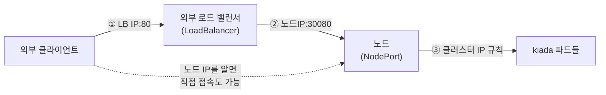
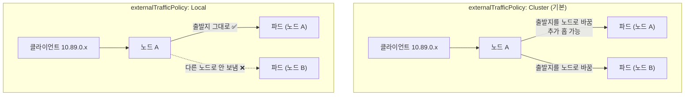

# 11.2 서비스를 클러스터 밖으로 노출하기

[11.1절](<11.1 서비스로 파드 노출하기.md>)의 서비스는 `ClusterIP` 타입이라 **클러스터 안에서만** 닿았습니다. kiada는 사용자가 브라우저로 접속해야 하는 앱이니 밖에서도 들어올 길이 필요합니다.

서비스의 `type`을 바꾸면 됩니다. **NodePort**는 모든 노드의 포트 하나를 열고, **LoadBalancer**는 그 앞에 외부 로드 밸런서를 하나 더 세웁니다.



세 타입은 **겹쳐 쌓이는 구조**입니다. LoadBalancer 서비스는 NodePort와 ClusterIP도 함께 갖고, NodePort 서비스는 ClusterIP도 갖습니다.

| 타입 | 접근 경로 | 쓰는 곳 |
| :--- | :--- | :--- |
| **ClusterIP** | 클러스터 IP:포트 (안에서만) | 내부 서비스끼리 |
| **NodePort** | + 모든 노드 IP:노드포트 | 테스트, 외부 LB를 직접 붙일 때 |
| **LoadBalancer** | + 외부 LB IP:포트 | 클라우드에서 외부 공개 |

## 11.2.1 NodePort — 모든 노드에 같은 포트를 엽니다

**svc.kiada.nodeport.yaml**

```yaml
apiVersion: v1
kind: Service
metadata:
  name: kiada
spec:
  type: NodePort
  selector:
    app: kiada
  ports:
  - name: http
    port: 80                # 클러스터 IP에서 받는 포트
    nodePort: 30080         # 각 노드에서 여는 포트. 비우면 자동 할당
    targetPort: http        # 파드 포트
```

이미 있는 ClusterIP 서비스 `kiada`에 그대로 적용합니다.

```bash
kubectl apply -f svc.kiada.nodeport.yaml
kubectl get svc kiada
```

```
service/kiada configured
```

```
NAME    TYPE       CLUSTER-IP     EXTERNAL-IP   PORT(S)        AGE
kiada   NodePort   10.96.37.232   <none>        80:30080/TCP   99s
```

`created`가 아니라 **`configured`** 입니다. 서비스를 지우지 않고 타입만 바꿨으므로 클러스터 IP(`10.96.37.232`)도 그대로입니다. `PORT(S)`의 `80:30080`은 "클러스터 IP의 80, 노드의 30080"이라는 뜻입니다.

### 노드 IP로 접속해 보기

노드 IP를 확인합니다.

```bash
kubectl get nodes -o wide
```

```
NAME                STATUS   ROLES           AGE    VERSION   INTERNAL-IP   EXTERNAL-IP   OS-IMAGE                       KERNEL-VERSION                              CONTAINER-RUNTIME
kia-control-plane   Ready    control-plane   8m5s   v1.37.0   10.89.0.2     <none>        Debian GNU/Linux 13 (trixie)   6.18.33.2-microsoft-standard-WSL2 (amd64)   containerd://2.3.4
```

노드 컨테이너 안에서 노드 IP와 localhost로 보내 봅니다.

```bash
podman exec kia-control-plane curl -s 10.89.0.2:30080 | grep "Request processed\|Client IP"
```

```
Request processed by Kiada 0.5 running in pod "kiada-002" on node "kia-control-plane".
Pod hostname: kiada-002; Pod IP: 10.244.0.18; Node IP: 10.89.0.2; Client IP: ::ffff:10.244.0.1
```

```bash
podman exec kia-control-plane curl -s localhost:30080 | grep "REQUEST INFO" -A2
```

```
==== REQUEST INFO
Request processed by Kiada 0.5 running in pod "kiada-canary" on node "kia-control-plane".
Pod hostname: kiada-canary; Pod IP: 10.244.0.20; Node IP: 10.89.0.2; Client IP: ::ffff:10.244.0.1
```

> **localhost에서 NodePort가 열리는 것은 iptables 모드의 특성입니다.** 공식 문서에 따르면 ipvs 모드나 IPv6 단일 스택의 iptables 모드에서는 localhost로 NodePort에 닿지 않습니다. nftables 모드는 원래 안 됐고, 1.37에서 알파 기능 게이트(`KubeProxyNFTablesLocalhostNodePorts`)로 켤 수 있게 되었습니다.

클러스터 **밖**의 클라이언트도 흉내 내 봅니다. kind 노드와 같은 podman 네트워크(`kind`)에 컨테이너를 하나 띄우면, 노드 입장에서는 외부 머신입니다.

```bash
podman run --rm --network kind docker.io/curlimages/curl:8.16.0 -s 10.89.0.2:30080 | grep "Client IP"
```

```
Pod hostname: kiada-001; Pod IP: 10.244.0.17; Node IP: 10.89.0.2; Client IP: ::ffff:10.244.0.1
```

들어왔습니다. 그런데 `Client IP`가 클라이언트 컨테이너의 IP(10.89.0.x)가 아니라 **`10.244.0.1`** 입니다. 이 이야기는 [11.2.3](#1123-externaltrafficpolicy--클라이언트-ip를-지키려면-local)에서 이어 갑니다.

> **Windows 호스트에서는 노드 IP로 바로 닿지 않습니다.** kind 노드는 podman이 WSL 가상 머신 안에 만든 네트워크에 있어서, Windows 쪽 `curl 10.89.0.2:30080`은 시간 초과(`exit code 28`), `localhost:30080`은 연결 거부(`exit code 7`)였습니다. 호스트에서 열려면 [kind-config.yaml](<../00장. 실습 환경 구축/0.1 실습 환경 구축.md>)의 `extraPortMappings`에 포트를 적어야 하는데, 이것은 **클러스터를 만들 때만** 정할 수 있습니다. 실습 클러스터는 80/443만 열어 두었고, 이 포트는 12장의 인그레스가 씁니다.

### 일부러 실패시켜 보기 — 노드포트의 범위와 충돌

```bash
kubectl create service nodeport np-bad --tcp=80:8080 --node-port=80
```

```
error: failed to create NodePort service: Service "np-bad" is invalid: spec.ports[0].nodePort: Invalid value: 80: provided port is not in the valid range. The range of valid ports is 30000-32767
```

```bash
kubectl create service nodeport np-dup --tcp=80:8080 --node-port=30080
```

```
error: failed to create NodePort service: Service "np-dup" is invalid: spec.ports[0].nodePort: Invalid value: 30080: provided port is already allocated
```

* 노드포트는 기본 **30000~32767** 범위에서만 고를 수 있습니다(`kube-apiserver`의 `--service-node-port-range`로 바꿈).
* 노드포트는 **클러스터 전체에서 하나**입니다. 네임스페이스가 달라도 같은 번호를 두 서비스가 쓸 수 없습니다.

> **노드포트를 직접 고르지 않는 편이 안전합니다.** 비워 두면 자동으로 빈 번호를 받습니다. 꼭 정해야 한다면 공식 문서 권고대로 범위의 **아랫부분**에서 고르세요. 자동 할당은 윗부분부터 쓰므로 충돌 가능성이 줄어듭니다.

> **NodePort만으로 외부 공개를 끝내기는 어렵습니다.** 클라이언트가 노드 IP를 알아야 하고, 그 노드가 죽으면 다른 노드 IP로 바꿔야 합니다. 노드 여러 개 앞에서 하나의 주소를 주는 것이 다음의 LoadBalancer입니다.

## 11.2.2 LoadBalancer — 외부 로드 밸런서를 요청합니다

**svc.kiada.loadbalancer.yaml**

```yaml
apiVersion: v1
kind: Service
metadata:
  name: kiada
spec:
  type: LoadBalancer
  selector:
    app: kiada
  ports:
  - name: http
    port: 80                # 로드 밸런서가 받는 포트
    nodePort: 30080         # LB → 노드 구간에 쓰는 노드포트
    targetPort: http
```

```bash
kubectl apply -f svc.kiada.loadbalancer.yaml
kubectl get svc kiada
```

```
NAME    TYPE           CLUSTER-IP     EXTERNAL-IP   PORT(S)        AGE
kiada   LoadBalancer   10.96.37.232   <pending>     80:30080/TCP   2m20s
```

**`EXTERNAL-IP`가 `<pending>`** 에서 움직이지 않습니다. `describe`에도 아무 이벤트가 없습니다.

```bash
kubectl describe svc kiada
```

```
...
Type:                     LoadBalancer
...
NodePort:                 http  30080/TCP
Endpoints:                10.244.0.19:8080,10.244.0.20:8080,10.244.0.18:8080 + 1 more...
Session Affinity:         None
External Traffic Policy:  Cluster
Internal Traffic Policy:  Cluster
Events:                   <none>
```

> **쿠버네티스 자체는 로드 밸런서를 만들지 않습니다.** LoadBalancer 서비스는 "외부 LB를 하나 달라"는 **요청서**일 뿐입니다. 클라우드에서는 클라우드 컨트롤러 매니저가 이 요청을 보고 실제 LB를 만들어 IP를 채워 넣습니다. kind에는 그런 구현이 없으니 **아무도 요청을 받지 않아** 영원히 `<pending>`입니다. 에러 이벤트조차 없다는 점이 오히려 단서입니다. 같은 클러스터의 ingress-nginx 서비스도 같은 상태였습니다.

### MetalLB로 로드 밸런서 구현을 붙여 봅니다

**MetalLB**는 클라우드가 아닌 환경에서 LoadBalancer 서비스에 IP를 나눠 주는 오픈소스 구현입니다. L2 모드에서는 노드가 "이 IP는 나야"라고 ARP로 응답해 트래픽을 끌어옵니다.

이 클러스터는 다른 장의 실습도 같이 돌고 있어서, MetalLB가 **모든** LoadBalancer 서비스에 IP를 주면 남의 서비스(ingress-nginx)까지 건드리게 됩니다. 그래서 **`loadBalancerClass`** 로 범위를 좁혔습니다. MetalLB 공식 문서에 따르면 controller와 speaker 둘 다에 `--lb-class=<이름>`을 주면 **그 클래스를 적은 서비스만** 처리합니다.

```bash
curl -sLO https://raw.githubusercontent.com/metallb/metallb/v0.16.1/config/manifests/metallb-native.yaml
# controller·speaker 의 args 에 - --lb-class=ch11.kia/metallb 를 추가한 뒤
kubectl apply -f metallb-native.yaml
kubectl wait -n metallb-system --for=condition=Ready pod --all --timeout=180s
```

```
pod/controller-689b5f8f7-crxsw condition met
pod/speaker-9n7sz condition met
```

나눠 줄 IP 대역은 kind 네트워크(`10.89.0.0/24`) 안에서 비어 있는 끝자리로 잡습니다.

**metallb-pool.yaml**

```yaml
apiVersion: metallb.io/v1beta1
kind: IPAddressPool              # 나눠 줄 IP 목록
metadata:
  name: ch11-pool
  namespace: metallb-system
spec:
  addresses:
  - 10.89.0.200-10.89.0.210
---
apiVersion: metallb.io/v1beta1
kind: L2Advertisement            # 이 풀의 IP를 L2(ARP)로 알림
metadata:
  name: ch11-l2
  namespace: metallb-system
spec:
  ipAddressPools:
  - ch11-pool
```

```bash
kubectl apply -f metallb-pool.yaml
kubectl get svc kiada
kubectl get svc -n ingress-nginx ingress-nginx-controller
```

```
NAME    TYPE           CLUSTER-IP     EXTERNAL-IP   PORT(S)        AGE
kiada   LoadBalancer   10.96.37.232   <pending>     80:30080/TCP   3m45s
```

```
NAME                       TYPE           CLUSTER-IP      EXTERNAL-IP   PORT(S)                      AGE
ingress-nginx-controller   LoadBalancer   10.96.128.179   <pending>     80:32003/TCP,443:30087/TCP   7m25s
```

둘 다 그대로 `<pending>`입니다. 클래스를 적지 않았으니 MetalLB가 무시한 것이고, 의도한 대로입니다.

### `loadBalancerClass`는 나중에 붙일 수 없습니다

이미 있는 kiada 서비스에 클래스를 붙여 봅니다.

```bash
kubectl patch svc kiada -p '{"spec":{"loadBalancerClass":"ch11.kia/metallb"}}'
```

```
The Service "kiada" is invalid: spec.loadBalancerClass: Invalid value: "ch11.kia/metallb": may not change once set
```

비어 있던 값을 채우는 것도 "변경"으로 칩니다. 공식 문서도 **한 번 정하면 바꿀 수 없다**고 적고 있습니다. 서비스를 지우고 클래스를 넣어 다시 만듭니다.

**svc.kiada.loadbalancer-metallb.yaml**

```yaml
apiVersion: v1
kind: Service
metadata:
  name: kiada
spec:
  type: LoadBalancer
  loadBalancerClass: ch11.kia/metallb   # 이 클래스를 맡은 구현만 처리. 접두사/이름 형식
  selector:
    app: kiada
  ports:
  - name: http
    port: 80
    nodePort: 30080
    targetPort: http
```

```bash
kubectl delete svc kiada
kubectl apply -f svc.kiada.loadbalancer-metallb.yaml
kubectl get svc kiada
```

```
NAME    TYPE           CLUSTER-IP      EXTERNAL-IP   PORT(S)        AGE
kiada   LoadBalancer   10.96.213.200   10.89.0.200   80:30080/TCP   4s
```

몇 초 만에 **`EXTERNAL-IP`가 채워졌습니다.** 누가 채웠는지는 이벤트에 남습니다.

```bash
kubectl describe svc kiada
```

```
LoadBalancer Ingress:     10.89.0.200 (VIP)
Events:
  Type    Reason        Age   From                Message
  ----    ------        ----  ----                -------
  Normal  IPAllocated   5s    metallb-controller  Assigned IP ["10.89.0.200"]
  Normal  nodeAssigned  5s    metallb-speaker     announcing from node "kia-control-plane" with protocol "layer2"
```

controller가 IP를 고르고, speaker가 노드에서 그 IP를 알립니다. 할당 결과는 서비스의 `status`에 기록됩니다.

```bash
kubectl get svc kiada -o jsonpath="{.status}"
```

```
{"loadBalancer":{"ingress":[{"ip":"10.89.0.200","ipMode":"VIP"}]}}
```

외부 컨테이너에서 LB IP로 접속합니다. 포트는 노드포트가 아니라 **80**입니다.

```bash
podman run --rm --network kind docker.io/curlimages/curl:8.16.0 -s 10.89.0.200 | grep "Client IP"
```

```
Pod hostname: kiada-003; Pod IP: 10.244.0.19; Node IP: 10.89.0.2; Client IP: ::ffff:10.244.0.1
```

> **Windows 호스트에서는 이 IP도 닿지 않습니다.** `curl -m 5 http://10.89.0.200`은 `Connection timed out`(`exit code 28`)이었습니다. LB IP는 kind 네트워크 안에서만 의미가 있습니다. 클라우드의 LB는 공인 IP를 받으므로 이런 제약이 없습니다.

### 노드포트 없는 LoadBalancer — `allocateLoadBalancerNodePorts`

LB가 노드를 거치지 않고 파드나 노드의 VIP로 바로 보낼 수 있는 구현이라면 노드포트가 필요 없습니다.

**svc.kiada-lb-nonodeport.yaml**

```yaml
apiVersion: v1
kind: Service
metadata:
  name: kiada-lb-nonodeport
spec:
  type: LoadBalancer
  loadBalancerClass: ch11.kia/metallb
  allocateLoadBalancerNodePorts: false   # 노드포트를 만들지 않음
  selector:
    app: kiada
  ports:
  - name: http
    port: 80
    targetPort: http
```

```bash
kubectl apply -f svc.kiada-lb-nonodeport.yaml
kubectl get svc
```

```
NAME                  TYPE           CLUSTER-IP      EXTERNAL-IP   PORT(S)        AGE
kiada                 LoadBalancer   10.96.213.200   10.89.0.200   80:30080/TCP   98s
kiada-lb-nonodeport   LoadBalancer   10.96.90.113    10.89.0.201   80/TCP         5s
quiz                  ClusterIP      10.96.116.195   <none>        80/TCP         5m51s
quote                 ClusterIP      10.96.150.214   <none>        80/TCP         5m51s
```

`PORT(S)`가 `80/TCP`뿐입니다. MetalLB L2 모드는 LB IP 자체가 노드로 오고 kube-proxy가 그 IP를 처리하므로, 노드포트 없이도 응답했습니다.

```bash
podman run --rm --network kind docker.io/curlimages/curl:8.16.0 -s 10.89.0.201 | grep "Request processed"
```

```
Request processed by Kiada 0.5 running in pod "kiada-002" on node "kia-control-plane".
```

> **이 설정은 LB 구현이 지원할 때만 씁니다.** 노드포트로 트래픽을 받는 클라우드 LB에 `false`를 주면 길이 끊깁니다. 공식 문서는 이미 할당된 노드포트는 `false`로 바꿔도 **자동으로 회수되지 않는다**고 적고 있습니다.

## 11.2.3 externalTrafficPolicy — 클라이언트 IP를 지키려면 Local

앞에서 외부 컨테이너로 접속했는데 kiada가 본 클라이언트 IP는 늘 `10.244.0.1`이었습니다. 기본값인 **`externalTrafficPolicy: Cluster`** 에서는 노드가 패킷을 다른 노드의 파드로도 보낼 수 있어야 하므로, **출발지 주소를 노드 자신으로 바꿔(SNAT)** 보냅니다. 그래야 응답이 같은 노드를 거쳐 돌아옵니다.



`Local`로 바꾸면 노드는 **자기 노드에 있는 파드에만** 보냅니다. 노드를 건너가지 않으니 주소를 바꿀 필요가 없습니다.

**svc.kiada.nodeport.local.yaml**

```yaml
apiVersion: v1
kind: Service
metadata:
  name: kiada
spec:
  type: NodePort
  externalTrafficPolicy: Local    # 이 노드의 파드에만. 클라이언트 IP 보존
  selector:
    app: kiada
  ports:
  - name: http
    port: 80
    nodePort: 30080
    targetPort: 8080
```

NodePort 단계에서 이 매니페스트를 적용하고 다시 외부 컨테이너로 접속했습니다.

```bash
kubectl apply -f svc.kiada.nodeport.local.yaml
podman run --rm --network kind docker.io/curlimages/curl:8.16.0 -s 10.89.0.2:30080 | grep "Client IP"
podman run --rm --network kind docker.io/curlimages/curl:8.16.0 -s -w "%{local_ip}\n" -o /dev/null 10.89.0.2:30080
```

```
Pod hostname: kiada-canary; Pod IP: 10.244.0.20; Node IP: 10.89.0.2; Client IP: ::ffff:10.89.0.4
```

```
10.89.0.5
```

이번에는 kiada가 **`10.89.0.4`**, 즉 클라이언트 컨테이너의 실제 IP를 봤습니다. 두 번째 줄은 다음 번 컨테이너가 자기 IP(`10.89.0.5`)를 출력한 것으로, 매번 새 컨테이너라 IP가 하나씩 늘어난 것입니다.

LoadBalancer 서비스에도 같은 필드를 씁니다. MetalLB로 만든 kiada 서비스를 바꿔 봅니다.

```bash
kubectl patch svc kiada -p '{"spec":{"externalTrafficPolicy":"Local"}}'
kubectl get svc kiada -o jsonpath="{.spec.externalTrafficPolicy} {.spec.healthCheckNodePort}"
podman run --rm --network kind docker.io/curlimages/curl:8.16.0 -s 10.89.0.200 | grep "Client IP"
```

```
Local 30642
```

```
Pod hostname: kiada-canary; Pod IP: 10.244.0.20; Node IP: 10.89.0.2; Client IP: ::ffff:10.89.0.7
```

### `healthCheckNodePort` — LB가 "이 노드에 파드가 있나"를 묻는 곳

`Local`이 되자 **`healthCheckNodePort: 30642`** 가 새로 생겼습니다. 파드가 없는 노드로 트래픽을 보내면 버려지므로, 외부 LB는 이 포트로 노드마다 물어보고 **파드가 있는 노드에만** 트래픽을 보냅니다. kube-proxy가 답합니다.

```bash
podman exec kia-control-plane curl -s -i localhost:30642/healthz
```

```
HTTP/1.1 200 OK
Content-Type: application/json
X-Content-Type-Options: nosniff
X-Load-Balancing-Endpoint-Weight: 4
Date: Mon, 05 Oct 2026 09:33:36 GMT
Content-Length: 113

{
	"service": {
		"namespace": "ch11",
		"name": "kiada"
	},
	"localEndpoints": 4,
	"serviceProxyHealthy": true
}
```

`localEndpoints: 4` — 이 노드에 kiada 파드가 4개 있습니다.

### 일부러 실패시켜 보기 — 이 노드에 파드가 없으면

파드가 하나도 안 걸리는 `Local` 서비스를 만듭니다.

**svc.empty-local.yaml**

```yaml
apiVersion: v1
kind: Service
metadata:
  name: empty-local
spec:
  type: LoadBalancer
  loadBalancerClass: ch11.kia/metallb
  externalTrafficPolicy: Local
  selector:
    app: nothing              # 걸리는 파드 없음
  ports:
  - name: http
    port: 80
    targetPort: 8080
```

```bash
kubectl apply -f svc.empty-local.yaml
kubectl get svc empty-local -o jsonpath="{.status.loadBalancer.ingress[0].ip} {.spec.healthCheckNodePort}"
```

```
10.89.0.201 31252
```

```bash
podman exec kia-control-plane curl -s -i localhost:31252/healthz
```

```
HTTP/1.1 503 Service Unavailable
Content-Type: application/json
X-Content-Type-Options: nosniff
X-Load-Balancing-Endpoint-Weight: 0
Date: Mon, 05 Oct 2026 09:34:04 GMT
Content-Length: 119

{
	"service": {
		"namespace": "ch11",
		"name": "empty-local"
	},
	"localEndpoints": 0,
	"serviceProxyHealthy": true
}
```

```bash
podman run --rm --network kind docker.io/curlimages/curl:8.16.0 -sS -m 5 10.89.0.201
```

```
curl: (7) Failed to connect to 10.89.0.201 port 80 after 3063 ms: Could not connect to server
```

**503**이 "이 노드로는 보내지 마세요"라는 신호입니다. 클라우드 LB라면 이 노드를 대상에서 뺍니다. 단일 노드라 뺄 곳이 없으니 연결이 실패했습니다.

| | `Cluster` (기본) | `Local` |
| :--- | :--- | :--- |
| **클라이언트 IP** | 노드 IP로 바뀜 | **보존** |
| **추가 홉** | 생길 수 있음 | 없음 |
| **파드 없는 노드로 오면** | 다른 노드로 넘김 | **버림** |
| **부하 분산** | 파드 단위로 고름 | **노드 단위** — 파드 수가 노드마다 다르면 치우침 |
| **헬스 체크 포트** | 없음 | `healthCheckNodePort` 자동 할당 |

> **`Local`은 부하가 치우칠 수 있습니다.** LB는 보통 노드에 고르게 나눕니다. 노드 A에 파드 1개, 노드 B에 파드 3개라면 A의 파드 하나가 전체의 절반을 받습니다. `Local`을 쓴다면 파드를 노드마다 고르게 퍼뜨리는 설정(17장의 데몬셋 등)과 함께 생각하세요.

> **`externalTrafficPolicy`는 외부에서 들어온 트래픽에만 적용됩니다.** 노드포트·LB IP로 들어온 요청이 대상입니다. 클러스터 안에서 클러스터 IP로 보내는 요청은 `internalTrafficPolicy`가 따로 정합니다([11.5절](<11.5 가까운 엔드포인트로 트래픽 보내기.md>)).

## 요약 및 비유

| 개념 | 놀이공원 비유 | 기술적 의미 |
| :--- | :--- | :--- |
| **ClusterIP** | 직원만 다니는 안쪽 통로 | 클러스터 안에서만 닿는 가상 IP |
| **NodePort** | 모든 출입 게이트에 같은 번호 30080 창구 | 모든 노드의 같은 포트 개방 |
| **LoadBalancer** | 정문 매표소 | 외부 LB를 요청. 구현이 IP를 채움 |
| **`<pending>`** | 정문 매표소 운영을 맡겼는데 운영 업체가 없음 | 처리할 LB 구현이 없음 |
| **MetalLB** | 직영 매표 운영팀 | 베어메탈용 LB 구현 |
| **`loadBalancerClass`** | "이 운영팀에만 맡김" 표시 | 특정 구현만 처리하게 지정 |
| **`externalTrafficPolicy: Cluster`** | 어느 게이트로 들어와도 셔틀로 옮겨 주되, 손님 이름표를 놀이공원 이름표로 바꿈 | SNAT, 클라이언트 IP 사라짐 |
| **`externalTrafficPolicy: Local`** | 들어온 게이트 근처 놀이기구로만 안내, 이름표 그대로 | 클라이언트 IP 보존, 로컬 파드만 |
| **`healthCheckNodePort`** | "이 게이트 근처 놀이기구 운영 중인가요?" 확인 | 로컬 엔드포인트가 있으면 200, 없으면 503 |

## 결론

* 서비스 타입은 **ClusterIP ⊂ NodePort ⊂ LoadBalancer**로 쌓입니다. `apply`로 타입만 바꾸면 클러스터 IP는 유지됩니다.
* NodePort는 기본 **30000~32767**, 클러스터 전체에서 **번호 하나에 서비스 하나**입니다. 비워 두고 자동 할당을 받는 편이 안전합니다.
* LoadBalancer는 **요청서일 뿐**입니다. 구현이 없으면 이벤트도 없이 **`<pending>`** 에 머뭅니다. kind에서는 MetalLB 같은 구현을 붙여야 합니다.
* **`loadBalancerClass`** 로 구현을 골라 맡길 수 있고, **한 번 정하면(빈 값에서 채우는 것도) 바꿀 수 없습니다.**
* `externalTrafficPolicy: Local`은 **클라이언트 IP를 보존**하지만, 파드 없는 노드로 온 트래픽은 **버리고** 부하가 노드 단위로 치우칠 수 있습니다. LB는 `healthCheckNodePort`의 **200/503**으로 노드를 고릅니다.

## 공식 문서 업데이트 (2026년 10월 기준)

### 1) `externalIPs` 필드가 1.36부터 deprecated입니다

서비스의 `spec.externalIPs`(노드에 임의 IP를 직접 붙여 받는 방식)는 **Deprecated since Kubernetes v1.36**입니다. 공식 문서는 외부 로드 밸런서 컨트롤러나 Gateway API([13.1절](<../13장. Gateway API로 트래픽 라우팅하기/13.1 Gateway API 알아보기.md>)에서 다룹니다)로 옮기라고 안내합니다.

참고: <https://kubernetes.io/docs/concepts/services-networking/service/#external-ips>

### 2) LB 상태에 `ipMode`가 생겼습니다

`status.loadBalancer.ingress[].ipMode`는 `VIP`(기본, LB IP를 목적지로 노드에 전달)와 `Proxy`(LB가 목적지를 노드·파드로 바꿔 전달) 두 값입니다. 위 실습에서 MetalLB는 `"ipMode":"VIP"`를 채웠고 `describe`에도 `10.89.0.200 (VIP)`로 보였습니다.

참고: <https://kubernetes.io/docs/concepts/services-networking/service/#load-balancer-ip-mode>

### 3) nftables 모드의 localhost NodePort가 알파로 들어왔습니다

nftables 모드에서는 원래 `127.0.0.1:<노드포트>`가 닿지 않았습니다. 1.37에서 `KubeProxyNFTablesLocalhostNodePorts` 기능 게이트(알파, 기본 꺼짐)와 `--nodeport-addresses=primary,localhost`로 켤 수 있게 되었습니다.

참고: <https://kubernetes.io/docs/reference/networking/virtual-ips/>

## 출처

> 2026-10-05 공식 문서로 검증

* 원서: *Kubernetes in Action, Second Edition* 11장 — <https://livebook.manning.com/book/kubernetes-in-action-second-edition/>
* [Service](https://kubernetes.io/docs/concepts/services-networking/service/) — Kubernetes 공식 문서
* [Virtual IPs and Service Proxies](https://kubernetes.io/docs/reference/networking/virtual-ips/) — Kubernetes 공식 문서
* [Installation :: MetalLB, bare metal load-balancer for Kubernetes](https://metallb.io/installation/) — MetalLB 공식 문서
* [Configuration :: MetalLB, bare metal load-balancer for Kubernetes](https://metallb.io/configuration/) — MetalLB 공식 문서
* [kind – Configuration](https://kind.sigs.k8s.io/docs/user/configuration/) — kind 공식 문서
