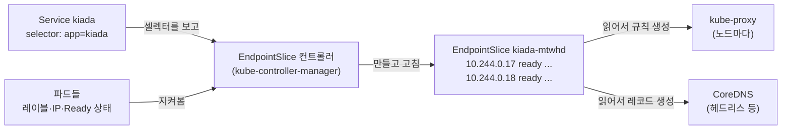
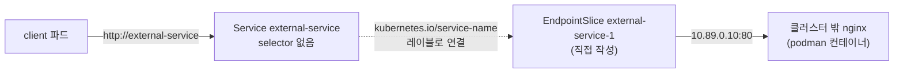

# 11.3 서비스 엔드포인트 관리하기

[11.1절](<11.1 서비스로 파드 노출하기.md>)에서 `kubectl describe svc`의 `Endpoints` 줄에 파드 IP가 나열되는 것을 봤습니다. 서비스 오브젝트 자체에는 이 목록이 없습니다. **"지금 트래픽을 받을 주소"는 별도의 오브젝트**에 따로 기록됩니다.

예전에는 **Endpoints**, 지금은 **EndpointSlice**가 그 역할을 합니다. 이 목록을 이해하면 서비스 문제의 절반은 풀립니다. 직접 써 넣으면 **클러스터 밖의 서버**도 서비스 뒤에 세울 수 있습니다.



## 11.3.1 Endpoints — 예전 방식이고 지금은 deprecated입니다

```bash
kubectl get endpoints
```

```
Warning: v1 Endpoints is deprecated in v1.33+; use discovery.k8s.io/v1 EndpointSlice
NAME    ENDPOINTS                                                        AGE
kiada   10.244.0.17:8080,10.244.0.18:8080,10.244.0.19:8080 + 1 more...   107s
quiz    10.244.0.23:8080                                                 6m
quote   10.244.0.13:80,10.244.0.14:80,10.244.0.15:80 + 1 more...         6m
```

첫 줄의 **경고**부터 눈에 띕니다. [1.2절](<../01장. 쿠버네티스 소개/1.2 쿠버네티스 이해하기.md>)에서 말한 Endpoints API deprecated가 이것입니다. 조회는 여전히 되지만 API 서버가 매번 경고를 돌려줍니다.

```bash
kubectl get endpoints kiada -o yaml
```

```
apiVersion: v1
kind: Endpoints
metadata:
  annotations:
    endpoints.kubernetes.io/last-change-trigger-time: "2026-10-05T09:32:45Z"
  creationTimestamp: "2026-10-05T09:32:45Z"
  labels:
    endpoints.kubernetes.io/managed-by: endpoint-controller
  name: kiada
  namespace: ch11
  ...
subsets:
- addresses:
  - ip: 10.244.0.17
    nodeName: kia-control-plane
    targetRef:
      kind: Pod
      name: kiada-001
      namespace: ch11
      uid: 07c3e9bb-acac-4f27-864c-025ce3801a99
  - ip: 10.244.0.18
    ...
  ports:
  - name: http
    port: 8080
    protocol: TCP
```

* 이름이 **서비스와 똑같습니다**(`kiada`). 서비스 하나에 Endpoints 하나입니다.
* `subsets[].addresses`에 파드 IP와 어느 파드인지(`targetRef`)가 들어 있습니다.
* `ports`의 8080은 서비스 포트(80)가 아니라 **실제로 연결할 파드 포트**입니다.

### 왜 바꿨을까요?

**Endpoints 하나에 모든 주소를 담는 구조**가 문제였습니다.

| 문제 | 설명 |
| :--- | :--- |
| **너무 커짐** | 파드가 수천 개면 오브젝트 하나가 거대해지고, 파드 하나만 바뀌어도 **전체를 다시 써서** 모든 노드에 보냄 |
| **1000개 제한** | 1000개를 넘으면 잘라 내고 `endpoints.kubernetes.io/over-capacity: truncated` 애노테이션을 붙임 |
| **듀얼스택 불가** | IPv4·IPv6를 함께 담지 못함 |
| **새 기능 정보 없음** | `trafficDistribution` 같은 기능에 필요한 정보가 없음 |

## 11.3.2 EndpointSlice — 주소 목록을 조각으로 나눕니다

```bash
kubectl get endpointslices
```

```
NAME          ADDRESSTYPE   PORTS   ENDPOINTS                                         AGE
kiada-mtwhd   IPv4          8080    10.244.0.17,10.244.0.19,10.244.0.18 + 1 more...   108s
quiz-f7kmz    IPv4          8080    10.244.0.23                                       6m1s
quote-tkb9t   IPv4          80      10.244.0.13,10.244.0.15,10.244.0.14 + 1 more...   6m1s
```

이름이 서비스 이름 뒤에 **무작위 접미사**가 붙은 꼴(`kiada-mtwhd`)입니다. 서비스 하나에 슬라이스가 **여러 개** 생길 수 있기 때문입니다. 기본으로 슬라이스 하나에 엔드포인트 **100개**까지 담고, 넘으면 새 슬라이스를 만듭니다(`--max-endpoints-per-slice`, 최대 1000). 주소 종류(`ADDRESSTYPE`)도 슬라이스마다 하나라서, 듀얼스택 서비스라면 IPv4 슬라이스와 IPv6 슬라이스가 따로 생깁니다.

> **이름으로 찾지 말고 레이블로 찾으세요.** 슬라이스 이름은 예측할 수 없습니다. 어느 서비스의 슬라이스인지는 **`kubernetes.io/service-name`** 레이블에 있습니다.
> ```bash
> kubectl get endpointslices -l kubernetes.io/service-name=kiada
> ```

### 안을 열어 보면 — 조건(conditions)이 핵심입니다

```bash
kubectl get endpointslice -l kubernetes.io/service-name=kiada -o yaml
```

```
- addressType: IPv4
  apiVersion: discovery.k8s.io/v1
  endpoints:
  - addresses:
    - 10.244.0.17
    conditions:
      ready: true
      serving: true
      terminating: false
    nodeName: kia-control-plane
    targetRef:
      kind: Pod
      name: kiada-001
      namespace: ch11
      uid: 07c3e9bb-acac-4f27-864c-025ce3801a99
  ...
  kind: EndpointSlice
  metadata:
    generateName: kiada-
    labels:
      endpointslice.kubernetes.io/managed-by: endpointslice-controller.k8s.io
      kubernetes.io/service-name: kiada
    name: kiada-mtwhd
    namespace: ch11
    ownerReferences:
    - apiVersion: v1
      blockOwnerDeletion: true
      controller: true
      kind: Service
      name: kiada
      uid: 6afb3159-7f33-49cf-8f52-c5ba0f8e366a
  ports:
  - name: http
    port: 8080
    protocol: TCP
```

Endpoints보다 정보가 많습니다.

| 필드 | 뜻 |
| :--- | :--- |
| **`conditions.serving`** | 이 엔드포인트가 응답할 수 있는가. 파드의 **Ready 조건**과 같음 |
| **`conditions.terminating`** | 종료 중인가. 파드에 삭제 시각이 찍히면 `true` |
| **`conditions.ready`** | **`serving`이면서 `terminating`이 아님**. 새 트래픽을 보낼 대상 |
| `nodeName`, `zone` | 어느 노드·영역에 있는가. [11.5절](<11.5 가까운 엔드포인트로 트래픽 보내기.md>)에서 씀 |
| `hints` | 어느 영역·노드의 클라이언트가 써야 하는가. [11.5절](<11.5 가까운 엔드포인트로 트래픽 보내기.md>) |
| `managed-by` 레이블 | 누가 관리하는가. 직접 만들 때는 다른 이름을 씀 |
| `ownerReferences` | 서비스를 지우면 슬라이스도 같이 지워짐 |

세 조건이 실제로 갈리는 모습은 [11.6절](<11.6 레디니스 프로브로 서비스 엔드포인트 관리하기.md>)에서 레디니스 프로브와 함께 봅니다.

`describe`로 보면 사람이 읽기 좋게 정리됩니다.

```bash
kubectl describe endpointslice -l kubernetes.io/service-name=kiada
```

```
Name:         kiada-mtwhd
Namespace:    ch11
Labels:       endpointslice.kubernetes.io/managed-by=endpointslice-controller.k8s.io
              kubernetes.io/service-name=kiada
Annotations:  endpoints.kubernetes.io/last-change-trigger-time: 2026-10-05T09:27:15Z
AddressType:  IPv4
Ports:
  Name  Port  Protocol
  ----  ----  --------
  http  8080  TCP
Endpoints:
  - Addresses:  10.244.0.17
    Conditions:
      Ready:    true
    Hostname:   <unset>
    TargetRef:  Pod/kiada-001
    NodeName:   kia-control-plane
    Zone:       <unset>
  ...
Events:         <none>
```

`Zone: <unset>` — kind 노드에는 영역 레이블이 없습니다. 11.5절에서 이것 때문에 생기는 일을 봅니다.

### 레이블을 떼면 목록에서 바로 빠집니다

컨트롤러는 파드를 계속 지켜보다가 셀렉터에 안 맞게 되면 즉시 슬라이스에서 뺍니다.

```bash
kubectl label pod kiada-canary app=kiada-off --overwrite
kubectl get endpointslices -l kubernetes.io/service-name=kiada
```

```
pod/kiada-canary labeled
```

```
NAME          ADDRESSTYPE   PORTS   ENDPOINTS                             AGE
kiada-mtwhd   IPv4          8080    10.244.0.17,10.244.0.19,10.244.0.18   2m4s
```

`10.244.0.20`(kiada-canary)이 빠졌습니다. 파드는 그대로 돌고 있지만 트래픽은 더 이상 받지 않습니다. 장애가 난 파드를 **지우지 않고 격리해서 조사할 때** 쓰는 기법입니다. 다시 붙이면 돌아옵니다.

```bash
kubectl label pod kiada-canary app=kiada --overwrite
```

> **서비스가 응답하지 않을 때 가장 먼저 볼 것이 엔드포인트입니다.**
> * `ENDPOINTS`가 비었다 → 셀렉터와 파드 레이블이 안 맞거나, 파드가 Ready가 아님
> * `PORTS`가 `<unset>` → `targetPort` 이름이 파드에 없음([11.1절](<11.1 서비스로 파드 노출하기.md>))
> * 둘 다 정상인데 안 된다 → 파드 자체나 네트워크 정책을 의심

## 11.3.3 엔드포인트를 직접 관리하기

셀렉터 없는 서비스를 만들면 컨트롤러가 슬라이스를 만들지 않습니다. 대신 **내가 직접** 써 넣을 수 있습니다. 클러스터 밖에 있는 DB나 레거시 서버를 클러스터 안의 파드가 **서비스 이름으로** 부르게 할 때 씁니다. 나중에 그 서버를 클러스터 안으로 옮기면 셀렉터만 추가하면 됩니다. 클라이언트는 고칠 것이 없습니다.

실습에서는 kind 노드 옆에 nginx 컨테이너를 하나 띄워 **클러스터 밖 서버**로 씁니다.

```bash
podman run -d --name ch11-external --network kind docker.io/library/nginx:alpine
podman inspect ch11-external --format "{{.NetworkSettings.Networks.kind.IPAddress}}"
```

```
10.89.0.10
```

### 1) 셀렉터 없는 서비스부터

**svc.external-service.yaml**

```yaml
apiVersion: v1
kind: Service
metadata:
  name: external-service
spec:
  ports:                    # selector 가 없음
  - name: http
    port: 80
```

```bash
kubectl apply -f svc.external-service.yaml
kubectl get endpointslices -l kubernetes.io/service-name=external-service
kubectl exec client -- curl -sS -m 5 external-service
```

```
No resources found in ch11 namespace.
```

```
curl: (7) Failed to connect to external-service port 80 after 1 ms: Could not connect to server
command terminated with exit code 7
```

슬라이스가 아예 없습니다. 클러스터 IP는 받았지만 보낼 곳이 없으니 거부됩니다.

### 2) EndpointSlice를 직접 만들기

**eps.external-service.yaml**

```yaml
apiVersion: discovery.k8s.io/v1
kind: EndpointSlice
metadata:
  name: external-service-1                            # 이름은 자유
  labels:
    kubernetes.io/service-name: external-service      # 필수. 이 레이블로 서비스와 연결
    endpointslice.kubernetes.io/managed-by: ch11-by-hand   # 컨트롤러와 구분되는 이름
addressType: IPv4
ports:
- name: http                                          # 서비스 포트 이름과 맞춤
  port: 80                                            # 실제로 연결할 포트
  protocol: TCP
endpoints:
- addresses:
  - 10.89.0.10                                        # 클러스터 밖 서버
```

```bash
kubectl apply -f eps.external-service.yaml
kubectl get endpointslices -l kubernetes.io/service-name=external-service
kubectl exec client -- curl -s -m 5 external-service | grep -i "<title>"
```

```
NAME                 ADDRESSTYPE   PORTS   ENDPOINTS    AGE
external-service-1   IPv4          80      10.89.0.10   3s
```

```
<title>Welcome to nginx!</title>
```

클러스터 안의 파드가 `external-service`라는 이름으로 **클러스터 밖 nginx**에 닿았습니다. `conditions`를 적지 않았는데도 동작한 것은, API 레퍼런스가 조건 값이 비어 있으면(nil) **`true`로 해석하라**고 정해 두었기 때문입니다.



### 일부러 실패시켜 보기 — `service-name` 레이블을 빼면

**eps.external-service-nolabel.yaml**

```yaml
apiVersion: v1
kind: Service
metadata:
  name: external-service2
spec:
  ports:
  - name: http
    port: 80
---
apiVersion: discovery.k8s.io/v1
kind: EndpointSlice
metadata:
  name: external-service2-1           # 이름은 서비스와 비슷하지만
addressType: IPv4                      # labels 가 없음
ports:
- name: http
  port: 80
endpoints:
- addresses:
  - 10.89.0.10
```

```bash
kubectl apply -f eps.external-service-nolabel.yaml
kubectl exec client -- curl -sS -m 5 external-service2
```

```
service/external-service2 created
endpointslice.discovery.k8s.io/external-service2-1 created
```

```
curl: (7) Failed to connect to external-service2 port 80 after 2 ms: Could not connect to server
command terminated with exit code 7
```

> **EndpointSlice는 이름이 아니라 레이블로 서비스를 찾습니다.** 둘 다 에러 없이 만들어지지만 연결이 안 됩니다. 이름을 서비스와 똑같이 지어도 마찬가지입니다. Endpoints는 **이름**으로, EndpointSlice는 **`kubernetes.io/service-name` 레이블**로 묶인다는 차이를 기억하세요.

### 3) 예전 방식 — Endpoints를 직접 쓰면 슬라이스로 복사됩니다

책 시절처럼 Endpoints를 직접 만들어도 아직 동작합니다.

**ep.external-legacy.yaml**

```yaml
apiVersion: v1
kind: Service
metadata:
  name: external-legacy
spec:
  ports:
  - name: http
    port: 80
---
apiVersion: v1
kind: Endpoints
metadata:
  name: external-legacy       # 서비스와 같은 이름이어야 함
subsets:
- addresses:
  - ip: 10.89.0.10
  ports:
  - name: http
    port: 80
```

```bash
kubectl apply -f ep.external-legacy.yaml
kubectl get endpointslices -l kubernetes.io/service-name=external-legacy --show-labels
kubectl exec client -- curl -s -m 5 external-legacy | grep -i "<title>"
```

```
service/external-legacy created
Warning: v1 Endpoints is deprecated in v1.33+; use discovery.k8s.io/v1 EndpointSlice
endpoints/external-legacy created
```

```
NAME                    ADDRESSTYPE   PORTS   ENDPOINTS    AGE   LABELS
external-legacy-m7t4x   IPv4          80      10.89.0.10   3s    endpointslice.kubernetes.io/managed-by=endpointslicemirroring-controller.k8s.io,kubernetes.io/service-name=external-legacy
```

```
<title>Welcome to nginx!</title>
```

`managed-by=endpointslicemirroring-controller.k8s.io` — **미러링 컨트롤러**가 손으로 쓴 Endpoints를 EndpointSlice로 복사해 줬습니다. kube-proxy는 이제 슬라이스만 읽으므로 이 복사 덕분에 동작합니다.

> **서비스를 지우면 직접 만든 Endpoints도 함께 사라졌습니다.** `kubectl delete -f ep.external-legacy.yaml`에서 서비스가 먼저 지워지자, 이어서 Endpoints를 지우려던 요청은 `endpoints "external-legacy" not found`로 끝났습니다. 컨트롤러가 짝 잃은 Endpoints를 정리했기 때문입니다. 새로 만든다면 처음부터 **EndpointSlice를 직접** 쓰세요.

### 외부 서버가 DNS 이름만 있다면

IP가 아니라 `db.example.com` 같은 이름만 있다면 엔드포인트를 쓸 필요도 없습니다. **ExternalName** 서비스로 DNS 수준에서 별칭을 겁니다. [11.4절](<11.4 서비스의 DNS 레코드 이해하기.md>)에서 다룹니다.

## 요약 및 비유

| 개념 | 택시 승강장 비유 | 기술적 의미 |
| :--- | :--- | :--- |
| **서비스** | "역 앞 택시 승강장" 표지판 | 고정된 접점 |
| **Endpoints** | 승강장 전체 대기 차량을 적은 칠판 한 장 | 서비스당 오브젝트 하나, 1000개 제한 (deprecated) |
| **EndpointSlice** | 칠판을 100대씩 나눈 여러 장의 배차표 | 조각난 목록, 바뀐 조각만 전송 |
| **`kubernetes.io/service-name`** | 배차표 상단의 "역 앞 승강장" 도장 | 슬라이스와 서비스를 잇는 레이블 |
| **`ready` / `serving` / `terminating`** | 손님 태움 가능 / 운행 중 / 퇴근 준비 중 | 엔드포인트 조건 |
| **레이블 떼기** | 차를 배차표에서만 지움 (차는 그대로) | 파드는 살아 있지만 트래픽 제외 |
| **셀렉터 없는 서비스 + 직접 쓴 슬라이스** | 협력 콜택시 회사 차량을 손으로 배차표에 적음 | 클러스터 밖 서버를 서비스 뒤에 |
| **미러링 컨트롤러** | 옛 칠판 내용을 새 배차표로 옮겨 적는 직원 | Endpoints → EndpointSlice 복사 |

## 결론

* 서비스의 "지금 보낼 주소"는 **EndpointSlice**에 따로 기록됩니다. kube-proxy와 DNS가 이것을 읽습니다.
* **Endpoints는 1.33부터 deprecated**입니다. 조회하면 경고가 뜨고, 1000개 제한·듀얼스택 불가 같은 한계가 있습니다.
* EndpointSlice는 기본 **100개씩** 조각나며, 이름이 무작위라 **`kubernetes.io/service-name` 레이블로** 찾습니다.
* 조건은 셋입니다. **`ready` = `serving`이면서 `terminating`이 아님**이고, 새 트래픽은 `ready`인 곳으로만 갑니다.
* 셀렉터 없는 서비스에 EndpointSlice를 직접 쓰면 **클러스터 밖 서버**도 서비스 이름으로 부를 수 있습니다. **레이블을 빠뜨리면 에러 없이 연결만 안 됩니다.**

## 공식 문서 업데이트 (2026년 10월 기준)

### 1) Endpoints API와 미러링이 1.33부터 deprecated입니다 (가장 큰 변화)

책은 Endpoints를 중심으로 설명하고 EndpointSlice를 덧붙였지만, 지금은 반대입니다. 공식 문서의 Endpoints 절과 EndpointSlice 미러링 절이 모두 **Deprecated since Kubernetes v1.33**으로 표기되어 있습니다. kube-proxy는 EndpointSlice만 읽습니다. 직접 만든 스크립트가 `kubectl get endpoints`에 기대고 있다면 `kubectl get endpointslices -l kubernetes.io/service-name=<이름>`으로 바꾸세요.

참고: <https://kubernetes.io/docs/concepts/services-networking/service/#endpoints>

### 2) `serving`·`terminating` 조건은 1.26부터 정식입니다

책 시절에는 `ready` 하나만 믿을 수 있었습니다. 지금은 세 조건이 모두 GA(1.26)라서, 종료 중인 파드를 구분해 처리하는 동작([11.6절](<11.6 레디니스 프로브로 서비스 엔드포인트 관리하기.md>))이 표준이 되었습니다.

참고: <https://kubernetes.io/docs/concepts/services-networking/endpoint-slices/>

## 출처

> 2026-10-05 공식 문서로 검증

* 원서: *Kubernetes in Action, Second Edition* 11장 — <https://livebook.manning.com/book/kubernetes-in-action-second-edition/>
* [EndpointSlices](https://kubernetes.io/docs/concepts/services-networking/endpoint-slices/) — Kubernetes 공식 문서
* [EndpointSlice](https://kubernetes.io/docs/reference/kubernetes-api/service-resources/endpoint-slice-v1/) — Kubernetes API 레퍼런스
* [Service](https://kubernetes.io/docs/concepts/services-networking/service/) — Kubernetes 공식 문서
* [Kubernetes v1.33: Continuing the transition from Endpoints to EndpointSlices](https://kubernetes.io/blog/2025/04/24/endpoints-deprecation/) — Kubernetes 공식 블로그
