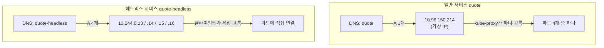
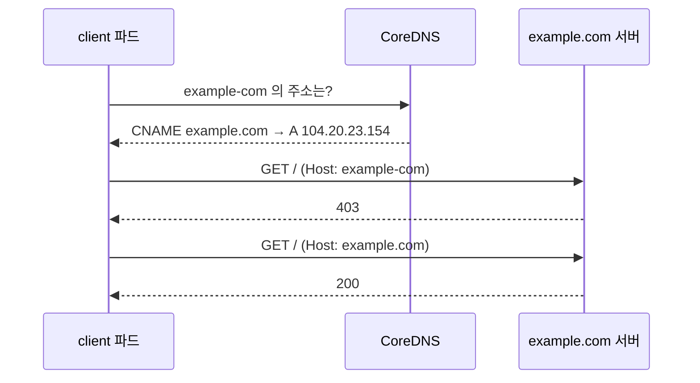

# 11.4 서비스의 DNS 레코드 이해하기

[11.1절](<11.1 서비스로 파드 노출하기.md>)에서 `curl quote`처럼 서비스 이름만으로 접속했습니다. 그 뒤에서 일하는 것이 클러스터 DNS(CoreDNS)입니다. 이번 절에서는 **DNS가 서비스마다 어떤 레코드를 만들어 두는지** 직접 조회해 봅니다.

레코드 종류를 알면 할 수 있는 일이 늘어납니다. **클러스터 IP 없이 파드 IP를 바로 받는 헤드리스 서비스**, **외부 도메인에 별칭을 거는 ExternalName 서비스**가 모두 DNS 레코드의 변형입니다.

## 조회 도구부터 — busybox의 nslookup은 헷갈립니다

먼저 busybox로 조회해 봅니다.

```bash
kubectl exec bb -- nslookup quote
```

```
Server:		10.96.0.10
Address:	10.96.0.10:53

Name:	quote.ch11.svc.cluster.local
Address: 10.96.150.214

** server can't find quote.svc.cluster.local: NXDOMAIN


** server can't find quote.cluster.local: NXDOMAIN

** server can't find quote.svc.cluster.local: NXDOMAIN

** server can't find quote.cluster.local: NXDOMAIN

** server can't find quote.dns.podman: NXDOMAIN

** server can't find quote.dns.podman: NXDOMAIN

command terminated with exit code 1
```

답은 맞게 받았는데(`10.96.150.214`), 검색 목록의 나머지 후보까지 모두 물어보고 실패를 늘어놓은 뒤 **종료 코드 1**로 끝납니다. `quote.ch11`은 아예 못 찾았습니다.

```bash
kubectl exec bb -- nslookup quote.ch11
```

```
Server:		10.96.0.10
Address:	10.96.0.10:53

** server can't find quote.ch11: NXDOMAIN

** server can't find quote.ch11: NXDOMAIN

command terminated with exit code 1
```

> **busybox의 nslookup 결과로 DNS 고장을 판단하지 마세요.** 같은 이름을 [11.1절](<11.1 서비스로 파드 노출하기.md>)의 `curl quote.ch11`은 잘 찾았습니다. busybox의 nslookup은 검색 목록을 다루는 방식이 일반 리졸버와 달라 이런 결과가 나옵니다. **완전한 이름(FQDN)** 을 쓰거나, `dig`가 들어 있는 이미지를 쓰세요. 여기서는 쿠버네티스 e2e 테스트용 `jessie-dnsutils` 이미지를 썼습니다. 공식 DNS 디버깅 가이드는 같은 이름(`dnsutils`)의 파드를 `registry.k8s.io/e2e-test-images/agnhost:2.39` 이미지로 띄웁니다.

```bash
kubectl run dnsutils --image=registry.k8s.io/e2e-test-images/jessie-dnsutils:1.3 \
  --restart=Never --command -- sleep infinity
kubectl exec dnsutils -- nslookup quote
```

```
Server:		10.96.0.10
Address:	10.96.0.10#53

Name:	quote.ch11.svc.cluster.local
Address: 10.96.150.214
```

깔끔합니다. 이제부터는 `dnsutils`의 `dig`로 레코드를 하나씩 봅니다.

## 11.4.1 A 레코드와 SRV 레코드

### A 레코드 — 이름 → 클러스터 IP

```bash
kubectl exec dnsutils -- dig +noall +answer quote.ch11.svc.cluster.local
```

```
quote.ch11.svc.cluster.local. 30 IN	A	10.96.150.214
```

일반 서비스는 **`<서비스>.<네임스페이스>.svc.<클러스터 도메인>`** 에 A 레코드(IPv6면 AAAA) 하나를 갖고, 값은 **클러스터 IP**입니다. `30`은 캐시해도 되는 시간(TTL, 초)입니다.

거꾸로 IP로 이름을 찾는 PTR 레코드도 있습니다.

```bash
kubectl exec dnsutils -- dig +noall +answer -x 10.96.150.214
```

```
214.150.96.10.in-addr.arpa. 30	IN	PTR	quote.ch11.svc.cluster.local.
```

### SRV 레코드 — 포트 번호까지 알려 줍니다

A 레코드는 IP만 줍니다. 포트는 클라이언트가 알아서 붙여야 합니다. **SRV 레코드**는 이름 붙은 포트마다 만들어져 **포트 번호까지** 돌려줍니다. 이름 형식은 **`_<포트 이름>._<프로토콜>.<서비스>.<네임스페이스>.svc.<클러스터 도메인>`** 입니다.

```bash
kubectl exec dnsutils -- dig +noall +answer SRV _http._tcp.quote.ch11.svc.cluster.local
```

```
_http._tcp.quote.ch11.svc.cluster.local. 30 IN SRV 0 100 80 quote.ch11.svc.cluster.local.
```

`0 100 80 quote...` 은 차례로 **우선순위, 가중치, 포트, 대상 이름**입니다. "quote 서비스의 http 포트는 80"이라는 정보를 DNS만으로 얻었습니다.

```bash
kubectl exec bb -- nslookup -type=SRV _http._tcp.quote.ch11.svc.cluster.local
```

```
Server:		10.96.0.10
Address:	10.96.0.10:53

_http._tcp.quote.ch11.svc.cluster.local	service = 0 100 80 quote.ch11.svc.cluster.local
```

FQDN을 주면 busybox도 잘 답합니다.

> **포트에 이름이 없으면 SRV 레코드도 없습니다.** [11.1절](<11.1 서비스로 파드 노출하기.md>)에서 포트 이름을 붙이라고 한 이유가 하나 더 생겼습니다. 없는 포트 이름(`_https`)으로 물으면 이렇습니다.
> ```bash
> kubectl exec dnsutils -- dig SRV _https._tcp.quote.ch11.svc.cluster.local | grep status
> ```
> ```
> ;; ->>HEADER<<- opcode: QUERY, status: NXDOMAIN, id: 50073
> ```

### 없는 이름은 NXDOMAIN

```bash
kubectl exec dnsutils -- nslookup nosuchsvc
```

```
Server:		10.96.0.10
Address:	10.96.0.10#53

** server can't find nosuchsvc: NXDOMAIN

command terminated with exit code 1
```

`NXDOMAIN`은 "그런 이름 없음"입니다. 서비스 이름 오타이거나, **다른 네임스페이스의 서비스를 짧은 이름으로** 부른 경우가 대부분입니다. 다른 네임스페이스라면 `quote.ch11`처럼 네임스페이스를 붙입니다.

### 파드에도 IP 기반 이름이 있습니다

```bash
kubectl exec dnsutils -- dig +noall +answer 10-244-0-13.ch11.pod.cluster.local
```

```
10-244-0-13.ch11.pod.cluster.local. 30 IN A	10.244.0.13
```

IP의 점을 줄표로 바꾼 이름입니다. IP를 알아야 이름을 만들 수 있으니 쓸모는 적습니다. 공식 문서도 이 형식은 **예전 kube-dns 시절의 방식**이라고 소개합니다.

### `ndots:5`가 하는 일

파드의 `/etc/resolv.conf`에는 `options ndots:5`가 있었습니다. **점이 5개보다 적은 이름은 먼저 `search` 목록을 붙여서** 찾아본다는 뜻입니다. 그래서 `quote`가 `quote.ch11.svc.cluster.local`로 늘어납니다.

> **외부 도메인을 자주 부르는 앱은 끝에 점을 찍으면 빨라집니다.** `api.example.com`은 점이 2개라 `api.example.com.ch11.svc.cluster.local` 같은 후보를 먼저 다 물어본 뒤에야 진짜 이름을 찾습니다. `api.example.com.`처럼 **마지막에 점**을 찍으면 완전한 이름으로 취급해 바로 찾습니다.

## 11.4.2 헤드리스 서비스 — 클러스터 IP 대신 파드 IP를 돌려줍니다

클러스터 IP는 "아무 파드 하나"에 보내 줍니다. 그런데 클라이언트가 **파드 목록 전체를 알고 싶을 때**가 있습니다. 모든 파드에 연결을 하나씩 맺거나, 데이터베이스 클러스터처럼 특정 구성원을 골라야 할 때입니다.

`clusterIP: None`으로 만들면 **헤드리스(Headless) 서비스**가 됩니다.

**svc.quote-headless.yaml**

```yaml
apiVersion: v1
kind: Service
metadata:
  name: quote-headless
spec:
  clusterIP: None           # 클러스터 IP를 받지 않음
  selector:
    app: quote
  ports:
  - name: http
    port: 80
    targetPort: 80
    protocol: TCP
```

```bash
kubectl apply -f svc.quote-headless.yaml
kubectl get svc quote-headless
```

```
NAME             TYPE        CLUSTER-IP   EXTERNAL-IP   PORT(S)   AGE
quote-headless   ClusterIP   None         <none>        80/TCP    24s
```

```bash
kubectl exec dnsutils -- nslookup quote-headless
```

```
Server:		10.96.0.10
Address:	10.96.0.10#53

Name:	quote-headless.ch11.svc.cluster.local
Address: 10.244.0.13
Name:	quote-headless.ch11.svc.cluster.local
Address: 10.244.0.14
Name:	quote-headless.ch11.svc.cluster.local
Address: 10.244.0.16
Name:	quote-headless.ch11.svc.cluster.local
Address: 10.244.0.15
```

A 레코드가 **파드 수만큼** 나옵니다. 값은 파드 IP입니다.



헤드리스 서비스의 SRV 레코드는 **파드마다 하나씩** 나오고, 대상 이름도 파드별로 따로 생깁니다.

```bash
kubectl exec dnsutils -- dig +noall +answer +additional SRV _http._tcp.quote-headless.ch11.svc.cluster.local
```

```
_http._tcp.quote-headless.ch11.svc.cluster.local. 30 IN	SRV 0 25 80 10-244-0-16.quote-headless.ch11.svc.cluster.local.
_http._tcp.quote-headless.ch11.svc.cluster.local. 30 IN	SRV 0 25 80 10-244-0-14.quote-headless.ch11.svc.cluster.local.
_http._tcp.quote-headless.ch11.svc.cluster.local. 30 IN	SRV 0 25 80 10-244-0-13.quote-headless.ch11.svc.cluster.local.
_http._tcp.quote-headless.ch11.svc.cluster.local. 30 IN	SRV 0 25 80 10-244-0-15.quote-headless.ch11.svc.cluster.local.
10-244-0-14.quote-headless.ch11.svc.cluster.local. 30 IN A 10.244.0.14
10-244-0-16.quote-headless.ch11.svc.cluster.local. 30 IN A 10.244.0.16
10-244-0-13.quote-headless.ch11.svc.cluster.local. 30 IN A 10.244.0.13
10-244-0-15.quote-headless.ch11.svc.cluster.local. 30 IN A 10.244.0.15
```

가중치가 `25`인 것은 4개가 100을 나눠 가졌기 때문입니다. 일반 서비스는 대상이 하나라 `100`이었습니다.

헤드리스 서비스로도 `curl`은 그대로 됩니다. 클라이언트가 받은 IP 중 하나로 **직접** 연결합니다.

```bash
kubectl exec client -- curl -s quote-headless
```

```
This is the quote service running in pod quote-003 on node kia-control-plane
```

> **헤드리스 서비스는 kube-proxy를 거치지 않습니다.** 부하 분산은 오롯이 클라이언트 몫입니다. 많은 클라이언트가 **DNS 응답의 첫 IP만** 쓰거나 응답을 오래 캐시하므로, 파드에 고르게 나뉜다고 기대하면 안 됩니다. 공식 문서도 클라이언트가 "목록 전체를 쓰거나 라운드 로빈으로 고르라"고 적고 있습니다.

### 파드에 고정된 이름 주기 — `hostname`과 `subdomain`

파드 IP 기반 이름(`10-244-0-13...`)은 파드가 다시 뜨면 바뀝니다. 파드에 **`subdomain`을 헤드리스 서비스 이름과 같게** 주고 `hostname`을 정하면, `<hostname>.<subdomain>.<네임스페이스>.svc.<도메인>` 이름이 생깁니다. 16장의 스테이트풀셋이 이 구조를 씁니다.

**pods.quote-with-hostname-subdomain.yaml** (일부)

```yaml
apiVersion: v1
kind: Pod
metadata:
  name: quote1-with-hostname
  labels:
    app: quote
spec:
  hostname: quote1-hostname       # 이름만
  subdomain: quote-headless       # 헤드리스 서비스 이름과 같게
  ...
---
apiVersion: v1
kind: Pod
metadata:
  name: quote2-with-subdomain
spec:
  subdomain: quote-headless       # hostname 없음
  ...
---
apiVersion: v1
kind: Pod
metadata:
  name: quote3-with-hostname-subdomain
spec:
  hostname: quote3-hostname
  subdomain: quote-headless
  ...
```

```bash
kubectl apply -f pods.quote-with-hostname-subdomain.yaml
kubectl exec dnsutils -- dig +noall +answer quote1-hostname.quote-headless.ch11.svc.cluster.local
kubectl exec dnsutils -- dig +noall +answer quote3-hostname.quote-headless.ch11.svc.cluster.local
kubectl exec dnsutils -- dig +noall +answer quote2-with-subdomain.quote-headless.ch11.svc.cluster.local
```

```
quote1-hostname.quote-headless.ch11.svc.cluster.local. 30 IN A 10.244.0.69
```

```
quote3-hostname.quote-headless.ch11.svc.cluster.local. 30 IN A 10.244.0.71
```

세 번째 명령(quote2)은 아무것도 출력하지 않았습니다.

`hostname`을 준 두 파드는 이름이 생겼고, **`hostname` 없이 `subdomain`만 준 quote2는 이름이 생기지 않았습니다.** SRV 레코드에서 차이가 더 잘 보입니다.

```bash
kubectl exec dnsutils -- dig SRV _http._tcp.quote-headless.ch11.svc.cluster.local +noall +answer
```

```
_http._tcp.quote-headless.ch11.svc.cluster.local. 30 IN	SRV 0 14 80 10-244-0-16.quote-headless.ch11.svc.cluster.local.
_http._tcp.quote-headless.ch11.svc.cluster.local. 30 IN	SRV 0 14 80 10-244-0-14.quote-headless.ch11.svc.cluster.local.
_http._tcp.quote-headless.ch11.svc.cluster.local. 30 IN	SRV 0 14 80 10-244-0-13.quote-headless.ch11.svc.cluster.local.
_http._tcp.quote-headless.ch11.svc.cluster.local. 30 IN	SRV 0 14 80 10-244-0-15.quote-headless.ch11.svc.cluster.local.
_http._tcp.quote-headless.ch11.svc.cluster.local. 30 IN	SRV 0 14 80 quote1-hostname.quote-headless.ch11.svc.cluster.local.
_http._tcp.quote-headless.ch11.svc.cluster.local. 30 IN	SRV 0 14 80 10-244-0-70.quote-headless.ch11.svc.cluster.local.
_http._tcp.quote-headless.ch11.svc.cluster.local. 30 IN	SRV 0 14 80 quote3-hostname.quote-headless.ch11.svc.cluster.local.
```

quote1과 quote3는 **자기 hostname**으로, quote2는 **IP 기반 이름**(`10-244-0-70`)으로 나옵니다. 공식 문서도 "hostname 없이 subdomain만 주면 파드 이름으로는 레코드가 생기지 않는다"고 적고 있습니다.

파드 안에서도 자기 이름이 바뀐 것이 보입니다.

```bash
kubectl exec quote3-with-hostname-subdomain -c nginx -- sh -c "hostname; hostname -f; cat /etc/hosts | tail -2"
```

```
quote3-hostname
quote3-hostname.quote-headless.ch11.svc.cluster.local
fe00::2	ip6-allrouters
10.244.0.71	quote3-hostname.quote-headless.ch11.svc.cluster.local	quote3-hostname
```

> **Ready가 아닌 파드는 이 레코드에서 빠집니다.** 공식 문서에 따르면 파드 레코드가 생기려면 파드가 Ready여야 합니다. 서비스에 `publishNotReadyAddresses: true`를 주면 예외입니다([11.6절](<11.6 레디니스 프로브로 서비스 엔드포인트 관리하기.md>)).

### 셀렉터 없는 헤드리스 서비스 — 외부 IP를 DNS로

[11.3절](<11.3 서비스 엔드포인트 관리하기.md>)의 "셀렉터 없는 서비스 + 직접 쓴 EndpointSlice"를 헤드리스로 만들면, DNS가 **클러스터 밖 서버의 IP를 그대로** 돌려줍니다.

**svc.external-service-headless.yaml**

```yaml
apiVersion: v1
kind: Service
metadata:
  name: external-service-headless
spec:
  clusterIP: None
  ports:
  - name: http
    port: 80
---
apiVersion: discovery.k8s.io/v1
kind: EndpointSlice
metadata:
  name: external-service-headless-1
  labels:
    kubernetes.io/service-name: external-service-headless
    endpointslice.kubernetes.io/managed-by: ch11-by-hand
addressType: IPv4
ports:
- name: http
  port: 80
endpoints:
- addresses:
  - 10.89.0.10              # 클러스터 밖 nginx
```

```bash
kubectl apply -f svc.external-service-headless.yaml
kubectl exec dnsutils -- dig +noall +answer external-service-headless.ch11.svc.cluster.local
kubectl exec dnsutils -- dig +noall +answer external-service.ch11.svc.cluster.local
```

```
external-service-headless.ch11.svc.cluster.local. 30 IN	A 10.89.0.10
```

```
external-service.ch11.svc.cluster.local. 30 IN A 10.96.78.41
```

헤드리스는 외부 IP(`10.89.0.10`)를, 일반 서비스(`external-service`)는 클러스터 IP(`10.96.78.41`)를 돌려줍니다.

## ExternalName 서비스 — 외부 도메인에 별칭을 겁니다

외부 서버가 IP가 아니라 **도메인 이름**만 있다면, 엔드포인트 없이 DNS **CNAME** 하나로 해결합니다.

**svc.time-api.yaml** (원서 예제)

```yaml
apiVersion: v1
kind: Service
metadata:
  name: time-api
spec:
  type: ExternalName
  externalName: worldtimeapi.org     # 이 이름의 별칭이 됨
```

```bash
kubectl apply -f svc.time-api.yaml
kubectl get svc time-api
kubectl exec dnsutils -- dig +noall +answer time-api.ch11.svc.cluster.local
```

```
NAME       TYPE           CLUSTER-IP   EXTERNAL-IP        PORT(S)   AGE
time-api   ExternalName   <none>       worldtimeapi.org   <none>    37s
```

```
time-api.ch11.svc.cluster.local. 30 IN	CNAME	worldtimeapi.org.
worldtimeapi.org.	30	IN	A	213.188.196.246
```

**클러스터 IP도 포트도 없습니다.** DNS가 "time-api는 worldtimeapi.org의 다른 이름"이라고 알려 줄 뿐, kube-proxy는 아무것도 하지 않습니다.

> **실측 당시 worldtimeapi.org는 연결이 끊겼습니다.** `curl http://time-api/...`와 `curl http://worldtimeapi.org/...` 모두 `Recv failure: Connection reset by peer`였습니다. 서비스 문제가 아니라 상대 서버 쪽 문제라, 아래 실습은 `example.com`으로 바꿔 진행합니다.

### 일부러 실패시켜 보기 — HTTP와 HTTPS는 이름이 어긋납니다

**svc.example-com.yaml**

```yaml
apiVersion: v1
kind: Service
metadata:
  name: example-com
spec:
  type: ExternalName
  externalName: example.com
```

```bash
kubectl apply -f svc.example-com.yaml
kubectl exec dnsutils -- dig +noall +answer example-com.ch11.svc.cluster.local
```

```
example-com.ch11.svc.cluster.local. 5 IN CNAME	example.com.
example.com.		5	IN	A	104.20.23.154
example.com.		5	IN	A	172.66.147.243
```

DNS는 잘 풀립니다. 그런데 HTTP로 보내면 이렇습니다.

```bash
kubectl exec client -- curl -sS -m 10 -o /dev/null -w "%{http_code}\n" http://example-com/
kubectl exec client -- curl -sS -m 10 -o /dev/null -w "%{http_code}\n" -H "Host: example.com" http://example-com/
kubectl exec client -- curl -sS -m 10 -o /dev/null -w "%{http_code}\n" https://example-com/
```

```
403
```

```
200
```

```
000
curl: (35) TLS connect error: error:0A000410:SSL routines::ssl/tls alert handshake failure
command terminated with exit code 35
```

| 요청 | 결과 | 이유 |
| :--- | :--- | :--- |
| `http://example-com/` | **403** | `Host: example-com` 헤더를 상대 서버가 모름 |
| `Host: example.com` 헤더를 직접 지정 | **200** | 상대가 아는 이름으로 보냄 |
| `https://example-com/` | **TLS 실패** | 인증서·SNI가 `example.com`용이라 이름이 안 맞음 |



> **ExternalName은 DNS만 바꿉니다.** 클라이언트는 여전히 `example-com`이라는 이름으로 요청하고, HTTP의 `Host` 헤더와 TLS의 SNI에도 그 이름이 들어갑니다. 공식 문서도 HTTP·HTTPS에서 이 문제를 경고합니다. 외부 HTTP API에 쓰려면 앱에서 Host를 맞추거나, 이름이 같아도 되는 TCP 프로토콜(DB 등)에 쓰는 것이 안전합니다.

## 파드의 DNS 설정을 직접 바꾸기 — `dnsConfig`

필요하면 파드마다 네임서버·검색 목록·옵션을 덧붙일 수 있습니다.

**pod-with-dns-config.yaml**

```yaml
apiVersion: v1
kind: Pod
metadata:
  name: pod-with-dns-config
spec:
  dnsConfig:
    nameservers:
    - 1.1.1.1                 # 추가 네임서버
    options:
    - name: custom-option
      value: foo
    searches:
    - search1                 # 검색 목록에 추가
    - search2
  containers:
  - name: sleep
    image: docker.io/library/busybox:1.37
    command:
    - sleep
    - infinity
```

```bash
kubectl apply -f pod-with-dns-config.yaml
kubectl exec pod-with-dns-config -- cat /etc/resolv.conf
```

```
search ch11.svc.cluster.local svc.cluster.local cluster.local dns.podman search1 search2
nameserver 10.96.0.10
nameserver 1.1.1.1
options ndots:5 custom-option:foo
```

기본값 **뒤에 덧붙었습니다.** 기본 설정을 아예 버리려면 `dnsPolicy: None`과 함께 써야 합니다.

## 요약 및 비유

| 레코드·기능 | 114 전화번호 안내 비유 | 기술적 의미 |
| :--- | :--- | :--- |
| **A 레코드** | "quote 회사 대표번호요?" → 번호 하나 | 서비스 이름 → 클러스터 IP |
| **SRV 레코드** | "quote 회사 상담 창구 내선은?" → 내선 번호까지 | 이름 붙은 포트 → 포트 번호 + 대상 이름 |
| **NXDOMAIN** | "그런 회사 없습니다" | 이름 없음. 오타·네임스페이스 확인 |
| **헤드리스 서비스** | 대표번호 대신 직원 직통번호 목록을 불러 줌 | A 레코드가 파드 수만큼 |
| **`hostname` + `subdomain`** | 직원 실명으로 직통번호 등록 | `quote1-hostname.quote-headless...` |
| **ExternalName** | "그 회사는 다른 회사 번호로 돌려 드립니다" | CNAME. 클러스터 IP·포트 없음 |
| **Host 헤더 403** | 전화는 연결됐는데 상대가 "누구 찾으세요?" | 요청 이름과 서버 이름이 다름 |
| **`ndots:5`** | 짧게 말하면 지역번호부터 붙여 찾아봄 | 점이 적은 이름은 search 목록 먼저 |
| **busybox nslookup** | 안내원이 답해 놓고 "못 찾았다"를 여러 번 덧붙임 | 결과를 오해하기 쉬운 도구 |

## 결론

* 일반 서비스는 **A 레코드 하나(클러스터 IP)**, 이름 붙은 포트마다 **SRV 레코드(포트 번호 포함)** 를 갖습니다. **포트 이름이 없으면 SRV도 없습니다.**
* **헤드리스 서비스**(`clusterIP: None`)는 파드 IP를 A 레코드로 모두 돌려줍니다. kube-proxy를 거치지 않으므로 **부하 분산은 클라이언트 몫**입니다.
* 파드에 `hostname`과 헤드리스 서비스 이름의 `subdomain`을 주면 고정된 DNS 이름이 생깁니다. **`hostname` 없이 `subdomain`만으로는 이름이 생기지 않습니다.**
* **ExternalName**은 CNAME일 뿐이라 **HTTP `Host`·TLS SNI가 어긋나** 403이나 TLS 실패가 납니다.
* DNS를 확인할 때는 **busybox의 nslookup을 믿지 말고** `dnsutils`의 `dig`나 FQDN을 씁니다.

## 출처

> 2026-10-05 공식 문서로 검증

* 원서: *Kubernetes in Action, Second Edition* 11장 — <https://livebook.manning.com/book/kubernetes-in-action-second-edition/>
* [DNS for Services and Pods](https://kubernetes.io/docs/concepts/services-networking/dns-pod-service/) — Kubernetes 공식 문서
* [Service](https://kubernetes.io/docs/concepts/services-networking/service/) — Kubernetes 공식 문서
* [Debugging DNS Resolution](https://kubernetes.io/docs/tasks/administer-cluster/dns-debugging-resolution/) — Kubernetes 공식 문서
