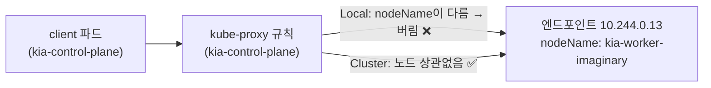
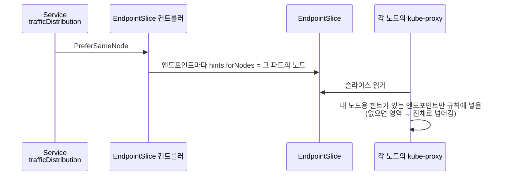

# 11.5 가까운 엔드포인트로 트래픽 보내기

> 원서의 이 절 제목은 확인하지 못해 내용 기준으로 이름을 붙였습니다.

지금까지 서비스는 엔드포인트 중 **아무 곳**으로나 트래픽을 보냈습니다. 노드가 여러 대, 영역(zone)이 여러 개인 클러스터에서는 이것이 손해입니다. 바로 옆 노드에 파드가 있는데 다른 영역의 파드로 보내면 **지연이 늘고, 클라우드에서는 영역 간 전송 요금**까지 붙습니다.

쿠버네티스는 "가까운 곳으로" 보내는 방법을 세 가지 줍니다. **강제하는 `internalTrafficPolicy`**, **선호만 하는 `trafficDistribution`**, 그리고 예전 방식인 **토폴로지 인지 라우팅(애노테이션)** 입니다.

| 방법 | 성격 | 가까운 곳이 없으면 |
| :--- | :--- | :--- |
| **`internalTrafficPolicy: Local`** | 같은 **노드**만. 강제 | **버림** |
| **`trafficDistribution: PreferSameNode`** | 같은 노드를 선호 | 같은 영역 → 클러스터 전체로 넘어감 |
| **`trafficDistribution: PreferSameZone`** | 같은 영역을 선호 | 클러스터 전체로 넘어감 |
| **`service.kubernetes.io/topology-mode: Auto`** | 영역별 CPU 비율로 배분 | 조건이 안 맞으면 기능 자체를 끔 |

> **단일 노드 클러스터의 한계.** 실습 클러스터는 노드가 하나라 "가까운 파드"와 "먼 파드"가 따로 없습니다. 그래서 이 절에서는 **동작의 근거가 되는 데이터(EndpointSlice의 `nodeName`·`hints`)** 와 **설정이 받아들여지는지**를 실측하고, 먼 노드의 파드는 EndpointSlice에 **가상의 노드 이름**을 적어 흉내 냅니다.

## `internalTrafficPolicy: Local` — 같은 노드의 파드에만 보냅니다

[11.2절](<11.2 서비스를 클러스터 밖으로 노출하기.md>)의 `externalTrafficPolicy`가 **외부에서 들어온** 트래픽용이었다면, `internalTrafficPolicy`는 **클러스터 안에서 클러스터 IP로** 보내는 트래픽용입니다. 값은 `Cluster`(기본)와 `Local` 둘입니다.

**svc.quote-local.yaml**

```yaml
apiVersion: v1
kind: Service
metadata:
  name: quote-local
spec:
  internalTrafficPolicy: Local    # 요청한 파드와 같은 노드의 엔드포인트만
  selector:
    app: quote
  ports:
  - name: http
    port: 80
    targetPort: 80
    protocol: TCP
```

```bash
kubectl apply -f svc.quote-local.yaml
kubectl get svc quote-local -o jsonpath="{.spec.internalTrafficPolicy}"
for i in 1 2 3; do kubectl exec client -- curl -s quote-local; done
```

```
Local
```

```
This is the quote service running in pod quote-003 on node kia-control-plane
This is the quote service running in pod quote-001 on node kia-control-plane
This is the quote service running in pod quote3-hostname on node kia-control-plane
```

모든 파드가 `kia-control-plane`에 있으니 평소처럼 동작합니다. 판단 근거는 EndpointSlice의 **`nodeName`** 입니다. kube-proxy는 자기 노드 이름과 같은 엔드포인트만 남깁니다.

### 일부러 실패시켜 보기 — 같은 노드에 엔드포인트가 없으면

다른 노드에만 파드가 있는 상황을 만들어 봅니다. 셀렉터 없는 서비스에 EndpointSlice를 직접 쓰되([11.3절](<11.3 서비스 엔드포인트 관리하기.md>)), 실제로는 이 노드에 있는 quote-001의 IP에 **존재하지 않는 노드 이름**을 적습니다.

**svc.quote-remote.yaml**

```yaml
apiVersion: v1
kind: Service
metadata:
  name: quote-remote
spec:
  internalTrafficPolicy: Local
  ports:
  - name: http
    port: 80
---
apiVersion: discovery.k8s.io/v1
kind: EndpointSlice
metadata:
  name: quote-remote-1
  labels:
    kubernetes.io/service-name: quote-remote
    endpointslice.kubernetes.io/managed-by: ch11-by-hand
addressType: IPv4
ports:
- name: http
  port: 80
endpoints:
- addresses:
  - 10.244.0.13                     # 실제로는 이 노드의 quote-001
  nodeName: kia-worker-imaginary    # kube-proxy에게는 "다른 노드의 파드"로 보임
```

```bash
kubectl apply -f svc.quote-remote.yaml
kubectl exec client -- curl -sS -m 5 quote-remote
```

```
curl: (28) Connection timed out after 5002 milliseconds
command terminated with exit code 28
```

`Cluster`로 바꾸면 같은 엔드포인트로 바로 닿습니다.

```bash
kubectl patch svc quote-remote -p '{"spec":{"internalTrafficPolicy":"Cluster"}}'
kubectl exec client -- curl -sS -m 5 quote-remote
```

```
service/quote-remote patched
```

```
This is the quote service running in pod quote-001 on node kia-control-plane
```



> **`Local`에서 갈 곳이 없으면 거부가 아니라 "버림"입니다.** 공식 문서 표현대로 kube-proxy가 트래픽을 **drop**합니다. 그래서 [11.1절](<11.1 서비스로 파드 노출하기.md>)의 "엔드포인트가 아예 없는" 경우(1 ms 만에 거부)와 달리, 클라이언트는 **시간 초과까지 기다립니다.** 원인 찾기가 더 어려우니, `Local`은 **모든 노드에 파드가 있다고 보장될 때만** 씁니다. 노드마다 하나씩 도는 로깅·모니터링 에이전트(17장의 데몬셋)에 보낼 때가 대표적입니다.

## `trafficDistribution` — 가까운 곳을 "선호"합니다

`internalTrafficPolicy: Local`은 너무 엄격합니다. 대부분은 "가까우면 좋고, 없으면 먼 곳이라도"를 원합니다. 그것이 **`spec.trafficDistribution`** 입니다. 1.37에서 받는 값은 셋입니다.

| 값 | 뜻 |
| :--- | :--- |
| **`PreferSameZone`** | 같은 영역의 엔드포인트를 선호. 없으면 클러스터 전체 |
| **`PreferSameNode`** | 같은 노드를 선호. 없으면 같은 영역, 그것도 없으면 클러스터 전체 |
| `PreferClose` | `PreferSameZone`의 예전 이름. **deprecated** |

**svc.quote-prefer-same-node.yaml**

```yaml
apiVersion: v1
kind: Service
metadata:
  name: quote-same-node
spec:
  trafficDistribution: PreferSameNode
  selector:
    app: quote
    rel: stable
  ports:
  - name: http
    port: 80
```

```bash
kubectl apply -f svc.quote-prefer-same-node.yaml
kubectl get endpointslice -l kubernetes.io/service-name=quote-same-node -o jsonpath="{.items[0].endpoints[0]}"
```

```
{"addresses":["10.244.0.15"],"conditions":{"ready":true,"serving":true,"terminating":false},"hints":{"forNodes":[{"name":"kia-control-plane"}]},"nodeName":"kia-control-plane","targetRef":{"kind":"Pod","name":"quote-003","namespace":"ch11","uid":"3d5a550f-1307-45df-a517-bbed0e75053a"}}
```

**`hints.forNodes`** 가 생겼습니다. EndpointSlice 컨트롤러가 "이 엔드포인트는 `kia-control-plane` 노드의 클라이언트가 쓰라"고 적어 두고, kube-proxy가 이 힌트를 보고 규칙을 만듭니다. 이 서비스의 엔드포인트 6개 모두에 같은 힌트가 붙었습니다.



예전 이름 `PreferClose`를 쓰면 경고가 나고, **힌트가 아예 생기지 않았습니다.**

```bash
kubectl apply -f svc.quote-prefer-close.yaml        # trafficDistribution: PreferClose
kubectl get endpointslice -l kubernetes.io/service-name=quote-close -o jsonpath="{.items[0].endpoints[0]}"
```

```
Warning: spec.trafficDistribution: "PreferClose" is deprecated; use "PreferSameZone"
service/quote-close created
```

```
{"addresses":["10.244.0.15"],"conditions":{"ready":true,"serving":true,"terminating":false},"nodeName":"kia-control-plane","targetRef":{"kind":"Pod","name":"quote-003","namespace":"ch11","uid":"3d5a550f-1307-45df-a517-bbed0e75053a"}}
```

`PreferClose`(= `PreferSameZone`)는 **영역** 기준인데, kind 노드에는 영역 레이블(`topology.kubernetes.io/zone`)이 없습니다.

```bash
kubectl get node kia-control-plane --show-labels
```

```
NAME                STATUS   ROLES           AGE   VERSION   LABELS
kia-control-plane   Ready    control-plane   17m   v1.37.0   beta.kubernetes.io/arch=amd64,beta.kubernetes.io/os=linux,ingress-ready=true,kubernetes.io/arch=amd64,kubernetes.io/hostname=kia-control-plane,kubernetes.io/os=linux,node-role.kubernetes.io/control-plane=
```

영역을 모르니 `forZones` 힌트를 만들 수 없었던 것입니다. 클라우드의 관리형 클러스터는 노드에 영역 레이블을 자동으로 붙여 줍니다.

없는 값을 넣으면 받아 주지 않습니다. 허용 값 목록이 에러에 그대로 나옵니다.

```bash
kubectl apply -f svc.quote-prefer-bad.yaml          # trafficDistribution: PreferNearby
```

```
The Service "quote-bad" is invalid: spec.trafficDistribution: Unsupported value: "PreferNearby": supported values: "PreferClose", "PreferSameZone", "PreferSameNode"
```

> **선호는 과부하를 막아 주지 않습니다.** `trafficDistribution`은 가까운 엔드포인트가 **있기만 하면** 거기로 다 보냅니다. 영역 A에 클라이언트가 많고 파드가 하나뿐이면 그 파드가 다 받습니다. 공식 문서는 파드를 영역·노드마다 고르게 퍼뜨리라고(토폴로지 분산 제약 등) 권합니다.

> **`internalTrafficPolicy: Local`이 우선입니다.** 둘을 함께 적으면 `Local` 쪽이 이깁니다. 정책이 `Cluster`(기본)일 때만 `trafficDistribution`이 길을 정합니다.

## 토폴로지 인지 라우팅 — 원서의 `topology-aware-hints` 애노테이션

원서 예제는 애노테이션으로 영역 기반 라우팅을 켭니다.

**svc.quote-topology-aware-hints.yaml**

```yaml
apiVersion: v1
kind: Service
metadata:
  name: quote-topology-aware-hints
  annotations:
    service.kubernetes.io/topology-aware-hints: Auto    # 예전 이름
spec:
  selector:
    app: quote
  ports:
  - name: http
    port: 80
    targetPort: 80
    protocol: TCP
```

```bash
kubectl apply -f svc.quote-topology-aware-hints.yaml
```

```
Warning: annotation service.kubernetes.io/topology-aware-hints is deprecated, please use service.kubernetes.io/topology-mode instead
service/quote-topology-aware-hints created
```

새 이름(`topology-mode: Auto`)으로도 만들어 보고 이벤트를 봅니다.

```bash
kubectl apply -f svc.quote-topology-mode.yaml
kubectl describe svc quote-topology-mode
```

```
Annotations:              service.kubernetes.io/topology-mode: Auto
Events:
  Type     Reason                      Age   From                       Message
  ----     ------                      ----  ----                       -------
  Warning  TopologyAwareHintsDisabled  5s    endpoint-slice-controller  Insufficient Node information: allocatable CPU or zone not specified on one or more nodes, addressType: IPv4
```

**`TopologyAwareHintsDisabled`** — 노드의 영역 정보가 없어 기능을 꺼 버렸다는 이벤트입니다. 이 방식은 영역마다 **노드의 할당 가능 CPU 비율**로 엔드포인트를 나누기 때문에, 영역 레이블과 CPU 정보가 모든 노드에 있어야 합니다. 엔드포인트가 너무 적을 때도 안전장치로 꺼집니다.

| | `topology-mode: Auto` | `trafficDistribution: PreferSameZone` |
| :--- | :--- | :--- |
| **배분 기준** | 영역별 CPU 비율로 **비례 배분** | 같은 영역에 있으면 **그쪽으로 전부** |
| **예측 가능성** | 낮음 (조건 안 맞으면 스스로 꺼짐) | 높음 |
| **과부하 책임** | 안전장치가 일부 막아 줌 | 사용자가 파드를 고르게 배치해야 함 |
| **둘 다 적으면** | **애노테이션이 우선** | |

> **새로 쓴다면 `trafficDistribution`을 고르세요.** 공식 문서는 `topology-mode` 애노테이션이 "앞으로 `trafficDistribution` 필드로 대체되어 deprecated될 수 있다"고 적고 있습니다. 원서의 `topology-aware-hints`는 이미 deprecated 경고가 납니다.

## 요약 및 비유

| 설정 | 편의점 가맹점 비유 | 기술적 의미 |
| :--- | :--- | :--- |
| **기본(`Cluster`)** | 전국 아무 지점으로 주문을 돌림 | 모든 엔드포인트에 무작위 |
| **`internalTrafficPolicy: Local`** | 우리 동네 지점만. 없으면 주문 취소 | 같은 노드만, 없으면 drop |
| **`PreferSameNode`** | 우리 동네 지점 먼저, 없으면 같은 구, 그다음 전국 | 노드 → 영역 → 전체 |
| **`PreferSameZone`** | 같은 구 지점 먼저, 없으면 전국 | 영역 → 전체 |
| **`PreferClose`** | 옛 간판 "가까운 지점" | `PreferSameZone`의 deprecated 별칭 |
| **`hints.forNodes` / `forZones`** | 주문표에 찍힌 "○○동 담당" 도장 | 컨트롤러가 적고 kube-proxy가 읽음 |
| **`topology-mode: Auto`** | 구별 매장 규모에 맞춰 주문을 나눔 | CPU 비례 배분, 조건 안 맞으면 꺼짐 |
| **영역 레이블 없음** | 지점 주소에 구 이름이 빠짐 | 영역 기반 힌트를 못 만듦 |

## 결론

* 가까운 곳으로 보내는 방법은 **강제(`internalTrafficPolicy: Local`)** 와 **선호(`trafficDistribution`)** 두 갈래입니다.
* `internalTrafficPolicy: Local`은 같은 노드에 엔드포인트가 없으면 트래픽을 **버립니다.** 거부가 아니라 **시간 초과**로 나타나므로, 모든 노드에 파드가 있을 때만 씁니다.
* `trafficDistribution`은 **`PreferSameZone`·`PreferSameNode`** 를 받고, 가까운 곳이 없으면 넓혀 갑니다. 근거는 EndpointSlice의 **`hints`** 입니다. **`PreferClose`는 deprecated**입니다.
* 영역 기반 기능은 노드에 **`topology.kubernetes.io/zone` 레이블**이 있어야 동작합니다. kind에는 없어서 힌트가 안 생기고 `TopologyAwareHintsDisabled` 이벤트가 납니다.
* 원서의 `topology-aware-hints` 애노테이션은 deprecated입니다. 새로 쓴다면 **`trafficDistribution`** 을 고릅니다.

## 공식 문서 업데이트 (2026년 10월 기준)

### 1) `trafficDistribution` 필드가 생겼고 GA입니다 (가장 큰 변화)

책 시절에는 애노테이션 방식(토폴로지 인지 라우팅)뿐이었습니다. 기능 게이트 표에 따르면 `ServiceTrafficDistribution`은 1.30 알파, 1.31 베타를 거쳐 **1.33에서 GA**가 되었습니다. `PreferSameZone`·`PreferSameNode` 값(`PreferSameTrafficDistribution`)은 1.33 알파, 1.34 베타, **1.35에서 GA**입니다. 원래 있던 `PreferClose`는 `PreferSameZone`의 별칭으로 남고 deprecated되었습니다.

참고: <https://kubernetes.io/docs/reference/networking/virtual-ips/#traffic-distribution>

### 2) `topology-aware-hints` 애노테이션은 `topology-mode`로 바뀌었습니다

공식 문서에 따르면 1.27부터 기능 이름이 Topology Aware Hints에서 **Topology Aware Routing**으로, 애노테이션이 `service.kubernetes.io/topology-aware-hints`에서 **`service.kubernetes.io/topology-mode`** 로 바뀌었습니다. 예전 애노테이션은 위 실측처럼 deprecated 경고가 납니다.

참고: <https://kubernetes.io/docs/concepts/services-networking/topology-aware-routing/>

### 3) `internalTrafficPolicy`는 1.26부터 GA입니다

원서 시절 막 정식이 된 기능이라 지금과 동작 차이는 없습니다. 공식 문서의 기능 상태 표기는 **Stable since Kubernetes v1.26**입니다.

참고: <https://kubernetes.io/docs/concepts/services-networking/service-traffic-policy/>

## 출처

> 2026-10-05 공식 문서로 검증

* 원서: *Kubernetes in Action, Second Edition* 11장 — <https://livebook.manning.com/book/kubernetes-in-action-second-edition/>
* [Virtual IPs and Service Proxies](https://kubernetes.io/docs/reference/networking/virtual-ips/) — Kubernetes 공식 문서
* [Service Internal Traffic Policy](https://kubernetes.io/docs/concepts/services-networking/service-traffic-policy/) — Kubernetes 공식 문서
* [Topology Aware Routing](https://kubernetes.io/docs/concepts/services-networking/topology-aware-routing/) — Kubernetes 공식 문서
* [Service](https://kubernetes.io/docs/concepts/services-networking/service/) — Kubernetes 공식 문서
* [Feature Gates](https://kubernetes.io/docs/reference/command-line-tools-reference/feature-gates/) — Kubernetes 공식 문서
