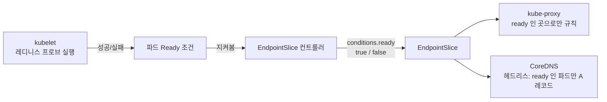
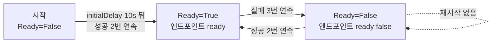

# 11.6 레디니스 프로브로 서비스 엔드포인트 관리하기

> 원서의 이 절 제목은 확인하지 못해 내용 기준으로 이름을 붙였습니다.

[6.1절](<../06장. 파드 생명주기와 컨테이너 상태 관리/6.1 파드 상태 이해하기.md>)에서 "서비스는 `Ready`가 `True`인 파드에만 요청을 보낸다"고 했고, [6.2절](<../06장. 파드 생명주기와 컨테이너 상태 관리/6.2 라이브니스 프로브로 컨테이너 살려 두기.md>)에서는 레디니스 프로브를 11장으로 미뤘습니다. 서비스와 엔드포인트를 다 봤으니 이제 그 약속을 갚습니다.

컨테이너가 `Running`이라고 요청을 받을 준비가 된 것은 아닙니다. 캐시를 채우는 중일 수도, 과부하로 숨을 고르는 중일 수도 있습니다. **레디니스 프로브(Readiness Probe)** 는 이런 파드를 **죽이지 않고 서비스에서 잠시 빼 둡니다.**



| | 라이브니스 | **레디니스** |
| :--- | :--- | :--- |
| 묻는 것 | 살아 있나? | **요청을 받을 수 있나?** |
| 실패하면 | 컨테이너 재시작 | **엔드포인트에서 빠짐**(재시작 안 함) |
| 언제까지 | 컨테이너가 도는 내내 | 컨테이너가 도는 내내 |
| 회복 | 재시작 후 다시 검사 | **성공하면 자동으로 다시 들어옴** |

프로브 방식(`exec`, `httpGet`, `tcpSocket`, `grpc`)과 타이밍 필드는 라이브니스와 똑같습니다. 6.2절의 내용을 그대로 쓰면 됩니다.

## `exec` 프로브로 Ready를 손으로 켜고 꺼 보기

파일이 있으면 성공하는 프로브를 단 kiada 파드를 만듭니다. 파일을 만들고 지우는 것으로 Ready를 직접 조작해 볼 수 있습니다.

**pod.kiada-mock-readiness.yaml**

```yaml
apiVersion: v1
kind: Pod
metadata:
  name: kiada-mock-readiness
  labels:
    app: kiada                  # kiada 서비스에 걸림
spec:
  containers:
  - name: kiada
    image: docker.io/luksa/kiada:0.5
    env:
    - {name: QUOTE_URL, value: "http://quote/quote"}
    - {name: QUIZ_URL, value: "http://quiz"}
    ports:
    - name: http
      containerPort: 8080
    readinessProbe:
      exec:
        command:                # 파일이 있으면 성공(종료 코드 0)
        - ls
        - /var/ready
      initialDelaySeconds: 10   # 시작 후 10초 뒤부터
      periodSeconds: 5          # 5초마다
      failureThreshold: 3       # 3번 연속 실패하면 Ready=False
      successThreshold: 2       # 2번 연속 성공해야 Ready=True
      timeoutSeconds: 2
```

> 원서 예제는 Envoy 사이드카(TLS 종료용)가 함께 들어 있는 파드입니다. 레디니스 동작만 보기 위해 kiada 컨테이너 하나로 줄였습니다.

```bash
kubectl apply -f pod.kiada-mock-readiness.yaml
kubectl get pods -l app=kiada
```

```
NAME                   READY   STATUS    RESTARTS   AGE
kiada-001              1/1     Running   0          14m
kiada-002              1/1     Running   0          14m
kiada-003              1/1     Running   0          14m
kiada-canary           1/1     Running   0          14m
kiada-mock-readiness   0/1     Running   0          26s
```

`STATUS`는 `Running`인데 **`READY`가 `0/1`** 입니다. EndpointSlice에는 들어가 있지만 조건이 다릅니다.

```bash
kubectl get endpointslice -l kubernetes.io/service-name=kiada \
  -o jsonpath='{range .items[0].endpoints[*]}{.targetRef.name}{"\t"}{.conditions}{"\n"}{end}'
```

```
kiada-001	{"ready":true,"serving":true,"terminating":false}
kiada-003	{"ready":true,"serving":true,"terminating":false}
kiada-002	{"ready":true,"serving":true,"terminating":false}
kiada-canary	{"ready":true,"serving":true,"terminating":false}
kiada-mock-readiness	{"ready":false,"serving":false,"terminating":false}
```

> **목록에서 사라지는 것이 아니라 `ready: false`로 남습니다.** `kubectl get endpointslices`의 `ENDPOINTS` 열은 이 차이를 보여 주지 않습니다(위 목록에 `+ 2 more...`로 5개가 셈해짐). 레디니스 문제를 볼 때는 **`conditions`까지** 확인하세요.

이유는 이벤트에 있습니다.

```bash
kubectl describe pod kiada-mock-readiness
```

```
    Readiness:      exec [ls /var/ready] delay=10s timeout=2s period=5s successThreshold=2 failureThreshold=3
...
Conditions:
  Type                        Status
  PodReadyToStartContainers   True 
  Initialized                 True 
  Ready                       False 
  ContainersReady             False 
  PodScheduled                True 
...
Events:
  Type     Reason     Age               From               Message
  ----     ------     ----              ----               -------
  ...
  Warning  Unhealthy  1s (x4 over 16s)  kubelet            spec.containers{kiada}: Readiness probe failed: ls: cannot access '/var/ready': No such file or directory
```

이 상태에서 kiada 서비스로 20번 보내 봅니다.

```bash
for i in $(seq 1 20); do kubectl exec client -- curl -s kiada | grep -o "pod \"[^\"]*\""; done | sort | uniq -c
```

```
      4 pod "kiada-001"
      5 pod "kiada-002"
      3 pod "kiada-003"
      8 pod "kiada-canary"
```

kiada-mock-readiness는 한 번도 안 걸렸습니다.

### 파일을 만들면 — 연속 2번 성공 후 들어옵니다

```bash
kubectl exec kiada-mock-readiness -- touch /var/ready
kubectl get pod kiada-mock-readiness          # 4초 뒤
kubectl get pod kiada-mock-readiness          # 다시 8초 뒤
```

```
NAME                   READY   STATUS    RESTARTS   AGE
kiada-mock-readiness   0/1     Running   0          41s
```

```
NAME                   READY   STATUS    RESTARTS   AGE
kiada-mock-readiness   1/1     Running   0          50s
```

곧바로 바뀌지 않고 **`successThreshold: 2`** 만큼(5초 간격으로 2번) 성공한 뒤에 `1/1`이 되었습니다. 엔드포인트도 따라 바뀝니다.

```
kiada-mock-readiness	{"ready":true,"serving":true,"terminating":false}
```

### 파일을 지우면 — 3번 실패 후 빠지고, 재시작은 없습니다

```bash
kubectl exec kiada-mock-readiness -- rm /var/ready
kubectl get pod kiada-mock-readiness          # 6초 뒤
kubectl get pod kiada-mock-readiness          # 다시 12초 뒤
```

```
NAME                   READY   STATUS    RESTARTS   AGE
kiada-mock-readiness   1/1     Running   0          59s
```

```
NAME                   READY   STATUS    RESTARTS   AGE
kiada-mock-readiness   0/1     Running   0          72s
```

```
kiada-mock-readiness	{"ready":false,"serving":false,"terminating":false}
```

6초 뒤에는 아직 `1/1`이었습니다. **`failureThreshold: 3`** 이라 한두 번 실패로는 빠지지 않습니다. 그리고 **`RESTARTS`는 0 그대로**입니다. 라이브니스였다면 재시작했을 상황입니다.



> **임계값이 곧 반응 속도입니다.** 실패 감지에 최대 `periodSeconds × failureThreshold`(여기서는 15초)가 걸리고, 그동안은 고장 난 파드에도 요청이 갑니다. 너무 짧게 잡으면 잠깐의 지연에도 파드가 들락날락합니다. 레디니스는 재시작을 일으키지 않으니 라이브니스보다는 **조금 민감하게** 잡아도 괜찮습니다.

## `httpGet` 프로브 — 실무에서 가장 흔합니다

kiada는 `/healthz/ready` 경로로 준비 상태를 알려 줍니다.

**pod.kiada-readiness.yaml**

```yaml
apiVersion: v1
kind: Pod
metadata:
  name: kiada-readiness
  labels:
    app: kiada
    rel: stable
spec:
  containers:
  - name: kiada
    image: docker.io/luksa/kiada:0.5
    env:
    - {name: QUOTE_URL, value: "http://quote/quote"}
    - {name: QUIZ_URL, value: "http://quiz"}
    - name: POD_NAME
      valueFrom: {fieldRef: {fieldPath: metadata.name}}
    ports:
    - name: http
      containerPort: 8080
    readinessProbe:
      httpGet:
        port: 8080
        path: /healthz/ready      # 200~399 이면 성공
        scheme: HTTP
```

```bash
kubectl apply -f pod.kiada-readiness.yaml
kubectl get pod kiada-readiness
kubectl logs kiada-readiness | tail -3
```

```
NAME              READY   STATUS    RESTARTS   AGE
kiada-readiness   1/1     Running   0          16s
```

```
2026-10-05T09:44:49.589Z Listening on port 8080
2026-10-05T09:44:50.077Z Received request for /healthz/ready from ::ffff:10.244.0.1
2026-10-05T09:45:00.077Z Received request for /healthz/ready from ::ffff:10.244.0.1
```

10초마다 kubelet이 요청을 보냅니다. 타이밍 필드를 하나도 안 적었으니 기본값이 들어갔습니다.

```bash
kubectl get pod kiada-readiness -o jsonpath="{.spec.containers[0].readinessProbe}"
```

```
{"failureThreshold":3,"httpGet":{"path":"/healthz/ready","port":8080,"scheme":"HTTP"},"periodSeconds":10,"successThreshold":1,"timeoutSeconds":1}
```

> **로그가 프로브 요청으로 도배됩니다.** 위처럼 앱이 모든 요청을 기록하면 10초마다 한 줄씩 쌓입니다. 볼 때는 `kubectl logs kiada-readiness | grep -v healthz`처럼 걸러 냅니다. 앱에서 헬스 체크 경로는 로그를 빼는 편이 좋습니다.

## 실패 사례 — 의존 데이터가 사라지면 Ready가 꺼집니다

quote 파드는 `quote-writer` 컨테이너가 60초마다 명언 파일을 쓰고, `nginx`가 그 파일을 `/quote`로 내보냅니다. 파일이 없으면 nginx가 404를 돌려주므로, **"보낼 명언이 있을 때만 Ready"** 라는 프로브를 걸 수 있습니다.

**pod.quote-readiness.yaml** (일부)

```yaml
  containers:
  - name: quote-writer
    image: docker.io/luksa/quote-writer:0.1
    volumeMounts:
    - name: shared
      mountPath: /var/local/output
  - name: nginx
    image: docker.io/library/nginx:alpine
    volumeMounts:
    - name: shared
      mountPath: /usr/share/nginx/html
      readOnly: true
    ports:
    - name: http
      containerPort: 80
    readinessProbe:
      failureThreshold: 1        # 한 번만 실패해도 뺌
      httpGet:
        port: 80
        path: /quote             # 명언 파일이 있어야 200
        scheme: HTTP
```

```bash
kubectl apply -f pod.quote-readiness.yaml
kubectl logs quote-readiness -c quote-writer --tail 5
```

```
Quote Writer 0.1
Configured to write quote from /book-quotes.txt to /var/local/output/quote every 60 seconds
Mon Oct  5 09:42:52 UTC 2026 Writing fortune...
```

명언 파일을 일부러 지웁니다.

```bash
kubectl exec quote-readiness -c quote-writer -- rm /var/local/output/quote
kubectl get pod quote-readiness
```

```
NAME              READY   STATUS    RESTARTS   AGE
quote-readiness   1/2     Running   0          32s
```

**`1/2`** — 컨테이너 두 개 중 nginx만 준비가 안 됐습니다. **파드는 모든 컨테이너가 Ready여야 Ready**이므로 파드 전체가 서비스에서 빠집니다.

```bash
kubectl get endpointslice -l kubernetes.io/service-name=quote \
  -o jsonpath='{range .items[0].endpoints[*]}{.targetRef.name}{"\t"}{.conditions.ready}{"\n"}{end}'
kubectl get events --field-selector involvedObject.name=quote-readiness,reason=Unhealthy
```

```
quote-001	true
quote-003	true
quote-002	true
quote-canary	true
quote1-with-hostname	true
quote2-with-subdomain	true
quote3-with-hostname-subdomain	true
quote-readiness	false
```

```
LAST SEEN   TYPE      REASON      OBJECT                MESSAGE
31s         Warning   Unhealthy   pod/quote-readiness   Readiness probe failed: Get "http://10.244.0.83:80/quote": dial tcp 10.244.0.83:80: connect: connection refused
0s          Warning   Unhealthy   pod/quote-readiness   Readiness probe failed: HTTP probe failed with statuscode: 404
```

이벤트가 두 개입니다. 위의 `connection refused`는 **파드가 막 떴을 때** nginx가 아직 포트를 열기 전의 실패이고, 아래 `404`가 방금 파일을 지운 결과입니다. 시작 직후에 잠깐 Ready가 아닌 것이 레디니스 프로브의 정상적인 모습입니다.

다음 쓰기 주기(60초)가 지나자 저절로 돌아왔습니다.

```bash
kubectl logs quote-readiness -c quote-writer --tail 2
kubectl get pod quote-readiness
```

```
Mon Oct  5 09:42:52 UTC 2026 Writing fortune...
Mon Oct  5 09:43:52 UTC 2026 Writing fortune...
```

```
NAME              READY   STATUS    RESTARTS   AGE
quote-readiness   2/2     Running   0          91s
```

### 헤드리스 서비스의 DNS에서도 빠집니다

같은 실험을 한 번 더 하면서 [11.4절](<11.4 서비스의 DNS 레코드 이해하기.md>)의 헤드리스 서비스를 조회했습니다.

```bash
kubectl exec dnsutils -- dig +short quote-headless.ch11.svc.cluster.local | sort      # 파일 지우기 전
```

```
10.244.0.13
10.244.0.14
10.244.0.15
10.244.0.16
10.244.0.69
10.244.0.70
10.244.0.71
10.244.0.83
```

```bash
kubectl exec quote-readiness -c quote-writer -- rm /var/local/output/quote
kubectl exec dnsutils -- dig +short quote-headless.ch11.svc.cluster.local | sort      # 지운 뒤
```

```
10.244.0.13
10.244.0.14
10.244.0.15
10.244.0.16
10.244.0.69
10.244.0.70
10.244.0.71
```

quote-readiness(`10.244.0.83`)가 A 레코드에서 사라졌습니다. 클러스터 IP를 쓰든 헤드리스를 쓰든 **준비 안 된 파드로는 새 요청이 가지 않습니다.**

> **레디니스로 의존 서비스를 검사할 때는 조심하세요.** 위처럼 "필요한 데이터가 있나"를 보는 것은 합리적입니다. 하지만 모든 파드가 **같은 외부 DB**를 검사하면, DB가 잠깐 흔들릴 때 **모든 파드가 한꺼번에 빠져** 서비스 전체가 사라집니다. 이럴 때는 레디니스는 통과시키고 앱이 "DB 오류" 응답을 돌려주는 편이 나을 수 있습니다. [6.2절](<../06장. 파드 생명주기와 컨테이너 상태 관리/6.2 라이브니스 프로브로 컨테이너 살려 두기.md>)의 "라이브니스는 자기 자신만"과 짝을 이루는 원칙입니다.

## 준비 안 된 파드도 넣고 싶다면 — `publishNotReadyAddresses`

드물지만 **Ready가 아니어도 주소를 알아야 하는** 경우가 있습니다. 클러스터를 이루는 DB 노드들이 서로를 찾아야 Ready가 되는 상황이 대표적입니다(16장의 스테이트풀셋).

**svc.kiada-publish-not-ready-addresses.yaml**

```yaml
apiVersion: v1
kind: Service
metadata:
  name: kiada-publish-not-ready-addresses
spec:
  publishNotReadyAddresses: true    # Ready 여부와 상관없이 엔드포인트로 공개
  selector:
    app: kiada
  ports:
  - name: http
    port: 80
    targetPort: 8080
  - name: https
    port: 443
    targetPort: 8443
```

kiada-mock-readiness가 `0/1`인 상태에서 만듭니다.

```bash
kubectl apply -f svc.kiada-publish-not-ready-addresses.yaml
kubectl get endpointslice -l kubernetes.io/service-name=kiada-publish-not-ready-addresses \
  -o jsonpath='{range .items[0].endpoints[*]}{.targetRef.name}{"\t"}{.conditions}{"\n"}{end}'
```

```
kiada-canary	{"ready":true,"serving":true,"terminating":false}
kiada-001	{"ready":true,"serving":true,"terminating":false}
kiada-003	{"ready":true,"serving":true,"terminating":false}
kiada-mock-readiness	{"ready":true,"serving":false,"terminating":false}
kiada-002	{"ready":true,"serving":true,"terminating":false}
```

kiada-mock-readiness가 **`ready: true`, `serving: false`** 입니다. `serving`은 실제 상태(준비 안 됨)를 그대로 보여 주고, `ready`만 강제로 `true`가 됐습니다. 공식 문서도 "`publishNotReadyAddresses`가 `true`면 `ready`는 늘 `true`"라고 적고 있습니다.

```bash
for i in $(seq 1 20); do kubectl exec client -- curl -s kiada-publish-not-ready-addresses | grep -o "pod \"[^\"]*\""; done | sort | uniq -c
```

```
      7 pod "kiada-001"
      5 pod "kiada-002"
      4 pod "kiada-003"
      3 pod "kiada-canary"
      1 pod "unknown"
```

`unknown`이 바로 kiada-mock-readiness입니다(이 파드에는 `POD_NAME` 환경 변수를 안 넣어서 이름이 `unknown`으로 나옵니다). **준비 안 된 파드가 실제로 요청을 받았습니다.**

> **이 서비스로 일반 사용자 트래픽을 받으면 안 됩니다.** 레디니스 프로브를 무력화하는 설정입니다. 보통은 **헤드리스 서비스**에 걸어 "구성원 주소 목록" 용도로만 씁니다.

## 종료 중인 파드는 `serving`과 `terminating`으로 구분됩니다

파드를 지우면 Ready와 상관없이 엔드포인트가 바뀝니다. `preStop`으로 20초 동안 종료를 늦춘 파드로 확인합니다.

**pod.kiada-slow-stop.yaml** (pod.kiada-readiness.yaml에 추가한 부분)

```yaml
    lifecycle:
      preStop:
        exec:
          command: ["sleep", "20"]    # 종료를 20초 늦춤
```

```bash
kubectl apply -f pod.kiada-slow-stop.yaml
kubectl delete pod kiada-slow-stop --wait=false
kubectl get pod kiada-slow-stop                    # 2초 뒤
kubectl get endpointslice -l kubernetes.io/service-name=kiada \
  -o jsonpath='{range .items[0].endpoints[*]}{.targetRef.name}{"\t"}{.conditions}{"\n"}{end}'
```

```
NAME              READY   STATUS        RESTARTS   AGE
kiada-slow-stop   1/1     Terminating   0          6s
```

```
kiada-001	{"ready":true,"serving":true,"terminating":false}
kiada-003	{"ready":true,"serving":true,"terminating":false}
kiada-002	{"ready":true,"serving":true,"terminating":false}
kiada-canary	{"ready":true,"serving":true,"terminating":false}
kiada-mock-readiness	{"ready":false,"serving":false,"terminating":false}
kiada-slow-stop	{"ready":false,"serving":true,"terminating":true}
```

```bash
for i in $(seq 1 10); do kubectl exec client -- curl -s kiada | grep -o "pod \"[^\"]*\""; done | sort | uniq -c
```

```
      4 pod "kiada-001"
      4 pod "kiada-002"
      2 pod "kiada-003"
```

세 조건이 모두 다른 세 파드가 한 슬라이스에 나란히 있습니다.

| 파드 | `serving` | `terminating` | `ready` | 새 요청 |
| :--- | :--- | :--- | :--- | :--- |
| **kiada-001** | true | false | **true** | 받음 |
| **kiada-mock-readiness** | false | false | false | 안 받음 (레디니스 실패) |
| **kiada-slow-stop** | true | **true** | false | 안 받음 (종료 중) |

kiada-slow-stop은 `READY 1/1`로 아직 응답할 수 있지만(`serving: true`) 종료 중이라 `ready: false`이고, 새 요청을 받지 않았습니다. **삭제가 시작되는 순간 새 트래픽이 끊기고**, 이미 맺은 연결은 preStop과 종료 유예 시간 동안 마무리할 수 있습니다. ([11.3절](<11.3 서비스 엔드포인트 관리하기.md>)에서 본 `ready = serving이면서 terminating이 아님`이 그대로 드러납니다.)

> **종료 중인 엔드포인트도 쓰일 때가 있습니다.** 공식 문서에 따르면 `externalTrafficPolicy: Local` 등에서 **그 노드의 엔드포인트가 모두 종료 중**이면, kube-proxy는 `serving`인 종료 중 엔드포인트로라도 보냅니다. 롤링 업데이트 중에 트래픽을 잃지 않기 위해서입니다. 이 동작은 1.28부터 GA입니다.

> **삭제와 엔드포인트 갱신은 동시에 일어나지 않습니다.** kubelet이 컨테이너에 종료 신호를 보내는 것과 각 노드의 kube-proxy가 규칙을 고치는 것은 따로 진행됩니다. 앱이 SIGTERM을 받자마자 포트를 닫으면, 아직 규칙이 안 바뀐 노드에서 온 요청이 실패할 수 있습니다. preStop에 짧은 `sleep`을 두는 이유입니다(15장의 롤링 업데이트에서 다시 봅니다).

## 요약 및 비유

| 개념 | 식당 영업 준비 비유 | 기술적 의미 |
| :--- | :--- | :--- |
| **레디니스 프로브** | 매니저가 주기적으로 "주문 받을 수 있나?" 확인 | kubelet이 주기적으로 검사 |
| **실패 → 빠짐** | 재료가 떨어지면 "준비 중" 팻말, 직원은 그대로 | 엔드포인트 `ready:false`, 재시작 없음 |
| **`successThreshold: 2`** | 두 번 연속 괜찮아야 다시 "영업 중" | 연속 성공 횟수 |
| **`failureThreshold: 3`** | 세 번 연속 안 되면 팻말 뒤집기 | 연속 실패 횟수 |
| **`1/2` READY** | 주방은 됐는데 홀이 준비 안 됨 → 가게 전체 준비 중 | 모든 컨테이너가 Ready여야 파드 Ready |
| **의존 데이터 검사** | 오늘의 메뉴 재료가 들어왔나 확인 | 404면 빠지고, 생기면 돌아옴 |
| **`publishNotReadyAddresses`** | 준비 중이어도 주소록에는 올림 | `ready` 강제 true, `serving`은 실제 상태 |
| **종료 중(`terminating`)** | 마감 정리 중. 앉은 손님은 마저, 새 손님은 안 받음 | `serving:true`, `ready:false` |

## 결론

* 레디니스 프로브가 실패하면 파드는 **죽지 않고** EndpointSlice에서 **`ready: false`** 가 되어 새 트래픽을 받지 않습니다. 성공하면 **자동으로 돌아옵니다.**
* 반응 속도는 `periodSeconds`와 **`successThreshold`·`failureThreshold`** 로 정해집니다. 실측에서 `successThreshold: 2`는 약 10초, `failureThreshold: 3`은 약 15초 뒤에 반영됐습니다.
* 파드는 **모든 컨테이너가 Ready**여야 Ready입니다(`1/2`면 빠짐). 헤드리스 서비스의 **DNS 레코드에서도** 빠집니다.
* `publishNotReadyAddresses: true`는 준비 안 된 파드도 **실제로 트래픽을 받게** 만듭니다. 구성원 찾기용 헤드리스 서비스에만 씁니다.
* 삭제가 시작된 파드는 **`terminating: true`, `ready: false`** 로 새 요청에서 즉시 빠집니다. 모든 파드가 같은 의존성을 검사하면 **한꺼번에 빠지는** 위험이 있습니다.

## 공식 문서 업데이트 (2026년 10월 기준)

### 1) 종료 중 엔드포인트로 보내는 동작이 1.28부터 GA입니다

원서가 기준으로 삼은 1.24~1.27에는 아직 정식 기능이 아니었습니다(`ProxyTerminatingEndpoints` 기능 게이트). 지금은 **Stable since Kubernetes v1.28**이며, 그 노드의 로컬 엔드포인트가 모두 종료 중일 때 `serving`인 종료 중 엔드포인트로 트래픽을 보내 롤링 업데이트 중 연결 손실을 줄입니다. EndpointSlice의 `serving`·`terminating` 조건 자체는 1.26에 GA가 되었습니다.

참고: <https://kubernetes.io/docs/reference/networking/virtual-ips/#traffic-to-terminating-endpoints>

## 출처

> 2026-10-05 공식 문서로 검증

* 원서: *Kubernetes in Action, Second Edition* 11장 — <https://livebook.manning.com/book/kubernetes-in-action-second-edition/>
* [Liveness, Readiness, and Startup Probes](https://kubernetes.io/docs/concepts/configuration/liveness-readiness-startup-probes/) — Kubernetes 공식 문서
* [Configure Liveness, Readiness and Startup Probes](https://kubernetes.io/docs/tasks/configure-pod-container/configure-liveness-readiness-startup-probes/) — Kubernetes 공식 문서
* [EndpointSlices](https://kubernetes.io/docs/concepts/services-networking/endpoint-slices/) — Kubernetes 공식 문서
* [Virtual IPs and Service Proxies](https://kubernetes.io/docs/reference/networking/virtual-ips/) — Kubernetes 공식 문서
* [DNS for Services and Pods](https://kubernetes.io/docs/concepts/services-networking/dns-pod-service/) — Kubernetes 공식 문서
* [Pod Lifecycle](https://kubernetes.io/docs/concepts/workloads/pods/pod-lifecycle/) — Kubernetes 공식 문서
