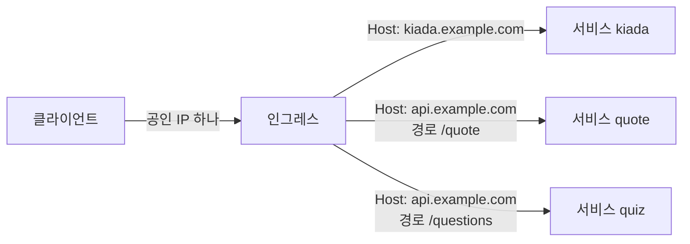
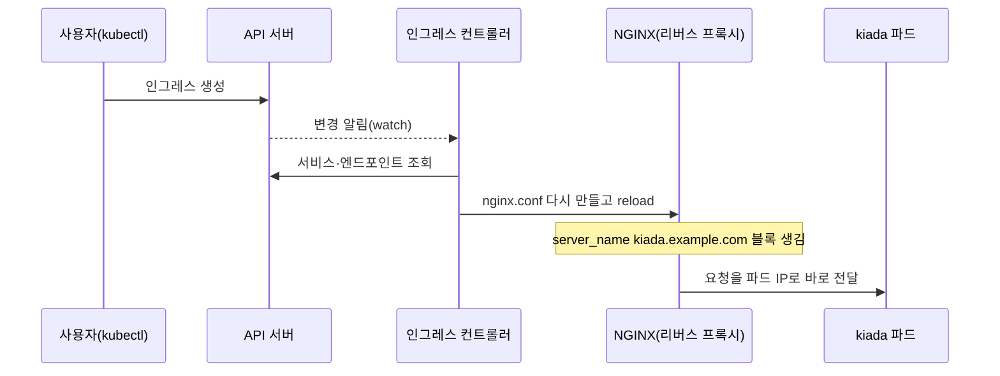
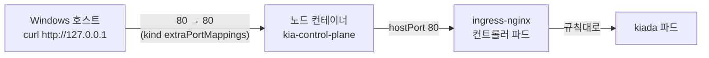

# 12.1 인그레스 알아보기

서비스로 파드 여러 개를 하나의 주소 뒤에 묶는 방법은 11장에서 다룹니다. 그런데 바깥에 공개할 서비스가 열 개라면 어떻게 할까요? `LoadBalancer` 서비스를 열 개 만들면 **공인 IP와 로드 밸런서도 열 개**가 생깁니다.

웹 서비스라면 더 나은 길이 있습니다. **입구 하나로 받아서 호스트 이름과 URL 경로를 보고 나눠 주는 것**입니다. 이것이 **인그레스(Ingress)** 입니다.

> **인그레스는 지금 "동결된(frozen)" API입니다.** 없어지지는 않지만 더 이상 기능이 추가되지 않고, 쿠버네티스 프로젝트는 새로 시작한다면 **Gateway API**를 쓰라고 권합니다(13장). 그래도 인그레스는 여전히 GA이고 기존 클러스터에 아주 많이 깔려 있어서, 읽고 고칠 줄은 알아야 합니다. 자세한 사정은 맨 아래 업데이트 절에 모았습니다.

## 인그레스 오브젝트는 "입구 하나에 규칙 여러 개"입니다

인그레스는 **HTTP 요청을 어느 서비스로 보낼지 적은 규칙표**입니다. 규칙은 두 가지를 봅니다.

* **호스트(host)** — 요청의 `Host` 헤더. `kiada.example.com`인지 `api.example.com`인지
* **경로(path)** — URL 경로. `/quote`인지 `/questions`인지



서비스를 몇 개 두든 바깥에서 보이는 입구는 하나입니다. 로드 밸런서 하나 값으로 여러 서비스를 내놓을 수 있다는 점이 가장 큰 이유입니다.

| 비교 | `LoadBalancer` 서비스 | 인그레스 |
| :--- | :--- | :--- |
| **동작 계층** | L4 (TCP/UDP) | **L7 (HTTP/HTTPS)** |
| **공인 IP** | 서비스마다 하나 | **여러 서비스가 하나를 같이 씀** |
| **나누는 기준** | 포트 | **호스트 이름, URL 경로** |
| **TLS** | 앱이 직접 처리 | **입구에서 끝낼 수 있음** (12.3절) |
| **프로토콜** | 아무거나 | 사실상 HTTP 계열만 |

> **인그레스는 HTTP 전용이라고 생각하세요.** 쿠버네티스 문서는 인그레스를 "보통 HTTP"를 위한 것으로 설명하고, TLS 포트도 443 하나만 다룹니다. 임의의 TCP·UDP 포트를 공개하려면 `LoadBalancer`나 `NodePort` 서비스([11.2절](<../11장. 서비스로 파드 노출하기/11.2 서비스를 클러스터 밖으로 노출하기.md>)에서 다룹니다), 또는 Gateway API(13장)를 씁니다.

## 인그레스 컨트롤러가 없으면 아무 일도 일어나지 않습니다

여기가 처음 배울 때 가장 많이 헷갈리는 지점입니다. 파드나 서비스는 쿠버네티스에 기본으로 들어 있는 컨트롤러가 처리합니다. **인그레스는 아닙니다.** 인그레스 오브젝트는 규칙을 적어 둔 종이일 뿐이고, 그 종이를 읽고 실제로 트래픽을 나눠 주는 것은 따로 설치하는 **인그레스 컨트롤러(Ingress Controller)** 입니다.

인그레스 컨트롤러는 보통 두 부분으로 되어 있습니다.

* **컨트롤러** — API 서버를 지켜보다가 인그레스·서비스·엔드포인트가 바뀌면 설정을 새로 만듭니다
* **리버스 프록시(Reverse Proxy)** — 그 설정대로 실제 요청을 받아 넘깁니다. 이 장에서 쓰는 ingress-nginx는 **NGINX**를 씁니다



> **프록시는 서비스의 ClusterIP를 거치지 않고 파드로 바로 갑니다.** 컨트롤러가 서비스의 엔드포인트(파드 IP 목록)를 읽어 와서 프록시 설정에 넣기 때문입니다. 서비스는 "어느 파드들인가"를 알려 주는 역할만 합니다. 아래 12.2절의 컨트롤러 로그에 찍힌 업스트림 주소가 `10.244.0.26:8080`, 즉 **파드 IP**인 것으로 확인할 수 있습니다.

실제로 컨트롤러가 만든 NGINX 설정을 들여다보면 인그레스 규칙이 `server` 블록으로 바뀌어 있습니다. 12.2절에서 만들 `kiada.example.com` 인그레스를 적용한 뒤 본 모습입니다.

```bash
kubectl exec -n ingress-nginx deploy/ingress-nginx-controller -- \
  grep -n -E 'server_name |## start server|listen |set \$namespace|set \$service_name' /etc/nginx/nginx.conf
```

```
195:	## start server _
197:		server_name "_" ;
201:		listen 80 default_server reuseport backlog=4096 ;
...
335:	## start server kiada.example.com
337:		server_name "kiada.example.com" ;
341:		listen 80  ;
342:		listen [::]:80  ;
343:		listen 443  ssl;
344:		listen [::]:443  ssl;
352:			set $namespace      "ch12";
354:			set $service_name   "kiada";
```

* `server _` — 어떤 규칙에도 안 맞는 요청을 받는 **기본 서버**입니다. 이 컨트롤러는 여기서 404를 돌려줍니다
* `server kiada.example.com` — 우리가 만든 규칙입니다. `ch12` 네임스페이스의 `kiada` 서비스로 보낸다고 적혀 있습니다

## 인그레스 컨트롤러 설치하기

인그레스 컨트롤러는 종류가 많습니다. 클라우드는 자기 로드 밸런서를 쓰는 컨트롤러를 기본으로 주고(GKE, AWS 등), 직접 설치하는 것으로는 NGINX, Contour, HAProxy, Traefik 같은 것들이 있습니다. 책은 **ingress-nginx**를 씁니다. 이 노트도 책과 맞추기 위해 같은 것을 씁니다.

> **ingress-nginx는 2026년 3월에 은퇴했습니다.** SIG Network와 보안 대응 위원회(Security Response Committee)가 2025년 11월에 발표했고, 2026년 3월 이후로는 **릴리스도, 버그 수정도, 보안 패치도 없습니다.** 설치 파일은 계속 받을 수 있고 이미 깔린 것도 계속 동작합니다. 그래서 **학습용으로는 쓸 수 있지만 운영 클러스터에 새로 깔면 안 됩니다.** 이 노트는 마지막 릴리스인 **controller-v1.15.1**을 씁니다.

### kind 클러스터는 이미 준비되어 있습니다

[0.1 실습 환경 구축](<../00장. 실습 환경 구축/0.1 실습 환경 구축.md>)의 `kind-config.yaml`에서 호스트의 80/443 포트를 노드 컨테이너의 80/443으로 연결해 두었습니다. ingress-nginx의 kind용 매니페스트는 컨트롤러 파드에 **`hostPort: 80`, `hostPort: 443`** 을 걸기 때문에, 요청이 이렇게 흘러갑니다.



> **`ingress-ready=true` 노드 레이블은 이제 쓰이지 않습니다.** 옛 kind 매니페스트는 컨트롤러를 이 레이블이 붙은 노드에만 띄웠습니다. v1.15.1 매니페스트의 `nodeSelector`는 `kubernetes.io/os: linux` 하나뿐입니다. 레이블이 붙어 있어도 해가 없으니 그대로 둡니다.

### 매니페스트 적용

```bash
kubectl apply -f https://raw.githubusercontent.com/kubernetes/ingress-nginx/controller-v1.15.1/deploy/static/provider/kind/deploy.yaml
```

```
namespace/ingress-nginx created
serviceaccount/ingress-nginx created
serviceaccount/ingress-nginx-admission created
role.rbac.authorization.k8s.io/ingress-nginx created
role.rbac.authorization.k8s.io/ingress-nginx-admission created
clusterrole.rbac.authorization.k8s.io/ingress-nginx created
clusterrole.rbac.authorization.k8s.io/ingress-nginx-admission created
rolebinding.rbac.authorization.k8s.io/ingress-nginx created
rolebinding.rbac.authorization.k8s.io/ingress-nginx-admission created
clusterrolebinding.rbac.authorization.k8s.io/ingress-nginx created
clusterrolebinding.rbac.authorization.k8s.io/ingress-nginx-admission created
configmap/ingress-nginx-controller created
service/ingress-nginx-controller created
service/ingress-nginx-controller-admission created
deployment.apps/ingress-nginx-controller created
job.batch/ingress-nginx-admission-create created
job.batch/ingress-nginx-admission-patch created
ingressclass.networking.k8s.io/nginx created
validatingwebhookconfiguration.admissionregistration.k8s.io/ingress-nginx-admission created
```

`main` 브랜치가 아니라 **릴리스 태그(`controller-v1.15.1`)로 고정**했습니다. 책의 설치 스크립트는 `main`을 가리키는데, 은퇴한 저장소의 `main`은 언제 무엇이 들어 있을지 장담할 수 없습니다.

눈여겨볼 것은 세 가지입니다.

* **Deployment `ingress-nginx-controller`** — 컨트롤러와 NGINX가 한 컨테이너에 들어 있습니다
* **IngressClass `nginx`** — "이 컨트롤러가 처리하는 인그레스 종류"를 나타냅니다(12.4절)
* **ValidatingWebhookConfiguration** — 잘못된 인그레스를 **만들기 전에 거부**합니다. 12.2절에서 실제로 막히는 모습을 봅니다

```bash
kubectl wait --namespace ingress-nginx --for=condition=ready pod \
  --selector=app.kubernetes.io/component=controller --timeout=180s
```

```
pod/ingress-nginx-controller-596f5b6bcf-nrgts condition met
```

```bash
kubectl get pods,svc -n ingress-nginx
```

```
NAME                                            READY   STATUS    RESTARTS   AGE
pod/ingress-nginx-controller-596f5b6bcf-nrgts   1/1     Running   0          50s

NAME                                         TYPE           CLUSTER-IP      EXTERNAL-IP   PORT(S)                      AGE
service/ingress-nginx-controller             LoadBalancer   10.96.200.166   <pending>     80:30605/TCP,443:31804/TCP   51s
service/ingress-nginx-controller-admission   ClusterIP      10.96.214.87    <none>        443/TCP                      50s
```

서비스가 `LoadBalancer`인데 `EXTERNAL-IP`가 `<pending>`입니다. kind에는 로드 밸런서를 만들어 줄 것이 없어서입니다. **여기서는 문제가 되지 않습니다.** 우리는 서비스가 아니라 hostPort로 들어가기 때문입니다.

```bash
kubectl get ingressclass
```

```
NAME    CONTROLLER             PARAMETERS   AGE
nginx   k8s.io/ingress-nginx   <none>       50s
```

### 첫 접속 — 404가 나오면 성공입니다

```bash
curl -i http://127.0.0.1/
```

```
HTTP/1.1 404 Not Found
Date: Mon, 05 Oct 2026 08:48:33 GMT
Content-Type: text/html
```

아직 인그레스를 하나도 안 만들었으니 위의 기본 서버(`server _`)가 404를 돌려준 것입니다. **NGINX까지는 요청이 닿았다**는 뜻입니다.

> **코어가 많은 PC에서는 접속이 간헐적으로 끊길 수 있습니다.** 이 실습 PC(18코어)에서 처음 설치했을 때 `curl`이 대부분 타임아웃되고 가끔만 404가 왔습니다. 컨트롤러 로그에 이런 줄이 가득했습니다.
> ```
> 2026/10/05 08:48:14 [alert] 38#38: pthread_create() failed (11: Resource temporarily unavailable)
> 2026/10/05 08:48:14 [alert] 25#25: worker process 35 exited with fatal code 2 and cannot be respawned
> ```
> NGINX는 기본으로 **CPU 수만큼 worker 프로세스**(`worker_processes auto`)를 띄우고 worker마다 스레드를 30개 넘게 만듭니다. 그런데 kind 노드 컨테이너는 podman 기본값으로 **프로세스(PID) 한도가 2048**입니다. 노드 하나에 여러 실습을 함께 돌리던 중이라 이 한도에 닿아 worker가 죽은 것입니다.
> ```bash
> podman exec kia-control-plane cat /sys/fs/cgroup/pids.max     # 2048
> ```
> ingress-nginx ConfigMap의 `worker-processes`로 worker 수를 줄이면 해결됩니다.
> ```bash
> kubectl patch configmap ingress-nginx-controller -n ingress-nginx \
>   --type merge -p '{"data":{"worker-processes":"2"}}'
> ```
> ```
> configmap/ingress-nginx-controller patched
> ```
> 컨트롤러가 설정을 다시 읽은 뒤(`"Backend successfully reloaded"`)로는 6번 모두 0.01초 안에 404가 왔습니다.

> **`localhost`보다 `127.0.0.1`이 빠릅니다.** 같은 요청을 `http://localhost/`로 보내면 매번 약 0.2초 걸렸고, `127.0.0.1`은 0.01초 안쪽이었습니다. Windows가 `localhost`를 IPv6(`::1`)로 먼저 시도하는 탓으로 보입니다. 이 장에서는 `127.0.0.1`을 씁니다.

## 요약 및 비유

| 개념 | 박물관 안내 데스크 비유 | 기술적 의미 |
| :--- | :--- | :--- |
| **인그레스** | 안내 데스크에 붙은 관람 안내표 | 호스트·경로별로 서비스를 정한 규칙 |
| **인그레스 컨트롤러** | 안내표를 읽고 일하는 안내 직원 | 인그레스를 지켜보며 프록시 설정을 만드는 프로그램 |
| **리버스 프록시(NGINX)** | 관람객을 전시실까지 직접 데려다주는 도슨트 | 실제로 요청을 받아 넘기는 서버 |
| **호스트 규칙** | "단체 관람객은 별관, 개인 관람객은 본관으로" | `Host` 헤더로 나누기 |
| **경로 규칙** | "기념품점은 /shop 쪽 복도" | URL 경로로 나누기 |
| **기본 서버의 404** | "그런 전시는 운영하지 않습니다" | 어떤 규칙에도 안 맞는 요청 |
| **`LoadBalancer` 서비스 여러 개** | 전시실마다 정문을 따로 뚫기 | 서비스마다 공인 IP·로드 밸런서 |
| **은퇴한 ingress-nginx** | 계약이 끝나 새 교육을 받지 못하는 직원 | 동작은 하지만 패치가 없는 컨트롤러 |

## 결론

* 인그레스는 **입구 하나로 여러 HTTP 서비스를 내놓는** L7 규칙표입니다. 서비스마다 로드 밸런서를 만드는 것보다 훨씬 쌉니다.
* 인그레스 오브젝트만으로는 **아무 일도 일어나지 않습니다.** 인그레스 컨트롤러를 따로 설치해야 합니다.
* 컨트롤러는 인그레스·서비스·엔드포인트를 읽어 **프록시 설정을 다시 만들고**, 프록시는 **서비스를 거치지 않고 파드 IP로 바로** 요청을 보냅니다.
* kind에서는 ingress-nginx가 **hostPort 80/443**을 쓰므로 서비스의 `EXTERNAL-IP`가 `<pending>`이어도 `127.0.0.1`로 들어갈 수 있습니다.
* 코어가 많은 PC에서는 NGINX worker가 노드의 **PID 한도**에 걸려 접속이 끊길 수 있습니다. `worker-processes`를 줄이세요.
* ingress-nginx는 **2026년 3월에 은퇴**했습니다. 학습용으로만 쓰고, 새 클러스터라면 Gateway API(13장)나 다른 컨트롤러를 고르세요.

## 공식 문서 업데이트 (2026년 10월 기준)

### 1) 인그레스 API가 동결되었고, Gateway API를 쓰라고 권합니다 (가장 큰 변화)

쿠버네티스 문서의 인그레스 페이지 맨 위에 이런 안내가 붙었습니다. **"The Kubernetes project recommends using Gateway instead of Ingress. The Ingress API has been frozen."**

* 인그레스는 계속 **GA**이고 GA API의 안정성 보장을 받습니다. **제거 계획은 없습니다**
* 대신 **더 이상 개발하거나 바꾸지 않습니다.** 새 기능은 Gateway API에 들어갑니다
* 인그레스 컨트롤러 페이지에도 같은 권고가 있습니다

참고: <https://kubernetes.io/docs/concepts/services-networking/ingress/>

### 2) ingress-nginx가 은퇴했습니다

* **2025-11-11** 공식 블로그에서 은퇴 발표. 최선 노력(best-effort) 유지보수는 **2026년 3월까지**, 그 뒤로는 릴리스·버그 수정·보안 패치 없음
* **2026-01-29** 운영 위원회(Steering Committee)와 보안 대응 위원회가 다시 경고. 클라우드 네이티브 환경의 **약 절반**이 이 컨트롤러에 기대고 있다고 밝혔습니다
* GitHub 저장소 `kubernetes/ingress-nginx`는 **보관(archived)** 상태이고, 마지막 릴리스는 **controller-v1.15.1**(helm-chart-4.15.1, 2026-03-19)입니다
* 권장 경로는 **Gateway API로 이전**, 인그레스를 계속 써야 하면 **다른 인그레스 컨트롤러**입니다. 변환 도구 **ingress2gateway**가 2026년 3월에 1.0이 되었습니다

내 클러스터에 깔려 있는지는 이렇게 확인합니다(블로그에 실린 명령).

```bash
kubectl get pods --all-namespaces --selector app.kubernetes.io/name=ingress-nginx
```

참고: <https://kubernetes.io/blog/2025/11/11/ingress-nginx-retirement/>

### 3) kind 문서는 이제 ingress-nginx 대신 cloud-provider-kind를 안내합니다

책은 kind에 ingress-nginx를 까는 명령을 안내했습니다. 지금 kind의 Ingress 문서는 **cloud-provider-kind v0.9.0부터 인그레스를 기본 지원**하므로 **서드파티 인그레스 컨트롤러가 기본으로는 필요 없다**고 설명합니다. Gateway API도 함께 지원합니다. ingress-nginx나 Contour 같은 서드파티는 각 프로젝트 문서를 따르라고만 합니다.

이 노트에서 cloud-provider-kind를 쓰지 않은 이유는 두 가지입니다.

* cloud-provider-kind는 클러스터의 **모든 `LoadBalancer` 서비스에 외부 주소를 붙입니다.** 같은 클러스터에서 11장의 "`LoadBalancer`가 `<pending>`에 머무는" 실습이 함께 돌고 있어 결과가 바뀝니다
* 12.3절의 SSL 패스스루, 12.4절의 쿠키 어피니티처럼 **책의 애노테이션 예제가 ingress-nginx 전용**입니다

참고: <https://kind.sigs.k8s.io/docs/user/ingress/>

## 출처

> 2026-10-05 공식 문서로 검증

* 원서: *Kubernetes in Action, Second Edition* 12장 — <https://livebook.manning.com/book/kubernetes-in-action-second-edition/>
* [Ingress](https://kubernetes.io/docs/concepts/services-networking/ingress/) — Kubernetes 공식 문서
* [Ingress Controllers](https://kubernetes.io/docs/concepts/services-networking/ingress-controllers/) — Kubernetes 공식 문서
* [Ingress NGINX Retirement: What You Need to Know](https://kubernetes.io/blog/2025/11/11/ingress-nginx-retirement/) — Kubernetes 공식 블로그
* [Ingress NGINX: Statement from the Kubernetes Steering and Security Response Committees](https://kubernetes.io/blog/2026/01/29/ingress-nginx-statement/) — Kubernetes 공식 블로그
* [Announcing Ingress2Gateway 1.0: Your Path to Gateway API](https://kubernetes.io/blog/2026/03/20/ingress2gateway-1-0-release/) — Kubernetes 공식 블로그
* [kind – Ingress](https://kind.sigs.k8s.io/docs/user/ingress/) — kind 공식 문서
* [Installation Guide - Ingress-Nginx Controller](https://kubernetes.github.io/ingress-nginx/deploy/) — ingress-nginx 공식 문서
* [ConfigMap - Ingress-Nginx Controller](https://kubernetes.github.io/ingress-nginx/user-guide/nginx-configuration/configmap/) — ingress-nginx 공식 문서
* [GitHub - kubernetes/ingress-nginx: Ingress NGINX Controller for Kubernetes](https://github.com/kubernetes/ingress-nginx) — ingress-nginx 저장소
