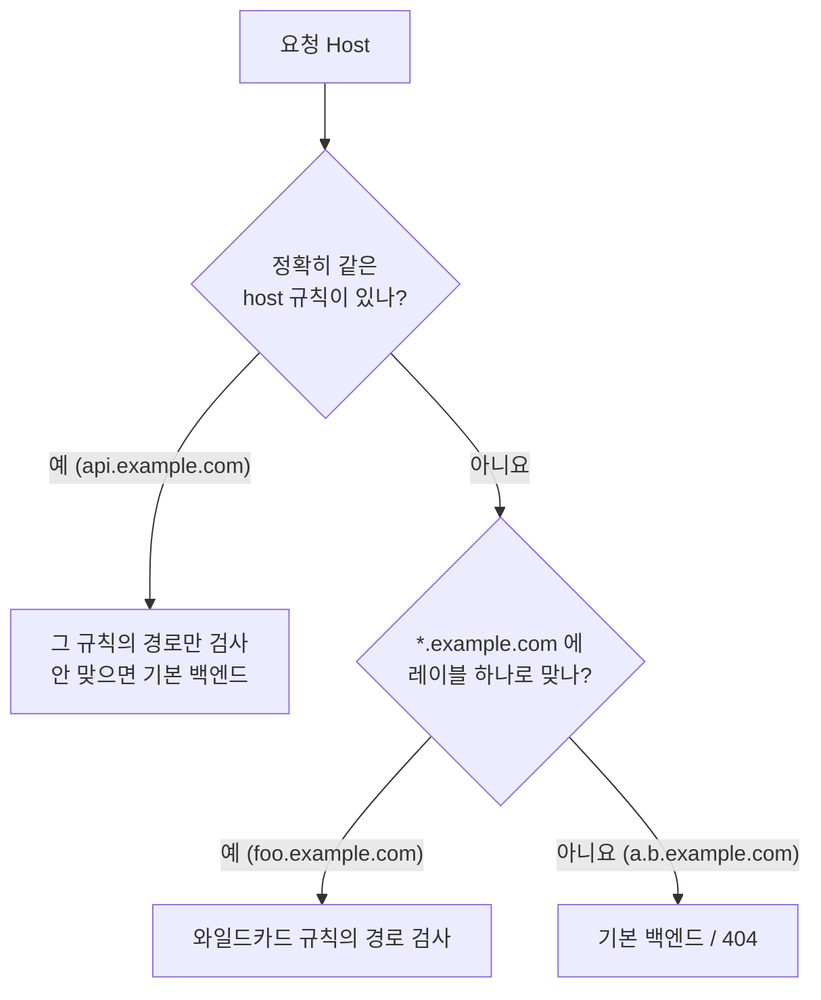

# 12.2 인그레스 만들고 사용하기

[12.1절](<12.1 인그레스 알아보기.md>)에서 인그레스 컨트롤러를 설치하고 404까지 받아 봤습니다. 이제 규칙을 적을 차례입니다. **호스트 하나 → 서비스 하나**로 시작해서, 경로로 나누고, 호스트를 여럿 두고, 어디에도 안 맞는 요청을 받아 줄 곳까지 차례로 만듭니다.

## 실습 준비 — kiada, quote, quiz, fun404

책의 `Chapter12/SETUP` 매니페스트를 그대로 쓰되, 단일 노드에 다른 실습도 함께 돌고 있어서 **kiada 파드 2개, quote 1개, quiz 1개**로 줄였습니다. 이미지는 레지스트리 주소까지 적도록 고쳤습니다.

| 서비스 | 파드 | 이미지 | 포트 |
| :--- | :--- | :--- | :--- |
| **kiada** | kiada-001, kiada-002 | `docker.io/luksa/kiada:0.5` + `docker.io/envoyproxy/envoy:v1.31-latest` | http 80→8080, https 443→8443 |
| **quote** | quote-001 | `docker.io/luksa/quote-writer:0.1` + `docker.io/library/nginx:alpine` | http 80→80 |
| **quiz** | quiz | `docker.io/luksa/quiz-api:0.1` + `docker.io/library/mongo:7` | http 80→8080 |
| **fun404** | fun404 | `docker.io/luksa/static-http-server:0.1` | http 80→8080 (항상 404) |

kiada 파드의 envoy 사이드카가 TLS 인증서 Secret `kiada-tls`를 마운트하므로 Secret을 먼저 만듭니다. 인증서는 12.3절에서 만드는 방법을 설명합니다.

```bash
kubectl create secret tls kiada-tls --cert=example.crt --key=example.key
kubectl apply -f setup/                         # 책의 SETUP 매니페스트(축소판)
kubectl get pods,svc -o wide
```

```
NAME            READY   STATUS    RESTARTS   AGE   IP            NODE                NOMINATED NODE   READINESS GATES
pod/fun404      1/1     Running   0          86s   10.244.0.24   kia-control-plane   <none>           <none>
pod/kiada-001   2/2     Running   0          86s   10.244.0.25   kia-control-plane   <none>           <none>
pod/kiada-002   2/2     Running   0          86s   10.244.0.26   kia-control-plane   <none>           <none>
pod/quiz        2/2     Running   0          86s   10.244.0.29   kia-control-plane   <none>           <none>
pod/quote-001   2/2     Running   0          86s   10.244.0.27   kia-control-plane   <none>           <none>

NAME             TYPE        CLUSTER-IP      EXTERNAL-IP   PORT(S)          AGE   SELECTOR
service/fun404   ClusterIP   10.96.222.146   <none>        80/TCP           86s   app=fun404
service/kiada    ClusterIP   10.96.109.165   <none>        80/TCP,443/TCP   86s   app=kiada
service/quiz     ClusterIP   10.96.202.78    <none>        80/TCP           86s   app=quiz
service/quote    ClusterIP   10.96.250.91    <none>        80/TCP           86s   app=quote
```

파드 IP를 기억해 두세요. 아래 `describe`와 컨트롤러 로그에 그대로 다시 나옵니다.

서비스는 모두 **`ClusterIP`** 입니다. 바깥에 직접 공개된 것은 하나도 없습니다. 바깥 문은 인그레스 컨트롤러 하나뿐입니다.

## 서비스 하나를 인그레스로 공개하기

**ing.kiada-example-com.yaml**

```yaml
apiVersion: networking.k8s.io/v1
kind: Ingress
metadata:
  name: kiada-example-com
spec:
  rules:
  - host: kiada.example.com          # 이 Host 헤더로 온 요청은
    http:
      paths:
      - path: /                      # 모든 경로를
        pathType: Prefix
        backend:
          service:
            name: kiada              # kiada 서비스의
            port:
              number: 80             # 80번 포트로 (name: http 로 써도 됨)
```

뼈대는 **`rules[] → host → http.paths[] → backend.service`** 입니다. 서비스의 포트는 번호(`number`)나 이름(`name`) 중 하나로 고릅니다.

```bash
kubectl apply -f ing.kiada-example-com.yaml
kubectl get ing
```

```
NAME                CLASS    HOSTS               ADDRESS   PORTS   AGE
kiada-example-com   <none>   kiada.example.com             80      0s
```

`ADDRESS`가 비어 있습니다. 컨트롤러가 인그레스를 처리하고 상태(`status.loadBalancer`)에 주소를 적어 넣을 때까지 잠깐 걸립니다.

```bash
kubectl get ing                                 # 30초쯤 뒤
```

```
NAME                CLASS    HOSTS               ADDRESS     PORTS   AGE
kiada-example-com   <none>   kiada.example.com   localhost   80      30s
```

`localhost`는 kind용 매니페스트가 컨트롤러에 준 `--publish-status-address=localhost` 인자 값입니다. 클라우드라면 로드 밸런서의 IP나 호스트 이름이 찍힙니다.

> **`CLASS`가 `<none>`인데도 동작합니다.** 인그레스에 클래스를 적지 않았지만, kind용 매니페스트가 컨트롤러를 `--watch-ingress-without-class=true`로 띄워서 **클래스 없는 인그레스도 처리**합니다. 클래스를 제대로 쓰는 법은 12.4절에서 봅니다.

```bash
kubectl describe ing kiada-example-com
```

```
Name:             kiada-example-com
Labels:           <none>
Namespace:        ch12
Address:          localhost
Ingress Class:    <none>
Default backend:  <default>
Rules:
  Host               Path  Backends
  ----               ----  --------
  kiada.example.com  
                     /   kiada:80 (10.244.0.25:8080,10.244.0.26:8080)
Annotations:         <none>
Events:
  Type    Reason  Age               From                      Message
  ----    ------  ----              ----                      -------
  Normal  Sync    5s (x2 over 35s)  nginx-ingress-controller  Scheduled for sync
```

`kiada:80` 옆 괄호 안이 **서비스 뒤의 파드 IP**입니다. 서비스에 붙은 파드가 없다면 여기가 비어 있으니 가장 먼저 볼 곳입니다.

### 접속하려면 Host 헤더를 맞춰야 합니다

`kiada.example.com`은 진짜 DNS에 없는 이름입니다. 두 가지 방법이 있습니다.

```bash
curl --resolve kiada.example.com:80:127.0.0.1 http://kiada.example.com/   # 이름을 127.0.0.1 로 풀기
curl -H 'Host: kiada.example.com' http://127.0.0.1/                       # Host 헤더만 바꾸기
```

```
KUBERNETES IN ACTION DEMO APPLICATION v0.5

==== TIP OF THE MINUTE
Each directive creates a new layer. I have already mentioned that ...
(중략)

==== REQUEST INFO
Request processed by Kiada 0.5 running in pod "kiada-002" on node "kia-control-plane".
Pod hostname: kiada-002; Pod IP: 10.244.0.26; Node IP: 10.89.0.2; Client IP: ::ffff:10.244.0.9
```

마지막 줄의 `Client IP: 10.244.0.9`는 내 PC가 아니라 **인그레스 컨트롤러 파드의 IP**입니다. 앱 입장에서는 프록시가 손님입니다. 진짜 클라이언트 주소는 프록시가 붙이는 `X-Forwarded-For` 헤더로 넘어갑니다.

> **`--resolve`가 `-H 'Host: …'`보다 낫습니다.** HTTP만 쓸 때는 둘이 같지만, HTTPS에서는 TLS 핸드셰이크의 **SNI**에도 이름이 들어가야 합니다. `-H`는 SNI를 바꾸지 못합니다(12.3절). 브라우저로 보려면 `hosts` 파일에 `127.0.0.1 kiada.example.com`을 적는 방법도 있습니다.

컨트롤러 로그를 보면 요청이 어디로 갔는지 정확히 찍힙니다.

```bash
kubectl logs -n ingress-nginx deploy/ingress-nginx-controller --tail=2
```

```
10.89.0.1 - - [05/Oct/2026:09:28:38 +0000] "GET / HTTP/1.1" 200 1471 "-" "curl/8.21.0" 81 0.022 [ch12-kiada-80] [] 10.244.0.26:8080 1471 0.022 200 08dd1c990667e7b6032543f6bc5dcc74
10.89.0.1 - - [05/Oct/2026:09:28:38 +0000] "GET / HTTP/1.1" 200 1471 "-" "curl/8.21.0" 81 0.019 [ch12-kiada-80] [] 10.244.0.25:8080 1471 0.020 200 5bbea0c09a9fd11a3c5218946028c7cb
```

`[ch12-kiada-80]`은 "ch12 네임스페이스 kiada 서비스 80 포트", 그 뒤 `10.244.0.26:8080`과 `10.244.0.25:8080`은 **파드 IP**입니다. 두 파드에 번갈아 갔습니다. 프록시가 서비스를 거치지 않고 파드로 바로 간다는 증거입니다.

### Host가 안 맞으면 404입니다

```bash
curl -i http://127.0.0.1/                                  # Host: 127.0.0.1
curl -i -H 'Host: other.example.com' http://127.0.0.1/     # 규칙에 없는 호스트
```

```
HTTP/1.1 404 Not Found
Date: Mon, 05 Oct 2026 09:28:38 GMT
Content-Type: text/html
Content-Length: 146
Connection: keep-alive

<html>
<head><title>404 Not Found</title></head>
<body>
<center><h1>404 Not Found</h1></center>
<hr><center>nginx</center>
</body>
</html>
```

두 요청 모두 같은 404입니다. 맨 아래 `nginx`가 찍힌 이 페이지는 **앱이 아니라 컨트롤러의 기본 서버**가 만든 것입니다. 앱이 404를 낸 것과 구별하는 단서가 됩니다.

## 경로로 나누기 — `pathType`이 중요합니다

이번에는 호스트 두 개에 경로 규칙을 붙입니다. 앞의 인그레스는 지웁니다(이유는 아래 함정에서).

**ing.kiada.yaml**

```yaml
apiVersion: networking.k8s.io/v1
kind: Ingress
metadata:
  name: kiada
spec:
  rules:
  - host: kiada.example.com
    http:
      paths:
      - path: /
        pathType: Prefix
        backend:
          service:
            name: kiada
            port:
              name: http
  - host: api.example.com
    http:
      paths:
      - path: /quote
        pathType: Exact              # 정확히 /quote 만
        backend:
          service:
            name: quote
            port:
              name: http
      - path: /questions
        pathType: Prefix             # /questions 와 그 아래 전부
        backend:
          service:
            name: quiz
            port:
              name: http
```

```bash
kubectl delete ing kiada-example-com
kubectl apply -f ing.kiada.yaml
kubectl describe ing kiada
```

```
Rules:
  Host               Path  Backends
  ----               ----  --------
  kiada.example.com  
                     /   kiada:http (10.244.0.25:8080,10.244.0.26:8080)
  api.example.com    
                     /quote       quote:http (10.244.0.27:80)
                     /questions   quiz:http (10.244.0.29:8080)
```

### `pathType` 세 가지

| `pathType` | 맞는 방식 | 예: 규칙 `/foo` |
| :--- | :--- | :--- |
| **`Exact`** | 경로가 **글자 그대로** 같아야 함 | `/foo` ✅ · `/foo/` ❌ |
| **`Prefix`** | `/`로 나눈 **경로 조각 단위**로 앞부분이 같으면 | `/foo` ✅ · `/foo/` ✅ · `/foo/bar` ✅ · `/foobar` ❌ |
| **`ImplementationSpecific`** | **컨트롤러 마음대로** | 컨트롤러 문서를 봐야 함 |

여러 경로가 동시에 맞으면 **가장 긴 경로**가 이기고, 길이가 같으면 `Exact`가 `Prefix`보다 우선합니다.

### 실측 — 같은 호스트, 다른 경로

```bash
R='--resolve api.example.com:80:127.0.0.1'
curl -s $R -w '\n[%{http_code}]\n' http://api.example.com/quote
curl -s $R -w '\n[%{http_code}]\n' http://api.example.com/quote/
curl -s $R -w '\n[%{http_code}]\n' http://api.example.com/questions/random
curl -s $R -w '\n[%{http_code}]\n' http://api.example.com/questions
curl -s $R -w '\n[%{http_code}]\n' http://api.example.com/questionsXYZ
```

```
Entering a running container with `kubectl exec` is a great first step when you want to debug an app. When something breaks, the first thing you’ll want to investigate is the actual state of the system your application sees.

[200]

<html>
<head><title>404 Not Found</title></head>
<body>
<center><h1>404 Not Found</h1></center>
<hr><center>nginx</center>
</body>
</html>

[404]

{"id":6,"text":"Which of the following statements is correct?","correctAnswerIndex":1,"answers":["When the readiness probe fails, the container is restarted.","When the liveness probe fails, the container is restarted.","Containers without a readiness probe are never restarted.","Containers without a liveness probe are never restarted."]}

[200]

404 page not found

[404]

<html>
<head><title>404 Not Found</title></head>
<body>
<center><h1>404 Not Found</h1></center>
<hr><center>nginx</center>
</body>
</html>

[404]
```

| 요청 | 결과 | 누가 응답했나 |
| :--- | :--- | :--- |
| `/quote` | 200 | quote |
| `/quote/` | 404 | **NGINX** — `Exact`라 끝의 `/` 하나로 안 맞음 |
| `/questions/random` | 200 | quiz |
| `/questions` | 404 | **quiz 앱** — 규칙은 맞았지만 앱에 그런 경로가 없음 |
| `/questionsXYZ` | 404 | **NGINX** — `Prefix`는 글자가 아니라 경로 조각 단위 |

> **같은 404라도 누가 냈는지 보세요.** `/questions`의 `404 page not found`는 짧은 평문이고, `/quote/`의 404는 `nginx`가 찍힌 HTML입니다. 앞의 것은 **인그레스는 제대로 넘겼고 앱이 거절한 것**, 뒤의 것은 **인그레스 규칙에 안 맞은 것**입니다. 고칠 곳이 완전히 다릅니다.

> **`Exact`는 끝의 슬래시 하나에도 엄격합니다.** 사용자는 `/quote/`처럼 슬래시를 붙여 오기도 합니다. API 경로가 아니라면 `Prefix`가 대개 안전합니다.

### 잘못 쓴 인그레스는 만들어지지도 않습니다

API 서버와 컨트롤러의 웹훅이 두 겹으로 막습니다.

```yaml
      - path: quote                  # 앞의 / 를 빠뜨림
        pathType: Prefix
```

```
The Ingress "bad-path" is invalid: spec.rules[0].http.paths[0].path: Invalid value: "quote": must be an absolute path
```

이것은 **API 서버의 검증**입니다. 경로는 반드시 `/`로 시작해야 합니다.

## 규칙 여러 개 — 호스트별로, 와일드카드로

`ing.kiada.yaml`은 이미 규칙이 두 개(호스트 두 개)입니다. 호스트 자리에 **와일드카드**도 쓸 수 있습니다.

**ing.kiada.wildcard.yaml** (바뀐 부분)

```yaml
spec:
  rules:
  - host: '*.example.com'            # 따옴표 필수 — YAML에서 *는 특수 문자
    http:
      paths:
      - path: /
        pathType: Prefix
        backend:
          service:
            name: kiada
            port:
              name: http
  - host: api.example.com            # 나머지는 ing.kiada.yaml 과 같음
    ...
```

```bash
kubectl apply -f ing.kiada.wildcard.yaml
kubectl get ing
```

```
NAME    CLASS    HOSTS                           ADDRESS     PORTS   AGE
kiada   <none>   *.example.com,api.example.com   localhost   80      37s
```

여러 호스트를 한 번에 시험하려고 작은 셸 함수를 하나 만들어 씁니다. 상태 코드와 응답 앞부분 60글자를 한 줄로 보여 줍니다.

```bash
try() {                                         # 사용법: try 호스트 경로
  code=$(curl -s -o /tmp/o.txt -w '%{http_code}' -H "Host: $1" "http://127.0.0.1$2")
  echo "$1$2 -> $code $(head -c 60 /tmp/o.txt | tr '\n' ' ')"
}
try foo.example.com /
try api.example.com /quote
try api.example.com /
try a.b.example.com /
try example.com /
```

```
foo.example.com/ -> 200 KUBERNETES IN ACTION DEMO APPLICATION v0.5
api.example.com/quote -> 200 Entering a running container with `kubectl exec` is a great
api.example.com/ -> 404 <html> <head><title>404 Not Found</title></head>
a.b.example.com/ -> 404 <html> <head><title>404 Not Found</title></head>
example.com/ -> 404 <html> <head><title>404 Not Found</title></head>
```

* `foo.example.com` — 와일드카드에 맞아 kiada로 갔습니다
* `a.b.example.com` — **와일드카드는 DNS 레이블 하나만** 덮습니다. `*`가 `a.b`를 대신하지 못합니다
* `example.com` — `*.`의 앞자리가 비어 있으면 안 맞습니다
* `api.example.com/` — 와일드카드에도 맞을 것 같지만 404입니다. **정확한 호스트 규칙이 있으면 그 규칙 안에서만 경로를 찾고**, 와일드카드 규칙으로 넘어가지 않았습니다



### 같은 호스트·경로를 두 인그레스가 차지하면 웹훅이 막습니다

앞에서 `kiada-example-com`을 지운 이유입니다. 와일드카드 버전이 적용된 상태에서 `kiada-example-com`(호스트 `kiada.example.com`, 경로 `/`)을 다시 만들면 들어갑니다. 겹치는 규칙이 없으니까요. 그런데 그 상태에서 `kiada` 인그레스를 다시 `kiada.example.com`을 쓰는 원래 버전으로 돌리면 거부됩니다.

```bash
kubectl apply -f ing.kiada-example-com.yaml     # 통과
kubectl apply -f ing.kiada.yaml                 # 거부
```

```
ingress.networking.k8s.io/kiada-example-com created
Error from server (BadRequest): error when applying patch:
...
for: "ing.kiada.yaml": error when patching "ing.kiada.yaml": admission webhook "validate.nginx.ingress.kubernetes.io" denied the request: host "kiada.example.com" and path "/" is already defined in ingress ch12/kiada-example-com
```

**API 서버 자체는 이런 충돌을 모릅니다.** 거부한 것은 ingress-nginx가 설치한 **검증 웹훅(`validate.nginx.ingress.kubernetes.io`)** 입니다. 다른 컨트롤러라면 둘 다 받아들이고 어느 한쪽이 조용히 이길 수도 있습니다.

## 어디에도 안 맞는 요청 — 기본 백엔드

`spec.defaultBackend`에 서비스를 적으면 규칙에 안 맞는 요청을 그리로 보냅니다. 책은 항상 재미있는 404 문구를 돌려주는 `fun404`를 씁니다.

**ing.kiada.defaultBackend.yaml** (추가된 부분)

```yaml
spec:
  defaultBackend:                    # 규칙에 안 맞으면 여기로
    service:
      name: fun404
      port:
        name: http
  rules:                             # 규칙은 ing.kiada.yaml 과 같음
  ...
```

```bash
kubectl delete ing kiada-example-com
kubectl apply -f ing.kiada.yaml
kubectl apply -f ing.kiada.defaultBackend.yaml
kubectl describe ing kiada
```

```
Default backend:  fun404:http (10.244.0.24:8080)
Rules:
  Host               Path  Backends
  ----               ----  --------
  kiada.example.com  
                     /   kiada:http (10.244.0.25:8080,10.244.0.26:8080)
  api.example.com    
                     /quote       quote:http (10.244.0.27:80)
                     /questions   quiz:http (10.244.0.29:8080)
```

```bash
try api.example.com /unknown            # 있는 호스트, 없는 경로
try nothing.example.org /foo            # 없는 호스트
try 127.0.0.1 /                         # Host 헤더 없이
```

```
api.example.com/unknown -> 404 This isn't the URL you're looking for.
nothing.example.org/foo -> 404 <html> <head><title>404 Not Found</title></head> <body> <
127.0.0.1/ -> 404 <html> <head><title>404 Not Found</title></head> <body> <
```

앞에서 `Exact` 때문에 NGINX 404가 났던 `/quote/`도 이제 `fun404`가 받습니다.

```bash
curl -s -w ' [%{http_code}]\n' -H 'Host: api.example.com' http://127.0.0.1/quote/
```

```
This isn't the URL you're looking for. [404]
```

> **적용 직후 몇 초는 옛 설정으로 응답합니다.** `apply` 바로 다음에 시험했을 때는 `api.example.com/unknown`도 NGINX 404였고, 몇 초 뒤 다시 하니 `fun404`가 받았습니다. 컨트롤러가 설정을 다시 만들고 NGINX를 reload하는 데 시간이 걸리기 때문입니다. 로그의 `"Backend successfully reloaded"`를 보고 시험하세요.

결과가 반으로 갈렸습니다.

* **이 인그레스에 있는 호스트**(`api.example.com`)에서 경로만 안 맞은 요청 → `fun404`
* **어떤 인그레스에도 없는 호스트** → 여전히 NGINX 기본 404

ingress-nginx에서 인그레스의 `defaultBackend`는 **그 인그레스가 가진 호스트들 안에서만** 쓰였습니다.

```mermaid
graph TD
    R["요청"] --> H{"Host 가 kiada 인그레스의<br/>호스트인가?"}
    H -->|"kiada.example.com"| K["kiada"]
    H -->|"api.example.com"| P{"경로"}
    P -->|"/quote (Exact)"| Q["quote"]
    P -->|"/questions (Prefix)"| Z["quiz"]
    P -->|"그 밖 (/unknown, /quote/)"| F["fun404 ✅"]
    H -.->|"nothing.example.org"| N["NGINX 기본 404 ❌<br/>(fun404 아님)"]
``` 정말로 "모든 나머지"를 받고 싶다면 **규칙 없이 `defaultBackend`만 있는 인그레스**를 따로 만듭니다.

**ing.catch-all.yaml**

```yaml
apiVersion: networking.k8s.io/v1
kind: Ingress
metadata:
  name: catch-all
spec:
  defaultBackend:                    # rules 가 없음
    service:
      name: fun404
      port:
        name: http
```

```bash
kubectl apply -f ing.catch-all.yaml
kubectl get ing
```

```
NAME        CLASS    HOSTS                               ADDRESS     PORTS   AGE
catch-all   <none>   *                                   localhost   80      14s
kiada       <none>   kiada.example.com,api.example.com   localhost   80      88s
```

```bash
try nothing.example.org /foo
try 127.0.0.1 /
```

```
nothing.example.org/foo -> 404 This isn't the URL you're looking for.
127.0.0.1/ -> 404 This isn't the URL you're looking for.
```

`HOSTS`가 `*`로 찍히고, 이제 모르는 호스트도 `fun404`가 받습니다.

> **기본 백엔드가 어디까지 덮는지는 컨트롤러마다 다릅니다.** 쿠버네티스 문서는 "규칙 없는 인그레스는 모든 트래픽을 기본 백엔드로 보낸다"고 하고, 기본 백엔드는 **보통 인그레스가 아니라 컨트롤러 설정**으로 정하는 것이라고 설명합니다. 인그레스마다 `defaultBackend`를 적어도 다른 호스트까지 덮지는 않는다는 것을 실측으로 확인했습니다.

## 요약 및 비유

| 필드·개념 | 건물 층별 안내판 비유 | 기술적 의미 |
| :--- | :--- | :--- |
| **`rules[].host`** | 건물 이름(본관/별관) | 요청의 `Host` 헤더로 고르기 |
| **`paths[].path`** | 층·호수 | URL 경로로 고르기 |
| **`Exact`** | "301호만" | 글자 그대로 같은 경로 |
| **`Prefix`** | "3층 전체" | 경로 조각 단위의 앞부분 일치 |
| **`*.example.com`** | "모든 별관(단, 한 동만)" | DNS 레이블 하나만 덮는 와일드카드 |
| **`defaultBackend`** | "길 잃은 분은 안내 데스크로" | 규칙에 안 맞는 요청을 받는 서비스 |
| **규칙 없는 인그레스** | 정문 앞 종합 안내소 | 모든 나머지 호스트까지 받는 catch-all |
| **검증 웹훅** | 같은 호실에 두 회사 입주 신청 거부 | 겹치는 호스트·경로를 만들기 전에 막음 |

## 결론

* 인그레스의 뼈대는 **`rules → host → paths → backend.service`** 입니다. 서비스 포트는 번호나 이름으로 고릅니다.
* 진짜 DNS가 없으면 **`curl --resolve`** 로 이름을 `127.0.0.1`에 연결합니다. HTTPS까지 생각하면 `-H 'Host:'`보다 낫습니다.
* `Exact`는 **끝의 슬래시 하나에도** 안 맞고, `Prefix`는 **글자가 아니라 경로 조각 단위**로 맞춥니다.
* 와일드카드 `*`는 **레이블 하나만** 덮고, **정확한 호스트 규칙이 있으면 와일드카드로 넘어가지 않습니다.**
* 같은 404라도 **NGINX의 HTML 404인지 앱의 404인지** 보면 고칠 곳이 보입니다.
* ingress-nginx에서 인그레스의 `defaultBackend`는 **그 인그레스의 호스트 안에서만** 쓰입니다. 모든 나머지를 받으려면 규칙 없는 인그레스를 따로 둡니다.

## 출처

> 2026-10-05 공식 문서로 검증

* 원서: *Kubernetes in Action, Second Edition* 12장 — <https://livebook.manning.com/book/kubernetes-in-action-second-edition/>
* [Ingress](https://kubernetes.io/docs/concepts/services-networking/ingress/) — Kubernetes 공식 문서
* [Ingress](https://kubernetes.io/docs/reference/kubernetes-api/service-resources/ingress-v1/) — Kubernetes API 레퍼런스
* [Admission Control in Kubernetes](https://kubernetes.io/docs/reference/access-authn-authz/admission-controllers/) — Kubernetes 공식 문서
* [Welcome - Ingress-Nginx Controller](https://kubernetes.github.io/ingress-nginx/) — ingress-nginx 공식 문서
