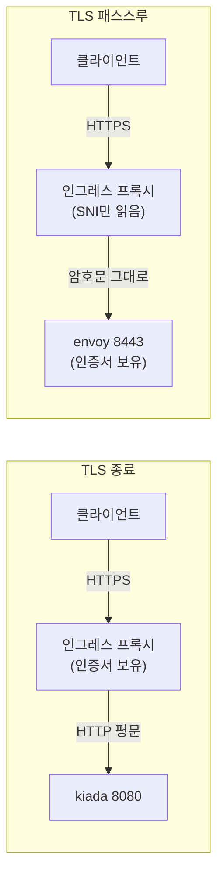
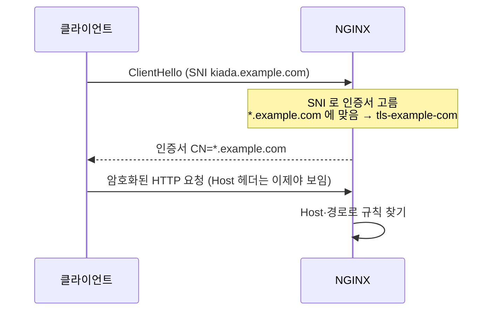

# 12.3 인그레스에 TLS 설정하기

[12.2절](<12.2 인그레스 만들고 사용하기.md>)까지는 모두 평문 HTTP였습니다. 실제 서비스라면 HTTPS가 기본입니다. 그런데 인그레스 앞에서 HTTPS를 받을 때는 먼저 정할 것이 있습니다. **암호를 누가 풀 것인가**입니다.

* **인그레스(프록시)가 푼다** — **TLS 종료(TLS Termination)**. 앱은 평문만 다룹니다
* **앱이 직접 푼다** — **TLS 패스스루(TLS Passthrough)**. 프록시는 암호문을 그대로 넘깁니다



| 비교 | TLS 종료 | TLS 패스스루 |
| :--- | :--- | :--- |
| **인증서가 있는 곳** | 인그레스가 참조하는 **Secret** | **앱(파드)** |
| **프록시가 볼 수 있는 것** | 경로, 헤더, 쿠키 전부 | **SNI(호스트 이름)뿐** |
| **경로 규칙·쿠키 어피니티** | 쓸 수 있음 | **쓸 수 없음** |
| **표준 인그레스 필드** | `spec.tls` | **없음** — 컨트롤러 기능(애노테이션) |

## 실습용 인증서 만들기 — openssl을 컨테이너로

`*.example.com`용 **자체 서명 인증서(self-signed certificate)** 를 만듭니다. openssl을 따로 설치하지 않고 컨테이너로 돌립니다.

```bash
podman run --rm -v "$PWD:/work" -w /work docker.io/alpine/openssl \
  req -x509 -newkey rsa:2048 -nodes -days 365 \
  -keyout example.key -out example.crt \
  -subj '/CN=*.example.com' \
  -addext 'subjectAltName=DNS:*.example.com,DNS:example.com'
```

* `-x509` — 인증 요청(CSR)이 아니라 **바로 인증서**를 만듭니다(자체 서명)
* `-nodes` — 개인 키를 암호로 잠그지 않습니다. 프록시가 사람 없이 읽어야 하니까요
* `-addext subjectAltName=…` — 요즘 클라이언트는 `CN`이 아니라 **SAN**을 보고 이름을 검사합니다. 꼭 넣으세요

> **Git Bash에서는 `MSYS_NO_PATHCONV=1`을 먼저 설정하세요.** Git Bash가 `/work`를 `C:/Program Files/Git/work`로 바꿔 버려서 `workdir "C:/Program Files/Git/work" does not exist` 에러가 납니다. `-v`의 왼쪽도 `$(cygpath -w $PWD)`처럼 Windows 경로로 줘야 합니다.

> **개인 키(`example.key`)는 어디에도 붙여 넣지 마세요.** 책의 예제 저장소에는 `secret.tls-example-com.yaml`에 키가 그대로 들어 있습니다. 실습 편의를 위한 것이지만 따라 하지 않는 편이 좋습니다. 이 노트도 키 내용은 싣지 않고 만드는 명령만 적었습니다.

만든 인증서를 확인합니다.

```bash
podman run --rm -v "$PWD:/work" -w /work docker.io/alpine/openssl \
  x509 -in example.crt -noout -subject -issuer -dates -ext subjectAltName
```

```
subject=CN=*.example.com
issuer=CN=*.example.com
notBefore=Oct  5 09:26:19 2026 GMT
notAfter=Oct  5 09:26:19 2027 GMT
X509v3 Subject Alternative Name: 
    DNS:*.example.com, DNS:example.com
```

`subject`와 `issuer`가 같습니다. **스스로 서명했다**는 뜻이고, 그래서 클라이언트는 이 인증서를 믿지 않습니다(아래에서 확인).

### TLS Secret 만들기

```bash
kubectl create secret tls tls-example-com --cert=example.crt --key=example.key
```

```
secret/tls-example-com created
```

```bash
kubectl describe secret tls-example-com
```

```
Data
====
tls.crt:  1176 bytes
tls.key:  1708 bytes
```

`kubernetes.io/tls` 타입 Secret은 **`tls.crt`와 `tls.key` 두 키**를 가져야 합니다. `kubectl create secret tls`가 알아서 이 이름으로 넣어 줍니다.

## TLS 패스스루 — 암호를 풀지 않고 그대로 넘기기

책은 패스스루를 먼저 설명합니다. 인그레스 API에는 패스스루를 적는 필드가 **없습니다.** 표준 인그레스는 "입구에서 TLS를 끝낸다"는 것만 정의하기 때문입니다. 그래서 컨트롤러마다 자기 방식으로 제공하고, ingress-nginx는 애노테이션으로 켭니다.

kiada 파드의 envoy 사이드카가 8443에서 직접 TLS를 처리합니다. 누가 응답했는지 구별하려고 envoy에는 **`CN=kiada.example.com`인 별도 인증서**를 넣었습니다(위와 같은 명령으로 만들고 Secret `kiada-tls`로 교체한 뒤 파드를 다시 만듦).

**ing.kiada-ssl-passthrough.nginx.yaml**

```yaml
apiVersion: networking.k8s.io/v1
kind: Ingress
metadata:
  name: kiada-ssl-passthrough
  annotations:
    nginx.ingress.kubernetes.io/backend-protocol: "HTTPS"
    nginx.ingress.kubernetes.io/ssl-redirect: "true"
    nginx.ingress.kubernetes.io/ssl-passthrough: "true"   # 암호를 풀지 말고 넘겨라
spec:
  tls:
  - secretName: tls-example-com
    hosts:
    - "*.example.com"
  defaultBackend:
    service:
      name: fun404
      port:
        name: http
  rules:
  - host: kiada.example.com
    http:
      paths:
      - path: /
        pathType: Prefix
        backend:
          service:
            name: kiada
            port:
              number: 443            # envoy 의 HTTPS 포트
```

같은 호스트·경로를 쓰는 `kiada` 인그레스가 있으면 웹훅에 막히므로 먼저 지웁니다.

```bash
kubectl delete ing kiada
kubectl apply -f ing.kiada-ssl-passthrough.nginx.yaml
```

```
ingress.networking.k8s.io "kiada" deleted from ch12 namespace
ingress.networking.k8s.io/kiada-ssl-passthrough created
```

### 애노테이션만으로는 켜지지 않습니다

누가 인증서를 내밀었는지 봅니다. Windows의 `curl`은 인증서 정보를 자세히 찍지 않아서, OpenSSL을 쓰는 노드 안의 `curl`로 확인했습니다.

```bash
podman exec kia-control-plane curl -k -v \
  --resolve kiada.example.com:443:127.0.0.1 https://kiada.example.com/ 2>&1 | grep -E ' subject:|^< HTTP'
```

```
*  subject: CN=*.example.com
< HTTP/2 200 
```

`CN=*.example.com` — **인그레스의 인증서**입니다. 패스스루가 아니라 NGINX가 TLS를 끝내고, `backend-protocol: HTTPS`에 따라 envoy로 **다시 암호화해서** 보낸 것입니다. 에러도 경고도 없이 애노테이션이 무시되었습니다.

> **ingress-nginx의 SSL 패스스루는 기본으로 꺼져 있습니다.** 공식 문서에 "SSL Passthrough is disabled by default and requires starting the controller with the `--enable-ssl-passthrough` flag."라고 적혀 있습니다. kind용 매니페스트에도 이 인자가 없습니다. 애노테이션을 달아도 **조용히 무시**되니 결과를 꼭 확인하세요.

컨트롤러 Deployment에 인자를 추가합니다.

```bash
kubectl patch deployment ingress-nginx-controller -n ingress-nginx --type json \
  -p '[{"op":"add","path":"/spec/template/spec/containers/0/args/-","value":"--enable-ssl-passthrough"}]'
kubectl rollout status deployment ingress-nginx-controller -n ingress-nginx
```

```
deployment.apps/ingress-nginx-controller patched
Waiting for deployment "ingress-nginx-controller" rollout to finish: 0 of 1 updated replicas are available...
deployment "ingress-nginx-controller" successfully rolled out
```

```bash
podman exec kia-control-plane curl -k -v \
  --resolve kiada.example.com:443:127.0.0.1 https://kiada.example.com/ 2>&1 | grep -E ' subject:|^< HTTP|processed by'
```

```
*  subject: CN=kiada.example.com
< HTTP/1.1 200 OK
Request processed by Kiada 0.5 running in pod "kiada-002" on node "kia-control-plane".
```

이번에는 **`CN=kiada.example.com`, envoy의 인증서**입니다. 응답도 HTTP/2가 아니라 envoy가 협상한 HTTP/1.1로 바뀌었습니다. NGINX는 TLS 첫 메시지의 SNI만 보고 kiada 서비스로 바이트를 그대로 넘겼습니다.

Windows 호스트에서도 envoy의 인증서를 믿을 인증서로 주면 검증까지 통과합니다.

```bash
curl -s --resolve kiada.example.com:443:127.0.0.1 --cacert kiada-pod.crt \
  https://kiada.example.com/ | grep 'processed by'
```

```
Request processed by Kiada 0.5 running in pod "kiada-001" on node "kia-control-plane".
```

> **패스스루에서는 프록시가 HTTP를 전혀 못 봅니다.** 경로 규칙, 헤더 조작, 쿠키 어피니티(12.4절) 같은 L7 기능이 모두 빠집니다. ingress-nginx 문서는 패스스루 트래픽이 **파드가 아니라 서비스의 ClusterIP로** 간다고도 밝힙니다. 꼭 앱이 TLS를 직접 끝내야 하는 경우(예: 클라이언트 인증서를 앱이 검사)에만 씁니다.

## 인그레스에서 TLS 끝내기 — `spec.tls`

이쪽이 표준입니다. 인그레스에 **`spec.tls`** 를 적으면 됩니다.

**ing.kiada.tls.yaml** (추가된 부분)

```yaml
spec:
  tls:
  - secretName: tls-example-com      # tls.crt / tls.key 를 가진 Secret
    hosts:
    - "*.example.com"                # 이 이름들에 이 인증서를 씀
  defaultBackend:
    ...                              # 나머지는 ing.kiada.defaultBackend.yaml 과 같음
  rules:
    ...
```

```bash
kubectl apply -f ing.kiada.tls.yaml
kubectl get ing
```

```
NAME    CLASS    HOSTS                               ADDRESS     PORTS     AGE
kiada   <none>   kiada.example.com,api.example.com   localhost   80, 443   106s
```

`PORTS`에 **443**이 붙었습니다.

```bash
kubectl describe ing kiada
```

```
TLS:
  tls-example-com terminates *.example.com
Rules:
  Host               Path  Backends
  ----               ----  --------
  kiada.example.com  
                     /   kiada:http (10.244.0.25:8080,10.244.0.26:8080)
```

`terminates` — "이 Secret으로 TLS를 **끝낸다**"고 그대로 적혀 있습니다. 백엔드는 `kiada:http`, 즉 **평문 8080**입니다.

### 자체 서명 인증서는 그냥은 믿지 않습니다

```bash
podman exec kia-control-plane curl -sS \
  --resolve kiada.example.com:443:127.0.0.1 https://kiada.example.com/
```

```
curl: (60) SSL certificate problem: self-signed certificate
More details here: https://curl.se/docs/sslcerts.html
```

검증을 건너뛰는 `-k`로 인증서 내용을 봅니다.

```bash
podman exec kia-control-plane curl -k -v \
  --resolve kiada.example.com:443:127.0.0.1 https://kiada.example.com/
```

```
* SSL connection using TLSv1.3 / TLS_AES_256_GCM_SHA384 / X25519MLKEM768 / RSASSA-PSS
* ALPN: server accepted h2
* Server certificate:
*  subject: CN=*.example.com
*  start date: Oct  5 09:26:19 2026 GMT
*  expire date: Oct  5 09:26:19 2027 GMT
*  issuer: CN=*.example.com
*  SSL certificate verify result: self-signed certificate (18), continuing anyway.
...
< HTTP/2 200 
```

우리가 만든 인증서가 맞고, NGINX가 HTTP/2까지 협상했습니다. `-k` 대신 **`--cacert example.crt`** 로 이 인증서를 믿게 하면 경고 없이 통과합니다. Windows의 `curl`에서도 됩니다.

```bash
curl -s --resolve kiada.example.com:443:127.0.0.1 --cacert example.crt https://kiada.example.com/ | head -1
```

```
KUBERNETES IN ACTION DEMO APPLICATION v0.5
```

### HTTP로 오면 HTTPS로 돌려보냅니다

```bash
curl -i --resolve kiada.example.com:80:127.0.0.1 http://kiada.example.com/
```

```
HTTP/1.1 308 Permanent Redirect
Date: Mon, 05 Oct 2026 09:30:59 GMT
Content-Type: text/html
Content-Length: 164
Connection: keep-alive
Location: https://kiada.example.com
```

ingress-nginx는 인그레스에 TLS가 설정되면 **HTTP 요청을 308로 HTTPS에 돌려보냅니다.** 끄려면 `nginx.ingress.kubernetes.io/ssl-redirect: "false"` 애노테이션을 씁니다. 이것은 컨트롤러 동작이지 인그레스 표준이 아닙니다.

### SNI가 안 맞으면 "가짜 인증서"가 나옵니다

TLS에서는 **암호를 풀기 전에** 인증서를 골라야 합니다. 그때는 아직 `Host` 헤더를 못 읽으니, 클라이언트가 TLS 첫 메시지에 실어 보내는 **SNI(Server Name Indication)** 로 고릅니다. `*.example.com`에 안 맞는 이름으로 접속해 봅니다.

```bash
podman exec kia-control-plane curl -k -v \
  --resolve other.example.org:443:127.0.0.1 https://other.example.org/ 2>&1 | grep ' subject:'
```

```
*  subject: O=Acme Co; CN=Kubernetes Ingress Controller Fake Certificate
```



맞는 Secret이 없으면 ingress-nginx는 자기 **기본 인증서("Fake Certificate")** 를 내밉니다. 브라우저에 이 이름이 보이면 **`spec.tls.hosts`나 SNI가 어긋난 것**입니다.

> **`-H 'Host: …'`로는 HTTPS를 제대로 시험할 수 없습니다.** 주소가 `127.0.0.1`이면 SNI에 호스트 이름이 실리지 않습니다.
> ```bash
> podman exec kia-control-plane curl -k -v -H 'Host: kiada.example.com' https://127.0.0.1/ 2>&1 | grep -E ' subject:|^< HTTP'
> ```
> ```
> *  subject: O=Acme Co; CN=Kubernetes Ingress Controller Fake Certificate
> < HTTP/2 200 
> ```
> 응답은 200이지만 **인증서는 가짜**입니다. 암호를 푼 뒤의 `Host` 헤더로 경로는 맞게 찾아갔지만, 인증서는 SNI로 골랐기 때문입니다. `-k` 없이 시험했다면 인증서 오류로 보였을 것입니다. HTTPS 시험에는 **`--resolve`** 를 쓰세요.

> **인그레스의 TLS는 443 하나뿐입니다.** 쿠버네티스 문서는 인그레스가 TLS 포트 **443 하나만** 지원하고, 여러 호스트는 **SNI로 같은 포트에서 나눈다**고 설명합니다. 프록시에서 파드까지는 **평문**이라는 점도 기억해 두세요.

## 요약 및 비유

| 개념 | 회사 우편실 비유 | 기술적 의미 |
| :--- | :--- | :--- |
| **TLS 종료** | 우편실이 봉투를 뜯어 내용을 보고 부서로 전달 | 프록시가 복호화하고 평문으로 파드에 전달 |
| **TLS 패스스루** | 봉인된 봉투를 수신자 이름만 보고 그대로 전달 | 프록시가 SNI만 보고 암호문을 넘김 |
| **TLS Secret** | 우편실이 가진 회사 직인 | `tls.crt` + `tls.key` |
| **자체 서명 인증서** | 내가 만든 도장으로 찍은 증명서 | 클라이언트가 기본으로 믿지 않음 |
| **SNI** | 봉투 겉면의 수신자 이름 | 암호를 풀기 전에 보이는 호스트 이름 |
| **Fake Certificate** | "수신자 불명" 임시 도장 | 맞는 인증서가 없을 때 쓰는 기본 인증서 |
| **308 리디렉트** | "등기 우편은 저쪽 창구로" | HTTP를 HTTPS로 돌려보냄 |
| **`--enable-ssl-passthrough`** | 봉인 우편 취급 허가증 | 없으면 패스스루 애노테이션이 무시됨 |

## 결론

* HTTPS를 받을 때는 **누가 암호를 풀지**부터 정합니다. 인그레스(TLS 종료)가 표준이고, 앱(패스스루)은 컨트롤러 확장 기능입니다.
* TLS 종료는 **`spec.tls`에 `tls.crt`/`tls.key`를 가진 Secret**을 적으면 됩니다. 프록시에서 파드까지는 평문입니다.
* ingress-nginx의 **패스스루는 `--enable-ssl-passthrough` 없이는 조용히 무시**됩니다. 인증서의 `subject`로 실제 동작을 확인하세요.
* 인증서는 **SNI로 고릅니다.** HTTPS 시험에는 `-H 'Host:'`가 아니라 **`curl --resolve`** 를 씁니다. 안 맞으면 "Fake Certificate"가 나옵니다.
* 실습 인증서는 **openssl 컨테이너**로 만들고, 개인 키는 노트나 저장소에 남기지 않습니다.

## 출처

> 2026-10-05 공식 문서로 검증

* 원서: *Kubernetes in Action, Second Edition* 12장 — <https://livebook.manning.com/book/kubernetes-in-action-second-edition/>
* [Ingress](https://kubernetes.io/docs/concepts/services-networking/ingress/) — Kubernetes 공식 문서
* [Secrets](https://kubernetes.io/docs/concepts/configuration/secret/) — Kubernetes 공식 문서
* [TLS/HTTPS - Ingress-Nginx Controller](https://kubernetes.github.io/ingress-nginx/user-guide/tls/) — ingress-nginx 공식 문서
* [Annotations - Ingress-Nginx Controller](https://kubernetes.github.io/ingress-nginx/user-guide/nginx-configuration/annotations/) — ingress-nginx 공식 문서
