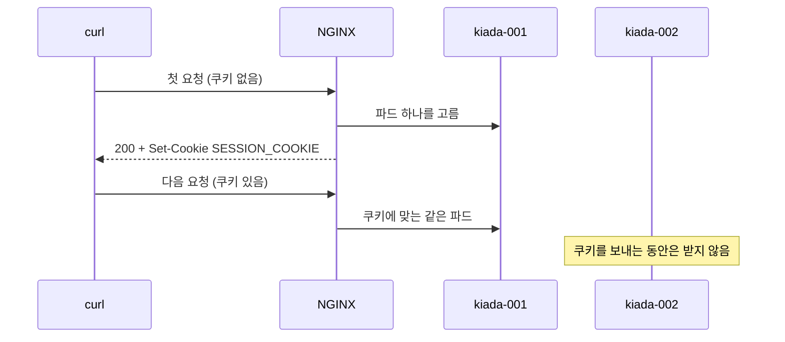
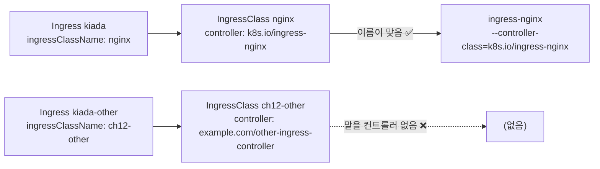

# 12.4 인그레스 추가 설정 옵션

[12.3절](<12.3 인그레스에 TLS 설정하기.md>)의 SSL 패스스루를 켤 때 인그레스 필드가 아니라 **애노테이션**을 썼습니다. 인그레스 API가 표준으로 정한 것은 호스트·경로·TLS·기본 백엔드 정도뿐이라, 그 밖의 기능은 컨트롤러마다 따로 제공합니다. 이 절에서는 그 확장 방법과, 컨트롤러가 여럿일 때 **어느 컨트롤러가 어느 인그레스를 맡을지** 정하는 **IngressClass**, 그리고 서비스가 아닌 백엔드를 가리키는 **리소스 백엔드**를 봅니다.

## 애노테이션으로 컨트롤러 기능을 켭니다

### 쿠키로 세션 고정하기

kiada 파드가 2개라서 요청이 번갈아 갑니다. 로그인 세션을 파드 메모리에 두는 앱이라면 곤란합니다. ingress-nginx는 **쿠키 기반 세션 어피니티(session affinity)** 를 애노테이션으로 켭니다.

**ing.kiada.affinity-nginx.yaml** (추가된 부분)

```yaml
metadata:
  name: kiada
  annotations:
    nginx.ingress.kubernetes.io/affinity: cookie                  # 쿠키로 파드 고정
    nginx.ingress.kubernetes.io/session-cookie-name: SESSION_COOKIE   # 쿠키 이름
spec:
  rules:                             # 규칙은 ing.kiada.yaml 과 같음
  ...
```

```bash
kubectl apply -f ing.kiada.affinity-nginx.yaml
R='--resolve kiada.example.com:80:127.0.0.1'
for i in 1 2 3 4; do curl -s $R http://kiada.example.com/ | grep -o 'pod "kiada-00[0-9]"'; done
```

```
pod "kiada-001"
pod "kiada-002"
pod "kiada-002"
pod "kiada-001"
```

쿠키 없이 보내면 여전히 번갈아 갑니다. 응답 헤더를 보면 쿠키를 하나 내려 줍니다.

```bash
curl -s -i $R http://kiada.example.com/ -c cookies.txt | head -7     # 쿠키를 파일에 저장
```

```
HTTP/1.1 200 OK
Date: Mon, 05 Oct 2026 09:33:32 GMT
Content-Type: text/plain
Transfer-Encoding: chunked
Connection: keep-alive
Set-Cookie: SESSION_COOKIE=1791192813.702.173.271579|b7a0ecc474cc40431c9808a84645d43b; Path=/; HttpOnly

```

```bash
for i in 1 2 3 4 5 6; do curl -s $R -b cookies.txt http://kiada.example.com/ | grep -o 'pod "kiada-00[0-9]"'; done
```

```
pod "kiada-001"
pod "kiada-001"
pod "kiada-001"
pod "kiada-001"
pod "kiada-001"
pod "kiada-001"
```

쿠키를 돌려보내면 **같은 파드로만** 갑니다. 프록시가 쿠키 값을 보고 처음 보냈던 파드를 다시 고르는 것입니다.



> **적용 직후 첫 요청은 404일 수 있습니다.** 이 실습에서도 `apply` 바로 뒤의 요청은 NGINX 404였고 몇 초 뒤부터 200이 왔습니다. 앞의 `kiada-ssl-passthrough` 인그레스를 지우고 새 인그레스를 만든 직후라 설정 reload가 끝나지 않았던 것입니다.

> **애노테이션은 컨트롤러마다 다릅니다.** 같은 쿠키 어피니티를 GKE 인그레스에서 하려면 애노테이션 이름부터 다르고(`cloud.google.com/backend-config`), 별도의 `BackendConfig` 커스텀 리소스까지 만들어야 합니다(책의 `ing.kiada.affinity-gke.yaml`). **컨트롤러를 바꾸면 애노테이션은 모두 다시 써야 합니다.** 이 이식성 문제가 Gateway API가 나온 큰 이유 중 하나입니다(13장).

> **모르는 애노테이션은 에러 없이 무시됩니다.** 오타가 나거나 다른 컨트롤러용 애노테이션을 붙여도 API 서버는 그냥 받아들입니다. 애노테이션은 그저 문자열이기 때문입니다. 12.3절의 패스스루처럼 **결과로 확인하는 습관**이 필요합니다.

## IngressClass — 어느 컨트롤러가 맡을까

한 클러스터에 인그레스 컨트롤러가 둘 이상 있을 수 있습니다. 예를 들어 바깥 공개용과 사내용을 따로 두는 경우입니다. 그럴 때 인그레스마다 담당 컨트롤러를 정하는 것이 **IngressClass**입니다.

```bash
kubectl get ingressclass nginx -o yaml
```

```
apiVersion: networking.k8s.io/v1
kind: IngressClass
metadata:
  ...
  name: nginx
spec:
  controller: k8s.io/ingress-nginx
```

`spec.controller`는 컨트롤러가 자기 것으로 알아보는 이름입니다. ingress-nginx는 `--controller-class=k8s.io/ingress-nginx`로 떠 있어서, **이 컨트롤러 이름을 가진 IngressClass를 쓰는 인그레스만** 처리합니다.



인그레스 쪽에서는 `spec.ingressClassName`으로 고릅니다.

**ing.kiada.ingressClassName.yaml** (바뀐 부분)

```yaml
spec:
  ingressClassName: nginx            # 이 클래스의 컨트롤러가 처리
  rules:
  ...
```

지금 `kiada` 인그레스는 클래스 없이 만든 것이라 `CLASS`가 `<none>`입니다. 이 필드를 채우는 것은 아래에서 다른 클래스와 나란히 놓고 해 봅니다.

### 아무도 맡지 않는 클래스를 고르면

컨트롤러가 없는 IngressClass를 하나 만들어 봅니다. 클러스터 전역 리소스라서 이름에 장 접두사를 붙였습니다.

**ingressclass.ch12-other.yaml**

```yaml
apiVersion: networking.k8s.io/v1
kind: IngressClass
metadata:
  name: ch12-other
spec:
  controller: example.com/other-ingress-controller    # 이 이름으로 떠 있는 컨트롤러는 없음
```

`ing.kiada.ingressClassName.yaml`의 클래스를 `ch12-other`로, 호스트를 `other.example.com`·`otherapi.example.com`으로 바꾼 `kiada-other` 인그레스를 만듭니다.

```bash
kubectl apply -f ingressclass.ch12-other.yaml
kubectl apply -f ing.kiada-other.yaml
kubectl get ing
```

```
NAME          CLASS        HOSTS                                    ADDRESS     PORTS   AGE
kiada         <none>       kiada.example.com,api.example.com        localhost   80      32s
kiada-other   ch12-other   other.example.com,otherapi.example.com               80      8s
```

`kiada-other`의 **`ADDRESS`가 끝내 비어 있습니다.** ingress-nginx 로그를 보면 일부러 무시했다고 남깁니다.

```bash
kubectl logs -n ingress-nginx deploy/ingress-nginx-controller | grep kiada-other
```

```
W1005 09:33:47.030250      11 controller.go:352] ignoring ingress kiada-other in ch12 based on annotation : no object matching key "ch12-other" in local store
I1005 09:33:47.030390      11 main.go:107] "successfully validated configuration, accepting" ingress="ch12/kiada-other"
I1005 09:33:47.039502      11 store.go:439] "Ignoring ingress because of error while validating ingress class" ingress="ch12/kiada-other" error="no object matching key \"ch12-other\" in local store"
```

```bash
curl -s -o /dev/null -w '%{http_code}\n' -H 'Host: other.example.com' http://127.0.0.1/
```

```
404
```

이제 `kiada` 인그레스에는 `nginx` 클래스를 명시합니다. `ing.kiada.ingressClassName.yaml`을 적용해도 되고, 필드 하나만 고쳐도 됩니다.

```bash
kubectl patch ing kiada --type merge -p '{"spec":{"ingressClassName":"nginx"}}'
kubectl get ing
```

```
ingress.networking.k8s.io/kiada patched
NAME          CLASS        HOSTS                                    ADDRESS     PORTS   AGE
kiada         nginx        kiada.example.com,api.example.com        localhost   80      34s
kiada-other   ch12-other   other.example.com,otherapi.example.com               80      10s
```

두 인그레스가 나란히 있지만 **`nginx` 클래스 쪽만 주소를 받았습니다.**

> **`ADDRESS`가 비어 있으면 "맡은 컨트롤러가 없다"를 먼저 의심하세요.** 인그레스는 만들어졌고 에러도 없습니다. 클래스 이름 오타, 컨트롤러 미설치, 컨트롤러의 `--controller-class`와 IngressClass의 `spec.controller` 불일치가 흔한 원인입니다.

### 기본 클래스 — 클래스를 안 적은 인그레스의 행선지

IngressClass에 **`ingressclass.kubernetes.io/is-default-class: "true"`** 애노테이션을 달면, **새로 만드는** 인그레스 중 `ingressClassName`이 없는 것에 이 클래스가 자동으로 채워집니다.

```bash
kubectl annotate ingressclass ch12-other ingressclass.kubernetes.io/is-default-class=true
kubectl get ingressclass
```

```
NAME                   CONTROLLER                             PARAMETERS   AGE
ch12-other (default)   example.com/other-ingress-controller   <none>       19s
nginx                  k8s.io/ingress-nginx                   <none>       9m2s
```

클래스를 적지 않은 인그레스(`no-class`, 호스트 `noclass.example.com`)를 만들어 봅니다.

```bash
kubectl apply -f ing.no-class.yaml
kubectl get ing no-class -o jsonpath='{.spec.ingressClassName}'
```

```
ch12-other
```

```bash
kubectl get ing
```

```
NAME          CLASS        HOSTS                                    ADDRESS     PORTS   AGE
kiada         nginx        kiada.example.com,api.example.com        localhost   80      44s
kiada-other   ch12-other   other.example.com,otherapi.example.com               80      20s
no-class      ch12-other   noclass.example.com                                  80      1s
```

매니페스트에는 없던 `ingressClassName: ch12-other`가 **저장될 때 채워졌습니다.** 쿠버네티스 문서에 따르면 이 일은 승인 단계의 `DefaultIngressClass` 플러그인이 합니다.

> **기본 클래스를 잘못 정하면 클래스 없는 인그레스가 전부 엉뚱한 곳으로 갑니다.** 이 실습의 ingress-nginx는 `--watch-ingress-without-class=true`로 클래스 없는 인그레스도 처리하지만, 기본 클래스가 `ch12-other`로 채워지는 순간 **"클래스 없는 인그레스"가 아니게 되어** ingress-nginx도 손을 놓습니다. 기본 클래스는 **클러스터에 하나만** 두세요.

실습이 끝났으니 애노테이션과 클래스를 지웁니다.

```bash
kubectl annotate ingressclass ch12-other ingressclass.kubernetes.io/is-default-class-
kubectl delete ing no-class kiada-other
kubectl delete ingressclass ch12-other
```

```
ingressclass.networking.k8s.io/ch12-other annotated
ingress.networking.k8s.io "no-class" deleted from ch12 namespace
ingress.networking.k8s.io "kiada-other" deleted from ch12 namespace
ingressclass.networking.k8s.io "ch12-other" deleted
```

### 클래스별 설정 — `spec.parameters`

IngressClass의 `spec.parameters`는 컨트롤러가 정의한 **설정 오브젝트를 가리키는 참조**입니다. 같은 컨트롤러로 "공개용 클래스", "사내용 클래스"를 따로 만들고 클래스마다 다른 설정을 줄 때 씁니다. 범위는 기본이 클러스터 전체(`Cluster`)이고 `scope: Namespace`로 네임스페이스 한정 설정을 가리킬 수도 있습니다. ingress-nginx 매니페스트의 `nginx` 클래스는 `PARAMETERS`가 `<none>`이라 이 기능은 실측하지 않았습니다.

> **옛 자료의 `kubernetes.io/ingress.class` 애노테이션은 지원 중단(deprecated)된 방식입니다.** IngressClass 리소스와 `ingressClassName` 필드가 생기기 전(1.18 이전)에 쓰던 것입니다. 새로 쓸 때는 `spec.ingressClassName`을 씁니다.

## 서비스가 아닌 백엔드 — 리소스 백엔드

`backend`에는 `service` 대신 **`resource`** 를 쓸 수도 있습니다. 같은 네임스페이스의 **다른 쿠버네티스 오브젝트**를 가리키는 참조입니다. 예를 들어 정적 파일을 담은 오브젝트 스토리지 버킷을 커스텀 리소스로 표현하고 그리로 보내는 식입니다. 무엇을 할 수 있는지는 전적으로 컨트롤러에 달렸습니다.

**ing.resource-backend-example.yaml**

```yaml
apiVersion: networking.k8s.io/v1
kind: Ingress
metadata:
  name: resource-backend-example
spec:
  rules:
  - host: resource-backend-example
    http:
      paths:
      - pathType: ImplementationSpecific
        backend:
          resource:                  # 서비스 대신 다른 오브젝트 참조
            apiGroup: citrix.com
            kind: HTTPRoute
            name: example-http-route
```

책의 예는 Citrix 인그레스 컨트롤러의 커스텀 리소스를 가리킵니다. ingress-nginx에 그대로 적용하면 어떻게 될까요?

```bash
kubectl apply -f ing.resource-backend-example.yaml
kubectl describe ing resource-backend-example
```

```
Rules:
  Host                      Path  Backends
  ----                      ----  --------
  resource-backend-example  
                               APIGroup: citrix.com, Kind: HTTPRoute, Name: example-http-route
Annotations:                <none>
Events:
  Type    Reason  Age   From                      Message
  ----    ------  ----  ----                      -------
  Normal  Sync    2s    nginx-ingress-controller  Scheduled for sync
```

가리키는 `citrix.com` 리소스는 이 클러스터에 아예 없지만 **API 서버도 웹훅도 받아들였습니다.** 컨트롤러가 주소까지 붙입니다.

```bash
kubectl get ing resource-backend-example
curl -s -i -H 'Host: resource-backend-example' http://127.0.0.1/ | head -1
```

```
NAME                       CLASS    HOSTS                      ADDRESS     PORTS   AGE
resource-backend-example   <none>   resource-backend-example   localhost   80      11s
HTTP/1.1 404 Not Found
```

생성된 NGINX 설정을 보면 이 호스트의 `location /`이 `upstream-default-backend`, 즉 컨트롤러 기본 404로 연결되어 있었습니다. **ingress-nginx는 리소스 백엔드를 처리하지 않고 기본 백엔드로 돌립니다.**

`service`와 `resource`를 한 백엔드에 함께 적으면 API 서버가 막습니다.

```yaml
  defaultBackend:
    service:
      name: fun404
      port:
        name: http
    resource:
      apiGroup: example.com
      kind: Bucket
      name: static
```

```
The Ingress "bad-backend" is invalid: spec.defaultBackend: Invalid value: "": cannot set both resource and service backends
```

| 백엔드 | 가리키는 것 | 누가 해석하나 |
| :--- | :--- | :--- |
| **`service`** | 같은 네임스페이스의 서비스와 포트 | 모든 컨트롤러 |
| **`resource`** | 같은 네임스페이스의 임의 오브젝트(apiGroup, kind, name) | **지원하는 컨트롤러만** — 둘 중 하나만 적을 수 있음 |

## 요약 및 비유

| 개념 | 배달 앱 비유 | 기술적 의미 |
| :--- | :--- | :--- |
| **애노테이션** | 주문서의 "요청 사항" 칸 | 컨트롤러 전용 설정을 적는 자유 문자열 |
| **쿠키 어피니티** | "지난번 그 가게에서 또" | 쿠키로 같은 파드에 고정 |
| **다른 컨트롤러의 애노테이션** | 다른 앱의 쿠폰 코드 | 에러 없이 무시됨 |
| **IngressClass** | 배달 대행 업체 선택 | 어느 컨트롤러가 처리할지 |
| **`spec.controller`** | 업체 고유 코드 | 컨트롤러가 자기 것으로 알아보는 이름 |
| **주소 없는 인그레스** | 받아 간 기사가 없는 주문 | 맡은 컨트롤러가 없음 |
| **기본 IngressClass** | "업체 미지정 시 자동 배정" | 클래스 없는 새 인그레스에 자동 채움 |
| **리소스 백엔드** | 가게 대신 "무인 픽업함"으로 보내기 | 서비스가 아닌 오브젝트를 백엔드로 |

## 결론

* 인그레스 표준에 없는 기능은 **컨트롤러별 애노테이션**으로 켭니다. 컨트롤러를 바꾸면 **모두 다시 써야** 하고, 틀려도 **에러 없이 무시**됩니다.
* ingress-nginx의 `affinity: cookie`는 **쿠키로 같은 파드에 고정**합니다. 쿠키를 돌려보내야 효과가 있습니다.
* **IngressClass**가 인그레스와 컨트롤러를 잇습니다. 맡을 컨트롤러가 없으면 인그레스는 **`ADDRESS` 없이** 그대로 남습니다.
* **`is-default-class`** 애노테이션이 붙은 클래스는 클래스 없는 **새** 인그레스에 자동으로 채워집니다. 기본 클래스는 하나만 두세요.
* **리소스 백엔드**는 서비스 대신 다른 오브젝트를 가리키지만, ingress-nginx는 이를 처리하지 않고 기본 백엔드(404)로 돌렸습니다.

## 출처

> 2026-10-05 공식 문서로 검증

* 원서: *Kubernetes in Action, Second Edition* 12장 — <https://livebook.manning.com/book/kubernetes-in-action-second-edition/>
* [Ingress](https://kubernetes.io/docs/concepts/services-networking/ingress/) — Kubernetes 공식 문서
* [Ingress Controllers](https://kubernetes.io/docs/concepts/services-networking/ingress-controllers/) — Kubernetes 공식 문서
* [Admission Control in Kubernetes](https://kubernetes.io/docs/reference/access-authn-authz/admission-controllers/) — Kubernetes 공식 문서
* [Annotations - Ingress-Nginx Controller](https://kubernetes.github.io/ingress-nginx/user-guide/nginx-configuration/annotations/) — ingress-nginx 공식 문서
