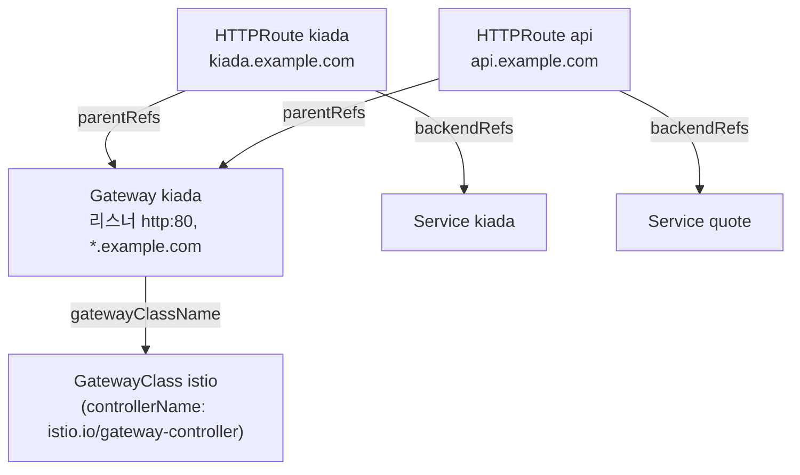
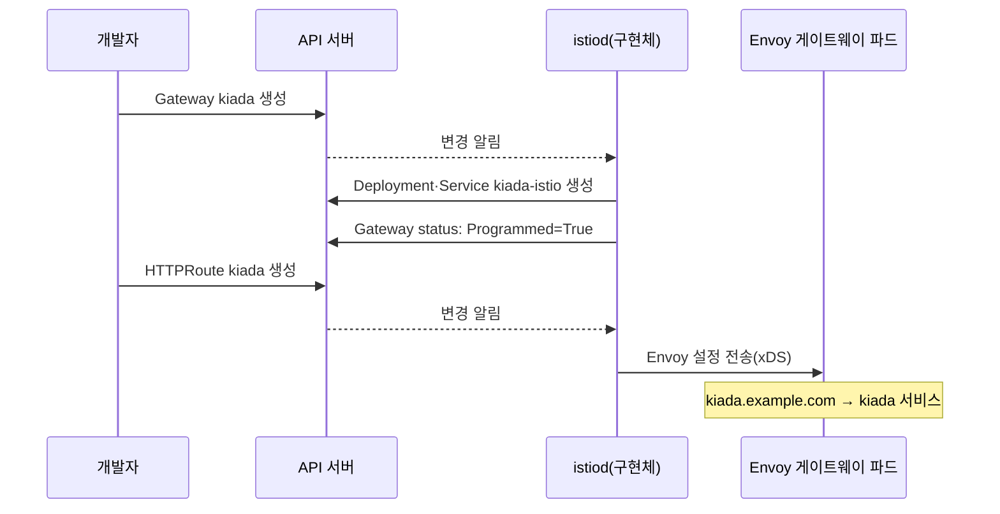

# 13.1 Gateway API 알아보기

12장에서 인그레스로 여러 HTTP 서비스를 입구 하나에 묶었습니다. 그런데 쓰다 보면 벽에 부딪힙니다. SSL 패스스루도, 쿠키 어피니티도 **표준에는 없어서 컨트롤러별 애노테이션**으로 해야 했습니다. TCP나 UDP는 아예 다룰 수 없습니다. 입구 설정과 앱별 라우팅이 한 오브젝트에 섞여 있어서 **누가 무엇을 고칠 권한이 있는지 나누기도 어렵습니다.**

이 문제들을 풀려고 처음부터 다시 설계한 것이 **Gateway API**입니다. 쿠버네티스 문서는 Gateway API를 **인그레스의 후속(successor)** 이라고 부르고, 지금은 새로 시작한다면 인그레스 대신 이것을 쓰라고 권합니다.

> **"Gateway API도 쿠버네티스에 기본으로 들어 있나요?"** 아닙니다. Gateway API는 쿠버네티스 SIG Network가 만드는 공식 API지만 **CRD로 따로 설치**합니다([3.1절](<../03장. 쿠버네티스 API와 오브젝트 모델 살펴보기/3.1 쿠버네티스 API 이해하기.md>)에서 "CRD로 API를 확장하는 대표 사례"로 짚었습니다). 그리고 인그레스처럼 **구현체(컨트롤러)도 따로** 설치해야 동작합니다.

## 인그레스와 무엇이 다른가 — 오브젝트를 역할별로 나눴습니다

인그레스는 오브젝트 하나에 "어떤 입구를 열지"와 "어떤 요청을 어디로 보낼지"가 다 들어 있었습니다. Gateway API는 이것을 **세 층**으로 쪼갰습니다.

| 오브젝트 | 정하는 것 | 주로 다루는 사람 | 범위 |
| :--- | :--- | :--- | :--- |
| **GatewayClass** | 어떤 구현체(컨트롤러)를 쓸지 | 인프라 제공자 | 클러스터 전역 |
| **Gateway** | 어떤 포트·프로토콜·호스트로 입구를 열지(리스너) | 클러스터 운영자 | 네임스페이스 |
| **HTTPRoute 등 라우트** | 어떤 요청을 어느 서비스로 보낼지 | 앱 개발자 | 네임스페이스 |



화살표 방향을 보세요. **라우트가 Gateway를 가리킵니다(`parentRefs`).** 인그레스는 규칙이 입구 안에 들어 있었지만, Gateway API에서는 앱 개발자가 자기 네임스페이스에서 라우트를 만들어 **운영자가 연 입구에 "붙입니다(attach)".** 입구는 운영자가, 라우팅은 개발자가 따로 관리할 수 있습니다.

| 비교 | 인그레스 | Gateway API |
| :--- | :--- | :--- |
| **설치** | API는 내장, 컨트롤러만 설치 | **CRD와 구현체 모두 설치** |
| **역할 분리** | 오브젝트 하나 | **GatewayClass / Gateway / Route** |
| **프로토콜** | HTTP/HTTPS | HTTP, HTTPS, **gRPC, TLS, TCP, UDP** |
| **트래픽 분할·미러링·헤더 조작** | 컨트롤러 애노테이션 | **표준 필드** (13.3절) |
| **TLS 패스스루** | 컨트롤러 애노테이션 | **표준 필드** (`tls.mode: Passthrough`, 13.4절) |
| **네임스페이스를 넘는 참조** | 불가 | **허락(ReferenceGrant)을 받아 가능** (13.3절) |
| **상태 보고** | `ADDRESS` 정도 | 오브젝트마다 **조건(Accepted, Programmed, ResolvedRefs …)** |
| **API 상태** | 동결(frozen) | 계속 발전 중 |

> **"표준 필드"라고 모든 구현체가 다 지원하는 것은 아닙니다.** Gateway API는 기능마다 **지원 수준(Core / Extended / Implementation-specific)** 을 나눕니다. Core는 모든 구현체가 지원하는 것을 목표로 하는 기능이고, Extended는 이식성은 있지만 구현체마다 지원 여부가 다른 기능, Implementation-specific은 특정 구현체 전용 기능입니다. 13.5절에서 Istio가 UDP를 지원하지 않는 것을 직접 확인합니다.

## 구현체 — Gateway를 실제 프록시로 바꾸는 것

Gateway API 오브젝트도 인그레스처럼 **규칙을 적은 종이**일 뿐입니다. 그 종이를 읽고 프록시를 만드는 것이 **구현체(implementation)**, 즉 Gateway 컨트롤러입니다. 구현체는 자기가 처리하는 GatewayClass의 `controllerName`을 보고 자기 몫을 알아봅니다.

구현체가 Gateway를 실현하는 방식은 두 갈래입니다.

* **클라우드 로드 밸런서를 설정** — GKE, AWS 같은 클라우드 구현체. Gateway 하나가 클라우드 로드 밸런서 하나가 됩니다
* **클러스터 안에 프록시를 띄움** — Istio, Envoy Gateway, Contour 등. 이 장에서 쓰는 Istio는 **Gateway마다 Envoy 프록시 Deployment와 Service를 자동으로 만듭니다**(13.2절)



구현체 목록과 버전별 **적합성(conformance) 보고서**는 Gateway API 사이트에 있습니다. v1.6 보고서에는 Istio 1.31, Envoy Gateway v1.9.0, kgateway, Cilium, Kong 등이 올라 있습니다. 어떤 기능을 지원하는지도 기능별로 표시되어 있으니 구현체를 고를 때 꼭 보세요.

## Istio를 구현체로 설치하기

책은 구현체로 **Istio**를 씁니다. Istio는 서비스 메시지만, Gateway API 구현체로만 써도 됩니다. 이 노트도 책을 따릅니다. 무거우면 다른 구현체로 바꿀 생각이었는데, 아래처럼 단일 노드에서도 가볍게 돌아서 그대로 썼습니다.

### 1) Gateway API CRD 설치 — v1.6.2 표준 채널

```bash
kubectl get crd gateways.gateway.networking.k8s.io       # 이미 있는지 먼저 확인
```

```
Error from server (NotFound): customresourcedefinitions.apiextensions.k8s.io "gateways.gateway.networking.k8s.io" not found
```

kind 클러스터에는 기본으로 없습니다. [3.1절](<../03장. 쿠버네티스 API와 오브젝트 모델 살펴보기/3.1 쿠버네티스 API 이해하기.md>)에서 적어 둔 **v1.6.2 표준(standard) 채널**을 설치합니다.

```bash
kubectl apply -f https://github.com/kubernetes-sigs/gateway-api/releases/download/v1.6.2/standard-install.yaml
```

```
customresourcedefinition.apiextensions.k8s.io/backendtlspolicies.gateway.networking.k8s.io created
customresourcedefinition.apiextensions.k8s.io/gatewayclasses.gateway.networking.k8s.io created
customresourcedefinition.apiextensions.k8s.io/gateways.gateway.networking.k8s.io created
customresourcedefinition.apiextensions.k8s.io/grpcroutes.gateway.networking.k8s.io created
customresourcedefinition.apiextensions.k8s.io/httproutes.gateway.networking.k8s.io created
customresourcedefinition.apiextensions.k8s.io/listenersets.gateway.networking.k8s.io created
customresourcedefinition.apiextensions.k8s.io/referencegrants.gateway.networking.k8s.io created
customresourcedefinition.apiextensions.k8s.io/tcproutes.gateway.networking.k8s.io created
customresourcedefinition.apiextensions.k8s.io/tlsroutes.gateway.networking.k8s.io created
customresourcedefinition.apiextensions.k8s.io/udproutes.gateway.networking.k8s.io created
validatingadmissionpolicy.admissionregistration.k8s.io/safe-upgrades.gateway.networking.k8s.io created
validatingadmissionpolicybinding.admissionregistration.k8s.io/safe-upgrades.gateway.networking.k8s.io created
```

**왜 v1.6.2인가요?** Istio 1.31 문서는 `ref=v1.6.0`으로 CRD를 설치하라고 안내합니다. v1.6.2는 **같은 v1.6의 패치 릴리스**라서 API 구성이 같고, Gateway API의 v1.6 적합성 보고서에 Istio 1.31이 올라 있습니다. 그래서 저장소의 다른 절(3.1절)과 버전을 맞춰 v1.6.2를 썼습니다.

```bash
kubectl api-resources --api-group=gateway.networking.k8s.io
```

```
NAME                 SHORTNAMES   APIVERSION                     NAMESPACED   KIND
backendtlspolicies   btlspolicy   gateway.networking.k8s.io/v1   true         BackendTLSPolicy
gatewayclasses       gc           gateway.networking.k8s.io/v1   false        GatewayClass
gateways             gtw          gateway.networking.k8s.io/v1   true         Gateway
grpcroutes                        gateway.networking.k8s.io/v1   true         GRPCRoute
httproutes                        gateway.networking.k8s.io/v1   true         HTTPRoute
listenersets         lset         gateway.networking.k8s.io/v1   true         ListenerSet
referencegrants      refgrant     gateway.networking.k8s.io/v1   true         ReferenceGrant
tcproutes                         gateway.networking.k8s.io/v1   true         TCPRoute
tlsroutes                         gateway.networking.k8s.io/v1   true         TLSRoute
udproutes                         gateway.networking.k8s.io/v1   true         UDPRoute
```

**모든 종류가 `v1`입니다.** 책은 TCPRoute·UDPRoute·TLSRoute를 `v1alpha2`로 쓰고 이것들을 얻으려고 **실험(experimental) 채널**을 설치했습니다. 지금은 표준 채널만으로 다 들어 있습니다(아래 업데이트 절). `gatewayclasses`가 `NAMESPACED false`인 것도 보세요. GatewayClass만 클러스터 전역입니다.

> **함께 설치된 `safe-upgrades` 정책은 지우지 마세요.** v1.5부터 CRD와 함께 **ValidatingAdmissionPolicy**가 들어옵니다. 표준 CRD 위에 실험 CRD를 덮어쓰거나 v1.5 미만으로 내리는 것을 막아 줍니다.

### 2) istioctl 받기

Windows용 `istioctl`은 Istio GitHub 릴리스에서 받습니다. 받은 파일은 같이 올라온 `.sha256`으로 확인합니다.

```bash
curl -sSLO https://github.com/istio/istio/releases/download/1.31.1/istioctl-1.31.1-win-amd64.zip
curl -sSLO https://github.com/istio/istio/releases/download/1.31.1/istioctl-1.31.1-win-amd64.zip.sha256
cat istioctl-1.31.1-win-amd64.zip.sha256; sha256sum istioctl-1.31.1-win-amd64.zip
unzip istioctl-1.31.1-win-amd64.zip
./istioctl.exe version --remote=false
```

```
e77f2c192b54aab2ed480745bedc081b3cedecf177e357a4ea9e739634818f9f istioctl-1.31.1-win-amd64.zip
e77f2c192b54aab2ed480745bedc081b3cedecf177e357a4ea9e739634818f9f *istioctl-1.31.1-win-amd64.zip
client version: 1.31.1
```

### 3) 설치 전 점검과 설치 — minimal 프로필

```bash
istioctl x precheck
```

```
✔ No issues found when checking the cluster. Istio is safe to install or upgrade!
  To get started, check out https://istio.io/latest/docs/setup/getting-started/.
```

```bash
istioctl install --set profile=minimal -y
```

```
✔ Istio core installed ⛵️
- Processing resources for Istiod.
- Processing resources for Istiod. Waiting for Deployment/istio-system/istiod
✔ Istiod installed 🧠
- Pruning removed resources
✔ Installation complete
```

**minimal 프로필**은 Istio 문서의 설명대로 **컨트롤 플레인(istiod)만** 설치합니다. 기본(default) 프로필에 들어 있는 `istio-ingressgateway`가 빠집니다. Gateway API에서는 Gateway를 만들 때 게이트웨이 프록시가 따로 생기므로 미리 띄워 둘 필요가 없습니다. Istio의 Gateway API 문서도 이 프로필로 설치하라고 안내합니다.

```bash
kubectl get pods,svc -n istio-system
istioctl version
```

```
NAME                          READY   STATUS    RESTARTS   AGE
pod/istiod-79b44d979f-xlvq9   1/1     Running   0          20s

NAME                                  TYPE        CLUSTER-IP      EXTERNAL-IP   PORT(S)                                 AGE
service/istiod                        ClusterIP   10.96.252.100   <none>        15010/TCP,15012/TCP,443/TCP,15014/TCP   20s
service/istiod-revision-tag-default   ClusterIP   10.96.113.241   <none>        15010/TCP,15012/TCP,443/TCP,15014/TCP   0s
client version: 1.31.1
control plane version: 1.31.1
data plane version: none
```

`data plane version: none` — 아직 Envoy 프록시가 하나도 없다는 뜻입니다. 13.2절에서 Gateway를 만들면 생깁니다.

### 4) GatewayClass가 자동으로 생깁니다

```bash
kubectl get gatewayclass
```

```
NAME           CONTROLLER                    ACCEPTED   AGE
istio          istio.io/gateway-controller   True       5s
istio-remote   istio.io/unmanaged-gateway    True       5s
```

Istio가 설치되면서 GatewayClass를 직접 만들었습니다. `ACCEPTED True`는 **컨트롤러가 이 클래스를 맡겠다고 응답했다**는 뜻입니다. 우리는 `istio` 클래스를 씁니다.

### 단일 노드에서도 무겁지 않았습니다

istiod는 요청(requests)이 큽니다.

```bash
kubectl get deploy istiod -n istio-system -o jsonpath='{.spec.template.spec.containers[0].resources}'
```

```
{"requests":{"cpu":"500m","memory":"2Gi"}}
```

메모리 **2Gi를 예약**합니다. 스케줄러가 이만큼 빈 노드를 찾으므로, 작은 노드에서는 istiod가 `Pending`에 머물 수 있습니다. 실습 노드는 16GB·18코어라 문제없었습니다. 실제 사용량은 훨씬 작았습니다. Gateway 두 개를 띄운 상태에서 노드의 `crictl stats`로 본 값입니다.

```
CONTAINER           NAME                      CPU %               MEM                 DISK                INODES              SWAP
7fa93ba6229fe       istio-proxy               0.42                31.35MB             86.02kB             19                  0B
b6f96864d5cd6       istio-proxy               0.37                29.71MB             86.02kB             19                  0B
ba2c00375efc7       discovery                 0.94                50.74MB             57.34kB             14                  0B
```

`discovery`가 istiod, `istio-proxy` 둘이 게이트웨이 Envoy입니다. Istio 문서의 Docker Desktop 안내는 **Istio와 예제 앱 Bookinfo**를 함께 돌리려면 메모리 8GB·CPU 4개를 권하지만, 게이트웨이만 쓰는 이 실습은 그보다 훨씬 적게 들었습니다.

> **이 클러스터(1.37)는 Istio 1.31의 공식 지원 범위 밖입니다.** Istio 1.31은 쿠버네티스 **1.32~1.36**을 공식 지원합니다. `precheck`는 문제없다고 했고 이 장의 실습도 모두 동작했지만, 운영 클러스터라면 지원 범위 안의 조합을 고르세요.

## 요약 및 비유

| 개념 | 공항 비유 | 기술적 의미 |
| :--- | :--- | :--- |
| **GatewayClass** | 공항을 운영하는 공사 | 어떤 구현체가 게이트웨이를 만들지 |
| **Gateway** | 터미널과 그 출입구 | 포트·프로토콜·호스트로 연 입구(리스너) |
| **HTTPRoute** | 항공사의 탑승구 배정표 | 요청을 어느 서비스로 보낼지 |
| **`parentRefs`** | 항공사가 "이 터미널을 쓰겠다"고 신청 | 라우트가 Gateway에 붙음 |
| **구현체(istiod)** | 관제탑 | 오브젝트를 읽고 프록시를 설정 |
| **Envoy 게이트웨이 파드** | 실제 보안 검색대와 게이트 | 트래픽을 받는 프록시 |
| **CRD 설치** | 공항 건설 허가 | Gateway API 종류를 클러스터에 추가 |
| **역할 분리** | 공사·항공사·승객이 각자 할 일 | 인프라 / 운영자 / 개발자 |

## 결론

* Gateway API는 **인그레스의 후속**입니다. 쿠버네티스 프로젝트는 새로 시작한다면 인그레스 대신 이것을 쓰라고 권합니다.
* 오브젝트를 **GatewayClass(구현체) / Gateway(입구) / Route(라우팅)** 로 나눠서 역할별로 관리할 수 있습니다. **라우트가 Gateway를 가리킵니다.**
* 트래픽 분할, 헤더 조작, TLS 패스스루, TCP·UDP·gRPC가 **애노테이션이 아니라 표준 필드**입니다. 다만 구현체마다 지원 범위가 다릅니다.
* **CRD와 구현체를 모두 설치**해야 합니다. 지금은 **v1.6 표준 채널**에 책이 실험 채널에서 쓰던 종류가 전부 `v1`로 들어 있습니다.
* Istio는 `istioctl install --set profile=minimal`로 **istiod만** 설치하고, GatewayClass `istio`를 직접 만듭니다. istiod는 **메모리 2Gi를 요청**하니 작은 노드에서는 확인하세요.

## 공식 문서 업데이트 (2026년 10월 기준)

### 1) 책이 실험 채널에서 쓰던 종류가 모두 표준 채널 `v1`이 되었습니다 (가장 큰 변화)

책은 `kubectl apply -k github.com/kubernetes-sigs/gateway-api/config/crd/experimental`로 **실험 채널**을 설치하고 TCPRoute·UDPRoute·TLSRoute·GRPCRoute를 `v1alpha2`로 썼습니다. 지금은 다릅니다.

| 종류 | 책 | 지금 (v1.6) |
| :--- | :--- | :--- |
| **GRPCRoute** | `v1alpha2` | `v1` (표준) |
| **TLSRoute** | `v1alpha2` | `v1` (v1.5에서 표준으로) |
| **ReferenceGrant** | `v1beta1` | `v1` (v1.5에서 승격, `v1beta1`도 아직 제공) |
| **TCPRoute·UDPRoute** | `v1alpha2` | `v1` (v1.6에서 GA, `v1alpha2`는 지원 중단) |
| **ListenerSet** | 없음 | `v1` (v1.5에서 표준으로) |

표준 채널만 설치한 클러스터에 책의 `v1alpha2` 매니페스트를 그대로 넣으면 이렇게 거부됩니다(13.4절에서 실측).

```
error: resource mapping not found for name: "kiada" namespace: "" from "tlsroute.kiada.yaml": no matches for kind "TLSRoute" in version "gateway.networking.k8s.io/v1alpha2"
ensure CRDs are installed first
```

`apiVersion`을 `gateway.networking.k8s.io/v1`로 바꾸면 됩니다.

참고: <https://kubernetes.io/blog/2026/08/03/gateway-api-v1-6-release/>

### 2) CRD와 함께 업그레이드 안전장치가 설치됩니다

v1.5부터 `safe-upgrades.gateway.networking.k8s.io` ValidatingAdmissionPolicy가 같이 설치됩니다. 표준 CRD 위에 실험 CRD를 설치하거나 v1.5 미만으로 내리는 것을 막습니다. 실험 채널 CRD는 크기가 커서 `kubectl apply --server-side=true`로 설치해야 한다는 안내도 릴리스 노트에 있습니다.

참고: <https://github.com/kubernetes-sigs/gateway-api/releases/tag/v1.5.0>

### 3) 인그레스는 동결되었고, Gateway API로 옮기는 길이 정리되었습니다

* 쿠버네티스 문서가 인그레스 대신 Gateway 사용을 권하고, 인그레스 API는 동결되었습니다([12.1절](<../12장. 인그레스로 서비스에 트래픽 라우팅하기/12.1 인그레스 알아보기.md>))
* 인그레스 매니페스트를 Gateway API로 바꿔 주는 **ingress2gateway**가 2026년 3월에 1.0이 되었습니다
* Gateway API 사이트에 **인그레스에서 옮기기**, **ingress-nginx 사용자를 위한 안내** 문서가 따로 생겼습니다
* kind 문서는 **cloud-provider-kind**가 인그레스와 함께 Gateway API도 기본 지원한다고 안내합니다

참고: <https://kubernetes.io/docs/concepts/services-networking/gateway/>

### 4) Istio 1.31의 공식 지원 범위는 쿠버네티스 1.32~1.36입니다

이 노트의 클러스터(1.37)는 범위 밖이지만 실습은 모두 동작했습니다. Istio 문서의 Gateway API 안내는 CRD를 `v1.6.0`으로 설치하라고 합니다.

참고: <https://istio.io/latest/docs/releases/supported-releases/>

## 출처

> 2026-10-05 공식 문서로 검증

* 원서: *Kubernetes in Action, Second Edition* 13장 — <https://livebook.manning.com/book/kubernetes-in-action-second-edition/>
* [Gateway API](https://kubernetes.io/docs/concepts/services-networking/gateway/) — Kubernetes 공식 문서
* [Ingress](https://kubernetes.io/docs/concepts/services-networking/ingress/) — Kubernetes 공식 문서
* [Gateway API v1.6: TCPRoute and UDPRoute Graduate to Standard](https://kubernetes.io/blog/2026/08/03/gateway-api-v1-6-release/) — Kubernetes 공식 블로그
* [Gateway API v1.5: Moving features to Stable](https://kubernetes.io/blog/2026/04/21/gateway-api-v1-5/) — Kubernetes 공식 블로그
* [Announcing Ingress2Gateway 1.0: Your Path to Gateway API](https://kubernetes.io/blog/2026/03/20/ingress2gateway-1-0-release/) — Kubernetes 공식 블로그
* [API Overview](https://gateway-api.sigs.k8s.io/docs/concepts/api-overview/) — Gateway API 공식 문서
* [Roles and Personas](https://gateway-api.sigs.k8s.io/docs/concepts/roles-and-personas/) — Gateway API 공식 문서
* [Versioning](https://gateway-api.sigs.k8s.io/docs/concepts/versioning/) — Gateway API 공식 문서
* [Conformance](https://gateway-api.sigs.k8s.io/docs/concepts/conformance/) — Gateway API 공식 문서
* [Implementations](https://gateway-api.sigs.k8s.io/docs/implementations/list/) — Gateway API 공식 문서
* [v1.6](https://gateway-api.sigs.k8s.io/docs/implementations/versions/v1.6/) — Gateway API 적합성 보고서
* [Migrating from Ingress](https://gateway-api.sigs.k8s.io/guides/getting-started/migrating-from-ingress/) — Gateway API 공식 문서
* [Release v1.6.2 · kubernetes-sigs/gateway-api](https://github.com/kubernetes-sigs/gateway-api/releases/tag/v1.6.2) — Gateway API 릴리스
* [Release v1.5.0 · kubernetes-sigs/gateway-api](https://github.com/kubernetes-sigs/gateway-api/releases/tag/v1.5.0) — Gateway API 릴리스
* [Kubernetes Gateway API](https://istio.io/latest/docs/tasks/traffic-management/ingress/gateway-api/) — Istio 공식 문서
* [Installation Configuration Profiles](https://istio.io/latest/docs/setup/additional-setup/config-profiles/) — Istio 공식 문서
* [Supported Releases](https://istio.io/latest/docs/releases/supported-releases/) — Istio 공식 문서
* [Docker Desktop](https://istio.io/latest/docs/setup/platform-setup/docker/) — Istio 공식 문서
* [kind – Ingress](https://kind.sigs.k8s.io/docs/user/ingress/) — kind 공식 문서
