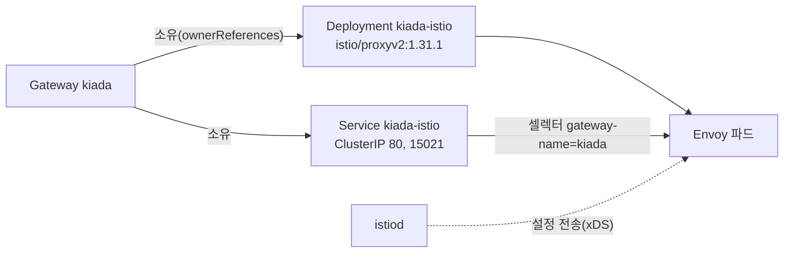
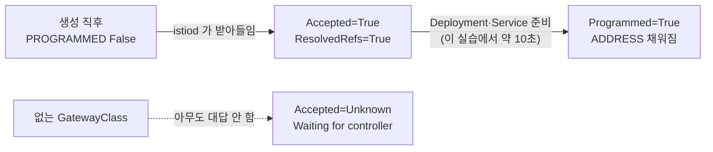

# 13.2 Gateway 배포하기

[13.1절](<13.1 Gateway API 알아보기.md>)에서 Gateway API CRD와 Istio를 설치했고, `istio` GatewayClass가 생긴 것까지 봤습니다. 이제 실제 입구인 **Gateway**를 만듭니다. 인그레스와 가장 다른 점은 **Gateway를 만들면 프록시가 새로 생긴다**는 것입니다. 그리고 그 결과를 **status의 조건(condition)** 으로 아주 자세히 알려 줍니다.

## GatewayClass — 어느 구현체가 맡을지

```bash
kubectl get gatewayclass istio -o yaml
```

```
spec:
  controllerName: istio.io/gateway-controller
  description: The default Istio GatewayClass
status:
  conditions:
  - lastTransitionTime: "2026-10-05T09:47:36Z"
    message: Handled by Istio controller
    observedGeneration: 1
    reason: Accepted
    status: "True"
    type: Accepted
```

* **`spec.controllerName`** — 이 클래스를 맡을 컨트롤러의 이름입니다. 인그레스의 IngressClass `spec.controller`와 같은 역할입니다
* **`status.conditions[Accepted]`** — 컨트롤러가 "내가 맡겠다"고 적어 둔 것입니다. 인그레스에는 없던 확인 수단입니다

GatewayClass는 클러스터 전역 리소스이고, 보통 구현체가 설치될 때 만들어집니다. **사용자가 직접 만들 일은 드뭅니다.**

> **없는 클래스를 고른 Gateway는 "Waiting for controller"에 머뭅니다.** 아무 컨트롤러도 맡지 않으니 누구도 상태를 바꿔 주지 않습니다.
> ```yaml
> spec:
>   gatewayClassName: ch13-no-such-class
> ```
> ```
> NAME        CLASS                ADDRESS   PROGRAMMED   AGE
> bad-class   ch13-no-such-class             Unknown      4s
> ```
> ```
> Accepted=Unknown Pending: Waiting for controller
> Programmed=Unknown Pending: Waiting for controller
> ```
> `False`가 아니라 **`Unknown`** 입니다. "거절당했다"가 아니라 "아직 아무도 대답하지 않았다"는 뜻입니다.

## Gateway 만들기

실습 앱은 [12.2절](<../12장. 인그레스로 서비스에 트래픽 라우팅하기/12.2 인그레스 만들고 사용하기.md>)과 같은 것(kiada 2개, quote, quiz, fun404)에, 13.3절의 트래픽 분할용으로 **`kiada-new` 파드(`docker.io/luksa/kiada:0.5.1`)와 서비스 `kiada-stable`·`kiada-new`** 를 더했습니다.

```
NAME            READY   STATUS    RESTARTS   AGE   IP            NODE                NOMINATED NODE   READINESS GATES
pod/fun404      1/1     Running   0          9s    10.244.0.92   kia-control-plane   <none>           <none>
pod/kiada-001   2/2     Running   0          9s    10.244.0.93   kia-control-plane   <none>           <none>
pod/kiada-002   2/2     Running   0          9s    10.244.0.94   kia-control-plane   <none>           <none>
pod/kiada-new   2/2     Running   0          8s    10.244.0.95   kia-control-plane   <none>           <none>
pod/quiz        2/2     Running   0          8s    10.244.0.98   kia-control-plane   <none>           <none>
pod/quote-001   2/2     Running   0          8s    10.244.0.96   kia-control-plane   <none>           <none>

NAME                   TYPE        CLUSTER-IP      EXTERNAL-IP   PORT(S)          AGE   SELECTOR
service/fun404         ClusterIP   10.96.71.130    <none>        80/TCP           9s    app=fun404
service/kiada          ClusterIP   10.96.29.198    <none>        80/TCP,443/TCP   8s    app=kiada
service/kiada-new      ClusterIP   10.96.41.212    <none>        80/TCP,443/TCP   8s    app=kiada,rel=new
service/kiada-stable   ClusterIP   10.96.88.88     <none>        80/TCP,443/TCP   8s    app=kiada,rel=stable
service/quiz           ClusterIP   10.96.51.41     <none>        80/TCP           8s    app=quiz
service/quote          ClusterIP   10.96.241.181   <none>        80/TCP           8s    app=quote
```

`kiada` 서비스의 셀렉터는 `app=kiada`뿐이라 **`kiada-new`까지 포함**합니다. `kiada-stable`은 `rel=stable`인 두 파드만 고릅니다.

### 책의 Gateway에 한 줄을 더했습니다

**gtw.kiada.yaml**

```yaml
apiVersion: gateway.networking.k8s.io/v1
kind: Gateway
metadata:
  name: kiada
  labels:
    suite: kiada
  annotations:
    networking.istio.io/service-type: ClusterIP   # 책에 없는 줄 — 아래 설명
spec:
  gatewayClassName: istio            # 어느 구현체가 만들지
  listeners:                         # 입구 목록
  - name: http                       # 라우트가 sectionName 으로 고를 때 쓰는 이름
    port: 80
    protocol: HTTP
    hostname: '*.example.com'        # 이 리스너가 받을 호스트
```

**리스너(listener)** 가 Gateway의 핵심입니다. "몇 번 포트에서, 어떤 프로토콜로, 어떤 호스트 이름을 받는다"를 적습니다. 리스너는 여러 개 둘 수 있습니다(13.4절, 13.5절).

> **왜 `service-type: ClusterIP`를 붙였나요?** Istio는 Gateway마다 Service를 만드는데 기본 타입이 **`LoadBalancer`** 입니다. 이 클러스터에는 같은 노드에서 함께 돌던 11장 실습이 설치한 MetalLB가 있어서, 그대로 두면 **11장의 주소 풀에서 IP를 가져가** 다른 실습의 결과를 바꿉니다. 로드 밸런서가 아예 없는 kind라면 외부 주소가 붙지 않습니다. Istio의 시작하기 문서도 로드 밸런서가 필요 없을 때 **이 애노테이션으로 ClusterIP로 바꾸라고** 안내합니다.

```bash
kubectl apply -f gtw.kiada.yaml
kubectl get gtw
```

```
NAME    CLASS   ADDRESS   PROGRAMMED   AGE
kiada   istio             False        0s
```

```bash
kubectl wait --for=condition=programmed gateways.gateway.networking.k8s.io kiada --timeout=180s
kubectl get gtw
```

```
gateway.gateway.networking.k8s.io/kiada condition met
NAME    CLASS   ADDRESS                              PROGRAMMED   AGE
kiada   istio   kiada-istio.ch13.svc.cluster.local   True         11s
```

처음엔 `PROGRAMMED False`였다가 **11초 만에 `True`** 가 되었습니다. `ADDRESS`에는 Service의 DNS 이름이 찍혔습니다. 로드 밸런서라면 외부 IP가 찍혔을 자리입니다.

> **Istio를 깔면 `Gateway`라는 종류가 둘이 됩니다.** Istio 자체 API에도 `Gateway`가 있습니다.
> ```bash
> kubectl api-resources | grep -E '^gateways'
> ```
> ```
> gateways                            gtw          gateway.networking.k8s.io/v1      true         Gateway
> gateways                            gw           networking.istio.io/v1            true         Gateway
> ```
> 짧은 이름 `gtw`는 Gateway API 쪽, `gw`는 Istio 쪽입니다. 이 실습에서 `kubectl get gateway`는 Gateway API 쪽을 보여 줬지만, 스크립트처럼 확실해야 하는 곳에서는 `gateways.gateway.networking.k8s.io`처럼 그룹까지 적는 것이 안전합니다. 그래서 위 `kubectl wait`에 긴 이름을 썼습니다.

### Gateway 하나에 Deployment와 Service가 하나씩 생깁니다

```bash
kubectl get deploy,pod,svc -l gateway.networking.k8s.io/gateway-name=kiada -o wide
```

```
NAME                          READY   UP-TO-DATE   AVAILABLE   AGE   CONTAINERS    IMAGES                           SELECTOR
deployment.apps/kiada-istio   1/1     1            1           12s   istio-proxy   docker.io/istio/proxyv2:1.31.1   gateway.networking.k8s.io/gateway-name=kiada

NAME                               READY   STATUS    RESTARTS   AGE   IP            NODE                NOMINATED NODE   READINESS GATES
pod/kiada-istio-74cb6958cd-tvdxn   1/1     Running   0          12s   10.244.0.99   kia-control-plane   <none>           <none>

NAME                  TYPE        CLUSTER-IP     EXTERNAL-IP   PORT(S)            AGE   SELECTOR
service/kiada-istio   ClusterIP   10.96.65.134   <none>        15021/TCP,80/TCP   12s   gateway.networking.k8s.io/gateway-name=kiada
```

이름이 **`<Gateway 이름>-<GatewayClass 이름>`**, 즉 `kiada-istio`입니다. Istio 문서에 적힌 규칙 그대로입니다. 리스너의 80 포트가 Service에 그대로 열렸고, 15021은 Istio의 상태 확인용 포트입니다.

```bash
kubectl get deploy kiada-istio -o jsonpath='{.metadata.ownerReferences}'
kubectl get deploy kiada-istio -o jsonpath='{.spec.template.spec.containers[0].resources}'
```

```
[{"apiVersion":"gateway.networking.k8s.io/v1","kind":"Gateway","name":"kiada","uid":"2bbfb2c3-a26b-46fb-abbd-3508374db422"}]
{"limits":{"cpu":"2","memory":"1Gi"},"requests":{"cpu":"100m","memory":"128Mi"}}
```

* **소유자가 Gateway**입니다. Gateway를 지우면 Deployment와 Service도 함께 지워집니다
* 게이트웨이 프록시는 CPU 100m·메모리 128Mi를 요청합니다. istiod(2Gi)보다 훨씬 가볍습니다



> **생성된 Deployment를 직접 고치지 마세요.** Gateway가 바뀔 때마다 Istio가 다시 맞춰 놓습니다. 고치려면 Gateway의 **`spec.infrastructure`** 를 씁니다(아래).

### 호스트의 127.0.0.1로 들어가려면 — `infrastructure.parametersRef`

ingress-nginx는 hostPort 80/443을 걸어서 Windows에서 `curl http://127.0.0.1`로 바로 들어갔습니다([12.1절](<../12장. 인그레스로 서비스에 트래픽 라우팅하기/12.1 인그레스 알아보기.md>)). Istio의 게이트웨이 파드는 hostPort를 쓰지 않습니다. 같은 효과를 내려고 Gateway의 **`infrastructure.parametersRef`** 로 생성될 Deployment에 hostPort를 더했습니다. Istio는 여기에 **같은 네임스페이스의 ConfigMap**을 받아서, 그 안의 `deployment`·`service` 등을 생성 리소스에 덧씌웁니다.

**cm.kiada-gtw-options.yaml**

```yaml
apiVersion: v1
kind: ConfigMap
metadata:
  name: kiada-gtw-options
data:
  deployment: |                      # 생성될 Deployment 에 덧씌울 내용
    spec:
      template:
        spec:
          containers:
          - name: istio-proxy
            ports:
            - containerPort: 80
              hostPort: 80           # 노드의 80 → 게이트웨이 80
              protocol: TCP
            - containerPort: 443
              hostPort: 443          # 13.4절의 HTTPS 용
              protocol: TCP
```

**gtw.kiada.yaml** (추가된 부분)

```yaml
spec:
  gatewayClassName: istio
  infrastructure:
    parametersRef:                   # 구현체별 추가 설정
      group: ""
      kind: ConfigMap
      name: kiada-gtw-options
  listeners:
  ...
```

```bash
kubectl apply -f cm.kiada-gtw-options.yaml -f gtw.kiada.yaml
kubectl rollout status deploy/kiada-istio
kubectl get deploy kiada-istio -o jsonpath='{.spec.template.spec.containers[0].ports}'
```

```
configmap/kiada-gtw-options created
gateway.gateway.networking.k8s.io/kiada configured
Waiting for deployment "kiada-istio" rollout to finish: 1 old replicas are pending termination...
Waiting for deployment "kiada-istio" rollout to finish: 1 old replicas are pending termination...
deployment "kiada-istio" successfully rolled out
[{"containerPort":80,"hostPort":80,"protocol":"TCP"},{"containerPort":443,"hostPort":443,"protocol":"TCP"},{"containerPort":15020,"name":"metrics","protocol":"TCP"},{"containerPort":15021,"name":"status-port","protocol":"TCP"},{"containerPort":15090,"name":"http-envoy-prom","protocol":"TCP"}]
```

Gateway를 고치자 Istio가 Deployment를 다시 만들어 파드가 교체되었습니다. 이제 Windows에서 바로 들어갑니다.

```bash
curl -i -H 'Host: kiada.example.com' http://127.0.0.1/
```

```
HTTP/1.1 404 Not Found
date: Mon, 05 Oct 2026 09:50:31 GMT
server: istio-envoy
content-length: 0
```

**`server: istio-envoy`** 가 응답했습니다. 404인 것은 아직 라우트가 없어서입니다. ingress-nginx는 HTML 404 페이지를 줬지만 Envoy는 **본문 없는 404**를 줍니다.

> **hostPort는 이 실습을 위한 편법입니다.** 노드 하나의 포트를 직접 쓰므로 게이트웨이 파드를 여러 개로 늘리면 같은 노드에 둘째 파드가 뜨지 못합니다. 실제로는 클라우드 로드 밸런서나 MetalLB, cloud-provider-kind 같은 것으로 `LoadBalancer` Service에 주소를 받습니다.

## Gateway의 상태 읽기

```bash
kubectl get gtw kiada -o yaml
```

```
status:
  addresses:
  - type: Hostname
    value: kiada-istio.ch13.svc.cluster.local
  conditions:
  - lastTransitionTime: "2026-10-05T09:49:39Z"
    message: Resource accepted
    observedGeneration: 1
    reason: Accepted
    status: "True"
    type: Accepted
  - lastTransitionTime: "2026-10-05T09:49:49Z"
    message: Resource programmed, assigned to service(s) kiada-istio.ch13.svc.cluster.local:80
    observedGeneration: 1
    reason: Programmed
    status: "True"
    type: Programmed
  - lastTransitionTime: "2026-10-05T09:49:39Z"
    message: All references resolved
    observedGeneration: 1
    reason: ResolvedRefs
    status: "True"
    type: ResolvedRefs
  listeners:
  - attachedRoutes: 0
    conditions:
    - lastTransitionTime: "2026-10-05T09:49:39Z"
      message: No errors found
      observedGeneration: 1
      reason: Accepted
      status: "True"
      type: Accepted
    - lastTransitionTime: "2026-10-05T09:49:39Z"
      message: No errors found
      observedGeneration: 1
      reason: NoConflicts
      status: "False"
      type: Conflicted
    - lastTransitionTime: "2026-10-05T09:49:39Z"
      message: No errors found
      observedGeneration: 1
      reason: Programmed
      status: "True"
      type: Programmed
    - lastTransitionTime: "2026-10-05T09:49:39Z"
      message: No errors found
      observedGeneration: 1
      reason: ResolvedRefs
      status: "True"
      type: ResolvedRefs
    name: http
    supportedKinds:
    - group: gateway.networking.k8s.io
      kind: HTTPRoute
    - group: gateway.networking.k8s.io
      kind: GRPCRoute
```

상태는 **Gateway 전체**와 **리스너별**, 두 층입니다.



| 조건 | `True`의 뜻 | 문제일 때 |
| :--- | :--- | :--- |
| **Accepted** | 구현체가 이 Gateway(리스너)를 받아들임 | 설정이 잘못됐거나 지원하지 않음 |
| **Programmed** | 실제 프록시에 설정이 들어가 트래픽을 받을 수 있음 | 아직 준비 중, 주소 없음, 잘못된 TLS 등 |
| **ResolvedRefs** | 가리키는 것(Secret 등)을 모두 찾음 | 없는 Secret, 허락 안 된 참조 |
| **Conflicted** | (`False`가 정상) 다른 리스너와 충돌 없음 | 같은 포트에 맞지 않는 리스너 |

리스너 쪽의 두 필드가 특히 쓸모 있습니다.

* **`attachedRoutes`** — 이 리스너에 붙은 라우트 수. 지금은 0입니다. 13.3절에서 라우트를 붙이면 1이 됩니다. **"라우트를 만들었는데 왜 안 되지?"** 할 때 가장 먼저 볼 숫자입니다
* **`supportedKinds`** — 이 리스너에 붙일 수 있는 라우트 종류. HTTP 리스너라서 HTTPRoute와 GRPCRoute뿐입니다. TLS 리스너에는 TLSRoute만 붙습니다(13.4절)

> **`observedGeneration`으로 "이 상태가 최신인가"를 확인합니다.** Gateway를 고치면 `metadata.generation`이 올라가고, 컨트롤러가 처리한 뒤에야 조건의 `observedGeneration`이 따라 올라옵니다. 둘이 다르면 아직 반영 전입니다.

## 요약 및 비유

| 개념 | 항구 비유 | 기술적 의미 |
| :--- | :--- | :--- |
| **GatewayClass** | 항구를 운영하는 해운사 | `controllerName`으로 구현체를 지정 |
| **Gateway** | 새로 짓는 부두 | 리스너 묶음. 만들면 프록시가 생김 |
| **리스너** | 부두의 선석(배 대는 자리) | 포트 + 프로토콜 + 호스트 |
| **`kiada-istio` Deployment** | 해운사가 배치한 하역 크레인 | Gateway마다 생기는 Envoy 프록시 |
| **`infrastructure.parametersRef`** | 크레인 사양 요청서 | 생성 리소스를 덧씌우는 구현체별 설정 |
| **Accepted** | 해운사가 부두 운영을 맡겠다고 회신 | 구현체가 받아들임 |
| **Programmed** | 크레인 설치 완료, 입항 가능 | 프록시가 트래픽을 받을 준비 완료 |
| **`attachedRoutes`** | 선석에 배정된 항로 수 | 리스너에 붙은 라우트 수 |
| **Unknown "Waiting for controller"** | 아무 해운사도 회신 없음 | 없는 GatewayClass |

## 결론

* GatewayClass는 **`controllerName`으로 구현체를 지정**하고, 구현체가 `Accepted`로 응답합니다. 보통 구현체가 직접 만듭니다.
* Gateway의 핵심은 **리스너(포트·프로토콜·호스트)** 입니다. Istio는 Gateway마다 **`<Gateway>-<GatewayClass>` 이름의 Deployment와 Service**를 만들고, 소유자는 Gateway입니다.
* Istio가 만드는 Service는 기본이 **`LoadBalancer`** 입니다. 로드 밸런서가 없거나 다른 실습과 겹치면 **`networking.istio.io/service-type: ClusterIP`** 로 바꿉니다.
* 생성 리소스는 직접 고치지 말고 **`spec.infrastructure`** 로 조정합니다. 이 실습은 `parametersRef` ConfigMap으로 hostPort를 더해 `127.0.0.1`로 들어갔습니다.
* 상태는 **Gateway·리스너 두 층의 조건**으로 읽습니다. 라우트가 안 먹으면 **`attachedRoutes`** 부터, 없는 클래스는 **`Unknown`** 입니다.

## 출처

> 2026-10-05 공식 문서로 검증

* 원서: *Kubernetes in Action, Second Edition* 13장 — <https://livebook.manning.com/book/kubernetes-in-action-second-edition/>
* [Gateway API](https://kubernetes.io/docs/concepts/services-networking/gateway/) — Kubernetes 공식 문서
* [API Overview](https://gateway-api.sigs.k8s.io/docs/concepts/api-overview/) — Gateway API 공식 문서
* [Gateway](https://gateway-api.sigs.k8s.io/reference/) — Gateway API 레퍼런스
* [Gateway infrastructure labels and annotations](https://gateway-api.sigs.k8s.io/guides/user-guides/infrastructure/) — Gateway API 공식 문서
* [Kubernetes Gateway API](https://istio.io/latest/docs/tasks/traffic-management/ingress/gateway-api/) — Istio 공식 문서
* [Getting Started](https://istio.io/latest/docs/setup/getting-started/) — Istio 공식 문서
