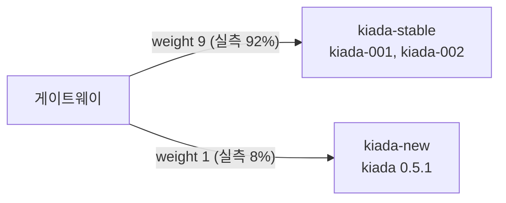
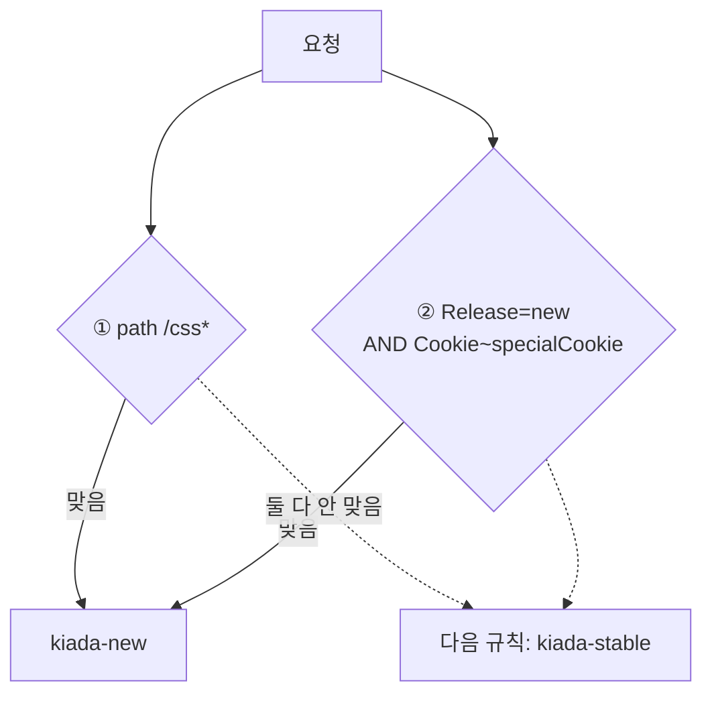
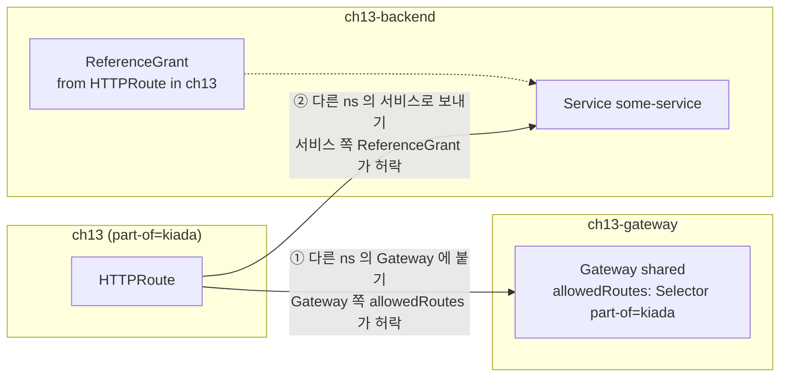

# 13.3 HTTPRoute로 HTTP 서비스 노출하기

[13.2절](<13.2 Gateway 배포하기.md>)에서 연 입구는 아직 아무 데로도 보내지 않아서 404만 돌려줍니다. 이제 **HTTPRoute**를 붙입니다. 인그레스의 호스트·경로 규칙과 비슷하지만, 인그레스에서는 애노테이션으로 하던 **트래픽 분할, 헤더 조작, 리디렉트, 미러링**이 모두 표준 필드로 들어 있습니다.

## 가장 단순한 HTTPRoute

**httproute.kiada.yaml**

```yaml
apiVersion: gateway.networking.k8s.io/v1
kind: HTTPRoute
metadata:
  name: kiada
spec:
  parentRefs:                        # 어느 Gateway 에 붙을지
  - name: kiada
  hostnames:                         # 어떤 Host 를 받을지
  - kiada.example.com
  rules:
  - backendRefs:                     # 어디로 보낼지
    - name: kiada
      port: 80
```

인그레스와 비교하면 이렇습니다.

| 인그레스 | HTTPRoute |
| :--- | :--- |
| `rules[].host` | **`hostnames[]`** (라우트 전체에 한 번) |
| `paths[].path` + `pathType` | **`rules[].matches[].path`** (`Exact`, `PathPrefix`, `RegularExpression`) |
| `backend.service.name/port` | **`backendRefs[].name/port`** |
| (없음 — 컨트롤러 쪽에서 정함) | **`parentRefs`** — 붙을 Gateway를 라우트가 고름 |

```bash
kubectl apply -f httproute.kiada.yaml
kubectl get httproute
```

```
NAME    HOSTNAMES               AGE
kiada   ["kiada.example.com"]   1s
```

```bash
curl -i --resolve kiada.example.com:80:127.0.0.1 http://kiada.example.com/
```

```
HTTP/1.1 200 OK
content-type: text/plain
date: Mon, 05 Oct 2026 09:50:39 GMT
x-envoy-upstream-service-time: 12
server: istio-envoy
transfer-encoding: chunked

KUBERNETES IN ACTION DEMO APPLICATION v0.5
(중략)
==== REQUEST INFO
Request processed by Kiada 0.5 running in pod "kiada-001" on node "kia-control-plane".
Pod hostname: kiada-001; Pod IP: 10.244.0.93; Node IP: 10.89.0.2; Client IP: ::ffff:10.244.0.100
```

`Client IP: 10.244.0.100`은 게이트웨이 Envoy 파드입니다. `x-envoy-upstream-service-time`은 Envoy가 백엔드 응답을 기다린 시간(밀리초)입니다.

### 생략한 필드에는 기본값이 채워집니다

```bash
kubectl get httproute kiada -o jsonpath='{.spec.rules[0]}'
```

```
{"backendRefs":[{"group":"","kind":"Service","name":"kiada","port":80,"weight":1}],"matches":[{"path":{"type":"PathPrefix","value":"/"}}]}
```

* `matches`를 안 적으면 **`PathPrefix /`**, 즉 모든 경로입니다
* `backendRefs`의 종류는 기본이 **Service**이고 가중치는 **1**입니다

### 상태로 "붙었는지" 확인합니다

```bash
kubectl get httproute kiada -o yaml
```

```
status:
  parents:
  - conditions:
    - lastTransitionTime: "2026-10-05T09:50:38Z"
      message: Route was valid
      observedGeneration: 1
      reason: Accepted
      status: "True"
      type: Accepted
    - lastTransitionTime: "2026-10-05T09:50:38Z"
      message: All references resolved
      observedGeneration: 1
      reason: ResolvedRefs
      status: "True"
      type: ResolvedRefs
    controllerName: istio.io/gateway-controller
    parentRef:
      group: gateway.networking.k8s.io
      kind: Gateway
      name: kiada
```

```bash
kubectl get gtw kiada -o jsonpath='{.status.listeners[0].attachedRoutes}'
```

```
1
```

라우트의 상태는 **붙으려는 Gateway(parent)마다** 따로 적힙니다. Gateway 쪽에서는 `attachedRoutes`가 0에서 **1**이 되었습니다.

### 실패 사례 — 호스트가 안 맞거나, 백엔드가 없거나

**httproute.bad-hostname.yaml** / **httproute.bad-backend.yaml** (요지)

```yaml
  hostnames:
  - kiada.example.org                # 리스너는 *.example.com 만 받음
---
  hostnames:
  - nobackend.example.com
  rules:
  - backendRefs:
    - name: no-such-service          # 없는 서비스
      port: 80
```

```bash
kubectl get httproute bad-hostname -o jsonpath='{range .status.parents[0].conditions[*]}{.type}={.status} {.reason}: {.message}{"\n"}{end}'
kubectl get httproute bad-backend  -o jsonpath='{range .status.parents[0].conditions[*]}{.type}={.status} {.reason}: {.message}{"\n"}{end}'
```

```
Accepted=False NoMatchingListenerHostname: no hostnames matched parent hostname "*.example.com"
ResolvedRefs=True ResolvedRefs: All references resolved

Accepted=True Accepted: Route was valid
ResolvedRefs=False BackendNotFound: backend(no-such-service.ch13.svc.cluster.local) not found
```

```bash
curl -s -i -H 'Host: nobackend.example.com' http://127.0.0.1/ | head -1
curl -s -i --resolve kiada.example.org:80:127.0.0.1 http://kiada.example.org/ | head -1
```

```
HTTP/1.1 500 Internal Server Error
HTTP/1.1 404 Not Found
```

| 상황 | 라우트 상태 | 요청 결과 |
| :--- | :--- | :--- |
| **호스트가 리스너와 안 맞음** | `Accepted=False` (`NoMatchingListenerHostname`) | 붙지 않음 → **404** |
| **백엔드 서비스 없음** | `Accepted=True`, `ResolvedRefs=False` (`BackendNotFound`) | 붙었지만 보낼 곳이 없음 → **500** |

> **404와 500을 구별하세요.** 404면 "라우트가 안 붙었다(호스트·경로·parentRefs)", 500이면 "라우트는 붙었는데 백엔드가 이상하다"입니다. 인그레스 때보다 원인을 훨씬 빨리 좁힐 수 있습니다. 상태 메시지가 원인을 거의 그대로 말해 줍니다.

## 트래픽 나누기 — `weight`

새 버전(`kiada-new`, kiada 0.5.1)에 트래픽 10%만 보내 봅니다. **카나리(canary) 배포**의 기본입니다.

**httproute.kiada.splitting.yaml**

```yaml
  rules:
  - backendRefs:
    - name: kiada-stable
      port: 80
      weight: 9                      # 9 / (9+1) = 90%
    - name: kiada-new
      port: 80
      weight: 1                      # 1 / (9+1) = 10%
```

```bash
kubectl apply -f httproute.kiada.splitting.yaml
for i in $(seq 1 100); do
  curl -s --resolve kiada.example.com:80:127.0.0.1 http://kiada.example.com/ \
    | grep -o 'Kiada 0.5[.0-9]* running in pod "[a-z0-9-]*"'
done | sort | uniq -c
```

```
     41 Kiada 0.5 running in pod "kiada-001"
     51 Kiada 0.5 running in pod "kiada-002"
      8 Kiada 0.5.1 running in pod "kiada-new"
```

100번 중 **92번이 stable, 8번이 new**입니다. 가중치는 **요청 단위의 확률**이라 정확히 90:10으로 떨어지지는 않습니다. `weight`는 비율일 뿐이라 `90`과 `10`으로 적어도 같습니다. `weight: 0`이면 그 백엔드로는 보내지 않고, 생략하면 1입니다(명세). 백엔드 일부가 잘못되었으면 그 몫의 요청만 500이 됩니다.



> **인그레스에는 이 기능이 표준에 없었습니다.** ingress-nginx는 `canary` 애노테이션을 단 인그레스를 따로 하나 더 만드는 방식이었습니다. Gateway API에서는 백엔드 목록에 가중치를 다는 것으로 끝납니다.

## 요청 내용으로 다른 백엔드에 보내기 — `matches`

`rules[].matches`에 조건을 적으면 경로뿐 아니라 **헤더, 쿼리 파라미터, HTTP 메서드**로도 고를 수 있습니다. 책의 예제를 하나씩 적용해 봤습니다. 결과를 짧게 보려고 응답 첫 줄(앱 버전)만 찍는 함수를 씁니다.

```bash
ver() { curl -s --resolve kiada.example.com:80:127.0.0.1 "$@" | head -1; }
```

### 경로 — `Exact`, `PathPrefix`, `RegularExpression`

**httproute.kiada.path-exact.yaml** (rules 부분)

```yaml
  rules:
  - matches:
    - path:
        type: Exact
        value: /quote
    backendRefs:
    - name: quote
      port: 80
  - backendRefs:                     # 조건 없는 규칙 = 나머지 전부
    - name: kiada-stable
      port: 80
```

```bash
for p in /quote /quote/ /; do
  echo "$p -> $(curl -s -o /tmp/o -w '%{http_code}' --resolve kiada.example.com:80:127.0.0.1 http://kiada.example.com$p) $(head -c 50 /tmp/o | tr '\n' ' ')"
done
```

```
/quote -> 200 Executing the `kubectl describe` command without s
/quote/ -> 200 "If you’re unable to access the service via the 
/ -> 200 KUBERNETES IN ACTION DEMO APPLICATION v0.5  ==== T
```

`/quote/`도 200이라 헷갈립니다. 응답 모양이 다릅니다(앞에 큰따옴표). 로그를 보면 이 요청은 **`Exact`에 안 맞아 둘째 규칙(kiada-stable)으로 갔고**, kiada 앱이 자기 `/quote/` 처리로 quote 서비스를 다시 불러 준 것이었습니다.

```
[pod/kiada-001/kiada] 2026-10-05T09:52:50.063Z Received request for /quote/ from ::ffff:10.244.0.100
```

> **"200이 왔다"만으로 라우팅이 맞았다고 단정하지 마세요.** 나머지를 받는 규칙이 있으면 매칭이 틀려도 대개 200이 옵니다. 백엔드 로그나 응답 내용으로 **누가 받았는지** 확인하세요.

### 헤더 — 정확히, 또는 정규식으로

**httproute.kiada.header-exact.yaml** (matches 부분)

```yaml
  - matches:
    - headers:
      - type: Exact
        name: Release
        value: new
    backendRefs:
    - name: kiada-new
      port: 80
```

```bash
echo "Release: new -> $(ver -H 'Release: new' http://kiada.example.com/)"
echo "Release: newer -> $(ver -H 'Release: newer' http://kiada.example.com/)"
echo "(none) -> $(ver http://kiada.example.com/)"
```

```
Release: new -> KUBERNETES IN ACTION DEMO APPLICATION v0.5.1
Release: newer -> KUBERNETES IN ACTION DEMO APPLICATION v0.5
(none) -> KUBERNETES IN ACTION DEMO APPLICATION v0.5
```

`type: RegularExpression`, `value: new.*`로 바꾼 `httproute.kiada.header-regex.yaml`에서는 `newer`도 걸립니다.

```
Release: newer -> KUBERNETES IN ACTION DEMO APPLICATION v0.5.1
```

> **헤더 이름은 대소문자를 가리지 않습니다.** 명세가 HTTP 표준(RFC 7230)을 따라 이름 비교를 대소문자 무관으로 정했습니다. 정규식(`RegularExpression`)은 **Implementation-specific** 지원이라 문법이 구현체마다 다를 수 있습니다.

### 쿼리 파라미터와 메서드

**httproute.kiada.queryparams-exact.yaml** / **httproute.kiada.method.yaml** (matches 부분)

```yaml
    matches:
    - queryParams:
      - type: Exact
        name: release
        value: new
---
  - matches:
    - method: POST
```

```bash
echo "?release=new -> $(ver 'http://kiada.example.com/?release=new')"
curl -s --resolve kiada.example.com:80:127.0.0.1 'http://kiada.example.com/?release=old'; echo
echo "POST -> $(ver -X POST http://kiada.example.com/)"
echo "GET -> $(ver http://kiada.example.com/)"
```

```
?release=new -> KUBERNETES IN ACTION DEMO APPLICATION v0.5.1
/?release=old not found
POST -> KUBERNETES IN ACTION DEMO APPLICATION v0.5.1
GET -> KUBERNETES IN ACTION DEMO APPLICATION v0.5
```

`?release=old`는 kiada-stable로 갔는데(로그 `[pod/kiada-001/kiada] ... Received request for /?release=old`), kiada 0.5 앱이 쿼리 문자열이 붙은 경로를 처리하지 못해 `not found`를 돌려줬습니다. 라우팅 문제는 아닙니다.

### 조건 여러 개 — 목록 사이는 OR, 한 항목 안은 AND

**httproute.kiada.multiple.yaml** (matches 부분)

```yaml
  - matches:
    - path:                          # ① /css 로 시작하면
        type: PathPrefix
        value: /css
    - headers:                       # ② 또는, 아래 두 헤더가 "모두" 맞으면
      - type: Exact
        name: Release
        value: new
      - type: RegularExpression
        name: Cookie
        value: .*specialCookie.*
    backendRefs:
    - name: kiada-new
      port: 80
```

```bash
echo "Release:new only -> $(ver -H 'Release: new' http://kiada.example.com/)"
echo "Release:new + Cookie -> $(ver -H 'Release: new' -H 'Cookie: a=1; specialCookie=1' http://kiada.example.com/)"
curl -s -w ' [%{http_code}]\n' --resolve kiada.example.com:80:127.0.0.1 http://kiada.example.com/css/
```

```
Release:new only -> KUBERNETES IN ACTION DEMO APPLICATION v0.5
Release:new + Cookie -> KUBERNETES IN ACTION DEMO APPLICATION v0.5.1
/css/ not found [404]
```

* `Release: new`만 있으면 ②의 두 조건 중 하나만 맞아서 **안 걸립니다**(AND)
* 쿠키까지 있으면 ②가 맞아 kiada-new로 갑니다
* `/css/`는 ①에 맞아 kiada-new로 갔고, 앱에 그 경로가 없어 앱이 404를 냈습니다



> **여러 규칙이 동시에 맞으면 더 구체적인 쪽이 이깁니다.** Gateway API 명세가 우선순위를 정해 두었습니다. **`Exact` 경로 > 글자 수가 많은 접두사 > 메서드 조건 > 헤더 조건이 많은 쪽 > 쿼리 조건이 많은 쪽** 순입니다. 그래도 같으면 먼저 만든 라우트, 그다음 `네임스페이스/이름` 알파벳순이고, 한 라우트 안에서는 **먼저 적은 규칙**이 이깁니다. 정규식 경로의 우선순위는 구현체마다 다릅니다.

## 필터로 요청과 응답 바꾸기

규칙에 **`filters`** 를 달면 게이트웨이가 요청을 백엔드로 보내기 전, 또는 응답을 돌려주기 전에 손을 댑니다.

| 필터 | 하는 일 | 지원 수준 |
| :--- | :--- | :--- |
| **RequestHeaderModifier** | 요청 헤더 추가·설정·삭제 | Core |
| **ResponseHeaderModifier** | 응답 헤더 추가·설정·삭제 | Extended |
| **RequestRedirect** | 다른 주소로 리디렉트 응답 | Core |
| **URLRewrite** | 경로·호스트를 바꿔서 백엔드로 | Extended |
| **RequestMirror** | 요청 사본을 다른 백엔드에도 | Extended |
| **ExtensionRef** | 구현체 전용 필터 참조 | Implementation-specific |

### 요청 헤더 바꾸기

책의 `httproute.kiada.requestHeaderModifier.yaml`은 kiada-stable로 보내는데, kiada 0.5는 받은 헤더를 로그에 찍지 않습니다. 헤더를 찍는 **kiada 0.5.1(`kiada-new`)로 백엔드만 바꿔서** 확인했습니다.

```yaml
    filters:
    - type: RequestHeaderModifier
      requestHeaderModifier:
        add:                         # 있으면 값을 덧붙이고, 없으면 만든다
        - name: added-by-gateway
          value: This header was added via requestHeaderModifier
        remove:                      # 지운다
        - RemoveMe
        set:                         # 있으면 덮어쓰고, 없으면 만든다
        - name: set-by-gateway
          value: This header was set via requestHeaderModifier
```

```bash
T=$(date -u +%Y-%m-%dT%H:%M:%SZ)
curl -s --resolve kiada.example.com:80:127.0.0.1 \
  -H 'RemoveMe: please' -H 'set-by-gateway: original' -o /dev/null http://kiada.example.com/
kubectl logs kiada-new -c kiada --since-time=$T \
  | awk '/Received request for \/ /{p=1} p{print} p&&/^}/{exit}'   # "/" 요청 한 건만
```

```
2026-10-05T09:54:16.426Z Received request for / from ::ffff:10.244.0.100
{
  host: 'kiada.example.com',
  'user-agent': 'curl/8.21.0',
  accept: '*/*',
  'x-forwarded-for': '10.89.0.1',
  'x-forwarded-proto': 'http',
  'x-envoy-external-address': '10.89.0.1',
  'x-request-id': '865b405c-6968-4a29-8711-1f582d8c95ba',
  'x-envoy-decorator-operation': 'kiada-new.ch13.svc.cluster.local:80/*',
  'x-envoy-peer-metadata-id': 'router~10.244.0.100~kiada-istio-756f5dfc58-5kgz6.ch13~ch13.svc.cluster.local',
  'x-envoy-peer-metadata': 'ChoKCkNMVVNURVJfSUQSDBoKS3ViZXJuZXRlcwpvCgZMQUJFTFMSZSpjCjAKH3NlcnZpY2UuaXN0aW8uaW8vY2Fub25pY2FsLW5hbWUSDRoLa2lhZGEtaXN0aW8KLwojc2VydmljZS5pc3Rpby5pby9jYW5vbmljYWwtcmV2aXNpb24SCBoGbGF0ZXN0CiYKBE5BTUUSHhoca2lhZGEtaXN0aW8tNzU2ZjVkZmM1OC01a2d6NgoTCglOQU1FU1BBQ0USBhoEY2gxMwpMCgVPV05FUhJDGkFrdWJlcm5ldGVzOi8vYXBpcy9hcHBzL3YxL25hbWVzcGFjZXMvY2gxMy9kZXBsb3ltZW50cy9raWFkYS1pc3RpbwoeCg1XT1JLTE9BRF9OQU1FEg0aC2tpYWRhLWlzdGlv',
  'x-envoy-attempt-count': '1',
  'set-by-gateway': 'This header was set via requestHeaderModifier',
  'added-by-gateway': 'This header was added via requestHeaderModifier'
}
```

* 보낸 `RemoveMe`가 **사라졌습니다**
* 보낸 `set-by-gateway: original`이 **게이트웨이 값으로 바뀌었습니다**
* `added-by-gateway`가 **새로 생겼습니다**
* `x-forwarded-for`, `x-request-id` 등은 Envoy가 원래 붙이는 헤더입니다

### 응답 헤더 바꾸기

```bash
curl -s -i --resolve kiada.example.com:80:127.0.0.1 http://kiada.example.com/ -o /dev/null -D - | grep -i -E '^HTTP|by-gateway'
```

```
HTTP/1.1 200 OK
set-by-gateway: This header was set via responseHeaderModifier
added-by-gateway: This header was added via responseHeaderModifier
```

### 리디렉트 — 백엔드 없이 게이트웨이가 바로 답합니다

**httproute.kiada.requestRedirect.yaml** (rules 부분)

```yaml
  rules:
  - filters:                         # backendRefs 가 없음
    - type: RequestRedirect
      requestRedirect:
        scheme: https
        port: 443
        statusCode: 301
```

```bash
curl -s -i --resolve kiada.example.com:80:127.0.0.1 'http://kiada.example.com/some/path?x=1' | head -6
```

```
HTTP/1.1 301 Moved Permanently
location: https://kiada.example.com/some/path?x=1
date: Mon, 05 Oct 2026 09:53:37 GMT
server: istio-envoy
content-length: 0
```

경로와 쿼리는 그대로 두고 스킴만 `https`로 바꿨습니다. 포트 443은 HTTPS 기본 포트라 `location`에 따로 찍히지 않았습니다. 13.4절에서 HTTP 리스너에만 이 리디렉트를 거는 방법을 봅니다.

### URL 다시 쓰기 — 백엔드가 받는 경로를 바꿉니다

리디렉트는 **클라이언트에게** 다른 주소로 가라고 하고, URLRewrite는 클라이언트 모르게 **백엔드에 보내는 요청**을 바꿉니다. 역시 kiada-new로 백엔드만 바꿔서 확인했습니다.

```yaml
    matches:
    - path:
        type: PathPrefix
        value: /foo
    filters:
    - type: URLRewrite
      urlRewrite:
        path:
          type: ReplacePrefixMatch     # 맞은 접두사 부분만 교체
          replacePrefixMatch: /new/prefix
```

```bash
for p in /foo/bar /foo /bar; do
  echo "$p -> $(curl -s -o /dev/null -w '%{http_code}' --resolve kiada.example.com:80:127.0.0.1 http://kiada.example.com$p)"
done
kubectl logs kiada-new -c kiada | grep -E 'Received request|host:' | grep -v healthz | tail -4
```

```
/foo/bar -> 404
/foo -> 404
/bar -> 404
2026-10-05T09:54:30.193Z Received request for /new/prefix/bar from ::ffff:10.244.0.100
  host: 'kiada.example.com',
2026-10-05T09:54:30.293Z Received request for /new/prefix from ::ffff:10.244.0.100
  host: 'kiada.example.com',
```

`/foo/bar`가 **`/new/prefix/bar`** 로, `/foo`가 **`/new/prefix`** 로 바뀌어 도착했습니다(앱에 그런 경로가 없어 404). `/bar`는 이 라우트의 유일한 규칙(`/foo`)에 안 맞아 백엔드에 닿지도 않았습니다.

`type: ReplaceFullPath`와 `hostname`을 쓰는 `httproute.kiada.urlRewrite.replaceFullPath.yaml`에서는 **경로 전체와 Host 헤더**가 바뀝니다.

```yaml
      urlRewrite:
        hostname: newhost.kiada.example.com
        path:
          type: ReplaceFullPath
          replaceFullPath: /new/path
```

```
2026-10-05T09:54:37.118Z Received request for /new/path from ::ffff:10.244.0.100
  host: 'newhost.kiada.example.com',
2026-10-05T09:54:37.216Z Received request for /new/path from ::ffff:10.244.0.100
  host: 'newhost.kiada.example.com',
```

`/foo/bar`와 `/foo` 모두 **`/new/path`** 가 되었고, Host도 `newhost.kiada.example.com`으로 바뀌었습니다.

### 구현체 전용 필터 — `ExtensionRef`

```yaml
    filters:
    - type: ExtensionRef
      extensionRef:
        group: networking.example.com
        kind: SomeCustomFilter
        name: kiada-filter
```

```
Accepted=True Accepted: Route was valid
ResolvedRefs=False InvalidFilter: unsupported filter type "ExtensionRef"
```

```bash
curl -s -i --resolve kiada.example.com:80:127.0.0.1 http://kiada.example.com/ | head -1
```

```
HTTP/1.1 404 Not Found
```

Istio는 이 필터를 모른다고 답했고, 요청은 404가 되었습니다. **필터를 해석하지 못하면 그 규칙을 그냥 건너뛰지 않고 실패시킵니다.** 인그레스의 "모르는 애노테이션은 조용히 무시"와 정반대라서, 실수를 바로 알아챌 수 있습니다.

## 요청 미러링 — 응답은 버리는 사본 보내기

**RequestMirror** 필터는 요청을 원래 백엔드로 보내면서 **사본을 다른 백엔드에도** 보냅니다. 사본의 응답은 버립니다. 새 버전에 실제 트래픽을 흘려 보되 **사용자에게는 영향을 주지 않는** 방법입니다.

**httproute.kiada.mirroring.yaml** (rules 부분)

```yaml
  rules:
  - backendRefs:
    - name: kiada-stable             # 응답은 여기서
      port: 80
    filters:
    - type: RequestMirror
      requestMirror:
        backendRef:                  # 사본은 여기로 (응답 버림)
          name: kiada-new
          port: 80
```

```bash
kubectl apply -f httproute.kiada.mirroring.yaml
T=$(date -u +%Y-%m-%dT%H:%M:%SZ)                       # 이 시각 이후 로그만 셈
for i in $(seq 1 10); do
  curl -s --resolve kiada.example.com:80:127.0.0.1 http://kiada.example.com/ | grep -o 'running in pod "[a-z0-9-]*"'
done | sort | uniq -c
echo "kiada-new received: $(kubectl logs kiada-new -c kiada --since-time=$T | grep -c 'Received request for /')"
echo "stable received: $(kubectl logs -l app=kiada,rel=stable -c kiada --since-time=$T | grep -c 'Received request for / ')"
```

```
      5 running in pod "kiada-001"
      5 running in pod "kiada-002"
kiada-new received: 10
stable received: 10
```

응답 10개는 **모두 stable 파드**에서 왔는데, kiada-new도 **똑같이 10개**를 받았습니다. kiada-new가 받은 요청의 헤더를 보면 게이트웨이가 보낸 것이 맞습니다.

```
2026-10-05T09:51:34.233Z Received request for / from ::ffff:10.244.0.100
{
  host: 'kiada.example.com',
  ...
  'x-forwarded-for': '10.89.0.1,10.244.0.100',
  ...
  'x-envoy-decorator-operation': 'kiada-stable.ch13.svc.cluster.local:80/*',
  ...
  'x-envoy-internal': 'true'
}
```

`x-envoy-decorator-operation`이 **kiada-stable**을 가리킵니다. kiada-stable로 가는 요청을 복사한 것이라는 표시입니다.

> **미러링은 요청을 정말로 두 번 처리합니다.** 사본도 실제 요청이라, POST처럼 **상태를 바꾸는 요청을 미러링하면 새 버전 쪽에서도 데이터가 바뀝니다.** 새 버전이 운영 DB를 같이 쓴다면 특히 조심하세요.

## 네임스페이스를 넘나들기

인그레스는 같은 네임스페이스의 서비스만 가리킬 수 있었습니다. Gateway API는 넘을 수 있지만, **양쪽 주인이 허락해야** 합니다.



### ① 다른 네임스페이스의 서비스로 보내기 — ReferenceGrant

`ch13-backend` 네임스페이스에 `some-service`를 두고, `ch13`의 HTTPRoute가 그리로 보내게 합니다(책의 `service-namespace`를 `ch13-backend`로 바꿈).

**httproute.cross-namespace-backend.yaml**

```yaml
apiVersion: gateway.networking.k8s.io/v1
kind: HTTPRoute
metadata:
  name: some-service
spec:
  parentRefs:
  - name: kiada
  hostnames:
  - some-service.example.com
  rules:
  - backendRefs:
    - name: some-service
      namespace: ch13-backend          # 다른 네임스페이스의 서비스
      port: 80
```

```bash
kubectl apply -f httproute.cross-namespace-backend.yaml
kubectl get httproute some-service -o jsonpath='{range .status.parents[0].conditions[*]}{.type}={.status} {.reason}: {.message}{"\n"}{end}'
curl -s -i -H 'Host: some-service.example.com' http://127.0.0.1/ | head -1
```

```
Accepted=True Accepted: Route was valid
ResolvedRefs=False RefNotPermitted: backendRef some-service/ch13-backend not accessible to a HTTPRoute in namespace "ch13" (missing a ReferenceGrant?)
HTTP/1.1 500 Internal Server Error
```

**`RefNotPermitted`** — 메시지가 해결책(`missing a ReferenceGrant?`)까지 알려 줍니다. 허락은 **참조를 당하는 쪽(ch13-backend)** 에 만듭니다. 서비스 주인이 "ch13의 HTTPRoute는 내 서비스를 가리켜도 된다"고 적는 것입니다.

**referencegrant.allow-ch13-httproutes.yaml**

```yaml
apiVersion: gateway.networking.k8s.io/v1   # 책은 v1beta1
kind: ReferenceGrant
metadata:
  name: allow-ch13-httproutes
  namespace: ch13-backend              # 참조를 "당하는" 쪽에 만든다
spec:
  from:                                # 누가
  - group: gateway.networking.k8s.io
    kind: HTTPRoute
    namespace: ch13
  to:                                  # 무엇을 가리켜도 되나
  - group: ""
    kind: Service
    name: some-service                 # 생략하면 이 네임스페이스의 모든 Service
```

```bash
kubectl apply -f referencegrant.allow-ch13-httproutes.yaml
kubectl get httproute some-service -o jsonpath='{range .status.parents[0].conditions[*]}{.type}={.status} {.reason}: {.message}{"\n"}{end}'
curl -s -i -H 'Host: some-service.example.com' http://127.0.0.1/ | sed -n '1p;$p'
```

```
referencegrant.gateway.networking.k8s.io/allow-ch13-httproutes created
Accepted=True Accepted: Route was valid
ResolvedRefs=True ResolvedRefs: All references resolved
HTTP/1.1 200 OK
Hello from ch13-backend
```

> **v1.6부터 ReferenceGrant의 `spec`은 필수입니다.** 빈 ReferenceGrant는 만들어지지 않습니다.
> ```
> The ReferenceGrant "empty" is invalid: spec: Required value
> ```

### ② 다른 네임스페이스의 Gateway에 붙기 — `allowedRoutes`

공용 Gateway를 운영팀 네임스페이스에 두고 여러 팀이 라우트를 붙이는 구성입니다. 이쪽은 ReferenceGrant가 아니라 **Gateway 리스너의 `allowedRoutes`** 가 허락합니다. 기본값은 **같은 네임스페이스만(`Same`)** 입니다.

`ch13-gateway`에 `shared` Gateway를 만들고(역시 ClusterIP), `ch13`에서 붙어 봅니다.

**httproute.cross-namespace-gateway.yaml**

```yaml
spec:
  parentRefs:
  - name: shared
    namespace: ch13-gateway           # 다른 네임스페이스의 Gateway
  hostnames:
  - kiada.example.com
  rules:
  - backendRefs:
    - name: kiada
      port: 80
```

```
Accepted=False NotAllowedByListeners: hostnames matched parent hostname "", but namespace "ch13" is not allowed by the parent
ResolvedRefs=True ResolvedRefs: All references resolved
```

Gateway의 리스너에 허락할 네임스페이스를 적습니다.

**gtw.shared.yaml** (리스너 부분)

```yaml
  listeners:
  - name: http
    port: 80
    protocol: HTTP
    allowedRoutes:
      namespaces:
        from: Selector                # Same(기본) / All / Selector
        selector:
          matchLabels:
            part-of: kiada
```

```bash
kubectl apply -f gtw.shared.yaml
kubectl label ns ch13 part-of=kiada
kubectl get httproute kiada-via-shared -o jsonpath='{range .status.parents[0].conditions[*]}{.type}={.status} {.reason}: {.message}{"\n"}{end}'
```

```
gateway.gateway.networking.k8s.io/shared configured
namespace/ch13 labeled
Accepted=True Accepted: Route was valid
ResolvedRefs=True ResolvedRefs: All references resolved
```

```bash
kubectl get gtw -A
```

```
NAMESPACE      NAME     CLASS   ADDRESS                                       PROGRAMMED   AGE
ch13-gateway   shared   istio   shared-istio.ch13-gateway.svc.cluster.local   True         23s
ch13           kiada    istio   kiada-istio.ch13.svc.cluster.local            True         6m23s
```

`shared` 게이트웨이는 hostPort를 걸지 않았으므로 노드 안에서 그 Service의 ClusterIP로 확인했습니다.

```bash
SVC=$(kubectl get svc shared-istio -n ch13-gateway -o jsonpath='{.spec.clusterIP}')
podman exec kia-control-plane curl -s -H 'Host: kiada.example.com' http://$SVC/ | grep 'processed by'
```

```
Request processed by Kiada 0.5.1 running in pod "kiada-new" on node "kia-control-plane".
```

| 넘는 방향 | 허락하는 쪽 | 수단 |
| :--- | :--- | :--- |
| **라우트 → 다른 ns의 Gateway** | Gateway 주인 | 리스너의 **`allowedRoutes.namespaces`** |
| **라우트 → 다른 ns의 Service** | Service 주인 | **ReferenceGrant** (Service 쪽 네임스페이스) |
| **Gateway → 다른 ns의 Secret** (13.4절) | Secret 주인 | **ReferenceGrant** |

> **Gateway API는 서비스 메시 안의 트래픽에도 씁니다(GAMMA).** 책의 `httproute.quote.yaml`처럼 `parentRefs`에 Gateway가 아니라 **`kind: Service`** 를 적으면, 그 서비스로 가는 메시 안의 트래픽에 라우트를 적용합니다. 사이드카나 ambient 모드로 파드가 메시에 들어 있어야 하므로, 게이트웨이만 쓰는 이 실습에서는 다루지 않았습니다.

## 요약 및 비유

| 필드·필터 | 고속도로 나들목 비유 | 기술적 의미 |
| :--- | :--- | :--- |
| **`parentRefs`** | 어느 톨게이트에 연결할지 | 붙을 Gateway |
| **`hostnames`** | 목적지 도시 이름 | 받을 Host |
| **`matches`** | 차종·번호판 조건별 차로 | 경로·헤더·쿼리·메서드 조건 |
| **`weight`** | 차량 10대 중 1대는 새 우회로로 | 가중치 트래픽 분할 |
| **RequestHeaderModifier** | 통행권에 도장 찍어 주기 | 요청 헤더 추가·설정·삭제 |
| **RequestRedirect** | "이 출구는 폐쇄, 저쪽으로" 안내판 | 3xx 리디렉트 응답 |
| **URLRewrite** | 운전자 몰래 바뀐 내부 도로명 | 백엔드에 보낼 경로·호스트 변경 |
| **RequestMirror** | 교통량 조사용 카메라 사본 | 응답을 버리는 요청 사본 |
| **ReferenceGrant / `allowedRoutes`** | 다른 지자체 도로 연결 협약 | 네임스페이스를 넘는 참조 허락 |

## 결론

* HTTPRoute는 **`parentRefs`(어느 Gateway) → `hostnames` → `rules[].matches` → `backendRefs`** 입니다. 생략한 `matches`는 `PathPrefix /`, `weight`는 1입니다.
* 상태가 원인을 알려 줍니다. **호스트 불일치는 `Accepted=False`(404), 없는 백엔드는 `ResolvedRefs=False`(500)** 입니다.
* `weight`로 **카나리 분할**, `RequestMirror`로 **응답을 버리는 사본**을 표준 필드만으로 만듭니다. 미러링도 실제 요청이라 **상태를 바꾸는 요청에 주의**합니다.
* `matches` 목록 사이는 **OR**, 한 항목 안의 조건은 **AND**입니다. 나머지를 받는 규칙이 있으면 매칭이 틀려도 200이 오니 **누가 받았는지** 확인하세요.
* 구현체가 모르는 필터는 **조용히 무시되지 않고 실패**합니다(`InvalidFilter`).
* 네임스페이스를 넘으려면 **받는 쪽이 허락**해야 합니다. Gateway는 `allowedRoutes`, Service·Secret은 **ReferenceGrant**(이제 `v1`)입니다.

## 공식 문서 업데이트 (2026년 10월 기준)

### 1) ReferenceGrant가 `v1`이 되었고 `spec`이 필수입니다

책은 `gateway.networking.k8s.io/v1beta1`을 씁니다. v1.5에서 ReferenceGrant가 **`v1`로 승격되어 표준 채널의 GA 계약**을 따르게 되었습니다. v1.6 CRD에는 `v1`과 `v1beta1`이 함께 있고(저장 버전은 `v1beta1`), 빈 `spec`은 거부됩니다.

```bash
kubectl get crd referencegrants.gateway.networking.k8s.io
```

```
referencegrants.gateway.networking.k8s.io      Namespaced   v1,v1beta1(storage)        2026-10-05T09:47:00Z
```

참고: <https://kubernetes.io/blog/2026/04/21/gateway-api-v1-5/>

### 2) HTTPRoute에 CORS 필터 등 새 기능이 표준으로 들어왔습니다

v1.5에서 **HTTPRoute CORS 필터**가 표준 채널로 들어왔습니다. 책 시절에는 없던 기능입니다. 이 노트에서는 실측하지 않았습니다.

참고: <https://gateway-api.sigs.k8s.io/guides/user-guides/http-cors/>

## 출처

> 2026-10-05 공식 문서로 검증

* 원서: *Kubernetes in Action, Second Edition* 13장 — <https://livebook.manning.com/book/kubernetes-in-action-second-edition/>
* [Gateway API](https://kubernetes.io/docs/concepts/services-networking/gateway/) — Kubernetes 공식 문서
* [Gateway API v1.5: Moving features to Stable](https://kubernetes.io/blog/2026/04/21/gateway-api-v1-5/) — Kubernetes 공식 블로그
* [HTTP routing](https://gateway-api.sigs.k8s.io/guides/user-guides/http-routing/) — Gateway API 공식 문서
* [HTTP traffic splitting](https://gateway-api.sigs.k8s.io/guides/user-guides/traffic-splitting/) — Gateway API 공식 문서
* [HTTP Header Modifiers](https://gateway-api.sigs.k8s.io/guides/user-guides/http-header-modifier/) — Gateway API 공식 문서
* [HTTP path redirects and rewrites](https://gateway-api.sigs.k8s.io/guides/user-guides/http-redirect-rewrite/) — Gateway API 공식 문서
* [HTTP request mirroring](https://gateway-api.sigs.k8s.io/guides/user-guides/http-request-mirroring/) — Gateway API 공식 문서
* [HTTP query param matching](https://gateway-api.sigs.k8s.io/guides/user-guides/http-query-param-matching/) — Gateway API 공식 문서
* [HTTP method matching](https://gateway-api.sigs.k8s.io/guides/user-guides/http-method-matching/) — Gateway API 공식 문서
* [Cross-Namespace routing](https://gateway-api.sigs.k8s.io/guides/user-guides/multiple-ns/) — Gateway API 공식 문서
* [Security](https://gateway-api.sigs.k8s.io/docs/concepts/security/) — Gateway API 공식 문서
* [Traffic Matching](https://gateway-api.sigs.k8s.io/docs/concepts/traffic-matching/) — Gateway API 공식 문서
* [Kubernetes Gateway API](https://istio.io/latest/docs/tasks/traffic-management/ingress/gateway-api/) — Istio 공식 문서
