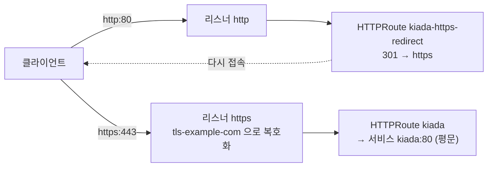

# 13.4 Gateway에 TLS 설정하기

[12.3절](<../12장. 인그레스로 서비스에 트래픽 라우팅하기/12.3 인그레스에 TLS 설정하기.md>)에서 인그레스로 TLS를 끝내는 것은 표준(`spec.tls`)이었지만, **패스스루는 ingress-nginx 전용 애노테이션과 시작 인자**가 필요했습니다. Gateway API에서는 둘 다 **리스너의 `tls.mode`** 하나로 고릅니다. TLS 설정은 라우트가 아니라 **Gateway(리스너)** 에 둡니다. 인증서는 입구를 관리하는 운영자의 몫이라는 생각입니다.

| `protocol` | `tls.mode` | 누가 암호를 푸나 | 붙일 수 있는 라우트 |
| :--- | :--- | :--- | :--- |
| **`HTTPS`** | `Terminate` (기본) | **게이트웨이** | HTTPRoute, GRPCRoute |
| **`TLS`** | `Passthrough` | **백엔드(앱)** | **TLSRoute** |
| **`TLS`** | `Terminate` | 게이트웨이(평문 TCP로 넘김) | TLSRoute (Extended) |

인증서는 12.3절에서 openssl 컨테이너로 만든 것을 그대로 씁니다. 개인 키 내용은 싣지 않습니다.

* Secret **`tls-example-com`** — `CN=*.example.com` (게이트웨이가 쓸 인증서)
* Secret **`kiada-tls`** — `CN=kiada.example.com` (kiada 파드의 envoy가 쓸 인증서)

```bash
kubectl create secret tls kiada-tls --cert=kiada-pod.crt --key=kiada-pod.key
kubectl create secret tls tls-example-com --cert=example.crt --key=example.key
```

```
secret/kiada-tls created
secret/tls-example-com created
```

> **책의 예제와 Secret 이름이 다릅니다.** 책의 `gtw.kiada.tls-terminate.yaml`은 게이트웨이에도 `kiada-tls`를 씁니다. 여기서는 **누가 TLS를 끝냈는지 인증서 이름으로 구별하려고** 게이트웨이용(`*.example.com`)과 파드용(`kiada.example.com`)을 나눴습니다.

## 게이트웨이에서 TLS 끝내기 — `HTTPS` 리스너

**gtw.kiada.tls-terminate.yaml** (리스너 부분, 메타데이터와 `infrastructure`는 13.2절과 같음)

```yaml
  listeners:
  - name: http
    port: 80
    protocol: HTTP
  - name: https
    port: 443
    protocol: HTTPS
    tls:
      mode: Terminate                # 기본값이라 생략해도 됨
      certificateRefs:
      - kind: Secret                 # 기본값이 Secret
        name: tls-example-com
```

책의 예제에는 `tls.options`(`example.com/my-custom-option` 같은 키·값)도 있습니다. 구현체별 TLS 설정을 넘기는 자리라 여기서는 뺐습니다.

```bash
kubectl apply -f httproute.kiada.yaml -f gtw.kiada.tls-terminate.yaml
kubectl wait --for=condition=programmed gateways.gateway.networking.k8s.io kiada --timeout=120s
kubectl get gtw kiada -o jsonpath='{range .status.listeners[*]}{.name}: attachedRoutes={.attachedRoutes} {range .conditions[*]}{.type}={.status} {end}{"\n"}{end}'
kubectl get svc kiada-istio
```

```
http: attachedRoutes=1 Accepted=True Conflicted=False Programmed=True ResolvedRefs=True 
https: attachedRoutes=1 Accepted=True Conflicted=False Programmed=True ResolvedRefs=True 
NAME          TYPE        CLUSTER-IP     EXTERNAL-IP   PORT(S)                    AGE
kiada-istio   ClusterIP   10.96.65.134   <none>        15021/TCP,80/TCP,443/TCP   6m54s
```

* 리스너를 추가하자 Istio가 Service에 **443을 알아서 열었습니다**
* 13.3절의 `kiada` HTTPRoute가 **두 리스너 모두에** 붙었습니다(`attachedRoutes=1`씩). `parentRefs`에 리스너를 지정하지 않으면 붙을 수 있는 리스너 전부에 붙습니다

```bash
podman exec kia-control-plane curl -k -v \
  --resolve kiada.example.com:443:127.0.0.1 https://kiada.example.com/ 2>&1 | grep -E ' subject:|^< HTTP|ALPN: server|processed by'
curl -s --cacert example.crt --resolve kiada.example.com:443:127.0.0.1 https://kiada.example.com/ | grep 'processed by'
```

```
* ALPN: server accepted h2
*  subject: CN=*.example.com
< HTTP/2 200 
Request processed by Kiada 0.5 running in pod "kiada-002" on node "kia-control-plane".
Request processed by Kiada 0.5.1 running in pod "kiada-new" on node "kia-control-plane".
```

`CN=*.example.com` — **게이트웨이의 인증서**입니다. Windows의 `curl`도 `--cacert`로 검증까지 통과했습니다. 둘째 요청이 `kiada-new`로 간 것은 `kiada` 서비스가 `app=kiada` 전체를 고르기 때문입니다(13.2절).

### 없는 Secret을 가리키면 그 리스너만 멈춥니다

```bash
sed 's/name: tls-example-com/name: no-such-secret/' gtw.kiada.tls-terminate.yaml | kubectl apply -f -
kubectl get gtw kiada
kubectl get gtw kiada -o jsonpath='{range .status.listeners[*]}{.name}: {range .conditions[*]}{.type}={.status} {.reason}: {.message} | {end}{"\n"}{end}'
```

```
NAME    CLASS   ADDRESS                              PROGRAMMED   AGE
kiada   istio   kiada-istio.ch13.svc.cluster.local   True         7m14s
http: Accepted=True Accepted: No errors found | Conflicted=False NoConflicts: No errors found | Programmed=True Programmed: No errors found | ResolvedRefs=True ResolvedRefs: No errors found | 
https: Accepted=True Accepted: No errors found | Conflicted=False NoConflicts: No errors found | Programmed=False Invalid: Bad TLS configuration | ResolvedRefs=False InvalidCertificateRef: invalid certificate reference /Secret/no-such-secret., secret ch13/no-such-secret not found | 
```

Gateway 전체는 여전히 `PROGRAMMED True`인데, **`https` 리스너만** `Programmed=False`, `ResolvedRefs=False`(`InvalidCertificateRef`)입니다. **`kubectl get gtw`만 보면 놓칩니다.** 리스너별 상태를 보세요.

> **다른 네임스페이스의 Secret도 쓸 수 있지만 허락이 필요합니다.** `certificateRefs`에 `namespace`를 적으면 되고, Secret이 있는 네임스페이스에 **ReferenceGrant**(from: Gateway, to: Secret)를 만들어야 합니다. 13.3절의 서비스 참조와 같은 원리입니다. 인증서를 한 네임스페이스에서 관리하고 여러 Gateway가 쓰게 할 때 씁니다.

### HTTP는 HTTPS로 돌려보내기 — `sectionName`

인그레스는 TLS를 켜면 ingress-nginx가 알아서 308로 돌려보냈습니다(12.3절). Gateway API에는 그런 암묵적 동작이 없습니다. **HTTP 리스너에만 리디렉트 라우트를 붙이고, HTTPS 리스너에만 실제 라우트를 붙입니다.** 특정 리스너를 고르는 것이 `parentRefs[].sectionName`입니다.

**httproute.kiada.https-redirect.yaml**

```yaml
apiVersion: gateway.networking.k8s.io/v1
kind: HTTPRoute
metadata:
  name: kiada-https-redirect
spec:
  parentRefs:
  - name: kiada
    sectionName: http                 # HTTP 리스너에만 붙인다
  hostnames:
  - kiada.example.com
  rules:
  - filters:
    - type: RequestRedirect
      requestRedirect:
        scheme: https
        statusCode: 301
---
apiVersion: gateway.networking.k8s.io/v1
kind: HTTPRoute
metadata:
  name: kiada
spec:
  parentRefs:
  - name: kiada
    sectionName: https                # HTTPS 리스너에만 붙인다
  hostnames:
  - kiada.example.com
  rules:
  - backendRefs:
    - name: kiada
      port: 80
```

```bash
kubectl apply -f httproute.kiada.https-redirect.yaml
curl -s -i --resolve kiada.example.com:80:127.0.0.1 http://kiada.example.com/ | head -3
curl -s --cacert example.crt --resolve kiada.example.com:443:127.0.0.1 https://kiada.example.com/ | grep 'processed by'
```

```
httproute.gateway.networking.k8s.io/kiada-https-redirect created
httproute.gateway.networking.k8s.io/kiada configured
HTTP/1.1 301 Moved Permanently
location: https://kiada.example.com/
date: Mon, 05 Oct 2026 09:57:00 GMT
Request processed by Kiada 0.5 running in pod "kiada-002" on node "kia-control-plane".
```



## TLS 패스스루 — `TLS` 리스너와 TLSRoute

이번에는 게이트웨이가 암호를 풀지 않고, kiada 파드의 envoy(8443)가 직접 풉니다.

**gtw.kiada.tls-passthrough.yaml** (리스너 부분)

```yaml
  listeners:
  - name: http
    port: 80
    protocol: HTTP
  - name: tls
    port: 443
    protocol: TLS                    # HTTPS 가 아니라 TLS
    tls:
      mode: Passthrough              # 암호를 풀지 않고 넘김
```

```bash
kubectl delete httproute kiada-https-redirect
kubectl apply -f httproute.kiada.yaml -f gtw.kiada.tls-passthrough.yaml
kubectl get gtw kiada -o jsonpath='{range .status.listeners[*]}{.name}: attachedRoutes={.attachedRoutes} kinds={.supportedKinds[*].kind}{"\n"}{end}'
```

```
http: attachedRoutes=1 kinds=HTTPRoute GRPCRoute
tls: attachedRoutes=0 kinds=TLSRoute
```

`tls` 리스너의 `supportedKinds`는 **TLSRoute뿐**입니다. 암호를 풀지 않으니 HTTP 경로나 헤더를 볼 수 없고, 그래서 HTTPRoute를 붙일 수 없습니다. 실제로 붙여 보면 거부됩니다.

```yaml
  parentRefs:
  - name: kiada
    sectionName: tls                  # TLS 리스너에 HTTPRoute 를 붙이려 함
```

```
Accepted=False NotAllowedByListeners: kind gateway.networking.k8s.io/v1/HTTPRoute is not allowed
ResolvedRefs=True ResolvedRefs: All references resolved
```

TLSRoute를 만듭니다. 책은 `v1alpha2`를 쓰지만 지금은 **`v1`** 입니다.

```bash
kubectl apply -f tlsroute.kiada.yaml                 # 책의 v1alpha2 그대로
```

```
error: resource mapping not found for name: "kiada" namespace: "" from "tlsroute.kiada.yaml": no matches for kind "TLSRoute" in version "gateway.networking.k8s.io/v1alpha2"
ensure CRDs are installed first
```

**tlsroute.kiada.yaml** (v1로 고침)

```yaml
apiVersion: gateway.networking.k8s.io/v1
kind: TLSRoute
metadata:
  name: kiada
spec:
  parentRefs:
  - name: kiada
    sectionName: tls
  hostnames:                         # SNI 로 고름
  - kiada.example.com
  rules:
  - backendRefs:
    - name: kiada-stable             # envoy 가 TLS 를 끝내는 443(→8443)
      port: 443
```

```bash
kubectl apply -f tlsroute.kiada.yaml
kubectl get tlsroute kiada -o jsonpath='{range .status.parents[0].conditions[*]}{.type}={.status} {.reason}: {.message}{"\n"}{end}'
for i in 1 2 3; do
  podman exec kia-control-plane curl -k -v --resolve kiada.example.com:443:127.0.0.1 \
    https://kiada.example.com/ 2>&1 | grep -E ' subject:|^< HTTP|processed by'
done
```

```
Accepted=True Accepted: Route was valid
ResolvedRefs=True ResolvedRefs: All references resolved
*  subject: CN=kiada.example.com
< HTTP/1.1 200 OK
Request processed by Kiada 0.5 running in pod "kiada-001" on node "kia-control-plane".
*  subject: CN=kiada.example.com
< HTTP/1.1 200 OK
Request processed by Kiada 0.5 running in pod "kiada-002" on node "kia-control-plane".
*  subject: CN=kiada.example.com
< HTTP/1.1 200 OK
Request processed by Kiada 0.5 running in pod "kiada-002" on node "kia-control-plane".
```

인증서가 **`CN=kiada.example.com`, 파드 envoy의 것**으로 바뀌었고 HTTP 버전도 envoy가 협상한 1.1입니다. 12.3절 ingress-nginx 패스스루와 결과가 같지만, 이번에는 **컨트롤러 시작 인자도, 애노테이션도 필요 없었습니다.**

| 비교 | ingress-nginx (12.3절) | Gateway API + Istio |
| :--- | :--- | :--- |
| **TLS 종료** | `spec.tls` | `protocol: HTTPS` + `certificateRefs` |
| **패스스루** | 애노테이션 + `--enable-ssl-passthrough` | `protocol: TLS` + `mode: Passthrough` + TLSRoute |
| **HTTP→HTTPS** | 자동 308 | `sectionName`으로 리디렉트 라우트를 직접 붙임 |
| **잘못된 설정** | 조용히 무시되기도 함 | 리스너 조건(`InvalidCertificateRef` 등)으로 보고 |

## 요약 및 비유

| 개념 | 대사관 출입 비유 | 기술적 의미 |
| :--- | :--- | :--- |
| **`HTTPS` + `Terminate`** | 정문에서 가방을 열어 검사하고 들여보냄 | 게이트웨이가 복호화, 백엔드는 평문 |
| **`TLS` + `Passthrough`** | 외교 행낭은 봉인째 담당 부서로 | 암호문 그대로 백엔드에 전달 |
| **`certificateRefs`** | 정문 경비가 가진 출입 인장 | 게이트웨이용 TLS Secret |
| **`sectionName`** | "이 안내문은 북문에만 붙이세요" | 라우트를 특정 리스너에만 붙임 |
| **리디렉트 라우트** | "일반 출입은 정문으로 돌아가세요" | HTTP 리스너에서 301 → HTTPS |
| **TLSRoute** | 행낭 겉면의 수신 부서 이름으로 배달 | SNI로 백엔드를 고르는 라우트 |
| **`supportedKinds`** | 문마다 받는 출입증 종류 | 리스너에 붙일 수 있는 라우트 종류 |
| **`InvalidCertificateRef`** | 인장이 없어 그 문만 폐쇄 | 해당 리스너만 `Programmed=False` |

## 결론

* TLS는 **라우트가 아니라 Gateway 리스너**에 둡니다. `HTTPS`(종료)와 `TLS`+`Passthrough`(패스스루)를 **표준 필드**로 고릅니다.
* 패스스루 리스너에는 **TLSRoute만** 붙습니다. HTTPRoute를 붙이면 `NotAllowedByListeners`로 거부됩니다. TLSRoute는 이제 **`v1`** 입니다.
* HTTP→HTTPS 리디렉트는 자동이 아닙니다. **`sectionName`으로 HTTP 리스너에만** 리디렉트 라우트를 붙입니다. `sectionName`이 없으면 라우트는 붙을 수 있는 모든 리스너에 붙습니다.
* 없는 Secret을 가리키면 Gateway 전체는 `Programmed True`로 보여도 **그 리스너만 멈춥니다.** `kubectl get gtw`가 아니라 **리스너 조건**을 보세요.
* 인증서를 다른 네임스페이스에 두려면 Secret 쪽에 **ReferenceGrant**가 필요합니다.

## 공식 문서 업데이트 (2026년 10월 기준)

### 1) TLSRoute가 표준 채널 `v1`이 되었습니다 (핵심 변화)

책은 TLSRoute를 `v1alpha2`(실험 채널)로 씁니다. **v1.5에서 TLSRoute가 표준 채널로 들어왔고**, v1.6 표준 CRD에는 `v1`만 있습니다. 책의 매니페스트는 `apiVersion`만 `gateway.networking.k8s.io/v1`로 바꾸면 그대로 동작했습니다.

```bash
kubectl get crd tlsroutes.gateway.networking.k8s.io
```

```
tlsroutes.gateway.networking.k8s.io            Namespaced   v1(storage)                2026-10-05T09:47:00Z
```

참고: <https://kubernetes.io/blog/2026/04/21/gateway-api-v1-5/>

### 2) 클라이언트 인증서 검증 같은 TLS 기능이 표준이 되었습니다

v1.5에서 **클라이언트 인증서 검증(Client Certificate Validation)** 과 **Gateway TLS Origination용 인증서 선택(Certificate Selection for Gateway TLS Origination)** 이 표준 채널로 들어왔습니다. 게이트웨이가 클라이언트 인증서를 검사하거나, 백엔드로 다시 암호화해 보낼 때 쓸 인증서를 고르는 기능입니다. 이 노트에서는 실측하지 않았습니다.

참고: <https://gateway-api.sigs.k8s.io/guides/user-guides/tls/>

## 출처

> 2026-10-05 공식 문서로 검증

* 원서: *Kubernetes in Action, Second Edition* 13장 — <https://livebook.manning.com/book/kubernetes-in-action-second-edition/>
* [Gateway API](https://kubernetes.io/docs/concepts/services-networking/gateway/) — Kubernetes 공식 문서
* [Gateway API v1.5: Moving features to Stable](https://kubernetes.io/blog/2026/04/21/gateway-api-v1-5/) — Kubernetes 공식 블로그
* [TLS Configuration](https://gateway-api.sigs.k8s.io/guides/user-guides/tls/) — Gateway API 공식 문서
* [TLS routing](https://gateway-api.sigs.k8s.io/guides/user-guides/tls-routing/) — Gateway API 공식 문서
* [HTTP path redirects and rewrites](https://gateway-api.sigs.k8s.io/guides/user-guides/http-redirect-rewrite/) — Gateway API 공식 문서
* [Kubernetes Gateway API](https://istio.io/latest/docs/tasks/traffic-management/ingress/gateway-api/) — Istio 공식 문서
