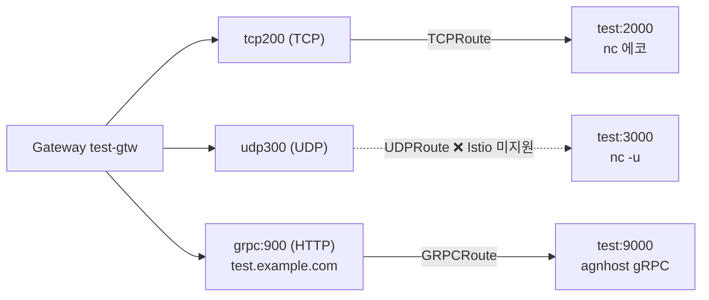
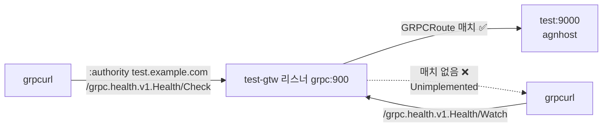

# 13.5 TCP·UDP·gRPC 서비스 노출하기

> 원서의 이 절 제목은 확인하지 못해 내용 기준으로 이름을 붙였습니다.

인그레스는 HTTP만 다뤘습니다. 데이터베이스나 게임 서버처럼 TCP·UDP를 쓰는 서비스는 `LoadBalancer` 서비스로 따로 공개해야 했습니다([11.2절](<../11장. 서비스로 파드 노출하기/11.2 서비스를 클러스터 밖으로 노출하기.md>)에서 다룹니다). Gateway API는 **프로토콜마다 라우트 종류가 따로** 있어서, 한 Gateway에서 HTTP와 TCP, UDP, gRPC를 함께 받을 수 있습니다.

| 라우트 | 리스너 `protocol` | 무엇으로 고르나 | v1.6 상태 |
| :--- | :--- | :--- | :--- |
| **HTTPRoute** | `HTTP`, `HTTPS` | 호스트, 경로, 헤더 … | 표준 `v1` |
| **GRPCRoute** | `HTTP`, `HTTPS` | 호스트, **gRPC 서비스·메서드**, 헤더 | 표준 `v1` |
| **TLSRoute** | `TLS` | SNI 호스트 이름 | 표준 `v1` |
| **TCPRoute** | `TCP` | **포트(리스너)만** | 표준 `v1` (v1.6에서 GA) |
| **UDPRoute** | `UDP` | **포트(리스너)만** | 표준 `v1` (v1.6에서 GA) |

TCPRoute와 UDPRoute는 내용을 보지 않습니다. **리스너(포트) 하나가 곧 서비스 하나**입니다.

## 실습 준비 — 에코 서버 셋

책의 `podsvc.test.yaml`은 한 파드에 세 컨테이너를 둡니다. TCP 2000(받은 줄을 되돌려 줌), UDP 3000(받은 것을 로그에 찍음), gRPC 9000입니다.

### 책의 gRPC 이미지는 받아지지 않았습니다

```bash
kubectl get pod test
kubectl describe pod test | grep Warning
```

```
NAME   READY   STATUS         RESTARTS   AGE
test   2/3     ErrImagePull   0          3m15s
  Warning  Failed     18s (x5 over 3m12s)  kubelet            spec.containers{grpc-echo}: Failed to pull image "quay.io/mhausenblas/yages:0.1.0": rpc error: code = Unimplemented desc = failed to pull and unpack image "quay.io/mhausenblas/yages:0.1.0": not implemented: media type "application/vnd.docker.distribution.manifest.v1+prettyjws" is no longer supported since containerd v2.1, please rebuild the image as "application/vnd.docker.distribution.manifest.v2+json" or "application/vnd.oci.image.manifest.v1+json"
  Warning  Failed     18s (x5 over 3m12s)  kubelet            spec.containers{grpc-echo}: Error: ErrImagePull
  Warning  Failed     3s (x12 over 3m12s)  kubelet            spec.containers{grpc-echo}: Error: ImagePullBackOff
```

> **아주 오래된 이미지는 최신 containerd에서 받지 못할 수 있습니다.** `quay.io/mhausenblas/yages:0.1.0`은 Docker의 옛 매니페스트 형식(schema 1)으로 올라가 있고, 실습 노드의 containerd 2.3.4는 이 형식을 받지 않습니다. 에러 메시지가 원인(`no longer supported since containerd v2.1`)을 정확히 말해 줍니다. 이미지를 다시 빌드하는 것 말고는 방법이 없습니다.

그래서 gRPC 서버를 쿠버네티스 테스트 이미지 **`registry.k8s.io/e2e-test-images/agnhost:2.66.1`** 의 `grpc-health-checking` 모드로 바꿨습니다. 표준 **gRPC 헬스 체크 서비스(`grpc.health.v1.Health`)** 를 제공합니다.

**podsvc.test.yaml** (gRPC 부분만 바꿈)

```yaml
  - name: grpc-health
    image: registry.k8s.io/e2e-test-images/agnhost:2.66.1
    args:
    - grpc-health-checking
    - --port=9000                    # gRPC 포트
    - --http-port=9001
    ports:
    - name: grpc9000
      containerPort: 9000
      protocol: TCP
---
# Service test (일부)
  - name: grpc9000
    port: 9000
    protocol: TCP
    appProtocol: kubernetes.io/h2c   # 평문 HTTP/2 라고 알려 줌
```

```bash
kubectl apply -f podsvc.test.yaml
kubectl get pod test
```

```
pod/test created
service/test configured
NAME   READY   STATUS    RESTARTS   AGE
test   3/3     Running   0          13s
```

## 리스너 세 개짜리 Gateway

**gtw.test.yaml**

```yaml
apiVersion: gateway.networking.k8s.io/v1
kind: Gateway
metadata:
  name: test-gtw
  annotations:
    networking.istio.io/service-type: ClusterIP
spec:
  gatewayClassName: istio
  listeners:
  - name: tcp200
    port: 200
    protocol: TCP
  - name: udp300
    port: 300
    protocol: UDP
  - name: grpc
    port: 900
    protocol: HTTP                   # gRPC 는 HTTP/2 위에서 돈다
    hostname: 'test.example.com'
```



```bash
kubectl apply -f gtw.test.yaml
kubectl get gtw test-gtw
kubectl get gtw test-gtw -o jsonpath='{range .status.conditions[*]}{.type}={.status} {.reason}: {.message}{"\n"}{end}{range .status.listeners[*]}{.name}: {range .conditions[*]}{.type}={.status} {.reason}: {.message} | {end}{"\n"}{end}'
```

```
NAME       CLASS   ADDRESS                                 PROGRAMMED   AGE
test-gtw   istio   test-gtw-istio.ch13.svc.cluster.local   True         3m1s
Accepted=True ListenersNotValid: One or more of the Gateway's listeners are invalid
Programmed=True Programmed: Resource programmed, assigned to service(s) test-gtw-istio.ch13.svc.cluster.local:200, test-gtw-istio.ch13.svc.cluster.local:300, and test-gtw-istio.ch13.svc.cluster.local:900
ResolvedRefs=True ResolvedRefs: All references resolved
tcp200: Accepted=True Accepted: No errors found | Conflicted=False NoConflicts: No errors found | Programmed=True Programmed: No errors found | ResolvedRefs=True ResolvedRefs: No errors found | 
udp300: Accepted=False UnsupportedProtocol: protocol "UDP" is unsupported | Conflicted=False NoConflicts: No errors found | Programmed=True Programmed: No errors found | ResolvedRefs=True ResolvedRefs: No errors found | 
grpc: Accepted=True Accepted: No errors found | Conflicted=False NoConflicts: No errors found | Programmed=True Programmed: No errors found | ResolvedRefs=True ResolvedRefs: No errors found | 
```

`PROGRAMMED True`라 멀쩡해 보이지만, Gateway의 `Accepted` 이유가 **`ListenersNotValid`** 입니다. 리스너를 보면 **`udp300`이 `UnsupportedProtocol: protocol "UDP" is unsupported`** 입니다. **Istio 1.31은 UDP 리스너를 지원하지 않습니다.** 나머지 두 리스너는 정상이라 Gateway는 그 둘로 동작합니다.

> **API에 있다고 구현체가 다 지원하는 것은 아닙니다.** UDPRoute는 Gateway API 표준 채널에 있지만, 지원 여부는 구현체가 정합니다. 구현체를 고를 때 Gateway API 사이트의 구현체별 기능 표와 적합성 보고서를 확인하세요. 이 실습에서는 UDP를 지원하는 다른 구현체로 바꾸지 않고, Istio에서 어떻게 보이는지만 기록했습니다.

## TCPRoute — 포트 하나를 서비스 하나로

**tcproute.test.yaml** (책은 `v1alpha2`)

```yaml
apiVersion: gateway.networking.k8s.io/v1
kind: TCPRoute
metadata:
  name: test
spec:
  parentRefs:
  - name: test-gtw                   # 프로토콜이 TCP 인 리스너에 붙음
  rules:
  - backendRefs:
    - name: test
      port: 2000
```

```bash
kubectl apply -f tcproute.test.yaml
kubectl get tcproute test -o jsonpath='{range .status.parents[*]}{.parentRef.name}: {range .conditions[*]}{.type}={.status} {.reason}: {.message} | {end}{"\n"}{end}'
```

```
test-gtw: Accepted=True Accepted: Route was valid | ResolvedRefs=True ResolvedRefs: All references resolved | 
```

`sectionName`을 안 적었지만 TCPRoute를 받는 리스너는 `tcp200`뿐이라 거기에 붙었습니다. 클러스터 안에서 busybox의 `nc`로 게이트웨이 200번 포트에 접속합니다.

```bash
kubectl run tcp-client --rm -i --restart=Never --image=docker.io/library/busybox -- \
  sh -c 'printf "Hello\nGateway API\n" | nc -w 2 test-gtw-istio 200'
```

```
You said: Hello
You said: Gateway API
All commands and output from this session will be recorded in container logs, including credentials and sensitive information passed through the command prompt.
If you don't see a command prompt, try pressing enter.
warning: couldn't attach to pod/tcp-client, falling back to streaming logs: unable to upgrade connection: container tcp-client not found in pod tcp-client_ch13
You said: Hello
You said: Gateway API
pod "tcp-client" deleted from ch13 namespace
```

에코가 두 번 찍힌 것은 명령이 너무 빨리 끝나 `kubectl run -i`가 컨테이너에 붙지 못하고(`couldn't attach`) **로그를 다시 보여 준** 탓입니다. 연결은 한 번이었습니다. 서버 쪽 로그로 확인합니다.

```bash
kubectl logs test -c tcp-echo --tail=6
```

```
Received new TCP connection
Received: Hello
Received: Gateway API
Connection closed

```

게이트웨이 200번 → `test` 서비스 2000번으로 **TCP 연결이 그대로 이어졌습니다.** 게이트웨이는 내용을 해석하지 않고 바이트만 넘깁니다.

> **실습에서 저지른 실수 하나.** 처음에는 `backendRefs`의 이름까지 `test-gtw`로 잘못 바꿔 적었습니다. 상태가 곧바로 알려 줬습니다.
> ```
> test-gtw/: Accepted=True Accepted: Route was valid | ResolvedRefs=False BackendNotFound: backend(test-gtw.ch13.svc.cluster.local) not found | 
> ```

## UDPRoute — 받아들여지지만 아무 일도 일어나지 않습니다

**udproute.test.yaml**

```yaml
apiVersion: gateway.networking.k8s.io/v1
kind: UDPRoute
metadata:
  name: test
spec:
  parentRefs:
  - name: test-gtw
  rules:
  - backendRefs:
    - name: test
      port: 3000
```

```bash
kubectl apply -f udproute.test.yaml
kubectl get udproute test -o yaml | sed -n '/^status/,$p'      # 아무것도 안 나옴
kubectl get gtw test-gtw -o jsonpath='{range .status.listeners[*]}{.name}: attachedRoutes={.attachedRoutes} kinds={.supportedKinds[*].kind}{"\n"}{end}'
```

```
tcp200: attachedRoutes=1 kinds=TCPRoute
udp300: attachedRoutes=0 kinds=
grpc: attachedRoutes=0 kinds=HTTPRoute GRPCRoute
```

UDPRoute에는 **`status`가 아예 없습니다.** 이 종류를 지켜보는 컨트롤러가 없다는 뜻입니다. `udp300` 리스너의 `supportedKinds`도 비어 있습니다. 실제로 보내 봐도 도착하지 않습니다.

```bash
kubectl run udp-client --rm -i --restart=Never --image=docker.io/library/busybox -- \
  sh -c 'echo "UDP hello" | nc -u -w 2 test-gtw-istio 300; echo exit=$?'    # 게이트웨이 경유
kubectl logs test -c udp-echo --tail=3
```

```
All commands and output from this session will be recorded in container logs, including credentials and sensitive information passed through the command prompt.
If you don't see a command prompt, try pressing enter.
exit=0
pod "udp-client" deleted from ch13 namespace
```

`kubectl logs`는 **아무것도 찍지 않았습니다.** 같은 내용을 서비스로 직접 보내 봅니다.

```bash
kubectl run udp-client2 --rm -i --restart=Never --image=docker.io/library/busybox -- \
  sh -c 'echo "UDP direct" | nc -u -w 2 test 3000; echo exit=$?'           # 서비스로 직접
kubectl logs test -c udp-echo --tail=3
```

```
All commands and output from this session will be recorded in container logs, including credentials and sensitive information passed through the command prompt.
If you don't see a command prompt, try pressing enter.
exit=0
pod "udp-client2" deleted from ch13 namespace
UDP direct
```

* 게이트웨이를 거친 `UDP hello`는 **로그에 없습니다**
* 서비스로 직접 보낸 `UDP direct`는 **도착했습니다**
* `nc`는 둘 다 `exit=0`입니다. **UDP는 받는 쪽이 응답하지 않으면 보낸 쪽이 실패를 모릅니다.** 성공처럼 보이는 것에 속지 마세요

게이트웨이 Service를 보면 300번 포트가 만들어지긴 했는데 **프로토콜이 TCP**입니다.

```bash
kubectl get svc test-gtw-istio -o jsonpath='{.spec.ports}'
```

```
[{"appProtocol":"tcp","name":"status-port","port":15021,"protocol":"TCP","targetPort":15021},{"appProtocol":"tcp","name":"tcp200","port":200,"protocol":"TCP","targetPort":200},{"appProtocol":"udp","name":"udp300","port":300,"protocol":"TCP","targetPort":300},{"appProtocol":"http","name":"grpc","port":900,"protocol":"TCP","targetPort":900}]
```

## GRPCRoute — gRPC 서비스와 메서드로 고르기

gRPC는 HTTP/2 위에서 돌고, 요청 경로가 `/<서비스>/<메서드>` 꼴입니다. HTTPRoute로도 경로 매칭은 되지만, **GRPCRoute**는 서비스·메서드 이름을 바로 조건으로 씁니다.

**grpcroute.test.yaml** (책은 `v1alpha2`, `yages.Echo/Ping`)

```yaml
apiVersion: gateway.networking.k8s.io/v1
kind: GRPCRoute
metadata:
  name: test
spec:
  parentRefs:
  - name: test-gtw
    sectionName: grpc                # HTTP 리스너 900
  hostnames:
  - test.example.com
  rules:
  - matches:
    - method:
        type: Exact
        service: grpc.health.v1.Health   # gRPC 서비스
        method: Check                    # 그 안의 메서드
    backendRefs:
    - name: test
      port: 9000
```

```bash
kubectl apply -f grpcroute.test.yaml
kubectl get grpcroute
```

```
NAME   HOSTNAMES              AGE
test   ["test.example.com"]   6s
```

```bash
kubectl get grpcroute test -o jsonpath='{range .status.parents[*]}{range .conditions[*]}{.type}={.status} {.reason}: {.message} | {end}{"\n"}{end}'
```

```
Accepted=True Accepted: Route was valid | ResolvedRefs=True ResolvedRefs: All references resolved | 
```

클라이언트는 **grpcurl**(`docker.io/fullstorydev/grpcurl:v1.9.3-alpine`)을 파드로 띄웠습니다. agnhost의 gRPC 서버는 리플렉션을 등록하지 않아서, `grpc.health.v1` 프로토 정의를 직접 써서 ConfigMap(`health-proto`)으로 넣어 줬습니다.

**health.proto**

```
syntax = "proto3";
package grpc.health.v1;
message HealthCheckRequest { string service = 1; }
message HealthCheckResponse {
  enum ServingStatus { UNKNOWN = 0; SERVING = 1; NOT_SERVING = 2; SERVICE_UNKNOWN = 3; }
  ServingStatus status = 1;
}
service Health {
  rpc Check(HealthCheckRequest) returns (HealthCheckResponse);
  rpc Watch(HealthCheckRequest) returns (stream HealthCheckResponse);
}
```

**grpcurl-pod.yaml** (명령 부분)

```yaml
    args:
    - |
      echo "### Check (route matches)"
      grpcurl -plaintext -import-path /proto -proto health.proto -authority test.example.com test-gtw-istio:900 grpc.health.v1.Health/Check
      echo "### Watch (no matching rule)"
      grpcurl -plaintext -max-time 3 -import-path /proto -proto health.proto -authority test.example.com test-gtw-istio:900 grpc.health.v1.Health/Watch
      echo "### Check with wrong authority"
      grpcurl -plaintext -import-path /proto -proto health.proto -authority other.example.com test-gtw-istio:900 grpc.health.v1.Health/Check
```

`-authority`는 HTTP/2의 `:authority`, 즉 **gRPC에서의 Host**입니다.

```bash
kubectl create configmap health-proto --from-file=health.proto
kubectl apply -f grpcurl-pod.yaml
kubectl logs grpcurl
```

```
### Check (route matches)
{
  "status": "SERVING"
}
### Watch (no matching rule)
ERROR:
  Code: Unimplemented
  Message: 
### Check with wrong authority
ERROR:
  Code: Unimplemented
  Message: 
```

| 호출 | 결과 | 이유 |
| :--- | :--- | :--- |
| `Health/Check`, `test.example.com` | **`SERVING`** | 규칙에 맞아 agnhost까지 감 |
| `Health/Watch`, `test.example.com` | `Unimplemented` | 같은 서비스라도 **메서드가 규칙에 없음** |
| `Health/Check`, `other.example.com` | `Unimplemented` | **호스트가 안 맞음** |

`Watch` 요청은 게이트웨이가 백엔드로 넘기지 않고 직접 거절했습니다. HTTPRoute에서 규칙에 안 맞으면 404였던 것이, gRPC에서는 **`Unimplemented`** 로 나타납니다.



## 요약 및 비유

| 라우트 | 물류 터미널 하역장 비유 | 기술적 의미 |
| :--- | :--- | :--- |
| **HTTPRoute** | 송장 내용까지 읽고 분류 | 호스트·경로·헤더로 고름 |
| **GRPCRoute** | 품목 코드(서비스/메서드)로 분류 | gRPC 서비스·메서드로 고름 |
| **TLSRoute** | 봉인 화물의 겉면 행선지만 보고 분류 | SNI로 고름 |
| **TCPRoute** | 3번 하역장 = 무조건 A 창고 | 포트 하나가 백엔드 하나 |
| **UDPRoute** | 컨베이어가 설치 안 된 하역장 | Istio는 미지원 — 상태도 없음 |
| **`UnsupportedProtocol`** | "이 터미널은 냉동 화물 안 받습니다" | 그 리스너만 `Accepted=False` |
| **`Unimplemented`** | "그 품목은 취급 안 합니다" | gRPC에서 매칭 실패 |

## 결론

* Gateway API는 **프로토콜마다 라우트**가 있어서 한 Gateway에서 HTTP·gRPC·TLS·TCP·UDP를 함께 받을 수 있습니다. v1.6에서는 모두 표준 **`v1`** 입니다.
* TCPRoute·UDPRoute는 내용을 보지 않습니다. **리스너(포트) 하나가 백엔드 하나**입니다.
* **Istio 1.31은 UDP 리스너를 지원하지 않습니다.** 리스너는 `UnsupportedProtocol`, UDPRoute는 **상태조차 없고**, 보내 봐도 도착하지 않습니다. 구현체의 지원 범위를 먼저 확인하세요.
* UDP는 받는 쪽이 응답하지 않으면 **보낸 쪽이 실패를 모릅니다.** `nc`의 `exit=0`에 속지 말고 받는 쪽 로그로 확인합니다.
* GRPCRoute는 **서비스·메서드 이름**으로 고르고, 안 맞으면 404 대신 **`Unimplemented`** 가 돌아옵니다.
* 책의 gRPC 예제 이미지(`yages:0.1.0`)는 옛 매니페스트 형식이라 **containerd 2.1 이상에서 받지 못합니다.**

## 공식 문서 업데이트 (2026년 10월 기준)

### 1) TCPRoute·UDPRoute가 v1.6에서 GA가 되었습니다 (가장 큰 변화)

책은 실험 채널의 `v1alpha2` TCPRoute·UDPRoute·GRPCRoute를 씁니다. 지금은 모두 표준 채널의 **`v1`** 입니다.

* **GRPCRoute** — 이미 표준 `v1`
* **TCPRoute·UDPRoute** — **v1.6에서 표준 채널 `v1`(GA)**. `v1alpha2`는 v1.6부터 지원 중단이고 앞으로 제거됩니다

`apiVersion`을 `gateway.networking.k8s.io/v1`로 바꾸면 책의 매니페스트가 그대로 동작했습니다(UDP는 구현체 지원 문제로 제외).

참고: <https://kubernetes.io/blog/2026/08/03/gateway-api-v1-6-release/>

### 2) containerd 2.1부터 Docker schema 1 이미지를 받지 못합니다

책 시절에는 받아지던 `quay.io/mhausenblas/yages:0.1.0` 같은 옛 이미지가 지금 노드(containerd 2.3.4)에서는 `ErrImagePull`이 됩니다. 에러 메시지가 `application/vnd.docker.distribution.manifest.v2+json`이나 OCI 형식으로 다시 빌드하라고 안내합니다. containerd의 릴리스 문서에 따르면 Schema 1 이미지 받기는 v1.7에서 지원 중단, v2.0에서 기본 비활성, **v2.1에서 제거**되었습니다.

참고: <https://github.com/containerd/containerd/blob/main/RELEASES.md>

## 출처

> 2026-10-05 공식 문서로 검증

* 원서: *Kubernetes in Action, Second Edition* 13장 — <https://livebook.manning.com/book/kubernetes-in-action-second-edition/>
* [Gateway API](https://kubernetes.io/docs/concepts/services-networking/gateway/) — Kubernetes 공식 문서
* [containerd/RELEASES.md at main · containerd/containerd](https://github.com/containerd/containerd/blob/main/RELEASES.md) — containerd 공식 저장소
* [Gateway API v1.6: TCPRoute and UDPRoute Graduate to Standard](https://kubernetes.io/blog/2026/08/03/gateway-api-v1-6-release/) — Kubernetes 공식 블로그
* [TCP routing](https://gateway-api.sigs.k8s.io/guides/user-guides/tcp/) — Gateway API 공식 문서
* [UDP routing](https://gateway-api.sigs.k8s.io/guides/user-guides/udp/) — Gateway API 공식 문서
* [gRPC routing](https://gateway-api.sigs.k8s.io/guides/user-guides/grpc-routing/) — Gateway API 공식 문서
* [v1.6](https://gateway-api.sigs.k8s.io/docs/implementations/versions/v1.6/) — Gateway API 적합성 보고서
* [Kubernetes Gateway API](https://istio.io/latest/docs/tasks/traffic-management/ingress/gateway-api/) — Istio 공식 문서
