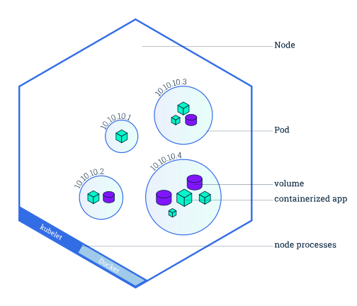
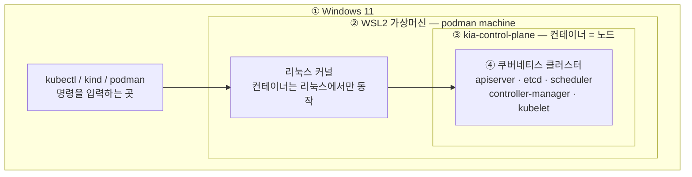
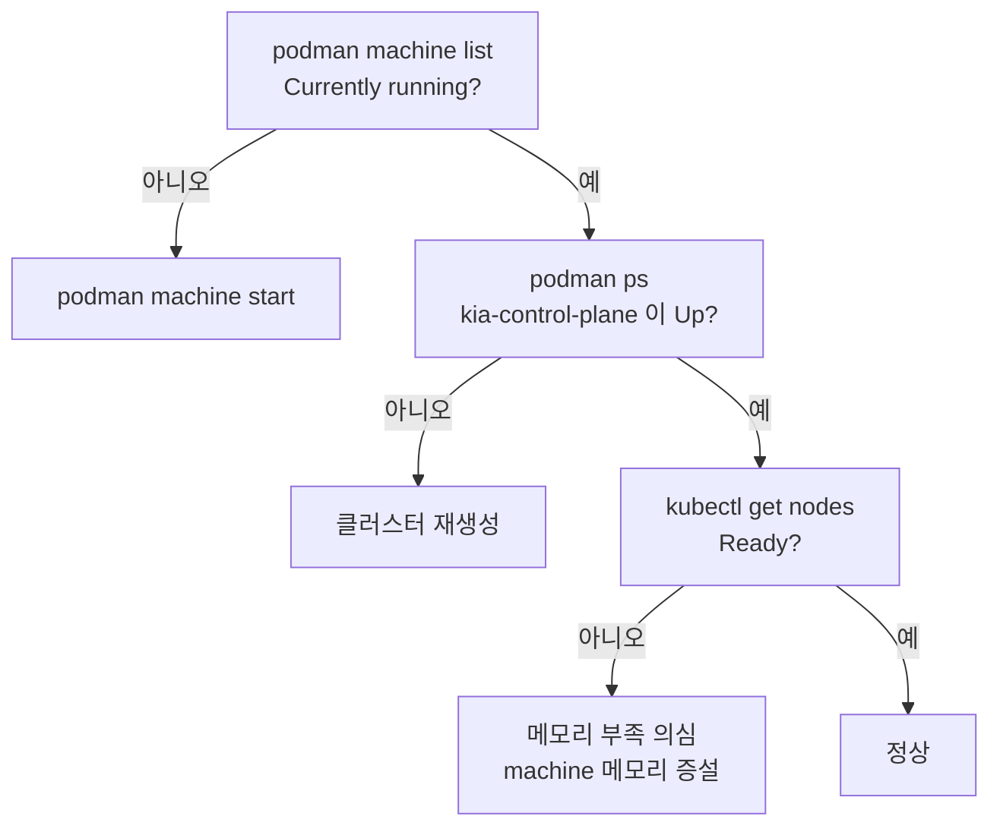

# SETUP — 실습 환경 구축

**Windows 11 + Podman + kind** 로 학습용 쿠버네티스 클러스터를 만드는 문서입니다.

이 저장소의 모든 장은 **여기까지 마친 상태**를 전제로 합니다. 클러스터를 만드는 이야기는 이 문서 하나에만 있고, 각 장의 노트는 곧바로 실습으로 들어갑니다.

---

## 왜 이 조합인가

절차만 필요하면 [준비물](#준비물)부터 읽어도 됩니다. 아래는 "왜 하필 kind이고, 왜 노드가 하나이고, 왜 Docker가 아닌가"에 대한 답입니다.

### 왜 kind인가

책의 실습은 **동작하는 클러스터 한 개**만 있으면 전부 따라갈 수 있습니다. 로컬에 클러스터를 만드는 도구는 여러 가지입니다.

| 도구 | 비용 | 특징 |
| :--- | :--- | :--- |
| **kind**(Kubernetes IN Docker) | 무료 | **노드 한 대를 컨테이너 한 개로** 흉내 냅니다. 생성·삭제가 빠르고 노드를 늘리기 쉽습니다. **이 저장소가 쓰는 도구입니다** |
| **minikube** | 무료 | 가장 오래된 로컬 도구로 안정적이고 **애드온**이 풍부하지만, 노드를 늘리는 구성이 상대적으로 번거롭습니다 |
| **Docker Desktop 내장** | 개인 무료 | 체크박스 하나로 켜집니다. 다만 노드가 항상 1개이고, 기업 사용은 유료입니다 |
| **k3s** | 무료 | 경량 배포판(lightweight distribution). 리눅스 서버 환경에 적합합니다 |
| **GKE / EKS / AKS** | **유료** | 실제 클라우드 환경을 경험할 때. 학습만을 위해 쓰기에는 비용이 아깝습니다 |

kind는 컨테이너 안에서 **kubelet**과 컨테이너 런타임이 실제로 동작하기 때문에, 진짜 클러스터와 거의 같은 방식으로 움직입니다.


여기서 말하는 **노드(Node)** 는 파드가 실제로 실행되는 작업 머신입니다. 공식 문서의 노드 구조도를 보면 노드 한 대가 무엇을 담고 있는지 분명해집니다.



> 출처: [Kubernetes Documentation — Viewing Pods and Nodes](https://kubernetes.io/docs/tutorials/kubernetes-basics/explore/explore-intro/) © The Kubernetes Authors, [CC BY 4.0](https://creativecommons.org/licenses/by/4.0/)

kind는 이 그림의 **노드 한 칸을 컨테이너 한 개로** 대신합니다.

### 왜 노드가 하나인가

1.2절에서 **컨트롤 플레인 노드는 3대 이상 홀수 개**를 권장한다고 했습니다. etcd가 과반수 합의로 동작하기 때문에, 3대여야 1대가 죽어도 클러스터가 유지됩니다.

* 이것은 **운영 환경(production)** 을 위한 기준입니다.
* **학습 환경에서는 노드 1개로 충분합니다.** 고가용성은 노드가 죽는 상황에 대비하는 것인데, 학습 중에는 그런 일이 없습니다.
* 노드가 1개면 메모리를 적게 쓰고, 만들고 지우는 속도도 빠릅니다.

> 노드가 여러 개여야 의미가 살아나는 장(**14장 레플리카셋**, **17장 데몬셋**)에서는 그때 가서 워커 노드를 추가해 다시 만들면 됩니다. → [노드 늘리기](#노드-늘리기)

### 왜 Docker Desktop이 아니라 Podman인가

kind는 노드 역할을 할 컨테이너를 띄울 **컨테이너 런타임(Container Runtime)** 이 필요합니다. 여기서는 **Podman**을 씁니다.

* **데몬리스(daemonless)**: Docker는 백그라운드에 `dockerd` 가 상주하지만, Podman은 명령을 실행할 때만 동작합니다.
* **라이선스**: Docker Desktop은 **직원 250명 이상 또는 연매출 1천만 달러 이상** 기업이라면 유료 구독이 필요합니다. 개인 학습은 무료 범위지만, Podman은 아예 이런 제약이 없습니다.
* **호환성**: 명령어 체계가 같습니다. `docker` 자리에 `podman` 만 넣으면 됩니다.

---

## 무엇을 만드나

Windows에는 리눅스 커널이 없습니다. 그래서 **4겹**으로 쌓아 올립니다. 문제가 생겼을 때 어느 층이 멈췄는지 짚는 것이 곧 문제 해결이므로, 이 그림만 기억해 두면 됩니다.



| 층 | 정체 | 살아 있는지 확인 |
| :--- | :--- | :--- |
| ① Windows 도구 | podman, kind, kubectl | `podman --version` |
| ② WSL2 가상머신 | 리눅스 커널 | `podman machine list` |
| ③ 노드 컨테이너 | kind가 만든 컨테이너 | `podman ps` |
| ④ 쿠버네티스 | 그 안에서 도는 클러스터 | `kubectl get nodes` |

## 준비물

| | 내용 |
| :--- | :--- |
| **OS** | Windows 11 (10도 가능하나 이 문서는 11 기준) |
| **RAM** | 8GB 이상 (16GB 권장) |
| **디스크** | 여유 60GB 이상 |
| **권한** | 관리자 권한 1회 필요 (1단계) |
| **소요 시간** | 30분 내외 + 재부팅 1~2회 |

---

## Claude Code와 함께 진행하기

이 절차는 Claude Code에게 대부분 맡길 수 있습니다. 다만 **맡길 수 없는 것**을 먼저 알아 두는 편이 시간을 아낍니다.

| | 항목 |
| :--- | :--- |
| **Claude가 대신 할 수 있음** | 버전 확인, `podman machine` 생성·시작, 클러스터 생성·삭제, `kubectl` 조회, 상태 진단, 오류 메시지 해석, YAML 작성 |
| **직접 해야 함** | BIOS 진입(0단계), 관리자 권한 PowerShell(1단계), 재부팅, 대화형 로그인 |

### 쓰는 방법

**1) 그냥 시킵니다.** 이 저장소의 `CLAUDE.md` 에 환경 정보(도구 버전, 클러스터 이름, 컨텍스트)가 들어 있어서 Claude가 상황을 이미 알고 있습니다.

```
podman machine 상태 확인하고 안 켜져 있으면 켜 줘
```
```
kind 클러스터 다시 만들어 줘. kind-config.yaml 쓰면 돼
```
```
kubectl get nodes가 안 되는데 원인 찾아 줘
```

**2) 내가 직접 실행해야 하는 명령은 `!` 를 붙여 입력합니다.** 관리자 권한이나 대화형 입력이 필요한 명령이 여기 해당합니다. 결과가 대화에 그대로 남아서 Claude가 이어서 판단할 수 있습니다.

```
! wsl --status
```

**3) 오류가 나면 메시지를 통째로 붙여 넣습니다.** 요약하지 말고 그대로 주는 편이 진단이 정확합니다.

> **주의할 점**
> `podman machine rm`, `kind delete cluster` 처럼 되돌릴 수 없는 명령은 Claude가 먼저 확인을 구합니다. 실습 환경이라 지워도 괜찮지만, **클러스터 안에만 있던 리소스는 함께 사라집니다.** YAML로 저장해 두는 습관이 중요한 이유입니다.

---

## 0단계 — BIOS 가상화 확인

**왜:** 컨테이너는 리눅스 커널 기능이고, Windows에서 리눅스 커널을 돌리려면 가상머신이 필요하며, 가상머신은 CPU 가상화 기능이 켜져 있어야 동작합니다. **여기를 건너뛰면 1단계에서 반드시 막힙니다.**

```powershell
systeminfo | Select-String "Hyper-V", "가상화"
```

```
Virtualization Enabled In Firmware: Yes    <- 정상, 1단계로
Virtualization Enabled In Firmware: No     <- BIOS 설정 필요
```

> 이미 가상화가 동작 중이면 `A hypervisor has been detected.` 가 나옵니다. 이것도 정상입니다.

`No` 라면 재부팅 후 부팅 화면에서 `Del`(보드에 따라 `F2`)로 BIOS에 진입해 아래 항목을 **Enabled** 로 바꿉니다.

| CPU | 옵션 이름 | 대략적인 위치 |
| :--- | :--- | :--- |
| **AMD** | **SVM Mode** | `Advanced Mode(F2)` → `Tweaker` 또는 `M.I.T.` → `Advanced CPU Settings` |
| **Intel** | **Intel (VMX) Virtualization Technology / VT-x** | `Advanced` → `CPU Configuration` |

## 1단계 — WSL2 설치

**왜:** 리눅스 커널을 제공할 가상머신 기반을 깝니다.

**관리자 권한 PowerShell**에서 실행합니다. (시작 메뉴 → PowerShell 우클릭 → 관리자 권한으로 실행)

```powershell
dism.exe /online /enable-feature /featurename:Microsoft-Windows-Subsystem-Linux /all /norestart
dism.exe /online /enable-feature /featurename:VirtualMachinePlatform /all /norestart
winget install --id Microsoft.WSL --source winget --accept-package-agreements --accept-source-agreements
```

* 종료 코드 **`3010`은 오류가 아닙니다.** "성공했고 재부팅이 필요하다"는 뜻입니다.
* 실행 후 **재부팅**합니다. 0단계에서 BIOS를 건드려야 했다면 이때 함께 처리하면 재부팅 한 번으로 끝납니다.

재부팅 후 확인합니다.

```powershell
wsl --status
```

`기본 버전: 2` 가 나오고 다른 경고가 없으면 정상입니다.

> `가상화가 지원되지 않습니다` 또는 `aka.ms/enablevirtualization` 링크가 보이면 **0단계가 아직 안 된 것**입니다. WSL 설치 문제로 오해하기 딱 좋은 지점입니다.

## 2단계 — 도구 3개 설치

**왜:** 컨테이너 실행 도구(podman), 클러스터 생성 도구(kind), 클러스터 조작 도구(kubectl)를 갖춥니다.

```powershell
winget install --id RedHat.Podman      --source winget --accept-package-agreements --accept-source-agreements
winget install --id Kubernetes.kind    --source winget --accept-package-agreements --accept-source-agreements
winget install --id Kubernetes.kubectl --source winget --accept-package-agreements --accept-source-agreements
```

설치 후 **PowerShell 창을 새로 열고**(PATH 갱신) 확인합니다.

```powershell
podman --version         # podman version 5.8.3
kind --version           # kind version 0.32.0
kubectl version --client # Client Version: v1.36.3
```

> 버전 숫자는 작성 시점(2026-08) 기준입니다. 더 높아도 괜찮습니다.
>
> **다만 kubectl은 클러스터와 마이너 버전 1개 차이까지만 지원합니다.** 클러스터가 1.36이면 kubectl은 1.35~1.37이어야 합니다. 너무 오래된 kubectl을 쓰면 원인을 짐작하기 어려운 오류가 납니다.
>
> `명령을 인식할 수 없습니다` 가 나오면 새 창을 안 연 것입니다. 그래도 안 되면 현재 창의 PATH를 갱신합니다.
> ```powershell
> $env:Path = [Environment]::GetEnvironmentVariable('Path','Machine') + ';' + [Environment]::GetEnvironmentVariable('Path','User')
> ```

## 3단계 — podman machine 생성

**왜:** 컨테이너를 실제로 돌릴 리눅스 VM을 만듭니다. 이것을 **machine**이라고 부릅니다.

```powershell
podman machine init --cpus 4 --memory 6144 --disk-size 60
podman machine set --rootful
podman machine start
```

| 옵션 | 의미 | 권장 | 최소 |
| :--- | :--- | :--- | :--- |
| `--cpus` | CPU 코어 수 | 4 | 2 |
| `--memory` | 메모리(MB) | 6144 | 4096 |
| `--disk-size` | 디스크(GB) | 60 | 40 |

* **`--rootful` 이 핵심입니다.** kind는 노드 컨테이너 안에서 systemd와 cgroup을 직접 제어해야 하는데, Podman 기본값인 rootless 모드로는 권한이 부족해 클러스터 생성이 실패합니다.
* VM에 준 만큼 Windows가 쓸 메모리가 줄어듭니다. **PC 전체 RAM의 절반을 넘기지 않는 편**이 안전합니다.
* 나중에 노드를 늘릴 때는 메모리도 함께 늘립니다. → [노드 늘리기](#노드-늘리기)

확인합니다.

```powershell
podman machine list                                  # STATUS: Currently running
podman info --format "{{.Host.Security.Rootless}}"   # false 여야 정상 (= rootful)
podman run --rm quay.io/podman/hello                 # 인사 메시지
```

> 이미지 이름을 `hello-world` 처럼 짧게 쓰면 Podman이 "어느 레지스트리에서 받을까요?"를 되묻습니다. **레지스트리 주소까지 전부 적으세요.**

## 4단계 — kind에게 Podman을 쓰라고 알리기

**왜:** kind는 기본적으로 Docker를 찾습니다. 환경 변수로 바꿔 줍니다.

```powershell
# 사용자 계정에 영구 등록 (새 창부터 적용)
[Environment]::SetEnvironmentVariable("KIND_EXPERIMENTAL_PROVIDER", "podman", "User")

# 현재 창에도 즉시 적용
$env:KIND_EXPERIMENTAL_PROVIDER = "podman"
```

> 이름에 `EXPERIMENTAL` 이 붙어 있지만 학습용으로는 충분히 안정적입니다.

## 5단계 — 클러스터 생성

**왜:** 드디어 쿠버네티스를 만듭니다.

가장 간단하게는 한 줄이면 됩니다.

```powershell
kind create cluster --name kia
```

다만 **12~13장(인그레스 / Gateway API)** 실습에서 `localhost` 로 접속하려면 포트를 미리 열어 둬야 합니다. 나중에 클러스터를 다시 만들지 않도록 처음부터 설정 파일을 쓰는 편이 낫습니다. 저장소 루트에 준비된 [`kind-config.yaml`](kind-config.yaml) 입니다.

```yaml
kind: Cluster
apiVersion: kind.x-k8s.io/v1alpha4
name: kia
nodes:
  # 단일 노드: 컨트롤 플레인이 워커 역할까지 겸한다
  - role: control-plane
    kubeadmConfigPatches:
      - |
        kind: InitConfiguration
        nodeRegistration:
          kubeletExtraArgs:
            node-labels: "ingress-ready=true"
    # 12~13장(인그레스 / Gateway API) 실습용 포트 개방
    extraPortMappings:
      - containerPort: 80
        hostPort: 80
        protocol: TCP
      - containerPort: 443
        hostPort: 443
        protocol: TCP
```

```powershell
kind create cluster --config kind-config.yaml
```

```
using podman due to KIND_EXPERIMENTAL_PROVIDER
enabling experimental podman provider
Creating cluster "kia" ...
 ✓ Ensuring node image (kindest/node:v1.36.1)
 ✓ Preparing nodes
 ✓ Writing configuration
 ✓ Starting control-plane
 ✓ Installing CNI
 ✓ Installing StorageClass
Set kubectl context to "kind-kia"
```

* 맨 위 두 줄은 Podman을 쓰고 있다는 **안내**일 뿐, 오류가 아닙니다.
* 노드 이미지를 받느라 **첫 생성은 몇 분** 걸립니다. 이후로는 1분 내외입니다.
* 마지막 줄처럼 kind가 **kubectl 컨텍스트(`kind-kia`)를 자동 등록**해 줍니다. 따로 설정할 것이 없습니다.

> **책과 버전을 맞추고 싶다면.** 책은 대략 **1.24~1.27** 기준이고, 지금 kind로 만들면 **1.36**이 설치됩니다. 특정 버전이 필요하면 노드 이미지를 직접 지정합니다. 다만 이 저장소의 노트는 최신 버전 기준으로 쓰여 있으니, 특별한 이유가 없다면 그대로 두는 편이 낫습니다.
>
> ```powershell
> kind create cluster --image kindest/node:v<원하는_버전>
> ```
>
> 쓸 수 있는 태그는 [kind 릴리스 노트](https://github.com/kubernetes-sigs/kind/releases)에서 확인합니다. kind 버전마다 지원하는 노드 이미지가 정해져 있습니다.

## 6단계 — 동작 확인

### 노드가 준비되었는가

```powershell
kubectl get nodes
```

```
NAME                STATUS   ROLES           AGE   VERSION
kia-control-plane   Ready    control-plane   20s   v1.36.1
```

`Ready` 면 클러스터가 살아 있는 것입니다.

### 컨트롤 플레인 부품 확인

1.2절에서 이름만 봤던 부품들을 눈으로 확인합니다.

```powershell
kubectl get pods -n kube-system
```

```
NAME                                        READY   STATUS    RESTARTS   AGE
coredns-589f44dc88-8k24p                    1/1     Running   0          38s
coredns-589f44dc88-8q2n6                    1/1     Running   0          38s
etcd-kia-control-plane                      1/1     Running   0          44s
kindnet-7ghc5                               1/1     Running   0          38s
kube-apiserver-kia-control-plane            1/1     Running   0          44s
kube-controller-manager-kia-control-plane   1/1     Running   0          44s
kube-proxy-s9f6g                            1/1     Running   0          38s
kube-scheduler-kia-control-plane            1/1     Running   0          44s
```

* **etcd / kube-apiserver / kube-controller-manager / kube-scheduler**: 1.2절의 컨트롤 플레인 네 부품입니다. 컨트롤 플레인 노드에만 있으므로 이름 뒤에 노드 이름이 붙습니다.
* **kube-proxy / kindnet**: **노드마다 하나씩** 배치되는 요소입니다. 지금은 노드가 1개라 하나씩만 보이지만, 노드를 늘리면 개수도 함께 늘어납니다. 17장에서 배울 **데몬셋(DaemonSet)** 이 이 방식입니다.
* **CoreDNS**: 클러스터 내부 DNS입니다. 기본값이 2개라 노드가 1개여도 2개가 뜹니다.

### 노드가 곧 컨테이너임을 확인

```powershell
podman ps
```

```
NAMES               STATUS
kia-control-plane   Up About a minute
```

`kubectl` 이 "노드"라고 부르는 것이 Podman 쪽에서는 **컨테이너 한 개**로 보입니다. 이것이 kind의 정체입니다.

### 애플리케이션이 실제로 뜨는가

```powershell
kubectl config current-context     # kind-kia 를 보고 있는가
kubectl create deployment nginx --image=nginx --replicas=2
kubectl rollout status deployment/nginx
kubectl get pods -o wide
```

```
NAME                    READY   STATUS    RESTARTS   AGE   IP           NODE
nginx-7f8fbb96d-6469w   1/1     Running   0          16s   10.244.0.5   kia-control-plane
nginx-7f8fbb96d-mkq7b   1/1     Running   0          16s   10.244.0.6   kia-control-plane
```

> **참고 — 단일 노드에서 파드가 뜨는 이유:** 원래 컨트롤 플레인 노드에는 **테인트(Taint)** 라는 오염 표시가 붙어 일반 파드가 배치되지 않습니다. 하지만 kind는 워커 노드가 없는 구성에서 이 테인트를 자동으로 제거합니다. 그래서 노드 1개만으로도 실습이 가능합니다. (`kubectl get nodes -o jsonpath='{.items[*].spec.taints}'` → 비어 있음)

정리합니다.

```powershell
kubectl delete deployment nginx
```

여기까지 왔으면 **2장부터의 실습을 그대로 따라갈 수 있습니다.**

---

## kubeconfig — kubectl은 어디에 접속하나

kubectl은 특별한 통로를 갖고 있지 않습니다. **`~/.kube/config`**(Windows에서는 `C:\Users\<사용자>\.kube\config`) 파일을 읽어서 "어느 API 서버에, 누구로 접속할지"를 정합니다. kind는 클러스터를 만들면서 이 파일을 자동으로 고쳐 주기 때문에 직접 편집할 일은 거의 없습니다.

파일 안에는 세 가지가 들어 있습니다.

| 항목 | 내용 |
| :--- | :--- |
| **cluster** | 접속할 API 서버 주소 |
| **user** | 인증 정보(인증서, 토큰) |
| **context** | `cluster + user + namespace` 조합에 붙인 이름 — 우리 환경에서는 `kind-kia` |

```powershell
kubectl config get-contexts        # 컨텍스트 목록
kubectl config current-context     # 지금 어디에 연결돼 있나
kubectl config use-context kind-kia    # 다른 클러스터로 전환
```

> **실무에서 가장 무서운 실수는 개발 클러스터인 줄 알고 운영 클러스터에 명령을 날리는 것입니다.**
> 클러스터가 하나뿐인 지금은 실감이 안 나지만, **명령 전에 `kubectl config current-context` 로 확인하는 습관**을 지금부터 들여 두세요. 터미널 프롬프트에 현재 컨텍스트를 띄워 주는 `kube-ps1` 같은 도구도 있습니다.

## kubectl 편의 설정

필수는 아니지만, 리소스 이름을 `Tab` 으로 완성할 수 있어 실습 속도가 확연히 달라집니다. 공식 문서도 권장하는 설정입니다.

```powershell
# 현재 세션에만 적용
kubectl completion powershell | Out-String | Invoke-Expression

# 매번 자동 적용 — 프로필에 추가
kubectl completion powershell >> $PROFILE
```

```bash
# bash (WSL 안에서 실습할 때)
echo 'source <(kubectl completion bash)' >> ~/.bashrc
echo 'alias k=kubectl' >> ~/.bashrc
echo 'complete -o default -F __start_kubectl k' >> ~/.bashrc
```

> `$PROFILE` 파일이 없다면 먼저 만들어야 합니다. `if (-not (Test-Path $PROFILE)) { New-Item -ItemType File -Path $PROFILE -Force }`

## 매일 쓰는 명령

```powershell
podman machine start                 # 실습 시작
podman machine stop                  # 실습 끝, 자원 반납

kind get clusters                    # 클러스터 목록
kubectl config current-context       # 지금 어느 클러스터를 보고 있나
kubectl cluster-info                 # API 서버 주소

kind delete cluster --name kia       # 클러스터 삭제 (몇 초)
```

## PC를 껐다 켠 뒤에는

PC를 끄면 podman machine도 함께 내려가고, **kind 클러스터는 되살아나지 않습니다.**

```powershell
podman machine start
cd "C:\Users\dorim\Study\Kubernetes-in-Action"
kind delete cluster --name kia          # Exited 상태로 남은 것 정리
kind create cluster --config kind-config.yaml
kubectl get nodes
```

> **왜 고치지 않고 다시 만드나 (2026-08-20 실측)**
>
> kind 노드 컨테이너는 재시작 정책이 `no` 라서 machine을 켜도 `Exited` 로 남습니다. `podman start` 로 켜면 노드 안의 컨트롤 플레인은 정상 복구되지만(`crictl ps` 로 확인됨), Windows의 kubectl이 API 서버에 붙지 못합니다.
>
> ```
> Get "https://127.0.0.1:42343/api/v1/...": context deadline exceeded - error from a previous attempt: EOF
> ```
>
> VM 재시작 시 포트 포워딩 경로가 끊어지기 때문이며 `podman restart` 로도 복구되지 않습니다. **재생성이 유일하게 확실하고, 1분이면 됩니다.**

kind 클러스터는 **원래 일회용으로 설계된 도구**입니다. 재부팅할 때마다 새로 만드는 것이 정상적인 사용법입니다.

> **그래서 실습 리소스를 클러스터 안에만 두면 안 됩니다.** 항상 YAML로 저장하고 `kubectl apply` 로 되살리는 흐름을 전제로 하세요.

## 노드 늘리기

**14장(레플리카셋)** 이나 **17장(데몬셋)** 에서 파드가 여러 노드에 흩어지는 모습을 보고 싶을 때만 하면 됩니다. 평소에는 노드 1개로 충분합니다.

`kind-config.yaml` 에 워커를 추가하고 클러스터를 다시 만듭니다.

```yaml
nodes:
  - role: control-plane
    # ... 기존 설정 그대로 ...
  - role: worker
  - role: worker
```

```powershell
kind delete cluster --name kia
kind create cluster --config kind-config.yaml
```

* 노드 하나당 메모리가 더 필요합니다. 부족하면 `podman machine set --memory 8192`
* **워커를 추가하면 컨트롤 플레인 테인트가 되살아나**, 파드는 워커 노드에만 배치됩니다.

---

## 문제 해결

증상을 찾기 전에 **어느 층이 멈췄는지부터** 위에서 아래로 확인합니다. 대부분 여기서 원인이 드러납니다.



| 증상 | 원인 | 해결 |
| :--- | :--- | :--- |
| `wsl --status` 에 `가상화가 지원되지 않습니다` | BIOS 가상화 꺼짐 | **0단계** — SVM Mode(AMD) / VT-x(Intel) Enabled |
| `podman machine start` 실패 | VirtualMachinePlatform 미적용 | **1단계** 실행 후 **재부팅** |
| `failed to create cluster: ... docker` | kind가 Docker를 찾는 중 | `$env:KIND_EXPERIMENTAL_PROVIDER = "podman"` |
| 클러스터 생성 중 권한 / cgroup 오류 | rootless 모드 | `podman machine stop` → `podman machine set --rootful` → `start` |
| 노드가 `NotReady` 에서 멈춤 | machine 메모리 부족 | `podman machine stop` → `podman machine set --memory 8192` → `start` |
| `kubectl` 연결 거부 | machine이 꺼져 있음 | `podman machine start` |
| 재부팅 후 `context deadline exceeded` | 포트 포워딩 경로 끊김 | 클러스터 재생성 |
| `podman` 명령 인식 안 됨 | PATH 미갱신 | PowerShell 창 새로 열기 |

> **클러스터가 꼬였을 때는 고치려 하지 말고 지우고 다시 만드세요.** 1분이면 됩니다. 이것이 kind를 쓰는 가장 큰 이유입니다.

### 완전 초기화

machine까지 지우고 3단계부터 다시 진행합니다.

```powershell
kind delete cluster --name kia
podman machine stop
podman machine rm --force
```

---

## 다른 환경에서 하려면

이 문서는 Windows 11 기준이지만, 클러스터만 만들어지면 2장부터의 실습은 동일합니다.

<details>
<summary>macOS · Linux, 그리고 minikube를 쓰는 경우</summary>

**설치** — macOS와 Linux에는 리눅스 커널이 이미 있거나(리눅스) 도구가 알아서 VM을 만들어 주므로(macOS), WSL2 단계가 통째로 사라집니다.

```bash
# macOS
brew install kind kubectl podman
podman machine init && podman machine start

# Linux — kind 바이너리 직접 설치
[ $(uname -m) = x86_64 ] && curl -Lo ./kind https://kind.sigs.k8s.io/dl/latest/kind-linux-amd64
chmod +x ./kind && sudo mv ./kind /usr/local/bin/kind

# Linux — kubectl
curl -LO "https://dl.k8s.io/release/$(curl -L -s https://dl.k8s.io/release/stable.txt)/bin/linux/amd64/kubectl"
sudo install -o root -g root -m 0755 kubectl /usr/local/bin/kubectl
```

이후 `kind create cluster --config kind-config.yaml` 부터는 [5단계](#5단계--클러스터-생성)와 같습니다.

**minikube를 쓴다면** — 노드를 늘리는 방식만 다르고, 나머지는 `kubectl` 로 동일하게 다룹니다.

```bash
minikube start                          # 단일 노드
minikube start --nodes 3                # 멀티 노드
minikube status
minikube dashboard                      # 웹 UI
minikube stop / minikube delete
```

minikube의 장점은 **애드온**입니다. 명령 한 줄로 부가 기능이 켜집니다. kind에서는 이런 것들을 직접 설치해야 합니다.

```bash
minikube addons list
minikube addons enable ingress          # 인그레스 컨트롤러 (12장)
minikube addons enable metrics-server   # 자원 사용량 측정 (kubectl top)
```

</details>

---

## 요약 및 비유

| 개념 | 모형 만들기 비유 | 기술적 의미 |
| :--- | :--- | :--- |
| **kind** | 종이 상자로 만든 건물 모형 | 노드 한 대를 컨테이너 한 개로 대체해 로컬에 클러스터를 구성하는 도구 |
| **노드 컨테이너** | 모형 건물 한 채 | kubelet과 컨테이너 런타임이 실제로 동작하는, 노드 역할의 컨테이너 |
| **podman machine** | 모형을 올려 둘 작업대 | 컨테이너를 실행할 리눅스 커널을 제공하는 WSL2 가상머신 |
| **rootful 모드** | 작업대 열쇠를 넘겨받음 | kind가 systemd·cgroup을 제어할 수 있도록 관리자 권한으로 실행 |
| **테인트(Taint)** | "관계자 외 출입금지" 팻말 | 특정 노드에 일반 파드가 배치되지 않도록 막는 표시. kind는 단일 노드에서 이를 제거 |
| **kubectl** | 모형에 연결된 리모컨 | API 서버에 명령을 보내는 CLI 도구 |
| **kubeconfig** | 리모컨에 저장된 기기 목록 | 접속할 클러스터 주소·인증 정보 모음 (`~/.kube/config`) |
| **컨텍스트(Context)** | 리모컨의 채널 | `클러스터 + 계정 + 네임스페이스` 조합에 붙인 이름 (`kind-kia`) |
| **컨트롤 플레인 3대 권장** | 심판 3명의 다수결 | etcd가 과반수로 동작하므로 운영 환경에서는 홀수 3대 이상. 학습 환경에는 불필요 |

## 결론

* 책의 실습은 **동작하는 클러스터 한 개**면 되고, 학습 환경에서는 **노드 1개로 충분**합니다. 컨트롤 플레인 3대 권장은 **운영 환경의 고가용성** 기준입니다.
* Windows에서는 `Windows 도구 → WSL2 → 노드 컨테이너 → 쿠버네티스` **4겹 구조**로 동작합니다. 문제가 생기면 **어느 층이 멈췄는지**부터 순서대로 확인합니다.
* 가장 흔한 실패 원인은 **BIOS 가상화 비활성**과 **rootless 모드**입니다. 이 둘만 확인하면 대부분 해결됩니다.
* kind 클러스터는 **일회용**입니다. 망가지면 고치지 말고 지우고 다시 만듭니다. 노드 개수를 바꾸는 것도 설정 파일 한 줄과 재생성으로 끝납니다.
* kubectl은 **kubeconfig 파일을 보고 접속 대상을 정할 뿐**입니다. 명령 전에 **현재 컨텍스트를 확인하는 습관**이 나중에 사고를 막아 줍니다.

---

<details>
<summary>부록: 실제 구축 기록 (2026-08-20)</summary>

**환경:** Windows 11 Pro 26200 / AMD Ryzen 7 3700X / RAM 16GB / Gigabyte B450 AORUS ELITE

| 단계 | 결과 |
| :--- | :--- |
| 0. BIOS 가상화 | 최초 `Virtualization Enabled In Firmware: No` → **SVM Mode** Enabled → 재부팅 후 `A hypervisor has been detected` 확인 |
| 1. WSL2 | WSL / VirtualMachinePlatform 활성화(`exit 3010`) + `Microsoft.WSL 2.7.12`, 커널 6.18.33.2 |
| 2. 도구 설치 | podman **5.8.3**, kind **0.32.0**, kubectl **v1.36.3** |
| 3. podman machine | `podman-machine-default` (wsl) / **rootful** 확인 |
| 4. 프로바이더 | `KIND_EXPERIMENTAL_PROVIDER=podman` 사용자 환경변수 등록 |
| 5. 클러스터 | 단일 노드 `kia` / 노드 이미지 `kindest/node:v1.36.1` |
| 6. 검증 | 노드 `Ready`, kube-system 파드 전부 `Running`, 테인트 없음, nginx 2레플리카 배포·정리 확인 |

**최종 구성**

```
컨텍스트  : kind-kia
노드      : kia-control-plane (단일 노드)
쿠버네티스: v1.36.1   |   런타임: containerd 2.3.1   |   CNI: kindnet
노드 OS   : Debian GNU/Linux 13 (trixie)
```

**막혔던 지점:** BIOS 가상화 비활성. `wsl --status` 가 `가상화가 지원되지 않습니다` 를 반환해 WSL 설치 문제로 오해하기 쉬웠으나, 실제 원인은 메인보드 설정이었습니다.

</details>
